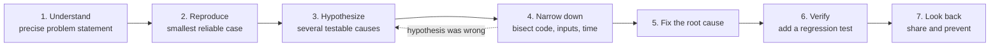

# How To Solve Problems Systematically

*Every hard bug has already surrendered its secret to someone who asked the right question in the right order — the discipline is knowing what order that is.*

---

> *“Everyone knows that debugging is twice as hard as writing a program in the first place. So if you're as clever as you can be when you write it, how will you ever debug it?”*
>
> — **Brian Kernighan**, *The Elements of Programming Style* (with P. J. Plauger), 2nd edition, 1978

## At a Glance

> **In one sentence:** Systematic problem solving replaces guessing with a repeatable loop: understand the problem precisely, reproduce it, form testable hypotheses, narrow down with experiments, fix the root cause, and capture what you learned.

**You'll learn**

- Pólya's four phases adapted for software
- How to decompose a large, vague problem into solvable pieces
- Working backwards from symptoms to root cause
- Bisection (including git bisect) to find bugs in logarithmic time
- Rubber duck debugging and when to ask for help

**Before you start:** [How To Think Like An Engineer](How-To-Think-Like-An-Engineer.md)

**Reading time:** about 35 minutes

---

## The Big Picture



*Systematic problem solving is a loop with checkpoints — and when an experiment disproves a hypothesis, you go back and form a better one instead of guessing.*

---

## Introduction

It's 2 AM. A production payment service is throwing intermittent errors — maybe one request in every few hundred. The on-call engineer, Sam, has three options for how to spend the next hour. Option one: stare at the code that "seems related," making small changes and redeploying, hoping something sticks. Option two: escalate immediately, waking up three more engineers who now duplicate Sam's confusion. Option three: follow a method.

Sam picks the third option, not because it feels more comfortable at 2 AM — it doesn't — but because it's the only option with a track record of working when intuition runs out. Sam writes down, in one sentence, exactly what's failing and under what conditions. Sam checks whether the problem is reproducible. Sam looks for what changed recently. Sam forms one hypothesis, tests it cheaply, and either confirms or discards it before moving to the next. Forty minutes later, Sam has found that a new feature flag rollout coincided exactly with the error spike, isolates the flag, and resolves the incident — without waking anyone else up.

This is not a story about Sam being smarter than other engineers. It's a story about Sam having internalized a **method** — a repeatable sequence of steps that works whether the problem is a production incident, a failing algorithm, an ambiguous product requirement, or a design that "feels wrong" but you can't say why. Problem-solving methods are older than computing itself; software engineering inherited and adapted them, most explicitly through Hungarian mathematician George Pólya's 1945 book *How to Solve It*, written for mathematics students but strikingly applicable, almost unchanged, to debugging code eighty years later.

Systematic problem-solving is the difference between engineers who get faster at their jobs over time and engineers who stay stuck relying on luck, memorized patterns, and other people's help. It is a learnable, teachable skill — and, unlike most technical skills, it doesn't expire when the technology stack changes underneath you.

### Why Should Engineers Care About Solving Problems Systematically

- **It compresses debugging time dramatically.** A method-driven investigation converges on root cause in a bounded, predictable number of steps; unguided trial-and-error has no such bound and can burn hours or days on problems a method would resolve in twenty minutes.
- **It works on problems you've never seen before.** Memorized solutions only help with familiar problems. A method generalizes to genuinely novel situations, which is precisely when you need it most.
- **It reduces the need to escalate or interrupt others.** Engineers who can systematically narrow down a problem before asking for help ask better, more specific questions — and often solve the problem before they need to ask at all.
- **It's a core interview and career-advancement skill.** "Tell me about a hard bug you solved" is really asking "do you have a method, or did you get lucky?" — interviewers and promotion committees are listening for the former.
- **It builds a durable, transferable skill.** Unlike knowledge of a specific framework or language, problem-solving method survives every technology transition of an entire career.

### Where This Shows Up

| Context | Example | Why Systematic Method Matters |
|---|---|---|
| Production incident response | Intermittent 500 errors under unknown conditions | Bounds investigation time and prevents panic-driven random changes |
| Algorithm design | Solving a novel coding interview or optimization problem | Pólya's framework maps directly onto algorithmic problem-solving |
| Debugging a failing test | A test fails only in CI, never locally | Systematic isolation of variables finds the actual difference |
| Requirements clarification | A vague product spec: "make search better" | Decomposition turns ambiguity into concrete, addressable sub-problems |
| Code review | Reviewing a PR that "feels wrong" | Working backwards from the symptom to the design flaw |
| Mentoring / pairing | Helping a junior engineer stuck on a bug | Teaching the method, not just giving the answer, builds their capability |
| Architecture design | Deciding how to scale a struggling system | Decomposition and root-cause analysis before jumping to a rewrite |

---

## The Problem It Solves

Software problems rarely announce their cause directly. A user reports "the app crashed" — this is a symptom, observed from far outside the system, disconnected from the actual mechanism (a null pointer three function calls deep, triggered only by a specific data condition). The gap between an observed symptom and its root cause can be enormous, and without a method for closing that gap, engineers default to guessing — which works, sometimes, by luck, but scales terribly with problem difficulty.

Systematic problem-solving exists to provide a **reliable process for closing the gap between "something is wrong" and "I know exactly why, and how to fix it"** — one that doesn't depend on having seen this exact problem before, doesn't depend on luck, and produces a bounded, predictable amount of work rather than open-ended flailing.

### What Happens Without This Skill?

- **Debugging becomes trial-and-error with no stopping condition.** Engineers make change after change, unsure whether any given change actually addressed the problem or coincidentally correlated with it going away.
- **The same bug gets "fixed" repeatedly.** Without root-cause analysis, symptom-level patches accumulate, and the underlying issue resurfaces in new forms.
- **Escalation happens too early or too late.** Without a method to bound how long independent investigation should reasonably take, engineers either interrupt colleagues prematurely (before doing basic due diligence) or struggle alone far longer than necessary (out of pride, or not recognizing when they're stuck).
- **Ambiguous problems never get properly decomposed.** A vague requirement like "make the app faster" stays vague, and engineers either freeze (unsure where to start) or start optimizing an arbitrary piece that may not matter.
- **Learning doesn't compound.** An engineer who solves problems by luck or by asking someone else doesn't build a reusable skill; an engineer who follows a method gets measurably better at debugging with every problem solved, because the method itself improves with practice.

---

## Historical Background

### 1945: George Pólya and *How to Solve It*

Hungarian mathematician **George Pólya**, a professor at Stanford, published *How to Solve It* in 1945, distilling decades of experience teaching mathematics into a compact, four-phase framework for solving problems: **Understand the problem, Devise a plan, Carry out the plan, Look back**. Though written for mathematical problem-solving, Pólya's framework was explicitly general — he intended it to teach a transferable way of thinking, not just a set of math tricks. It became one of the most influential books ever written on problem-solving pedagogy and remains in print, referenced across disciplines including computer science, engineering, and management, eight decades later.

### 1960s: Structured Programming and Problem Decomposition

As software systems grew beyond what any one person could hold in their head, **Edsger Dijkstra** and others promoted **structured programming** — breaking programs into small, well-defined, independently understandable units. This is decomposition (a core Pólya technique — "can you break this into smaller problems?") applied specifically to code structure, and it established decomposition as a foundational practice in software engineering, not just a general problem-solving nicety.

### 1970s: The Rise of Formal Debugging as a Discipline

Early debugging tools (symbolic debuggers allowing step-through execution, breakpoints, and memory inspection) emerged through the 1960s and 70s, notably with systems like **DDT** (Dynamic Debugging Technique, originally on DEC systems) and later more sophisticated tools. Their existence reflects a growing recognition that debugging deserved dedicated tooling and method, not just ad hoc print statements — a maturing of the "look back and verify" phase of Pólya's framework into concrete engineering practice.

### 1974: Fred Brooks and Decomposition at Project Scale

Fred Brooks's *The Mythical Man-Month* extended problem decomposition thinking from individual bugs to entire software projects, arguing that large software efforts must be decomposed into well-defined, minimally-coupled pieces of work — otherwise, the coordination overhead between people working on poorly separated pieces overwhelms the benefit of dividing the work at all. This is Pólya's "break the problem into sub-problems" applied at organizational scale.

### 1979: The Origin of "Rubber Duck Debugging"

The term is popularly traced to *The Pragmatic Programmer* (1999) by Andrew Hunt and David Thomas, who recounted a story (itself referencing an older folk technique) of a programmer who kept a rubber duck at his desk and would explain his code to it, line by line, when stuck — frequently finding the bug in the act of explaining it aloud, before the duck "responded" at all. The technique formalizes a real cognitive phenomenon: forcing yourself to articulate assumptions explicitly, out loud or in writing, exposes gaps in reasoning that silent, internal thought glosses over. While the exact origin predates the book (the technique circulated informally in programming culture earlier), *The Pragmatic Programmer* is what popularized the specific name and made it a widely recognized part of software engineering vocabulary.

### 1986: Fred Brooks's Essential vs. Accidental Complexity

As discussed in the previous chapter, Brooks's distinction between complexity inherent to a problem (essential) and complexity introduced by tooling and process (accidental) is directly useful in systematic problem-solving: it helps engineers ask, when a problem seems intractable, whether they're fighting the actual problem or fighting self-inflicted friction that a better process or tool could remove.

### 1999: *The Pragmatic Programmer* Popularizes Method-Driven Debugging

Hunt and Thomas's book codified numerous problem-solving heuristics that had circulated informally in engineering culture — "select by binary chop" (what we'd now call bisection, later automated by tools like `git bisect`), "don't assume it, prove it," and the rubber duck technique — into a widely-read, structured reference that shaped how a generation of engineers thought about debugging as a discipline distinct from just knowing the codebase well.

### 2000s: `git bisect` and Automated Bisection Debugging

As distributed version control (and Git specifically, released by Linus Torvalds in 2005) became standard, **bisection debugging** — a binary search over the history of commits to find exactly which change introduced a regression — became a built-in, automatable tool (`git bisect`) rather than a manual technique. This represents systematic problem-solving being encoded directly into tooling: instead of an engineer manually applying "divide and conquer" to a bug hunt, the tool automates the decomposition.

---

## Core Concepts

### Pólya's Four-Phase Framework, Adapted for Software

| Pólya's Phase (1945) | Software Engineering Adaptation |
|---|---|
| **1. Understand the problem** | Precisely state the symptom, the expected behavior, and the actual behavior. Identify what you know versus what you're assuming. |
| **2. Devise a plan** | Choose an investigation strategy: bisection, working backwards from the symptom, forming and testing a hypothesis, or decomposing into sub-problems. |
| **3. Carry out the plan** | Execute the plan methodically, checking your work at each step rather than rushing to a conclusion. |
| **4. Look back** | Verify the fix actually addresses the root cause (not just the symptom), and ask what can be learned or generalized from this problem for the future. |

The critical, often-skipped phase is the fourth. Many engineers stop the moment the symptom disappears, without confirming *why* it disappeared or whether the same underlying issue could resurface elsewhere.

### Problem Decomposition

**Decomposition** means breaking a large, intractable problem into smaller sub-problems that are individually easier to solve — and, critically, that can be solved somewhat independently.

```
Vague problem: "The checkout page is slow"

Decomposed:
├── Is the slowness in the browser (rendering) or the server (response time)?
│   ├── If browser: which resource is blocking? (JS bundle size? Layout thrashing?)
│   └── If server: which part of the request handling is slow?
│       ├── Database queries?
│       ├── External API calls (payment gateway)?
│       └── Application logic (serialization, computation)?
```

Each leaf in this decomposition tree is a much smaller, more tractable problem than "the checkout page is slow" — and each can often be investigated independently, in parallel if multiple engineers are involved.

### Working Backwards From Symptoms to Root Cause

Instead of starting from "what could be wrong" (forward reasoning, which has too many possible starting points), working backwards starts from the observed symptom and asks what *must* be true for that symptom to occur, narrowing the space of possible causes at each step.

```
Symptom: User sees "Payment Failed" error

Working backwards:
"Payment Failed" is shown  ←  requires  ←  the payment API returned an error
                                              or the payment API call timed out
                                              or the response was malformed
                                              
→ Check: did the payment API actually return an error? (Check logs)
  → Yes, it returned error code 429 (rate limited)
    → Working backwards further: why is the client being rate limited?
      → Check: has request volume to this API increased?
        → Yes — a new retry policy deployed yesterday is causing 3x more calls
```

This is fundamentally different from guessing "maybe it's the network, let me check that" — each step is derived logically from what must be true for the previous step to hold, rather than pattern-matched from past experience.

### Bisection / Divide and Conquer for Debugging

When a regression has been introduced somewhere in a large space (a range of commits, a large input, a long sequence of operations), **bisection** finds the exact point of failure in logarithmic time by repeatedly testing the midpoint and discarding half the remaining search space.

```
Known good: commit #1000 (last known working state)
Known bad:  commit #1200 (currently broken)

Bisection:
Test #1100 (midpoint) → bad → problem is in #1000-#1100
Test #1050 (midpoint of remaining range) → good → problem is in #1050-#1100
Test #1075 → bad → problem is in #1050-#1075
Test #1062 → good → problem is in #1062-#1075
... converges to the exact commit in ~log2(200) ≈ 8 tests, instead of 
    checking up to 200 commits one by one
```

The same divide-and-conquer principle applies beyond commit history: bisecting a large input to find which part triggers a parser bug, bisecting a long user session to find which action caused corrupted state, or bisecting a configuration file to find which setting causes a crash.

### The Scientific Method for Bug Hunting

As introduced in the previous chapter, applying the scientific method to debugging means treating each candidate explanation as a **falsifiable hypothesis**, not a guess to act on directly:

```
1. Observe the precise symptom (not "it's broken" — the specific failure, conditions, and data)
2. Form ONE specific, falsifiable hypothesis
3. Predict: if the hypothesis is true, what specific, checkable thing should be observed?
4. Run the smallest experiment that tests this prediction
5. If confirmed: narrow further, or confirm as root cause
   If refuted: discard the hypothesis and form a new one, informed by what you just learned
```

### Rubber Duck Debugging

**Rubber duck debugging** is the practice of explaining your problem, out loud or in writing, to another entity — a colleague, a rubber duck, or even just a text document — in complete, explicit sentences, including all the assumptions you're implicitly relying on. The mechanism behind why this works is well-understood in cognitive science: silent, internal reasoning allows you to skip over gaps and unstated assumptions that your brain fills in automatically; forcing yourself to state each step explicitly and in order exposes exactly those gaps, often revealing the bug before you've finished the explanation.

```
Internal (silent) reasoning:
"The function returns the wrong value... probably the loop... 
 or maybe the input... not sure, let me just try things"

Rubber duck (explicit) reasoning:
"This function takes a list of orders and returns the total.
 It loops through each order and adds order.total to a running sum.
 Wait — order.total... is that before or after tax?
 ...oh. It's before tax. But the caller expects the after-tax total.
 That's the bug — not a bug in this function at all, a mismatched
 contract between this function and its caller."
```

### When to Ask for Help

Systematic problem-solving includes explicitly knowing when independent investigation has run its useful course and escalation is the right next step — this is itself a skill, not a failure of the method.

| Signal | Interpretation |
|---|---|
| You've formed and tested 3+ specific hypotheses, all refuted | You may be missing context someone else has (domain knowledge, system history) |
| The problem's blast radius is growing while you investigate | Time cost of continued solo investigation may exceed the value of solving it alone |
| You can precisely state what you've ruled out and what you're unsure of | You're ready to ask a specific, high-value question, not a vague "can you help" |
| You haven't yet stated the problem in one precise sentence | You're not ready to ask for help yet — sharpen the problem statement first (this alone often resolves it) |

---

## Real-World Analogy

### The Mechanic Diagnosing a Car That "Makes a Noise"

A customer brings a car to a mechanic and says, "it makes a weird noise sometimes." An inexperienced mechanic might start replacing parts that could plausibly cause noises — belts, brakes, engine mounts — hoping to stumble onto the right one, racking up cost and time with no guarantee of success. This is the automotive equivalent of changing code at random and hoping the bug goes away.

An experienced mechanic follows a method that maps almost exactly onto Pólya's framework:

**Understand the problem.** Instead of accepting "makes a weird noise sometimes," the mechanic asks precise questions: When does the noise happen — accelerating, braking, turning? What does it sound like — a squeal, a clunk, a grinding? Is it constant or intermittent? This is exactly "precisely state the symptom" from the scientific-method framework — most of the diagnostic value comes from sharpening the problem statement, before any physical investigation begins.

**Devise a plan.** Based on the precise symptom (a clunking noise, only when turning left, only at low speed), the mechanic has a working hypothesis (something in the front-left suspension) and a plan: physically inspect that specific area rather than the whole car.

**Carry out the plan.** The mechanic inspects the front-left suspension components methodically — checking each part that could produce that specific noise under those specific conditions — narrowing down as they go, exactly like bisection over a smaller, well-defined search space instead of the entire vehicle.

**Look back.** After identifying and replacing a worn control arm bushing, the mechanic test-drives the car under the exact original conditions (turning left, low speed) to verify the noise is actually gone — not just assuming it's fixed because the part "looked worn." This is the verification step that distinguishes "the symptom happened to stop" from "I confirmed the root cause is resolved."

The mechanic's method isn't specific to cars — it's the same general method Sam used at 2 AM debugging the payment service, and the same method a mathematician uses to solve a proof. The domain changes; the shape of the reasoning process does not.

---

## How It Works In Practice

### Walkthrough: Applying the Method to a Realistic Bug

**The problem, as reported:** "Some users say the export-to-PDF feature produces a blank PDF. It works for me every time."

**Before — the unsystematic approach:**

```
Engineer opens the PDF export code, stares at it, doesn't see anything 
obviously wrong. Tries exporting a few PDFs locally — all work fine. 
Concludes "can't reproduce," closes the ticket. Two weeks later, the 
same bug is reported by five more users and reopened, now with 
frustrated users and no more information than before.
```

**After — applying the systematic method:**

**Phase 1: Understand the problem.**

Instead of accepting "some users" as sufficient detail, the engineer gathers specifics: How many users are affected (out of how many total)? Is there a pattern — browser, document size, content type, time of day? A review of support tickets reveals: all affected reports mention documents with embedded images, and several mention Safari specifically.

Precise problem statement (much better than the original): *"Exporting a document containing embedded images to PDF produces a blank PDF, specifically for users on Safari; documents without images export correctly on all browsers, and image-containing documents export correctly on Chrome and Firefox."*

**Phase 2: Devise a plan.**

The engineer now has a specific, testable hypothesis space rather than an open-ended one. Plan: reproduce the exact condition (Safari + image-containing document) locally, since local testing on Chrome couldn't reproduce it — the "can't reproduce" conclusion from before was based on an incomplete understanding of the actual conditions.

**Phase 3: Carry out the plan.**

Testing in Safari with an image-containing document reproduces the bug immediately. The engineer now applies working-backwards reasoning: a blank PDF, with images, on Safari specifically, suggests the PDF generation library's image-encoding step is failing silently in a Safari-specific code path. Checking the library's browser-compatibility notes reveals a known issue: the library uses a canvas-based image-encoding method that behaves differently under Safari's stricter security policy for cross-origin image data, silently failing rather than throwing a visible error.

**Phase 4: Look back.**

The engineer verifies the fix (switching to a compatible image-encoding approach) actually resolves the specific reproduced case, and additionally re-tests the previously-passing cases (Chrome/Firefox, no-image documents) to confirm the fix doesn't introduce a regression elsewhere — an explicit check that's easy to skip when you're relieved the bug is finally reproducible and fixed.

**Before/after comparison:**

| Property | Unsystematic Approach | Systematic Approach |
|---|---|---|
| Problem statement | "Some users report blank PDFs" | "Image-containing documents produce blank PDFs specifically on Safari" |
| Time to reproduce | Never reproduced; ticket closed as "can't reproduce" | Reproduced within the first targeted test |
| Root cause found | No | Yes — Safari-specific silent failure in image encoding |
| Verification | None; bug was never actually fixed | Confirmed fix resolves the reproduced case without regressing others |
| Recurrence | Bug reopened weeks later with more frustrated users | Resolved once, correctly |

---

## A Framework for Systematic Problem-Solving

A repeatable checklist, synthesizing Pólya's phases with software-specific techniques:

1. **Write the problem down in one precise sentence.** Include what's expected, what's actually happening, and under what conditions. If you can't do this yet, gathering more information is the actual next step — not investigation.
2. **Check reproducibility.** Can you make the problem happen on demand? If not, narrowing down the conditions under which it occurs is itself the first sub-problem to solve.
3. **Identify what changed.** If this worked before and doesn't now, what changed between then and now? (Code, data, configuration, environment, scale.) This is often the fastest path to a hypothesis.
4. **Decompose if the problem is large or vague.** Break it into smaller, more specific sub-problems that can be investigated somewhat independently.
5. **Form one specific, falsifiable hypothesis at a time.** Resist the urge to consider five possibilities simultaneously — test one, learn from the result, then move to the next.
6. **Choose the cheapest experiment that could disprove the hypothesis.** Don't reach for the most thorough test first; reach for the fastest one that gives real signal.
7. **Use bisection when the search space is large and orderable** (a range of commits, a large input, a long sequence of steps).
8. **Explain the problem out loud or in writing (rubber duck) if you're stuck** — often before asking anyone else, since the act of explaining frequently surfaces the answer.
9. **Know your escalation threshold in advance** — decide, before you start, roughly how long independent investigation should take before asking for help, and stick to it rather than either escalating prematurely or grinding alone indefinitely.
10. **Verify the fix addresses the root cause, not just the symptom** — re-test the original precise problem statement, and check whether the same class of bug exists elsewhere in the codebase.
11. **Look back — capture what you learned.** Would a different approach have found this faster? Is this worth a runbook entry, a test case, or a team-wide note so the next person doesn't start from zero?

---

## End-to-End Example: Priya Solves an Intermittent CI Failure

Priya, a backend engineer, is asked to look into a test that fails roughly once every 15 CI runs, always in the same test file, but with no consistent error message.

**Step 1 — Precise problem statement.** Priya reviews the last 10 failure logs rather than reacting to the first one she sees. She notices two distinct failure messages, not one — meaning this might be two separate bugs masquerading as one flaky test, not a single root cause. This single observation, made before any code investigation, reshapes the entire approach.

**Step 2 — Reproducibility.** Running the test suite locally 50 times in a row, Priya reproduces one of the two failure modes (a timeout) but not the other (an assertion mismatch). She decides to decompose: investigate the reproducible failure mode first, since it offers a faster feedback loop, and set the second aside as a separate problem.

**Step 3 — What changed.** Priya checks whether the flaky test file was recently modified, or whether a dependency it relies on changed. `git log` on the test file shows no recent changes — but a shared test-fixture module it imports was modified three weeks ago, right around when the flakiness reports started, based on `git blame` cross-referenced with the flaky-test tracking issue's creation date.

**Step 4 — Hypothesis and cheap experiment.** Priya's hypothesis: the fixture change introduced a shared, mutable object that isn't properly reset between test runs, causing occasional timing-dependent state leakage. The cheapest test: run just the two suspect tests back-to-back in the same process, repeatedly, and see if the failure rate increases compared to running them in isolation. It does — confirming the hypothesis without needing to read through the entire fixture module in detail first.

**Step 5 — Bisection for the second failure mode.** For the non-reproducible assertion-mismatch failure, Priya can't reproduce it locally, so bisection-by-commit-range doesn't directly apply. Instead, she uses a form of bisection over *conditions*: she adds detailed logging around the assertion and lets CI run, narrowing down — over several CI runs — exactly which intermediate value diverges from expectations when the failure occurs, converging on a separate, unrelated bug: a timezone-dependent date comparison that fails only when CI happens to run within a few minutes of midnight UTC.

**Step 6 — Rubber duck, applied to the second bug.** While writing up her findings for a teammate, Priya explains the timezone bug in a written summary — and in writing the explanation, notices that her proposed fix (converting to UTC before comparison) doesn't actually address the deeper issue: the code shouldn't be comparing dates using local server time at all, in any context, not just this test. This insight came directly from the discipline of writing the explanation out fully, not from additional investigation.

**Step 7 — Verify and look back.** Priya fixes both issues (the shared fixture state, and the timezone-dependent comparison), re-runs the previously-flaky tests 100 times each to confirm both failure modes are actually resolved, and — since the timezone bug pattern could exist elsewhere — greps the codebase for similar local-time date comparisons, finding and flagging two more instances for follow-up.

**Outcome:** What looked like one vague "flaky test" ticket was actually two distinct, unrelated bugs, correctly separated and diagnosed through decomposition rather than being treated (and mis-fixed) as a single issue. The systematic approach didn't just fix the reported symptom — it surfaced a broader pattern (unsafe local-time comparisons) worth fixing proactively elsewhere.

---

## Production Engineering Perspective

**Scalability of the practice across teams.** Systematic problem-solving scales well precisely because it's teachable — unlike raw intuition or years of tacit codebase familiarity, a method (Pólya's four phases, bisection, hypothesis testing) can be explicitly taught to new hires and applied by anyone, regardless of how long they've been on the team. Organizations that codify this (debugging guides, incident response runbooks structured around hypothesis testing) reduce their dependency on a handful of "bug whisperer" senior engineers.

**Reliability of decisions made this way.** A root cause found through systematic investigation is far more likely to be the *actual* root cause than one found by pattern-matching or lucky guessing — and a documented investigation (what was ruled out, what evidence supported the final conclusion) is auditable by others, which matters enormously for postmortems and for building institutional trust in incident resolutions.

**Effect on team performance.** Teams with strong systematic debugging norms resolve incidents faster on average, and — just as importantly — have a much lower rate of *recurring* incidents, because root causes rather than symptoms get fixed. Time-to-resolution metrics improve not because engineers type faster, but because the search space for "what's wrong" is narrowed methodically instead of explored randomly.

**Maintainability implications.** Bisection tooling (`git bisect` and analogous techniques) and hypothesis-driven investigation naturally produce better bug reports and postmortems — because the investigation itself generates a clear, ordered trail of evidence (what was tested, what was ruled out, what was confirmed) that becomes valuable documentation for the next person who encounters something similar.

**How this shows up in incident response specifically.** Mature incident response processes (structured around an incident commander, clear hypothesis tracking, and a written timeline) are, in effect, an organizational-scale application of Pólya's framework: understand the problem (what's actually failing, for whom, since when), devise a plan (what will we check first, who's checking what), carry it out (methodically, with results logged so people aren't duplicating each other's work), and look back (the postmortem, explicitly designed to capture what was learned).

---

## Tradeoffs

### Benefits of Systematic Problem-Solving

| Benefit | Explanation |
|---|---|
| **Bounded, predictable investigation time** | Reduces open-ended flailing; a method converges rather than wandering indefinitely |
| **Works on novel problems** | Doesn't depend on having seen the exact issue before |
| **Produces auditable reasoning** | Investigation trail can be reviewed, shared, and learned from by others |
| **Compounds with practice** | Unlike memorized solutions, the method itself improves the more it's used |
| **Reduces unnecessary escalation** | Engineers can rule out more before interrupting colleagues, and ask sharper questions when they do |

### Drawbacks and Costs

| Drawback | Explanation |
|---|---|
| **Slower for trivially simple problems** | Applying full method to an obvious, one-line typo bug is unnecessary overhead |
| **Requires discipline under pressure** | Easy to abandon method and start guessing when stressed (e.g., during a live incident) — precisely when discipline matters most |
| **Decomposition itself takes skill** | Poorly chosen decomposition boundaries can create sub-problems that are still too large or miss the actual interaction between parts |
| **Bisection requires a reliable reproduction or ordering** | Doesn't directly apply to problems that can't be reliably reproduced or placed on an ordered axis (like commit history) |

### Limitations

- Systematic methods assume the problem is at least partially reproducible or decomposable; some issues (rare race conditions, hardware-dependent failures, problems dependent on exact production-scale load) resist controlled investigation no matter how disciplined the process.
- The method reduces but does not eliminate the need for domain expertise — knowing *what* to hypothesize still benefits enormously from understanding the system, even if the process of testing hypotheses is domain-independent.
- Pólya's framework was designed for problems with a discoverable, single correct answer; some engineering problems (design tradeoffs, ambiguous requirements) don't have a single "root cause" to converge on, and the method needs adaptation (more emphasis on decomposition and explicit tradeoff framing, less on a singular "solution").

### Alternatives / Complementary Approaches

| Approach | When to Use |
|---|---|
| **Pattern matching against known issues** | Fast for familiar, previously-seen problems — don't re-derive from scratch what you already know |
| **Pair debugging / mob debugging** | Effective when a problem resists individual hypothesis generation, or when the domain knowledge needed is distributed across several people |
| **Statistical / data-driven investigation** | For problems too complex or too rare to bisect cleanly, correlating across many production data points (logs, metrics) may surface a pattern faster than sequential hypothesis testing |
| **Chaos engineering / proactive fault injection** | For finding failure modes before they occur naturally, rather than reactively debugging after the fact |

### When This Approach Is NOT Appropriate

- For trivial, immediately obvious bugs (an unambiguous typo, a clearly misspelled variable name) — applying a full formal method is disproportionate overhead.
- In a live incident where the blast radius is growing rapidly and a known, safe mitigation (rollback, failover) is available — apply the mitigation first, then investigate root cause afterward, rather than insisting on full understanding before acting.
- When the "problem" is actually a design or requirements ambiguity rather than a bug — decomposition still helps, but hypothesis-testing and bisection don't directly apply; stakeholder conversation and explicit tradeoff framing are the right tools instead.

---

## Common Mistakes

### Beginner Mistakes

1. **Skipping "understand the problem" and jumping straight to code changes.** Starting to edit code before writing down a precise statement of the actual symptom and expected behavior.
2. **Testing multiple hypotheses simultaneously.** Changing several things at once "to be safe," making it impossible to know which change actually mattered when the symptom disappears.
3. **Treating "can't reproduce" as a dead end rather than a sub-problem.** Giving up on investigation when reproduction fails, instead of treating "find the specific conditions that trigger this" as the next problem to decompose and solve.

### Intermediate Mistakes

4. **Decomposing along the wrong boundaries.** Splitting a problem into sub-problems that don't actually correspond to independent parts of the system, missing an interaction between them that only shows up when they're considered together.
5. **Not using bisection when it clearly applies.** Manually checking commits one at a time, in order, for a regression, instead of using binary search (`git bisect` or manual equivalent) to find it in logarithmic rather than linear time.
6. **Confirming a hypothesis loosely instead of testing it precisely.** Accepting a hypothesis because it "seems to fit" the evidence, without designing a specific experiment that could have disproven it.

### Senior-Level Architectural Mistakes

7. **Not building the "look back" phase into team process.** Solving problems methodically as an individual, but never capturing what was learned into documentation, runbooks, or tests — so the same investigation has to be repeated by someone else later.
8. **Over-indexing on a single problem-solving technique.** Applying bisection or hypothesis-testing rigidly to problems better suited to decomposition or data-driven statistical analysis, because it's the technique the engineer is most comfortable with rather than the one that fits the problem.
9. **Failing to teach the method, only the answer.** Senior engineers who solve a junior's problem for them, rather than walking through the method that found the solution, produce short-term relief but no compounding improvement in the team's collective debugging capability.

---

## Failure Scenarios

### Scenario 1: Guessing Instead of Hypothesis Testing, in a Production Incident

**What happens:** A service starts returning errors under load. An engineer, under pressure, tries several unrelated changes in quick succession (restarting instances, increasing timeouts, rolling back the last two deploys) without confirming which one, if any, actually addressed the problem. The errors eventually stop, but no one knows why, and the same errors recur a week later under similar load.

**Why it fails:** Multiple simultaneous, untested changes make it impossible to identify the actual cause. The team gets a temporary reprieve but doesn't understand the mechanism, so the same conditions cause the same failure to recur.

**How to recognize it:** A resolved incident whose postmortem can't state, with confidence, exactly which change fixed the problem and why.

**How to fix it:** Even under time pressure, apply changes one at a time where possible (or, if simultaneous action is necessary for speed, explicitly note this as an "unclear which change worked" gap requiring targeted follow-up investigation afterward, rather than closing the incident as fully understood).

### Scenario 2: Reproduction Never Attempted, Bug Closed as "Can't Reproduce"

**What happens:** A user-reported bug is investigated briefly, doesn't reproduce on the engineer's machine under default conditions, and is closed. The same bug is reported by dozens more users over the following months, each report closed the same way, because no one treats "find the specific reproducing conditions" as a problem worth decomposing and solving in its own right.

**Why it fails:** "Can't reproduce" was treated as a conclusion rather than as an intermediate, unsolved sub-problem — narrowing down the specific conditions that trigger the bug.

**How to recognize it:** A pattern of repeatedly-reported, repeatedly-closed tickets describing what is, on closer inspection of the aggregate reports, the same underlying issue.

**How to fix it:** When multiple reports describe similar symptoms, aggregate them explicitly (as in the PDF export example earlier in this chapter) and look for the pattern across reports — often the reproducing condition emerges only when several data points are considered together, not from any single report in isolation.

### Scenario 3: Decomposing Along the Wrong Boundary

**What happens:** A performance investigation is split between two engineers: one investigates "is the database slow," the other investigates "is the application code slow." Both conclude their piece is fine in isolation. The actual problem is an interaction — the application code makes an excessive number of small, individually-fast database queries (an N+1 pattern) that together produce significant slowness, invisible to either investigation performed independently.

**Why it fails:** The decomposition boundary split the investigation exactly along the seam where the actual bug lives — the interaction between application logic and database access pattern — so neither half of the investigation could see it.

**How to recognize it:** Each decomposed sub-investigation reports "this part is fine" but the overall symptom persists, suggesting the problem lives at the boundary or interaction between the decomposed pieces, not within any single piece.

**How to fix it:** When individually-investigated sub-problems all come back clean but the overall symptom remains, explicitly investigate the *interfaces and interactions* between the decomposed pieces, not just the pieces themselves — often by re-decomposing along a different boundary (e.g., "requests with N items" vs. "requests with 1 item" instead of "database" vs. "application").

### Scenario 4: Skipping "Look Back," Losing Institutional Knowledge

**What happens:** A senior engineer spends two days tracking down a subtle race condition in a concurrency-heavy module, fixes it, and moves on to the next task without writing anything down. Eight months later, after that engineer has left the company, a different engineer spends three days rediscovering the exact same class of bug in a related module, because the pattern (and the reasoning that found it) was never captured anywhere.

**Why it fails:** The individual applied the method correctly and solved the problem, but the team-level "look back" — capturing the reusable insight, not just fixing the instance — never happened, so the investment in solving the problem the first time didn't compound for the organization.

**How to recognize it:** Recurring investigation of structurally similar bugs across different parts of a codebase, each investigated as if from scratch, with no shared documentation connecting them.

**How to fix it:** Build "look back" explicitly into the definition of done for non-trivial bug fixes — a short written note (in the PR description, a wiki, or a runbook) capturing not just what was fixed, but the reasoning that found it and where else the same pattern might apply.

---

## Practical Exercises

**Exercise 1 — Precise problem statements.** Take the following vague bug reports and rewrite each as a precise, falsifiable problem statement, listing what additional information you'd need to gather first: (a) "the app is slow," (b) "sometimes login doesn't work," (c) "the report looks wrong."

**Exercise 2 — Bisection practice.** You have a list of 1,000 commits, and you know commit #1 was working and commit #1000 is broken. Using binary bisection, what is the maximum number of tests needed to find the exact breaking commit? Show the sequence of midpoints you'd test if the breaking commit turned out to be #613.

**Exercise 3 — Decomposition exercise.** A user reports: "Sometimes when I upload a large file, the app crashes, but only on my phone, not my laptop." Decompose this into a tree of sub-problems (similar to the checkout-page example in this chapter) that would guide a systematic investigation.

**Exercise 4 — Rubber duck writeup.** Pick a piece of code you've written recently (or a hypothetical function). Write a full, explicit, line-by-line explanation of what it does and why, as if explaining it to someone with no context — the way you would to a rubber duck. Note any point where writing the explanation revealed an assumption you hadn't previously stated to yourself.

```python
# Exercise 5 — Working backwards from a symptom.
# 
# Symptom: calling `get_average_order_value(customer_id)` sometimes 
# raises a ZeroDivisionError, but only for some customers.
#
# Work backwards: what must be true about the customer's data for this
# function to divide by zero? Write out the chain of reasoning, then
# identify the specific root cause and propose a fix.

def get_average_order_value(customer_id):
    orders = get_orders_for_customer(customer_id)
    total = sum(order.value for order in orders)
    return total / len(orders)
```

**Exercise 6 — Escalation threshold.** Write a short personal policy (3-4 sentences) for yourself: under what specific conditions would you escalate or ask for help versus continue independent investigation? Be concrete enough that you could apply this rule consistently rather than deciding case-by-case under stress.

---

## Frequently Asked Questions

**Q: Isn't systematic debugging just slower than experienced engineers' intuition?**

For familiar problems, experienced intuition (fast pattern-matching to previously-seen issues) is often genuinely faster, and that's fine — the method described here is most valuable precisely when intuition runs out, on novel or ambiguous problems. Experienced engineers use both: quick pattern-matching first, falling back to systematic method when that doesn't converge quickly.

**Q: How is Pólya's framework, written for math problems in 1945, actually applicable to modern software debugging?**

Pólya's framework is deliberately abstract — "understand the problem, devise a plan, carry it out, look back" doesn't depend on the domain being mathematics. A software bug is structurally similar to a math problem in the relevant sense: there's an initial unclear situation, a desired end state, and a gap between them that requires reasoning to close. The specific techniques within each phase (bisection, hypothesis testing, decomposition) are software-specific adaptations of the same general phases.

**Q: What's the actual difference between bisection and just "trying things until it works"?**

Bisection has a guaranteed convergence property — it provably narrows the search space by half with each test, converging on the answer in a bounded, predictable number of steps (logarithmic in the size of the search space). "Trying things" has no such guarantee — it can converge quickly by luck, or never converge at all, because there's no structural reason each attempt reduces the remaining possibility space.

**Q: When is it okay to skip the "look back" phase?**

For genuinely trivial fixes (an obvious typo, a one-line off-by-one error with no broader pattern), a full look-back is disproportionate. The judgment call is whether the bug represents a *pattern* that might recur elsewhere (worth documenting) versus a truly isolated, one-off mistake (not worth extensive documentation). When in doubt, a one-sentence note in the commit message or PR description is cheap insurance.

**Q: How do I decompose a problem I don't understand well enough to know how to split it up?**

Start with the crudest possible decomposition based on what you *do* know (e.g., "is this a client-side or server-side issue" for a web bug) even if it turns out to be wrong or too coarse — the act of testing a crude decomposition against reality usually reveals information that lets you refine it, which is itself part of the "devise a plan, carry it out" cycle, iterated.

**Q: Does this method apply to non-bug problems, like deciding on an architecture or evaluating a design?**

Yes, with adaptation — decomposition and precise problem-statement-writing apply directly (break "should we use microservices" into specific sub-questions about team size, deployment needs, and failure isolation requirements). Hypothesis-testing and bisection apply less directly since there's often no single "correct" answer to converge on; instead, the "look back" phase becomes explicit tradeoff articulation — documenting what was considered and why a particular choice was made.

---

## Interview Questions

### Beginner

**Q1: Walk me through your process when you encounter a bug you don't immediately understand.**

*Model answer:* First, I make sure I have a precise, specific description of the symptom — not "it's broken," but the exact conditions, inputs, and observed behavior versus expected behavior. Then I check whether I can reproduce it reliably; if not, narrowing down the reproducing conditions becomes the first thing to solve. Once I can reproduce it, I form one specific hypothesis about the cause, test it with the smallest experiment that could disprove it, and either confirm and narrow further, or discard it and form a new hypothesis based on what I learned. I don't consider it fixed until I've verified the actual root cause is addressed, not just that the visible symptom went away.

**Q2: What is bisection debugging, and when would you use it?**

*Model answer:* Bisection debugging uses binary search to find the exact source of a problem within an ordered range — most commonly, finding which commit introduced a regression by repeatedly testing the midpoint of the remaining range of commits and discarding the half that doesn't contain the bug. It converges in logarithmic time relative to the size of the range, which is dramatically faster than checking each commit one at a time. It's useful whenever the problem exists somewhere within an orderable sequence — commit history, a large input, or a long sequence of operations — and you can reliably test whether a given point in that sequence exhibits the bug.

**Q3: What is rubber duck debugging, and why does it actually work?**

*Model answer:* It's the practice of explaining your code or problem out loud, in full explicit detail, to another entity — traditionally a literal rubber duck on your desk. It works because silent, internal reasoning lets your brain skip over unstated assumptions and gaps in logic; forcing yourself to state every step explicitly, in order, as if to someone with no context, frequently exposes exactly those gaps — often revealing the bug in the middle of the explanation, before the "listener" (or anyone else) has said anything back.

### Intermediate

**Q4: Describe Pólya's four-phase problem-solving framework and how you'd map it onto debugging a production issue.**

*Model answer:* Pólya's phases are: understand the problem, devise a plan, carry out the plan, and look back. Mapped to debugging: understanding the problem means precisely characterizing the symptom and gathering the specific conditions under which it occurs, rather than accepting a vague report. Devising a plan means choosing an investigation strategy — bisection if there's an ordered search space, hypothesis testing if there's a specific mechanism to verify, decomposition if the problem is large or vague. Carrying out the plan means executing that strategy methodically, testing one hypothesis at a time. Looking back means verifying the fix actually addresses the root cause — not just that the symptom disappeared — and capturing any reusable insight for the team, so the investigation's value compounds beyond just this one instance.

**Q5: How do you decide when to escalate a problem to a colleague versus continuing to investigate alone?**

*Model answer:* I set a rough time or effort threshold in advance, rather than deciding in the moment under frustration. Signals that it's time to escalate: I've formed and tested multiple specific hypotheses and all were refuted, suggesting I might be missing context or domain knowledge someone else has; the problem's impact is actively growing while I investigate, making the time cost of continued solo work higher than the cost of interrupting someone; or, conversely, I notice I can't yet state the problem in one precise sentence — in which case the right next step is usually sharpening my own understanding first, since a vague question wastes both my time and the person I'd be asking.

**Q6: Give an example of decomposing a large or vague problem into sub-problems, and explain how you chose the decomposition boundaries.**

*Model answer:* For a report like "the app is slow," I'd first split by where the time is actually spent — client-side rendering versus server response time — using basic timing instrumentation (browser dev tools, server-side request logging) rather than guessing. I choose decomposition boundaries based on where I can independently test each piece — if server response time and client rendering time can be measured and reasoned about separately, that's a meaningful split. But I stay alert to the possibility that the actual issue lives at the boundary between decomposed pieces — for instance, an N+1 query pattern that looks fine when database query time and application logic are each individually "fast," but produces overall slowness through their combined interaction, which is a boundary the naive split can hide.

### Senior

**Q7: How would you build a culture on your team where systematic debugging skills are transferred, not just individually possessed by a few senior engineers?**

*Model answer:* I'd make the reasoning process visible, not just the outcome — encouraging engineers to document not only what fixed a bug, but the hypotheses considered and ruled out along the way, in PR descriptions or a shared debugging log. I'd pair junior engineers with senior engineers specifically during debugging sessions, narrating the method out loud (effectively rubber-duck debugging as a teaching tool) rather than the senior engineer silently solving it and handing over the answer. And I'd build "look back" into our definition of done for non-trivial bugs — a brief note on the reusable pattern, so institutional knowledge about recurring bug classes accumulates in documentation rather than living only in individual memory.

**Q8: A production incident is ongoing and getting worse. How do you balance the need for systematic root-cause investigation against the pressure to act immediately?**

*Model answer:* I separate mitigation from root-cause investigation as two parallel tracks with different urgency. If a known-safe mitigation exists (rollback to the last known-good deploy, failover to a healthy region, disabling a recently-changed feature flag), I apply it immediately to stop the bleeding, even before fully understanding the mechanism — this is a case where the cost of continued impact outweighs the value of doing this "properly" first. Root-cause investigation continues in parallel, ideally by a different person or after the immediate mitigation is in place, following the full systematic method, so that the postmortem can identify the actual mechanism rather than just noting "we rolled back and it went away," which risks the same issue recurring under different triggering conditions.

### Architecture / Leadership

**Q9: How do you evaluate, as a technical leader, whether a team's debugging and problem-solving practices are actually effective, versus just feeling effective because incidents eventually get resolved?**

*Model answer:* I'd look past resolution time alone and at recurrence rate — are the same classes of bugs reappearing in new forms, suggesting symptom-level fixes rather than root-cause fixes? I'd review a sample of postmortems for whether they identify a specific, falsifiable root cause with supporting evidence, versus a vague or unconfirmed explanation. I'd also look at how much debugging knowledge is concentrated in a small number of individuals versus captured in shared documentation and runbooks — a team that can only resolve certain classes of incidents when a specific senior engineer is available has a systematic-process gap, even if their historical resolution times look fine on paper.

**Q10: How would you apply Pólya's problem-solving framework to a non-bug engineering problem, like deciding on a system architecture for a new product?**

*Model answer:* Understand the problem: precisely state the actual requirements and constraints — expected scale, team size, latency requirements, consistency needs — rather than jumping to a familiar architecture out of habit. Devise a plan: identify a small number of candidate architectures and the specific criteria that would favor each one, treating this like generating multiple hypotheses rather than committing to the first idea. Carry out the plan: evaluate each candidate against the stated constraints methodically — prototyping or estimating where uncertainty is high, rather than relying purely on intuition. Look back: after the decision, explicitly document the tradeoffs considered and why the chosen option won, both so the decision can be revisited if constraints change, and so the reasoning — not just the conclusion — is available to the team going forward.

---

## Test Yourself

*Answer each question in your head or on paper first, then open the answer to check.*

<details markdown="1">
<summary><strong>1. What are Pólya's four phases of problem solving?</strong></summary>

1. **Understand** the problem.
2. **Devise a plan.**
3. **Carry out** the plan.
4. **Look back** — check the result and learn from it.

In software, "look back" includes tests, postmortems, and sharing the fix.

</details>

<details markdown="1">
<summary><strong>2. You have 1,000 commits: the first works, the last is broken. At most how many tests does bisection need?</strong></summary>

About **10**, because 2¹⁰ = 1,024. Each test halves the remaining range. `git bisect` automates exactly this.

</details>

<details markdown="1">
<summary><strong>3. Why is reproducing a bug so important before fixing it?</strong></summary>

Without a reliable reproduction, you can't confirm the cause or verify that your fix works. "It stopped happening" might just mean the conditions changed. A reproduction also becomes a regression test.

</details>

<details markdown="1">
<summary><strong>4. What is the difference between a symptom and a root cause?</strong></summary>

A symptom is what you observe ("checkout times out"). A root cause is the underlying mechanism that produces it ("an N+1 query that only appears with more than 50 cart items"). Fixing symptoms makes problems return; fixing root causes makes them go away.

</details>

<details markdown="1">
<summary><strong>5. Why does rubber duck debugging work?</strong></summary>

Explaining code line by line forces you to state assumptions you had been skipping over. The mismatch between what you *say* the code does and what it *actually* does often reveals the bug — no duck (or person) needs to reply.

</details>

<details markdown="1">
<summary><strong>6. When should you ask for help instead of continuing alone?</strong></summary>

When you've stopped making progress (no new hypotheses or evidence for a set period), when the problem is in an area someone else knows well, or when the impact is high and time matters. Bring a precise summary of what you've tried.

</details>

<details markdown="1">
<summary><strong>7. What does "decomposing along the wrong boundary" mean?</strong></summary>

Splitting a problem in a way that doesn't match where the cause could be — e.g., investigating frontend vs. backend when the real split is "large files vs. small files." Good decomposition follows the evidence, not the org chart.

</details>

---

## Cheat Sheet

| Step | Do this | Avoid this |
|------|--------|-----------|
| 1. Understand | Write a precise problem statement with exact symptoms | "It's slow sometimes" |
| 2. Reproduce | Find the smallest reliable reproduction | Fixing what you can't see |
| 3. Hypothesize | List several falsifiable causes | Anchoring on the first idea |
| 4. Narrow down | Bisect: code, commits, inputs, time | Changing many things at once |
| 5. Fix | Address the root cause | Suppressing the symptom |
| 6. Verify | Add a regression test; confirm in real conditions | "Works on my machine" |
| 7. Look back | Document, share, fix similar spots | Moving on without learning |

**Bisection math:** N possibilities → about log₂(N) tests. 1,000 → 10 · 1,000,000 → 20.

**Useful tools:** `git bisect`, debuggers, logging with request IDs, feature flags, minimal test cases.

---

## In the AI Era

A systematic process is the difference between using AI as an accelerator and using it as a slot machine ("regenerate until something works").

AI fits into each stage of problem solving — with a distinct risk at each:

| Stage | How AI helps | What to guard against |
|-------|-------------|----------------------|
| Understand the problem | Restate the problem, list hidden assumptions, ask clarifying questions | Letting the model silently fill in requirements you never stated |
| Reproduce | Draft a minimal reproduction script or failing test | Skipping reproduction because the model "already knows" the cause |
| Hypothesize | Brainstorm many candidate causes quickly | Anchoring on the first, most confident-sounding explanation |
| Experiment | Write the instrumentation, logging, or test harness | Accepting the model's prediction of the result instead of running it |
| Fix | Draft the change | Fixing the symptom it was shown, not the root cause |
| Verify | Generate additional test cases | Tests that assert whatever the buggy code already does |

**The most important rule:** the AI never replaces the *reproduction* and *verification* steps. Those are where reality gets a vote.

A useful prompt shape that keeps you in control:

```
Here is the symptom: <exact error, inputs, environment>.
Here is what I have already ruled out: <list, with evidence>.
List 5 hypotheses ranked by likelihood. For each one, tell me
the cheapest experiment that would disprove it.
```

Notice what this prompt does: it forces precision about the symptom, records evidence, asks for *falsifiable* hypotheses, and keeps experimentation in your hands.

**Try it:** Next time you hit a bug, write the prompt above *before* asking an assistant anything. Often, writing down what you've ruled out is enough to solve the problem yourself — the classic rubber-duck effect, now with a duck that talks back.

---

## Key Takeaways

1. Systematic problem-solving closes the gap between an observed symptom and its root cause through a repeatable process, not luck or memorized patterns.
2. George Pólya's 1945 four-phase framework — understand the problem, devise a plan, carry out the plan, look back — maps directly onto modern software debugging, eighty years after it was written for mathematics.
3. Precisely stating the problem (specific conditions, expected vs. actual behavior) is often the highest-leverage step, and is frequently skipped in favor of jumping straight to investigation.
4. Working backwards from a symptom — asking what must be true for the symptom to occur — narrows the hypothesis space more efficiently than forward guessing.
5. Bisection (binary search over an ordered space, such as commit history) converges on a root cause in logarithmic time, dramatically faster than linear, one-at-a-time checking.
6. Rubber duck debugging works because explaining a problem explicitly, out loud or in writing, exposes unstated assumptions that silent internal reasoning skips over.
7. The scientific method — one falsifiable hypothesis at a time, tested with the cheapest experiment that could disprove it — prevents the common failure of confirming a hypothesis loosely rather than rigorously.
8. Knowing when to escalate is part of the method, not a failure of it — a precise problem statement and a record of ruled-out hypotheses make for a much higher-value request for help.
9. The "look back" phase — verifying root cause, not just symptom disappearance, and capturing reusable insight — is the most commonly skipped step, and its absence is why the same bugs recur across a codebase or a team's history.
10. This method is domain-independent and durable: the same four phases apply to debugging a race condition, decomposing a vague product requirement, or evaluating an architecture decision.

---

## What to Read Next

- **[What Happens When You Press A Key](../02-How-Computers-Work/What-Happens-When-You-Press-A-Key.md)** — start learning the machine you'll be debugging
- **[Why Distributed Systems Are Hard](../05-Distributed-Systems/Why-Distributed-Systems-Are-Hard.md)** — where the hardest bugs to reproduce come from
- **[Evaluating AI Systems](../15-AI-Era-Engineering/Evaluating-AI-Systems.md)** — systematic problem solving for software that isn't deterministic

---

## Further Reading

### Foundational Texts / Papers

- George Pólya, *How to Solve It* (1945) — the foundational text for this entire chapter
- Fred Brooks, *The Mythical Man-Month* (1975) — decomposition applied at project scale
- Edsger Dijkstra, "Notes on Structured Programming" (1970): https://www.cs.utexas.edu/~EWD/ewd02xx/EWD249.PDF

### Academic Resources

- MIT 6.031 — Software Construction (includes debugging methodology): https://web.mit.edu/6.031/
- Stanford CS 103 — Mathematical Foundations of Computing (Pólya-style problem-solving applied to CS): https://web.stanford.edu/class/cs103/
- CMU 15-122 — Principles of Imperative Computation: https://www.cs.cmu.edu/~15122/

### Industry Engineering Blogs

- Google SRE Book — "Effective Troubleshooting" chapter: https://sre.google/sre-book/effective-troubleshooting/
- Julia Evans's blog (wizardzines.com) — extensive practical writing on systematic debugging: https://jvns.ca/
- Increment Magazine (Stripe) — "On-Call" and debugging-focused issues: https://increment.com/

### Books

- *How to Solve It* by George Pólya
- *The Pragmatic Programmer* by David Thomas and Andrew Hunt — rubber duck debugging, "select by binary chop," and other heuristics
- *Debugging: The 9 Indispensable Rules* by David J. Agans
- *Effective Debugging* by Diomidis Spinellis
- *The Mythical Man-Month* by Fred Brooks

### Videos / Talks

- "Debugging" talks from Strange Loop and similar conferences (widely available, search by conference archive)
- Julia Evans's conference talks on debugging practice (available via her site and YouTube)

---

*This chapter is part of the Software Engineering Handbook — a comprehensive guide to the concepts, principles, and practices that every professional software engineer should know.*
