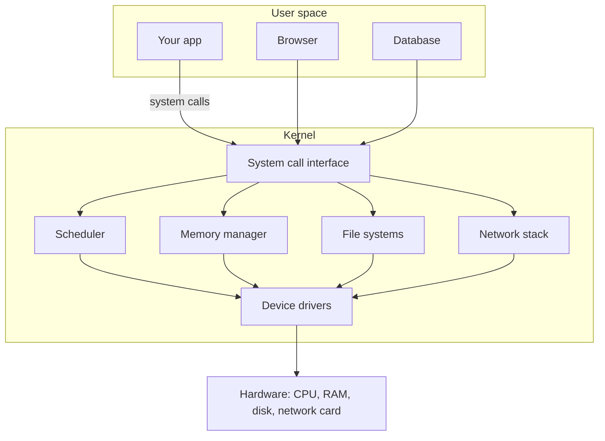

# How Operating Systems Work

*The invisible referee that turns one CPU, one bank of memory, and a pile of wires into something a thousand programs can share at once.*

---

> *“Write programs that do one thing and do it well. Write programs to work together. Write programs to handle text streams, because that is a universal interface.”*
>
> — **Doug McIlroy**, the Unix philosophy, as summarized in Peter H. Salus, *A Quarter Century of Unix*, 1994

## At a Glance

> **In one sentence:** An operating system is a resource manager: it shares CPUs, memory, files, and devices among many programs, isolates them from each other, and exposes it all through system calls.

**You'll learn**

- The kernel/user-space boundary and system calls
- Processes vs. threads, process states, and context switching
- How schedulers decide what runs next
- File descriptors, signals, and inter-process communication
- How containers are built from namespaces and cgroups
- Classic failures: fork bombs, descriptor exhaustion, zombies, OOM kills

**Before you start:** [How Memory Works](How-Memory-Works.md) · [How CPUs Execute Instructions](How-CPUs-Execute-Instructions.md)

**Reading time:** about 50 minutes

---

## The Big Picture



*Programs never touch hardware directly: they ask the kernel through system calls, and the kernel shares the machine among everyone.*

---

## Introduction

Imagine an office building with a single conference room but two hundred employees who all believe they have exclusive use of it, all day, every day. Somehow, every employee gets their meeting. Nobody notices the room was actually shared. Nobody double-books it into a shouting match. If someone throws a tantrum and refuses to leave, security removes them without damaging the room for the next tenant.

That impossible-sounding feat — one physical resource, an illusion of exclusive access, for hundreds of tenants, with security enforcing the rules — is exactly what an **operating system** does with your CPU, your memory, and your disk, thousands of times per second.

A modern laptop has somewhere between 4 and 16 CPU cores. At any given moment it might be running a web browser with 40 open tabs, a code editor, a music player, three background sync daemons, and a chat app — each program firmly convinced it owns the machine. The operating system is the layer of software that makes this illusion possible: it decides which program runs when, hands out memory without letting programs stomp on each other, mediates every request to touch the disk or the network, and cleans up after processes that misbehave or die.

**The operating system is not "the computer." It is the resource manager and referee that sits between your hardware and every program that wants to use it.**

### Why Should Engineers Care About Operating Systems

You can write code for years without ever thinking about the kernel — until the day your production service mysteriously slows down under load, a process leaks file descriptors until it can't open new connections, a container gets OOM-killed for reasons that make no sense from inside the container, or a `fork()` bomb takes down a shared build server. At that point, understanding the OS stops being academic.

Engineers who understand operating systems deeply can:

- Reason about why a thread context switch costs more than "just changing a register"
- Diagnose why a service is slow because of scheduler contention, not application code
- Understand why `read()` on a socket can block, and what that means for concurrency design
- Debug "too many open files" and "resource temporarily unavailable" errors quickly
- Understand what a container actually is (and, critically, what it is *not*) — namespaces and cgroups, not a virtual machine
- Make informed decisions about threads vs. processes vs. async I/O for a given workload
- Read a `strace` or `perf` trace and know what they're looking at

### Where Is This Used

| Context | Example | Why the OS Matters |
|---|---|---|
| Every server you deploy to | Linux (Ubuntu, Debian, Amazon Linux) | Schedules your app's threads, manages its memory, serves its network I/O |
| Every laptop and desktop | Windows, macOS, Linux | Multitasks dozens of apps on a handful of CPU cores |
| Containers | Docker, Kubernetes pods | Built entirely from Linux namespaces and cgroups — no separate kernel |
| Mobile devices | Android (Linux-based), iOS (XNU-based) | Battery-aware scheduling, strict process sandboxing |
| Embedded / real-time systems | FreeRTOS, VxWorks | Deterministic scheduling for cars, medical devices, spacecraft |
| Cloud hypervisors | AWS Nitro, VMware ESXi | A specialized OS-like layer that virtualizes hardware for guest OSes |
| Databases | PostgreSQL, MySQL | Ultimately just processes competing for the same OS-managed CPU, memory, and I/O |

---

## The Problem It Solves

### The Fundamental Challenge: One Machine, Many Programs

A computer has a fixed amount of hardware: some number of CPU cores, a fixed amount of RAM, one or more disks, and one or more network interfaces. Every program that runs wants to use the CPU, wants memory to store its data, and wants to read and write files or talk over the network.

Without an operating system, a program running directly on hardware (like early PC software, or a microcontroller with no OS) has *unrestricted, exclusive* access to everything. That works fine for a single program with no neighbors. It falls apart the moment you want to run more than one thing at a time, or want to prevent a buggy or malicious program from wrecking the whole machine.

### The Problem Before General-Purpose Operating Systems

In the earliest computers (1940s–1950s), there was no OS at all. An operator loaded a program (often via punch cards), it ran to completion using 100% of the machine, and then the operator loaded the next one. This was called **batch processing**, and it had brutal consequences:

- If a program had a bug and looped forever, the entire (extremely expensive) machine sat idle, wasting hours of rental time
- Programs could freely read and write any memory address, including the operating software's own code
- There was no way to run a second job "in the background" while the first waited for a slow tape drive to spin up
- Every programmer had to personally understand the exact hardware — printer codes, drum memory addresses, tape formats

### What Happens Without This?

If you strip away the OS's guarantees, here is what breaks, concretely:

1. **No CPU sharing** — one runaway `while(true)` loop in any program freezes the entire machine, because there is no scheduler to interrupt it and give the CPU to something else.
2. **No memory isolation** — any program can read or overwrite any other program's memory, including the kernel's own memory. A single null-pointer bug in one process could corrupt the browser, the OS, or a background financial job running on the same machine.
3. **No standard I/O interface** — every program would need to speak the raw protocol of the exact disk controller and network card installed in that specific machine. Software would not be portable across hardware.
4. **No process cleanup** — a crashed program would leave its allocated memory and open hardware resources locked forever, until a human power-cycled the machine.
5. **No security boundary** — any process could impersonate any user, read any file, or take control of any peripheral, because there is no concept of "privilege" enforced by anything below the application layer.

The operating system exists specifically to solve these five problems: **share the CPU fairly (scheduling), isolate memory (virtual memory + protection), standardize hardware access (system calls + drivers), reclaim resources on exit (process lifecycle), and enforce a privilege boundary (kernel/userspace separation).**

---

## Historical Background

### 1950s: Batch Processing Systems

Early mainframes like the **IBM 704** and **IBM 7090** ran one job at a time under human operator control. **General Motors Research** and **North American Aviation** developed **GM-NAA I/O** (1956), one of the first true batch-processing "monitor" programs — a primitive precursor to an OS that automatically sequenced jobs without a human reloading cards between each one. This was the first software that could reasonably be called an "operating system," even though it did nothing resembling multitasking.

### 1961–1965: Time-Sharing and Multics

MIT's **Fernando Corbató** led the **Compatible Time-Sharing System (CTSS)** at MIT in 1961, proving that multiple users could interactively share one mainframe by rapidly switching between them — the seed of the scheduling ideas every modern OS still uses.

Building on that, in 1965, **MIT, Bell Labs, and General Electric** jointly began **Multics** (Multiplexed Information and Computing Service), an ambitious project to build a general-purpose time-sharing OS with hierarchical file systems, dynamic linking, and fine-grained security rings. Multics was hugely influential but complex and commercially difficult; Bell Labs withdrew from the project in 1969.

### 1969: Unix Is Born

Two Bell Labs researchers who had worked on Multics, **Ken Thompson** and **Dennis Ritchie**, took Multics's best ideas and rebuilt them radically simplified on a spare **PDP-7** minicomputer. The result, first running in 1969, was **Unix** — a pun on "Multics" reflecting its "do one thing well" philosophy: a hierarchical filesystem, the process model (`fork`/`exec`), and the idea that "everything is a file."

### 1973: The C Rewrite

Originally written in assembly, Unix was rewritten in 1973 in **C**, a language Ritchie designed specifically to make this possible. This was the pivotal moment for portability: Unix could now be recompiled for different hardware architectures instead of being rewritten from scratch, which is why C and Unix-family design still dominate systems programming half a century later.

### 1977–1990s: BSD and the Unix Wars

The **University of California, Berkeley**, led by graduate student **Bill Joy**, produced the **Berkeley Software Distribution (BSD)** starting in 1977, adding virtual memory, TCP/IP networking (the implementation most of the early internet ran on), and the `vi` editor. Commercial variants (AT&T System V, Sun's SunOS, IBM's AIX, HP-UX) fragmented Unix through the 1980s, motivating standardization efforts like POSIX (1988).

### 1985–1993: Windows and Windows NT

Microsoft's **MS-DOS** (1981) was a simple, single-tasking OS with no memory protection. **Windows** began as a graphical shell on top of DOS in 1985. In 1988, Microsoft hired **Dave Cutler**, the chief architect of DEC's VMS operating system, to build a real, protected, multitasking kernel from scratch. The result, released in **1993**, was **Windows NT** — the first Windows kernel with proper virtual memory, preemptive multitasking, and a hardware abstraction layer. Every modern Windows release (including Windows 10 and 11) is still built on the NT kernel lineage.

### 1991: Linux

A 21-year-old Finnish student, **Linus Torvalds**, posted a message to the `comp.os.minix` newsgroup on August 25, 1991: *"I'm doing a (free) operating system (just a hobby, won't be big and professional like gnu) for 386(486) AT clones."* He released the **Linux** kernel under the GPL, and combined with the GNU userland tools (started by Richard Stallman in 1983), it became a complete free Unix-like operating system. Linux now runs the majority of the world's servers, all Android phones, and most public cloud infrastructure.

### 2001: Mac OS X and the Hybrid Kernel

Apple replaced the classic, cooperative-multitasking Mac OS with **Mac OS X** in 2001, built on **XNU** ("X is Not Unix"), a hybrid kernel combining the **Mach** microkernel (from Carnegie Mellon, 1985) with BSD components for the process and filesystem model. This hybrid design persists today across macOS and iOS.

### 2006–2008: cgroups and the Road to Containers

Engineers at **Google**, notably **Paul Menage and Rohit Seth**, developed **"process containers"** in 2006 to let Google limit and account for the CPU, memory, and I/O usage of groups of processes running on shared machines — the technology underpinning Google's internal cluster manager, **Borg**. The feature was merged into the mainline Linux kernel in **2007–2008** and renamed **cgroups** (control groups) to avoid confusion with the unrelated Linux "container" term. Combined with **namespaces** (a separate kernel feature developed over the 2000s for isolating process IDs, mounts, networking, and hostnames), cgroups gave Linux everything needed for lightweight process isolation without a hypervisor.

### 2013: Docker

**Docker**, released by dotCloud (later renamed Docker, Inc.) in **March 2013**, packaged Linux namespaces and cgroups behind a simple, user-friendly command-line tool and image format. Containers had existed in some form for years (Solaris Zones, FreeBSD Jails, LXC), but Docker's ease of use triggered an industry-wide shift toward container-based deployment, which in turn drove the creation of **Kubernetes** (Google, 2014) to orchestrate fleets of containers.

### Today

Modern operating systems are a synthesis of six decades of ideas: Multics's security rings, Unix's process and file model, BSD's networking stack, Windows NT's kernel architecture, and Google's cgroups — now the load-bearing infrastructure for every cloud service, phone, and container on earth.

---

## Core Concepts

### Kernel vs. Userspace

The single most important structural idea in OS design is the separation between **kernel space** and **user space**, enforced by the CPU hardware itself via **privilege rings** (or "protection rings").

```
      Ring 3 (least privileged)      Ring 0 (most privileged)
   ┌─────────────────────────┐    ┌──────────────────────┐
   │   USER SPACE             │    │   KERNEL SPACE        │
   │                           │    │                        │
   │  Your app's code          │    │  Scheduler             │
   │  Libraries (libc, etc.)   │    │  Memory manager        │
   │  Cannot directly touch    │    │  Device drivers        │
   │  hardware or other        │    │  Filesystem code       │
   │  processes' memory        │    │  Network stack         │
   └─────────────────────────┘    └──────────────────────┘
              │                                │
              └──────── syscall (trap) ────────┘
                  the ONLY sanctioned crossing point
```

x86 CPUs expose four privilege rings (0–3); in practice, almost every general-purpose OS uses only two: **ring 0** for the kernel and **ring 3** for user applications. Code running in ring 3 is physically prevented by the CPU from executing privileged instructions (like halting the CPU, remapping page tables, or directly issuing I/O instructions to a disk controller) or reading kernel memory. If a user-space program tries anyway, the CPU raises a hardware exception (a **general protection fault**) and the OS kills the offending process.

The only way for user-space code to ask the kernel to do something privileged — read a file, allocate memory, send a network packet — is through a well-defined, narrow doorway: the **system call**.

### Processes vs. Threads

| Property | Process | Thread |
|---|---|---|
| Definition | An instance of a running program, with its own address space | A unit of execution *within* a process, sharing that process's address space |
| Memory | Isolated — has its own virtual address space | Shared with all threads in the same process |
| Creation cost | Expensive (new page tables, copy-on-write memory) | Cheap (reuses parent's address space) |
| Communication | Requires IPC (pipes, sockets, shared memory) | Direct — shared variables (with locking) |
| Crash isolation | One process crashing does not affect another | One thread crashing (segfault) kills the whole process |
| Scheduling unit | The OS schedules threads, not processes directly | The actual unit the scheduler picks to run on a CPU core |
| Identifier | PID (Process ID) | TID (Thread ID); on Linux, threads are actually processes that share memory (`clone()` with shared flags) |

A process is a container: an address space, open file descriptors, signal handlers, and at least one thread of execution. A thread is that execution itself — a stack, a program counter, and CPU register state. A process with multiple threads is multiple independent "in-flight" execution paths all reading and writing the same shared memory.

### Process States

Every process (and every thread) moves through a well-defined state machine as the scheduler manages it:

```
                 ┌──────────┐
      created    │  NEW      │
     ───────────►│           │
                 └────┬─────┘
                      │ admitted
                      ▼
                 ┌──────────┐   scheduler dispatch    ┌──────────┐
                 │  READY    │────────────────────────►│ RUNNING   │
                 │(runnable, │◄────────────────────────│(on a CPU) │
                 │ waiting   │    preempted / time      └────┬─────┘
                 │ for CPU)  │    slice expired               │
                 └────▲─────┘                                 │ I/O request,
                      │                                        │ lock wait, sleep()
                      │ I/O / event                            ▼
                      │ completes                        ┌──────────┐
                      └───────────────────────────────────│ BLOCKED   │
                                                            │(waiting on│
                                                            │ I/O, lock,│
                                                            │ signal)   │
                                                            └──────────┘
                      RUNNING can also exit ──────────► TERMINATED (zombie until reaped)
```

- **NEW** — the process has been created (e.g., `fork()` returned) but not yet scheduled.
- **READY** — the process is runnable and waiting only for the scheduler to give it a CPU core.
- **RUNNING** — the process is actively executing on a CPU core right now.
- **BLOCKED** (or "waiting") — the process cannot proceed until an event occurs: a disk read completes, a socket has data, a mutex is released.
- **TERMINATED** — the process has called `exit()` or been killed; it becomes a **zombie** until its parent calls `wait()` to collect its exit status, at which point its process table entry is finally freed.

### Context Switching

A **context switch** is the mechanism that lets one CPU core run many processes/threads by rapidly swapping which one is "in" the CPU's registers.

To switch from thread A to thread B, the kernel must:

1. Save thread A's CPU register state (program counter, stack pointer, general-purpose registers, flags) into thread A's kernel-managed data structure (`task_struct` on Linux).
2. If switching between different **processes** (not just threads of the same process), also switch the memory-management context — reload the CPU's page-table base register (`CR3` on x86) so virtual addresses now resolve into the new process's address space.
3. Restore thread B's previously saved register state into the CPU.
4. Jump to thread B's saved program counter and resume execution as if nothing happened.

**The cost is real and non-trivial.** A context switch is not free:

| Cost component | Approximate magnitude | Why |
|---|---|---|
| Direct switch cost (register save/restore) | ~1–3 microseconds | A few dozen CPU instructions |
| TLB flush (cross-process switch) | Adds latency to every subsequent memory access until refilled | The Translation Lookaside Buffer caches virtual→physical address mappings *per address space*; switching processes usually invalidates it |
| Cache pollution | Can be the dominant cost, sometimes tens of microseconds | The new thread's working set evicts the old thread's data from L1/L2/L3 CPU caches, causing a burst of slow cache misses |
| Scheduler overhead | Sub-microsecond to low microseconds | Choosing which thread runs next |

This is precisely why thread-heavy designs (thousands of OS threads) can perform worse than event-loop or async designs under high concurrency: the CPU spends a measurable fraction of its time switching contexts rather than doing useful work, and cache locality degrades with every switch.

### Scheduling Algorithms

The **scheduler** is the kernel subsystem that decides, whenever a CPU core becomes free, which READY thread runs next.

| Algorithm | Idea | Strength | Weakness |
|---|---|---|---|
| **First-Come, First-Served (FCFS)** | Run threads in arrival order to completion | Simple, no starvation | A long-running thread blocks everything behind it ("convoy effect") |
| **Round Robin (RR)** | Each thread gets a fixed time slice ("quantum"), then is preempted and moved to the back of the queue | Fair, low worst-case wait, good interactivity | Too-short quantum wastes time on context switches; too-long quantum feels like FCFS |
| **Priority Scheduling** | Higher-priority threads always run before lower-priority ones | Lets the OS favor latency-sensitive work (audio, UI) | Low-priority threads can starve; solved with "priority aging" (gradually raising waiting threads' priority) |
| **Multilevel Feedback Queue (MLFQ)** | Multiple priority queues; a thread that uses its whole time slice (CPU-bound) is demoted to a lower-priority queue, while a thread that yields early (I/O-bound, interactive) stays high-priority | Automatically favors interactive/I/O-bound workloads without needing to know a thread's nature in advance | Complex to tune; classic Unix/BSD schedulers used variants of this for decades |
| **Completely Fair Scheduler (CFS)** | Linux's default scheduler (2.6.23, 2007). Tracks each thread's `vruntime` ("virtual runtime" — CPU time consumed, weighted by priority/"nice" value) in a red-black tree, and always picks the thread with the *lowest* vruntime to run next | Approximates an idealized "perfectly fair" processor-sharing model; O(log n) thread selection | Real-time-sensitive workloads may still need dedicated real-time scheduling classes (`SCHED_FIFO`, `SCHED_RR`) |

CFS deserves special attention because it is the scheduler running on the overwhelming majority of servers today. Instead of fixed time slices, CFS models an idealized CPU that could run every runnable thread simultaneously at an equal (or nice-value-weighted) rate, and measures how far each real thread has deviated from that ideal — the thread that has received the *least* CPU time relative to its fair share runs next. As of Linux 6.6 (2023), the default scheduler transitioned to **EEVDF** (Earliest Eligible Virtual Deadline First), which refines CFS's fairness model with explicit deadlines, but the underlying "track virtual runtime, run whoever is most behind" philosophy remains recognizable.

### System Calls

A **system call (syscall)** is the formal, controlled mechanism by which user-space code requests a privileged operation from the kernel. `read()`, `write()`, `open()`, `fork()`, `mmap()`, and `socket()` are all syscalls (or thin library wrappers around them).

```
User space:  process calls read(fd, buf, count)
                    │
                    ▼
            libc wrapper loads syscall number
            and arguments into registers,
            executes a trap instruction
            (SYSCALL on x86-64, historically INT 0x80)
                    │
                    ▼  ── CPU privilege switches from ring 3 to ring 0 ──
Kernel space:  CPU jumps to a fixed kernel entry point
                    │
                    ▼
            Kernel looks up syscall number in the
            syscall table (a big array of function
            pointers indexed by syscall number)
                    │
                    ▼
            sys_read() executes: validates fd,
            copies data from kernel buffers into
            the user buffer, returns byte count
                    │
                    ▼  ── CPU privilege switches back to ring 3 ──
User space:  read() returns, execution resumes
             in the calling process
```

The **syscall table** is simply an array in kernel memory where each syscall number (an integer — `read` is syscall number 0 on x86-64 Linux, `write` is 1, `open` is 2, and so on) maps to the kernel function that implements it. This is why syscall numbers must remain stable across kernel versions — user-space binaries are compiled against them.

Because a full ring-3-to-ring-0 trap has measurable overhead (typically 100–300 nanoseconds on modern hardware, more with Spectre/Meltdown mitigations enabled), Linux provides the **vDSO** (virtual Dynamic Shared Object) — a small piece of kernel-provided code mapped directly into every process's user-space address space. For syscalls whose results don't strictly require entering the kernel (most famously `gettimeofday()`/`clock_gettime()`, which just reads a kernel-updated timestamp), the vDSO lets user code get the answer *without* trapping into the kernel at all, turning a ~150ns syscall into a ~20ns function call.

### The OS as a Resource Manager

Strip away the terminology, and the operating system's job reduces to managing three resources on behalf of many competing consumers:

| Resource | What the OS abstracts | User-facing abstraction |
|---|---|---|
| **CPU** | Physical cores, register state, instruction pipelines | Processes and threads, each believing it has its own CPU |
| **Memory** | Physical RAM chips, addresses | Virtual address spaces — each process believes it owns the entire address range |
| **I/O (disk, network, devices)** | SATA/NVMe controllers, NICs, USB buses, GPUs | File descriptors, sockets, standardized `read()`/`write()` calls regardless of the underlying device |

### File Descriptors

A **file descriptor (fd)** is a small non-negative integer that a process uses to refer to an open "file" — which, in the Unix tradition, can be an actual file on disk, a network socket, a pipe, a terminal, or a device. Every process starts with three standard descriptors: `0` (stdin), `1` (stdout), `2` (stderr). The kernel maintains, per process, a table mapping each fd to an open file description (with its own read/write offset and flags), which in turn points to an in-kernel inode/object.

```
Process's fd table          Kernel's open file table       Underlying object
   0 ──────────────────►  [offset=0, flags=O_RDONLY]  ───► terminal (stdin)
   1 ──────────────────►  [offset=0, flags=O_WRONLY]  ───► terminal (stdout)
   2 ──────────────────►  [offset=0, flags=O_WRONLY]  ───► terminal (stderr)
   3 ──────────────────►  [offset=1024, flags=O_RDWR] ───► /var/log/app.log (inode 88213)
   4 ──────────────────►  [offset=0, flags=O_RDWR]    ───► TCP socket 10.0.1.5:443
```

File descriptors are a finite resource: each process has a limit (`ulimit -n`, often 1024 by default, frequently raised to 65536+ in production), and the whole system has a limit too. Failing to `close()` descriptors — a classic bug — leaks them until the process hits its limit and every subsequent `open()`/`socket()` call fails with `EMFILE`.

### Signals

**Signals** are the kernel's mechanism for asynchronous, software-level interrupts delivered to a process — a lightweight form of inter-process notification, distinct from syscalls (which a process *initiates*) because signals are delivered *to* a process, often from outside it.

| Signal | Number (typical Linux x86) | Default Action | Can be caught/ignored? |
|---|---|---|---|
| `SIGHUP` | 1 | Terminate | Yes |
| `SIGINT` | 2 | Terminate | Yes (this is what Ctrl+C sends) |
| `SIGKILL` | 9 | Terminate | **No — cannot be caught, blocked, or ignored** |
| `SIGSEGV` | 11 | Terminate + core dump | Yes (but risky to continue) |
| `SIGTERM` | 15 | Terminate | Yes (the "polite" kill, allows cleanup) |
| `SIGSTOP` | 19 | Stop process | **No — cannot be caught** |
| `SIGCONT` | 18 | Resume process | Yes |
| `SIGCHLD` | 17 | Ignored by default | Yes (used to detect child process exit) |

`SIGTERM` is a *request* — a well-behaved process installs a handler for it, flushes buffers, closes connections, and exits gracefully. `SIGKILL` is not a request; it is enforced directly by the kernel, which simply tears down the process's resources without giving it any chance to run its own code. This distinction matters enormously in production: Kubernetes sends `SIGTERM` first and waits a grace period (default 30 seconds) before escalating to `SIGKILL` — an application that ignores `SIGTERM` will always be forcibly killed, potentially mid-write.

### Containers: Namespaces and cgroups

A Linux **container** is not a separate virtual machine and does not run a separate kernel. It is a regular process (or group of processes) given a restricted view of the same running kernel, using two independent kernel features:

- **Namespaces** control *what a process can see*. Each namespace type virtualizes one global resource: the PID namespace gives a process its own view of process IDs (a containerized process might see itself as PID 1, unaware of the thousands of other processes on the host); the mount namespace gives it its own filesystem view; the network namespace gives it its own network interfaces, routing table, and port space; UTS, IPC, and user namespaces cover hostname, inter-process communication, and user/group ID mapping respectively.
- **cgroups** (control groups) control *how much a process can use*. A cgroup can cap CPU shares, limit memory (with the kernel's OOM killer enforcing the limit), throttle disk I/O bandwidth, and limit the number of processes a group can spawn.

Together: namespaces make the container *look* isolated, and cgroups make it *behave* like a bounded, well-mannered tenant on a shared host. This is the direct technical descendant of the OS's oldest job — resource management and isolation — applied at process granularity instead of requiring a whole separate kernel per tenant (which is what a VM does).

---

## Real-World Analogy

### The Hotel Manager

Think of an operating system as the manager of a large hotel with a finite number of rooms (memory), a finite number of elevators (CPU cores), and one reception desk that mediates every request to the outside world (I/O).

**Guests (processes) never touch the building's infrastructure directly.** A guest doesn't rewire the elevator control panel to make it come faster, and doesn't personally rekey the door locks. Instead, every request goes through the front desk (**system calls**): "Please send the elevator to floor 12," "Please deliver this package," "Please connect my call to room 402." The front desk validates the request, does the privileged work, and reports back — the guest never gets ring-0-equivalent access to the building's core systems.

**Room assignment is memory management.** Each guest is given a room number and firmly believes it is *their* room — but the hotel's internal map (**page tables**) actually tracks which physical room that number really points to, and can even move a guest to a different physical room without them noticing (this is exactly what happens during memory compaction or swapping — the guest's *virtual* room number 402 stays the same even if the *physical* room changes).

**The elevator schedule is CPU scheduling.** With 500 guests and 4 elevators, no guest gets an elevator to themselves all day. Instead, the hotel runs something like round robin or a fairness algorithm: each guest gets the elevator for a short ride, then it moves to the next request. A VIP guest with priority boarding is like a high-priority thread. A guest who steps in, requests a floor, and immediately steps out again (an I/O-bound thread that quickly blocks) doesn't clog the elevator the way a guest holding the doors for ten minutes (a CPU-bound thread) would — which is exactly the intuition behind the multilevel feedback queue favoring short, interactive bursts.

**A context switch is changing which guest the elevator serves.** Every time the elevator changes destination, there's real overhead — it has to stop, the doors open and close, someone gets on or off. That's not free time; it's overhead layered on top of the "useful work" of actually moving someone. Switch too rarely and guests wait too long; switch too often and the elevator spends more time opening and closing doors than moving.

**SIGKILL is the fire alarm; SIGTERM is a knock on the door.** If the front desk politely knocks and asks a guest to pack up and leave (`SIGTERM`), the guest can finish what they're doing, grab their belongings, and check out cleanly. If there's a fire (`SIGKILL`), security removes the guest immediately, with no chance to grab anything — the room is simply vacated by force.

**A container is a hotel guest given a suite that has been decorated to look like an entire private house.** The guest sees "their own" street address, "their own" doorbell, "their own" plumbing meter (namespaces) — but underneath, it's still one building, sharing one water main and one electrical grid, and the hotel management still caps how much water and electricity that suite can draw (cgroups). It is a much lighter-weight illusion of a private house than actually building a second house next door (a virtual machine, which has its own literal foundation — a separate kernel).

---

## How It Works Internally

### The Context Switch Sequence, Step by Step

```
Thread A running on CPU core 0
        │
        ▼
[1] Timer interrupt fires (hardware clock, e.g. every 1-4ms)
        │
        ▼
[2] CPU automatically traps into the kernel's interrupt handler
    (privilege switches to ring 0)
        │
        ▼
[3] Kernel's scheduler interrupt handler runs:
    - Saves Thread A's register state into its task_struct
    - Updates Thread A's accounting (vruntime, time used)
    - Calls the scheduler to pick the next thread (e.g. CFS
      picks the runnable thread with lowest vruntime: Thread B)
        │
        ▼
[4] If Thread B belongs to a different process than Thread A:
    - Kernel reloads the page-table base register (CR3) to
      point at Thread B's process's page tables
    - This implicitly invalidates most TLB entries (unless
      tagged TLBs / PCID are used to soften this cost)
        │
        ▼
[5] Kernel restores Thread B's saved register state
        │
        ▼
[6] Kernel executes an "return from interrupt" instruction,
    which switches the CPU privilege back to ring 3 and jumps
    to Thread B's saved program counter
        │
        ▼
Thread B resumes running on CPU core 0, completely unaware
time has passed from its own point of view
```

### The Syscall Trap Sequence, Step by Step

```
[1] User-space code calls a libc function, e.g. write(fd, buf, len)
        │
        ▼
[2] libc's write() wrapper places:
      - syscall number for "write" into a designated register (rax on x86-64)
      - arguments (fd, buf pointer, len) into other designated registers
        │
        ▼
[3] libc executes the SYSCALL instruction
        │
        ▼  ── hardware trap: CPU privilege ring 3 → ring 0 ──
[4] CPU jumps to the kernel's fixed syscall entry point
    (a single, well-known address configured at boot via a
    model-specific register)
        │
        ▼
[5] Kernel's syscall dispatcher reads the syscall number from
    rax, and looks it up in the syscall table:
        sys_call_table[SYS_write] → sys_write()
        │
        ▼
[6] sys_write() executes with kernel privileges:
      - Validates the file descriptor belongs to this process
      - Validates the user-space buffer pointer is actually
        mapped and readable
      - Copies bytes from user memory into the kernel's
        internal buffers for the target file/socket/pipe
      - May block here if e.g. a pipe buffer is full
        │
        ▼
[7] Kernel places the return value (bytes written, or a
    negative errno on failure) into rax
        │
        ▼  ── hardware: CPU privilege ring 0 → ring 3 ──
[8] Execution resumes in libc's write() wrapper, which
    returns the value to the calling application code
```

Every single `printf`, file read, socket send, or `malloc` that ultimately needs more memory from the OS goes through some version of this trap-dispatch-execute-return cycle.

---

## Components and Architecture

### The Scheduler

Owns the decision of which runnable thread gets which CPU core, when. On Linux, this is `CFS`/`EEVDF` for normal tasks, with separate scheduling classes (`SCHED_FIFO`, `SCHED_RR`) for real-time-priority work that must preempt everything else. The scheduler runs on every timer interrupt and every time a running thread blocks or exits.

### The Memory Manager

Owns virtual-to-physical address translation (via per-process page tables), on-demand paging (pages are only mapped to physical RAM when actually touched — "demand paging"), copy-on-write (a `fork()`'d child shares its parent's physical pages until either writes to one, at which point the kernel transparently copies just that page), and swapping/reclaiming pages under memory pressure. It also enforces the isolation that stops process A from ever reading process B's memory, by construction — process A's page tables simply contain no mapping to process B's physical pages.

### The VFS (Virtual File System) Layer

An abstraction layer that lets `open()`, `read()`, and `write()` work identically regardless of whether the underlying filesystem is ext4, XFS, NTFS, a network mount (NFS), or even something that isn't a "file" at all in the traditional sense (`/proc`, which exposes kernel data structures as if they were files). The VFS defines a common set of operations (`inode_operations`, `file_operations`) that each concrete filesystem driver implements, so the rest of the kernel — and every application — never needs to know which filesystem it's talking to.

### Device Drivers

Kernel modules that translate the VFS's/kernel's generic I/O requests into the specific commands a piece of hardware understands (an NVMe SSD's command queue protocol, a specific NIC's DMA ring buffer format, a USB device's descriptor). Drivers run in kernel space (with some exceptions, like FUSE for user-space filesystems, and user-space driver frameworks for some device classes) and are historically the largest source of kernel bugs and security vulnerabilities, precisely because they run with full privilege while dealing with the messiest, least-trustworthy part of the system: physical hardware.

### IPC Mechanisms (Inter-Process Communication)

Because processes are isolated from each other by design, they need explicit, kernel-mediated channels to communicate:

| Mechanism | How it works | Typical use |
|---|---|---|
| **Pipes** | Kernel-buffered, one-directional byte stream between related processes | Shell pipelines (`ls \| grep foo`) |
| **Sockets (Unix domain)** | Bidirectional, can pass file descriptors between processes on the same host | Docker daemon communication, database client libraries |
| **Sockets (TCP/UDP)** | Bidirectional, works across machines | Any networked service |
| **Shared memory** | Kernel maps the same physical pages into multiple processes' address spaces | High-throughput data sharing (databases, media pipelines) — fastest IPC, but requires manual synchronization |
| **Signals** | Kernel delivers a lightweight asynchronous notification | Process control, "please shut down," child exit notification |
| **Message queues / semaphores** | Kernel-managed, structured message passing and synchronization primitives | Classic Unix SysV IPC, still used in some enterprise software |

---

## End-to-End Flow

### Example: Alice Runs `cat file.txt`

Alice, an engineer, is debugging a service on a Linux server. She types `cat file.txt` in her terminal and hits Enter. Here is what actually happens, with realistic timings.

**T+0 µs — Shell processes input.** The shell (bash), already a running process, reads the line, parses it, and determines it needs to run the `cat` binary.

**T+0 µs — `fork()` syscall.** The shell calls `fork()`. The kernel traps into ring 0, creates a new process descriptor (`task_struct`) as a near-identical copy of the shell's, marks the parent's and child's memory pages as **copy-on-write** (no actual memory copy happens yet — both processes' page tables point at the same physical pages, marked read-only, so a write by either side triggers the kernel to copy just that one 4KB page). This typically takes on the order of **10–30 microseconds**.

**T+~20 µs — `execve()` syscall.** In the newly forked child, the shell calls `execve("/bin/cat", ["cat", "file.txt"], envp)`. The kernel discards the child's copied address space, loads the ELF binary `/bin/cat` from the page cache (or disk, if not cached — could add 100 µs to several ms on a cold cache), sets up a fresh address space, and jumps to `cat`'s entry point. The process still has the same PID it had after `fork()`.

**T+~50 µs — `cat` opens the file.** `cat` calls `open("file.txt", O_RDONLY)`. This traps into the kernel; the VFS layer resolves the path through the directory cache (`dcache`) and looks up the inode. If the file's data is already in the **page cache** (RAM) from a previous read, this is fast — tens of microseconds. If not, the kernel issues a request to the actual block device driver (NVMe/SATA), which can take anywhere from **~100 microseconds** (fast NVMe SSD) to several milliseconds (spinning disk), during which `cat`'s thread is moved from RUNNING to **BLOCKED**, and the scheduler picks a different READY thread to run on that core in the meantime — the CPU is never left idle just because one process is waiting on disk.

**T+~50-150 µs — kernel returns a file descriptor.** Say fd `3`. `open()` returns; `cat`'s thread transitions back to READY, and eventually RUNNING again when the scheduler dispatches it.

**T+~100-250 µs — the read loop.** `cat` calls `read(3, buffer, 65536)` in a loop. Each call traps into the kernel, which copies data from the page cache into `cat`'s user-space buffer. If the whole file is already cached, each `read()` call costs on the order of a few microseconds of pure syscall overhead plus a fast `memcpy`.

**T+~150-300 µs — the write loop.** For each chunk read, `cat` calls `write(1, buffer, n)` — fd `1` is stdout, which the shell has already connected to Alice's terminal (a pseudo-terminal device, itself another kernel-mediated I/O path). The kernel copies the data into the terminal driver's buffer, which eventually renders on Alice's screen.

**T+~300 µs — EOF and exit.** `read()` eventually returns `0` (EOF). `cat` calls `exit()` (formally `exit_group()` for multi-threaded processes), which traps into the kernel one final time: the kernel closes all of `cat`'s open file descriptors, frees its memory pages, and marks the process **TERMINATED**, sending `SIGCHLD` to the parent shell and holding the process as a **zombie** entry (just an exit code, essentially) until the shell calls `wait()` to reap it.

**T+~300+ µs — the shell reaps the child and returns the prompt.** Bash's `wait()` returns, it removes the zombie entry, and prints the next prompt for Alice.

Across this entire sequence — which Alice experiences as instantaneous — there were at minimum a dozen syscalls, at least one `fork`/`execve` pair (among the more expensive operations in this flow), at least one, and typically several, context switches (whenever `cat`'s thread blocked waiting on disk I/O, letting another process use the CPU), and the scheduler made multiple independent decisions about what else should run on that core in the meantime. All of it, cache-warm, typically completes in well under a millisecond.

---

## Production Engineering Perspective

### Scalability

Operating systems scale in two very different senses: **vertically** (more cores, more RAM on one machine — the scheduler and memory manager must scale to dozens or hundreds of cores without their own internal locks becoming the bottleneck; Linux's per-CPU run queues and RCU-based data structures exist specifically to avoid a single global lock contended by every core), and as **the substrate for horizontal scaling** (every additional server you add to a fleet is, from the OS's point of view, just another instance of the same kernel managing its own local CPU/memory/I/O — horizontal scaling is largely orthogonal to any single OS instance).

### Reliability

Process isolation is the OS's primary reliability mechanism: one process crashing (a segfault, an unhandled exception) does not, by design, take down unrelated processes on the same machine. This is why a crashing worker process in a multi-process web server (e.g., Gunicorn with multiple workers) only drops the requests that worker was handling, not the whole fleet — the supervisor process detects the exit (via `SIGCHLD`/`wait()`) and forks a replacement. The kernel itself, on the other hand, is a single point of failure for the whole machine — a kernel panic or driver bug can take down every process on that host simultaneously, which is why kernel code is held to a much higher reliability bar than user-space code.

### Performance

The scheduler's fairness/latency tradeoff directly shapes application-observed performance: too coarse a time slice increases tail latency for interactive or latency-sensitive threads waiting behind CPU-bound ones; too fine a time slice wastes CPU cycles on context-switch overhead. Production tuning commonly touches `nice`/priority values, CPU affinity (pinning latency-sensitive threads to dedicated cores to avoid cache-polluting migrations), and, for extreme cases, isolating cores from the general scheduler entirely (`isolcpus`, `nohz_full`) for real-time or high-frequency-trading-style workloads.

### Availability

Signal handling discipline directly affects availability during deploys and scaling events: a service that correctly handles `SIGTERM` (finishing in-flight requests, closing connections cleanly, exiting promptly) allows orchestrators like Kubernetes to perform rolling restarts and scale-downs without dropped requests. A service that ignores `SIGTERM` forces the orchestrator to wait out the full grace period and then `SIGKILL` it, which can abort in-flight work and cause visible errors.

### Maintainability

Resource limits (`ulimit`, cgroup limits) are a maintainability tool as much as a safety one: they turn a slow resource leak (file descriptors, memory, processes) into a fast, loud, early failure in a controlled environment (a container getting OOM-killed in staging) rather than a slow-motion production incident weeks later. Observability tooling built on OS primitives — `/proc`, `perf`, `strace`, `eBPF` — is what makes it possible to actually diagnose scheduling, syscall, and memory issues in production without modifying application code.

---

## Tradeoffs

### Benefits — Monolithic Kernel (Linux, Windows NT-family, XNU-hybrid)

| Benefit | Explanation |
|---|---|
| **Performance** | Drivers, filesystem, network stack, and scheduler all run in the same address space — no IPC overhead between kernel subsystems |
| **Simplicity of implementation** | A syscall can directly call another kernel subsystem's function, rather than sending a message and waiting for a reply |
| **Mature ecosystem** | Decades of driver support, tooling, and optimization |

### Drawbacks — Monolithic Kernel

| Drawback | Explanation |
|---|---|
| **Blast radius** | A bug in any driver or subsystem runs with full kernel privilege and can crash or compromise the entire system |
| **Large trusted computing base** | Millions of lines of code run at the highest privilege level, all of which is a potential attack surface |
| **Harder to formally verify** | The sheer size and interconnectedness makes exhaustive correctness proofs impractical |

### Benefits — Microkernel (Mach, seL4, QNX)

| Benefit | Explanation |
|---|---|
| **Small trusted computing base** | Only a tiny core (scheduling, IPC, minimal memory management) runs in ring 0; drivers and filesystems run as unprivileged user-space servers |
| **Fault isolation** | A crashing driver (running in user space) can be restarted without crashing the whole system |
| **Formally verifiable** | seL4's microkernel has a machine-checked mathematical proof of correctness — a scale of assurance no monolithic kernel has matched |

### Drawbacks — Microkernel

| Drawback | Explanation |
|---|---|
| **IPC overhead** | Every "kernel operation" that's actually implemented by a user-space server requires message-passing IPC, adding latency |
| **Historical performance gap** | Classic microkernels (original Mach) were notably slower than monolithic kernels for I/O-heavy workloads, though modern designs have narrowed this significantly |
| **Smaller ecosystem** | Far less commercial software and driver support than Linux/Windows |

### Limitations

- No OS scheduler can guarantee hard real-time deadlines under general-purpose workloads; that requires a dedicated real-time OS (RTOS) or explicit real-time scheduling classes with careful system-wide configuration.
- Virtual memory cannot make a machine with insufficient physical RAM fast — it can only trade disk I/O (swapping) for the illusion of more memory, and swapping under sustained memory pressure ("thrashing") can make a system slower than simply failing fast.
- Container isolation via namespaces/cgroups shares one kernel; it is not, and was never designed to be, as strong an isolation boundary as a hypervisor-backed virtual machine.

### Alternatives

| Approach | When to Use |
|---|---|
| **Threads within one process** | Shared-state, latency-sensitive work where communication overhead must be minimal, and you accept that a crash takes down everything |
| **Multiple processes** | Fault isolation matters more than raw IPC speed; workers can crash independently (most production web servers) |
| **Containers (namespaces + cgroups)** | Lightweight isolation and resource limiting for many services on one host, when full VM overhead isn't justified |
| **Virtual machines** | Strong security isolation (multi-tenant, untrusted workloads) or the need to run a genuinely different kernel/OS |
| **Unikernels** | Extremely specialized, single-purpose, minimal-attack-surface deployments (niche, mostly research/edge use today) |

### When NOT to Use Threads (Prefer Processes or Async)

- When crash isolation matters more than communication speed — a shared address space means one thread's memory corruption can silently corrupt every other thread's data.
- When you need to run untrusted code — threads share the same address space and the same OS-level permissions; there is no isolation between them at all.
- When your workload is I/O-bound with very high concurrency (tens of thousands of connections) — thousands of OS threads impose real context-switch and memory (stack) overhead; an event loop or async I/O model (`epoll`/`io_uring` on Linux, IOCP on Windows) typically scales further with far fewer threads.

### When NOT to Use Containers (Prefer VMs)

- Multi-tenant environments running genuinely untrusted or adversarial code, where a kernel vulnerability could let one tenant escape into another tenant's container (a "container escape") — VMs provide a much stronger isolation boundary because each guest has its own kernel.
- Workloads that need a different kernel or OS entirely than the host provides.
- Regulatory/compliance regimes that specifically require hypervisor-level isolation.

---

## Common Mistakes

### Beginner Mistakes

1. **Not closing file descriptors** — Opening files or sockets in a loop without `close()` (or a `with`/`using`/RAII pattern) silently leaks descriptors until the process hits its `ulimit -n` and every subsequent `open()` fails with `EMFILE: too many open files`.

2. **Treating threads as "free" concurrency** — Spawning a new OS thread per incoming request under high load ("thread-per-request") without a pool or cap, causing thousands of live threads whose combined stack memory and context-switch overhead degrades performance far below what a bounded thread pool or async model would achieve.

3. **Ignoring exit codes and zombie processes** — Forking a child process and never calling `wait()`/`waitpid()` on it. The child, once it exits, becomes a **zombie** — it no longer uses CPU or most memory, but its process table entry (including exit status) is held until the parent reaps it. In long-running servers that fork many short-lived children (e.g., CGI-style scripts) without reaping them, zombies accumulate and can exhaust the system's process table.

### Intermediate Mistakes

4. **Confusing "the container is isolated" with "the container is a security boundary equivalent to a VM"** — Believing that namespaces alone prevent a compromised process from affecting the host, when in fact all containers on a host share one kernel; a kernel vulnerability reachable from inside a container can compromise the host or other containers.

5. **Thread oversubscription** — Configuring a thread pool size far larger than the number of available CPU cores for CPU-bound work (as opposed to I/O-bound work, where oversubscription can be beneficial while threads block on I/O), causing excessive context switching that reduces total throughput compared to a pool sized close to the core count.

6. **Misreading `SIGKILL` handling attempts** — Trying to install a signal handler for `SIGKILL` (or `SIGSTOP`) and being confused when it silently has no effect; these two signals are deliberately non-catchable by kernel design, specifically so there is always a way to terminate/suspend a misbehaving process no matter what code it runs.

### Senior-Level Mistakes

7. **Sizing memory-hungry containers without understanding the OOM killer** — Setting a cgroup memory limit without understanding that the Linux OOM killer, when a cgroup exceeds its limit, doesn't necessarily kill the process that caused the spike — it selects a victim within the cgroup using a heuristic (`oom_score`) that can kill a different, seemingly unrelated process in the same container/pod, producing confusing crash patterns.

8. **Assuming CPU affinity / core pinning is free performance** — Pinning threads to specific cores to reduce cache misses and NUMA effects without also accounting for the loss of scheduler flexibility — over-constrained affinity can create artificial contention if the pinned cores become a bottleneck while other cores sit idle.

9. **Designing IPC-heavy microservice-on-one-host architectures without accounting for context-switch and syscall costs** — Splitting what could be in-process function calls into many small processes communicating over local sockets, multiplying syscall and context-switch overhead per logical operation, and then being surprised at the latency compared to a monolith or a well-designed multithreaded service.

---

## Failure Scenarios

### Scenario 1: The Fork Bomb

**What happens:** A process (accidentally, via a bug, or maliciously, e.g. the classic shell one-liner `:(){ :|:& };:`) repeatedly calls `fork()`, and each child does the same, producing exponential process growth. Within seconds, the system has more processes than its process table (or `pid_max`) allows, and no new process — including basic shell utilities needed to diagnose or fix the problem — can be created.

**Why it fails:** `fork()` is cheap and unrestricted by default; the kernel has no inherent concept of "this process tree is misbehaving" until a hard resource limit is hit. Every core spends all its time context-switching between an ever-growing swarm of runnable processes, and the scheduler itself becomes a bottleneck.

**How to diagnose:** `ps aux | wc -l` showing an exploding process count; system load average far exceeding CPU core count; inability to `ssh` in or spawn new shells (because process creation itself is failing).

**Solutions:**
- Set a per-user process limit via `ulimit -u` or, more robustly, a cgroup `pids.max` limit for any untrusted or automated workload.
- On systemd systems, `TasksMax=` in a unit file caps the number of tasks/threads/processes a service can spawn.
- Isolate build/CI/user-submitted-code execution inside containers with strict `pids` cgroup controllers so a runaway fork loop can only exhaust its own container's limit, not the host's.

### Scenario 2: File Descriptor Exhaustion

**What happens:** A long-running service opens sockets or files (e.g., one per incoming HTTP connection, or one per outbound API call) and fails to close them on certain code paths (commonly: an error path that returns early, skipping cleanup). Over hours or days, the process's open fd count creeps toward its `ulimit -n`, and eventually every new `accept()`, `open()`, or `socket()` call fails with `EMFILE`.

**Why it fails:** File descriptors are a finite, per-process kernel resource; the kernel does no automatic garbage collection of "forgotten" descriptors — they are reclaimed only when explicitly closed or when the owning process exits.

**How to diagnose:** `lsof -p <pid> | wc -l` trending upward over time; `EMFILE` or "too many open files" errors in application logs; `/proc/<pid>/fd/` directory listing growing without bound.

**Solutions:**
- Use RAII/`with`/`using`/`defer`-style resource management so descriptors close automatically on every code path, including exceptions/errors.
- Add monitoring/alerting on open fd count relative to the configured limit, well before exhaustion.
- Raise `ulimit -n` as a mitigation for legitimate high-concurrency services, but treat a steadily climbing fd count as a leak to be fixed, not a limit to be raised indefinitely.

### Scenario 3: Zombie Process Accumulation

**What happens:** A parent process (commonly a custom process supervisor, a CGI-style web server, or a shell script spawning many short subprocesses) forks children repeatedly but never calls `wait()`/`waitpid()` to reap their exit status. Each exited child becomes a zombie, consuming a process-table slot indefinitely.

**Why it fails:** A zombie is not "using resources" in the CPU/memory sense, but the kernel is obligated to retain its process table entry (including exit code) until the parent explicitly collects it — this is how Unix has always guaranteed a parent can reliably learn how its child exited.

**How to diagnose:** `ps aux` showing many entries in state `Z` (zombie); eventually, new `fork()` calls fail once `pid_max` or the process table is exhausted.

**Solutions:**
- Ensure every `fork()` is paired with a `wait()`/`waitpid()` call, or register a `SIGCHLD` handler that reaps children asynchronously.
- Use a proper process supervisor (systemd, s6, tini as PID 1 in containers) that correctly reaps orphaned/zombie processes — this is specifically why `tini` or `--init` exists for Docker: PID 1 has special reaping responsibilities that many application binaries don't implement.

### Scenario 4: The cgroup OOM Killer Terminates the "Wrong" Process

**What happens:** A Kubernetes pod with a memory limit runs multiple containers (or a container running multiple processes). One process has a small, transient memory spike; the kernel's OOM killer, invoked because the cgroup as a whole exceeded its limit, selects and kills a *different* process within the same cgroup — sometimes the main application process rather than the one that actually caused the spike.

**Why it fails:** The OOM killer's victim-selection heuristic (`oom_score`, influenced by memory usage and `oom_score_adj`) operates at the cgroup/process level, not at the level of "which allocation request just failed." When a cgroup limit is exceeded, the kernel must kill *something* in that cgroup immediately to reclaim memory, and its heuristic doesn't necessarily match a human's intuition about "who's responsible."

**How to diagnose:** `dmesg` / kernel logs showing `Memory cgroup out of memory: Killed process <pid> (<name>)`; Kubernetes events showing `OOMKilled` with `exit code 137`; container restarts that don't correlate cleanly with the actual memory-hungry code path.

**Solutions:**
- Set memory requests/limits per container accurately, based on measured usage, not guesses — an undersized limit turns normal usage spikes into OOM events.
- Where possible, isolate independent workloads into separate cgroups/containers/pods rather than co-locating unrelated processes in one memory boundary.
- Use `oom_score_adj` deliberately for sidecar vs. main-container priority where the platform allows it.
- Monitor and alert on memory usage trending toward the limit, not just on OOM events after the fact.

---

## Security Considerations

### Privilege Escalation

**Privilege escalation** is any technique by which a process running with limited privilege gains higher privilege than it was granted — most dangerously, ring-0 (kernel) execution from ring-3 (user) code. This is almost always achieved by exploiting a bug: a buffer overflow in a kernel driver, a race condition in a privileged syscall, or a logic flaw in a setuid binary. Because the kernel/user boundary is the OS's foundational security guarantee, a successful privilege-escalation exploit undermines every other security mechanism built on top of it.

### The setuid Mechanism

Unix's `setuid` bit, when set on an executable, causes the process to run with the *file owner's* user ID rather than the invoking user's ID — classically used so ordinary users can run `passwd` (which needs to write to the root-owned `/etc/shadow`) without being granted root access generally. This is powerful but historically dangerous: a setuid-root binary with any exploitable bug (buffer overflow, command injection, unsafe environment-variable handling) hands an attacker root privilege. Modern practice strongly favors narrower alternatives (see capabilities, below) over broad setuid-root binaries wherever possible.

### Namespace/cgroup Isolation Limits (Container Escapes)

Because containers share one kernel, the isolation namespaces and cgroups provide is strictly weaker than a hypervisor's guest/host boundary. A **container escape** occurs when a process inside a container exploits a kernel vulnerability (or a misconfiguration, such as running a container with excessive Linux capabilities, or mounting the host's Docker socket into the container) to gain access to the host or other containers. High-profile vulnerabilities (e.g., "Dirty COW," runc CVE-2019-5736) have demonstrated this is not a theoretical concern. The practical implication: **do not treat container isolation as sufficient for genuinely untrusted, multi-tenant, adversarial workloads** — use VM-level isolation (or gVisor/Kata Containers, which add a sandboxing layer between containers and the host kernel) for that use case.

### Principle of Least Privilege

The OS-level embodiment of least privilege means: run processes as unprivileged users wherever possible, drop unnecessary Linux capabilities (see below), avoid running containers as root, and restrict which syscalls a process can even attempt via seccomp. Every unnecessary privilege granted to a process is additional attack surface if that process is ever compromised.

### seccomp and Capabilities

**Linux capabilities** split the historically monolithic "root can do anything" privilege into ~40 fine-grained units (`CAP_NET_BIND_SERVICE` to bind privileged ports below 1024, `CAP_SYS_ADMIN` for a broad grab-bag of admin operations, `CAP_CHOWN` to change file ownership, etc.), so a process can be granted exactly the privilege it needs — e.g., a web server that needs to bind port 443 can be given `CAP_NET_BIND_SERVICE` alone, without running as root at all.

**seccomp** (secure computing mode) lets a process (or the container runtime on its behalf) install a filter that restricts which syscalls it is allowed to invoke at all — typically a whitelist of the ~40–70 syscalls a given application actually needs, out of the ~450 that exist on Linux. Docker applies a default seccomp profile to every container specifically to reduce kernel attack surface: even if an attacker achieves code execution inside the container, they cannot invoke syscalls the filter blocks, closing off many known kernel exploit paths.

---

## Performance Considerations

### Bottlenecks

| Bottleneck | Why It Happens | How to Fix |
|---|---|---|
| **Context switch overhead** | Excessive thread count relative to core count causes the scheduler to spend CPU time switching rather than executing application code | Bound thread pool sizes near core count for CPU-bound work; use async/event-driven I/O for high-concurrency I/O-bound work |
| **Syscall overhead** | Frequent small syscalls (e.g., many tiny `read()`/`write()` calls) each pay the ring-3/ring-0 trap cost | Use buffered I/O (larger reads/writes), `readv`/`writev` for vectored I/O, or `io_uring` to batch/amortize syscall submission |
| **TLB misses on context switch** | Switching address spaces invalidates cached virtual→physical translations | Use huge pages to reduce the number of TLB entries needed; use tagged TLBs (PCID) where the CPU supports them |
| **Cache pollution from scheduling** | A newly scheduled thread evicts the previous thread's hot data from L1/L2/L3 cache | CPU affinity / cache-aware scheduling to keep related work on the same core |
| **Lock contention under high thread count** | Many threads competing for the same mutex serialize execution regardless of core count | Reduce critical section size, use lock-free/finer-grained locking, or reduce thread count |

### Optimization Strategies

1. **Batch syscalls where possible** — `io_uring` (Linux 5.1+) allows submitting many I/O operations with a single syscall and retrieving completions asynchronously, dramatically reducing per-operation syscall overhead for high-throughput I/O workloads.
2. **Right-size thread pools** — For CPU-bound work, a thread pool near the physical core count minimizes context-switch overhead while maximizing parallelism; for I/O-bound work, more threads than cores can be beneficial since most are blocked, not competing for CPU.
3. **Use the vDSO-backed calls where available** — Prefer `clock_gettime()` over manual timing syscalls; the vDSO fast path avoids the full trap cost entirely.
4. **Tune scheduler nice values and cgroup CPU shares** for latency-sensitive services sharing a host with batch/background work, so interactive workloads aren't starved behind CPU-bound ones.
5. **Pin latency-critical threads with CPU affinity**, and where extreme determinism is needed, isolate dedicated cores from the general scheduler (`isolcpus`) to eliminate migration-induced cache misses entirely.

### Scaling Challenges

- The scheduler itself must scale to many-core machines without its own data structures becoming a contention point — Linux addresses this with per-CPU run queues rather than one global run queue.
- As container density per host increases, cgroup accounting and namespace overhead (still small per-container, but non-zero) becomes a real factor at very high densities (hundreds of containers per host).
- Memory-bandwidth and NUMA effects become dominant at scale even when CPU and scheduler overhead is well controlled — on multi-socket machines, a thread accessing memory attached to a *remote* socket pays a real latency penalty the scheduler is not automatically aware of unless NUMA-aware scheduling/placement is configured.

---

## Real-World Industry Examples

### Linux and the CFS/EEVDF Scheduler

Linux's default scheduler evolved from the O(1) scheduler (2.6, 2003) to the **Completely Fair Scheduler** (2.6.23, 2007, authored by Ingo Molnár), which modeled fairness via per-thread virtual runtime tracked in a red-black tree, to **EEVDF** (merged as the default in Linux 6.6, 2023), which adds explicit "eligible time" and "virtual deadline" concepts to give more predictable latency to workloads with mixed CPU/latency requirements. This scheduler runs, largely unmodified in its core logic, on the vast majority of the world's cloud servers.

### Google's Borg and the Origin of cgroups

Google's internal cluster manager, **Borg** (the direct ancestor of Kubernetes), needed to safely run thousands of unrelated jobs from different teams on the same physical machines to maximize utilization. The kernel feature that made this safe — hard limits on CPU, memory, and I/O per group of processes — was built by Google engineers specifically for this purpose and upstreamed into Linux as **cgroups** starting in 2007. Borg's design, described in Google's 2015 "Large-scale cluster management at Google with Borg" paper, is a direct case study in the OS's resource-manager role applied at datacenter scale.

### Docker

Docker (2013) did not invent containerization — Solaris Zones (2004) and FreeBSD Jails (2000) predate it, and Linux Containers (LXC) already combined namespaces and cgroups before Docker existed. Docker's contribution was packaging: a simple CLI, a layered image format (allowing shared, cached base layers across images), and a registry (Docker Hub) for distributing images — turning a powerful but fiddly kernel feature set into a mainstream developer tool.

### Kubernetes

Kubernetes (Google, open-sourced 2014) orchestrates containers across a fleet of machines, but every scheduling decision it makes ultimately reduces to OS-level primitives on each node: it sets cgroup CPU/memory requests and limits, relies on the Linux OOM killer for memory enforcement, and depends on the kernel's process/namespace model for pod isolation. Understanding what Kubernetes calls a "pod" requires understanding that it is, under the hood, one or more Linux processes sharing a network namespace but each typically getting its own PID/mount namespace.

### Windows NT Scheduler

Windows NT's scheduler (designed under Dave Cutler starting 1988) uses a priority-based, preemptive multitasking model with 32 priority levels, dynamic priority boosts (e.g., temporarily boosting a thread's priority after it returns from waiting on I/O, to improve interactive responsiveness) and priority decay over time to prevent starvation — conceptually similar goals to Linux's MLFQ heritage, achieved with a different concrete algorithm.

### macOS/iOS XNU Hybrid Kernel

Apple's XNU kernel combines the **Mach** microkernel's IPC and virtual memory subsystems with a **BSD** layer providing the Unix process model, POSIX APIs, and networking stack — a genuinely hybrid design that lets Apple retain BSD's mature, well-understood process/file semantics while using Mach's IPC-based architecture for parts of the system (like device drivers, via the I/O Kit framework) that benefit from stronger fault isolation.

---

## Case Studies

### Case Study 1: Google Invents cgroups for Borg's Resource Isolation

**What happened:** In the mid-2000s, Google ran thousands of unrelated jobs on shared machines to maximize hardware utilization, but the existing Linux kernel had no mechanism to guarantee that one job's memory or CPU usage couldn't starve or crash a neighboring, unrelated job on the same machine.

**Root cause:** The Linux kernel's resource accounting at the time was per-process, with no first-class concept of "a group of related processes should be bounded together" — exactly what a multi-tenant cluster scheduler needed.

**Solution:** Google engineers Paul Menage and Rohit Seth designed and implemented "process containers," upstreamed to the mainline kernel as cgroups (2007–2008), giving Borg (and every subsequent Google workload) the ability to hard-limit and account for CPU, memory, and I/O per group of processes.

**Lesson:** Some of the most consequential OS infrastructure in the world was built not by kernel maintainers pursuing abstract elegance, but by a specific company solving a specific, painful operational problem — and it went on to become the technical foundation of the entire container ecosystem (Docker, Kubernetes) a decade later.

### Case Study 2: Docker's Reframing of an Existing Kernel Feature Set

**What happened:** Namespaces and cgroups had existed in Linux for years, and LXC already combined them into usable "containers," but adoption outside a narrow set of infrastructure specialists remained low through 2012.

**Root cause:** Using namespaces/cgroups directly (or even via LXC) required deep Linux systems knowledge — manually configuring namespace flags, cgroup hierarchies, and root filesystems. There was no standard, shareable image format, so "here's a container that runs my app" wasn't portable between teams or companies.

**Solution:** Docker (2013) added a simple CLI (`docker run`, `docker build`), a layered, content-addressable image format that let base layers be shared and cached across images, and a public registry (Docker Hub) for distributing images — none of which were new *kernel* capabilities, but together they made existing kernel capabilities usable by a much broader set of engineers.

**Lesson:** Transformative infrastructure adoption is often driven as much by tooling and ergonomics as by underlying technical novelty — the OS primitives Docker relies on were mature and available for close to a decade before Docker made them mainstream.

### Case Study 3: A Fork-Bomb-Style Production Incident Pattern

**What happened:** A recurring, well-documented failure pattern across many organizations: a CI/CD runner or shared build server executes untrusted or buggy user-submitted code (a test suite, a build script) that, due to a bug — often unbounded recursive subprocess spawning, or a retry loop that forks on every failure without backoff — exhausts the host's process table, taking down not just the offending job but every other job scheduled on the same shared host, including the monitoring and remediation tooling needed to fix it.

**Root cause:** Shared infrastructure running arbitrary or semi-trusted code without hard per-job process-count limits (`pids` cgroup controller, `ulimit -u`) allows a single misbehaving job unlimited blast radius across the entire host's process table.

**Solution:** The general industry remediation pattern is running each job inside its own container or VM with an explicit `pids.max` cgroup limit (Kubernetes exposes this via `PodPidsLimit`/similar mechanisms), so a runaway fork loop can only exhaust its own container's process budget, never the host's.

**Lesson:** Any system that runs code you don't fully trust — including your own team's code, which is not immune to bugs — needs explicit OS-level resource ceilings (process count, memory, CPU, file descriptors) as a defense-in-depth layer, not just application-level safeguards.

---

## Practical Code Examples

### C: `fork()` and `exec()` — the Classic Process Creation Pattern

```c
#include <stdio.h>
#include <stdlib.h>
#include <unistd.h>
#include <sys/wait.h>

int main(void) {
    pid_t pid = fork();

    if (pid < 0) {
        perror("fork failed");
        exit(1);
    } else if (pid == 0) {
        /* Child process: replace this process's image with /bin/ls */
        execlp("ls", "ls", "-l", NULL);
        /* execlp only returns if it failed */
        perror("execlp failed");
        _exit(127);
    } else {
        /* Parent process: wait for the child to finish and reap it,
           avoiding a zombie process. */
        int status;
        waitpid(pid, &status, 0);
        if (WIFEXITED(status)) {
            printf("Child exited with status %d\n", WEXITSTATUS(status));
        }
    }
    return 0;
}
```

### C: A Simple Signal Handler

```c
#include <stdio.h>
#include <signal.h>
#include <unistd.h>
#include <stdlib.h>

volatile sig_atomic_t shutdown_requested = 0;

void handle_sigterm(int signum) {
    /* Signal handlers must only call async-signal-safe functions.
       Setting a flag and returning is the safe, idiomatic pattern. */
    shutdown_requested = 1;
}

int main(void) {
    struct sigaction sa;
    sa.sa_handler = handle_sigterm;
    sigemptyset(&sa.sa_mask);
    sa.sa_flags = 0;
    sigaction(SIGTERM, &sa, NULL);   /* SIGKILL cannot be caught this way */

    printf("Running (PID %d). Send SIGTERM to request graceful shutdown.\n", getpid());

    while (!shutdown_requested) {
        /* do useful work */
        sleep(1);
    }

    printf("Received SIGTERM, cleaning up and exiting gracefully.\n");
    return 0;
}
```

### Python: Inspecting Processes with the `os` Module

```python
import os
import signal
import time

# Fork a child process and inspect it from the parent
pid = os.fork()

if pid == 0:
    # Child process
    print(f"Child running with PID {os.getpid()}, parent PID {os.getppid()}")
    time.sleep(5)
    os._exit(0)
else:
    # Parent process
    print(f"Parent {os.getpid()} spawned child {pid}")

    # Inspect resource limits (file descriptors, processes) for this process
    import resource
    soft, hard = resource.getrlimit(resource.RLIMIT_NOFILE)
    print(f"File descriptor limit: soft={soft}, hard={hard}")

    # Send SIGTERM to the child, then wait for it to exit
    time.sleep(1)
    os.kill(pid, signal.SIGTERM)
    exited_pid, status = os.waitpid(pid, 0)
    print(f"Reaped child {exited_pid}, exit status {status}")
```

### Shell: A Minimal cgroups v2 Example

```bash
# Create a new cgroup (requires root and a mounted cgroup2 filesystem,
# standard on modern Linux distributions at /sys/fs/cgroup)
sudo mkdir /sys/fs/cgroup/demo

# Limit this cgroup to 50MB of memory and 10 processes/threads
echo "50M" | sudo tee /sys/fs/cgroup/demo/memory.max
echo "10"  | sudo tee /sys/fs/cgroup/demo/pids.max

# Add the current shell process to the cgroup — every child process
# it spawns from now on inherits this cgroup's limits
echo $$ | sudo tee /sys/fs/cgroup/demo/cgroup.procs

# Anything run from this shell now is bounded: e.g. attempting to
# fork more than 10 processes, or allocate more than 50MB, will be
# blocked or OOM-killed by the kernel rather than affecting the host
```

---

## Frequently Asked Questions

**Q: What's the actual difference between a process and a thread, in one sentence?**

A process is an isolated address space with at least one thread inside it; a thread is a schedulable unit of execution that shares its process's address space with any sibling threads — processes give you isolation, threads give you cheap communication at the cost of that isolation.

**Q: Why can't a user-space program just directly read another process's memory?**

Because each process has its own page tables, and those page tables are only ever set up by the kernel to contain mappings to that process's own physical memory. There is no instruction available to ring-3 code that lets it name "another process's memory" at all — the hardware-enforced address translation makes the isolation structurally impossible to bypass from user space, short of a kernel bug.

**Q: Is a context switch the same thing as a system call?**

No, though they're related. A syscall is a *voluntary* trap from user space into the kernel to request a service, and it does not necessarily involve switching to a different thread — the same thread can trap into the kernel and return without ever being descheduled. A context switch is the kernel deciding to save one thread's state and run a *different* thread; this can happen as a side effect of a syscall (e.g., the syscall blocks) or entirely independently (a timer interrupt preempts a running thread).

**Q: Why does `SIGKILL` exist if it can't be caught — isn't that dangerous?**

It's dangerous by design, deliberately. Every other signal can be caught, blocked, or ignored by application code — which means a sufficiently buggy or malicious process could refuse to ever exit. `SIGKILL` (and `SIGSTOP`) exist specifically as an escape hatch enforced entirely by the kernel, guaranteeing there is always a way for an administrator (or the kernel itself, e.g. the OOM killer) to forcibly terminate any process, no matter what code it's running.

**Q: Are Docker containers just lightweight virtual machines?**

No, and this is one of the most common misconceptions. A VM virtualizes hardware and runs its own complete guest kernel; a container is a set of ordinary processes on the host, made to look isolated via namespaces and bounded via cgroups, but sharing the exact same host kernel as every other container. This makes containers dramatically lighter-weight (milliseconds to start, megabytes of overhead) but also means container isolation is fundamentally weaker than VM isolation — a kernel exploit can potentially cross container boundaries in a way it cannot cross a well-implemented hypervisor boundary.

**Q: If I raise `ulimit -n` to a huge number, does that make file descriptor leaks harmless?**

No — it just delays the failure and hides the underlying bug. A leak that grows unboundedly will eventually exhaust any limit you set; raising the limit is appropriate for legitimate high-concurrency workloads with a genuinely bounded, known-large descriptor requirement, but it is not a fix for code that fails to close what it opens.

---

## Interview Questions

### Beginner Questions

**Q1: What is the difference between kernel space and user space?**

Kernel space is where the operating system's core code runs with full hardware privilege (ring 0 on x86) — it can execute any instruction, access any memory, and directly control hardware. User space is where application code runs with restricted privilege (ring 3) — it cannot execute privileged instructions or access kernel/other-processes' memory directly. The CPU hardware itself enforces this boundary; the only sanctioned way for user-space code to request privileged operations is through a system call, which traps into the kernel, performs the operation, and returns control to user space.

**Q2: What is a system call, and why can't a program just read a file directly?**

A system call is a controlled request from a user-space program to the kernel to perform a privileged operation, such as reading a file, allocating memory, or sending network data. A program can't read a file "directly" because the actual disk hardware, the filesystem's on-disk data structures, and the memory where the OS caches file data are all only accessible from kernel space — the CPU's privilege rings physically prevent ring-3 code from touching them. The program instead calls `open()`/`read()`, which trap into the kernel; the kernel does the privileged work (talking to the disk driver, checking permissions, managing the page cache) and copies the result back into the program's own memory.

**Q3: What happens when you press Ctrl+C in a terminal?**

The terminal driver detects the keystroke and sends `SIGINT` (signal 2) to the foreground process group. By default, `SIGINT` terminates the receiving process, but well-behaved programs often install a handler for it to perform cleanup (closing files, releasing locks) before exiting, or to ignore it entirely in specific contexts. This is a good example of a signal delivered asynchronously by the kernel in response to an external event (user input via the terminal driver), rather than a syscall the process itself initiated.

### Intermediate Questions

**Q4: Explain what happens, step by step, during a context switch.**

The kernel saves the currently running thread's CPU register state (program counter, stack pointer, general-purpose registers) into that thread's kernel data structure. If switching to a thread in a different process, the kernel also reloads the page-table base register so virtual addresses now resolve into the new process's address space, which typically invalidates most of the TLB. The kernel then restores the next thread's previously saved register state and resumes execution at its saved program counter. This has real, measurable cost: direct register save/restore takes low microseconds, but the resulting cache and TLB cold-start effects (the new thread's working set having to reload into CPU caches) are often the larger, harder-to-see cost.

**Q5: How does the Completely Fair Scheduler decide which thread to run next?**

CFS tracks each runnable thread's `vruntime` — a measure of how much CPU time it has consumed, weighted by its priority/nice value — and stores all runnable threads in a red-black tree ordered by vruntime. Whenever the scheduler needs to pick a thread, it selects the one with the lowest vruntime — the thread that, relative to its fair share, has received the least CPU time so far. As that thread runs, its vruntime increases, and eventually another thread becomes the "most behind" and gets picked instead. This approximates an idealized model where every runnable thread gets an equal (or nice-value-proportional) share of the CPU over time, without needing fixed time slices.

**Q6: What is the difference between `SIGTERM` and `SIGKILL`, and why does it matter in production?**

`SIGTERM` is a polite, catchable request asking a process to terminate — a well-written application installs a handler that finishes in-flight work, closes connections and files, and exits cleanly. `SIGKILL` is enforced directly by the kernel and cannot be caught, blocked, or ignored — the process is torn down immediately with no chance to run any of its own cleanup code. This matters in production because orchestration systems (Kubernetes, systemd, most process supervisors) send `SIGTERM` first and wait a grace period before escalating to `SIGKILL`; an application that doesn't handle `SIGTERM` correctly will always be forcibly killed on every restart/scale-down, which can drop in-flight requests or corrupt state that a graceful shutdown would have protected.

### Senior Questions

**Q7: A production service's latency has a long tail (p50 is fine, p99 is terrible) and CPU utilization looks moderate. How would you investigate whether scheduling is the cause?**

I'd start by checking whether the number of runnable threads meaningfully exceeds the number of available CPU cores — if so, threads are spending real time in the READY state waiting for a core, which shows up as tail latency without high average CPU usage. Tools: `vmstat`'s `r` column (runnable queue length) sustained above core count is a strong signal; `perf sched` or `/proc/<pid>/schedstat` can show per-thread time spent waiting to be scheduled versus actually running. I'd also check for CPU affinity/cgroup CPU-share misconfiguration — a service artificially confined to fewer cores than the host has (e.g., an aggressive Kubernetes CPU limit) will show exactly this pattern: fine median latency but painful tail latency once a burst of concurrent requests all compete for the same restricted core budget. Finally, I'd check for noisy-neighbor contention on a shared host — another process or container consuming CPU unpredictably will manifest as intermittent scheduling delay for the service under investigation.

**Q8: How would you decide between using processes, threads, or an async/event-driven model for a new high-concurrency network service?**

I'd weigh three axes. First, fault isolation: if a single unhandled error/crash absolutely must not take down unrelated in-flight work, separate OS processes give the strongest isolation, since a segfault in one process can't corrupt another's memory. Second, communication needs: if the workload requires large amounts of shared mutable state accessed with low latency, threads (shared address space) avoid the IPC serialization/copying cost that separate processes would incur. Third, concurrency scale and I/O pattern: for very high connection counts (tens of thousands+) that are mostly waiting on I/O rather than doing sustained CPU work, an event-driven/async model (epoll/io_uring-based) typically outperforms a thread-per-connection model, because it avoids the per-thread stack memory and context-switch overhead of maintaining thousands of live OS threads that are blocked most of the time. In practice, many production systems combine these: a small pool of OS processes (for fault isolation and to use multiple cores), each running an async event loop internally (for high per-process connection concurrency) — this is the model used by, e.g., Nginx's worker-process architecture.

### Architecture Questions

**Q9: Design the process/container topology for a multi-tenant CI/CD build platform running untrusted user-submitted build scripts. What OS-level protections would you put in place?**

Each build job should run inside its own container (or, for genuinely untrusted/adversarial code, a lightweight VM or gVisor/Kata Containers sandbox, given that container isolation shares one kernel and is not equivalent to VM isolation). Each container gets an explicit cgroup with `pids.max` (to prevent fork bombs from exhausting the host's process table), `memory.max` (to bound memory usage and let the cgroup-scoped OOM killer contain damage to that job alone), and CPU shares/quota (to prevent one job from starving others on a shared host). I would drop all unnecessary Linux capabilities (`CAP_SYS_ADMIN` in particular), apply a restrictive seccomp profile limiting the job to the syscalls a build actually needs, run the job as an unprivileged, non-root user inside its own user namespace (so even "root" inside the container maps to an unprivileged host UID), and never mount the host's Docker/container-runtime socket into the job's container (a common, dangerous escape vector). I'd also set a hard wall-clock timeout enforced by the orchestrator, independent of any in-container mechanism, since a compromised or buggy job can't be trusted to self-terminate.

**Q10: How would you explain to a product manager why "just add more threads" doesn't always make a service faster, and what would you propose instead?**

I'd explain that a CPU core can only truly execute one thread's instructions at a time; adding threads beyond the number of cores doesn't create more computation capacity, it creates more contenders for the same fixed capacity, and the OS has to spend real CPU time (context switching, cache/TLB churn) just managing that contention — so past a certain point, more threads make things slower, not faster, especially for CPU-bound work. The right lever depends on the bottleneck: if the service is CPU-bound, the actual fix is more cores (vertical scaling) or more machines (horizontal scaling) — not more threads on the same cores. If the service is I/O-bound (spending most of its time waiting on network/disk, not computing), the fix is architectural — an async/event-driven model that lets one thread handle many in-flight I/O operations concurrently, rather than parking a full OS thread (with its associated memory and scheduling overhead) per connection. I'd frame the recommendation as: profile first to find out whether we're CPU-bound or I/O-bound, because the two problems have opposite correct solutions, and blindly adding threads is a plausible-sounding fix that can make either problem worse.

---

## Hands-On Lab

Experiments 2 and 3 need Linux. On Windows, install WSL (`wsl --install`); on macOS, use Docker or a Linux VM.

**Experiment 1 — Processes and threads on your machine.**

- **Windows (PowerShell):** `Get-Process | Sort-Object CPU -Descending | Select-Object -First 10 Name, Id, CPU, Threads` — note the thread counts. Browsers often run dozens of processes with many threads each.
- **macOS/Linux:** `ps -eo pid,ppid,nlwp,rss,comm --sort=-rss | head` — `nlwp` is the number of threads, `ppid` is the parent process.

**Experiment 2 — Count system calls.**

```bash
strace -c ls > /dev/null
```

`strace` lists every system call `ls` made: `openat`, `read`, `getdents64` (read a directory), `write`, `mmap`, and more. Even a trivial program asks the kernel for help dozens of times. Try `strace -f -e trace=openat python3 -c "print(1)"` to see every file Python opens at startup.

**Experiment 3 — Watch a cgroup memory limit kill a process.**
With Docker installed:

```bash
docker run --rm --memory=100m python:3.12-slim \
  python -c "x = b'x' * (200 * 1024 * 1024); print('survived')"
echo "exit code: $?"
```

Expected: the program never prints `survived`, and the exit code is **137** (128 + signal 9, SIGKILL). The container's cgroup allowed only 100 MB, so the kernel's OOM killer stopped the process. This is exactly what happens to real services in Kubernetes when they exceed their memory limit (`OOMKilled`).

Then run `docker run --rm alpine ps` — inside the container's PID namespace, `ps` sees itself as one of the only processes, often with PID 1.

---

## Test Yourself

*Answer each question in your head or on paper first, then open the answer to check.*

<details markdown="1">
<summary><strong>1. Why can't a normal program talk to the hardware directly?</strong></summary>

The CPU runs user programs in an unprivileged mode. Privileged operations (device I/O, changing page tables) are only allowed in kernel mode. Programs must ask the kernel through **system calls**, which lets the OS enforce isolation and permissions.

</details>

<details markdown="1">
<summary><strong>2. What is the difference between a process and a thread?</strong></summary>

A process has its own address space and resources; processes are isolated from each other. Threads are units of execution *within* a process that share its memory. Threads communicate cheaply but can corrupt each other's data; processes are safer but costlier to create and to communicate between.

</details>

<details markdown="1">
<summary><strong>3. What happens during a context switch, and why is it costly?</strong></summary>

The kernel saves the running thread's registers and state, picks another thread, and restores its state. Direct cost is small (microseconds), but indirect costs — cold caches and TLB entries for the new thread — can be larger.

</details>

<details markdown="1">
<summary><strong>4. What is a file descriptor?</strong></summary>

A small integer a process uses to refer to an open file, socket, pipe, or device. The kernel keeps the real object. Every process has a limit; leaking descriptors (opening without closing) eventually causes "Too many open files" errors.

</details>

<details markdown="1">
<summary><strong>5. What is a zombie process?</strong></summary>

A child process that has exited but whose parent hasn't yet collected its exit status (with `wait`). It uses no CPU or memory, only a process-table entry. Many zombies indicate a parent that never reaps its children.

</details>

<details markdown="1">
<summary><strong>6. Containers vs. virtual machines — what's the key difference?</strong></summary>

Containers share the host's kernel and are isolated using **namespaces** (what a process can see) and **cgroups** (what it can use). VMs run their own kernel on virtualized hardware. Containers start faster and are lighter; VMs give a stronger isolation boundary.

</details>

<details markdown="1">
<summary><strong>7. What does exit code 137 usually mean?</strong></summary>

128 + 9: the process was killed by signal 9 (SIGKILL) — most often by the out-of-memory killer after exceeding a memory limit.

</details>

---

## Cheat Sheet

| Concept | Remember it as |
|--------|---------------|
| Kernel mode / user mode | Privileged OS vs. restricted programs |
| System call | A program's request to the kernel (`read`, `write`, `open`, `fork`, `mmap`) |
| Process | Running program with its own memory |
| Thread | Execution path sharing a process's memory |
| Context switch | Save one thread, restore another |
| Scheduler | Decides which thread runs next, and for how long |
| File descriptor | Integer handle to an open file, socket, or pipe |
| Signal | Asynchronous notification (SIGINT = Ctrl+C, SIGTERM = please stop, SIGKILL = stop now) |
| Namespaces | Limit what a container can see |
| cgroups | Limit what a container can use |

**Useful commands:** `ps`, `top`/`htop`, `strace` (Linux), `lsof`, `kill`, `ulimit -n`, `docker stats` · Windows: Task Manager, Resource Monitor, `Get-Process`

**Exit codes:** 0 success · 1 general error · 130 Ctrl+C (SIGINT) · 137 killed (SIGKILL, often OOM) · 143 terminated (SIGTERM)

---

## In the AI Era

AI coding agents don't just suggest text — they **run commands on real operating systems**: executing tests, installing packages, editing files, and calling network services. The OS isolation primitives in this chapter are now the primary safety mechanism for AI tools.

| OS concept | Why it matters for AI agents |
|-----------|-----------------------------|
| Processes & users | Run agents as an unprivileged user, never as root/Administrator |
| File permissions | Limit the agent to the project directory it is working in |
| Namespaces & containers | Give the agent its own filesystem, network, and process view |
| cgroups / resource limits | Stop a runaway loop from consuming all CPU, memory, or disk |
| System call filtering (seccomp, sandbox profiles) | Block dangerous operations entirely |
| Network controls | Allow only the hosts the task needs, to reduce data exfiltration risk |

The principle is **least privilege**, one of the oldest ideas in operating systems. An agent that can read your SSH keys, reach the internet, and push to production is one bad instruction — or one malicious instruction hidden in a web page it read — away from an incident.

The OS also explains agent *performance*. Agents spawn many short-lived processes (test runners, linters, compilers). Process startup cost, file-system caching, and context switching determine how fast an agent iteration loop feels.

**Try it:** Run a coding agent (or any script you don't fully trust) inside a container with the project directory mounted read-write, no home directory, and networking disabled. Note which tasks still work and which break. That list is your agent's real permission requirement.

---

## Key Takeaways

1. **The operating system's core job is resource management**: it turns a fixed amount of CPU, memory, and I/O hardware into a shared, safely multiplexed resource for many competing programs.

2. **The kernel/userspace boundary, enforced by CPU privilege rings, is the OS's foundational security mechanism.** System calls are the only sanctioned doorway across it.

3. **Processes give isolation; threads give cheap communication.** A process is an isolated address space; a thread is a schedulable unit of execution sharing that address space with its siblings.

4. **Context switches are not free.** Beyond the direct register save/restore cost, cache and TLB cold-start effects often dominate — this is why unbounded thread counts can reduce, not increase, throughput.

5. **Modern Linux scheduling (CFS/EEVDF) approximates ideal fairness** by always running whichever runnable thread has received the least CPU time relative to its fair share, rather than using fixed time slices.

6. **Every privileged operation — reading a file, allocating memory, sending a packet — goes through a system call**, a well-defined trap-dispatch-execute-return cycle from user space into the kernel and back.

7. **File descriptors and process slots are finite kernel-managed resources.** Leaking them (unclosed fds, unreaped zombies, unbounded forking) is a top cause of production incidents, and cgroup/ulimit controls are the defense-in-depth mechanism.

8. **Signals are asynchronous notifications, not requests you can ignore forever** — `SIGTERM` is a polite ask a well-behaved process should handle gracefully; `SIGKILL` is the kernel's non-negotiable enforcement mechanism.

9. **Containers are namespaces plus cgroups on a shared kernel — not lightweight VMs.** They provide strong-enough isolation for trusted, cooperative multi-tenancy, but a genuinely weaker security boundary than a hypervisor, which matters enormously for untrusted-code scenarios.

10. **The OS abstractions that seemed academic in a textbook — scheduling, memory isolation, syscalls, signals — are exactly what you're debugging when a production service mysteriously slows down, leaks resources, or gets OOM-killed.** Understanding them turns "it's just slow, restart it" into "here's the actual mechanism and the actual fix."

---

## What to Read Next

- **[How File Systems Work](../04-Data-And-Storage/How-File-Systems-Work.md)** — the storage side of the operating system
- **[The Memory Hierarchy Explained](The-Memory-Hierarchy-Explained.md)** — why context switches and cache misses cost so much
- **[Securing AI Systems](../15-AI-Era-Engineering/Securing-AI-Systems.md)** — OS isolation as the safety net for AI agents

---

## Further Reading

### Foundational Papers/RFCs

- **"The UNIX Time-Sharing System" (1974)** — Ritchie and Thompson's original CACM paper describing early Unix: [https://dl.acm.org/doi/10.1145/361011.361061](https://dl.acm.org/doi/10.1145/361011.361061)
- **"An Experimental Time-Sharing System" (1962)** — Corbató, Merwin-Daggett, and Daley on CTSS, the ancestor of time-sharing OS design
- **POSIX.1 (IEEE Std 1003.1)** — The standard defining the Unix-family system call and utility interface: [https://pubs.opengroup.org/onlinepubs/9699919799/](https://pubs.opengroup.org/onlinepubs/9699919799/)
- **"Large-scale cluster management at Google with Borg" (2015)** — Verma et al., EuroSys paper describing Borg, the direct ancestor of Kubernetes and a case study in OS-level resource isolation at scale: [https://research.google/pubs/large-scale-cluster-management-at-google-with-borg/](https://research.google/pubs/large-scale-cluster-management-at-google-with-borg/)
- **"seL4: Formal Verification of an OS Kernel" (2009)** — Klein et al., the first machine-checked proof of a general-purpose OS microkernel's correctness: [https://sel4.systems/About/seL4-whitepaper.pdf](https://sel4.systems/About/seL4-whitepaper.pdf)

### Academic Resources

- **MIT 6.828 / 6.S081 — Operating System Engineering**: [https://pdos.csail.mit.edu/6.828/](https://pdos.csail.mit.edu/6.828/)
- **MIT OpenCourseWare — Operating System Engineering**: [https://ocw.mit.edu/courses/6-828-operating-system-engineering-fall-2012/](https://ocw.mit.edu/courses/6-828-operating-system-engineering-fall-2012/)
- **CMU 15-410 — Operating System Design and Implementation**: [https://www.cs.cmu.edu/~410/](https://www.cs.cmu.edu/~410/)
- **Berkeley CS 162 — Operating Systems and Systems Programming**: [https://cs162.org/](https://cs162.org/)

### Industry Engineering Blogs

- **Linux Kernel Documentation — Scheduler**: [https://docs.kernel.org/scheduler/index.html](https://docs.kernel.org/scheduler/index.html)
- **Linux Kernel Documentation — cgroups v2**: [https://docs.kernel.org/admin-guide/cgroup-v2.html](https://docs.kernel.org/admin-guide/cgroup-v2.html)
- **Brendan Gregg's Blog** — Deep performance and systems analysis (perf, eBPF, scheduler latency): [https://www.brendangregg.com/blog/](https://www.brendangregg.com/blog/)
- **LWN.net** — Long-form, technically deep coverage of Linux kernel development: [https://lwn.net/](https://lwn.net/)
- **Docker Engineering Blog**: [https://www.docker.com/blog/](https://www.docker.com/blog/)

### Official Documentation

- **The Linux Kernel Archives**: [https://www.kernel.org/](https://www.kernel.org/)
- **Linux `man7.org` — System Call Man Pages**: [https://man7.org/linux/man-pages/](https://man7.org/linux/man-pages/)
- **Docker Documentation**: [https://docs.docker.com/](https://docs.docker.com/)
- **Kubernetes Documentation**: [https://kubernetes.io/docs/home/](https://kubernetes.io/docs/home/)
- **Microsoft Learn — Windows Kernel-Mode Driver Architecture**: [https://learn.microsoft.com/en-us/windows-hardware/drivers/kernel/](https://learn.microsoft.com/en-us/windows-hardware/drivers/kernel/)

### Books

- **"Operating Systems: Three Easy Pieces" by Remzi H. Arpaci-Dusseau and Andrea C. Arpaci-Dusseau** — Free, widely used OS textbook covering virtualization, concurrency, and persistence: [https://pages.cs.wisc.edu/~remzi/OSTEP/](https://pages.cs.wisc.edu/~remzi/OSTEP/)
- **"The Design and Implementation of the FreeBSD Operating System" by McKusick, Neville-Neil, and Watson** — Deep dive into a production BSD kernel
- **"Linux Kernel Development" by Robert Love** — Practical, implementation-level guide to the Linux kernel's scheduler, memory management, and process model
- **"Advanced Programming in the UNIX Environment" by W. Richard Stevens and Stephen A. Rago** — The definitive reference on Unix system calls, processes, signals, and file I/O

### Videos

- **MIT 6.S081 Lecture Recordings** — Full video lecture series on OS engineering, built around building a teaching OS (xv6): available via the MIT 6.S081 course site linked above
- **Linux Plumbers Conference Talks** — Annual conference talks on cgroups, scheduling, and kernel internals, archived on YouTube under "Linux Plumbers Conference"
- **CppCon / systems talks on context switching and scheduler internals** — Widely available conference talks on practical scheduler and concurrency performance analysis

---

*This chapter is part of the Software Engineering Handbook — a comprehensive guide to the concepts, principles, and practices that every professional software engineer should know.*
