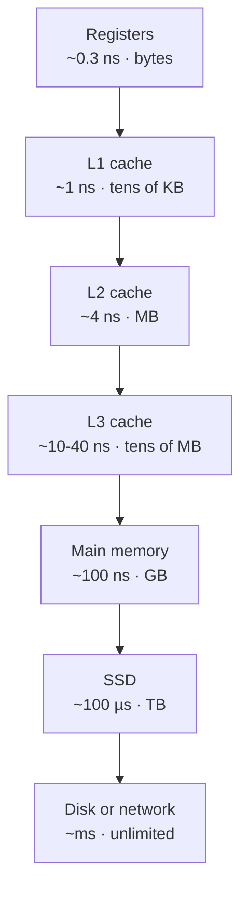

# The Memory Hierarchy: Registers, Cache, RAM, Disk

*Why the fastest computer in the world still spends most of its time waiting.*

---

> *“We should forget about small efficiencies, say about 97% of the time: premature optimization is the root of all evil.”*
>
> — **Donald Knuth**, "Structured Programming with go to Statements," *Computing Surveys*, 1974

## At a Glance

> **In one sentence:** Computers stack small, fast, expensive memory on top of large, slow, cheap memory — registers, caches, RAM, SSD, disk — and programs are fast when their data access patterns keep the hot data near the top.

**You'll learn**

- The latency numbers every engineer should know
- Cache lines, spatial and temporal locality
- Cache associativity and write policies
- Cache coherence (MESI) and false sharing between threads
- NUMA and why memory can be "far" on big servers
- How to write cache-friendly code

**Before you start:** [How Memory Works](How-Memory-Works.md) · [How CPUs Execute Instructions](How-CPUs-Execute-Instructions.md)

**Reading time:** about 40 minutes

---

## The Big Picture



*Each step down the hierarchy is roughly ten to a thousand times slower — and much bigger and cheaper. Fast programs keep their hot data near the top.*

---

## Introduction

Imagine you're a chef in the world's busiest kitchen. The ingredients you're actively chopping sit on your cutting board — reachable in a fraction of a second, but there's room for only a handful. A small rack of frequently used spices and tools sits within arm's reach. A pantry down the hall holds everything else you might need today, but walking there takes real time. And the walk-in freezer in the basement holds bulk supplies you only need occasionally — a trip there and back can take minutes.

No chef stores every ingredient on the cutting board (there's no room), and no chef puts everything in the basement freezer either (you'd starve waiting for a simple garnish). Great kitchens are organized as a **hierarchy**: the things you touch most often are closest, and everything else is progressively farther away, trading capacity for speed.

**A computer's memory system is organized exactly the same way.** A CPU register holds a value in fractions of a nanosecond. A few kilobytes of L1 cache sit just outside the CPU core. Megabytes of L2 and L3 cache sit a little farther. Gigabytes of RAM sit farther still. Terabytes of SSD or spinning disk sit farthest of all — and take **a hundred thousand times longer** to reach than a register.

This is the **memory hierarchy**, and it is arguably the single most consequential piece of computer architecture that working engineers underestimate. It explains why a "simple" nested loop can run 10x faster after reordering two lines, why a linked list is often a performance trap, why databases are built on B-trees instead of binary search trees, and why doubling your server's core count can sometimes make your application *slower*.

### Why Should Engineers Care

Most software engineers write code as if memory access is free and uniform — as if reading `array[i]` costs the same no matter what `i` is or what was read before it. This mental model is wrong, and the gap between the model and reality has been widening for **forty years**.

Engineers who understand the memory hierarchy can:

- Explain a 100x performance difference between two algorithms that do the "same" number of operations
- Design data structures that are fast in practice, not just fast in Big-O notation
- Diagnose mysterious multi-threaded slowdowns caused by cache coherence traffic (false sharing)
- Make informed decisions about NUMA topology on large multi-socket servers
- Understand why database engines, compilers, and language runtimes are obsessed with "locality"
- Reason about real timing side-channel vulnerabilities like Spectre and Meltdown

### Where Is This Used

| Domain | Example | Why the Memory Hierarchy Matters |
|--------|---------|-----------------------------------|
| Databases | PostgreSQL/MySQL B-tree indexes | Minimize disk seeks; keep hot pages in buffer cache |
| Game engines | Entity-Component-System (ECS) design | Struct-of-arrays layout keeps hot data in cache lines |
| High-frequency trading | Order book matching engines | Sub-microsecond latency requires everything to stay in L1/L2 |
| Compilers | Loop tiling, loop interchange | Reorder memory accesses to maximize cache reuse |
| Operating systems | Page replacement, working sets | Manage which data lives in RAM vs. swapped to disk |
| Distributed systems | CDN edge caching, Redis | Same locality principle, just applied at a larger physical scale |
| Hardware design | Multicore CPUs (Intel, AMD, Apple Silicon) | Cache coherence protocols keep cores' views of memory consistent |
| Data engineering | Columnar storage (Parquet, ClickHouse) | Column-major layout maximizes cache and I/O locality for analytics |

---

## The Problem It Solves

### The Fundamental Tension: Speed vs. Capacity vs. Cost

Building memory is a three-way tradeoff. You can build memory that is **fast**, memory that is **large**, or memory that is **cheap** — but not a single technology that is all three at once.

- **SRAM** (used for CPU cache) is blazingly fast (~1 nanosecond) but needs 6 transistors per bit, making it expensive and power-hungry. You can only afford a few megabytes of it.
- **DRAM** (used for main memory/RAM) needs only 1 transistor and 1 capacitor per bit, so it's far cheaper and denser — but it's roughly 100x slower than SRAM, and needs constant refreshing since capacitors leak charge.
- **Flash/NAND** (SSDs) and **magnetic platters** (HDDs) are denser and cheaper still, storing terabytes for a few hundred dollars — but they are thousands to millions of times slower than SRAM.

No single technology satisfies all three needs, so real systems compose a **hierarchy**: a small amount of very fast memory backed by a larger amount of slower memory, backed by an even larger amount of much slower storage.

### The Memory Wall (Von Neumann Bottleneck)

Since the 1980s, CPU clock speeds and instruction-level parallelism have improved far faster than DRAM latency has improved. This growing gap is known as the **memory wall**:

```
Relative speed improvement (log scale), 1980 = baseline 1x

CPU speed:    1x ---- 10x ---- 100x ---- 1,000x ---- 10,000x+   (1980 -> today)
DRAM speed:   1x ---- 2x  ---- 4x   ---- 8x     ---- ~15x       (1980 -> today)
```

In 1980, a CPU instruction and a memory access took roughly the same amount of time. Today, a modern CPU can execute several hundred instructions in the time it takes to fetch one value from main memory. If every memory access stalled the CPU pipeline, modern processors would spend the overwhelming majority of their time idle, waiting on RAM — this is the **Von Neumann bottleneck**, first named in a famous 1977 ACM Turing Award lecture by John Backus, referring to the single shared bus between the CPU and memory that both instructions and data must travel across.

The memory hierarchy is the engineering answer to the memory wall: instead of making all memory fast (physically and economically impossible), keep the *frequently accessed* subset of memory close to the CPU, and let cache mechanics automatically figure out what that subset is.

### What Happens Without This?

Imagine a hypothetical CPU with no cache — every load and store goes directly to DRAM.

- A 3 GHz CPU executes an instruction roughly every 0.3 nanoseconds
- A DRAM access takes roughly 70-100 nanoseconds
- If every instruction touched memory, the CPU would spend **99%+ of its cycles stalled**, waiting for data — effectively throttling a 3 GHz processor down to an *effective* speed closer to 30-40 MHz for memory-bound work

This is not a hypothetical: it is what actually happens today when a program's access pattern is so unpredictable that caches provide no benefit (for example, following pointers through a randomly shuffled linked list larger than cache). The transistor budget and clock speed you paid for evaporate, and your "3 GHz" processor behaves like a computer from 1990.

---

## Historical Background

- **1945-1970s: Flat memory era.** Early computers (ENIAC, early mainframes) had a single tier of memory. As core memory and later semiconductor memory grew, the gap between CPU and memory speed was small enough that a flat model was tolerable.

- **1965: Maurice Wilkes coins "cache."** British computer scientist Maurice Wilkes, in his paper *"Slave Memories and Dynamic Storage Allocation,"* proposed a small, fast "slave" memory to sit between the CPU and main memory. The term **cache** (from the French *cacher*, "to hide") was adopted shortly after to describe this hidden, automatic buffer.

- **1968: First commercial cache — IBM System/360 Model 85.** IBM shipped the Model 85 mainframe with a 16-24 KB cache between the CPU and main core memory, the first commercial machine to use the concept. It demonstrated a measurable speedup for real workloads and validated Wilkes's idea commercially.

- **1970s-1980s: DRAM becomes dominant for main memory**, following Robert Dennard's 1968 invention of single-transistor DRAM at IBM. DRAM's density made large main memories affordable, but its latency (compared to SRAM) widened the gap that caching needed to bridge.

- **1980s: The CPU-DRAM speed gap accelerates.** As CMOS scaling (per Dennard scaling and Moore's Law) let CPU clock speeds climb rapidly, DRAM access latency improved far more slowly, because DRAM speed is bound by capacitor physics, not just transistor size. This is the period computer architects began referring to explicitly as the "memory wall."

- **Mid-1980s: MESI protocol formalized at the University of Illinois.** As multiprocessor systems with private caches per CPU became practical, a new problem emerged: if two CPUs each cache the same memory location, how do they know when one of them changes it? Researchers at the University of Illinois at Urbana-Champaign formalized the **MESI protocol** (Modified, Exclusive, Shared, Invalid) to solve this cache coherence problem; it became the ancestor of nearly every cache coherence protocol used in commercial CPUs since.

- **Late 1980s-1990s: Multi-level caches become standard.** As the CPU-DRAM gap widened further, a single cache level was no longer enough. CPUs added **L2 cache** (initially on a separate chip on the motherboard, later integrated on-die), giving a second, larger, slower buffer between L1 and RAM. Intel's Pentium Pro (1995) was among the first mainstream x86 CPUs to integrate L2 cache directly in the same package as the CPU die.

- **2000s: L3 cache and the multicore era.** As chipmakers hit power and heat limits on raising clock speed further (around 2004-2005, with Intel canceling the 4 GHz "Tejas" successor to the Pentium 4), the industry pivoted to **multicore** CPUs. This reintroduced cache coherence as a first-class, large-scale problem: now many cores, each with private L1/L2 caches, needed to agree on a shared view of memory through a shared L3 cache and coherence fabric.

- **Early 2000s: NUMA arrives in mainstream servers.** AMD's Opteron processors (2003) introduced an on-die memory controller connected via **HyperTransport**, giving each CPU socket its own local bank of RAM instead of sharing one central memory controller. This is **Non-Uniform Memory Access (NUMA)** — accessing "local" memory attached to your own socket is faster than accessing "remote" memory attached to another socket. Intel followed with **QuickPath Interconnect (QPI)** starting with the Nehalem microarchitecture in 2008, and later **UPI (Ultra Path Interconnect)**.

- **2010s-today: Deeper hierarchies, larger caches, and heterogeneous memory.** Modern server CPUs (Intel Xeon, AMD EPYC) ship with tens of megabytes of shared L3 cache, chiplet designs with their own coherence fabrics (AMD's Infinity Fabric), and multi-socket NUMA topologies with 4 or 8 sockets. Emerging technologies like CXL (Compute Express Link) are extending the hierarchy further, allowing pools of memory to be attached and shared with new latency tiers between RAM and disk.

---

## Core Concepts

### The Hierarchy Pyramid

```
                    ▲  Faster, smaller, more expensive per byte
                    │
              ┌───────────┐
              │ Registers │   ~ 32-64 per core, bytes total
              └───────────┘
             ┌─────────────┐
             │  L1 Cache   │   32-64 KB per core (split I/D)
             └─────────────┘
            ┌───────────────┐
            │   L2 Cache    │   256 KB - 2 MB per core
            └───────────────┘
           ┌─────────────────┐
           │   L3 Cache      │   8-64+ MB, shared across cores
           └─────────────────┘
          ┌───────────────────┐
          │   Main Memory     │   Gigabytes (RAM / DRAM)
          │   (RAM)           │
          └───────────────────┘
        ┌───────────────────────┐
        │   SSD (Flash storage) │   Hundreds of GB - TBs
        └───────────────────────┘
      ┌───────────────────────────┐
      │   HDD (magnetic disk)     │   Terabytes
      └───────────────────────────┘
                    │
                    ▼  Slower, larger, cheaper per byte
```

### Latency at Every Level

These are the numbers popularized by **Jeff Dean's "Numbers Every Programmer Should Know"** (originally circulated internally at Google, later widely referenced across the industry). Exact values vary by CPU generation, but the *relative* magnitudes are the essential lesson:

| Operation | Approximate Latency | Relative to L1 (~1ns) |
|-----------|---------------------|------------------------|
| Register access | ~0.3 ns (1 clock cycle) | ~0.3x |
| L1 cache reference | ~1 ns (~4 cycles) | 1x |
| L2 cache reference | ~3-10 ns (~10-30 cycles) | ~3-10x |
| L3 cache reference | ~10-40 ns (~30-100 cycles) | ~10-40x |
| Main memory (RAM) reference | ~50-100 ns | ~50-100x |
| SSD random read | ~10-100 microseconds | ~10,000-100,000x |
| HDD seek + read | ~1-10 milliseconds | ~1,000,000-10,000,000x |
| Round trip within same data center | ~0.5 ms | comparable to a slow SSD read |
| Round trip to a different continent | ~100-150 ms | comparable to many HDD seeks |

**The key takeaway is the exponents, not the exact numbers.** Each level of the hierarchy is roughly one to three orders of magnitude slower than the level above it. If a CPU register access were scaled up to 1 second, an L1 cache hit would be a few seconds, an L2 hit would be tens of seconds, RAM would be a few minutes, an SSD read would be several days, and a spinning-disk seek would be **over a year**.

### Cache Lines and Spatial Locality

Caches do not fetch memory one byte or one word at a time. They fetch memory in fixed-size chunks called **cache lines**, typically **64 bytes** on modern x86 and ARM CPUs.

```
Memory address:  0x1000   0x1001  ...  0x103F   (64 bytes total)
Cache line:      [ b0 | b1 | b2 | ... | b63 ]
                   ↑
            A single load of address 0x1004 pulls in
            the ENTIRE 64-byte line, not just 4 bytes.
```

This design bets on **spatial locality**: the empirical observation that if a program accesses memory address `X`, it is very likely to access addresses near `X` soon after (the next element of an array, the next field of a struct, the next instruction in a straight-line code block). Fetching a whole 64-byte line means those nearby accesses become "free" cache hits instead of separate expensive fetches.

Caches also exploit **temporal locality**: if a program accesses address `X` once, it's likely to access the *same* address again soon (a loop counter, a frequently called function, a hot variable). This is why caches use replacement policies like **LRU (Least Recently Used)** — they try to keep recently touched data around, betting it will be touched again.

| Locality Type | Definition | Example |
|----------------|------------|---------|
| Temporal locality | Recently accessed data is likely to be accessed again soon | A loop counter `i` incremented millions of times |
| Spatial locality | Data near a recently accessed address is likely to be accessed soon | Iterating over a contiguous array |

### Cache Associativity

Caches are organized into **sets**, and each memory address maps to exactly one set (determined by some bits of the address). Within a set, a cache line can occupy one of several **ways**. A cache with 8 ways per set is called **8-way set-associative** — meaning any given address can live in one of 8 possible cache line slots, reducing (but not eliminating) the chance of eviction conflicts compared to a fully "direct-mapped" cache (1 way).

| Design | Ways per Set | Tradeoff |
|--------|--------------|----------|
| Direct-mapped | 1 | Fastest lookup, most conflict misses |
| N-way set-associative | N (commonly 4, 8, 16) | Balance of speed and conflict avoidance |
| Fully associative | All lines | Fewest conflict misses, most expensive to search |

### Write Policies

When a CPU writes to a cached value, the cache must eventually propagate that write to the level below it:

| Policy | Behavior | Tradeoff |
|--------|----------|----------|
| **Write-through** | Every write is immediately propagated to the next level (and eventually RAM) | Simple, always consistent, but generates more traffic |
| **Write-back** | Writes update only the cache line; the line is marked "dirty" and written back only when evicted | Fewer memory writes, faster, but more complex and requires tracking dirty state |

Most modern CPU caches use write-back with a **dirty bit** per cache line, because write-through would saturate memory bandwidth under real workloads.

---

## Real-World Analogy

### The Desk, the Filing Cabinet, the Basement Archive, and Offsite Storage

Picture yourself as an analyst working in an office building.

- **Registers = your hands.** The two or three documents you are physically holding and writing on right now. Instant access, but you can only hold a handful of pages at once.

- **L1 cache = your desk.** A small surface holding the dozen documents you're actively working with this hour. Reaching for anything on your desk takes a fraction of a second.

- **L2 cache = the filing cabinet beside your desk.** Larger — a few hundred folders — but you have to stand up, pull a drawer, and flip through folders. Still fast, but noticeably slower than grabbing something already on your desk.

- **L3 cache = the shared filing room down the hall**, used by your whole team (shared across CPU cores). It holds much more, but you have to walk there, and if a colleague is using the drawer you need, you wait.

- **RAM = the basement archive.** Tens of thousands of documents are stored down there, organized but not immediately at hand. Someone has to physically go downstairs, find the right shelf, and bring the folder back up — a trip that, scaled to your desk-grabbing speed, takes minutes.

- **SSD/Disk = an offsite records warehouse across town.** Millions of documents live there, but retrieving one means a courier trip: hours by the same time-scaling, days for an old-fashioned magnetic-tape-style archive (HDD).

No competent office puts every possible document on the desk (there isn't room), and no competent office keeps everything at the offsite warehouse (nothing would get done). The office is efficient *precisely because* documents automatically migrate toward the desk when you use them repeatedly, and get pushed back out to the filing room or basement when you stop needing them. That automatic migration — done by the cache controller in hardware, without your program ever asking for it — is the entire point of the memory hierarchy.

---

## How It Works Internally

### Cache Lookup Flow

```
CPU issues load for address A
        │
        ▼
   ┌─────────┐   hit    ┌──────────────────────┐
   │   L1?   │ ───────► │ Return data (~1 ns)   │
   └─────────┘          └──────────────────────┘
        │ miss
        ▼
   ┌─────────┐   hit    ┌──────────────────────┐
   │   L2?   │ ───────► │ Return + fill L1       │
   └─────────┘          │ (~3-10 ns)             │
        │ miss          └──────────────────────┘
        ▼
   ┌─────────┐   hit    ┌──────────────────────┐
   │   L3?   │ ───────► │ Return + fill L2, L1   │
   └─────────┘          │ (~10-40 ns)            │
        │ miss          └──────────────────────┘
        ▼
   ┌───────────────┐    ┌──────────────────────┐
   │  Main Memory   │ ─► │ Return + fill L3,     │
   │  (DRAM)        │    │ L2, L1 (~50-100 ns)   │
   └───────────────┘    └──────────────────────┘
```

Each miss at one level triggers a fetch from the next level down, and the fetched cache line is installed ("filled") into every level above it on the way back up (a common design called **inclusive** or **exclusive**, depending on the specific CPU). A single L1 miss that also misses L2 and L3 and must go all the way to RAM is dramatically more expensive than a clean L1 hit — potentially 100x the latency.

### The MESI Cache Coherence Protocol

On a multicore CPU, each core typically has its own private L1 and L2 cache, while L3 is shared. If Core A and Core B both cache the same memory address, and Core A writes to it, Core B's cached copy is now stale. The **MESI protocol** (Modified, Exclusive, Shared, Invalid) is the mechanism that keeps every core's view of memory consistent.

Every cache line, in every core's cache, is at all times in exactly one of four states:

| State | Meaning |
|-------|---------|
| **M — Modified** | This core has the only copy, and it has been written to (dirty). Must write back to memory before another core can read it. |
| **E — Exclusive** | This core has the only copy, and it matches memory (clean). Can be silently upgraded to Modified on a write, with no bus traffic. |
| **S — Shared** | This line may exist in multiple cores' caches, and all copies match memory (clean). A write requires first invalidating other cores' copies. |
| **I — Invalid** | This cache line does not hold valid data (either never loaded, or invalidated by another core's write). |

### MESI State Transitions

```
                 Read by this core (line not in memory bus / no other cache)
        I ──────────────────────────────────────────────────► E
        │                                                       │
        │ Read by this core, but another core                   │ Write by this core
        │ already has it Shared/Exclusive                       │ (no other copies exist)
        ▼                                                       ▼
        S ◄──────── Read by another core (was Exclusive) ─────  M
        │                                                       ▲
        │ Write by this core                                    │ Write by this core
        │ (broadcast invalidate to other cores' copies)         │ (already exclusive)
        ▼                                                       │
        M ──────────────────────────────────────────────────────┘

  Any core snooping a WRITE from another core on a line it holds
  in S, E, or M transitions that local copy to I (invalidated).
```

In practice: when Core A wants to write to a line that Core B holds as Shared, Core A broadcasts an **invalidate** message over the cache-coherence interconnect. Core B transitions its copy to Invalid. Core A's copy transitions to Modified. If Core B then tries to read that same address again, it triggers a fresh fetch (often served directly from Core A's cache via **cache-to-cache transfer**, faster than going to RAM, but still far slower than a local cache hit).

This coherence traffic is invisible to your source code, but it is not free — the "snooping" and invalidation messages consume real interconnect bandwidth and add real latency, which is exactly the mechanism behind the **false sharing** problem covered later in this chapter.

### NUMA: Non-Uniform Memory Access

On multi-socket servers, each CPU socket ("NUMA node") has its own bank of DRAM directly attached via its own memory controller. A core can access its **local** node's memory quickly, but accessing memory attached to a **remote** node requires traversing an inter-socket interconnect (AMD Infinity Fabric, Intel UPI), adding latency.

```
   Socket 0 (NUMA node 0)             Socket 1 (NUMA node 1)
  ┌─────────────────────┐   UPI /   ┌─────────────────────┐
  │ Cores 0-15           │ Infinity  │ Cores 16-31          │
  │ L1/L2/L3 cache        │◄─Fabric─►│ L1/L2/L3 cache        │
  │ Memory Controller     │           │ Memory Controller     │
  └──────────┬────────────┘           └──────────┬────────────┘
             │                                    │
      ┌──────▼──────┐                      ┌──────▼──────┐
      │ Local RAM   │                      │ Local RAM   │
      │ (~80 ns)    │                      │ (~80 ns)    │
      └─────────────┘                      └─────────────┘

  A core on Socket 0 accessing Socket 1's RAM: ~130-150 ns (remote)
  vs. ~80-100 ns for its own local RAM.
```

Local access might be ~80-100 ns; remote access across sockets can be 30-70% slower, and on larger 4- or 8-socket systems the penalty compounds further depending on interconnect topology (hop count).

---

## Components and Architecture

### Cache Controller

Dedicated hardware logic, physically part of each cache level, responsible for: translating addresses to sets/ways, checking tags for hits/misses, enforcing the replacement policy (commonly a pseudo-LRU approximation, since true LRU is expensive to track exactly at scale), and driving the MESI (or a variant like MOESI/MESIF) state machine on every access.

### Translation Lookaside Buffer (TLB)

Modern CPUs use **virtual memory**, so every memory address a program uses must be translated to a physical address via page tables. Walking page tables on every access would be prohibitively slow, so CPUs cache recent virtual-to-physical translations in a small, very fast structure called the **TLB**. A TLB miss ("page table walk") adds tens to hundreds of cycles on top of the cache-level lookup — meaning cache-unfriendly *and* TLB-unfriendly access patterns (e.g., scanning memory in large strides across many pages) compound two separate penalties.

### Memory Controller

The hardware unit, now integrated directly onto the CPU die in every modern design (a departure from older "northbridge" chipset designs), that issues the actual read/write commands to DRAM chips, handles refresh cycles, and enforces DRAM timing parameters (row activation, column access, precharge). In NUMA systems, each socket has its own memory controller wired to its own local DIMMs.

### NUMA Nodes and the OS Scheduler

The operating system's scheduler and memory allocator are NUMA-aware on modern systems: they attempt to schedule a thread on the same NUMA node where its memory was allocated, and tools like Linux's `numactl` let engineers pin processes and memory to specific nodes explicitly. Getting this wrong — for example, allocating a large buffer on Node 0 but letting the OS schedule the consuming thread on Node 1 — silently converts every access into a remote, higher-latency access.

---

## End-to-End Flow

### Alice Iterates Over a Large Matrix

Alice is a backend engineer profiling a numerical routine that sums every element of a large `4096 x 4096` matrix of 8-byte doubles (128 MB total — far larger than any cache level). She writes two versions of the same logical operation.

**Version 1 — row-major traversal (cache-friendly):**

```c
double sum = 0;
for (int i = 0; i < N; i++)
    for (int j = 0; j < N; j++)
        sum += matrix[i][j];   // inner loop walks memory sequentially
```

**Version 2 — column-major traversal (cache-hostile):**

```c
double sum = 0;
for (int j = 0; j < N; j++)
    for (int i = 0; i < N; i++)
        sum += matrix[i][j];   // inner loop jumps N*8 bytes each iteration
```

The matrix is stored in row-major order in memory (C's default), meaning `matrix[i][j]` and `matrix[i][j+1]` are adjacent in memory, but `matrix[i][j]` and `matrix[i+1][j]` are `4096 * 8 = 32,768` bytes apart.

**Tracing Version 1:** The inner loop accesses `matrix[i][0], matrix[i][1], matrix[i][2]...` — 8 consecutive doubles fit in one 64-byte cache line. Alice's CPU fetches one cache line from RAM (~70 ns), and the next 7 accesses are **L1 cache hits** (~1 ns each). Amortized, each element costs roughly `(70 + 7*1) / 8 ≈ 9.6 ns`.

**Tracing Version 2:** The inner loop jumps 32,768 bytes on every single access — far larger than a 64-byte cache line, and far larger than L1 (32-64 KB) or even L2 (256 KB-2 MB) can absorb across a full column. Every single access is effectively a fresh cache miss: L1 miss (~1 ns wasted check), L2 miss (~4-10 ns wasted check), L3 miss (~10-40 ns wasted check), and then a full RAM fetch (~70-100 ns). Each element costs roughly `1 + 5 + 20 + 90 ≈ 116 ns` — over **10x slower** than Version 1, despite doing the exact same number of additions.

When Alice benchmarks both versions, Version 2 runs 8-15x slower depending on the CPU, entirely explained by cache-line utilization: Version 1 uses all 8 doubles fetched per cache line, while Version 2 uses only 1 of 8 doubles per cache line fetched, wasting 87.5% of every memory transfer.

**The fix Alice ships:** reorder the loops so the innermost loop always walks the fastest-varying (row) index, matching memory layout — a classic **loop interchange** optimization, and one modern optimizing compilers sometimes apply automatically, but not always reliably enough to depend on.

---

## Production Engineering Perspective

### Scalability

- Adding more CPU cores does not scale memory bandwidth or shared L3 capacity proportionally — beyond a certain core count, memory-bound workloads hit a **bandwidth wall** where extra cores sit idle waiting on the shared memory bus
- NUMA-aware scaling (pinning threads and memory allocation to the same socket) is essential once you scale past a single-socket server; ignoring NUMA can mean adding a second socket *reduces* throughput for latency-sensitive workloads due to remote-access penalties and coherence traffic
- Horizontally scaled systems (adding more machines) sidestep the single-machine memory wall entirely, at the cost of introducing network latency (itself a "level" below disk in the broader hierarchy)

### Reliability

- ECC (Error-Correcting Code) RAM detects and corrects single-bit errors caused by cosmic rays and electrical noise — essential in servers, where a silent bit flip in a long-running process can corrupt data undetected
- Cache coherence protocols like MESI guarantee correctness (every core eventually sees a consistent view of memory) even under aggressive out-of-order and speculative execution — a subtle but critical reliability property that application code relies on without ever seeing it directly
- Memory hierarchy misconfiguration (e.g., disabling a cache level for debugging) can silently degrade a system's real-world reliability profile in ways that are easy to overlook

### Performance

- The dominant real-world performance lever for memory-bound code is almost always **locality**, not algorithmic complexity — a cache-friendly O(n log n) algorithm frequently beats a cache-hostile O(n) algorithm on real hardware
- Prefetching (hardware automatically detecting a sequential access stride and fetching ahead) can hide much of RAM's latency for predictable access patterns, but does nothing for pointer-chasing or random access
- Profilers like `perf` (Linux), Intel VTune, and `cachegrind` can directly measure cache miss rates, letting engineers verify locality assumptions instead of guessing

### Availability

- Memory hierarchy issues rarely cause outright outages, but they routinely cause **latency-based SLA violations** — a service that's "up" but responding 10x slower than its p99 target due to cache thrashing under load is, from a user's perspective, effectively degraded
- NUMA misconfiguration under load spikes can create asymmetric latency across replicas of the "same" service running on different sockets, complicating load-balancing and failure detection

### Maintainability

- Cache-friendly data structure choices (arrays over linked lists, struct-of-arrays over array-of-structs) often *simplify* code as a side effect, since contiguous memory is easier to reason about, serialize, and debug than scattered pointer graphs
- Over-optimizing for cache behavior too early (manual padding, hand-rolled memory pools, aggressive prefetch hints) adds real complexity and should be reserved for measured hot paths, not applied speculatively across a codebase

---

## Tradeoffs

### Benefits of a Deep Memory Hierarchy

| Benefit | Explanation |
|---------|-------------|
| Near-register speed for hot data | Frequently accessed data automatically migrates to fast cache levels without any explicit programmer action |
| Enormous effective capacity | Programs can address terabytes of storage while only paying nanosecond costs for the working set that matters |
| Cost efficiency | Combines small amounts of expensive SRAM with large amounts of cheap DRAM/flash/disk, instead of requiring all-SRAM systems that would be unaffordable at scale |
| Transparency | Application code doesn't need to manage cache placement manually — the hardware does it automatically based on access patterns |

### Drawbacks

| Drawback | Explanation |
|----------|-------------|
| Unpredictable worst-case latency | The same line of code can take 1 ns or 100 ns depending on whether the data happens to be cached — this makes worst-case timing analysis (critical for real-time systems) genuinely hard |
| Coherence overhead on multicore | Keeping many cores' caches consistent (MESI traffic) consumes real interconnect bandwidth and can itself become a bottleneck (false sharing) |
| NUMA complexity | Multi-socket systems require explicit thread/memory placement awareness to avoid silently paying remote-access penalties |
| Side-channel risk | Timing differences between cache hits and misses leak information about memory access patterns, enabling attacks like Spectre and Meltdown |

### Limitations

- Cache effectiveness depends entirely on the **locality** of the workload; genuinely random access patterns over data sets larger than cache gain almost nothing from any cache level
- No amount of cache can fully hide the latency of true random disk I/O at scale — this is why database engines invest heavily in access-pattern-aware data structures (B-trees) rather than relying on the OS page cache alone
- Cache capacity is a hard, fixed resource shared across all threads on a core/socket; a "noisy neighbor" thread with poor locality can evict another thread's working set (cache pollution)

### Alternatives

| Approach | When to Use |
|----------|-------------|
| Scratchpad memory (software-managed, no hardware cache) | Embedded/real-time systems (e.g., some DSPs, the Cell processor's SPEs) needing fully predictable, deterministic timing |
| Explicit prefetch instructions | Performance-critical loops with a known, regular access stride the hardware prefetcher might not catch |
| NUMA-aware allocators and thread pinning | Large multi-socket servers running latency-sensitive or memory-bandwidth-heavy workloads |
| Cache-oblivious algorithms | Code that must perform well across many different, unknown cache sizes without hand-tuning (e.g., portable library code) |

### When NOT to Use (or Over-Invest In) Manual Cache Tuning

- Don't hand-tune for cache-line alignment or manually pad structs in code that isn't measured to be hot — you add complexity for no measurable benefit, and compilers/allocators already do reasonable defaults
- Don't reach for NUMA pinning on a single-socket server or in a containerized environment where the underlying topology is abstracted away — there's no remote-access penalty to avoid
- Don't over-engineer cache-oblivious algorithms for one-off scripts or code that runs on small, bounded inputs where the entire data set fits comfortably in L2/L3 regardless of access pattern

---

## Common Mistakes

### Beginner Mistakes

1. **Assuming all memory access is equally fast.** Treating `array[i]` and `linkedList.next` as equivalent in cost, when in practice one is overwhelmingly more cache-friendly than the other.

2. **Choosing linked lists by default for "flexible" collections.** Each node is a separate heap allocation, likely scattered across memory, turning traversal into a chain of cache misses. An array or `ArrayList`/`Vec` is very often faster in practice even when its Big-O complexity for insertion looks worse on paper.

3. **Ignoring row-major vs. column-major layout.** Writing nested-loop numerical code without considering which loop index should be innermost, leading to unnecessary cache-hostile strides (as shown in the End-to-End Flow section).

### Intermediate Mistakes

4. **False sharing between threads.** Two threads write to different variables that happen to sit on the same 64-byte cache line, causing constant MESI invalidation traffic even though the threads never touch each other's actual data.

5. **Over-allocating small objects individually** instead of pooling/arena-allocating them contiguously, scattering related data across memory and destroying spatial locality for anything that iterates over a collection of them.

6. **Ignoring the TLB.** Iterating over data with strides that hit a new memory page on every access (e.g., a large stride across a huge sparse array) causes constant TLB misses on top of cache misses, silently doubling the penalty.

### Senior-Level Mistakes

7. **Ignoring NUMA effects on large multi-socket servers.** Allocating a large in-memory data structure without considering which NUMA node the consuming threads run on, causing every access to pay the remote-memory penalty — sometimes losing 30%+ throughput on an otherwise "correct" design.

8. **Choosing array-of-structs when the access pattern only ever touches a few fields.** For workloads that scan millions of records but read only 2 of 20 fields per record, an array-of-structs layout wastes cache-line bandwidth on unused fields; struct-of-arrays would pack only the needed fields contiguously.

9. **Trusting Big-O complexity alone when designing performance-critical data structures.** A theoretically optimal algorithm with poor locality can lose decisively to a "worse" algorithm with excellent locality on real hardware — this is precisely why B-trees, not balanced binary search trees, dominate disk- and cache-oriented indexing structures.

10. **Not measuring before optimizing for cache behavior.** Spending engineering effort restructuring data layouts based on intuition rather than profiler evidence (`perf stat -e cache-misses`, VTune, `cachegrind`), sometimes "fixing" code paths that were never actually hot.

---

## Failure Scenarios

### Scenario 1: False Sharing Causes a Mysterious Multi-Threaded Slowdown

**What happens:** A team parallelizes a counter-increment workload across 8 threads, giving each thread its own counter in a shared array (`counters[8]`, each an `int64_t`). Throughput barely improves over the single-threaded version, and sometimes gets *worse* as more threads are added.

**Why it fails:** Eight `int64_t` values (64 bytes total) fit in a *single* 64-byte cache line. Even though each thread only writes to its own array element, every write invalidates the entire cache line in every other core's cache (per MESI), forcing constant cache-line ping-pong across cores.

**How to diagnose:**
- Profiler shows high cycles-per-instruction (CPI) and elevated cache-miss / coherence-traffic counters despite "embarrassingly parallel" logic
- `perf c2c` (cache-to-cache) on Linux directly identifies cache lines with heavy cross-core contention
- Symptom pattern: adding more threads increases wall-clock time instead of decreasing it

**Solutions:**
- Pad each thread's counter to its own full cache line (e.g., `struct { int64_t value; char padding[56]; }`)
- Use thread-local accumulation with a single combining step at the end, instead of shared mutable state per iteration

### Scenario 2: Cache Thrashing from an Oversized Working Set

**What happens:** A service processes a batch job iterating repeatedly over a data structure just slightly larger than L2/L3 cache. Performance is dramatically worse than a similarly sized job that fits just inside cache.

**Why it fails:** When the working set exceeds cache capacity, the cache is forced to evict and refetch lines repeatedly across iterations — every "hot" piece of data gets evicted before it's reused, so the cache provides almost no benefit despite genuine temporal locality in the access pattern (this is called **thrashing**).

**How to diagnose:**
- Cache-miss rate jumps sharply and non-linearly once data size crosses a cache-size boundary (a classic sign in a size-vs-latency benchmark sweep)
- `perf stat -e L1-dcache-load-misses,LLC-load-misses` shows disproportionate miss rates relative to data volume

**Solutions:**
- **Loop tiling/blocking:** process the data in chunks small enough to fit in cache, completing all work on one chunk before moving to the next
- Reduce the per-element memory footprint (smaller data types, denser encoding) to shrink the working set below the cache boundary

### Scenario 3: NUMA Misconfiguration Tanking Throughput

**What happens:** A database process is deployed on a new dual-socket server with double the cores and double the RAM of the old single-socket server, but throughput barely improves — sometimes it's worse under high concurrency.

**Why it fails:** The OS scheduler moves threads between sockets for load-balancing reasons, but the large in-memory buffer pool was allocated on Socket 0. Threads migrated to Socket 1 now pay the remote-memory latency penalty on nearly every access, and cross-socket coherence traffic increases as more cores contend for the same remotely-hosted cache lines.

**How to diagnose:**
- `numastat` (Linux) shows a high ratio of `numa_foreign`/`numa_miss` to `numa_hit`
- Per-socket CPU utilization looks uneven or threads show high migration counts in `perf sched`
- Latency profile shows a bimodal distribution — some requests fast (local), some slow (remote)

**Solutions:**
- Pin worker threads and their associated memory allocations to the same NUMA node (`numactl --cpunodebind --membind`)
- Shard the workload explicitly across NUMA nodes (e.g., run N independent database shard processes, one pinned per socket) instead of one process spanning all sockets
- Use NUMA-aware allocators that default new allocations to the calling thread's local node

### Scenario 4: Cold Cache After Context Switch

**What happens:** A latency-sensitive service shows periodic latency spikes correlated with high system load, even though CPU utilization looks otherwise fine.

**Why it fails:** Under heavy load, the OS scheduler preempts a thread mid-execution to run other work. When the original thread resumes (possibly on a different core), its previously warm L1/L2 cache state is gone — either evicted by the intervening thread or simply absent because it resumed on a different core with a cold cache. The next several memory accesses pay full RAM-latency costs until the working set is re-warmed.

**How to diagnose:**
- Latency spikes correlate with scheduler context-switch rate, not raw CPU utilization
- `perf sched` or `/proc/<pid>/status` (`voluntary_ctxt_switches` / `nonvoluntary_ctxt_switches`) shows elevated involuntary context switches for the affected thread

**Solutions:**
- Use CPU affinity/pinning for latency-critical threads to reduce migration-induced cold caches
- Reduce oversubscription (fewer runnable threads than logical cores for the most latency-sensitive services)
- Use real-time scheduling priorities where the OS supports it, to reduce preemption frequency for critical threads

---

## Security Considerations

### Cache Timing Side-Channel Attacks

Because cache hits and misses take measurably different amounts of time, an attacker who can precisely measure timing can sometimes infer *which* memory addresses a victim process accessed — even across process or security-boundary isolation — without ever directly reading the victim's memory.

- **Flush+Reload:** The attacker flushes a shared cache line (e.g., in a shared library both processes map) out of cache, waits, then reloads it and times the access. A fast reload means the victim touched that line in the meantime (evidence about the victim's control flow or data access); a slow reload means it didn't. This has been used to break cryptographic implementations by inferring which lookup-table entries a victim's AES or RSA implementation accessed.

- **Prime+Probe:** The attacker fills ("primes") an entire cache set with its own data, waits for the victim to run, then measures ("probes") which of its own lines were evicted. Evicted lines indicate the victim accessed memory mapping to that same cache set — this works even without shared memory between attacker and victim, making it broader than Flush+Reload.

### Spectre and Meltdown

The 2018 disclosures of **Spectre** and **Meltdown** brought cache timing side channels to mainstream attention. Both vulnerabilities exploit **speculative execution**: modern CPUs execute instructions ahead of a branch or permission check being resolved, and roll back architectural state if the speculation was wrong — but the *cache* state changes from that speculative execution are **not** rolled back. An attacker can use Flush+Reload or Prime+Probe timing measurements to detect which cache lines were touched during mis-speculated execution, effectively reading data (including across privilege boundaries, in Meltdown's case) that should have been inaccessible.

This was a landmark demonstration that the memory hierarchy is not just a performance detail — its timing behavior is an observable side channel with genuine security consequences at the level of CPU microarchitecture design.

### Defenses

- **Kernel Page Table Isolation (KPTI)** — mitigates Meltdown by separating kernel and user page tables, preventing user-space speculative reads from touching kernel memory addresses
- **Retpoline and speculation barriers** — compiler and microcode mitigations that limit speculative execution down attacker-influenced indirect branches (Spectre variants)
- **Cache partitioning (Intel CAT — Cache Allocation Technology)** — restricts which portions of shared cache different security domains can use, reducing cross-tenant side-channel bandwidth in multi-tenant cloud environments
- **Constant-time cryptographic implementations** — deliberately avoid secret-dependent memory access patterns (e.g., table lookups indexed by key material) so that cache timing reveals nothing about the secret

---

## Performance Considerations

### Bottlenecks

| Bottleneck | Why It Happens | How to Fix |
|------------|-----------------|------------|
| Memory bandwidth saturation | Many cores simultaneously streaming from RAM exceed the shared memory controller's throughput | Reduce per-element memory footprint; use blocking/tiling to reuse cached data instead of re-streaming it |
| False sharing | Independent variables share a 64-byte cache line, causing needless coherence invalidation | Pad hot per-thread data to separate cache lines |
| TLB misses | Access pattern spans many memory pages unpredictably | Use huge pages (2 MB/1 GB) for large data sets to reduce the number of page table entries needed |
| Cache pollution | A low-locality thread evicts a high-locality thread's working set from shared cache | Use cache partitioning (Intel CAT) or isolate noisy workloads to separate cores/sockets |
| Remote NUMA access | Thread and its memory live on different sockets | Pin thread and memory allocation to the same NUMA node |

### Optimization Strategies

1. **Maximize spatial locality** — favor contiguous, sequentially accessed data structures (arrays) over pointer-chasing structures (linked lists, trees with scattered node allocation) wherever access patterns allow
2. **Choose struct-of-arrays over array-of-structs** when only a subset of fields is used per pass — this packs only the relevant data densely, maximizing useful bytes per cache line fetched
3. **Block/tile computations** so that each chunk of work's data fits within a target cache level before moving to the next chunk, maximizing reuse of already-fetched cache lines
4. **Align and pad hot data structures** to cache-line boundaries to avoid false sharing and unnecessary line-splitting across boundaries
5. **Use huge pages** for very large data sets to shrink the number of TLB entries required, reducing TLB miss rate
6. **Prefer NUMA-aware allocation and thread pinning** on multi-socket servers for latency- or bandwidth-sensitive workloads

### Scaling Challenges

- Shared L3 cache and memory bandwidth do not scale linearly with core count — beyond a certain point, adding cores to a memory-bound workload yields diminishing or even negative returns
- Coherence protocol overhead grows with core count; very large multicore/multi-socket systems increasingly rely on directory-based coherence (rather than pure broadcast snooping) specifically to keep this overhead from becoming a scalability bottleneck itself
- As core counts and socket counts grow, NUMA topology awareness shifts from a "nice to have" optimization to a mandatory architectural concern for latency-sensitive systems

---

## Real-World Industry Examples

### Intel and AMD Cache Hierarchy Design

Modern Intel Xeon and AMD EPYC server CPUs both ship deep, multi-level cache hierarchies tuned for different workload philosophies. AMD's EPYC "chiplet" designs group cores into Core Complex Dies (CCDs), each with its own L3 cache slice, connected via **Infinity Fabric** — meaning cache and memory locality decisions must account for which CCD a thread runs on, not just which socket. Intel's monolithic (and more recently tiled/chiplet) Xeon designs use a mesh interconnect linking cores to a distributed shared L3, with published optimization manuals detailing exact latency figures per cache level that performance engineers rely on directly.

### Google's Data Structure Design for Cache Efficiency

Google's engineering culture treats cache efficiency as a first-class design constraint, most visibly in **Abseil's `absl::flat_hash_map`**, a hash table designed explicitly to replace `std::unordered_map` for cache-friendliness: it stores metadata and slots in contiguous arrays (using SIMD-friendly "control bytes" to probe multiple slots per cache-line-sized fetch), rather than the node-based, pointer-chasing design `std::unordered_map` typically uses. Google's published rationale is explicit that this was a deliberate cache-locality-driven redesign, not just an API convenience change.

### Database Engines: B-Trees for Disk and Cache Locality

MySQL's InnoDB engine and PostgreSQL both build primary indexes on **B-tree** (or B+tree) variants rather than binary search trees, specifically because B-trees are designed around the memory hierarchy: each node holds many keys (sized to match a disk page, typically 8-16 KB), so a single node fetch — whether from disk or from the buffer cache — resolves many levels of comparison at once. A balanced binary search tree over the same key count would require far more separate, individually cache-unfriendly node fetches to reach a leaf, each potentially a full random disk seek in the worst case.

### High-Frequency Trading Firms

HFT firms building order-matching and market-data-processing systems obsess over cache locality because their latency budgets are measured in **nanoseconds to low microseconds** — a single L3 miss (tens of nanoseconds) can be a meaningful fraction of their entire budget. Common practices in this industry include: pinning threads to specific cores and disabling frequency scaling to keep cache/timing behavior predictable, avoiding heap allocation (and its pointer-chasing, cache-hostile consequences) entirely on the hot path, using flat array-based order book representations instead of tree/map structures, and carefully padding data structures to avoid false sharing between the market-data thread and the matching-engine thread.

---

## Case Studies

### Case Study 1: A Production False-Sharing Bug in a Metrics Library

**What happened:** An engineering team building a high-throughput request-metrics library gave each worker thread its own slot in a shared `counters` array to avoid lock contention, expecting near-linear scaling with thread count. Load testing showed throughput plateauing — and slightly regressing — past 4 threads, despite the machine having 16 cores.

**Root cause:** The counters (small integers) packed multiple threads' slots into single 64-byte cache lines. Every increment invalidated the line for every other thread sharing it, turning what looked like independent, lock-free counters into a hidden serialization point via constant MESI coherence traffic.

**Solution:** Each thread's counter was padded to occupy its own full cache line (`alignas(64)` in C++, or an explicit padding struct). Throughput scaled near-linearly with thread count after the fix.

**Lesson:** Removing locks does not guarantee independence at the hardware level — cache-line sharing is an invisible form of contention that behaves like a lock even though no lock exists in the source code.

### Case Study 2: NUMA Misconfiguration on a Large Database Server

**What happened:** A team migrated an in-memory analytics database from a single-socket server to a new dual-socket server with more total cores and RAM, expecting a straightforward throughput improvement. Instead, p99 query latency got worse under concurrent load, and throughput gains were far smaller than the doubled hardware specs suggested.

**Root cause:** The database process allocated its large in-memory buffer pool on startup, all landing on NUMA node 0 (default first-touch allocation policy). As the OS scheduler distributed worker threads across both sockets for load balancing, roughly half of all memory accesses became remote-NUMA accesses, paying a significant latency penalty on top of ordinary RAM latency, compounded by cross-socket coherence traffic for shared metadata structures.

**Solution:** The team switched to a sharded deployment model — running multiple independent database processes, each pinned (CPU and memory) to a single NUMA node via `numactl`, with a lightweight router distributing queries across shards. This restored near-linear scaling with the added hardware.

**Lesson:** Adding sockets is not equivalent to adding cores on a single socket; multi-socket scaling requires explicit topology awareness, and default OS memory-placement policies are not sufficient for NUMA-sensitive workloads.

### Case Study 3: The Design Rationale Behind Swiss Tables (`absl::flat_hash_map`)

**What happened:** Google's standard C++ hash map usage relied heavily on `std::unordered_map`, whose specification (a required stable-address-per-bucket, chained-node design) inherently prevents a cache-friendly, contiguous internal layout. As Google's codebase scaled, hash map lookups were identified as a disproportionately expensive part of many hot paths, driven largely by cache-miss-heavy pointer chasing rather than the hashing computation itself.

**Root cause / Design constraint:** The C++ standard's iterator and pointer-stability guarantees for `unordered_map` effectively force a node-based implementation, where each entry is a separate heap allocation — the opposite of what the memory hierarchy rewards.

**Solution:** Google designed **Swiss Tables** (open-sourced as `absl::flat_hash_map`), which relax those stability guarantees in exchange for storing entries in contiguous, cache-line-aligned arrays. A parallel array of 1-byte "control bytes" encodes occupancy/metadata for groups of slots, and SIMD instructions probe multiple control bytes in a single instruction — turning what would be several scattered cache misses in a node-based design into typically one or two cache-line fetches.

**Lesson:** Sometimes the biggest algorithmic win available is not a better asymptotic complexity, but redesigning a data structure's *memory layout* to align with how real hardware actually fetches data — the underlying hash function and collision-resolution logic were secondary to the locality redesign.

---

## Practical Code Examples

### C: Row-Major vs. Column-Major Traversal Benchmark

```c
#include <stdio.h>
#include <stdlib.h>
#include <time.h>

#define N 4096

int main(void) {
    double (*matrix)[N] = malloc(sizeof(double[N][N]));
    for (int i = 0; i < N; i++)
        for (int j = 0; j < N; j++)
            matrix[i][j] = (double)(i + j);

    // Row-major traversal: cache-friendly
    clock_t start = clock();
    double sum1 = 0;
    for (int i = 0; i < N; i++)
        for (int j = 0; j < N; j++)
            sum1 += matrix[i][j];
    double row_major_time = (double)(clock() - start) / CLOCKS_PER_SEC;

    // Column-major traversal: cache-hostile
    start = clock();
    double sum2 = 0;
    for (int j = 0; j < N; j++)
        for (int i = 0; i < N; i++)
            sum2 += matrix[i][j];
    double col_major_time = (double)(clock() - start) / CLOCKS_PER_SEC;

    printf("Row-major:    %.4f s (sum=%.0f)\n", row_major_time, sum1);
    printf("Column-major: %.4f s (sum=%.0f)\n", col_major_time, sum2);
    printf("Slowdown factor: %.1fx\n", col_major_time / row_major_time);

    free(matrix);
    return 0;
}
```

Compiled with `gcc -O2 cache_bench.c -o cache_bench` (optimizations enabled but without vectorization aggressive enough to fully hide the effect), this typically shows the column-major version running 5-15x slower, purely from cache-line utilization.

### C: False Sharing Demonstration — Padded vs. Unpadded Structs

```c
#include <stdio.h>
#include <pthread.h>
#include <time.h>

#define ITERATIONS 200000000
#define NUM_THREADS 4

// Unpadded: all 4 counters likely share cache lines
typedef struct {
    long counter;
} UnpaddedCounter;

// Padded: each counter occupies its own 64-byte cache line
typedef struct {
    long counter;
    char padding[56];   // 8-byte long + 56 bytes padding = 64 bytes
} PaddedCounter;

UnpaddedCounter unpadded[NUM_THREADS];
PaddedCounter padded[NUM_THREADS];

void* increment_unpadded(void* arg) {
    int idx = *(int*)arg;
    for (long i = 0; i < ITERATIONS; i++)
        unpadded[idx].counter++;
    return NULL;
}

void* increment_padded(void* arg) {
    int idx = *(int*)arg;
    for (long i = 0; i < ITERATIONS; i++)
        padded[idx].counter++;
    return NULL;
}

double run_benchmark(void* (*fn)(void*)) {
    pthread_t threads[NUM_THREADS];
    int ids[NUM_THREADS];
    struct timespec start, end;

    clock_gettime(CLOCK_MONOTONIC, &start);
    for (int i = 0; i < NUM_THREADS; i++) {
        ids[i] = i;
        pthread_create(&threads[i], NULL, fn, &ids[i]);
    }
    for (int i = 0; i < NUM_THREADS; i++)
        pthread_join(threads[i], NULL);
    clock_gettime(CLOCK_MONOTONIC, &end);

    return (end.tv_sec - start.tv_sec) + (end.tv_nsec - start.tv_nsec) / 1e9;
}

int main(void) {
    double unpadded_time = run_benchmark(increment_unpadded);
    double padded_time = run_benchmark(increment_padded);

    printf("Unpadded (false sharing): %.3f s\n", unpadded_time);
    printf("Padded (no false sharing): %.3f s\n", padded_time);
    printf("Slowdown from false sharing: %.1fx\n", unpadded_time / padded_time);
    return 0;
}
```

Compiled with `gcc -O2 -pthread false_sharing.c -o false_sharing`, this commonly shows the unpadded version running 3-8x slower on a multicore machine, purely from cache-line invalidation traffic between cores incrementing logically independent counters.

### Python: Measuring Cache Effects with a Strided Access Benchmark

```python
import time
import array

def strided_sum(data, stride, iterations):
    total = 0
    n = len(data)
    for _ in range(iterations):
        idx = 0
        for _ in range(n // stride):
            total += data[idx]
            idx = (idx + stride) % n
    return total

SIZE = 8_000_000  # large enough to exceed typical L2/L3 cache when strided
data = array.array('d', range(SIZE))

for stride in [1, 16, 256, 4096]:
    start = time.perf_counter()
    strided_sum(data, stride, iterations=3)
    elapsed = time.perf_counter() - start
    print(f"stride={stride:5d}  elapsed={elapsed:.3f}s")
```

Even accounting for Python's interpreter overhead dominating absolute timings, running this under a lower-level profiler (or porting the core loop to C/NumPy) reveals the same qualitative pattern: larger strides that repeatedly skip outside the cache footprint show measurably worse per-element cost than small strides that stay within a cache line or a few pages.

---

## Frequently Asked Questions

**Q: Why doesn't the CPU just use one giant, fast cache instead of multiple levels?**

Because speed and capacity are in direct physical tension for SRAM: a cache large enough to replace RAM would be too slow to search in a single cycle (longer wires, more transistors to check per access), and far too expensive and power-hungry to fit on a CPU die. Multiple levels let each tier be tuned separately — L1 is tiny and blazing fast, L3 is larger and slower but still far faster than RAM — giving a better overall latency/capacity/cost curve than any single level could.

**Q: What is a cache line, and why is 64 bytes the common size?**

A cache line is the fixed-size chunk of memory (commonly 64 bytes on modern x86/ARM CPUs) that a cache fetches, stores, and evicts as a single unit — never a smaller granularity. 64 bytes is a practical balance: large enough to amortize the fixed overhead of a memory transaction and exploit typical spatial locality, but small enough to avoid wasting bandwidth and cache capacity on data a program is unlikely to use.

**Q: Is RAM part of "cache," or something separate?**

RAM (DRAM) is a separate, distinct tier below the CPU caches (L1/L2/L3), not itself a cache. However, RAM often functions *as* a cache for a lower, even slower tier — the OS's page cache uses spare RAM to cache recently accessed disk blocks, so "RAM as a cache for disk" is a legitimate and common way to describe part of its role in the overall hierarchy.

**Q: Why do database engines use B-trees instead of balanced binary search trees for indexes?**

Because a B-tree node is sized to match a disk page (or a cache line, at smaller in-memory scales) and holds many keys, so descending one level resolves comparisons against many keys per fetch. A binary search tree, by contrast, makes one comparison per node and typically has each node as a separate, scattered allocation — meaning far more individual memory (or disk) fetches to reach the same depth of the search, each of which is potentially a full-latency miss.

**Q: What is false sharing, in one sentence?**

False sharing is a performance bug where two threads modify logically independent variables that happen to share the same 64-byte cache line, causing needless MESI cache-coherence invalidation traffic between cores as if the threads were actually contending over the same data.

**Q: How does NUMA relate to the memory hierarchy — is it a new "level"?**

NUMA doesn't add a new tier so much as it splits the "RAM" tier into multiple instances with different latencies depending on which CPU core is asking — "local" RAM on your own socket behaves like ordinary RAM latency, while "remote" RAM on another socket behaves like a slower variant of the same tier, reached over an inter-socket interconnect instead of a local memory bus.

**Q: Did Spectre and Meltdown "break" cache coherence or the memory hierarchy itself?**

No — they exploited a *side effect* of speculative execution combined with cache timing, not a flaw in coherence correctness or the hierarchy's functional behavior. The CPU's architectural (correctness) state was never wrong; the vulnerability was that speculative, later-discarded execution still left observable traces in cache state, which attackers could measure via timing to infer secret data indirectly.

---

## Interview Questions

### Beginner

**Q1: What is the memory hierarchy, and why does it exist?**

The memory hierarchy is the layered arrangement of storage technologies in a computer — registers, L1/L2/L3 cache, RAM, and disk/SSD — ordered from fastest-and-smallest to slowest-and-largest. It exists because no single memory technology can be simultaneously fast, large, and cheap; SRAM (used for cache) is fast but expensive and low-density, while DRAM and disk are much cheaper and denser but far slower. Composing several tiers lets a system get near-register speed for frequently used data while still affordably storing far more data overall.

**Q2: What is a cache hit versus a cache miss?**

A cache hit occurs when requested data is already present in a given cache level, so it can be returned quickly (for L1, roughly 1 nanosecond). A cache miss occurs when the data is not present at that level, forcing a fetch from the next, slower level down (L2, then L3, then RAM), with each miss adding significant latency compared to a hit.

**Q3: Why is a cache line typically 64 bytes instead of fetching a single byte at a time?**

Because of spatial locality: programs that access one memory address are statistically likely to access nearby addresses soon after (the next array element, the next struct field). Fetching a 64-byte chunk in one transaction means those nearby future accesses become free cache hits instead of separate, individually expensive fetches, at a size that balances transfer efficiency against wasting bandwidth on unused data.

### Intermediate

**Q4: Explain the difference between temporal and spatial locality, with an example of each.**

Temporal locality is the tendency to access the same memory location again soon — for example, a loop counter variable incremented on every iteration. Spatial locality is the tendency to access memory locations near a recently accessed one — for example, iterating sequentially through an array. Caches exploit temporal locality by keeping recently used data around (via LRU-like replacement) and exploit spatial locality by fetching whole cache lines instead of single words.

**Q5: What is false sharing, and how would you detect and fix it?**

False sharing happens when two or more threads modify logically independent variables that happen to reside on the same cache line, causing MESI coherence protocol invalidation traffic on every write, as if the threads were contending for the same data — even though they never actually touch each other's variables. It's detected via profilers that surface cache-coherence traffic (like `perf c2c` on Linux) or by noticing that a "parallel" workload scales poorly or even regresses with more threads despite no explicit locking. It's fixed by padding each thread's hot data to occupy its own separate cache line (commonly 64 bytes), ensuring independent writes don't collide on the same line.

**Q6: Why does row-major vs. column-major array traversal matter for performance in a language like C?**

C stores multidimensional arrays in row-major order, meaning consecutive elements in the same row are adjacent in memory. Traversing row-by-row (inner loop over columns) accesses memory sequentially, so each 64-byte cache line fetched is fully used across roughly 8 consecutive doubles before moving on. Traversing column-by-column (inner loop over rows) jumps a full row's width in memory on every access, meaning each cache line fetched is used for only a single element before being effectively discarded — this can produce an order-of-magnitude slowdown despite doing the identical number of arithmetic operations.

### Senior

**Q7: Walk through the MESI protocol's four states and describe what happens when two cores both try to write to the same cache line in quick succession.**

MESI's four states are Modified (this core has the only, dirty copy), Exclusive (this core has the only, clean copy), Shared (multiple cores may have clean copies), and Invalid (this core's copy is not valid). If Core A writes first, its copy transitions to Modified, and it broadcasts an invalidate signal that transitions any other core's cached copy of that line (in S, E, or M) to Invalid. If Core B then attempts to write to the same line, it must first request the current value (often served via a faster cache-to-cache transfer from Core A rather than a full RAM fetch) and obtain exclusive ownership, transitioning Core A's copy to Invalid and its own to Modified. This back-and-forth ownership transfer — sometimes called "cache line ping-pong" — is exactly the mechanism underlying false sharing when it happens unintentionally between logically independent variables.

**Q8: You're asked to design a hash table meant to replace `std::unordered_map` for performance-critical code. What memory-hierarchy considerations would drive your design?**

I'd prioritize contiguous, cache-line-aligned storage for the table's slots instead of the typical node-based, pointer-chasing chained design, since node-based designs scatter allocations across memory and turn every lookup into multiple potential cache misses. I'd pack compact metadata (like presence/tombstone/hash-fragment bits) into a separate parallel array so a lookup can check several candidate slots' metadata within a single cache-line fetch — ideally using SIMD to compare multiple metadata bytes in one instruction, similar to Google's Swiss Tables / `absl::flat_hash_map` design. I'd accept relaxed guarantees (no pointer/iterator stability across insertions) as an explicit tradeoff in exchange for this locality, and I'd validate the design empirically with cache-miss profiling rather than relying purely on asymptotic complexity arguments, since the standard container's complexity is often similar on paper but far worse in practice due to layout.

### Architecture

**Q9: You're deploying a latency-sensitive in-memory service on a new 4-socket NUMA server. What architectural decisions do you need to make regarding the memory hierarchy?**

I'd avoid a single monolithic process spanning all four sockets for the hottest, latency-critical data path, since default memory placement and scheduler migration would cause a large and unpredictable fraction of accesses to hit remote NUMA nodes. Instead, I'd shard the workload so each shard's data and its serving threads are pinned to a single NUMA node (via `numactl` or equivalent), keeping the hot path's memory access local. I'd use a lightweight router or partitioning layer in front of the shards to distribute requests, and I'd monitor `numastat`-style metrics in production to catch node imbalance or unintended cross-node memory pressure. For less latency-sensitive background work (batch jobs, less frequently accessed data), I'd be more relaxed about NUMA placement, since the added complexity isn't justified there.

**Q10: How would you reason about the memory hierarchy when designing a real-time system with hard latency guarantees, versus a typical throughput-oriented backend service?**

For a hard real-time system, the unpredictability of cache hits vs. misses is itself a problem, not just an average-case performance concern — a worst-case-latency guarantee must assume every access could be a full miss unless you can prove otherwise, which is why some real-time and embedded systems use software-managed scratchpad memory instead of hardware caches, trading average-case speed for deterministic, analyzable timing. For a typical throughput-oriented backend service, I'd instead optimize for average-case and tail latency using profiler-guided locality improvements (data layout, blocking/tiling, NUMA pinning) and accept that occasional cache misses are a normal, tolerable part of the performance profile, since the economics favor maximizing throughput per dollar of hardware rather than guaranteeing every single request's worst case.

---

## Hands-On Lab

You need Python 3 with NumPy (`pip install numpy`).

**Experiment 1 — Row order vs. column order.**
The same numbers, summed in two orders. NumPy stores arrays row by row (row-major).

```python
import numpy as np, time

n = 5000
a = np.ones((n, n))                    # 5000 × 5000 doubles ≈ 200 MB

t = time.perf_counter()
total = sum(a[i, :].sum() for i in range(n))    # walk along rows: contiguous memory
print(f"rows:    {time.perf_counter() - t:.2f} s")

t = time.perf_counter()
total = sum(a[:, j].sum() for j in range(n))    # walk down columns: 40 KB jumps
print(f"columns: {time.perf_counter() - t:.2f} s")
```

Expected: the column version is several times slower. Row access uses every byte of each 64-byte cache line the CPU fetches; column access uses 8 bytes of each line and throws the rest away.

**Experiment 2 — Find your cache sizes by timing.**
Random reads from arrays of growing size. When the array stops fitting in a cache level, the time per access jumps.

```python
import numpy as np, time

for size_kb in [16, 128, 1024, 8192, 65536, 262144]:
    a = np.zeros(size_kb * 1024 // 8)
    idx = np.random.randint(0, len(a), 5_000_000)
    a[idx].sum()                                   # warm up
    t = time.perf_counter()
    a[idx].sum()
    ns = (time.perf_counter() - t) / len(idx) * 1e9
    print(f"{size_kb:>8} KB array: {ns:5.2f} ns per random read")
```

Expected: time per read stays low while the array fits in L1/L2, rises past your L2 and L3 sizes (compare with the cache sizes from the CPU chapter's lab), and is highest once the array only fits in RAM. NumPy overhead blurs the exact numbers, but the steps are usually visible.

---

## Test Yourself

*Answer each question in your head or on paper first, then open the answer to check.*

<details markdown="1">
<summary><strong>1. Roughly how much slower is main memory than an L1 cache hit?</strong></summary>

About 100×: an L1 hit is around 1 ns; a main-memory access is around 100 ns. An SSD read (~100 µs) is another ~1,000× slower than RAM.

</details>

<details markdown="1">
<summary><strong>2. What is a cache line, and why does it make sequential access fast?</strong></summary>

The unit of transfer between memory and cache — usually 64 bytes. When you read one byte, the whole line is loaded. Sequential access uses all of it (spatial locality), and hardware prefetchers load the next lines before you ask.

</details>

<details markdown="1">
<summary><strong>3. Explain temporal and spatial locality.</strong></summary>

**Temporal:** data used recently is likely to be used again soon (keep it in cache). **Spatial:** data near recently used data is likely to be used soon (load whole lines, prefetch neighbors). Caches work because most programs show both.

</details>

<details markdown="1">
<summary><strong>4. What is false sharing?</strong></summary>

Two threads on different cores write to *different* variables that happen to sit in the *same* cache line. The coherence protocol bounces the line between cores on every write, making both threads slow even though they share no data. Fix: pad or align the variables onto separate lines.

</details>

<details markdown="1">
<summary><strong>5. What does NUMA mean for performance?</strong></summary>

On multi-socket servers, each CPU socket has its own local memory. Accessing another socket's memory is slower. Threads and their memory should be kept on the same node, or throughput can drop significantly.

</details>

<details markdown="1">
<summary><strong>6. Why are B-trees preferred over binary trees for databases?</strong></summary>

A B-tree node holds many keys and matches the size of a disk page or several cache lines, so each level costs one slow fetch while narrowing the search enormously. The tree is shallow — few slow memory or disk accesses per lookup.

</details>

<details markdown="1">
<summary><strong>7. Write-through vs. write-back cache — what's the difference?</strong></summary>

Write-through writes to the cache and the next level immediately (simple, consistent, slower writes). Write-back updates only the cache and writes to the next level later when the line is evicted (faster, but the cache holds the only up-to-date copy for a while).

</details>

---

## Cheat Sheet

**Latency numbers (approximate, order of magnitude):**

| Access | Latency | If L1 took 1 second… |
|-------|--------|---------------------|
| L1 cache | ~1 ns | 1 second |
| L2 cache | ~4 ns | 4 seconds |
| L3 cache | ~10–40 ns | 10–40 seconds |
| Main memory (RAM) | ~100 ns | ~1.5 minutes |
| NVMe SSD read | ~100 µs | ~1 day |
| Round trip within a data center | ~500 µs | ~6 days |
| Spinning disk seek | ~10 ms | ~4 months |
| Round trip across continents | ~150 ms | ~5 years |

**Rules for cache-friendly code:** process data sequentially · keep hot data small and together (arrays over pointer-heavy structures) · loop in memory order · avoid false sharing between threads · measure with a profiler before tuning.

---

## In the AI Era

GPUs have their own memory hierarchy, and the fastest AI algorithms are designed around it:

```
GPU registers        tiny,  fastest
On-chip SRAM         ~tens of MB total, very fast
HBM (GPU memory)     tens of GB, fast but far slower than SRAM
Host RAM (CPU)       hundreds of GB, reached over a slower interconnect
NVMe / network       effectively unlimited, slowest
```

**FlashAttention** is the canonical example. Standard attention wrote large intermediate matrices out to GPU memory (HBM) and read them back. FlashAttention reorganizes the computation into tiles that stay in on-chip SRAM, dramatically reducing memory traffic. It does *the same math* — only the data movement changed — and it produced large speedups. This is the memory hierarchy lesson in its purest form: **moving data is often more expensive than computing on it.**

**The same hierarchy appears one level up, in LLM applications.** Think of it as a context hierarchy:

| Tier | Analogy | Characteristics |
|------|---------|-----------------|
| The model's context window | Registers / L1 | Tiny, expensive per token, instantly usable |
| Retrieved documents (RAG) | RAM | Fetched on demand into the context |
| Vector store / search index | SSD | Large, searchable, slower |
| Source systems (databases, wikis, repos) | Disk / archive | Authoritative, slowest to query |

Designing an AI feature is largely deciding *what belongs in which tier* — the same exercise as designing any cache-aware system.

**Try it:** For an AI assistant that answers questions about your company's documentation, decide what always goes in the context window, what is retrieved per question, and what is never sent to the model. Justify each choice by cost, latency, and freshness.

---

## Key Takeaways

1. **No single memory technology is simultaneously fast, large, and cheap** — the memory hierarchy exists specifically to compose several technologies into one system that approximates all three.

2. **The latency gap between levels spans several orders of magnitude**: roughly 0.3 ns for a register, ~1 ns for L1, tens of ns for L3, ~50-100 ns for RAM, and tens of microseconds to milliseconds for SSD/disk.

3. **Cache lines (typically 64 bytes), not individual bytes, are the unit of transfer** — this is why spatial locality (accessing nearby memory) is rewarded so heavily by real hardware.

4. **Temporal and spatial locality are the two properties every cache-friendly design should maximize**, and most practical performance wins come from restructuring data or access order to improve one or both.

5. **MESI (and its variants) keeps multicore caches coherent** by tracking each cache line as Modified, Exclusive, Shared, or Invalid, broadcasting invalidations on writes — this correctness mechanism is also the root cause of false sharing when misused.

6. **NUMA means "RAM" latency is not uniform on multi-socket servers** — local-node access is meaningfully faster than remote-node access, and ignoring this on large servers can waste a significant fraction of added hardware capacity.

7. **Real algorithm and data structure choices should account for the hierarchy, not just Big-O complexity** — B-trees over binary search trees for disk/cache locality, arrays over linked lists, struct-of-arrays over array-of-structs, are all direct consequences of this principle.

8. **False sharing, cache thrashing, and NUMA misconfiguration are common, diagnosable, real-world production failure patterns** — each has concrete profiling signatures and concrete fixes.

9. **Cache timing is a genuine security side channel**, as demonstrated concretely by Spectre and Meltdown, and by attacks like Flush+Reload and Prime+Probe against cryptographic implementations.

10. **Measure before optimizing.** The memory hierarchy's effects are large enough to matter, but also subtle enough that intuition is frequently wrong — profilers that expose cache-miss and coherence-traffic counters should drive real-world locality optimization decisions, not guesswork.

---

## What to Read Next

- **[How Caching Works](../05-Distributed-Systems/How-Caching-Works.md)** — the same principles, applied to whole systems
- **[How Databases Work](../04-Data-And-Storage/How-Databases-Work.md)** — B-trees and buffer pools built around the hierarchy
- **[How LLMs Actually Work](../15-AI-Era-Engineering/How-LLMs-Actually-Work.md)** — why AI inference is limited by memory bandwidth

---

## Further Reading

### Foundational Papers

- **"What Every Programmer Should Know About Memory" (2007)** — Ulrich Drepper's canonical, deeply detailed explainer on modern memory hierarchy behavior: [https://people.freebsd.org/~lstewart/articles/cpumemory.pdf](https://people.freebsd.org/~lstewart/articles/cpumemory.pdf)
- **"Slave Memories and Dynamic Storage Allocation" (1965)** — Maurice Wilkes's original paper coining the concept of "cache" memory
- **"Cache Coherence Protocols: Evaluation Using a Multiprocessor Simulation Model"** — foundational academic treatment of MESI-family coherence protocols from the University of Illinois research that formalized MESI
- **"Meltdown: Reading Kernel Memory from User Space" (2018)** and **"Spectre Attacks: Exploiting Speculative Execution" (2018)**: [https://meltdownattack.com/](https://meltdownattack.com/)
- **"Cache-Oblivious Algorithms" (1999)** — Harald Prokop's MIT thesis introducing the cache-oblivious model: available via MIT's DSpace repository at [https://dspace.mit.edu/](https://dspace.mit.edu/)

### Academic Resources

- **MIT OpenCourseWare — 6.172 Performance Engineering of Software Systems**: [https://ocw.mit.edu/courses/6-172-performance-engineering-of-software-systems-fall-2018/](https://ocw.mit.edu/courses/6-172-performance-engineering-of-software-systems-fall-2018/)
- **Carnegie Mellon 15-213 — Introduction to Computer Systems (CS:APP)**: [https://www.cs.cmu.edu/~213/](https://www.cs.cmu.edu/~213/)
- **Berkeley CS 61C — Great Ideas in Computer Architecture**: covers cache design and memory hierarchy fundamentals in depth

### Industry Engineering Blogs

- **Google Abseil — "Swiss Tables Design Notes"**: [https://abseil.io/about/design/swisstables](https://abseil.io/about/design/swisstables)
- **Brendan Gregg's Blog — Performance Analysis and CPU Cache Topics**: [https://www.brendangregg.com/](https://www.brendangregg.com/)
- **Chris Wellons (nullprogram.com) — Systems Performance Writing**: [https://nullprogram.com/](https://nullprogram.com/)
- **Algorithmica — Memory and Caches**: [https://en.algorithmica.org/hpc/cpu-cache/](https://en.algorithmica.org/hpc/cpu-cache/)

### Official Documentation

- **Intel 64 and IA-32 Architectures Optimization Reference Manual**: [https://www.intel.com/content/www/us/en/developer/articles/technical/intel-sdm.html](https://www.intel.com/content/www/us/en/developer/articles/technical/intel-sdm.html)
- **AMD Software Optimization Guide for AMD EPYC Processors**: [https://www.amd.com/en/resources/developer-programs.html](https://www.amd.com/en/resources/developer-programs.html)
- **Linux `perf` Wiki**: [https://perf.wiki.kernel.org/index.php/Main_Page](https://perf.wiki.kernel.org/index.php/Main_Page)
- **Intel VTune Profiler Documentation**: [https://www.intel.com/content/www/us/en/docs/vtune-profiler/](https://www.intel.com/content/www/us/en/docs/vtune-profiler/)

### Books

- **"Computer Architecture: A Quantitative Approach" by John L. Hennessy and David A. Patterson** — the definitive textbook covering memory hierarchy design, cache organization, and coherence protocols in depth
- **"Computer Organization and Design" by David A. Patterson and John L. Hennessy** — a more accessible companion covering the same fundamentals
- **"Systems Performance" by Brendan Gregg** — practical, tool-driven approach to diagnosing memory and cache performance issues in production
- **"What Every Programmer Should Know About Memory" by Ulrich Drepper** — also available as a standalone long-form PDF referenced above

### Videos

- **"CPU Cache and Memory" — Computerphile**: accessible video explainer on cache fundamentals, available on YouTube
- **Scott Meyers — "CPU Caches and Why You Care" (CppCon)**: widely referenced conference talk on practical cache-aware C++ design
- **Mike Acton — "Data-Oriented Design and C++" (CppCon 2014)**: influential talk on struct-of-arrays and cache-driven data layout, widely available on YouTube

---

*This chapter is part of the Software Engineering Handbook — a comprehensive guide to the concepts, principles, and practices that every professional software engineer should know.*
