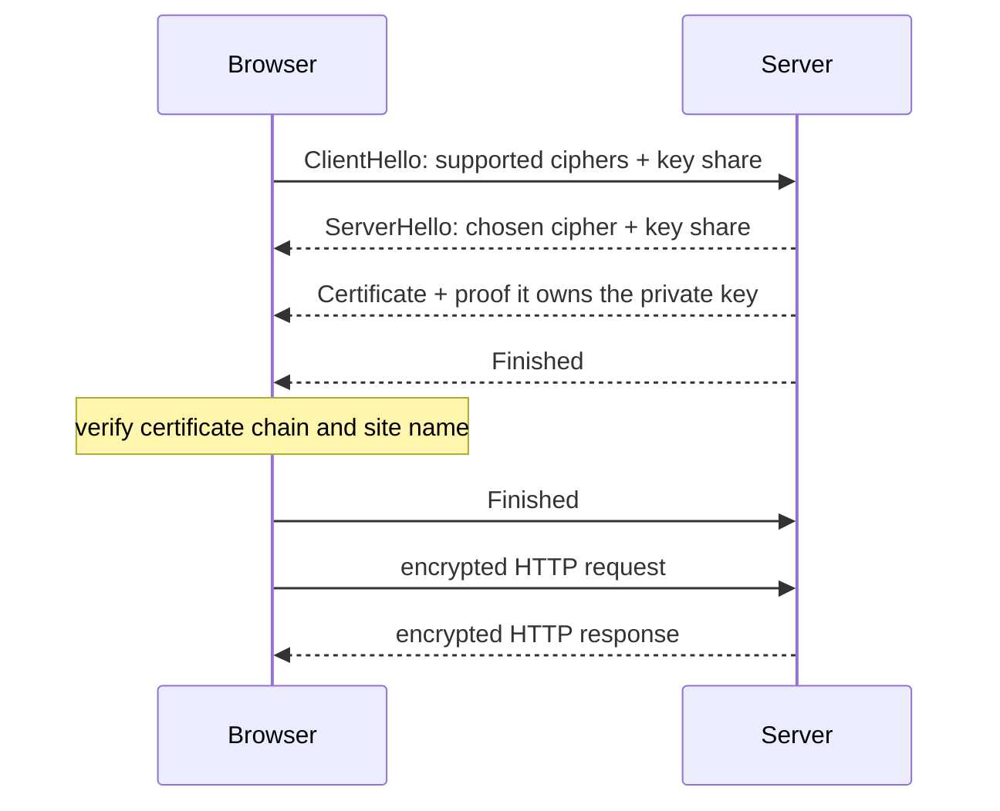

# How HTTPS Protects Your Data

*Every padlock icon in your browser represents a cryptographic handshake that happened in milliseconds — here's exactly how it works.*

---

> *“Security is a process, not a product.”*
>
> — **Bruce Schneier**, *Crypto-Gram* newsletter, 2000

## At a Glance

> **In one sentence:** HTTPS wraps HTTP in TLS, which uses certificates to prove a server's identity, public-key cryptography to agree on secret keys, and fast symmetric encryption to keep every byte private and tamper-proof in transit.

**You'll learn**

- What HTTPS protects — and what it doesn't
- Symmetric vs. public-key (asymmetric) encryption and why TLS uses both
- The TLS 1.3 handshake step by step
- Certificates, certificate authorities, and the chain of trust
- Forward secrecy, HSTS, and common TLS misconfigurations

**Before you start:** [HTTP, TCP/IP, and the Protocol Stack](HTTP-TCP-IP-and-the-Protocol-Stack.md) · [How DNS Works](How-DNS-Works.md)

**Reading time:** about 35 minutes

---

## The Big Picture



*In one round trip, TLS 1.3 agrees on fresh keys and proves the server's identity; everything after that is encrypted.*

---

## Introduction

Imagine mailing a letter. With a plain postcard, anyone who handles it along the way — the postal worker, a nosy neighbor, someone who intercepts your mailbox — can read every word. Now imagine instead you seal that letter in a tamper-evident envelope, stamped with a wax seal that only you and the recipient can verify, and the envelope itself is impossible to open without leaving obvious evidence. That's the difference between **HTTP** and **HTTPS**.

**HTTPS (Hypertext Transfer Protocol Secure)** is HTTP layered on top of **TLS (Transport Layer Security)** — a cryptographic protocol that provides three guarantees for every request your browser makes:

1. **Confidentiality** — nobody in between can read the data (encryption)
2. **Integrity** — nobody in between can modify the data without detection (message authentication)
3. **Authenticity** — you're actually talking to the server you think you're talking to (certificates)

Without HTTPS, every password you type, every credit card number you submit, every private message you send travels across the internet as **plaintext** — readable by your ISP, the coffee shop Wi-Fi operator, or anyone running a packet sniffer on the network path between you and the server.

### Why Should Engineers Care About HTTPS?

TLS is not just "the padlock." It's a piece of infrastructure that every engineer touches, whether they realize it or not:

- Misconfigured TLS causes production outages (expired certificates have taken down Microsoft Teams, Ericsson-powered mobile networks, and countless smaller services)
- Understanding the handshake lets you diagnose "why is my API slow" (extra round trips, missing session resumption, huge certificate chains)
- Certificate management (issuance, rotation, revocation) is now a first-class DevOps responsibility, not something you set once and forget
- Modern browsers actively punish sites without HTTPS — mixed content warnings, "Not Secure" labels, and disabled APIs (geolocation, service workers, HTTP/2) all require a secure context
- Security incidents like Heartbleed and POODLE reshaped how the entire industry builds and audits cryptographic software — understanding *why* they happened prevents you from repeating the same class of mistake

### Where Is HTTPS Used?

| Scenario | HTTPS's Role |
|----------|---------------|
| Browsing any website | Encrypts the page content, cookies, and form submissions |
| Logging into an app | Protects credentials from network eavesdroppers |
| API calls (REST/GraphQL) | Encrypts request/response bodies and auth tokens |
| Mobile apps | Protects data between the app and backend services |
| Microservice-to-microservice | mTLS secures internal traffic inside a service mesh |
| CDN edge delivery | TLS termination happens at the edge, close to the user |
| Payment processing | PCI-DSS mandates TLS for any cardholder data in transit |
| IoT device communication | Encrypts telemetry and command traffic |

---

## The Problem It Solves

### What Happens Without This?

Plain HTTP traffic is sent as unencrypted text over the wire. Anyone positioned on the network path — a malicious Wi-Fi access point, a compromised router, an ISP performing traffic inspection, or a nation-state intercepting a transatlantic cable — can perform a **Man-in-the-Middle (MITM) attack**:

```
  You                      Attacker (on the network path)              Real Server
   |                              |                                         |
   |---- GET /login HTTP -------->|                                         |
   |     username=alice           |---- forwards, but reads/logs it ------->|
   |     password=hunter2         |                                         |
   |                              |<---------- 200 OK, session cookie ------|
   |<----------- 200 OK ----------|  (attacker now has your password       |
   |     (attacker also has       |   AND your session cookie)             |
   |      your session cookie)    |                                         |
```

Concretely, without HTTPS, an attacker on the same network can:

- **Read plaintext credentials** — usernames, passwords, API keys, session tokens sent in headers or form bodies
- **Hijack sessions** — steal an unencrypted session cookie (this is exactly what the 2010 Firesheep tool did to Facebook sessions over open Wi-Fi)
- **Inject content** — modify a plain HTTP response in transit to insert ads, malware, or phishing forms (ISPs in several countries were caught doing this for advertising injection)
- **Perform DNS-independent impersonation** — even if DNS resolves correctly, an attacker between you and the real IP can intercept the TCP stream and pretend to *be* the server
- **Downgrade the connection** — strip away any attempt to upgrade to HTTPS (this is the exact attack HSTS was invented to stop, covered later in this chapter)

### What Was Needed

The web needed a way to:

1. **Encrypt data in transit** so eavesdroppers see only ciphertext
2. **Verify the identity of the server** so users know they're talking to the real `bank.com`, not an impostor
3. **Detect tampering** so a modified packet is rejected rather than silently accepted
4. **Do all of this without out-of-band key exchange** — two strangers (a browser and a server that have never met) need to establish a shared secret over a public, hostile network
5. **Scale to billions of connections per day** with minimal added latency

TLS — and the certificate authority ecosystem that backs it — was built to satisfy exactly these requirements.

---

## Historical Background

### 1994–1996: SSL 1.0, 2.0, and 3.0 (Netscape)

**Taher Elgamal**, chief scientist at Netscape Communications (and inventor of the ElGamal encryption scheme), led the design of the **Secure Sockets Layer (SSL)** protocol to secure the then-new World Wide Web for e-commerce.

- **SSL 1.0** (1994) was never publicly released — it had serious security flaws found during internal review
- **SSL 2.0** (1995) shipped in Netscape Navigator but had significant weaknesses (no protection against man-in-the-middle downgrade, weak MAC construction). It was formally deprecated by **RFC 6176** in 2011
- **SSL 3.0** (1996), authored by Elgamal along with Paul Kocher and others, was a full redesign. It became the foundation for everything that followed. SSL 3.0 was itself formally deprecated in **RFC 7568** (2015) after the POODLE attack, discussed below

### 1999: TLS 1.0 (RFC 2246)

The **IETF** took over standardization from Netscape and renamed the protocol **TLS (Transport Layer Security)** to signal it was now an open standard rather than a vendor product. TLS 1.0 was essentially SSL 3.1 — an incremental, mostly compatible upgrade published as **RFC 2246** in January 1999.

### 2006: TLS 1.1 (RFC 4346)

Published as **RFC 4346**, TLS 1.1 added protections against **CBC (Cipher Block Chaining) attacks**, notably introducing explicit, per-record initialization vectors (IVs) instead of implicit chaining — directly addressing the class of vulnerability that BEAST would later exploit in TLS 1.0.

### 2008: TLS 1.2 (RFC 5246)

**RFC 5246** was a major upgrade: it allowed the negotiation of the hash/MAC algorithm (previously fixed to MD5+SHA-1), added support for **AEAD (Authenticated Encryption with Associated Data)** cipher suites like AES-GCM, and gave implementers far more cryptographic flexibility. TLS 1.2 remained the dominant production protocol for a full decade.

### 2011–2015: The Attack Years

A string of practical attacks against SSL/TLS forced the industry to modernize:

- **2011 — BEAST** (Browser Exploit Against SSL/TLS): Thai Duong and Juliano Rizzo demonstrated a practical chosen-plaintext attack against TLS 1.0's CBC-mode ciphers
- **2014 — Heartbleed (CVE-2014-0160)**: A buffer over-read bug in OpenSSL's implementation of the TLS heartbeat extension, disclosed April 7, 2014
- **2014 — POODLE** (Padding Oracle On Downgraded Legacy Encryption): Google researchers (Bodo Möller, Thai Duong, Krzysztof Kotowicz) disclosed a padding oracle attack against SSL 3.0 in October 2014
- **2015 — FREAK and Logjam**: Attacks exploiting deliberately weakened "export-grade" cryptography left over from 1990s U.S. export restrictions

### 2015–2016: Let's Encrypt Launches

The **Internet Security Research Group (ISRG)** — backed by the Electronic Frontier Foundation, Mozilla, Cisco, Akamai, and later many others — launched **Let's Encrypt**, a free, automated certificate authority. It issued its first certificate in September 2015 and entered public beta in December 2015, exiting beta in April 2016. Let's Encrypt's **ACME protocol** made automated, scriptable certificate issuance the industry norm.

### 2014–2018: Google Pushes "HTTPS Everywhere"

Google began treating HTTPS as a competitive advantage for the open web:

- **August 2014**: Google announced HTTPS as a lightweight **ranking signal** in search results
- **2017–2018**: Chrome progressively began marking plain HTTP pages with password or credit card fields, and eventually all HTTP pages, as **"Not Secure"** in the address bar
- **Chrome 68** (July 2018) marked *every* HTTP site as "Not Secure" by default, a major forcing function for site-wide HTTPS adoption

### 2018: TLS 1.3 (RFC 8446)

Published in August 2018 after roughly four years of IETF design work and dozens of draft revisions, **RFC 8446** was a ground-up simplification: it removed obsolete and insecure options entirely (RC4, DES, 3DES, MD5, SHA-1 in the handshake, static RSA key exchange, custom Diffie-Hellman groups, compression), mandated **forward secrecy** for all key exchanges, and cut the handshake from two round trips down to one (with an optional zero-round-trip mode for resumed connections).

---

## Core Concepts

### Symmetric vs. Asymmetric Encryption

TLS uses **both** types of cryptography, each for what it's good at.

**Symmetric encryption** uses a single shared key for both encryption and decryption. It's extremely fast and is what actually protects the bulk of your data.

```
Plaintext --[Key K]--> Ciphertext --[Key K]--> Plaintext
           encrypt                  decrypt
```

- Examples: AES-128-GCM, AES-256-GCM, ChaCha20-Poly1305
- Problem: both parties need the *same* key — but how do two strangers on the open internet agree on a secret key without an eavesdropper learning it too?

**Asymmetric (public-key) encryption** uses a mathematically related key pair: a **public key** (safe to share with anyone) and a **private key** (kept secret). Data encrypted with the public key can only be decrypted with the private key.

```
Plaintext --[Public Key]--> Ciphertext --[Private Key]--> Plaintext
           anyone can do this            only the key owner can do this
```

- Examples: RSA, Elliptic Curve Diffie-Hellman (ECDHE), Ed25519
- Solves the key-agreement problem, but is 100–1000x slower than symmetric encryption for bulk data

**TLS's core trick:** use slow asymmetric cryptography *only* to establish a shared symmetric key, then switch to fast symmetric encryption for the actual data.

| Property | Symmetric | Asymmetric |
|----------|-----------|------------|
| Speed | Very fast (GB/s) | Slow (thousands of ops/sec) |
| Key count | 1 shared secret | 2 (public + private) |
| Used for | Bulk data encryption | Key exchange, signatures |
| Example algorithms | AES-GCM, ChaCha20-Poly1305 | RSA, ECDHE, Ed25519 |

### Hashing and Message Authentication

A **cryptographic hash function** (SHA-256, SHA-384) takes arbitrary input and produces a fixed-size fingerprint. It's one-way (can't be reversed) and collision-resistant (nearly impossible to find two inputs with the same hash).

Modern TLS doesn't use separate hash-based MACs for bulk data — instead it uses **AEAD ciphers** (like AES-GCM), which combine encryption and integrity-checking into a single operation, producing an authentication tag alongside the ciphertext. If even one bit of the ciphertext is altered in transit, the tag fails to verify and the record is rejected.

### Digital Signatures

A digital signature proves that a specific private-key holder vouches for a piece of data, without revealing the private key itself.

```
Server's Private Key + Data --> Signature
Anyone with Server's Public Key + Data + Signature --> Valid / Invalid
```

This is the mechanism that lets a Certificate Authority "vouch" for a website's identity: the CA signs the website's public key with the CA's own private key, and anyone holding the CA's public key can verify that signature.

### Certificates

A **certificate** binds a public key to an identity (a domain name) and is itself signed by a trusted third party. Certificates follow the **X.509** standard.

```
X.509 Certificate (simplified)
┌─────────────────────────────────────────┐
│ Version: 3                               │
│ Serial Number: 04:3F:AB:...              │
│ Signature Algorithm: SHA256withRSA       │
│ Issuer: C=US, O=Let's Encrypt, CN=R3     │
│ Validity:                                │
│   Not Before: 2026-05-01                 │
│   Not After:  2026-07-30                 │
│ Subject: CN=example.com                  │
│ Subject Public Key Info:                 │
│   Algorithm: id-ecPublicKey              │
│   Public Key: 04:9A:2E:...               │
│ Extensions:                              │
│   Subject Alternative Names: example.com,│
│     www.example.com                      │
│   Key Usage: Digital Signature           │
│   Extended Key Usage: TLS Web Server     │
│   Basic Constraints: CA:FALSE            │
│ Signature: <CA's signature over above>   │
└─────────────────────────────────────────┘
```

### Cipher Suites

A **cipher suite** is a named bundle of algorithms negotiated at the start of a TLS session. In TLS 1.2, a cipher suite specified four things; TLS 1.3 simplified this to just the symmetric algorithm + hash, since key exchange and signature algorithms are negotiated separately.

| Component | TLS 1.2 Example | Purpose |
|-----------|-----------------|---------|
| Key exchange | ECDHE | How the shared secret is derived |
| Authentication | RSA | How the server proves its identity |
| Bulk cipher | AES_128_GCM | Encrypts the actual data |
| MAC/PRF | SHA256 | Integrity and key derivation |

Example TLS 1.2 name: `TLS_ECDHE_RSA_WITH_AES_128_GCM_SHA256`
Example TLS 1.3 name: `TLS_AES_128_GCM_SHA256` (key exchange/auth negotiated separately via supported_groups and signature_algorithms extensions)

### Perfect Forward Secrecy (PFS)

With forward secrecy, each session uses a freshly generated, ephemeral key exchange (ECDHE — the "E" stands for Ephemeral). Even if an attacker later steals the server's long-term private key, they cannot decrypt *previously recorded* traffic, because that traffic's session keys were never derived from the long-term key and are gone forever once the session ends. TLS 1.3 makes forward secrecy **mandatory** for all full handshakes — a requirement that was merely a best practice under TLS 1.2.

---

## Real-World Analogy

### The Notary, the Wax Seal, and the One-Time Code Book

Imagine Alice wants to send a confidential letter to a bank, and she's never met anyone at the bank before.

**Step 1 — Verifying identity (the certificate chain):** Before sealing anything, Alice checks the bank's credentials. The bank shows her an ID card (its certificate) stamped by a local notary (an intermediate CA), whose own authority was granted by the national government (the root CA). Alice's ID-checking booklet (her browser's trust store) already lists the national government as trustworthy, so by following the chain — government trusts notary, notary vouches for bank — Alice can trust the bank's identity without ever having met them before.

**Step 2 — Agreeing on a private code (the key exchange):** Alice and the bank can't just shout a secret codeword across the room — anyone listening would hear it. Instead, they use a clever mathematical trick (Diffie-Hellman key exchange): each of them publicly exchanges a scrambled number, and through math that only makes sense when combined with their own secret, they *both* independently arrive at the same shared secret — while an eavesdropper who heard both scrambled numbers cannot derive that secret at all.

**Step 3 — Sealing and checking the letters (symmetric encryption + integrity):** Now that Alice and the bank share a private code, they use it to write every message in a fast, reusable cipher (symmetric encryption), and they add a tamper-evident wax seal to every envelope (the authentication tag) so that if anyone opens and alters the letter in transit, the broken seal gives it away immediately.

**Step 4 — A fresh code book every conversation (forward secrecy):** Crucially, Alice and the bank throw away this private code the moment the conversation ends and generate a brand-new one next time. Even if someone later steals the bank's master signing stamp, they cannot go back and decode yesterday's letters — those used a code that no longer exists anywhere.

This is, almost exactly, what happens between your browser and every HTTPS website: identity verification through a chain of trust, a public key exchange that produces a shared secret no eavesdropper can derive, fast symmetric encryption with built-in tamper detection, and disposable per-session keys.

---

## How It Works Internally

### TLS 1.2 Full Handshake (Two Round Trips)

```
Client                                                        Server
  |                                                              |
  |------------------ ClientHello -------------------------->  |
  |   (supported TLS versions, cipher suites, random_C)        |
  |                                                              |
  |<----------------- ServerHello ----------------------------- |
  |   (chosen version, chosen cipher suite, random_S)           |
  |<----------------- Certificate ------------------------------|
  |   (server's X.509 cert chain)                                |
  |<----------------- ServerKeyExchange (if ECDHE) --------------|
  |<----------------- ServerHelloDone ---------------------------|
  |                                                              |
  |------------------ ClientKeyExchange ----------------------->|
  |   (client's DH share, or RSA-encrypted premaster secret)    |
  |------------------ ChangeCipherSpec -------------------------->|
  |------------------ Finished (encrypted) ----------------------->|
  |                                                              |
  |<----------------- ChangeCipherSpec ---------------------------|
  |<----------------- Finished (encrypted) ------------------------|
  |                                                              |
  |============ Application Data (HTTP request) ================>|
  |                                                              |
     2 round trips before any application data can be sent
```

### TLS 1.3 Full Handshake (One Round Trip)

TLS 1.3 collapses the handshake by having the client guess the server's preferred key exchange group and send its key share *immediately* in the ClientHello — no more waiting for the server to state its choice first.

```
Client                                                        Server
  |                                                              |
  |------------------ ClientHello ----------------------------->|
  |   + key_share (client's ECDHE public value, guessed group)  |
  |   + supported_versions, signature_algorithms                |
  |                                                              |
  |<----------------- ServerHello -------------------------------|
  |   + key_share (server's ECDHE public value)                 |
  |   [Both sides can now derive the shared secret]              |
  |<=== {EncryptedExtensions} ====================================|
  |<=== {Certificate} =============================================|
  |<=== {CertificateVerify} =======================================|
  |<=== {Finished} ================================================|
  |    (everything from EncryptedExtensions onward is encrypted) |
  |                                                              |
  |=== {Finished} ================================================>|
  |=== Application Data (HTTP request) ===========================>|
  |                                                              |
     1 round trip before application data — nearly half the latency
```

**Key TLS 1.3 improvements:**

| Improvement | Detail |
|-------------|--------|
| 1-RTT full handshake | Client sends its key share speculatively in ClientHello; saves one full round trip vs. TLS 1.2 |
| 0-RTT resumption | Returning clients can send encrypted application data in their *very first* flight, using a resumption secret from a prior session (with replay-attack tradeoffs, discussed later) |
| Mandatory forward secrecy | Static RSA key exchange is removed entirely; every handshake uses an ephemeral (EC)DHE exchange |
| Removed insecure primitives | RC4, DES, 3DES, MD5, SHA-1, CBC-mode ciphers, and compression are all gone from the protocol |
| Encrypted handshake | The server's certificate and the rest of the handshake after ServerHello are encrypted, reducing metadata leakage |
| Simplified cipher suite negotiation | Only 5 cipher suites exist in TLS 1.3, all AEAD-based, vs. dozens of possible (and often insecure) combinations in TLS 1.2 |

### 0-RTT Resumption in Detail

```
First connection (full 1-RTT handshake) establishes a
"session ticket" / PSK (pre-shared key) that the client stores.

Later connection:
Client -----> ClientHello + early_data (encrypted HTTP request!) -----> Server
Client <----------------------- ServerHello, Finished ------------------ Server
Client -----> Finished ---------------------------------------------> Server

The client can send application data in the FIRST flight — zero
additional round trips after the initial TCP handshake. The tradeoff:
0-RTT data is NOT protected against replay attacks, so servers must
restrict it to idempotent requests (e.g., GET, not a $500 payment POST).
```

---

## Components and Architecture

### Root Certificate Authorities (Root CAs)

The topmost, self-signed certificates that browsers and operating systems ship with pre-installed trust for. Examples include DigiCert, IdenTrust, Sectigo, and ISRG's own **ISRG Root X1** (used by Let's Encrypt). Root CA private keys are kept in offline, air-gapped hardware security modules (HSMs) and used as rarely as possible, since compromise of a root key would be catastrophic.

### Intermediate CAs

Root CAs almost never sign leaf certificates directly. Instead, they sign one or more **intermediate CA** certificates, which do the day-to-day signing of website certificates. This limits exposure: if an intermediate is ever compromised or misused, it can be revoked without invalidating the root itself. Let's Encrypt's intermediate is called **R3** (or R10/R11 in newer ECDSA hierarchies), signed by ISRG Root X1.

### Leaf (End-Entity) Certificates

The certificate actually presented by `example.com`'s web server — signed by an intermediate, containing the site's public key, domain name(s) via Subject Alternative Names, and a validity window (Let's Encrypt certificates are valid for 90 days by design, to force automation and limit the blast radius of key compromise).

### The Chain of Trust

```
       Root CA (self-signed, pre-installed in OS/browser trust store)
        "ISRG Root X1"
             |
             | signs
             v
       Intermediate CA
        "R3" / "R10"
             |
             | signs
             v
       Leaf Certificate
        "example.com"

Verification walks UP the chain: browser checks that the leaf's
signature was made by R3's private key, then that R3's certificate
was signed by ISRG Root X1's private key, then confirms ISRG Root X1
is already in its local trust store. If every link verifies, and no
certificate in the chain is expired or revoked, the chain is trusted.
```

### CA/Browser Forum

The **CA/Browser Forum** is a voluntary consortium of certificate authorities and browser vendors (Google, Mozilla, Apple, Microsoft) that jointly defines the **Baseline Requirements** — the rules CAs must follow for domain validation, certificate lifetimes, revocation, and audit practices. Non-compliant CAs can be, and have been, distrusted by browsers (Symantec's CA business was distrusted by Chrome and Firefox in 2017–2018 after repeated Baseline Requirement violations).

### OCSP and CRLs

Two mechanisms exist to check whether a certificate has been revoked before its expiration date:

- **CRL (Certificate Revocation List)**: a signed list of all revoked serial numbers, published periodically by the CA
- **OCSP (Online Certificate Status Protocol)**: a real-time query ("is certificate X still valid?") answered directly by the CA

### TLS Termination Points

TLS doesn't always terminate at the origin server. Common architectures include:

- **CDN edge termination** (Cloudflare, Fastly, Akamai) — TLS ends at the nearest edge PoP to the user, then traffic may travel unencrypted or re-encrypted to the origin
- **Load balancer termination** (AWS ALB, NGINX, HAProxy) — TLS ends at the load balancer, plaintext HTTP flows to backend instances inside a trusted private network
- **End-to-end / mutual TLS (mTLS)** — TLS is re-established (or maintained) all the way to the application, common in service meshes (Istio, Linkerd) for zero-trust internal networking

### HSTS Preload List

Beyond the HSTS header (covered in Security Considerations), Chrome, Firefox, Safari, and Edge all ship a **hardcoded preload list** of domains that must *always* be contacted over HTTPS, even on the very first request — closing the "trust on first use" gap that a header-only approach can't cover.

---

## End-to-End Flow

### Example: Sam Logs Into Her Bank's Website

Sam opens her laptop, types `mybank.com`, and presses Enter. DNS has already resolved `mybank.com` to `203.0.113.42` (a Cloudflare edge IP). Here's the full TCP + TLS 1.3 sequence with realistic timings.

- **0ms:** Sam presses Enter. Browser already has the IP from a prior DNS lookup.
- **0–15ms:** **TCP handshake** — SYN, SYN-ACK, ACK (roughly 1 round trip, ~15ms to a nearby CDN edge).
- **15ms:** Browser sends **ClientHello** — includes supported TLS versions (TLS 1.3 preferred), cipher suites, an ECDHE key share for the `x25519` group, SNI (`mybank.com`, sent in plaintext so the edge server knows which certificate to present), and ALPN (advertising HTTP/2 support).
- **22ms:** Cloudflare edge responds with **ServerHello** (choosing TLS 1.3, `x25519`, `TLS_AES_128_GCM_SHA256`), its own key share, and — encrypted from this point on — `EncryptedExtensions`, `Certificate` (the leaf cert for `mybank.com` plus the intermediate), `CertificateVerify` (a signature proving the server holds the private key matching the leaf cert), and `Finished`.
- **23ms:** Sam's browser verifies the certificate chain: leaf → intermediate → a root already in its trust store (e.g., DigiCert Global Root), checks the domain name matches, checks the validity window, and checks OCSP-stapled revocation status included in the handshake. All pass.
- **23ms:** Browser derives the shared symmetric keys from the ECDHE exchange and sends its own **Finished** message, encrypted.
- **23ms:** Browser immediately sends the actual `GET /login` HTTP/2 request, encrypted, in the same flight as `Finished` — no extra round trip needed.
- **30ms:** Bank's origin server (behind Cloudflare) processes the login page request and responds.
- **35ms:** Sam sees the login page rendered. **Total time from DNS-resolved IP to rendered page: ~35ms**, of which the TLS handshake itself added roughly one round trip (~7ms) beyond the raw TCP connection.
- Sam types her username and password and clicks "Log in." The `POST /login` request travels over the *already-established* encrypted connection — no new handshake is needed, since TLS connections are reused for the lifetime of the underlying TCP connection (or resumed instantly via session tickets if a new connection is opened).
- **If this had been TLS 1.2 instead:** the handshake requires two full round trips before any HTTP data can flow, adding roughly another 15ms — a small but very real cost multiplied across billions of requests per day.

---

## Production Engineering Perspective

### Scalability

TLS termination is CPU-intensive at scale (asymmetric crypto operations, session key derivation). Modern mitigations:

- **Hardware acceleration** — AES-NI CPU instructions make symmetric encryption nearly free; dedicated TLS offload cards or HSMs handle high-volume signing
- **Session resumption** — session tickets and TLS 1.3 PSK resumption avoid repeating the expensive asymmetric handshake on every connection
- **TLS termination at the edge** — CDNs like Cloudflare terminate TLS across hundreds of globally distributed PoPs rather than a single origin, spreading handshake load geographically

### Reliability

- Certificate expiry is one of the single largest causes of *self-inflicted* outages in the industry (covered in Failure Scenarios below)
- Automated renewal (ACME/certbot, ACM auto-renewal) removes the human forgetfulness factor entirely
- Monitoring certificate expiration dates as a first-class alerting metric (not just a calendar reminder) is now considered standard practice

### Performance

| Metric | Typical Target | Notes |
|--------|----------------|-------|
| TLS 1.3 full handshake overhead | ~1 RTT | Half of TLS 1.2's ~2 RTT |
| Session resumption overhead | 0 RTT (TLS 1.3) or 1 RTT (TLS 1.2) | Avoids repeating asymmetric crypto |
| OCSP stapling lookup | 0 extra RTT (stapled into handshake) | vs. a separate client-side OCSP query |
| Cert chain size | < 5KB ideally | Oversized chains add packets, especially harmful on lossy mobile networks |

### Availability

TLS termination points need redundancy just like any other production component: multiple edge nodes, automated failover, and — critically — automated certificate renewal well before expiry (Let's Encrypt recommends renewing at the two-thirds mark of the 90-day lifetime, and certbot's default cron/systemd timer does exactly this).

### Maintainability

- Cipher suite and protocol version configuration needs periodic review — what was "secure" in 2015 (TLS 1.0, SHA-1 signatures) is actively insecure today
- Certificate rotation should be automated and tested (including revocation/renewal failure paths), not treated as a rare manual event
- Keeping TLS libraries (OpenSSL, BoringSSL) patched is itself a security-critical maintenance task, as Heartbleed demonstrated

---

## Tradeoffs

### ✅ Benefits

| Benefit | Explanation |
|---------|-------------|
| Confidentiality | Eavesdroppers see only ciphertext, not data |
| Integrity | Any tampering with data in transit is detected and the connection is dropped |
| Authentication | Certificates cryptographically prove server identity |
| Forward secrecy | Past sessions stay safe even if a long-term key is later compromised |
| SEO and browser trust | Search ranking boost, no "Not Secure" warnings, access to modern browser APIs |
| Now essentially free | Let's Encrypt and ACM make certificates free and auto-renewing |

### ❌ Drawbacks

| Drawback | Explanation |
|----------|--------------|
| CPU overhead | Asymmetric handshake operations cost real CPU, especially at massive scale |
| Operational complexity | Certificate issuance, rotation, and monitoring is another system to maintain |
| Added latency | Even TLS 1.3's 1-RTT handshake adds real round-trip time vs. plaintext |
| Misconfiguration risk | Weak cipher suites, expired certs, or broken chains can cause outages or false security |
| Doesn't hide metadata (fully) | SNI is sent in plaintext in most deployments (though Encrypted Client Hello is emerging to fix this); traffic timing/size analysis is still possible |

### ⚠️ Limitations

- HTTPS protects data **in transit**, not data at rest — a compromised server still exposes stored data
- It does not protect against application-layer vulnerabilities (SQL injection, XSS) — those live above the TLS layer entirely
- Certificate validation only proves domain control (for standard DV certs), not that an organization is trustworthy or legitimate in intent — phishing sites can and do have valid HTTPS certificates
- Compromise of a CA's private key, or a rogue/coerced CA, can undermine the entire chain of trust model (mitigated but not eliminated by Certificate Transparency)

### 🔁 Alternatives

| Context | Alternative |
|---------|-------------|
| Internal service-to-service auth | mTLS (mutual TLS) — both sides present certificates |
| Remote network access | VPN tunneling (WireGuard, IPsec) — encrypts all traffic, not just HTTP |
| Peer-to-peer/no PKI | Noise Protocol Framework, SSH-style trust-on-first-use |
| Legacy/embedded constrained devices | DTLS (TLS over UDP) for constrained or lossy links |

### When NOT to Use Plain Public-CA HTTPS

- **Purely internal, air-gapped networks** with no external exposure may reasonably use a private internal CA instead of a public one, avoiding public Certificate Transparency logging of internal hostnames
- **Extremely latency-sensitive, already-encrypted tunnels** (e.g., traffic already inside a WireGuard VPN) may not need a second layer of TLS on top, though defense-in-depth often still favors it
- **Zero-trust internal architectures** typically want mTLS rather than one-way server-only TLS, since server-only TLS doesn't authenticate the *client*

---

## Common Mistakes

### Beginner Mistakes

1. **Letting a certificate expire** — the single most common cause of self-inflicted HTTPS outages; browsers hard-fail with no user override on modern connections.
2. **Mixed content** — loading an HTTPS page that pulls in images, scripts, or stylesheets over plain `http://`. Browsers block active mixed content (scripts) outright and warn on passive content (images).
3. **Ignoring certificate warnings in development and disabling verification "temporarily"** — code like `verify=False` in a `requests` call often ships to production by accident.

### Intermediate Mistakes

4. **Serving an incomplete certificate chain** — sending only the leaf certificate without the intermediate. Some browsers cache intermediates and won't notice, but many clients (especially non-browser HTTP clients, mobile apps, and older devices) will fail to validate the chain entirely.
5. **Using outdated or weak cipher suites** — leaving TLS 1.0/1.1 or CBC-mode ciphers enabled "for compatibility" long after they're needed, widening the attack surface for BEAST/POODLE-class attacks.
6. **Not enabling OCSP stapling** — forcing every client to make a separate, slow, sometimes-blocked OCSP request to the CA instead of having the server staple the revocation status into the handshake itself.

### Senior-Level Architectural Mistakes

7. **No automated certificate rotation or expiry monitoring** — treating certificate renewal as a manual, calendar-based task instead of an automated pipeline with alerting well before expiry.
8. **Terminating TLS at the edge but leaving origin traffic unencrypted** — assuming a private network is inherently safe; internal traffic should still be encrypted (mTLS) in any zero-trust architecture.
9. **Pinning certificates without a rotation plan** — certificate pinning (especially in mobile apps) that isn't updated before the pinned certificate rotates can brick an entire app fleet, an issue serious enough that most guidance now favors public-key pinning with backup pins, or CT-based monitoring instead.
10. **Not accounting for 0-RTT replay risk** — enabling TLS 1.3 0-RTT for non-idempotent endpoints (like payment submission) without replay protection, allowing an attacker to resend a captured 0-RTT request.

---

## Failure Scenarios

### Scenario 1: Expired Certificate Outage

**What happens?** A certificate's `Not After` date passes. Every client attempting to connect receives a hard TLS validation failure (`ERR_CERT_DATE_INVALID` or similar) and the connection is refused — there's no graceful degradation.

**Why does it fail?** Certificate expiry is a manual or semi-automated process in many organizations. A renewal job silently failing, a forgotten manual certificate, or an automation script pointed at the wrong domain can all lead to an unnoticed lapse. A well-known real-world instance: in December 2019, an expired root certificate in Ericsson's software caused mobile network outages affecting millions of subscribers across multiple countries (including O2 in the UK and SoftBank in Japan), when SIM cards and network components lost the ability to validate the (now-expired) certificate used for diagnostic data.

**How to diagnose:** `openssl s_client -connect host:443 -servername host` and check the `notAfter` field; monitoring dashboards should alert well before expiry, not after.

**Solutions:**
- Automate renewal (ACME/certbot, AWS ACM auto-renewal) so no human step is required
- Alert at 30/14/7/1 days before expiry, independent of the renewal automation itself (so a broken automation pipeline is still caught)
- Treat certificate expiry monitoring as a production SLO, not an afterthought

### Scenario 2: Heartbleed Exploitation

**What happens?** An attacker sends a malformed TLS heartbeat request to a vulnerable OpenSSL server, tricking it into returning up to 64KB of adjacent process memory in its response — potentially including private keys, session tokens, or plaintext credentials from other users' active sessions.

**Why does it fail?** OpenSSL's heartbeat extension implementation (added in OpenSSL 1.0.1, released March 2012) failed to validate that the length field in the heartbeat request matched the actual payload sent, allowing an out-of-bounds memory read. The bug (CVE-2014-0160) went undetected in production OpenSSL for over two years before being independently discovered by a Google Security engineer and Codenomicon researchers, and publicly disclosed on April 7, 2014.

**How to diagnose:** Vulnerability scanners specifically targeting the heartbeat extension; checking the OpenSSL version against the known-affected range (1.0.1 through 1.0.1f).

**Solutions:**
- Patch to OpenSSL 1.0.1g or later immediately
- **Revoke and reissue every certificate** that was served by a vulnerable server (since private keys may have leaked) — many organizations initially patched the software but skipped this step
- Force password resets and session invalidation for affected services
- Adopt fuzzing and memory-safety tooling in cryptographic library development going forward (this incident significantly accelerated adoption of tools like AFL and OSS-Fuzz for security-critical C code)

### Scenario 3: POODLE Downgrade Attack

**What happens?** An attacker positioned on the network forces a TLS connection to fall back to SSL 3.0 (by interfering with the initial handshake attempts at higher versions), then exploits a padding oracle in SSL 3.0's CBC-mode cipher construction to decrypt small amounts of "secret" data (like a session cookie) one byte at a time.

**Why does it fail?** Many servers and clients, for backward-compatibility, would gracefully fall back to older, weaker protocol versions when a handshake at a higher version failed for any reason — including a reason engineered by the attacker. SSL 3.0's padding scheme, unlike TLS's, doesn't include a proper integrity check on the padding bytes, opening the padding oracle.

**How to diagnose:** SSL/TLS scanning tools (like Qualys SSL Labs) flag SSL 3.0 support explicitly; server logs showing unexpected protocol downgrades can also be a signal.

**Solutions:**
- Disable SSL 3.0 entirely on both server and client (formally deprecated by RFC 7568 in 2015)
- Implement **TLS_FALLBACK_SCSV**, a signaling mechanism that lets a server detect and reject an artificially forced downgrade
- More broadly: remove support for any protocol version or cipher mode with known-weak construction rather than relying on "it'll only be used as a fallback"

### Scenario 4: Certificate Chain Misconfiguration

**What happens?** A server is configured with a valid leaf certificate but fails to serve the required intermediate certificate(s). Some browsers succeed anyway (because they've cached the intermediate from a previous visit to a *different* site using the same CA), giving engineers a false sense that everything works, while other clients (curl, mobile app HTTP stacks, IoT devices) fail outright with a chain validation error.

**Why does it fail?** TLS chain validation requires the full path from leaf to a trusted root; if any intermediate is missing, non-browser clients typically have no fallback mechanism to fetch it themselves.

**How to diagnose:** `openssl s_client -connect host:443 -servername host -showcerts` and inspect whether the intermediate is present in the returned chain; SSL Labs' server test explicitly flags "Chain issues: Incomplete."

**Solutions:**
- Always configure the web server (nginx, Apache, load balancer) to serve the **full chain** (`fullchain.pem`, not just `cert.pem`) — this is precisely why Let's Encrypt's certbot outputs a `fullchain.pem` file by default
- Test with multiple independent tools/clients, not just a browser, before considering a deployment verified

---

## Security Considerations

### HSTS (HTTP Strict Transport Security)

Defined in **RFC 6797**, the `Strict-Transport-Security` response header tells a browser: "never connect to this domain over plain HTTP again, for the next N seconds — automatically upgrade every request." This closes the gap where an attacker intercepts a user's *first* HTTP request (before any redirect to HTTPS can even happen) and strips the upgrade.

```
Strict-Transport-Security: max-age=63072000; includeSubDomains; preload
```

- `max-age` — how long (in seconds) the browser should enforce HTTPS-only for this domain
- `includeSubDomains` — extends the policy to all subdomains
- `preload` — opts the domain into the hardcoded browser preload list, closing the first-visit gap entirely

### Certificate Pinning

An application can "pin" the expected certificate or public key for a given host, rejecting connections even if a technically-valid-but-unexpected certificate is presented (useful against a compromised or coerced CA). It's powerful but risky: if the pinned key rotates without a coordinated app update, clients lose connectivity entirely. This has led many teams to prefer Certificate Transparency monitoring over hard pinning.

### OCSP Stapling

Instead of every client independently querying the CA's OCSP responder (adding latency and leaking browsing history to the CA), the **server** periodically fetches a signed, time-stamped OCSP response and "staples" it directly into the TLS handshake. The client verifies the stapled response's signature and freshness without any extra network round trip.

### Certificate Transparency (CT)

Following high-profile incidents of misissued certificates, Google championed **Certificate Transparency**: every publicly trusted certificate must be logged in append-only, publicly auditable CT logs before browsers will trust it. Domain owners can monitor CT logs (e.g., via crt.sh) to detect if a certificate was ever issued for their domain without authorization — a critical detection mechanism that doesn't exist for many other classes of security compromise.

### Downgrade Attack Prevention

TLS 1.3 embeds specific anti-downgrade protections: the server signs a value that includes an indicator if it detects the client is capable of a higher version than what's being negotiated, allowing the client to detect an attacker-forced downgrade to TLS 1.2 or earlier and abort the connection.

---

## Performance Considerations

### Bottlenecks

| Bottleneck | Why It Happens | How to Fix |
|------------|-----------------|------------|
| Full handshake round trips | Each new connection requires 1 RTT (TLS 1.3) or 2 RTT (TLS 1.2) before data flows | Use TLS 1.3; enable session resumption |
| Large certificate chains | Oversized chains (extra intermediates, unnecessary cross-signs) add packets | Trim chains to the minimum required, prefer ECDSA certs (smaller than RSA) |
| Cold OCSP lookups | Client-side OCSP queries add a synchronous network round trip | Enable OCSP stapling on the server |
| Repeated full handshakes | Not reusing session tickets/PSKs across reconnects | Enable and correctly configure session resumption |
| TLS termination CPU cost | Asymmetric handshake operations are CPU-intensive at high connection volume | Use hardware AES-NI acceleration; terminate at scaled edge infrastructure |

### Optimization Strategies

1. **Session tickets / session resumption** — avoid repeating the full asymmetric handshake for returning clients
2. **TLS 1.3 0-RTT** — for idempotent, replay-safe requests, eliminate the round trip entirely
3. **OCSP stapling** — remove the client-side revocation-check round trip
4. **TLS termination at the CDN edge** — shortens the physical round-trip distance for the handshake itself, which is the most latency-sensitive part of the connection
5. **Prefer ECDSA over RSA certificates** — ECDSA signatures and keys are significantly smaller, reducing handshake bytes on the wire (very noticeable on lossy mobile networks)
6. **HTTP/2 and HTTP/3** — multiplex many requests over a single TLS connection, amortizing the handshake cost across the entire page load instead of paying it per-resource

### Scaling Challenges

- High-volume services (CDNs, large SaaS platforms) handle millions of concurrent handshakes; hardware crypto acceleration and horizontally-scaled edge termination are essential
- Session ticket key rotation must be synchronized across a fleet of load balancers/edge nodes, or resumption silently falls back to full handshakes
- QUIC/HTTP-3's integration of the TLS 1.3 handshake directly into the transport layer's initial packets is the next step in reducing connection-establishment latency further

---

## Real-World Industry Examples

### Cloudflare — Universal SSL

In September 2014, Cloudflare launched **Universal SSL**, issuing free HTTPS certificates to every domain on its free tier — instantly making HTTPS available to millions of sites that previously had none. Cloudflare terminates TLS at its globally distributed edge network (300+ cities), using SNI-based multi-tenant certificate serving so thousands of unrelated domains can share the same edge IP address while presenting the correct certificate per-connection.

### Let's Encrypt / ISRG — Free, Automated Certificates at Scale

Let's Encrypt, run by the nonprofit Internet Security Research Group, pioneered fully automated certificate issuance via the **ACME protocol** (RFC 8555). It deliberately issues certificates with a short 90-day lifetime specifically to force automation and reduce the damage window of any key compromise. As of the mid-2020s, Let's Encrypt secures several hundred million websites, making it one of the largest certificate authorities in the world by volume, entirely free of charge.

### Google — TLS 1.3 Rollout in Chrome and BoringSSL

Google forked OpenSSL into **BoringSSL** in 2014 to maintain a leaner, internally-controlled TLS implementation for Chrome and Google's infrastructure. Google engineers were heavily involved in the IETF TLS working group's design of TLS 1.3, and Chrome began experimenting with draft versions of TLS 1.3 well before RFC 8446's final publication in 2018, helping validate the protocol's real-world interoperability at massive scale before standardization.

### Meta (Facebook) — Fizz TLS Library

Facebook built and open-sourced **Fizz**, a C++14 implementation of TLS 1.3 designed for extremely high-performance, high-concurrency use inside Facebook's infrastructure, supporting 0-RTT resumption and integrating tightly with Facebook's internal proxy and load-balancing layers to secure traffic at the scale of billions of daily connections.

### Amazon — AWS Certificate Manager (ACM)

AWS Certificate Manager provisions and **automatically renews** free public TLS certificates for use with AWS services (ELB/ALB, CloudFront, API Gateway), removing the manual certificate lifecycle entirely for customers who terminate TLS within AWS-managed infrastructure — a managed-service parallel to what Let's Encrypt's ACME automation does for self-hosted infrastructure.

---

## Case Studies

### Case Study 1: Heartbleed (April 2014)

**What happened:** A memory-disclosure vulnerability (CVE-2014-0160) in OpenSSL's heartbeat extension allowed remote attackers to read up to 64KB of a server's process memory per request, with no authentication required and no trace left in normal logs.

**Root cause:** A missing bounds check in OpenSSL's `dtls1_process_heartbeat`/`tls1_process_heartbeat` functions — the code trusted a client-supplied length field without validating it against the actual payload size.

**Solution:** Patch to a fixed OpenSSL version, then revoke and reissue every potentially-exposed certificate and rotate every potentially-exposed credential — not just patch and move on.

**Lesson:** A single missing bounds check in one of the internet's most widely deployed cryptographic libraries put a meaningful fraction of the web's private keys and user sessions at risk simultaneously. It permanently changed how the industry funds and audits critical open-source infrastructure (leading directly to the creation of the **Core Infrastructure Initiative** by the Linux Foundation to fund security work on projects like OpenSSL).

### Case Study 2: POODLE Disclosure (October 2014)

**What happened:** Google researchers publicly disclosed a padding oracle vulnerability in SSL 3.0 that let an active network attacker decrypt small pieces of "secret" data (such as session cookies) from a connection, by forcing a protocol downgrade and exploiting weaknesses in SSL 3.0's CBC padding validation.

**Root cause:** SSL 3.0's cipher-block-chaining padding scheme didn't cryptographically verify the padding bytes themselves, and widespread "fallback to older protocol on handshake failure" behavior in clients gave attackers an easy way to force the downgrade in the first place.

**Solution:** Disable SSL 3.0 across the industry (formally deprecated in RFC 7568, 2015); adopt `TLS_FALLBACK_SCSV` so servers can detect and refuse artificially forced downgrades.

**Lesson:** "Graceful fallback for compatibility" is itself a security-relevant design decision — a protocol's weakest supported version becomes an active attack surface for the entire connection, not merely a niche compatibility concern.

### Case Study 3: Microsoft Teams Certificate Expiry Outage (2020)

**What happened:** On February 3, 2020, Microsoft Teams experienced a significant global outage after an internal authentication certificate expired and was not rotated in time, breaking authentication token validation across the service for several hours during peak business usage.

**Root cause:** An automation gap — the certificate renewal process failed to complete before expiration, and the resulting hard authentication failure had no graceful degradation path.

**Solution:** Microsoft manually rotated the expired certificate and restored service; the incident prompted broader post-mortem review of certificate lifecycle automation across Microsoft's cloud services.

**Lesson:** Certificate expiry doesn't just break TLS handshakes at the network edge — it can break authentication and token-signing infrastructure deep inside a service, with just as sudden and total an impact. Certificate expiry monitoring needs to cover *every* certificate in a system, not just the outward-facing web server one.

---

## Practical Code Examples

### Inspecting a Server's TLS Configuration with `openssl s_client`

```bash
# Full handshake trace with the certificate chain
openssl s_client -connect example.com:443 -servername example.com -showcerts

# Check just the negotiated protocol and cipher
openssl s_client -connect example.com:443 -servername example.com </dev/null 2>/dev/null | openssl x509 -noout -dates

# Force a specific TLS version to check what's supported
openssl s_client -connect example.com:443 -tls1_2
openssl s_client -connect example.com:443 -tls1_3
```

### Generating a Private Key and a CSR (Certificate Signing Request)

```bash
# Generate an ECDSA private key (smaller, faster than RSA)
openssl ecparam -genkey -name prime256v1 -noout -out example.com.key

# Generate a CSR from that key
openssl req -new -key example.com.key -out example.com.csr \
  -subj "/CN=example.com" \
  -addext "subjectAltName=DNS:example.com,DNS:www.example.com"

# Inspect the CSR
openssl req -in example.com.csr -noout -text
```

### Modern NGINX TLS Configuration

```nginx
server {
    listen 443 ssl http2;
    server_name example.com;

    ssl_certificate     /etc/letsencrypt/live/example.com/fullchain.pem;
    ssl_certificate_key /etc/letsencrypt/live/example.com/privkey.pem;

    # Only modern, secure protocol versions
    ssl_protocols TLSv1.2 TLSv1.3;

    # Strong, forward-secret cipher suites only
    ssl_ciphers ECDHE-ECDSA-AES128-GCM-SHA256:ECDHE-RSA-AES128-GCM-SHA256:ECDHE-ECDSA-CHACHA20-POLY1305;
    ssl_prefer_server_ciphers off;  # TLS 1.3 clients choose; irrelevant for 1.3 anyway

    # OCSP stapling
    ssl_stapling on;
    ssl_stapling_verify on;

    # Session resumption
    ssl_session_cache shared:SSL:10m;
    ssl_session_timeout 1d;
    ssl_session_tickets on;

    # HSTS
    add_header Strict-Transport-Security "max-age=63072000; includeSubDomains; preload" always;
}
```

### Issuing and Auto-Renewing a Certificate with Certbot (Let's Encrypt)

```bash
# Obtain and install a certificate for nginx automatically
sudo certbot --nginx -d example.com -d www.example.com

# Dry-run the renewal process (what the cron/systemd timer does nightly)
sudo certbot renew --dry-run

# List currently managed certificates and their expiry dates
sudo certbot certificates
```

### Verifying TLS Certificates Correctly in Python

```python
import requests

# Correct: verify=True is the default — never disable it in production
response = requests.get("https://example.com", verify=True)

# Pinning to a custom CA bundle (e.g., an internal CA)
response = requests.get(
    "https://internal-service.corp",
    verify="/etc/ssl/certs/internal-ca-bundle.pem",
)

# WRONG — do not do this outside of local, throwaway debugging:
# response = requests.get("https://example.com", verify=False)
```

### Checking Certificate Expiry Programmatically (Python, `ssl` + `socket`)

```python
import ssl
import socket
from datetime import datetime

def days_until_expiry(hostname: str, port: int = 443) -> int:
    ctx = ssl.create_default_context()
    with socket.create_connection((hostname, port), timeout=5) as sock:
        with ctx.wrap_socket(sock, server_hostname=hostname) as tls_sock:
            cert = tls_sock.getpeercert()
            expires = datetime.strptime(cert["notAfter"], "%b %d %H:%M:%S %Y %Z")
            return (expires - datetime.utcnow()).days

print(days_until_expiry("example.com"))
```

---

## Frequently Asked Questions

**Q: Does HTTPS make my website slower?**

It adds the cost of one round trip for the initial handshake (TLS 1.3) or two (TLS 1.2), plus modest CPU overhead. In practice, session resumption, HTTP/2 multiplexing, and modern hardware make this overhead negligible for almost all applications — and it's a prerequisite for HTTP/2 and HTTP/3 in every major browser anyway, which often make pages *faster* overall.

**Q: What's the difference between a domain-validated (DV), organization-validated (OV), and extended-validation (EV) certificate?**

A DV certificate only proves the requester controls the domain (what Let's Encrypt issues, typically in seconds via ACME). An OV certificate additionally verifies the requesting organization's legal existence. An EV certificate requires the most rigorous vetting of organizational identity. Modern browsers no longer give EV certificates special address-bar UI treatment, so DV certificates from automated CAs are now the overwhelming majority in production use.

**Q: Can HTTPS be "man-in-the-middled" at all?**

Only if the attacker controls a certificate the client trusts — e.g., a compromised CA, a corporate proxy with its own CA installed in the trust store (common in enterprise environments), or a client tricked into trusting a malicious root certificate. Certificate Transparency and certificate pinning both exist specifically to raise the cost of covert MITM via a rogue or coerced CA.

**Q: Why did TLS 1.3 remove RSA key exchange?**

Static RSA key exchange doesn't provide forward secrecy — if the server's private key is ever compromised, an attacker who recorded past encrypted traffic can decrypt all of it retroactively. TLS 1.3 makes ephemeral (EC)DHE mandatory specifically to guarantee forward secrecy for every session, no exceptions.

**Q: What is 0-RTT and why is it risky?**

0-RTT lets a returning client send encrypted application data in its very first network flight, using a resumption secret from a previous session — eliminating a full round trip of latency. The risk is replay: an attacker who captures a 0-RTT packet can resend it, and the server has no protocol-level way to distinguish a replay from a legitimate retry. Servers must restrict 0-RTT to idempotent, replay-safe operations.

**Q: Do I need a certificate for internal/private services?**

Generally yes — internal traffic is not automatically trustworthy just because it's "inside the network." Many organizations run a private internal CA (or use short-lived certificates via a service mesh like Istio's Citadel/istiod) specifically so internal service-to-service traffic is encrypted and mutually authenticated (mTLS), consistent with zero-trust network principles.

---

## Interview Questions

### Beginner Questions

**Q1: What does HTTPS actually add on top of HTTP?**

HTTPS is HTTP running inside a TLS-encrypted, authenticated channel. It adds confidentiality (encryption of the data), integrity (tamper detection), and authenticity (the server proves its identity via a certificate signed by a trusted CA) — none of which plain HTTP provides.

**Q2: What is the difference between symmetric and asymmetric encryption, and why does TLS use both?**

Symmetric encryption uses one shared key for encryption and decryption and is very fast, but requires both parties to already share a secret. Asymmetric encryption uses a public/private key pair and solves the key-agreement problem but is much slower for bulk data. TLS uses asymmetric cryptography briefly during the handshake to establish a shared secret, then switches to fast symmetric encryption (like AES-GCM) for the actual application data.

**Q3: What is a certificate and who issues it?**

A certificate (X.509 format) binds a public key to an identity — typically a domain name — and is digitally signed by a Certificate Authority (CA) that browsers and operating systems already trust. It lets a client verify a server's identity without having communicated with that server before, by validating the CA's signature.

### Intermediate Questions

**Q4: Walk through the TLS 1.3 handshake step by step.**

The client sends a ClientHello containing supported versions, cipher suites, and a speculative ECDHE key share. The server responds with a ServerHello (choosing the version, cipher suite, and its own key share) — at which point both sides can already derive the shared secret. The rest of the server's handshake (EncryptedExtensions, Certificate, CertificateVerify, Finished) is then sent encrypted using that derived secret. The client verifies the certificate chain and signature, sends its own Finished message, and can send application data in the same flight — completing the full handshake in one round trip, versus two for TLS 1.2.

**Q5: What is Perfect Forward Secrecy and why does it matter?**

Forward secrecy means each session uses an ephemeral, session-specific key exchange (ECDHE) rather than deriving session keys directly from the server's long-term private key. Even if that long-term private key is later stolen, an attacker cannot decrypt previously recorded traffic, because the ephemeral keys used for that traffic were never derivable from the long-term key and are discarded after the session ends. TLS 1.3 makes this mandatory for every full handshake.

**Q6: What's the difference between OCSP and OCSP stapling?**

Plain OCSP requires the client to independently contact the CA's OCSP responder to check whether a certificate has been revoked, adding latency and leaking the client's browsing activity to the CA. OCSP stapling moves that responsibility to the server: the server periodically fetches a signed, time-stamped OCSP response from the CA and "staples" it directly into the TLS handshake, so the client can verify revocation status with zero extra round trips and no direct contact with the CA.

### Senior Questions

**Q7: Explain how the Heartbleed vulnerability worked and what the broader lesson was for the industry.**

Heartbleed (CVE-2014-0160) was a missing bounds check in OpenSSL's implementation of the TLS heartbeat extension: a client could send a heartbeat request claiming a payload length larger than what it actually sent, and the vulnerable server would respond with that many bytes read directly from adjacent process memory — potentially leaking private keys, session tokens, or other users' plaintext data, all without leaving a trace in normal logs. The broader lesson was that a huge portion of the internet's security rested on a single, under-resourced open-source library maintained by a small team; the incident directly led to major companies funding the Linux Foundation's Core Infrastructure Initiative and to much wider adoption of fuzzing (like OSS-Fuzz) for security-critical C/C++ code.

**Q8: How would you design a certificate rotation strategy for a fleet of thousands of internet-facing servers to avoid the kind of outage that hit Ericsson's mobile network infrastructure in 2019?**

Key elements: fully automate issuance and renewal (ACME/certbot or a managed service like AWS ACM) so no manual step is on the critical path; renew well before expiry (e.g., at two-thirds of the certificate lifetime, as Let's Encrypt recommends) rather than waiting until close to the deadline; monitor certificate expiry as an independent, first-class alerting signal that doesn't rely on the renewal automation itself succeeding (so a broken renewal pipeline is caught even if it fails silently); stagger rotation across the fleet rather than a single synchronized cutover; and test the full renewal-and-deploy pipeline regularly (`certbot renew --dry-run` equivalent), including simulated failure paths, not just the happy path.

### Architecture Questions

**Q9: Design the TLS termination architecture for a global SaaS platform serving 50 million users, considering latency, certificate management, and internal service security.**

A strong answer covers: terminating public-facing TLS at a globally distributed CDN/edge layer (Cloudflare, CloudFront, Fastly) to minimize handshake round-trip latency by terminating close to the user; using an automated certificate management system (ACM, or ACME-based automation) with monitored, staggered renewal well ahead of expiry; enabling TLS 1.3 with session resumption and OCSP stapling to minimize handshake and revocation-check latency; re-encrypting traffic from the edge to backend origins (not assuming the "private" network segment is safe) using mTLS issued by an internal CA or a service mesh's automated short-lived certificate system; and treating certificate expiry/rotation monitoring as a first-class SRE metric across both the public-facing and internal certificate populations.

**Q10: An attacker has compromised your CA's intermediate signing key. Walk through the blast radius and the mitigation steps, referencing Certificate Transparency.**

The attacker can now mint certificates for *any* domain that will validate against a trusted root, since the compromised intermediate's signature chains up to a trusted root. Because CA/Browser Forum Baseline Requirements mandate that all publicly trusted certificates be logged to public Certificate Transparency logs, any certificate the attacker issues becomes publicly visible in those logs almost immediately — domain owners (or automated CT-monitoring tooling) can detect unauthorized certificates for their domains and report them. The CA must revoke the compromised intermediate (and every certificate it issued) and browsers may distrust the intermediate or, in severe cases, the CA's entire root — as happened to Symantec's CA business in 2017–2018 after repeated Baseline Requirement violations. The mitigation combination is: mandatory CT logging (detection), fast revocation via CRL/OCSP (containment), and — for organizations that pin certificates — a rotation plan that doesn't depend on the compromised CA continuing to function.

---

## Hands-On Lab

**Experiment 1 — Inspect a certificate in your browser.**
Open https://www.wikipedia.org, click the padlock (or site-settings icon) next to the address, and open the certificate details. Find:
- the **subject** (which names the certificate is valid for),
- the **issuer** (which certificate authority signed it),
- the **validity dates** (modern certificates last months, not years),
- the **certificate chain** from the site up to a root authority your browser trusts.

**Experiment 2 — Watch a handshake from the command line.**
`openssl` is included with macOS, Linux, and Git Bash on Windows.

```bash
openssl s_client -connect www.wikipedia.org:443 -servername www.wikipedia.org < /dev/null 2>/dev/null \
  | openssl x509 -noout -subject -issuer -dates
```

Then run `openssl s_client -connect www.wikipedia.org:443 -servername www.wikipedia.org < /dev/null` without the second command and find the `Protocol` (e.g., TLSv1.3) and `Cipher` lines in the output.

**Experiment 3 — See what HTTP exposes.**
Run `curl -v http://neverssl.com` (Windows: `curl.exe -v http://neverssl.com`). Every header and byte of the response is plain text — anyone on the network path (public Wi-Fi, a compromised router) could read or change it. Then run `curl -v https://www.wikipedia.org -o /dev/null` (Windows: `-o NUL`) and find the TLS handshake lines and the certificate check in the verbose output.

**Experiment 4 — Check HSTS.**
`curl -sI https://www.wikipedia.org` (Windows: `curl.exe -sI ...`) and look for a `strict-transport-security` header — it tells browsers to use HTTPS for this site from now on, even if a user types `http://`.

---

## Test Yourself

*Answer each question in your head or on paper first, then open the answer to check.*

<details markdown="1">
<summary><strong>1. What three guarantees does TLS provide?</strong></summary>

**Confidentiality** (others can't read the data), **integrity** (tampering is detected), and **authentication** (you are talking to the real server, proven by its certificate).

</details>

<details markdown="1">
<summary><strong>2. Why does TLS use both public-key and symmetric encryption?</strong></summary>

Public-key cryptography solves the problem of agreeing on a secret with a stranger over an open network, but it's slow. Symmetric encryption (like AES) is very fast but needs a shared key. TLS uses public-key methods in the handshake to establish keys, then symmetric encryption for all the data.

</details>

<details markdown="1">
<summary><strong>3. What does a certificate authority actually vouch for?</strong></summary>

That the holder of the certificate's private key controls the domain name(s) in the certificate. It doesn't say the site is honest or safe — a phishing site can have a valid certificate for its own domain.

</details>

<details markdown="1">
<summary><strong>4. How many round trips does a TLS 1.3 handshake add, compared with TLS 1.2?</strong></summary>

TLS 1.3 needs **one** round trip (and zero for resumed sessions with 0-RTT, with replay caveats). TLS 1.2 typically needed two.

</details>

<details markdown="1">
<summary><strong>5. What is forward secrecy?</strong></summary>

Each session uses temporary (ephemeral) key-exchange keys that are thrown away afterward. If the server's long-term private key is stolen later, recorded past traffic still can't be decrypted. TLS 1.3 always provides it.

</details>

<details markdown="1">
<summary><strong>6. With HTTPS, what can a network observer still see?</strong></summary>

The IP addresses you connect to, roughly how much data is transferred and when, and often the domain name (via DNS queries and the SNI field in the handshake, unless encrypted DNS and Encrypted Client Hello are used). They can't see the URL path, headers, cookies, or content.

</details>

<details markdown="1">
<summary><strong>7. What is HSTS and what attack does it prevent?</strong></summary>

HTTP Strict Transport Security tells the browser to always use HTTPS for a site. It prevents **SSL-stripping** attacks, where an attacker keeps a victim on plain HTTP by intercepting the first unencrypted request.

</details>

---

## Cheat Sheet

| Piece | Role |
|------|-----|
| TLS | The security layer under HTTPS |
| Certificate | Binds a domain name to a public key, signed by a CA |
| Certificate authority (CA) | Trusted issuer; browsers ship a list of trusted roots |
| Chain of trust | Site cert → intermediate CA → root CA |
| Key exchange (ECDHE) | Agree on a shared secret over an open network |
| Symmetric cipher (AES-GCM, ChaCha20) | Encrypts the actual data, fast |
| SNI | Tells the server which site you want (usually visible) |
| HSTS | Forces HTTPS for a domain |

**TLS 1.3 in one line:** client hello (+ key share) → server hello (+ key share, certificate, proof) → encrypted data — one round trip.

**Common mistakes:** expired certificates · missing intermediate certificates · allowing old protocols (SSL, TLS 1.0/1.1) · mixed HTTP content on HTTPS pages · disabling certificate verification in code (`verify=False`).

---

## In the AI Era

HTTPS protects data *in transit* to an AI provider — but the provider must decrypt your prompt to process it. Encryption in transit is not the same as confidentiality from the service you are calling.

Questions every engineer should be able to answer before sending data to a model API:

- Is prompt and output data retained? For how long? Is it used for training?
- In which regions is data processed and stored (data residency)?
- Is there a zero-retention or enterprise agreement in place for sensitive data?
- Should this data go to an external provider at all, or to a self-hosted model?

**API keys are bearer credentials.** Anyone who has the key *is* you, and model usage costs real money. Common mistakes:

- Embedding a model API key in a mobile app or front-end bundle (it will be extracted).
- Committing keys to repositories — including keys pasted by an AI assistant into a config file.
- Sharing one key across all services, so a leak can't be contained or attributed.

The standard pattern: clients call **your backend**, which authenticates the user, applies rate limits and policy, and then calls the provider with a server-side key. Many organizations centralize this in an internal **AI gateway**, often with mutual TLS between internal services.

**Try it:** Search your repositories' history (not just the current files) for strings that look like API keys. Secret scanners exist for this; run one.

---

## Key Takeaways

1. **HTTPS is HTTP wrapped in TLS**, providing confidentiality (encryption), integrity (tamper detection), and authenticity (certificate-based identity verification) — three guarantees plain HTTP has none of.

2. **TLS combines slow asymmetric cryptography for key exchange with fast symmetric cryptography for bulk data** — this is the core efficiency trick that makes encrypting the entire web practical.

3. **TLS 1.3 (RFC 8446, 2018) cut the handshake from two round trips to one**, made forward secrecy mandatory, and removed an entire generation of insecure ciphers and options that had accumulated since SSL 3.0.

4. **Certificates form a chain of trust** — root CA (pre-installed, offline-protected) signs intermediate CAs, which sign the leaf certificates websites actually present, limiting the blast radius of any single compromise.

5. **Real historical attacks reshaped the protocol** — BEAST (2011) and POODLE (2014) killed off CBC-mode weaknesses and SSL 3.0 respectively; Heartbleed (2014, CVE-2014-0160) exposed the fragility of underfunded open-source crypto infrastructure and changed how the industry invests in it.

6. **Let's Encrypt and the ACME protocol (RFC 8555) made certificates free and automated**, deliberately using short 90-day lifetimes to force automation and reduce compromise windows — a model now mirrored by managed services like AWS ACM.

7. **Certificate expiry is a leading cause of self-inflicted production outages** — from Ericsson's 2019 mobile network outage to Microsoft Teams' 2020 outage — making automated renewal and independent expiry monitoring a non-negotiable operational practice.

8. **HSTS closes the "first request" gap** that redirect-based HTTPS enforcement leaves open, and the browser preload list closes it even further by hardcoding HTTPS-only enforcement before any request is ever sent.

9. **Certificate Transparency provides public accountability for CAs** — every publicly trusted certificate must be logged, allowing domain owners to detect unauthorized or rogue certificate issuance.

10. **TLS protects data in transit, not data at rest or application-layer logic** — it's one essential layer of a defense-in-depth security posture, not a substitute for secure application code, access control, or data protection at rest.

---

## What to Read Next

- **[How A Webpage Reaches Your Screen](How-A-Webpage-Reaches-Your-Screen.md)** — where the handshake fits in page-load time
- **[Backup, Recovery, and Durability](../04-Data-And-Storage/Backup-Recovery-and-Durability.md)** — protecting data at rest, not just in transit
- **[Securing AI Systems](../15-AI-Era-Engineering/Securing-AI-Systems.md)** — API keys, data handling, and trust boundaries for AI

---

## Further Reading

### Foundational RFCs

- **RFC 8446** — "The Transport Layer Security (TLS) Protocol Version 1.3" (2018): [https://datatracker.ietf.org/doc/html/rfc8446](https://datatracker.ietf.org/doc/html/rfc8446)
- **RFC 5246** — "The Transport Layer Security (TLS) Protocol Version 1.2" (2008): [https://datatracker.ietf.org/doc/html/rfc5246](https://datatracker.ietf.org/doc/html/rfc5246)
- **RFC 4346** — "The Transport Layer Security (TLS) Protocol Version 1.1" (2006): [https://datatracker.ietf.org/doc/html/rfc4346](https://datatracker.ietf.org/doc/html/rfc4346)
- **RFC 2246** — "The TLS Protocol Version 1.0" (1999): [https://datatracker.ietf.org/doc/html/rfc2246](https://datatracker.ietf.org/doc/html/rfc2246)
- **RFC 6797** — "HTTP Strict Transport Security (HSTS)" (2012): [https://datatracker.ietf.org/doc/html/rfc6797](https://datatracker.ietf.org/doc/html/rfc6797)
- **RFC 8555** — "Automatic Certificate Management Environment (ACME)" (2019): [https://datatracker.ietf.org/doc/html/rfc8555](https://datatracker.ietf.org/doc/html/rfc8555)
- **RFC 6960** — "Online Certificate Status Protocol - OCSP" (2013): [https://datatracker.ietf.org/doc/html/rfc6960](https://datatracker.ietf.org/doc/html/rfc6960)
- **RFC 6962** — "Certificate Transparency" (2013): [https://datatracker.ietf.org/doc/html/rfc6962](https://datatracker.ietf.org/doc/html/rfc6962)
- **RFC 7568** — "Deprecating Secure Sockets Layer Version 3.0" (2015): [https://datatracker.ietf.org/doc/html/rfc7568](https://datatracker.ietf.org/doc/html/rfc7568)
- **RFC 5280** — "Internet X.509 Public Key Infrastructure Certificate and CRL Profile" (2008): [https://datatracker.ietf.org/doc/html/rfc5280](https://datatracker.ietf.org/doc/html/rfc5280)

### Academic Resources

- **Stanford CS 255 — Introduction to Cryptography** (Dan Boneh): [https://crypto.stanford.edu/~dabo/cs255/](https://crypto.stanford.edu/~dabo/cs255/)
- **MIT OpenCourseWare — 6.857 Computer and Network Security**: [https://ocw.mit.edu/courses/6-857-network-and-computer-security-spring-2014/](https://ocw.mit.edu/courses/6-857-network-and-computer-security-spring-2014/)
- **"Attacking and Fixing the Microsoft Windows Kerberos Login Service" and related TLS-analysis papers** — via the IACR ePrint Archive: [https://eprint.iacr.org/](https://eprint.iacr.org/)

### Industry Engineering Blogs

- **Cloudflare Blog — Universal SSL launch**: [https://blog.cloudflare.com/introducing-universal-ssl/](https://blog.cloudflare.com/introducing-universal-ssl/)
- **The Cloudflare Blog — TLS 1.3 explainer**: [https://blog.cloudflare.com/rfc-8446-aka-tls-1-3/](https://blog.cloudflare.com/rfc-8446-aka-tls-1-3/)
- **Let's Encrypt Blog**: [https://letsencrypt.org/blog/](https://letsencrypt.org/blog/)
- **Google Security Blog — HTTPS as a ranking signal**: [https://security.googleblog.com/2014/08/https-as-ranking-signal_6.html](https://security.googleblog.com/2014/08/https-as-ranking-signal_6.html)
- **Heartbleed.com — the official Heartbleed disclosure site**: [https://heartbleed.com/](https://heartbleed.com/)
- **POODLE attack disclosure (Google Security Blog)**: [https://googleonlinesecurity.blogspot.com/2014/10/this-poodle-bites-exploiting-ssl-30.html](https://googleonlinesecurity.blogspot.com/2014/10/this-poodle-bites-exploiting-ssl-30.html)

### Official Documentation

- **Mozilla SSL Configuration Generator**: [https://ssl-config.mozilla.org/](https://ssl-config.mozilla.org/)
- **Let's Encrypt / Certbot documentation**: [https://certbot.eff.org/](https://certbot.eff.org/)
- **AWS Certificate Manager documentation**: [https://docs.aws.amazon.com/acm/](https://docs.aws.amazon.com/acm/)
- **CA/Browser Forum Baseline Requirements**: [https://cabforum.org/baseline-requirements/](https://cabforum.org/baseline-requirements/)

### Tools

- **Qualys SSL Labs — SSL Server Test**: [https://www.ssllabs.com/ssltest/](https://www.ssllabs.com/ssltest/)
- **crt.sh — Certificate Transparency log search**: [https://crt.sh/](https://crt.sh/)
- **openssl** — the standard command-line TLS/crypto toolkit (`s_client`, `req`, `x509`)
- **testssl.sh** — command-line TLS/SSL scanner: [https://testssl.sh/](https://testssl.sh/)

### Books

- **"Bulletproof SSL and TLS" by Ivan Ristić** — the definitive practical reference on deploying TLS correctly
- **"Serious Cryptography" by Jean-Philippe Aumasson** — accessible, rigorous introduction to the cryptographic primitives underlying TLS
- **"Network Security with OpenSSL" by John Viega, Matt Messier, and Pravir Chandra** — practical implementation guidance

---

*This chapter is part of the Software Engineering Handbook — a comprehensive guide to the concepts, principles, and practices that every professional software engineer should know.*
