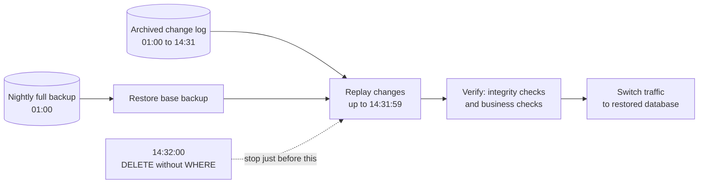

# Backup, Recovery, and Durability

*"We have backups" is a sentence. "We restored from backup in 40 minutes and lost 12 seconds of data, and we know that because we test it every quarter" is an engineering practice. Only one of them will save your company.*

---

> *“Hope is not a strategy.”*
>
> — **Traditional SRE saying**, opening line of Google's *Site Reliability Engineering* book, 2016

## At a Glance

> **In one sentence:** Durability means data survives failures; backups mean you can recover from mistakes, corruption, and attacks that replication faithfully copies — and a backup only counts if you have regularly proven you can restore it within your RPO and RTO.

**You'll learn**

- What durability actually guarantees — and what it doesn't
- Full, incremental, and differential backups
- Point-in-time recovery (PITR)
- RPO and RTO, and how to choose them
- The 3-2-1 rule and protecting backups from ransomware
- How to run a restore drill

**Before you start:** [How Databases Work](How-Databases-Work.md) · [Data Replication Strategies](Data-Replication-Strategies.md)

**Reading time:** about 35 minutes

---

## The Big Picture



*Point-in-time recovery restores the last full backup, then replays the change log up to the moment just before the mistake.*

---

## Introduction

Imagine two homeowners who both claim to be prepared for a fire. The first has a fire extinguisher they bought eight years ago, have never inspected, and aren't sure still has pressure. The second has a fire extinguisher they test annually, plus a practiced evacuation plan, plus a fireproof safe with copies of important documents stored at a relative's house across town. Both homeowners will tell you, with equal confidence, "we're prepared for a fire." Only one of them actually is.

**Backups** are the copies of data you keep specifically to recover from loss, corruption, or disaster. **Durability** is the guarantee — usually probabilistic, expressed in "nines" — that committed data will not be lost. **Recovery** is the actual process, tested or untested, of turning a backup back into a working system. The gap between "we have backups" and "we can recover" is where an enormous number of real companies have been destroyed, and it is almost always a gap of untested assumptions, not missing technology.

This chapter is deliberately about the discipline, not just the mechanism — the mechanics of replication (a close cousin of backup, but a different tool solving a different problem) are covered in the Data Replication Strategies chapter. Here, the focus is: what does "durable" actually mean, how do you design a backup strategy that matches real business requirements, and why does nearly every major data-loss horror story in this industry trace back to a backup that existed but didn't actually work.

### Why Should Engineers Care

- **Backups are the single most consequential thing most engineering teams under-invest in** — until the day they desperately need one.
- **RPO and RTO are business decisions disguised as engineering metrics.** Every engineer who owns a production data store needs to be able to answer "how much data could we lose, and how long would we be down" with actual numbers, not vibes.
- **This is one of the most common senior/staff interview topics** because it reveals whether a candidate thinks about failure as a category of design requirement, not an edge case.
- **Ransomware and accidental deletion are now top-tier operational risks** for every company, and a durable, tested, offline-capable backup strategy is the single most effective defense against both.

### Where Is This Used

| Context | Example | Why It Matters |
|---|---|---|
| Relational databases | PostgreSQL `pg_basebackup` + WAL archiving | Point-in-time recovery for transactional data |
| Cloud object storage | S3 Versioning + Cross-Region Replication | Protects against accidental deletion and regional disaster |
| Enterprise IT | Veeam, Commvault, tape libraries | Full-organization backup across servers, VMs, endpoints |
| SaaS platforms | Automated daily snapshots + point-in-time recovery windows | RDS, Cloud SQL, and similar managed database backup features |
| Ransomware defense | Immutable, air-gapped, or offline backup copies | The last line of defense when production and online backups are both compromised |
| Regulatory compliance | Financial/healthcare data retention requirements | Legal mandate for specific retention periods and recoverability |

---

## The Problem It Solves

Data loss happens through more failure modes than most engineers initially plan for: hardware failure (disks die), software bugs (a migration silently corrupts rows), human error (`DROP TABLE` in production, or the wrong `rm -rf`), malicious action (a disgruntled employee, or ransomware encrypting production data), and full-scale disasters (a data center fire, a regional cloud outage, a natural disaster). Replication, covered in the previous chapter, protects against a subset of these — primarily hardware/node failure — because a bad `DELETE` or a ransomware encryption event replicates just as faithfully and just as quickly as a legitimate write. **Replication propagates mistakes. Backups let you go back in time before the mistake happened.**

### What Happens Without This?

Without a working backup and recovery strategy, a company's entire data — customer records, financial history, product catalog, years of accumulated business value — exists in exactly as many independent, resilient copies as its replication topology happens to provide, and zero copies that are protected from a mistake, an attacker, or a bug that corrupts data in a way that replicates cleanly. The specific, well-documented failure pattern industry-wide:

1. **A destructive operation occurs** (accidental deletion, bad migration, malicious encryption).
2. **It replicates instantly and faithfully to every replica**, because replication has no concept of "this change is a mistake" — it just propagates state.
3. **The team turns to backups**, and discovers one or more of: backups were never actually configured for this system; backups were configured but had been silently failing for weeks or months; backups exist but nobody has ever practiced actually restoring from them, and the restore process itself has bugs, missing steps, or takes far longer than anyone assumed; or the backups exist but are stored in a place also compromised by the same failure (e.g., ransomware that also encrypted the backup volume because it was mounted and writable from the same compromised network).

This is not a hypothetical pattern — it is, almost verbatim, what happened in the GitLab 2017 incident, covered in the Case Studies section below, and it recurs across the industry with striking regularity.

---

## Historical Background

- **1950s–1960s — Magnetic tape backup** becomes the standard for mainframe data protection, establishing the fundamental practice of periodically copying data to separate, removable media — a practice whose core logic (data must exist on media independent of the primary system) remains unchanged today even as the media itself has evolved dramatically.

- **1970s — The rise of full and incremental backup strategies** in enterprise IT, as tape capacity and backup windows became real operational constraints requiring tradeoffs between backup completeness and time/storage cost.

- **1988 — Redundant Array of Independent Disks (RAID)** is formalized in a paper by Patterson, Gibson, and Katz at UC Berkeley (*"A Case for Redundant Arrays of Inexpensive Disks (RAID)"*). RAID is frequently and dangerously confused with backup — it protects against a single disk's hardware failure but does nothing to protect against accidental deletion, corruption, or a software bug, since those changes are faithfully mirrored/striped across the array just like any legitimate write.

- **1990s — Point-in-time recovery matures** in commercial relational databases (Oracle, Sybase, later PostgreSQL and MySQL), combining periodic full backups with continuous transaction log archiving, allowing recovery to any specific moment rather than only to the last full backup's timestamp.

- **2006 — Amazon S3 launches**, and its extreme, purpose-built durability engineering (redundant storage across multiple facilities, continuous integrity checking) becomes a widely cited reference point for what "designed for durability" actually requires at scale, discussed in detail later in this chapter.

- **2010s — The "3-2-1 backup rule"** becomes the standard, widely taught heuristic across the IT industry (three copies of data, on two different media types, with one copy off-site) — a simple rule distilled from decades of accumulated disaster recovery experience, rather than originating from a single paper or vendor.

- **2013–2017 — Ransomware becomes an enterprise-scale threat.** Attacks like CryptoLocker (2013) and later WannaCry (2017) and NotPetya (2017) demonstrate that backups reachable and writable from the same compromised network are not a reliable defense — driving widespread industry adoption of immutable and air-gapped backup practices.

- **2017 — The GitLab data loss incident** (detailed in Case Studies) becomes one of the most widely cited, transparently documented cautionary tales in the industry about the gap between having a backup mechanism configured and having a *verified, working* recovery capability.

- **2018–present — Cloud-native backup and DR tooling matures.** Managed database services (RDS, Cloud SQL, Cosmos DB) bake automated backups and point-in-time recovery in as a default, and dedicated chaos/DR-testing practices (documented publicly by Netflix, Google, and others) become an accepted best practice for validating recovery capability continuously rather than assuming it.

---

## Core Concepts

### 1. What Durability Actually Guarantees

**Durability** is the guarantee that once an operation is acknowledged as successful, its effects will survive subsequent failures. It is almost always expressed probabilistically, not absolutely — "eleven nines of durability" (99.999999999%, as AWS advertises for S3) is a statement about the *extremely low statistical probability* of losing a given object in a given year under the system's designed redundancy model, not a claim of mathematical impossibility.

It is critical to understand what durability does **not** cover:

```
Durability guarantees:               Durability does NOT guarantee:
  - Hardware failure survival          - Protection from accidental deletion
  - Bit rot / silent corruption         - Protection from malicious action
    detection and repair (in            - Protection from application bugs
    well-engineered systems)              that write bad data "correctly"
                                         - Recoverability to a PAST point in time
```

This distinction is exactly why "our storage layer has eleven nines of durability" is not the same claim as "we can recover from any mistake" — durability protects the *bytes currently marked as valid* from being physically lost; it says nothing about whether those bytes represent the state you actually wanted.

### 2. Backup Strategies: Full, Incremental, Differential

```
FULL backup: a complete copy of all data, every time.
  Day 1: [=========FULL=========]
  Day 2: [=========FULL=========]   (large, slow, but each backup is
  Day 3: [=========FULL=========]    independently restorable)

INCREMENTAL backup: only data changed since the LAST backup
  (full or incremental).
  Day 1: [=========FULL=========]
  Day 2:                        [+delta since Day1]
  Day 3:                                          [+delta since Day2]
  (small, fast backups, but restore requires replaying the full
   chain: Day1 + Day2-delta + Day3-delta, in order)

DIFFERENTIAL backup: all data changed since the LAST FULL backup
  (not since the last differential).
  Day 1: [=========FULL=========]
  Day 2:                        [+delta since Day1 FULL]
  Day 3:                        [+delta since Day1 FULL, now larger]
  (each differential grows until the next full backup, but restore
   only ever needs the last full + the single most recent differential)
```

| Strategy | Backup speed | Restore speed | Storage cost | Restore complexity |
|---|---|---|---|---|
| Full | Slowest | Fastest | Highest | Lowest (one file) |
| Incremental | Fastest | Slowest | Lowest | Highest (replay whole chain) |
| Differential | Medium | Medium | Medium | Medium (full + one differential) |

Most production backup strategies combine these: a weekly full backup, daily incrementals or differentials, and continuous transaction log archiving for point-in-time recovery granularity between backup windows.

### 3. Point-in-Time Recovery (PITR)

Point-in-time recovery combines a periodic full backup with a continuous, sequential log of every change since that backup (a database's write-ahead log, in the sense described in `How-Databases-Work.md`), letting you restore the system to *any specific moment*, not just the moment the last full backup happened to be taken.

```
Full backup taken: 2026-07-14 02:00:00
WAL archived continuously after that point
       |
Incident: a bad migration corrupts data at 2026-07-14 14:32:07
       |
Recovery: restore the 02:00:00 full backup, then replay the
archived WAL up to (but not including) 14:32:07 -- recovering
every legitimate transaction between 02:00 and 14:32, while
excluding the corrupting change entirely
```

PITR is what transforms "we can restore to last night's backup, losing up to 24 hours of data" into "we can restore to 30 seconds before the incident, losing almost nothing" — a dramatic, business-critical difference in outcome for the exact same underlying full-backup cadence.

### 4. RPO and RTO

**Recovery Point Objective (RPO)**: the maximum acceptable amount of data loss, measured in time — "how much data can we afford to lose?"

**Recovery Time Objective (RTO)**: the maximum acceptable downtime — "how long can we afford to be unavailable while we recover?"

```
Incident occurs at T+0
        |
        v
   <---- RPO ---->                <---- RTO ---->
[last durable point       ]  [incident]  [service restored]
   before the incident

RPO measures backward in time from the incident (how much data
between the last durable point and the incident is lost)

RTO measures forward in time from the incident (how long until
the service is usable again)
```

| Business context | Typical RPO | Typical RTO | Implication |
|---|---|---|---|
| Financial trading ledger | Near-zero (seconds) | Minutes | Synchronous replication + continuous log shipping required |
| E-commerce order database | Minutes | Under an hour | Frequent PITR-capable backups, tested automated restore |
| Internal analytics warehouse | Hours to a day | Several hours | Daily full backups may be sufficient |
| Marketing content CMS | A day | A day | Simple daily backups, manual restore acceptable |

RPO and RTO are not engineering preferences — they are business requirements that should be explicitly negotiated with stakeholders and then engineered to, because the infrastructure cost of near-zero RPO/RTO (synchronous multi-region replication, hot standbys, continuous testing) is substantial and not justified for every system.

### 5. The 3-2-1 Backup Rule

A widely taught, simple heuristic for backup resilience:

```
3 — Keep at least THREE copies of your data
    (the original/production copy, plus two backups)

2 — Store those copies on at least TWO different types of media
    or storage systems
    (e.g., not just "two backups on the same SAN")

1 — Keep at least ONE copy OFF-SITE
    (a different physical location / region / provider,
    so a single site-level disaster can't destroy every copy)
```

A frequently added modern extension, sometimes called **3-2-1-1-0**, adds: at least **1** copy that is immutable or air-gapped (offline, or otherwise unmodifiable even by a compromised production credential), and **0** errors confirmed by regularly testing the backups (verifying restorability, not just existence).

### 6. Testing Backups: The Difference Between "Having" and "Can Use"

A backup that has never been restored is, from a risk-management perspective, an unverified claim, not a functioning safety mechanism. Common ways a backup silently stops being usable without anyone noticing:

- Backup jobs fail silently (misconfigured alerting, or alerts that get ignored after enough false positives).
- Backups succeed technically but capture corrupted or already-bad data (backing up a database that had already been silently corrupted for weeks).
- Backup files are technically present but not actually restorable (format incompatibility after a software upgrade, missing encryption keys, expired credentials for the storage location).
- The documented restore procedure is stale, incomplete, or was written by someone who has since left the company, and nobody currently on the team has ever executed it.

Regular, scheduled **restore drills** — actually restoring a backup to a scratch environment and verifying the data is complete and correct — are the only reliable way to know a backup strategy actually works, as opposed to merely existing.

---

## Real-World Analogy

### The Insurance Policy You've Never Filed a Claim On

Imagine you've paid for homeowner's insurance for fifteen years. You have the policy documents, you pay the premium every month, and you feel reasonably prepared for a disaster. Now imagine your house actually burns down, and when you call to file a claim, you discover: the policy lapsed eight months ago because a payment silently failed and nobody noticed (a backup job failing silently); or the policy technically covers fire, but excludes the specific type of damage that occurred, buried in fine print nobody read closely (backups that exist but don't capture the right data — perhaps only the database was backed up, not the file storage referenced by it, or configuration secrets needed to actually run the restored system); or the policy is valid and covers everything, but the claims process takes four months to actually pay out, during which you have nowhere to live (a backup that's restorable in principle, but whose actual restore procedure is untested and takes far longer than anyone assumed, or requires steps nobody remembers).

Insurance you've never tested is a belief, not a guarantee. This is precisely the discipline behind restore drills: the only way to know your "insurance" (backup) actually works is to occasionally, deliberately, file a "claim" (perform a real restore) before you desperately need to for real — in an environment where a failed test costs you nothing but where a failed real recovery could cost the company everything.

---

## How It Works Internally

### A Typical PostgreSQL Backup and PITR Setup

```
1. A periodic (e.g., nightly) full base backup is taken:
     pg_basebackup -D /backup/base_2026-07-14 -Ft -z -Xs
   This copies the entire data directory as of a consistent point.

2. Continuous WAL archiving runs at all times, independent of the
   base backup schedule:
     archive_command = 'cp %p /backup/wal_archive/%f'
   Every WAL segment, as it fills and is completed, is copied to
   durable, separate storage.

3. On restore, the process is:
     a. Restore the most recent full base backup to a new data directory
     b. Configure a recovery target: either a specific timestamp,
        a specific transaction ID, or "immediately before the
        problematic transaction"
     c. PostgreSQL replays archived WAL segments from the base
        backup's starting point forward, stopping exactly at the
        specified recovery target
     d. The database comes up in a consistent state as of that
        exact moment -- as if the incident after that point
        never happened
```

### Object Storage Backup Patterns (S3-Based)

```
1. Application data (or database backup files) is written to a
   primary S3 bucket
        |
        v
2. S3 Versioning is enabled: every overwrite or delete creates a
   new version rather than destroying the old one, protecting
   against accidental overwrite/delete (though NOT against a
   bucket-level deletion if versioning itself is somehow disabled
   or the bucket is deleted entirely by a compromised credential)
        |
        v
3. Cross-Region Replication asynchronously copies objects to a
   bucket in a separate AWS region, satisfying the "off-site" leg
   of the 3-2-1 rule
        |
        v
4. Object Lock (WORM -- Write Once, Read Many) can be enabled on
   specific objects/buckets, making them genuinely immutable for
   a defined retention period, even against an account
   administrator's own delete permissions -- this is the
   mechanism that defends specifically against ransomware or a
   compromised/malicious insider with full account access
```

### The Anatomy of a Restore Drill

```
1. Provision a fully isolated scratch environment
        |
        v
2. Retrieve the actual production backup (not a "known good" test
   file -- the real, current backup artifact) from its real storage
   location, using the real, documented restore procedure
        |
        v
3. Perform the full restore, timing every step
        |
        v
4. Validate: row counts, checksums, spot-check specific known
   records, confirm application-level functionality against the
   restored data (not just "the database process started")
        |
        v
5. Record: actual RTO achieved, any manual/undocumented steps
   required, any missing pieces (secrets, configuration, DNS)
   discovered during the drill
        |
        v
6. Update runbooks and alerting based on what was learned;
   schedule the next drill
```

---

## Components and Architecture

```
+------------------+
|  Production DB    |
+------------------+
   |            |
   |            +-----------------+  continuous WAL/log archiving
   |                                v
   |                        +----------------+
   |                        | WAL/Log Archive |
   |                        | (separate,      |
   |                        |  durable store) |
   |                        +----------------+
   |
   | periodic full/incremental backups
   v
+------------------+          replicated/copied           +------------------+
| Primary Backup    |  -------------------------------->  | Off-site / Cross- |
| Storage           |                                      | Region Backup     |
| (same region,     |                                      | Copy               |
|  fast restore)    |                                      +------------------+
+------------------+                                                |
        |                                                            v
        |                                              +------------------------+
        |                                              | Immutable / Air-Gapped  |
        +-------------------------------------------->  | Archive Copy            |
       (periodic, e.g., monthly, promoted to            | (ransomware-resistant)  |
        immutable/offline storage)                      +------------------------+
```

A mature backup architecture has at least three distinct storage destinations (satisfying 3-2-1), an automated, monitored, alerted backup pipeline (not a cron job nobody watches), and a scheduled, calendared restore-drill practice that treats "can we actually recover" as a continuously tested property of the system, not a one-time setup task.

---

## End-to-End Flow

**Scenario:** Elena, a site reliability engineer at a subscription analytics company, runs the company's quarterly disaster recovery drill.

**Monday, 09:00:00** — Elena's team schedules the drill in advance and notifies stakeholders: today, they will simulate a total loss of the production PostgreSQL primary and its same-region synchronous replica, forcing a restore from the off-site backup as if both were destroyed simultaneously (a deliberately pessimistic, realistic disaster scenario, not just a routine failover).

**09:05:00** — Elena provisions a fully isolated scratch environment in a separate AWS account (to guarantee no accidental cross-contamination with production), matching production's instance type and storage configuration.

**09:07:00** — She retrieves the most recent full backup from the off-site, cross-region S3 bucket — not a locally cached copy, deliberately simulating "our primary region is unreachable." Download and decompression of the 340GB backup takes 14 minutes.

**09:21:00** — `pg_basebackup`-derived restore begins. Elena configures a recovery target: "immediately before 08:55:00 this morning" (an arbitrary recent point chosen for this drill, simulating "restore right up to just before some hypothetical incident").

**09:26:00** — WAL replay begins, pulling archived WAL segments from the separate WAL archive bucket and applying them in sequence. This takes 9 minutes to catch up through several hours of accumulated WAL since the last full backup.

**09:35:00** — The restored database comes online. Elena's validation script runs: row counts across the twelve most critical tables, checksums against a manifest captured at backup time, and a spot-check of 50 specific known customer records against expected values.

**09:38:00** — Validation passes. Elena additionally starts the application server pointed at the restored database and runs the critical-path smoke test suite (login, core dashboard load, billing webhook simulation) — this step catches something the database-level validation alone wouldn't: a required application secret (an API key for the billing provider) was never included in the backup scope, because it lived in a separate secrets manager that wasn't part of this drill's restore procedure.

**09:45:00** — Elena documents this gap as a drill finding: the runbook needs an explicit step for restoring/re-provisioning application secrets alongside the database restore, since a database-only restore leaves the application non-functional in a real incident.

**09:50:00** — Total measured time from "incident declared" to "fully functional restored environment, gap identified and documented": 45 minutes — comfortably inside the company's documented 1-hour RTO for this system, but only because this specific gap was caught in a low-stakes drill rather than during a real 3am incident.

**Monday, 14:00:00** — Elena's team updates the disaster recovery runbook with the missing secrets-restoration step, and schedules the next quarterly drill, with a specific note to test this newly-added step explicitly next time.

---

## Production Engineering Perspective

### Scalability
Backup strategies must scale with data volume — a full backup that takes 6 hours on a 500GB database may take 60 hours on a 5TB database if the approach doesn't change, which can blow through backup windows and RTO targets. Incremental/differential strategies, parallelized backup tooling, and storage-layer snapshot features (which can be near-instantaneous regardless of data size, using copy-on-write techniques) are how mature systems keep backup time roughly constant as data grows.

### Reliability
A backup pipeline is itself a production system and needs the same reliability engineering as any other: monitoring, alerting on failure (and on *silence* — a backup job that stops running entirely is a more dangerous failure mode than one that runs and fails loudly), and redundancy in the backup pipeline itself so a single point of failure in the backup mechanism doesn't undermine the whole strategy.

### Performance
Backup operations compete for I/O and CPU with production workloads; poorly scheduled or unthrottled backup jobs are a well-documented cause of production performance degradation. Storage-layer snapshots (leveraging copy-on-write, as discussed in `How-File-Systems-Work.md`) largely solve this by making the snapshot operation itself near-instantaneous, deferring the actual data-copying cost.

### Availability
For systems with strict RTO requirements, "restore from backup" alone is often too slow — these systems typically combine backups (for correctness/point-in-time recovery) with hot or warm standby replicas (for fast failover), using each for what it's actually good at rather than relying on one mechanism to serve both purposes.

### Maintainability
Backup and restore procedures rot if not actively maintained — schema changes, new data stores added to the system, secrets/configuration that moves to new locations, and infrastructure migrations all silently invalidate assumptions baked into old runbooks. Treating the backup/restore runbook as a living, tested artifact (not a document written once at launch) is essential.

---

## Tradeoffs

### Benefits

| Benefit | Explanation |
|---|---|
| Recovery from mistakes, not just hardware failure | Backups protect against exactly what replication propagates |
| Point-in-time granularity | PITR lets you recover to seconds before an incident, not just the last full backup |
| Ransomware/malicious-action resilience | Immutable/air-gapped copies survive even a fully compromised production environment |
| Regulatory compliance | Many industries legally require demonstrable backup/retention capability |
| Business continuity confidence | A tested recovery capability is a genuine competitive and trust advantage |

### Drawbacks

| Drawback | Explanation |
|---|---|
| Real infrastructure and storage cost | Multiple copies, cross-region transfer, and immutable storage all cost money |
| Operational overhead | Backup pipelines, monitoring, and drills require ongoing engineering investment |
| Restore time is often underestimated | Large datasets can take hours to restore even with a healthy backup |
| False sense of security | An unverified backup can be worse than knowing you have none, because it delays the realization |

### Limitations
No backup strategy provides zero RPO and zero RTO simultaneously without extraordinary (and extraordinarily expensive) engineering — near-zero RPO typically requires synchronous replication (a replication concern, not strictly a backup one), and near-zero RTO requires hot standby infrastructure ready to take over instantly. Backups fundamentally trade some amount of both for cost efficiency, and the right tradeoff point is a business decision, not a purely technical one.

### Alternatives

| Alternative / complement | When it fits |
|---|---|
| Synchronous replication (see Data Replication Strategies) | Near-zero RPO for hardware-failure scenarios specifically (not mistake/malicious-action scenarios) |
| Event sourcing / append-only architectures | Systems where the full history of changes is retained by design, offering natural point-in-time reconstruction |
| Soft deletes / tombstoning at the application layer | A first line of defense against accidental deletion, cheaper and faster to recover from than a full backup restore, though not a substitute for real backups |
| Managed database backup features (RDS, Cloud SQL) | Teams wanting strong default backup/PITR behavior without building custom tooling |

### When NOT to Over-Invest in Backup Infrastructure
- Purely ephemeral, regenerable data (a cache that can be rebuilt from the source of truth) doesn't need the same backup rigor as the source of truth itself.
- Data with a genuinely trivial RPO/RTO tolerance (internal, low-stakes tooling where a day of downtime and data loss is a minor inconvenience, not a crisis) doesn't justify the cost of near-zero RPO/RTO infrastructure — match the investment to the actual business requirement, not to what's theoretically possible.

---

## Common Mistakes

### Beginner
1. **Confusing RAID or replication with backup.** RAID protects against a single disk failure; replication protects against a node failure. Neither protects against a bad `DELETE`, a bug, or ransomware, all of which propagate faithfully through both.
2. **Never testing a restore.** Configuring a backup job and considering the job "done" without ever verifying the resulting backup is actually usable.
3. **Storing backups in the same location/account/credentials as production**, meaning a single compromised credential or regional outage can take out both production and its backup simultaneously.

### Intermediate
4. **Not accounting for application state outside the database** — secrets, configuration, file storage, search indexes, and cache warm-up state are often not included in a "database backup," and a real recovery needs all of it, as Elena's drill illustrated above.
5. **Silent backup failures going unnoticed** because alerting was configured to fire only on job failure, not on job *absence* (a cron job that stops running entirely due to an unrelated infrastructure change produces no failure alert at all).
6. **Choosing a backup cadence based on convenience rather than actual RPO requirements** — nightly backups for a system whose business-negotiated RPO is actually "a few minutes" is a mismatch nobody may notice until an incident makes it painfully clear.

### Senior-Level
7. **Assuming backup restore time scales linearly and staying naive about it as data grows** — a restore process that comfortably met RTO at 200GB may silently blow through it at 4TB if nobody re-measures restore time as the dataset grows.
8. **Building a disaster recovery plan that's never actually been exercised under realistic pressure** — the first real test of a DR plan should never be an actual disaster; regular, calendared drills (ideally including deliberately pessimistic scenarios, as in Elena's example) are what turns a document into a capability.
9. **Neglecting the "immutable/air-gapped" leg of a modern backup strategy**, leaving an organization vulnerable to ransomware or a compromised privileged credential that can reach and destroy every online, writable copy of both production data and its backups.

---

## Failure Scenarios

### Scenario 1: Backups Have Been Silently Failing for Months
**What happens:** A scheduled backup job has been failing (due to, e.g., an expired credential, a full disk on the backup target, or a silent API change) for weeks or months. Nobody notices because failure alerts were either misconfigured, routed to an unmonitored channel, or eventually muted after enough transient false positives trained the team to ignore them.
**Why it fails:** The gap between "a backup job exists" and "a backup job is actively, verifiably succeeding" was never closed with real monitoring — this is precisely the root cause pattern in the GitLab 2017 incident detailed below.
**How to diagnose:** Audit the actual timestamp and size of the most recent successful backup artifact directly in storage — not the job scheduler's "last run" status, which can report success even when the resulting artifact is empty or corrupted; cross-check against expected backup cadence and size trends.
**Solutions:** Alert on backup *absence* (no successful backup completed within the expected window), not just backup *failure*; validate backup artifacts automatically after creation (checksum verification, minimum size sanity checks, or even automated mini-restores); route backup health alerts to a channel with real, enforced on-call accountability, not a channel that's easy to silently ignore.

### Scenario 2: The Restore Procedure Itself Has Never Been Tested and Fails Under Pressure
**What happens:** During a real incident, the team attempts to execute a documented restore procedure for the first time in production conditions, and discovers the runbook references a tool version that's been deprecated, a storage location that's been renamed, or steps that assumed institutional knowledge held by someone who's since left the company.
**Why it fails:** A runbook that's written once and never exercised accumulates drift from reality just like any other undocumented dependency — infrastructure changes, tooling upgrades, and personnel turnover all silently invalidate assumptions baked into it.
**How to diagnose:** This is fundamentally a preventable-in-advance failure, not one you diagnose after the fact — the mitigation is entirely about testing before an incident, not detecting during one.
**Solutions:** Regular, calendared restore drills, performed by different team members each time (not always the one person who "knows how it works," which is itself a single point of failure); treat the runbook as a tested, versioned artifact that's updated every time a drill reveals a gap, exactly as in Elena's end-to-end example above.

### Scenario 3: Ransomware Encrypts Production and All Reachable Backups
**What happens:** An attacker gains access to production infrastructure (via compromised credentials, a vulnerable service, or a supply-chain attack) and, before or alongside encrypting production data for ransom, also reaches and encrypts or deletes backup copies that were stored in locations reachable with the same or similarly-scoped compromised credentials.
**Why it fails:** Backups stored with the same access credentials, on the same network, or without any immutability guarantee, are not meaningfully independent of production from a security perspective — an attacker who compromises production access can often reach "online" backups just as easily.
**How to diagnose:** Post-incident forensics typically reveal the attacker's access pattern reached backup storage; prevention-focused organizations proactively audit whether backup storage credentials/access are genuinely isolated from production access before an incident, not after.
**Solutions:** Use immutable/WORM (Write Once, Read Many) storage features for at least one backup copy (S3 Object Lock, or equivalent) that cannot be deleted or overwritten even by a compromised administrative credential during its retention period; maintain at least one genuinely air-gapped or offline copy; apply strict, separate access controls and credentials for backup infrastructure distinct from production access.

### Scenario 4: Recovery Point Achieved, But the Restored Data Is Itself Corrupted
**What happens:** A team successfully restores from backup after an incident, only to discover the backup itself had captured already-corrupted data — the corruption (a slow, silent data integrity bug) had been present for weeks before anyone noticed, meaning every recent backup, not just the most recent one, contains the same bad data.
**Why it fails:** Backup validation checked that the backup *process* succeeded (files were written, sizes look reasonable) but never validated the *content's correctness* against independent business logic — a backup can be a perfectly faithful, complete copy of already-wrong data.
**How to diagnose:** Requires retaining backups across a long enough retention window to have a "known good" point to compare against, and application-level or business-logic-level validation (not just database-level structural validation) during restore drills.
**Solutions:** Retain backups for a meaningfully long window (not just the last few days) so a slow-developing corruption issue still has a recoverable, pre-corruption backup available; include business-logic-level validation (not just structural/checksum validation) in restore drills, specifically designed to catch "technically valid but wrong" data; invest in application-level integrity monitoring that can catch slow corruption early, independent of the backup system entirely.

---

## Security Considerations

- **Encrypt backups at rest and in transit.** A backup is a complete copy of your most sensitive data, and is a high-value target; unencrypted backup storage is a significant, sometimes overlooked exposure risk, particularly for off-site/cross-region copies traversing the public internet.
- **Isolate backup access credentials from production access.** As illustrated in the ransomware failure scenario above, backups that share access scope with production offer little protection against a compromised production credential.
- **Immutability (WORM/Object Lock) is a specific, deliberate defense against both malicious insiders and ransomware** — it should be treated as a distinct, additional control, not assumed to be provided implicitly by "having backups."
- **Backup retention and deletion policies must satisfy both operational and legal requirements** — regulatory regimes (GDPR's "right to be forgotten," HIPAA, financial retention mandates) can create real tension between "keep backups long enough to recover from slow-developing issues" and "delete personal data on request," requiring deliberate, documented policy design rather than a default "keep everything forever" or "delete on the shortest possible schedule" approach.
- **Audit who can access and restore from backups.** A backup restore operation, particularly one that can overwrite production, deserves the same access control rigor and audit logging as direct production database access.

---

## Performance Considerations

### Bottlenecks

| Bottleneck | Cause | Fix |
|---|---|---|
| Backup window exceeding available time | Data growth outpacing backup tooling's throughput | Use incremental backups, storage-layer snapshots, or parallelized backup tooling |
| Production performance impact during backup | Backup I/O competing with live workload | Throttle backup I/O, run backups against a replica rather than the primary, schedule during low-traffic windows |
| Restore time exceeding RTO | Large full-backup restore combined with a long WAL/log replay chain | More frequent full backups (shorter replay chains), parallelized restore tooling, pre-provisioned standby infrastructure for the fastest-RTO tier of systems |
| Cross-region transfer time | Large backup artifacts moving to off-site storage over a WAN link | Compress before transfer, use incremental cross-region sync rather than re-transferring full backups each time |

### Optimization Strategies
1. Take backups from a read replica rather than the primary, where possible, to avoid any production performance impact.
2. Use storage-layer, copy-on-write snapshots for near-instantaneous backup initiation, deferring the actual data-copy cost.
3. Combine periodic full backups with continuous log archiving (PITR) rather than relying solely on frequent full backups, balancing backup cost against recovery granularity.
4. Regularly re-measure actual restore time as data volume grows, rather than assuming historical RTO measurements remain valid indefinitely.

### Scaling Challenges
As data volume grows into the multi-terabyte range, both backup and restore operations that once completed comfortably within their windows can silently begin exceeding them — this is one of the most common ways a previously-adequate backup strategy quietly becomes inadequate, discovered only when a drill (or a real incident) finally measures actual current restore time against the RTO commitment.

---

## Real-World Industry Examples

**Amazon S3's durability engineering** — AWS's published architecture describes S3 objects being redundantly stored across multiple devices in multiple facilities within a region, with continuous background integrity checking and repair, engineering specifically toward the advertised eleven nines of annual durability — a widely cited industry reference point for what "durability as a first-class design goal," rather than an afterthought, actually requires.

**Netflix — Chaos Engineering applied to disaster recovery.** Netflix's widely publicized Chaos Monkey and, more relevantly here, "Chaos Kong" (which simulates the loss of an entire AWS region) represent an industry-leading practice of continuously, proactively testing recovery capability under realistic failure conditions rather than relying on untested runbooks — a direct embodiment of the "restore drills" discipline described in this chapter, applied at the scale of entire regions.

**GitHub — regular, documented database backup and recovery practices** as part of their broader MySQL operational tooling (including Orchestrator, discussed in the Data Replication Strategies chapter), reflecting the industry lesson that backup/recovery and replication/failover need to be engineered and tested together as a coherent operational discipline, not as separate, disconnected concerns.

**Financial services and regulatory-driven DR practices** — Banks and payment processors are subject to explicit regulatory requirements (in the US, guidance from bodies like the FFIEC) mandating documented, tested disaster recovery capability with specific RTO/RPO commitments, making this industry one of the most mature and rigorous real-world examples of backup/recovery discipline being treated as a hard compliance requirement rather than a best-effort engineering practice.

**Cloud provider managed backup services (AWS RDS, Google Cloud SQL)** — both provide automated daily backups plus point-in-time recovery (typically down to a specific second within a retention window, often 7-35 days) as a default, near-zero-configuration feature, reflecting the industry's broader shift toward making strong default backup/PITR behavior a baseline expectation rather than something every team must build from scratch.

---

## Case Studies

### Case Study 1: GitLab's Database Incident (January 31, 2017)
**What happened:** During an attempt to address replication lag issues on a production PostgreSQL database, an engineer, working under pressure and against the wrong terminal session, ran a command that deleted the production database's data directory, removing approximately 300GB of data including issues, merge requests, comments, and user accounts.
**Root cause:** This alone would have been a serious but recoverable incident — except GitLab discovered, in the process of trying to recover, that of their five distinct backup/replication mechanisms, essentially none were in a genuinely usable state: regular automated backups had been silently failing for weeks (producing near-empty backup files that nobody had validated); disk snapshots were configured with a schedule too infrequent to be useful; and other replication mechanisms weren't positioned to help with this specific failure mode. GitLab's own, unusually transparent public incident writeup documented this in detail.
**Solution:** GitLab ultimately recovered using a snapshot that happened to exist from roughly six hours before the incident, created by an engineer for an unrelated, manual reason — not from any of their formal, intended backup mechanisms. They lost approximately 6 hours of data (issues, merge requests, comments, and some user accounts created in that window).
**Lesson:** Having multiple backup mechanisms configured is not the same as having multiple mechanisms *verified to work* — GitLab's public postmortem became one of the industry's most referenced case studies precisely because it so starkly illustrated the "we have backups" versus "we can recover" gap, and because their transparency let the entire industry learn from it directly rather than through rumor.

### Case Study 2: Code Spaces' Total Shutdown (June 2014)
**What happened:** Code Spaces, a source code hosting and project management service, suffered a security breach in which an attacker gained access to their AWS control panel and, after Code Spaces attempted to regain control, began deleting data — including, critically, most of their EBS snapshots and S3 backups, which were accessible using the same compromised AWS credentials as production.
**Root cause:** Backups were stored within the same AWS account and accessible via the same credentials as production infrastructure, meaning a single compromised credential set could reach and destroy both production data and its backups simultaneously — precisely the failure mode the "isolate backup credentials from production" security consideration in this chapter addresses.
**Solution:** There was no effective recovery. The scale of data loss (most of their customers' source code and configuration) was severe enough that Code Spaces was unable to continue operating and shut down the business entirely within days of the incident.
**Lesson:** This is the starkest possible illustration that backups sharing an access/trust boundary with production provide little protection against exactly the class of incident (a compromised credential, an attacker with administrative access) most likely to also threaten production directly — genuine isolation (separate credentials, immutable storage, air-gapping) isn't a theoretical nicety, it's the difference between a serious incident and a company-ending one.

### Case Study 3: A Slow-Developing Data Corruption Discovered Only at Restore Time (Common Industry Pattern)
**What happened:** Multiple companies (a pattern documented across numerous post-mortems and engineering blog retrospectives industry-wide, without a single canonical incident) have discovered, during either a real recovery or a restore drill, that a subtle data corruption bug (a bad migration, a race condition in application logic, or a currency/rounding bug) had been silently writing slightly-wrong data for an extended period — meaning every backup taken during that window, not just the most recent one, contained the same corrupted data.
**Root cause:** Backup validation in these cases typically checked structural/process correctness (did the backup job complete, is the file the expected size, do checksums match what was written) but never validated business-logic correctness (does this data actually make sense against independent business rules) — a backup can be a perfectly faithful copy of data that was already wrong when it was backed up.
**Solution:** The consistent fix across these documented cases has been extending retention windows long enough to have a pre-corruption backup available when the corruption is eventually detected, and adding business-logic-level validation (not just structural validation) to both ongoing monitoring and restore-drill validation steps specifically to catch "technically valid but semantically wrong" data earlier.
**Lesson:** A backup strategy focused purely on "did the mechanical process of backing up succeed" is necessary but not sufficient — real resilience requires also being able to detect *when* data went wrong, so backups from before that point remain available and useful, and business-level validation, not just technical validation, needs a place in the recovery testing process.

---

## Practical Code Examples

### A PostgreSQL Point-in-Time Recovery Configuration

```ini
# postgresql.conf on the primary -- enables WAL archiving
wal_level = replica
archive_mode = on
archive_command = 'test ! -f /backup/wal_archive/%f && cp %p /backup/wal_archive/%f'
```

```bash
# Nightly full base backup
pg_basebackup -h localhost -D /backup/base_$(date +%F) -Ft -z -Xs -P

# Restore procedure: recover to a specific point in time
# 1. Restore the most recent base backup into the new data directory
tar -xzf /backup/base_2026-07-14/base.tar.gz -C /var/lib/postgresql/data

# 2. Create a recovery signal file and specify the target
cat > /var/lib/postgresql/data/postgresql.auto.conf <<EOF
restore_command = 'cp /backup/wal_archive/%f %p'
recovery_target_time = '2026-07-14 14:32:00'
EOF
touch /var/lib/postgresql/data/recovery.signal

# 3. Start PostgreSQL -- it will replay WAL up to the target time,
#    then stop recovery and come online at exactly that point
pg_ctl start -D /var/lib/postgresql/data
```

### Automated Backup Validation (Python, illustrative)

```python
import hashlib
import subprocess
import sys
from datetime import datetime, timedelta, timezone

def validate_recent_backup(backup_dir: str, max_age_hours: int = 26):
    """Fail loudly if the most recent backup is missing, empty, or stale --
    the pattern this catches is exactly the GitLab-style silent failure."""
    result = subprocess.run(
        ["aws", "s3api", "list-objects-v2", "--bucket", backup_dir,
         "--query", "sort_by(Contents, &LastModified)[-1]"],
        capture_output=True, text=True, check=True,
    )
    import json
    latest = json.loads(result.stdout)

    if latest is None:
        raise RuntimeError("ALERT: No backup objects found at all.")

    last_modified = datetime.fromisoformat(latest["LastModified"].replace("Z", "+00:00"))
    age = datetime.now(timezone.utc) - last_modified

    if age > timedelta(hours=max_age_hours):
        raise RuntimeError(f"ALERT: Most recent backup is {age} old, exceeding {max_age_hours}h threshold.")

    if latest["Size"] < 1_000_000:  # sanity check: a real backup shouldn't be tiny
        raise RuntimeError(f"ALERT: Most recent backup is only {latest['Size']} bytes -- looks corrupted/empty.")

    print(f"OK: backup {latest['Key']} is {age} old, {latest['Size']} bytes.")

if __name__ == "__main__":
    try:
        validate_recent_backup("prod-db-backups")
    except RuntimeError as e:
        print(str(e), file=sys.stderr)
        sys.exit(1)  # wired to page on-call, not just log a warning
```

### Enabling Immutable Backup Storage (AWS S3 Object Lock, Terraform)

```hcl
resource "aws_s3_bucket" "backup_immutable" {
  bucket = "company-prod-backups-immutable"
}

resource "aws_s3_bucket_versioning" "backup_versioning" {
  bucket = aws_s3_bucket.backup_immutable.id
  versioning_configuration {
    status = "Enabled"
  }
}

resource "aws_s3_bucket_object_lock_configuration" "backup_lock" {
  bucket = aws_s3_bucket.backup_immutable.id
  rule {
    default_retention {
      mode = "COMPLIANCE"  # cannot be shortened or deleted, even by an admin
      days = 90
    }
  }
}
```

### A Restore Drill Checklist as Code (Illustrative)

```python
RESTORE_DRILL_CHECKLIST = [
    "Provision isolated scratch environment (separate account/VPC)",
    "Fetch the ACTUAL current off-site backup artifact (not a cached copy)",
    "Restore database to target recovery point using documented runbook",
    "Validate row counts against expected baseline",
    "Validate checksums against backup-time manifest",
    "Spot-check N known records against expected values",
    "Restore/re-provision required secrets and configuration",
    "Start application server against restored database",
    "Run critical-path smoke tests (login, core workflows, billing integration)",
    "Record actual elapsed time vs. documented RTO target",
    "Document any manual steps, gaps, or surprises for runbook update",
]
```

---

## Frequently Asked Questions

**Q: Isn't database replication basically the same as a backup?**
No. Replication keeps multiple live, continuously-updated copies of your current data, which protects against a single node's hardware failure but faithfully propagates mistakes, corruption, and malicious changes to every replica just as quickly as legitimate writes. A backup is a copy frozen at a specific point in time, which is what lets you go back to before a mistake happened — the two are complementary, not substitutes for each other.

**Q: What's the real difference between RPO and RTO?**
RPO answers "how much data can we afford to lose?" measured backward in time from an incident to the last durable recovery point. RTO answers "how long can we afford to be down?" measured forward in time from the incident to full service restoration. They're independent — a system can have a tight RPO (near-zero data loss) but a loose RTO (it's fine if restoring takes a few hours), or vice versa, depending on the specific business impact of each.

**Q: How often should we actually test our backups?**
At minimum, quarterly for critical systems, though the right cadence depends on how often your infrastructure, schema, and tooling change — anything that could silently invalidate a runbook's assumptions is a reason to re-test sooner. Many mature organizations test continuously or monthly for their most critical systems, treating restore drills as routine operational practice rather than a rare, special event.

**Q: What does "immutable backup" actually protect against that a regular backup doesn't?**
A regular backup, even one stored separately from production, can typically still be deleted or overwritten by anyone (or anything, including malware or a compromised credential) with sufficient access to the backup storage location. An immutable (WORM) backup is configured so it genuinely cannot be deleted or modified during its retention period, even by an account administrator — specifically defending against ransomware and malicious/compromised insiders, not just accidental deletion or hardware failure.

**Q: Do we need point-in-time recovery, or are periodic full backups enough?**
It depends on your RPO. If your business tolerance for data loss is measured in hours or a full day, periodic full (or full+incremental) backups may be entirely sufficient. If your RPO is measured in minutes or seconds, you need continuous log archiving (PITR) layered on top of periodic full backups, since a full backup alone can only ever recover you to the moment it was taken.

**Q: What's the single most common way backup strategies fail in real incidents?**
Based on the well-documented industry pattern (GitLab being the most-cited example): the backup mechanism was configured correctly at some point, but silently stopped working (or was capturing incomplete/corrupted data) well before the incident, and nobody discovered this because the backup process was never actually tested end-to-end with a real restore.

---

## Interview Questions

### Beginner

**Q1: What is the difference between a backup and data replication?**
A backup is a point-in-time copy of data specifically kept for recovery purposes, letting you restore to a state before a mistake, corruption, or attack occurred. Replication maintains multiple live, continuously synchronized copies of the current data, primarily for fault tolerance and read scalability — it propagates changes (including mistakes) essentially instantly, so it does not protect against the same class of failures a backup does.

**Q2: Define RPO and RTO in your own words.**
RPO (Recovery Point Objective) is the maximum amount of data loss, measured in time, that's acceptable for a given system — it defines how frequently and how durably data must be captured. RTO (Recovery Time Objective) is the maximum acceptable downtime during a recovery — it defines how quickly the system must be restored to a working state after an incident.

**Q3: What is the 3-2-1 backup rule?**
Keep at least three copies of your data, on at least two different types of storage media or systems, with at least one copy stored off-site (a different physical location, region, or provider) — a simple heuristic designed to ensure no single failure mode (one disk, one system, one site) can destroy every copy of your data simultaneously.

### Intermediate

**Q4: Why is "we have backups configured" not the same claim as "we can recover our data"?**
Because a backup job can be misconfigured, silently failing, capturing incomplete or already-corrupted data, or technically succeeding while producing an artifact that turns out to be unrestorable (due to format issues, missing secrets, expired credentials, or an undocumented/stale restore procedure) — none of which is discoverable without actually performing and validating a real restore. The only way to know a backup strategy genuinely provides recovery capability is to test it.

**Q5: Explain point-in-time recovery and why it's more valuable than relying solely on full backups.**
Point-in-time recovery combines a periodic full backup with a continuously archived transaction/change log, letting you restore the system to any specific moment — including seconds before an incident — rather than only to the timestamp of the last full backup. This dramatically reduces effective data loss (RPO) for the same full-backup cadence, since a full-backup-only strategy can lose up to an entire backup interval's worth of data, while PITR can typically recover almost everything up to the moment just before the problem occurred.

**Q6: What's the security risk of storing backups with the same access credentials as production, and how do you mitigate it?**
If backup storage is reachable with the same credentials or access scope as production, an attacker (or malicious insider) who compromises production access can typically reach and destroy the backups too, eliminating the safety net exactly when it's needed most — this was the root cause of Code Spaces' 2014 shutdown. Mitigation: use separate, distinctly-scoped credentials and access controls for backup infrastructure, and use immutable/WORM storage features (like S3 Object Lock) for at least one backup copy so it can't be deleted even by a fully compromised administrative credential during its retention period.

### Senior

**Q7: A company has nightly full backups with a 24-hour RPO, but the business now requires a 15-minute RPO for a specific critical database. How do you close this gap?**
A 15-minute RPO with nightly-only full backups is structurally impossible to meet as-is — the fix is adding continuous transaction/WAL log archiving on top of the existing full backups to enable point-in-time recovery, which can bring effective RPO down to nearly real-time (limited only by how frequently logs are shipped/archived, which can be seconds). If even that isn't sufficient, or if the requirement is really about surviving hardware failure specifically (as opposed to recovering from a mistake), I'd also evaluate whether synchronous replication to a standby (a Data Replication Strategies concern, distinct from but complementary to backup) is needed to cover that specific failure mode, since backups and PITR fundamentally can't achieve true zero-RPO by themselves for an active, continuously-written system without some form of continuous durability mechanism layered in.

**Q8: How would you design a restore drill program for an organization that has never done one, given limited engineering time to invest?**
I'd start by triaging systems by actual business impact (using RPO/RTO conversations with stakeholders to establish real priorities, not assumed ones), and run the first drill against the single most critical system, deliberately scoped to be realistic but time-boxed (a half-day exercise, not an open-ended project). I'd insist the drill uses the real, current backup artifact and real, documented procedure — not a "best case" simulated version — specifically because the goal is to surface actual gaps (missing secrets, stale runbooks, unexpectedly slow restore times), exactly as it did in the walkthrough example in this chapter. I'd document findings, fix the highest-impact gaps, and schedule the next drill immediately rather than treating this as a one-time project — then expand to the next-highest-priority system, building the practice incrementally rather than trying to instrument every system in the organization at once.

### Architecture

**Q9: Design a comprehensive backup and disaster recovery strategy for a mid-size SaaS company with a primary PostgreSQL database, an S3-based file storage layer, and secrets stored in a cloud secrets manager.**
I'd implement PITR-capable PostgreSQL backups (periodic full base backups plus continuous WAL archiving) stored in a separate AWS account or at minimum a distinctly-scoped bucket with independent credentials, replicated cross-region for the off-site leg of 3-2-1, with at least one tier promoted to immutable/Object-Lock storage on a rolling schedule for ransomware resilience. For S3 file storage, I'd enable versioning plus cross-region replication, similarly isolating backup-destination credentials from primary production access. Critically, since a database-only backup leaves the application non-functional (as the end-to-end example in this chapter demonstrated), I'd include an explicit, tested procedure for restoring or re-provisioning secrets-manager contents alongside the database and file storage restore, and codify the entire multi-component restore as a single, versioned runbook exercised together in drills — not as three independently-tested pieces that have never been validated to work as a coordinated whole.

**Q10: Your organization currently has zero disaster recovery testing culture, and leadership is skeptical of investing engineering time in "testing something that already works." How do you make the case and get buy-in?**
I'd reframe the ask away from abstract risk and toward concrete, quantified business exposure: "here's our actual current RTO and RPO, measured, for our most critical system" is a much more persuasive artifact than a hypothetical argument, and I'd be honest that until we run a real drill, we don't actually know those numbers — we only know our assumptions about them. I'd cite well-documented, publicly available industry incidents (GitLab's transparent 2017 postmortem is particularly effective here, precisely because it shows a company with seemingly reasonable backup practices on paper still nearly losing everything) as evidence that "we have backups configured" and "we can recover" are empirically, repeatedly, not the same claim across the industry. I'd propose starting with a small, time-boxed, low-risk pilot drill on one system to generate real, company-specific data (an actual measured RTO, actual gaps found) rather than asking for a large upfront investment on faith — concrete findings from a first drill are almost always the most effective argument for expanding the practice, because they replace hypothetical risk with a specific, now-known, ideally then-fixed gap.

---

## Hands-On Lab

Practice the only backup habit that matters — **restoring** — using SQLite from Python.

```python
import sqlite3, os, shutil, datetime

# A "production" database with some data
prod = sqlite3.connect("prod.db")
prod.execute("CREATE TABLE IF NOT EXISTS invoices (id INTEGER PRIMARY KEY, amount REAL)")
prod.executemany("INSERT INTO invoices (amount) VALUES (?)", [(i * 10.0,) for i in range(1, 101)])
prod.commit()

# 1) Take a consistent online backup (safe even while the database is in use)
stamp = datetime.datetime.now().strftime("%Y%m%d-%H%M%S")
backup_path = f"backup-{stamp}.db"
with sqlite3.connect(backup_path) as backup:
    prod.backup(backup)
print("backup written:", backup_path, os.path.getsize(backup_path), "bytes")

# 2) Disaster: someone runs a DELETE without a WHERE clause
prod.execute("DELETE FROM invoices")
prod.commit()
print("rows after accident:", prod.execute("SELECT COUNT(*) FROM invoices").fetchone()[0])
prod.close()

# 3) Restore to a NEW location and verify before switching over
shutil.copy(backup_path, "restored.db")
restored = sqlite3.connect("restored.db")
assert restored.execute("PRAGMA integrity_check").fetchone()[0] == "ok"
count, total = restored.execute("SELECT COUNT(*), SUM(amount) FROM invoices").fetchone()
print(f"restored rows: {count}, total amount: {total}")
```

**What to notice**
- Any writes made after the backup was taken are gone. The time between the last good backup and the accident is your **data loss (RPO)**; the time it takes to restore and verify is your **recovery time (RTO)**.
- The restore went to a new file and was **verified** (integrity check plus a business-level check on row count and totals) before use. Restoring over the original destroys evidence and your last chance to try again.
- Now write down: how would you get *this* level of confidence for your real systems, and when did anyone last try?

---

## Test Yourself

*Answer each question in your head or on paper first, then open the answer to check.*

<details markdown="1">
<summary><strong>1. Why are replicas not backups?</strong></summary>

Replicas copy every change — including accidental deletes, bad migrations, and corruption — within seconds. A backup is a separate, older copy you can go back to.

</details>

<details markdown="1">
<summary><strong>2. What are RPO and RTO?</strong></summary>

**Recovery Point Objective**: the maximum acceptable data loss, measured in time ("we can lose at most 5 minutes of data"). **Recovery Time Objective**: the maximum acceptable time to restore service ("back within 1 hour").

</details>

<details markdown="1">
<summary><strong>3. What is point-in-time recovery?</strong></summary>

Restore a base backup, then replay the database's change log (WAL or binlog) up to a chosen moment — for example, one second before a bad `DELETE` ran. It gives a much smaller RPO than periodic snapshots alone.

</details>

<details markdown="1">
<summary><strong>4. Full vs. incremental vs. differential backups?</strong></summary>

**Full**: everything, every time (simple, slow, large). **Incremental**: changes since the last backup of any kind (small, but restore needs the whole chain). **Differential**: changes since the last full backup (restore needs only the full + latest differential).

</details>

<details markdown="1">
<summary><strong>5. What is the 3-2-1 rule?</strong></summary>

At least **3** copies of the data, on **2** different types of storage, with **1** copy offsite. Modern practice adds one immutable or offline copy that attackers can't encrypt or delete.

</details>

<details markdown="1">
<summary><strong>6. Why must restores be tested regularly?</strong></summary>

Backups fail silently: jobs stop, files are incomplete or corrupted, credentials expire, or the restore procedure simply doesn't work. In the 2017 GitLab incident, several backup methods turned out not to be working when they were needed.

</details>

<details markdown="1">
<summary><strong>7. How do ransomware attacks defeat naive backups?</strong></summary>

Attackers who gain access often find and encrypt or delete reachable backups before encrypting production. Defenses: immutable (write-once) backups, separate credentials and accounts for backups, and offline copies.

</details>

---

## Cheat Sheet

| Term | Meaning |
|-----|--------|
| Durability | Committed data survives crashes and hardware failure |
| Backup | Separate copy to recover from mistakes, corruption, attacks |
| RPO | Max data loss you can accept (time) |
| RTO | Max downtime you can accept (time) |
| PITR | Restore to any moment using base backup + change log |
| 3-2-1 | 3 copies, 2 media types, 1 offsite (+1 immutable) |
| Restore drill | Scheduled practice restore, timed and verified |

**Restore drill checklist:** pick a backup at random → restore to an isolated environment → run integrity checks → verify business-level facts (row counts, totals, recent records) → time every step → compare against RTO → write down what broke → fix it.

**Rule:** a backup you have never restored is a hope, not a backup.

---

## In the AI Era

AI agents with write access to real systems have made backups newly urgent. There have been publicly reported cases of coding agents running destructive commands — deleting data or dropping databases — while attempting to "fix" a problem. The model didn't need to be malicious; it only needed access and a wrong plan.

The principles from this chapter are the defense:

- **Separate environments.** Agents work against development or staging data by default. Production credentials are never present in an agent's environment.
- **Point-in-time recovery (PITR)** for anything an agent can touch, so a bad write can be rolled back to just before it happened.
- **Tested restores.** A backup you have never restored is a hope, not a backup.
- **Soft deletes and reversible operations** for actions exposed as AI tools.
- **Human approval for destructive actions** (drop, delete, truncate, force-push), enforced by the system, not merely requested in a prompt.

**Derived AI data needs a durability plan too.** Embeddings and vector indexes can in principle be rebuilt from source data — but rebuilding millions of embeddings takes time and money, and only works if you recorded *which embedding model and chunking settings* produced them. Evaluation datasets, prompt versions, and fine-tuning data are often irreplaceable and deserve the same care as source code.

**Try it:** For one system you work on, write down the exact steps to recover if an automated tool ran `DELETE FROM` on your largest table ten minutes ago. How much data would be lost, and how long would recovery take?

---

## Key Takeaways

1. Backups and replication solve different problems — replication protects against hardware/node failure and propagates data faithfully (including mistakes); backups let you recover to before a mistake, corruption, or attack occurred.
2. Durability guarantees (like "eleven nines") describe the probability of not losing bytes to physical/hardware failure — they say nothing about protecting against accidental deletion, bugs, or malicious action.
3. Full, incremental, and differential backups trade backup speed, restore speed, storage cost, and restore complexity against each other — most production strategies combine all three with continuous log archiving.
4. Point-in-time recovery (PITR) is what turns "we can restore to last night" into "we can restore to thirty seconds before the incident," dramatically reducing effective data loss for the same backup cadence.
5. RPO and RTO are business decisions, not engineering defaults — they should be explicitly negotiated with stakeholders and then engineered to deliberately, since near-zero RPO/RTO carries real, substantial infrastructure cost.
6. The 3-2-1 rule (three copies, two media types, one off-site) — often extended with immutable/air-gapped and zero-errors-verified in modern practice — remains the industry's foundational backup resilience heuristic.
7. A backup that has never been restored is an unverified claim, not a functioning safety mechanism — regular, realistic restore drills are the only reliable way to know your recovery capability actually works.
8. Backups sharing access credentials or network reachability with production offer little protection against exactly the incidents (compromised credentials, ransomware, malicious insiders) most likely to threaten production directly — genuine isolation and immutability are essential modern defenses.
9. Real recovery usually requires more than just database data — secrets, configuration, file storage, and search indexes are all part of a functioning system and need to be included in both the backup scope and the tested restore procedure.
10. The GitLab (2017) and Code Spaces (2014) incidents are two of the most instructive, publicly documented real-world illustrations of the exact gap this chapter is about — read them, because the industry has already paid the tuition for these lessons.

---

## What to Read Next

- **[Data Replication Strategies](Data-Replication-Strategies.md)** — high availability, as opposed to recoverability
- **[How File Systems Work](How-File-Systems-Work.md)** — fsync, snapshots, and copy-on-write
- **[Securing AI Systems](../15-AI-Era-Engineering/Securing-AI-Systems.md)** — keeping automated agents away from destructive actions

---

## Further Reading

### Foundational Papers
- Patterson, D., Gibson, G., Katz, R. — *"A Case for Redundant Arrays of Inexpensive Disks (RAID)"* (1988): https://dl.acm.org/doi/10.1145/50202.50214
- Mohan, C. et al. — *"ARIES: A Transaction Recovery Method"* (1992), foundational to point-in-time recovery mechanics: https://dl.acm.org/doi/10.1145/128765.128770

### Academic Resources
- MIT 6.033 — Computer System Engineering (covers fault tolerance and recovery): https://ocw.mit.edu/courses/6-033-computer-system-engineering-spring-2018/
- Carnegie Mellon University — Storage Systems course materials (CMU 18-746/15-746): https://www.cs.cmu.edu/~garth/

### Industry Engineering Blogs
- GitLab — "Postmortem of database outage of January 31" (2017), one of the most detailed public incident writeups in the industry: https://about.gitlab.com/blog/2017/02/10/postmortem-of-database-outage-of-january-31/
- Netflix Tech Blog — Chaos Engineering and resilience testing: https://netflixtechblog.com/
- AWS Architecture Blog — Backup and disaster recovery patterns: https://aws.amazon.com/blogs/architecture/
- GitHub Engineering Blog — Database operations and reliability: https://github.blog/category/engineering/

### Official Documentation
- PostgreSQL Documentation — Continuous Archiving and Point-in-Time Recovery: https://www.postgresql.org/docs/current/continuous-archiving.html
- AWS — Amazon S3 Object Lock (immutable backups): https://docs.aws.amazon.com/AmazonS3/latest/userguide/object-lock.html
- AWS — Amazon RDS Automated Backups and Point-in-Time Recovery: https://docs.aws.amazon.com/AmazonRDS/latest/UserGuide/USER_WorkingWithAutomatedBackups.html
- Google Cloud SQL — Backups and Recovery: https://cloud.google.com/sql/docs/mysql/backup-recovery/backups

### Books
- *"Site Reliability Engineering"* by Betsy Beyer, Chris Jones, Jennifer Petoff, Niall Richard Murphy (Google) — chapters on disaster recovery and testing: https://sre.google/sre-book/table-of-contents/
- *"The Site Reliability Workbook"* — practical DiRT (Disaster Recovery Testing) exercises: https://sre.google/workbook/table-of-contents/
- *"Database Internals"* by Alex Petrov — recovery and durability mechanics

### Videos
- Google SRE — "Disaster Recovery Testing" talks and DiRT program overviews
- GitLab's public incident livestream/postmortem discussion of the 2017 outage (widely referenced in conference talks on backup practices)

---

*This chapter is part of the Software Engineering Handbook — a comprehensive guide to the concepts, principles, and practices that every professional software engineer should know.*
