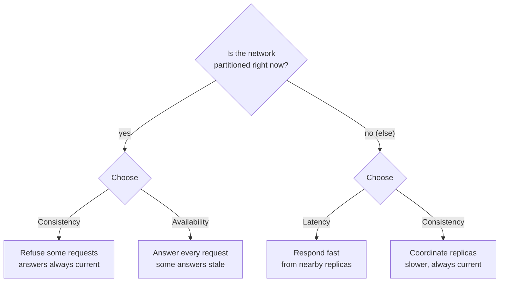

# CAP Theorem Explained: Consistency, Availability, and Partition Tolerance

---

> *“The "2 of 3" formulation was always misleading because it tended to oversimplify the tensions among properties.”*
>
> — **Eric Brewer**, "CAP Twelve Years Later: How the 'Rules' Have Changed," *IEEE Computer*, 2012

## At a Glance

> **In one sentence:** The CAP theorem says that when a network partition splits a distributed system, it must choose between consistency (every read sees the latest write) and availability (every request gets a response) — and PACELC adds that, even without partitions, it trades latency against consistency.

**You'll learn**

- What C, A, and P precisely mean in the theorem
- Why "pick two of three" is misleading
- How CP and AP systems behave during a partition
- PACELC: the latency–consistency trade-off in normal operation
- How real databases are classified — and why the labels are fuzzy

**Before you start:** [Why Distributed Systems Are Hard](Why-Distributed-Systems-Are-Hard.md)

**Reading time:** about 30 minutes

---

## The Big Picture



*CAP forces a choice only during a partition; PACELC adds the everyday trade-off between latency and consistency.*

---

## Introduction

Imagine you run a global bank. Customer Alice deposits $1,000 in New York. Her husband Bob tries to check their balance from Tokyo two seconds later. What should Bob see?

If the system is **consistent**, Bob sees $1,000 in the account — even if it means waiting an extra second for the New York office to confirm the deposit reached Tokyo.

If the system is **available**, Bob sees *something* instantly — even if that something is the old balance of $0 before the deposit was recorded.

If the **network between New York and Tokyo is down** (a partition), you cannot have both. You must choose: do you tell Alice "we'll process your deposit later" (sacrifice availability), or do you accept the risk that Bob might see a wrong balance (sacrifice consistency)?

**This is the CAP theorem.** It is the single most important idea in distributed systems — a formal proof that when networks fail, distributed systems face an unavoidable tradeoff between consistency and availability.

### Why Should Engineers Care About the CAP Theorem?

The CAP theorem is not an abstract academic concept. It is a practical constraint that shapes every distributed system you use:

- **DynamoDB** chose availability over consistency — your shopping cart might briefly show an item you already removed
- **Google Spanner** chose consistency over theoretical availability — accounts never show incorrect balances
- **Cassandra** lets you choose per-query: fast but possibly stale, or slow but correct

Engineers who understand CAP can:

- Choose the right database for the right job
- Design systems that gracefully handle network failures
- Understand why distributed systems are fundamentally harder than single-machine systems
- Communicate tradeoffs clearly in design discussions and interviews

### Where Is CAP Relevant?

| System | CAP Orientation | Real-World Impact |
|--------|----------------|-------------------|
| Amazon DynamoDB | AP (by default) | Shopping cart may show stale data briefly |
| Google Spanner | CP | Bank transfers are never double-spent |
| Apache Cassandra | AP (tunable) | IoT sensor readings might be slightly out of order |
| MongoDB | CP (primary) | Writes fail if primary replica is unreachable |
| Traditional SQL (single server) | CA | Not distributed, so partitions don't apply |
| DNS | AP | A domain change may take minutes to propagate |

---

## The Problem It Solves

### The Fundamental Challenge of Distributed Systems

In a single-machine system, there are no tradeoffs between consistency and availability. A database on one machine can be both perfectly consistent (all reads return the most recent write) and perfectly available (every request gets a response). There is no network to fail.

But when you distribute data across multiple machines — for scalability, fault tolerance, or geographic proximity — you introduce the **network**. And networks are fundamentally unreliable.

> *"A distributed system is one in which the failure of a computer you didn't even know existed can render your own computer unusable."* — Leslie Lamport

The core challenge: **how do multiple machines agree on the state of the data when they cannot reliably communicate?**

### The Problem Before CAP

Before the CAP theorem was formally articulated (2000), engineers built distributed databases without a clear framework for understanding the tradeoffs they were making. The result was systems that:

- Appeared to offer "strong consistency" but silently served stale data during partitions
- Claimed to be "highly available" but became unavailable during network issues
- Made implicit tradeoffs that confused users and led to data corruption

The CAP theorem provided a **language for thinking about distributed system tradeoffs** — a way to clearly articulate what a system guarantees and what it sacrifices.

### What Happens Without Understanding CAP?

Without CAP awareness, engineers make predictable mistakes:

1. **Assuming a database is "just like a single-machine database"** — then being surprised when a network partition causes inconsistent data
2. **Designing a system that claims to provide all three guarantees** — which is impossible during a partition
3. **Making implicit tradeoffs without realizing it** — the system behaves unpredictably during failures

**The CAP theorem doesn't solve a problem; it names the problem so you can address it deliberately.**

---

## Historical Background

### 1999: The Question

Eric Brewer, a professor at UC Berkeley (and later co-founder of Inktomi), was thinking about a fundamental question in distributed systems: **Can a distributed system be consistent, available, and partition-tolerant all at the same time?**

At the time, the web was exploding. Search engines, e-commerce sites, and social networks were all struggling with the same problem: how to scale databases across multiple machines without breaking.

### 2000: The Conjecture

At the **ACM Symposium on Principles of Distributed Computing (PODC)** in July 2000, Brewer presented his conjecture: a distributed system cannot simultaneously provide **Consistency, Availability, and Partition Tolerance**.

He called it the **CAP principle**, and it was met with both interest and skepticism. It was a conjecture — an educated guess — not yet a proof.

### 2002: The Proof

Two MIT researchers, **Seth Gilbert and Nancy Lynch**, formalized and proved Brewer's conjecture in their paper *"Brewer's conjecture and the feasibility of consistent, available, partition-tolerant web services."*

The proof was simple and elegant: during a network partition, messages between nodes are lost. If you want to remain consistent (both nodes return the same data), at least one node must refuse to respond — sacrificing availability. If you want to remain available (both nodes respond), they may return different data — sacrificing consistency.

The CAP principle became the **CAP theorem**.

### 2007–2012: The Database Revolution

The CAP theorem directly influenced the design of a new generation of databases:

- **2007: Amazon Dynamo** — Chose availability and partition tolerance, influencing DynamoDB
- **2008: Apache Cassandra** — Inspired by Dynamo, AP-oriented with tunable consistency
- **2009: MongoDB** — CP-oriented (single primary, replica sets)
- **2012: Google Spanner** — CP-oriented with novel "TrueTime" technology to minimize the impact of the tradeoff

### 2012: The PACELC Extension

Computer scientist **Daniel Abadi** from Yale published *"Consistency Tradeoffs in Modern Distributed Database System Design,"* which pointed out a limitation of CAP: it only addresses behavior *during* a partition. What about normal operation?

Abadi proposed **PACELC**:

- **P**artition: trade **A**vailability vs **C**onsistency
- **E**lse (normal): trade **L**atency vs **C**onsistency

Even when the network is working perfectly, there's a tradeoff between consistency and latency. Strong consistency requires coordination between nodes, which adds delay.

### Today

The CAP theorem is now universally taught in distributed systems courses. Engineers understand that:

- Partition Tolerance is **non-negotiable** in distributed systems (networks will fail)
- The real choice is **Consistency vs Availability during partitions**
- The **PACELC extension** makes the tradeoff explicit during normal operation as well

---

## Core Concepts

### Consistency (C)

**Consistency** means that every read receives the most recent write or an error. All nodes in the system see the same data at the same time.

More formally: after a write completes, all subsequent reads (from any node) must return that value. This is called **linearizability** or **strong consistency**.

```
Time:   t1        t2         t3
Node A: [write X=5] -------- [read  → returns 5]
Node B: ----------[write X=5] -------- [read → returns 5]
```

With strong consistency, it doesn't matter which node you read from — you always get the latest data.

### Availability (A)

**Availability** means that every request receives a response — without guarantee that it contains the most recent data.

Non-availability means the system chooses to return an error or timeout rather than serve potentially stale data. A fully available system never refuses a request.

```
Node A: [write X=5] ---[partition!]--- [read from A → returns 5]
Node B: [write X=5] ---[partition!]--- [read from B → returns 0]
```

Both nodes responded (available), but they gave different answers (not consistent).

### Partition Tolerance (P)

**Partition Tolerance** means the system continues to operate despite an arbitrary number of messages being dropped or delayed between nodes.

A partition is any network failure that prevents communication between two or more nodes in the distributed system:

```
+--------+              +--------+
| Node A |  ---X---  | Node B |
|        |  (broken)   |        |
+--------+              +--------+
```

Partitions can be caused by:
- A network cable being cut
- A switch/router failure
- A firewall blocking traffic
- A server crashing
- Network congestion causing timeouts

In distributed systems, **partitions are inevitable**. You cannot design a system that never experiences network failures. This is why Partition Tolerance is non-negotiable.

### The Crucial Insight: The 2-of-3 Misconception

Many explanations of CAP say: *"You can have at most two of the three properties. Pick two."*

This is **misleading**. The correct understanding is:

> **During a network partition, you must choose between Consistency and Availability. Partition Tolerance is mandatory because networks will fail.**

Under normal operation (no partition), a well-designed system can — and should — provide both consistency and availability. The tradeoff only materializes when the network breaks.

The real question is not "which two do you pick?" but **"what does your system do when the network fails?"**

---

## Real-World Analogy

### The Two Accountants

Imagine a company with two accountants, **Alice in New York** and **Bob in London**. They both maintain the company's ledger, and they must keep identical records.

Normally, when a transaction occurs:
- Alice records it in her ledger
- She sends a copy to Bob via courier
- Bob records it in his ledger
- Their ledgers match (consistency)

Now imagine a storm grounds all flights and ships between New York and London. The courier cannot deliver the update. The accountants face a choice:

**Option A — Consistency (CP):**
- Bob refuses to answer any questions about the ledger until the courier arrives
- "I'm sorry, I can't tell you the company balance until I'm sure I have the latest data."
- The data is correct, but the system is **unavailable**

**Option B — Availability (AP):**
- Bob continues answering questions about the ledger based on what he knows
- "The company balance is $10,000" (which was correct yesterday, before $5,000 was spent in New York)
- The system is available, but the data is **stale (inconsistent)**

**Key Insight:** Alice and Bob cannot be both consistent and available during a communication failure. This is the CAP theorem in action.

---

## How It Works Internally

### The Formal Proof (Simplified)

The proof by Gilbert and Lynch is elegant in its simplicity. Here's the intuition:

Consider a distributed system with two nodes, G1 and G2. The system stores a single value `x`, initially `v0`.

```
Before partition:
G1: x = v0
G2: x = v0
```

**Step 1:** A client writes `x = v1` to G1.

```
After write:
G1: x = v1
G2: x = v0   (not yet updated)
```

**Step 2:** A **network partition** occurs. G1 and G2 cannot communicate.

```
G1 --X-- G2   (partition)
```

**Step 3:** A client sends a read request to G2.

Now, the system faces an unavoidable choice:

| Choice | What Happens | CAP Property Sacrificed |
|--------|-------------|------------------------|
| **Consistent** | G2 must return an error (or wait indefinitely) because it cannot confirm it has the latest data. The system is unavailable. | **A** |
| **Available** | G2 returns `x = v0` (the data it has). But this is stale — the latest write was `x = v1`. The system is inconsistent. | **C** |

There is no third option. G2 cannot know about the write to G1 because the partition prevents communication. **This is a formal proof — there is no way around it.**

### What About Quorum Systems?

Quorum-based systems (like Cassandra with `R + W > N`) don't bypass CAP. They work like this:

1. Write to W nodes, read from R nodes, where W + R > total replicas N
2. During a partition, if all nodes in the write quorum are on one side and all nodes in the read quorum are on the other, the system becomes unavailable (CP) or inconsistent (AP)

Quorum systems shift the **probability** of inconsistency but cannot eliminate the CAP tradeoff.

---

## Components and Architecture

### The CAP Decision Matrix

Every distributed system makes a choice about how to behave during partitions. Here are the three fundamental types:

### CP Systems (Consistency + Partition Tolerance)

**Behavior during partition:** Nodes on the minority side of the partition stop accepting writes (or reject reads).

**Tradeoff:** The system may be unavailable during a partition, but data is never inconsistent.

**Examples:**
- Google Spanner
- MongoDB (replica set with single primary)
- HBase
- ZooKeeper
- etcd

```
CP System During Partition:

+----------+     partition     +----------+
| Majority  | ----X---- | Minority |
| Accepts   |                  | Rejects  |
| writes    |                  | writes   |
+----------+                  +----------+
    Return consistent data         Return errors
```

### AP Systems (Availability + Partition Tolerance)

**Behavior during partition:** All nodes continue to accept reads and writes, potentially returning different data on different sides.

**Tradeoff:** Data may be inconsistent during or after a partition (eventual consistency), but the system remains available.

**Examples:**
- Amazon DynamoDB (eventual consistency reads)
- Apache Cassandra (with eventual consistency settings)
- CouchDB
- Riak

```
AP System During Partition:

+----------+     partition     +----------+
| Node A   | ----X---- | Node B   |
| Accepts  |                  | Accepts  |
| writes   |                  | writes   |
+----------+                  +----------+
    x = 5                          x = 10
    (A returns 5)                  (B returns 10)
```

When the partition heals, the system must reconcile the conflicting values (typically using last-write-wins or version vectors).

### CA Systems (Consistency + Availability)

**Behavior during partition:** Cannot exist in a distributed system. CA systems are simply single-machine systems that don't need partition tolerance.

**Examples:**
- Traditional single-server PostgreSQL
- Single-node MySQL
- In-memory databases (Redis single instance)

These are not distributed systems in the sense that CAP addresses. They achieve consistency and availability because they don't have to coordinate across a network.

---

## End-to-End Flow

### Example: An E-Commerce Inventory System

Let's walk through a concrete scenario: an e-commerce company with inventory data replicated across two data centers (US-East and EU-West).

**Setup:**
- Product: "Wireless Headphones" — 10 units in stock
- Replicated to nodes in Virginia (US-East) and Frankfurt (EU-West)
- The system uses a CP design (prioritizes consistency)

**Normal Operation (no partition):**

```
1. Customer in New York buys 1 headphone
   → Write to US-East: inventory = 9
   → Replicates to EU-West: inventory = 9
   
2. Customer in London checks stock
   → Reads from EU-West: inventory = 9 ✓
   → Consistent, Available
```

**Partition Occurs:**

```
Transatlantic cable is accidentally cut by a fishing trawler.

US-East ----X---- EU-West   (partition)
```

**Scenario A: CP Behavior (like Spanner)**

```
3. Customer in New York buys another headphone
   → Write to US-East: inventory = 8
   
4. Customer in London checks stock
   → Reads from EU-West. But EU-West cannot reach US-East.
   → System says: "I cannot confirm the latest inventory. 
      Returning 'service unavailable' or showing a loading spinner."
   → Inventory data is consistent (correct), but London users see an error
   → TRADEOFF: Consistency over Availability
```

**Scenario B: AP Behavior (like DynamoDB)**

```
3. Customer in New York buys another headphone
   → Write to US-East: inventory = 8
   
4. Customer in London checks stock
   → Reads from EU-West. EU-West cannot reach US-East.
   → But the system is designed for availability.
   → EU-West returns: inventory = 10 (stale data from before the partition)
   → The system is available, but the user sees incorrect data
   → TRADEOFF: Availability over Consistency
```

**After Partition Heals:**

In an AP system, the two nodes have divergent data:
- US-East thinks inventory = 8
- EU-West thinks inventory = 10

The system must reconcile. Common approaches:
- **Last-write-wins (LWW):** The most recent timestamp wins (risks data loss)
- **Conflict-free replicated data types (CRDTs):** Mathematically merge conflicting values
- **Custom reconciliation:** Application-level logic determines the source of truth

---

## PACELC: The Extension

### The Gap in CAP

CAP only describes behavior **during a partition**. But partitions are relatively rare (hopefully!). What about the 99.9% of the time when the network is working?

**PACELC**, proposed by Daniel Abadi in 2012, addresses this gap:

- **P** — If there is a **P**artition: trade **A**vailability vs **C**onsistency (this is CAP)
- **E** — **E**lse (normal operation): trade **L**atency vs **C**onsistency

### Latency vs Consistency in Normal Operation

Even when all nodes can communicate, there's a tradeoff between strong consistency and low latency:

| Approach | Latency | Consistency |
|----------|---------|------------|
| **Strong consistency** | Higher — must coordinate with multiple nodes before responding | Perfect |
| **Eventual consistency** | Lower — respond immediately, sync in background | Stale data possible |

### Real-World PACELC Examples

| System | During Partition (P) | Normal Operation (E) |
|--------|---------------------|---------------------|
| DynamoDB (eventual) | PA (available) | EL (low latency) |
| DynamoDB (strong read) | PC (consistent) | EC (higher latency) |
| Cassandra (QUORUM) | PC (consistent) | EC (waits for quorum) |
| Cassandra (ONE) | PA (available) | EL (fast, stale) |
| Spanner | PC (consistent) | EC (TrueTime adds ~10ms) |
| Single-node MySQL | Not distributed | CA + low latency |

### Why PACELC Matters

PACELC captures a more complete picture of distributed system tradeoffs:

- **During partitions**, you must choose consistency or availability
- **During normal operation**, you must choose consistency or latency
- **No free lunch**: even when everything is working, you can't have both perfect consistency and minimal latency

This is why systems like DynamoDB default to **eventual consistency** (EL) even when the network is healthy — providing strong consistency (EC) would require coordinating with multiple nodes, adding latency to every request.

---

## Production Engineering Perspective

### Scalability

- **AP systems scale more easily** — They can add nodes without worrying about coordination overhead during writes
- **CP systems face scalability challenges** — Strong consistency requires coordination (consensus), which becomes slower as more nodes are added
- **Quorum systems balance both** — With `R + W > N`, you can scale while maintaining some consistency guarantee

### Reliability

- **CP systems are reliable for data integrity** — You never see inconsistent data, but you may see errors during partitions
- **AP systems are reliable for availability** — You always get a response, but you may see stale data
- **The tradeoff is existential**: During a partition, one guarantee is always broken

### Performance

| Metric | CP System | AP System |
|--------|-----------|-----------|
| Read latency (normal) | Higher (coordination needed) | Lower (read from one node) |
| Write latency (normal) | Higher (coordination needed) | Lower (write to one node) |
| Read latency (partition) | Errors or timeouts | Low (but possibly stale) |
| Write throughput | Lower | Higher |

### Availability

- **CP systems** have lower availability during partitions (by design)
- **AP systems** maintain availability during partitions (by design)
- **The Nine's tradeoff**: A CP system might target 99.99% availability (strong consistency), while an AP system targets 99.999% (available even during partitions)

### Maintainability

- **AP systems** require reconciliation logic when partitions heal — this adds application complexity
- **CP systems** are simpler to reason about (data is always consistent) but more complex to operate (harder to scale, more coordination)
- **Tunable systems** (Cassandra) offer flexibility but require deep understanding to configure correctly

---

## Tradeoffs

### ✅ Benefits of CP Systems

| Benefit | Explanation |
|---------|------------|
| **Strong consistency** | Data is always correct — no stale reads |
| **Simpler application logic** | No reconciliation, no conflict resolution |
| **Correctness guarantees** | Suitable for financial, inventory, and critical systems |

### ✅ Benefits of AP Systems

| Benefit | Explanation |
|---------|------------|
| **High availability** | Always accept reads and writes, even during partitions |
| **Low latency** | Faster reads and writes (no coordination) |
| **Horizontal scalability** | Add nodes without coordination overhead |
| **Resilience** | Survive node and network failures gracefully |

### ❌ Drawbacks of CP Systems

| Drawback | Explanation |
|----------|------------|
| **Unavailability during partitions** | Minority partition rejects requests |
| **Higher latency** | Coordination between nodes adds delay |
| **Lower throughput** | Consensus protocols limit write capacity |

### ❌ Drawbacks of AP Systems

| Drawback | Explanation |
|----------|------------|
| **Stale data** | Users may see outdated information |
| **Conflict resolution complexity** | Must handle conflicting values when partition heals |
| **Eventual consistency is not intuitive** | Application developers must think carefully about consistency |

### ⚠️ When Not to Use Each

**Don't use AP when:**
- You're handling financial transactions (banking, payments)
- You need strict inventory accuracy
- Regulatory compliance requires strong consistency
- Your application cannot tolerate stale data

**Don't use CP when:**
- Availability is more important than perfect consistency
- Your users prefer a fast response over a correct one (social media feeds)
- You're operating at global scale where partitions are inevitable

### 🔁 Alternatives to the Binary Choice

Some systems offer **tunable consistency**:

- **Cassandra**: Per-query consistency levels (ONE, QUORUM, ALL)
- **DynamoDB**: Eventually consistent reads (default) vs strongly consistent reads
- **Azure Cosmos DB**: Five consistency levels from strong to eventual

This allows applications to choose per-operation: use eventual consistency for recommendations, strong consistency for payments.

---

## Common Mistakes

### Beginner Mistakes

1. **"I'll just pick a CA database"** — In a distributed system, you cannot avoid partitions. Any multi-node system must handle them. CA systems are single-machine databases.

2. **"I need all three"** — Engineers new to distributed systems often think they can achieve Consistency, Availability, and Partition Tolerance simultaneously. The CAP theorem proves this is impossible during partitions.

3. **Confusing CAP's "consistency" with ACID's "consistency"** — CAP's consistency is about stale reads (linearizability). ACID's consistency is about database invariants. They are different concepts entirely.

### Intermediate Mistakes

4. **Assuming a system is purely AP or CP** — Most real systems are not purely one or the other. DynamoDB offers strongly consistent reads. Cassandra offers tunable consistency. The question is *what happens during a partition*.

5. **Ignoring PACELC** — Focusing only on CAP and ignoring the latency-consistency tradeoff during normal operation. Systems that are "AP" during partitions may still have high latency in normal operation if they choose strong consistency.

6. **Thinking partitions are rare** — In a global system spanning multiple data centers or cloud regions, network partitions are a regular occurrence. Design for them.

### Senior-Level Architectural Mistakes

7. **Designing a CP system for a use case that needs AP** — If your application requires 99.999% availability (e.g., an ad-serving platform), a CP system that rejects traffic during partitions will lose revenue. Choose AP.

8. **Designing an AP system for a use case that needs CP** — If you're building a payment system and using eventual consistency, users may be double-charged or see incorrect balances. Choose CP.

9. **Not testing partition behavior** — Many systems have never been tested under a real network partition. When the partition inevitably occurs, the behavior is unpredictable. Netflix's Chaos Engineering explicitly tests partition scenarios.

10. **Ignoring the human cost of eventual consistency** — Eventual consistency sounds simple in theory ("data will converge!") but is extremely difficult to implement correctly in practice. Version vectors, conflict resolution, and reconciliation logic add significant complexity.

---

## Failure Scenarios

### Scenario 1: A CP System Becomes Unavailable During Partition

**What happens:** A network partition isolates one data center. The CP system (e.g., MongoDB with a single primary) rejects all writes in the minority partition. Users in that region cannot place orders.

**Why it fails:** The system was designed for consistency. During a partition, the minority nodes cannot guarantee they have the latest data, so they refuse to serve reads and writes.

**How to diagnose:**
- Monitor: Error rates spike on the minority side
- Metrics: `mongodb_replset_primary` — check if the primary is reachable from all nodes
- Logs: "Not primary" or "no healthy primary" errors

**Mitigation:**
- Accept that some unavailability is the price of consistency
- Use automatic failover to promote a new primary in each partition (but this can lead to split-brain — two primaries writing conflicting data)
- For critical applications, invest in highly reliable networking to minimize partitions

### Scenario 2: An AP System Serves Stale Data After Partition

**What happens:** A user adds an item to their shopping cart on their phone, then immediately checks the cart on their laptop. The item doesn't appear because the AP system hasn't converged yet.

**Why it fails:** The AP system prioritized availability — the write to the cart went to one node, and the read came from a different node that hadn't received the update.

**How to diagnose:**
- Monitor: Measure read-your-writes consistency — what percentage of reads see the latest write?
- Metrics: Replication lag between nodes
- Logs: Version vector conflicts

**Mitigation:**
- Use **sticky sessions** — route the same user to the same node
- Use **read-your-writes consistency** — remember the timestamp of the last write and ensure subsequent reads come from a node with that timestamp
- Accept that some staleness is the price of availability

### Scenario 3: Reconciliation Conflicts

**What happens:** A partition occurs in a Cassandra cluster. Two users each buy the last item in inventory on different sides of the partition. Both write `inventory = 0`. When the partition heals, the system has conflicting values that need reconciliation.

**Why it fails:** Both sides accepted writes during the partition. The system must decide which write "wins" — potentially losing a sale or overselling inventory.

**Mitigation:**
- Use **last-write-wins** (simplest, but risks data loss)
- Use **CRDTs** (mathematical conflict merging, but not suitable for all data types)
- Build **application-level reconciliation** (common in e-commerce: if both sides oversell, cancel one order and notify the customer)

---

## Security Considerations

### Fork Attacks

In systems that allow nodes to diverge during partitions, an attacker can maliciously fork the data by controlling one side of a partition. This is particularly dangerous in blockchain and cryptocurrency systems.

**Defense:** Use strong consistency for critical transactions, or implement Byzantine fault tolerance protocols.

### Causal Consistency Violations

Imagine a user posts a photo on a social network, then immediately deletes it. An AP system may show the photo to some users (who read from a node that received the "post" but not the "delete") while other users see nothing.

This is a **causal consistency violation** — the delete operation appears to happen before the post, from some readers' perspective.

**Defense:** Use causal consistency protocols that track operation dependencies.

### Partition-Based Denial of Service

An attacker can intentionally trigger network partitions by overwhelming network links between data centers, forcing a CP system into unavailability.

**Defense:** 
- Use multiple, diverse network paths (avoid single points of failure)
- Implement rate limiting on cross-datacenter communication
- For critical systems, consider AP with strong conflict resolution instead of CP

---

## Performance Considerations

### Bottlenecks in CP Systems

| Bottleneck | Why It Happens | How to Fix |
|------------|---------------|------------|
| **Consensus protocol** | Paxos/Raft requires multiple round trips | Use leader leases (reduce elections) |
| **Synchronous replication** | Wait for acknowledgments from all nodes | Use quorum (R+W > N) instead of all |
| **Leader bottleneck** | All writes go through a single leader | Shard data across multiple leaders |

### Bottlenecks in AP Systems

| Bottleneck | Why It Happens | How to Fix |
|------------|---------------|------------|
| **Conflict resolution** | Reconciling divergent data on partition heal | Use CRDTs for automatic merge |
| **Hinted handoff** | Queueing writes for unreachable nodes | Tune queue size, timeout, and retry rate |
| **Read repair** | Checking all replicas on each read | Increase read repair chance, or use anti-entropy |

### Optimization Strategies

1. **Choose the right consistency level per operation** — In Cassandra, use `ONE` for fast reads and `QUORUM` for critical reads
2. **Use caching** — A cache layer can absorb reads and reduce the coordination overhead of strong consistency
3. **Shard intelligently** — Keep related data (that needs strong consistency) on the same node
4. **Design for partition recovery** — The partition *heal* is often more performance-critical than the partition itself

---

## Real-World Industry Examples

### Amazon DynamoDB (AP by Default)

DynamoDB is Amazon's fully managed NoSQL database, designed for high availability and scalability.

**CAP stance:** Primarily AP (eventual consistency)

**How it works:**
- Data is automatically replicated across three Availability Zones
- By default, reads are **eventually consistent** — they may return stale data
- Optionally, DynamoDB offers **strongly consistent reads** (at higher cost and latency)
- Strongly consistent reads go to the node with the latest data (moving toward CP for that specific read)

**Real-world use:** Amazon's shopping cart uses DynamoDB with eventual consistency. If you remove an item and refresh, it might briefly reappear. Amazon considers this an acceptable tradeoff for high availability.

### Google Spanner (CP, with Novel Engineering)

Spanner is Google's globally distributed SQL database, used for critical systems like Google Ads and Google Play.

**CAP stance:** CP (strong consistency)

**How it works:**
- Uses **TrueTime** — a global clock service based on GPS and atomic clocks in every Google data center
- TrueTime provides bounded clock uncertainty (typically <10ms)
- This allows Spanner to implement **external consistency** — transactions are ordered consistently across the entire globe
- During partitions, Spanner uses Paxos consensus to elect leaders. If a node cannot reach consensus, it stops serving (CP behavior)

**The engineering miracle:** Google's investment in atomic clocks, GPS receivers, and private fiber networks pushes the boundaries of CAP. Spanner is CP by theory but achieves five-nines (99.999%) availability in practice.

**Real-world use:** Google Ads — every billion-dollar advertising transaction must be consistent. Spanner ensures no double spending or lost bids.

### Apache Cassandra (AP by Default, Tunable)

Cassandra is a distributed NoSQL database used by Netflix, Apple, and Uber.

**CAP stance:** AP by default, with tunable consistency

**How it works:**
- Masterless architecture (all nodes are equal)
- Clients choose consistency level per query:
  - `ONE`: Read/write to one node (fast, eventual)
  - `QUORUM`: Read/write to majority of replicas (stronger, slower)
  - `ALL`: Read/write to all replicas (strongest, slowest, lowest availability)
- With `W + R > N` (quorum), Cassandra provides strong consistency — at the cost of availability during partitions

**Real-world use:** Netflix uses Cassandra for viewing history. If a movie appears in your history before you've finished watching, that's AP in action. If Netflix couldn't serve recommendations because of a network issue (CP), it would lose revenue.

### MongoDB (CP)

MongoDB is a document database with replica sets.

**CAP stance:** CP (single primary)

**How it works:**
- Each replica set has a **primary** node (accepts writes) and **secondaries** (replicate from primary)
- If the primary becomes unavailable, the remaining secondaries hold an election to elect a new primary
- During the election, writes are not accepted (unavailability — CP behavior)
- Reads from secondaries may return stale data unless configured with `linearizableReadConcern`

**Real-world use:** MongoDB is used by many applications where strong consistency matters but brief unavailability during leader election is acceptable.

### Netflix — Chaos Engineering and CAP Testing

Netflix famously tests its systems under failure conditions using **Chaos Monkey** (which randomly kills instances) and **Chaos Kong** (which simulates regional failures).

Netflix's approach to CAP:
- They're willing to sacrifice **consistency** for **availability** during partitions
- Their recommendation engine can serve slightly stale recommendations — no one dies
- They invest heavily in reconciliation logic and fault tolerance
- This philosophy is explicitly tested: "Will the system survive if an entire AWS region goes down?"

### Meta (Facebook) — The Social Graph Tradeoff

Meta operates the social graph — friends, likes, comments — across thousands of cache servers.

Meta's CAP approach:
- **AP-oriented:** It's acceptable for a friend's like to appear 5 seconds late
- **Eventual consistency** is the default for most social features
- **BUT:** For critical operations (password changes, account recovery), they use strongly consistent paths
- Their **TAO** cache system uses leases to balance consistency and availability

---

## Case Studies

### Case Study 1: The Amazon Dynamo Paper (2007)

**The problem:** Amazon's shopping cart used a traditional relational database. During the 2004 holiday season, a database partition caused the shopping cart to become unavailable for hours. Amazon lost millions in revenue.

**The insight:** Amazon realized that showing a *slightly stale* cart is better than showing *no cart at all*. Users can always refresh. But an error message means lost sales.

**The solution:** Amazon designed **Dynamo** (the predecessor to DynamoDB) as an AP system:
- Always available for writes and reads
- Eventual consistency for non-critical data
- Version vectors for conflict detection
- "Sloppy quorum" for writes during partitions

**Lesson:** For e-commerce, availability is worth more than perfect consistency. A working cart with slightly stale data converts better than a broken cart with perfect data.

### Case Study 2: Google Spanner — Pushing the Boundaries (2012)

**The problem:** Google's advertising system needed global strong consistency. Previous systems (Bigtable, Megastore) couldn't provide both consistency at global scale and acceptable performance.

**The innovation:** Spanner uses **TrueTime** — Google's global clock infrastructure. TrueTime exposes a time interval `[earliest, latest]` with bounded uncertainty, allowing Spanner to assign globally-consistent timestamps to transactions.

**CAP implications:**
- Spanner is CP: during partitions, it refuses to serve rather than serving inconsistent data
- But TrueTime reduces the window of unavailability to milliseconds
- This is as close to "CA at global scale" as engineering has achieved

**Lesson:** With enough engineering investment (atomic clocks, GPS receivers, private fiber networks), you can push the boundaries of the CAP tradeoff. For most organizations, the pragmatic choice is to accept the tradeoff rather than invest in exotic hardware.

### Case Study 3: PayPal's Consistency Requirements

**The problem:** PayPal processes billions of dollars in transactions. A stale read showing an incorrect balance could have legal and financial consequences.

**The solution:** PayPal uses CP systems for all financial data:
- Oracle databases with synchronous replication
- Strong consistency for all balance queries
- Acceptable unavailability: minutes of downtime per year is better than a single incorrect transaction

**The tradeoff accepted:** During certain failure scenarios, PayPal may temporarily become unavailable. Customers see "service temporarily unavailable" rather than incorrect balances.

**Lesson:** For financial systems, CP is non-negotiable. The cost of inconsistency (lawsuits, regulatory fines) far exceeds the cost of brief unavailability.

---

## Practical Code Examples

### Choosing Consistency Per-Query in Cassandra

```python
from cassandra.cluster import Cluster
from cassandra import ConsistencyLevel
from cassandra.query import SimpleStatement

cluster = Cluster(['10.0.1.1', '10.0.1.2', '10.0.1.3'])
session = cluster.connect('ecommerce')

# AP-leaning read: fast, may be stale. Good for a product recommendation widget.
fast_query = SimpleStatement(
    "SELECT * FROM recommendations WHERE user_id = %s",
    consistency_level=ConsistencyLevel.ONE
)
session.execute(fast_query, [user_id])

# CP-leaning read: slower, guarantees the latest write is visible.
# Good for checking a wallet balance before a withdrawal.
strong_query = SimpleStatement(
    "SELECT balance FROM wallets WHERE user_id = %s",
    consistency_level=ConsistencyLevel.QUORUM
)
session.execute(strong_query, [user_id])
```

### Choosing Consistency Per-Read in DynamoDB (AWS SDK v3, Node.js)

```javascript
import { DynamoDBClient } from "@aws-sdk/client-dynamodb";
import { GetCommand, DynamoDBDocumentClient } from "@aws-sdk/lib-dynamodb";

const client = new DynamoDBClient({ region: "us-east-1" });
const docClient = DynamoDBDocumentClient.from(client);

// Eventually consistent read (default): cheaper, ~half the read-capacity cost, may be stale.
const cartRead = await docClient.send(new GetCommand({
  TableName: "ShoppingCarts",
  Key: { userId: "alice-123" },
}));

// Strongly consistent read: guarantees you see the most recent write, costs more.
const balanceRead = await docClient.send(new GetCommand({
  TableName: "AccountBalances",
  Key: { userId: "alice-123" },
  ConsistentRead: true,
}));
```

### Testing Partition Behavior with Jepsen

[Jepsen](https://jepsen.io/) is the industry-standard tool for testing how real distributed databases behave under network partitions, clock skew, and process crashes. Its published analyses (of MongoDB, Cassandra, etcd, CockroachDB, and dozens of others) are some of the best primary sources for understanding how CAP tradeoffs play out in real systems, not just in theory.

```bash
# Example: running Jepsen's etcd test suite against a 5-node cluster
git clone https://github.com/jepsen-io/jepsen.git
cd jepsen/etcd
lein run test --nodes-file nodes.txt --time-limit 60 --nemesis partition-random-halves
```

---

## Frequently Asked Questions

**Q: Does the CAP theorem mean I can only have two of three guarantees all the time?**

No. This is the most common misconception. CAP only applies **during a network partition**. Under normal operation (when all nodes can communicate), you can — and should — have both consistency and availability. Partition Tolerance is not optional in distributed systems.

**Q: What's the difference between CAP's consistency and ACID's consistency?**

CAP's consistency is about **linearizability** — do all nodes return the same data at the same time? ACID's consistency is about **database invariants** — does the data satisfy defined rules (foreign keys, constraints, etc.)? They are unrelated concepts that happen to share the same word.

**Q: Is it possible to build a distributed system that's never unavailable and never inconsistent?**

No. The CAP theorem proves this is mathematically impossible during network partitions. You can reduce the probability and duration of inconsistency/unavailability, but you cannot eliminate the tradeoff entirely.

**Q: What is eventual consistency?**

Eventual consistency means that if no new writes are made to a system, eventually all reads will return the last written value. The system converges over time. The key word is "eventually" — there's no guarantee of *when* (though well-designed systems converge in milliseconds or seconds).

**Q: Does the CAP theorem apply to blockchain systems?**

Yes. Bitcoin and Ethereum are AP systems — during a network partition, different nodes may temporarily see different versions of the blockchain (forks). The protocol eventually converges on the longest chain (eventual consistency).

**Q: What is the difference between strong consistency and eventual consistency in practice?**

| Property | Strong | Eventual |
|----------|--------|----------|
| Read-your-writes | Guaranteed | Not guaranteed |
| Monotonic reads | Guaranteed | Not guaranteed |
| Stale data | Never | Possible |
| Availability | Lower during partitions | Higher during partitions |

---

## Interview Questions

### Beginner Questions

**Q1: What is the CAP theorem?**

The CAP theorem states that a distributed data system can only provide two of three guarantees simultaneously during a network partition: Consistency (all nodes return the same data), Availability (every request receives a response), and Partition Tolerance (the system continues to operate despite network failures). Since partitions are inevitable in distributed systems, the real choice is between Consistency and Availability during network failures.

**Q2: Why is Partition Tolerance non-negotiable in distributed systems?**

Because network failures are unavoidable. Network cables get cut, routers fail, firewalls misbehave, and data centers lose power. Any distributed system spanning multiple machines will experience partitions. You cannot design a system that is immune to network failures, so you must design one that handles them — which means Partition Tolerance is mandatory.

**Q3: Give an example of a CP system and an AP system.**

- **CP (Consistency + Partition Tolerance):** Google Spanner. During a network partition, nodes that cannot reach consensus stop serving requests to prevent inconsistent data.
- **AP (Availability + Partition Tolerance):** Amazon DynamoDB (eventual consistency). During a partition, all nodes continue serving requests, accepting that different nodes may return different data temporarily.

### Intermediate Questions

**Q4: Explain the difference between the "pick any two" misconception and the correct understanding of CAP.**

The common misconception is that a system "picks two properties permanently" (like choosing CA). The correct understanding is that Partition Tolerance is mandatory, and the tradeoff between Consistency and Availability only matters **during a partition**. Under normal operation, well-designed systems provide both.

**Q5: What is PACELC and why does it extend CAP?**

PACELC, proposed by Daniel Abadi, extends CAP by recognizing that the tradeoff exists even during normal operation. CAP says: during a **P**artition, trade **A**vailability vs **C**onsistency. PACELC adds: **E**lse (normal operation), trade **L**atency vs **C**onsistency. Even without network failures, strong consistency requires coordination, which adds latency.

**Q6: How does a quorum-based system (like Cassandra) handle the CAP tradeoff?**

Cassandra uses quorum reads and writes: read from R nodes, write to W nodes, where R + W > N (total replicas). With `R + W > N`, a read and write quorum always overlap by at least one node, providing strong consistency. During a partition, if a quorum can be reached on one side, the system remains consistent (CP). If a quorum cannot be reached (not enough nodes available), the system becomes unavailable.

### Senior Questions

**Q7: Design a globally distributed banking system. How do you handle the CAP tradeoff?**

A senior answer should cover:
- **CP for transaction data:** Use a system like Spanner with strong consistency for account balances
- **AP for non-critical data:** Transaction history can be eventually consistent (the user expects recent transactions to appear within seconds)
- **Idempotency:** Every transaction has a unique ID, preventing double-processing even during partitions
- **Two-phase commits** (or saga pattern) for cross-shard transactions
- **Read-your-writes:** Let users see their own writes immediately even if replicated slowly
- **Graceful degradation:** If the CP system becomes unavailable, show cached balance data with a warning "balance may not reflect most recent transactions"

**Q8: You're designing a social media feed. Should you choose CP or AP? Why?**

AP. Social media feeds prioritize availability. Users expect to see *something* when they open the app, even if it's slightly stale. Showing an error message ("unable to load feed") is worse than showing a 30-second-old feed. The cost of inconsistency in social media is low — a slightly stale like count or delayed post is acceptable. The cost of unavailability is high — users will switch to another platform.

### Architecture Questions

**Q9: Design a real-time multiplayer game server that handles millions of concurrent players. How does CAP apply?**

A strong answer covers:
- **AP for position updates:** Player positions don't need strong consistency (sub-millisecond state)
- **CP for inventory/currency:** Use strong consistency for purchases and items
- **Client-side prediction:** Let the game client predict movement locally, then reconcile with server
- **Lag compensation:** Accept that different players see slightly different game states
- **Conflict resolution:** If two players pick up the same item, use a deterministic tiebreaker

**Q10: Your CTO says "We need a database that's consistent and available and partition-tolerant. Can't we just find one that does all three?" How do you respond?**

"Those three properties are mathematically impossible to achieve simultaneously during a network partition. This has been formally proven. However, we can discuss which property is most important for each part of our system. For our payment system, we'll prioritize consistency (accepting brief unavailability during failures). For our recommendation engine, we'll prioritize availability (accepting stale data during failures). No single database can give us all three, but we can design different parts of our architecture to make the right tradeoff for each use case."

---

## Hands-On Lab

A two-replica store that can run in **CP** or **AP** mode. Cut the network between the replicas and watch each mode make its trade-off.

```python
class Node:
    def __init__(self, name): self.name, self.value = name, "v1"

class Cluster:
    def __init__(self, mode):
        self.mode, self.a, self.b, self.partitioned = mode, Node("A"), Node("B"), False

    def write(self, node, value):
        other = self.b if node is self.a else self.a
        if not self.partitioned:
            node.value = other.value = value              # replicate normally
            return "ok"
        if self.mode == "CP":
            return "ERROR: can't reach the other replica, refusing write"
        node.value = value                                # AP: accept locally
        return "ok (other replica not updated)"

    def read(self, node):
        if self.partitioned and self.mode == "CP" and node is self.b:
            return "ERROR: minority side, refusing possibly stale read"
        return node.value

for mode in ["CP", "AP"]:
    c = Cluster(mode)
    c.partitioned = True                                  # the network splits
    print(f"--- {mode} during partition")
    print("write to A:", c.write(c.a, "v2"))
    print("read from B:", c.read(c.b))
    c.partitioned = False                                 # network heals
    print("after heal, A =", c.a.value, " B =", c.b.value)
```

**What to notice**
- **CP** keeps every answer correct by refusing some requests during the partition (lower availability).
- **AP** answers every request, but B returns stale data during the partition, and after the network heals the replicas disagree until something reconciles them. Real AP systems need anti-entropy or conflict resolution for exactly this.
- Without a partition, both modes behave the same — CAP only forces a choice *during* a partition.

---

## Test Yourself

*Answer each question in your head or on paper first, then open the answer to check.*

<details markdown="1">
<summary><strong>1. State the CAP theorem precisely.</strong></summary>

In a distributed data store, when a network **partition** occurs, the system must choose between **consistency** (linearizability: every read returns the most recent write) and **availability** (every request to a non-failed node receives a non-error response). It cannot guarantee both during the partition.

</details>

<details markdown="1">
<summary><strong>2. Why is "pick any two of three" misleading?</strong></summary>

Partitions aren't optional in a real network — they will happen. So the real choice is only *what to do when one happens*: favor consistency or availability. When there is no partition, a system can offer both.

</details>

<details markdown="1">
<summary><strong>3. Who proposed CAP, and who proved it?</strong></summary>

Eric Brewer presented it as a conjecture in 2000. Seth Gilbert and Nancy Lynch published a formal proof in 2002.

</details>

<details markdown="1">
<summary><strong>4. What does PACELC add?</strong></summary>

If there's a **P**artition, choose **A** or **C**; **E**lse (normal operation), choose between **L**atency and **C**onsistency. Waiting for replicas to confirm makes reads and writes consistent but slower.

</details>

<details markdown="1">
<summary><strong>5. Give an example where choosing availability (AP) is the right call.</strong></summary>

A shopping cart, social media likes, or a product catalog: showing slightly stale data or merging carts later is far better than showing an error. Amazon's Dynamo was designed with this reasoning.

</details>

<details markdown="1">
<summary><strong>6. Give an example where choosing consistency (CP) is the right call.</strong></summary>

Bank balances, inventory reservation for the last seat or item, leader election, and distributed locks: returning an error is better than two people spending the same money or booking the same seat.

</details>

<details markdown="1">
<summary><strong>7. Does CAP's "consistency" mean the same thing as ACID's "consistency"?</strong></summary>

No. CAP's C means linearizability (all nodes appear to have a single, up-to-date copy). ACID's C means a transaction keeps the database's rules and constraints valid. Same word, different ideas.

</details>

---

## Cheat Sheet

| Letter | In CAP it means | Not to be confused with |
|-------|----------------|------------------------|
| C | Linearizability: reads see the latest write | ACID consistency (constraints hold) |
| A | Every non-failed node answers (no errors) | "Five nines" uptime |
| P | The system keeps working despite lost messages between nodes | Data partitioning (sharding) |

| During a partition | Behavior | Typical use |
|-------------------|---------|------------|
| CP | Some requests fail; answers are always current | Payments, locks, leader election, inventory |
| AP | All requests answered; some may be stale; reconcile later | Carts, feeds, likes, DNS, caches |

**PACELC:** Partition → Availability or Consistency; Else → Latency or Consistency.

**Timeline:** 2000 Brewer's conjecture · 2002 Gilbert & Lynch proof · 2012 Brewer's "CAP Twelve Years Later" · 2012 Abadi's PACELC.

---

## In the AI Era

AI applications face CAP-style tradeoffs in a new form: **when a model dependency fails, do you stay available or stay consistent?**

Consider an application that depends on a hosted model provider. When that provider is unreachable, rate-limited, or degraded — effectively a partition between you and a critical dependency — you can:

- **Favor availability:** fail over to a different model or provider. The feature keeps working, but answers may differ in style, quality, or format, and your prompts and evaluations may not have been tuned for the fallback.
- **Favor consistency:** return an error or a degraded non-AI experience rather than serve behavior you haven't validated.

Neither is universally right. A casual writing assistant should probably fail over. A system extracting structured medical or financial data probably shouldn't silently switch to an untested model.

The same thinking applies to **agent memory and conversation state** replicated across regions: if a user continues a conversation during a partition, can the assistant proceed with a possibly stale history, or must it wait?

**Try it:** For two AI features (one low-stakes, one high-stakes), write down the fallback behavior during a provider outage and justify it using the CAP vocabulary from this chapter.

---

## Key Takeaways

1. **The CAP theorem proves a fundamental constraint in distributed systems:** during a network partition, you must choose between consistency and availability. Both is impossible.

2. **Partition Tolerance is not optional** — networks will fail. The real question is how your system behaves when they do.

3. **The "pick two" is a misleading simplification.** CAP only applies during partitions. Under normal operation, aim for both consistency and availability.

4. **PACELC extends CAP to normal operation:** even without partitions, there's a tradeoff between consistency and latency. Strong consistency requires coordination, which takes time.

5. **Different systems make different choices:**
   - **DynamoDB** (AP): available first, consistent eventually
   - **Spanner** (CP): consistent first, available when possible
   - **Cassandra** (tunable): you choose per-query

6. **There is no universally "correct" CAP choice** — it depends on your use case:
   - Banking, payments, inventory → CP
   - Social media, recommendations, logging → AP
   - Many systems → a mix of both for different operations

7. **The complexity of eventual consistency is often underestimated.** Conflict resolution, version vectors, and reconciliation logic are hard to implement correctly.

8. **Push the boundaries with engineering, but accept the tradeoff.** Google Spanner uses atomic clocks and GPS to minimize the impact of the CAP tradeoff, but it still exists. No amount of engineering can eliminate it.

9. **Test your system under partitions.** Many organizations discover their CAP behavior only during a real failure. Test partition scenarios deliberately.

10. **Communicate tradeoffs clearly.** The CAP theorem gives you a language to discuss distributed system tradeoffs with stakeholders, product managers, and fellow engineers.

---

## What to Read Next

- **[Consistency vs Availability](Consistency-vs-Availability.md)** — the full spectrum between C and A
- **[Data Replication Strategies](../04-Data-And-Storage/Data-Replication-Strategies.md)** — how replication choices create CP or AP behavior
- **[How Caching Works](How-Caching-Works.md)** — a cache is a deliberately AP copy of your data

---

## Further Reading

### Foundational Papers

- **"Towards Robust Distributed Systems" (2000)** — Eric Brewer's original CAP lecture: [https://people.eecs.berkeley.edu/~brewer/cs262b-2004/PODC-keynote.pdf](https://people.eecs.berkeley.edu/~brewer/cs262b-2004/PODC-keynote.pdf)
- **"Brewer's Conjecture and the Feasibility of Consistent, Available, Partition-Tolerant Web Services" (2002)** — Gilbert and Lynch's formal proof: [https://dl.acm.org/doi/10.1145/564585.564601](https://dl.acm.org/doi/10.1145/564585.564601)
- **"Consistency Tradeoffs in Modern Distributed Database System Design" (2012)** — Daniel Abadi's PACELC paper: [https://www.cs.umd.edu/~abadi/papers/abadi-pacelc.pdf](https://www.cs.umd.edu/~abadi/papers/abadi-pacelc.pdf)
- **"Dynamo: Amazon's Highly Available Key-value Store" (2007)** — DeCandia et al., the paper that started the AP-database movement: [https://www.allthingsdistributed.com/files/amazon-dynamo-sosp2007.pdf](https://www.allthingsdistributed.com/files/amazon-dynamo-sosp2007.pdf)
- **"Spanner: Google's Globally-Distributed Database" (2012)** — Corbett et al., OSDI paper on TrueTime and external consistency: [https://research.google/pubs/spanner-googles-globally-distributed-database/](https://research.google/pubs/spanner-googles-globally-distributed-database/)
- **"Eventually Consistent" (2008)** — Werner Vogels' widely cited explainer on the practical meaning of eventual consistency: [https://www.allthingsdistributed.com/2008/12/eventually_consistent.html](https://www.allthingsdistributed.com/2008/12/eventually_consistent.html)

### Academic Resources

- **MIT 6.824 — Distributed Systems**: [https://pdos.csail.mit.edu/6.824/](https://pdos.csail.mit.edu/6.824/)
- **Stanford CS 244B — Distributed Systems**: Covers CAP, consensus, and consistency models
- **University of Washington CSE 452 — Distributed Systems**: Lectures on CAP theorem and tradeoffs

### Industry Engineering Blogs

- **Amazon Web Services — "A Decade of Dynamo"** : [https://www.allthingsdistributed.com/2022/10/a-decade-of-dynamo.html](https://www.allthingsdistributed.com/2022/10/a-decade-of-dynamo.html)
- **Google Research — "Spanner: Google's Globally-Distributed Database"** : [https://research.google/pubs/spanner-googles-globally-distributed-database/](https://research.google/pubs/spanner-googles-globally-distributed-database/)
- **Apache Cassandra Documentation — Consistency Levels**: [https://cassandra.apache.org/doc/latest/cassandra/architecture/dynamo.html](https://cassandra.apache.org/doc/latest/cassandra/architecture/dynamo.html)
- **Cloudflare — CAP Theorem Explained**: [https://www.cloudflare.com/learning/distributed-data/cap-theorem/](https://www.cloudflare.com/learning/distributed-data/cap-theorem/)
- **All Things Distributed — Werner Vogels' Blog**: [https://www.allthingsdistributed.com/](https://www.allthingsdistributed.com/)
- **Jepsen — Distributed Systems Safety Analyses**: Independent, empirical partition-tolerance testing of real databases (MongoDB, Cassandra, etcd, CockroachDB, and more): [https://jepsen.io/analyses](https://jepsen.io/analyses)
- **MongoDB Engineering Blog — "CAP Theorem" and Replica Set Elections**: [https://www.mongodb.com/resources/basics/cap-theorem](https://www.mongodb.com/resources/basics/cap-theorem)

### Books

- **"Designing Data-Intensive Applications" by Martin Kleppmann** — Chapters 7–9 cover consistency, consensus, and the CAP theorem in depth
- **"Distributed Systems" by Maarten van Steen and Andrew Tanenbaum** — Covers CAP and related concepts
- **"Database Internals" by Alex Petrov** — Chapters on distributed databases and consistency models

### Videos

- **Eric Brewer — "CAP Twelve Years Later"** (2012): A retrospective on how the CAP theorem evolved
- **Martin Kleppmann — "Distributed Systems Lecture Series"** : Excellent explanations of CAP, consistency, and consensus

---

*This chapter is part of the Software Engineering Handbook — a comprehensive guide to the concepts, principles, and practices that every professional software engineer should know.*
