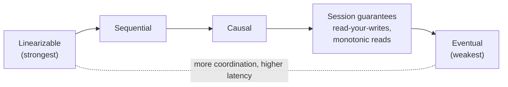

# Consistency vs Availability: The Spectrum of Consistency Models

*CAP tells you there's a tradeoff. This chapter tells you how to actually choose a point on it.*

---

> *“The concept of time is fundamental to our way of thinking. It is derived from the more basic concept of the order in which events occur.”*
>
> — **Leslie Lamport**, "Time, Clocks, and the Ordering of Events in a Distributed System," 1978

## At a Glance

> **In one sentence:** Consistency is a spectrum, from linearizability (the system behaves like one up-to-date copy) through causal and session guarantees down to eventual consistency — and each step down buys more availability and lower latency at the cost of anomalies users might see.

**You'll learn**

- Linearizability, sequential, causal, and eventual consistency
- Session guarantees: read-your-writes, monotonic reads, and more
- The anomalies each model allows, with concrete examples
- Tunable consistency and quorums
- How to choose a consistency level per feature, not per system

**Before you start:** [CAP Theorem Explained](CAP-Theorem-Explained.md)

**Reading time:** about 35 minutes

---

## The Big Picture



*Consistency models form a spectrum: the stronger the guarantee, the more coordination — and latency — it costs.*

---

## Introduction

Imagine a group chat with three friends — Maya, Josh, and Priya — spread across three cities. Maya sends a message: "Let's meet at 6pm." A moment later, Josh replies "sounds good" — but what if Josh's phone hadn't yet received Maya's message, and he's replying to something else entirely? Now imagine Priya, opening the chat five minutes later, sees Josh's reply *before* Maya's original message, because of how the messages happened to sync to her device. The conversation reads as nonsense, even though every individual message was delivered correctly.

This is what "consistency" actually means in distributed systems — not a binary switch, but a whole spectrum of promises about *what order, and how quickly, different observers see the same events.* The [`CAP-Theorem-Explained.md`](./CAP-Theorem-Explained.md) chapter proves that during a network partition, you must choose between consistency and availability. What it doesn't cover — and what this chapter does — is the rich, practical landscape of consistency models *in between* "everyone sees everything instantly and in perfect order" (linearizability) and "everyone eventually sees the same thing, someday, in some order" (eventual consistency). Most production engineering decisions live in that middle ground, not at either extreme.

This chapter assumes you already understand the CAP theorem's core proof; we will not re-derive it here. Instead we go deeper into a question CAP doesn't answer: *given that you must give something up, which consistency guarantee should you keep, for which piece of data, and why?*

### Why Should Engineers Care

Nearly every distributed data store — Cassandra, DynamoDB, MongoDB, Postgres with replicas, Redis Cluster — exposes a *choice* of consistency level per operation, not a single fixed guarantee. Engineers who don't understand the spectrum:

- Default to whatever the client library ships with, often without realizing it
- Use "eventual consistency" as a synonym for "we don't care about correctness," when in fact even eventually-consistent systems can offer strong, specific, useful guarantees (read-your-writes, monotonic reads) at a fraction of the cost of full linearizability
- Over-pay for strong consistency on data that doesn't need it (view counts, recommendation caches), hurting latency and availability for no user-visible benefit
- Under-pay for strong consistency on data that desperately needs it (inventory counts, account balances), causing double-spends, overselling, and lost updates

Choosing the right consistency model per piece of data — not per database, not per company-wide policy — is one of the highest-leverage architectural decisions a backend engineer makes.

### Where Is This Relevant

| System / Feature | Typical Consistency Model | Why |
|---|---|---|
| Bank account balance | Linearizable | Users must never see a stale or wrong balance |
| Shopping cart | Read-your-writes, eventual otherwise | You must see your own additions; others' staleness is fine |
| Social media like count | Eventual | A few seconds of staleness is imperceptible |
| Collaborative document editing | Causal consistency | Edits must respect "happens-before" order, but don't need global ordering |
| DNS | Eventual | Propagation delay of minutes is an accepted tradeoff |
| Distributed lock / leader election | Linearizable (via consensus) | Two nodes must never both believe they hold the lock |
| Chat message ordering | Causal + FIFO per sender | Replies should appear after the message they're replying to |
| Session data ("am I logged in?") | Read-your-writes, monotonic reads | A user should never appear logged out right after logging in |

---

## The Problem It Solves

### The Problem CAP Leaves Open

CAP tells you that during a partition you must choose consistency or availability — but it treats "consistency" as a single, all-or-nothing property (linearizability). In practice, that binary framing is far too coarse for real engineering decisions. Real systems need answers to much more specific questions:

- If I relax consistency, *how much* does it relax, and in what precise, contractually-specifiable way?
- Can I get some of the benefits of strong consistency (e.g., a user never seeing their own write disappear) without paying the full latency and availability cost of linearizability?
- Different pieces of data in the same application have wildly different consistency needs — how do I reason about that per-field, per-table granularity, rather than picking one setting for an entire database?

The spectrum of consistency models exists to answer exactly these questions, giving engineers a vocabulary of precise, weaker-than-linearizable guarantees, each with a specific cost/benefit profile.

### What Happens Without This?

1. **Silent over-engineering** — teams reach for a strongly consistent, globally coordinated database (e.g., forcing every read through a single primary) for data that would have been perfectly fine eventually consistent, paying unnecessary latency and availability costs system-wide.
2. **Silent under-engineering** — teams pick "the fast NoSQL option" everywhere, including for data (inventory, payments, unique username registration) where a stale read directly causes a business-visible bug: overselling, double-booking, duplicate usernames.
3. **User-visible confusion** — a user posts a comment, refreshes, and doesn't see it (violating read-your-writes); a user sees their unread count go from 3 to 0 and back to 3 (violating monotonic reads). These aren't "the system being slightly stale" in the abstract — they read as broken to end users.
4. **Impossible debugging** — "sometimes X happens before Y and sometimes Y happens before X, but only for some users" is an extremely common symptom of picking a consistency model weaker than the application's actual requirements, and it can be maddening to diagnose without the vocabulary this chapter provides.

---

## Historical Background

### 1976–1979 — Sequential Consistency

Computer scientist **Leslie Lamport** defined **sequential consistency** in his 1979 paper *"How to Make a Multiprocessor Computer That Correctly Executes Multiprocess Programs,"* building on his 1976 work. Sequential consistency requires that the result of execution be as if all operations were executed in *some* sequential order, and each processor's operations appear in that order in the sequence they were issued — a weaker, more achievable relative of linearizability, originally framed for multiprocessor memory systems rather than networked databases.

### 1990 — Linearizability Formally Defined

**Maurice Herlihy and Jeannette Wing** formalized **linearizability** in their 1990 paper *"Linearizability: A Correctness Condition for Concurrent Objects."* Linearizability is the strongest practical consistency model: every operation appears to take effect instantaneously at some point between its invocation and completion, and that point respects real-time (wall-clock) ordering across all clients. It remains the gold-standard reference point that every weaker model is defined *relative to*.

### 1994 — Causal Consistency

The formal notion of **causal consistency** traces to work by **Mustaque Ahamad, Gil Neiger, James Burns, Prince Kohli, and Phillip Hutto** ("Causal Memory: Definitions, Implementation, and Programming," 1994), building on Lamport's 1978 happens-before relation. Causal consistency requires only that causally related operations be seen in the same order by everyone — concurrent, unrelated operations can be seen in different orders by different observers, which is a much easier property to achieve at scale than full linearizability.

### 1997 — Session Guarantees

**Douglas Terry, Alan Demers, Karin Petersen, Mike Spreitzer, Marvin Theimer, and Brent Welch**, in *"Session Guarantees for Weakly Consistent Replicated Data"* (1994) and related work on Bayou (a mobile/weakly-connected database system out of Xerox PARC), formalized four now-standard **session guarantees**: read-your-writes, monotonic reads, monotonic writes, and writes-follow-reads. These remain the standard vocabulary engineers use today when specifying "eventual, but not chaotic" consistency.

### 2000 — Eric Brewer's CAP Conjecture

As covered in [`CAP-Theorem-Explained.md`](./CAP-Theorem-Explained.md), Brewer's 2000 PODC talk (proved by Gilbert & Lynch in 2002) framed consistency and availability as an unavoidable tradeoff under partition, giving the whole field a shared vocabulary — but at the coarse granularity of "consistent" versus "available," not the finer spectrum this chapter covers.

### 2007 — Amazon's Dynamo Popularizes Eventual Consistency at Scale

Amazon's Dynamo paper (2007) was the moment "eventual consistency" moved from an academic curiosity to mainstream industry practice, directly inspiring DynamoDB, Cassandra, Riak, and Voldemort. Dynamo also popularized **vector clocks** for tracking causality between replicas and detecting (rather than automatically resolving) write conflicts.

### 2011 — PBS: Probabilistically Bounded Staleness

Peter Bailis and colleagues at UC Berkeley published *"Probabilistically Bounded Staleness for Practical Partial Quorums"* (2012), giving engineers a way to *quantify* how stale an eventually consistent read is likely to be (e.g., "99.9% of reads are consistent within 12.7 milliseconds of the write"), turning "eventual" from a vague promise into a measurable, tunable engineering property.

### 2012 — Daniel Abadi's PACELC

As also covered in the CAP chapter, Abadi's PACELC framework made explicit that even *without* a partition, there is a latency/consistency tradeoff — directly motivating the demand for a richer spectrum of consistency models tuned to each workload's latency budget, not just a binary CP/AP choice.

---

## Core Concepts

### The Consistency Spectrum, Strongest to Weakest

```
STRONGEST                                                              WEAKEST
   │                                                                       │
   ▼                                                                       ▼
Linearizability → Sequential → Causal → Read-Your-Writes /  → Eventual
 (Strict/         Consistency  Consistency  Monotonic Reads /   Consistency
  Strong)                                   Monotonic Writes /
                                             Writes-Follow-Reads

Higher latency, lower availability  ◄────────────────────►  Lower latency, higher availability
under partition                                              under partition
```

### Linearizability (Strong Consistency)

**Definition:** Every operation appears to take effect atomically, at a single point in time between when it was invoked and when it completed, and that ordering is consistent with real (wall-clock) time across *all* clients. If operation A completes before operation B begins (in real time), every observer must see A's effect before B's.

```
Client 1: write(x=5)  |---write---|
Client 2:                              read(x) → must return 5
                       (read starts strictly after write completes)
```

**Cost:** Requires coordination (typically consensus) on every operation. This is the model CAP's proof directly applies to — a linearizable system cannot remain available during a partition without risking violating linearizability.

**Used by:** ZooKeeper, etcd, Google Spanner (external consistency, a form of linearizability plus global real-time ordering via TrueTime), distributed locks.

### Sequential Consistency

**Definition:** All operations from all clients appear in *some* single global order, and each individual client's own operations appear in that order in the sequence the client issued them — but that global order does *not* have to match real (wall-clock) time. Two clients might disagree about which of two concurrent, unrelated writes "came first" in absolute time, as long as everyone agrees on the *same* order.

**Difference from linearizability:** Linearizability additionally requires that the agreed-upon order respect real-time — if A finishes before B starts, A must be ordered before B. Sequential consistency drops that real-time constraint, which makes it slightly cheaper to implement (no need for tightly synchronized clocks) while still being extremely strong.

### Causal Consistency

**Definition:** Operations that are causally related (one could have influenced the other — e.g., a reply to a specific comment, a read followed by a write based on that read) must be seen in the same order by every observer. Operations that are **concurrent** (neither one could have caused the other) may be seen in different orders by different observers, and that's acceptable.

```
Causally related (must preserve order everywhere):
  Maya posts "What time works?"  →  Josh replies "6pm works for me"
  (Josh's reply causally depends on having read Maya's post)

Concurrent (order can differ between observers):
  Maya posts "Let's meet at the cafe"
  Josh posts "I'll bring snacks"
  (neither read the other before posting -- no observer NEEDS to see
   them in a particular order for the conversation to make sense)
```

Causal consistency is powerful because it matches human intuition about conversations, edits, and comment threads almost exactly, while being dramatically cheaper to implement at global scale than linearizability — it doesn't require a single global coordination point, only tracking of dependencies (typically via vector clocks or dotted version vectors).

### The Session Guarantees (Client-Centric Consistency)

These four guarantees, from the Bayou project, don't require any global ordering at all — they only constrain what a *single client* (or session) sees over time, which makes them cheap to implement (often just "stick to the same replica, or track a high-water-mark version") while eliminating the most user-visibly-confusing symptoms of eventual consistency.

| Guarantee | Definition | User-Facing Symptom If Violated |
|---|---|---|
| **Read-Your-Writes** | A client always sees its own prior writes in subsequent reads | You post a comment, refresh, and it's gone |
| **Monotonic Reads** | If a client has read a value, it will never later read an *older* value | Your unread count goes 3 → 0 → 3 again |
| **Monotonic Writes** | A client's writes are applied in the order the client issued them | You set your status to "away" then "online," but the system ends up applying them in reverse |
| **Writes-Follow-Reads** | A write that happens after a read is guaranteed to be applied after (see) the effects of that read | You reply to a comment, but your reply appears in the feed data before the comment it's replying to |

### Eventual Consistency

**Definition:** If no new writes are made, all replicas will *eventually* converge to the same value — with no bound on how long "eventually" takes, and no ordering guarantee at all in the meantime. This is the weakest useful consistency model, and the cheapest to implement: it imposes essentially no coordination requirement on writes.

**Critical nuance:** "Eventual consistency" is often used sloppily as a synonym for "no guarantees at all." In practice, well-engineered eventually consistent systems almost always layer session guarantees (read-your-writes, monotonic reads) on top of the bare eventual-consistency floor — because bare eventual consistency alone produces a user experience most applications can't tolerate.

### Strong Eventual Consistency (SEC) and CRDTs

A refinement worth knowing: **Strong Eventual Consistency**, achieved by **Conflict-free Replicated Data Types (CRDTs)**, guarantees that any two replicas that have received the same *set* of updates (regardless of order) will converge to the *identical* state, deterministically, with no conflict-resolution logic required. This is achieved by designing data types (counters, sets, maps) whose merge operations are mathematically commutative, associative, and idempotent. CRDTs let you get automatic, correct convergence without the coordination cost of linearizability — at the cost of being limited to specific data type designs.

### Putting It Together: A Comparison Table

| Model | Global Order? | Real-Time Respecting? | Coordination Cost | Availability Under Partition |
|---|---|---|---|---|
| Linearizability | Yes | Yes | Highest (consensus per op) | Lowest |
| Sequential Consistency | Yes | No | High | Low |
| Causal Consistency | Only for related ops | No | Medium | Medium-High |
| Read-Your-Writes / Monotonic Reads | No (client-scoped only) | No | Low | High |
| Eventual Consistency | No | No | Lowest | Highest |

---

## Real-World Analogy

### The Newsroom Wire Service

Imagine a global news wire service with reporters filing stories from many cities, and editors in different newsrooms around the world publishing based on the wire feed.

- **Linearizability** would mean: every editor, in every newsroom, sees every story in the exact same order, and that order exactly matches the true real-time order in which reporters filed them — achievable only if every newsroom pauses and checks with a single central clearinghouse before publishing anything. Extremely safe, but painfully slow, and if the clearinghouse is unreachable, no newsroom can publish anything at all.

- **Sequential consistency** would mean: all newsrooms agree on *the same* order of stories, but that order doesn't have to exactly match the true filing time — as long as every newsroom's front page reads identically in terms of story sequence. Still requires a lot of coordination, but doesn't need perfectly synchronized clocks.

- **Causal consistency** would mean: a follow-up correction to a story must never be published *before* the original story it corrects, in any newsroom — but two unrelated stories filed at roughly the same time (a sports score and a weather report) can appear in different orders on different newsrooms' front pages without anyone being confused, because there's no causal link between them.

- **Read-your-writes** would mean: a reporter who just filed a correction, checking their own newsroom's site, will always see their correction reflected — even if a *different* newsroom on the other side of the world hasn't received it yet.

- **Eventual consistency**, bare, would mean: every newsroom will *eventually* carry every story, with no promise about order or timing in the meantime — a newsroom might briefly show the correction before the original story, or vice versa, and that's considered acceptable.

Most real newsrooms — like most real production systems — actually want something like: causal consistency for related stories (never show a correction before the original), plus read-your-writes for the reporter's own newsroom, plus bare eventual consistency for unrelated wire traffic between distant bureaus. That blended, per-content-type approach is exactly how production engineers apply this spectrum in practice.

---

## How It Works Internally

### How Linearizability Is Achieved: Consensus on Every Write

A linearizable system typically routes every write (and often every read, to guarantee freshness) through a consensus protocol (see [`Consensus-Algorithms-Paxos-and-Raft.md`](./Consensus-Algorithms-Paxos-and-Raft.md)), so that a majority of replicas agree on the exact, single, globally-ordered sequence of operations before any of them is considered committed.

```
Client -> [Write x=5] -> Leader
                            |
                            | Replicate to followers, wait for majority ACK
                            v
                    +-------+-------+-------+
                    | Node1 | Node2 | Node3 |
                    |  ACK  |  ACK  |(slow) |
                    +-------+-------+-------+
                            |
                 Majority (2 of 3) ACKed -> commit -> respond to client
```

Every subsequent read must also consult the leader (or a majority) to guarantee it reflects the latest committed write — this is why linearizable reads are typically as expensive as writes, unlike in weaker models where a read can often be served locally.

### How Causal Consistency Is Achieved: Vector Clocks

A causally consistent system tags each write with a **vector clock** — a per-replica counter vector that records "how many updates has each replica applied that this write depends on." A replica only applies an incoming write once it has already applied everything that write causally depends on.

```
Vector clock example, 3 replicas (A, B, C):

Replica A writes X: vector clock [A:1, B:0, C:0]
Replica A writes Y (after X, sees X): vector clock [A:2, B:0, C:0]
  -> Y "happens-after" X because A:2 > A:1 while B,C unchanged

Replica B, receiving updates, will apply X before Y,
because Y's vector clock [A:2,...] causally depends on
having already seen A's count reach at least 1 (i.e., X).

Two writes from DIFFERENT replicas with vector clocks that
neither dominates the other (e.g. [A:1,B:0,C:0] vs [A:0,B:1,C:0])
are CONCURRENT -- no ordering constraint between them.
```

This lets the system apply concurrent, unrelated writes in any order (cheap, no coordination needed) while strictly enforcing order for causally dependent writes (the guarantee that actually matters for correctness and user experience).

### How Read-Your-Writes Is Achieved in Practice

Two common implementation strategies:

1. **Sticky sessions / session affinity**: Route a given client's requests to the same replica (or a replica guaranteed to be at least as up-to-date as the one it last wrote to) for the duration of a session, typically via a cookie or consistent hashing on user ID.
2. **Version/timestamp tracking**: The client (or a proxy on its behalf) remembers the version/timestamp of its last write, and any subsequent read request includes "give me a version at least this fresh" — the server either serves from a replica that has caught up, or waits briefly for replication to catch up before responding.

```
Client writes X, server returns version token: "v=104"
Client later reads X, sends "read X, min_version=104"
   -> If local replica is only at v=101, either:
      (a) forward the read to a more up-to-date replica, or
      (b) wait for local replication to catch up to v=104
   -> Only then serve the read, guaranteeing read-your-writes
```

---

## Components and Architecture

### The Consistency Decision Stack

Real production systems typically don't pick one consistency model globally — they build a small decision stack that's evaluated per data type or per operation:

```
+-----------------------------------------------------+
| 1. Does this data require GLOBAL, real-time-ordered  |
|    agreement across ALL clients?                     |
|    (e.g., distributed lock, unique username claim)   |
|    -> YES: Linearizability, via consensus              |
+-----------------------------------------------------+
| 2. Does this data require ordering ONLY for causally  |
|    related events? (e.g., comment threads, chat)      |
|    -> YES: Causal consistency, via vector clocks       |
+-----------------------------------------------------+
| 3. Does a SINGLE USER need to see their own actions   |
|    reflected reliably, but cross-user ordering doesn't|
|    matter? (e.g., "did my post save?")                |
|    -> YES: Read-your-writes / monotonic reads,         |
|            via session affinity or version tokens      |
+-----------------------------------------------------+
| 4. Is a few seconds (or longer) of staleness truly     |
|    invisible or harmless to the business?              |
|    (e.g., view counts, recommendation feeds)           |
|    -> YES: Bare eventual consistency                   |
+-----------------------------------------------------+
```

### Tunable Consistency Systems

Some databases let you choose the consistency level *per query*, rather than baking a single choice into the schema or architecture:

- **Cassandra**: `ONE`, `QUORUM`, `ALL` read/write consistency levels, chosen per query.
- **DynamoDB**: eventually consistent reads (default, cheaper) vs. strongly consistent reads (opt-in, costs 2x read capacity).
- **Azure Cosmos DB**: five distinct consistency levels — Strong, Bounded Staleness, Session, Consistent Prefix, Eventual — explicitly designed to expose this entire spectrum as a first-class configuration knob.
- **MongoDB**: configurable read/write concerns (`majority`, `local`, `linearizable`) and read preferences.

---

## End-to-End Flow

### Example: Devon Edits a Shared Google-Docs-Style Document

Devon and two collaborators, Ana and Wei, are editing a shared document stored in a system that uses **causal consistency** for the document's operation log, and **read-your-writes** for each user's own editor view.

**T+0ms** — Devon types "Q3 revenue grew 12%" in paragraph 4. The client generates an operation `op_devon_1` and assigns it a vector clock `[devon:1, ana:0, wei:0]`, then sends it to the nearest regional edit server.

**T+15ms** — The edit server in Devon's region accepts the operation, appends it to the causal operation log, and immediately returns success to Devon's client. Because the system guarantees read-your-writes for the originating client, Devon's own screen updates the instant the local client applies the operation — it doesn't wait for global propagation.

**T+40ms** — Ana, in a different region, is looking at paragraph 4 and, without having seen Devon's edit yet, changes the same sentence to "Q3 revenue grew significantly." Her client generates `op_ana_1` with vector clock `[devon:0, ana:1, wei:0]` — concurrent with Devon's edit, since Ana's client hasn't observed Devon's operation.

**T+300ms** — Wei, watching the document, sees Devon's edit appear (propagation from Devon's region reached Wei's region). Wei starts typing a comment reacting to it: "Nice, can you cite the source?" His client generates `op_wei_1`, and because Wei's operation causally depends on having seen `op_devon_1`, its vector clock is `[devon:1, ana:0, wei:1]` — the system will guarantee every replica applies `op_devon_1` before `op_wei_1`, everywhere, because of that causal dependency.

**T+310ms** — The system detects that `op_devon_1` and `op_ana_1` are concurrent (neither vector clock dominates the other) — a genuine conflict on the same sentence. Rather than silently picking a winner, the document's operational-transform/CRDT merge logic (the specific technique real collaborative editors like Google Docs and Figma use) merges both edits according to a deterministic, conflict-resolution algorithm, and every replica converges to the identical merged result, regardless of the order updates arrive in — this is Strong Eventual Consistency in action for the concurrent portion of the edit history.

**T+450ms** — All three collaborators' screens now show: the merged sentence reflecting both edits' conflict resolution, followed by Wei's comment (guaranteed to appear after Devon's edit, honoring the causal dependency) — even though the underlying network delivered these updates to different regions at different times and in different orders.

The result: Devon never saw his own edit disappear (read-your-writes), Wei's comment never appeared to reference an edit that hadn't happened yet (causal consistency), and the genuinely concurrent edit conflict between Devon and Ana was resolved deterministically without requiring a slow, globally-coordinated lock on the paragraph (avoiding the cost of linearizability for a case where it wasn't actually needed).

---

## Production Engineering Perspective

### Scalability

Weaker consistency models scale further because they require less cross-node coordination per operation. A linearizable system's write throughput is bounded by consensus round-trip latency; a causally consistent system can process concurrent, unrelated writes on different replicas fully in parallel; a bare eventually consistent system can accept writes on any replica with zero coordination at write time.

### Reliability

The reliability question shifts by model: linearizable systems are reliable in the sense of "never wrong," but can become unavailable under partition (a CP tradeoff). Weaker models remain available but shift the reliability burden to *convergence* — the system must guarantee that conflict resolution and propagation logic actually converges correctly, which is a real engineering challenge in its own right (see CRDTs, anti-entropy protocols like Merkle-tree-based read repair).

### Performance

| Model | Typical Write Latency | Typical Read Latency | Cross-Region Cost |
|---|---|---|---|
| Linearizable | High (consensus round trip) | High (must consult quorum/leader) | Very high |
| Causal | Medium (local write, async propagate) | Low (local read, respects dependencies) | Medium |
| Read-your-writes only | Low | Low (with occasional wait-for-catch-up) | Low-Medium |
| Eventual | Lowest | Lowest | Lowest |

### Availability

Under a network partition specifically: linearizable systems must sacrifice availability on the minority side (per CAP); causal and session-guarantee systems can typically remain available on both sides of a partition, deferring reconciliation until the partition heals; bare eventually consistent systems remain fully available on both sides unconditionally.

### Maintainability

Weaker consistency models push complexity from the database layer into the application layer: engineers must reason explicitly about conflict resolution, session affinity, and version tracking. Strong consistency, by contrast, pushes complexity into the database/consensus layer and lets application code stay simple — this tradeoff (operational simplicity for the app vs. for the infrastructure) is a major factor in real-world model selection.

---

## Tradeoffs

### ✅ Benefits of Stronger Models (Linearizable / Sequential)

| Benefit | Explanation |
|---|---|
| **Simplicity for application developers** | No conflict resolution, no reasoning about staleness |
| **Correctness guarantees** | Safe default for financial, inventory, and safety-critical data |
| **No surprising anomalies** | Every read reflects the latest committed write |

### ✅ Benefits of Weaker Models (Causal / Session / Eventual)

| Benefit | Explanation |
|---|---|
| **Lower latency** | Local reads/writes without consensus round trips |
| **Higher availability under partition** | Both sides of a partition can keep serving traffic |
| **Better horizontal scalability** | No global coordination bottleneck |
| **Matches many real UX needs precisely** | Causal/session guarantees fix the actually-annoying anomalies without the full cost of linearizability |

### ❌ Drawbacks of Stronger Models

| Drawback | Explanation |
|---|---|
| **Higher latency** | Every operation pays a coordination cost |
| **Lower availability under partition** | Minority side must reject requests |
| **Harder to scale globally** | Cross-region consensus is expensive |

### ❌ Drawbacks of Weaker Models

| Drawback | Explanation |
|---|---|
| **Application-level complexity** | Conflict resolution and reconciliation logic must be built and tested |
| **Anomalies are possible** | Without session guarantees layered on top, users can see confusing, non-monotonic behavior |
| **Harder to reason about correctness** | "Eventually" has no fixed bound; testing staleness scenarios is harder than testing a single deterministic order |

### ⚠️ Limitations

- Consistency models are not free choices independent of the rest of the system — the model you pick constrains which database features, indexes, and query patterns are safe to use.
- Mixing models within one application (recommended!) requires discipline: it's easy to accidentally treat an eventually consistent read as if it were linearizable, reintroducing the very anomalies you were trying to avoid.
- Session guarantees (read-your-writes, monotonic reads) are typically scoped to a *single client/session* — they say nothing about what a *different* user sees, which is often the actual source of confusing multi-user bugs.

### 🔁 Alternatives to a Single Fixed Choice

| Approach | When to Use |
|---|---|
| **Tunable per-query consistency (Cassandra, Cosmos DB)** | When different operations on the same table have very different consistency needs |
| **CRDTs for specific data types** | When you need guaranteed convergence without coordination, for counters/sets/maps specifically |
| **Hybrid architecture: CP store for critical data, AP store for everything else** | When the application clearly separates critical and non-critical data domains |

### When NOT to Use Strong Consistency

- Data where staleness of seconds (or longer) has no meaningful business impact (view counts, "last seen" timestamps, recommendation caches).
- Extremely high write-throughput, globally-distributed workloads where consensus latency would dominate the request budget.

### When NOT to Use Weak Consistency

- Any data where a stale or conflicting read directly causes a financial, legal, or safety issue (account balances, inventory of a scarce/limited item, unique identity claims like usernames or email addresses).
- Distributed coordination primitives themselves (locks, leader election) — these require linearizability by definition; a "mostly correct" distributed lock is worse than no lock at all.

---

## Common Mistakes

### Beginner Mistakes

1. **Treating "NoSQL" as synonymous with "eventual consistency" and "SQL" as synonymous with "strong consistency."** Both statements are false — many NoSQL databases offer tunable or strong consistency options, and many SQL databases (with async replicas) are eventually consistent for reads from replicas.
2. **Assuming eventual consistency means "random, chaotic ordering."** In practice, most well-designed eventually consistent systems layer session guarantees on top, giving predictable behavior for the common cases even without full linearizability.
3. **Not distinguishing "consistency" in CAP/consistency-models from "consistency" in ACID.** ACID consistency is about database invariants (constraints, foreign keys); CAP/consistency-model consistency is about whether reads reflect the latest writes. They are unrelated ideas sharing a word.

### Intermediate Mistakes

4. **Picking one consistency level for an entire database, rather than per data type.** A single e-commerce database might reasonably use linearizable consistency for inventory counts and eventual consistency for product view counts — using one setting for both is either wasteful or unsafe.
5. **Forgetting that session guarantees are scoped to a session, not global.** Read-your-writes guarantees you see your own write; it says nothing about whether a *different* user sees it yet, which is often exactly the scenario that produces confusing bugs in collaborative features.
6. **Not measuring actual staleness in an eventually consistent system.** "Eventual" without a measured bound (using techniques like Probabilistically Bounded Staleness) is an untested assumption, not an engineering guarantee.

### Senior-Level Architectural Mistakes

7. **Applying causal consistency's vector-clock machinery to data that doesn't have meaningful causal relationships**, adding real engineering complexity for no corresponding benefit.
8. **Using strong consistency as a default "safe" choice everywhere, without measuring the latency/availability cost**, then being surprised when the system can't meet its SLA under regional failure.
9. **Failing to explicitly define and test conflict-resolution semantics** for a causally-consistent or eventually-consistent system before shipping — "we'll figure out conflict resolution later" almost always means a real customer discovers the conflict-resolution bug first.

---

## Failure Scenarios

### Scenario 1: Read-Your-Writes Violated by Load Balancer Routing

**What happens:** A user updates their profile photo. The write is served by replica A. Immediately after, a page reload sends the read request through a load balancer that happens to route it to replica B, which hasn't yet received the update. The user sees their old photo and assumes the upload failed, and re-uploads — sometimes several times.

**Why it fails:** The system offers no session affinity or version-token mechanism to guarantee a client's own reads reflect its own prior writes.

**How to diagnose:** Correlate "write then immediate read" sequences per user session against replica lag metrics; look for user reports of "my change didn't save" that resolve themselves on a later refresh.

**Solutions:** Implement sticky sessions (route a user's requests to the same replica for a window of time) or version-token-based read routing (client remembers its last write version, server ensures the serving replica has caught up before responding).

### Scenario 2: Causal Order Violated in a Notification System

**What happens:** A user deletes a post. Moments later, some followers still receive a push notification about a comment on the now-deleted post, because the "comment created" event and the "post deleted" event were processed by different, uncoordinated pipelines without a causal dependency check.

**Why it fails:** The system was designed with bare eventual consistency across independent event streams, without preserving the causal relationship between "post exists" and "comment on post" events.

**How to diagnose:** Trace event timestamps and causal metadata (if any exists) across the notification pipeline; look for notifications referencing already-deleted entities.

**Solutions:** Attach causal metadata (a reference to the specific post version/vector clock the comment depended on) to derived events, and have consumers check that the referenced entity's causal predecessor has actually been observed before acting on a dependent event.

### Scenario 3: Concurrent Writes Silently Overwritten (Lost Update) Under Weak Consistency

**What happens:** Two support agents, unaware of each other, both open the same customer ticket and update its status — one sets it to "resolved," the other sets it to "escalated," seconds apart, on different replicas. Because the system uses simple last-write-wins conflict resolution based on wall-clock timestamp (not causality-aware, not versioned), one update is silently discarded, with no record that a conflict ever occurred.

**Why it fails:** Last-write-wins is a valid, common conflict-resolution strategy for AP systems, but it silently drops information — it doesn't distinguish "genuinely concurrent, conflicting update" from "the same client's own sequential updates," and wall-clock timestamps across machines aren't reliably ordered in the first place (see [`Why-Distributed-Systems-Are-Hard.md`](./Why-Distributed-Systems-Are-Hard.md)).

**How to diagnose:** Compare application-level audit logs (which may capture both updates) against the final stored state; look for tickets whose status doesn't match either agent's expectation.

**Solutions:** Use versioned writes with optimistic concurrency control (reject a write if the version being updated is stale, forcing the second agent to see the conflict and resolve it explicitly), or use a CRDT-based structure for fields that commonly experience concurrent updates, or escalate genuinely conflicting business-critical fields to a linearizable store instead of an eventually consistent one.

---

## Security Considerations

- **Stale authorization checks**: If permission/role data is served from an eventually consistent replica, a user whose access was just revoked might still be able to perform privileged actions for a window of time on a stale replica — authorization data generally warrants read-your-writes at minimum, and often linearizability, specifically for revocation.
- **Replay and reordering exploitation**: In systems relying on causal ordering for security-relevant event sequences (e.g., "verify email" must happen-before "grant elevated privileges"), an attacker able to influence event delivery order in a purely eventually-consistent pipeline could attempt to exploit a missing causal check.
- **Conflict-resolution logic as an attack surface**: Last-write-wins based on client-supplied timestamps can be gamed by an attacker who deliberately sends a write with a far-future timestamp to guarantee it "wins" any future conflict — servers should use server-side timestamps or logical clocks, never trust client-supplied ones for conflict resolution.
- **Session-affinity as a targeting vector**: Sticky-session mechanisms used to achieve read-your-writes can, if implemented via predictable routing keys, make it easier for an attacker to target a specific backend replica — route assignment should not leak exploitable information.

---

## Performance Considerations

### Bottlenecks

| Bottleneck | Why It Happens | How to Fix |
|---|---|---|
| **Consensus round trips for linearizable reads** | Every read must confirm freshness with a quorum/leader | Use leader leases to serve local reads safely for a bounded window |
| **Vector clock size growth** | Vector clocks grow with the number of replicas/actors | Use dotted version vectors or server-assigned IDs to bound growth |
| **Session-affinity hot spots** | Sticky routing can concentrate load on specific replicas | Use version-token-based routing instead of pure stickiness |
| **Anti-entropy / read-repair overhead** | Reconciling divergent replicas consumes CPU and network | Tune repair frequency and use efficient Merkle-tree diffing |

### Optimization Strategies

1. **Segment data by consistency need** — put linearizability-requiring data in a small, dedicated CP store; keep the bulk of the application on a cheaper, more available model.
2. **Use bounded staleness where "eventual" is too vague** — Cosmos DB's Bounded Staleness level, or PBS-style measurement, gives you a concrete, testable staleness SLA instead of an open-ended promise.
3. **Cache aggressively for eventually-consistent reads** — since staleness is already tolerated, a cache layer (see [`How-Caching-Works.md`](./How-Caching-Works.md)) adds almost no additional correctness cost while dramatically cutting latency and backend load.
4. **Batch causal metadata propagation** — don't send a full vector clock on every tiny update; batch related operations and propagate causal dependencies at a coarser grain where the application semantics allow it.

### Scaling Challenges

As the number of replicas/regions grows, vector-clock-based causal consistency's per-write metadata overhead grows too, unless bounded via techniques like server-assigned sequence IDs (used by systems like COPS and Eiger, academic causally-consistent geo-replicated stores) instead of raw per-replica vector clocks.

---

## Real-World Industry Examples

### DynamoDB — Choosing Per-Read Consistency

DynamoDB lets every single `GetItem` call choose `ConsistentRead: true` (strongly consistent, reads the latest committed value, costs double the read capacity units) or the default eventually consistent read (cheaper, may lag by a small, typically sub-second window). Amazon explicitly documents this as a per-call tradeoff, not a table-wide setting — exactly the "decision stack" pattern described in this chapter.

### Azure Cosmos DB — Five Consistency Levels as a First-Class Product Feature

Cosmos DB is the most explicit commercial implementation of the consistency spectrum: Strong (linearizable), Bounded Staleness (a quantified staleness window, in time or number of versions), Session (read-your-writes, monotonic reads — scoped to a session token), Consistent Prefix (causal ordering of writes, no gaps or reordering, but staleness allowed), and Eventual. Microsoft's own guidance explicitly walks engineers through choosing based on the exact latency/availability/consistency tradeoffs covered in this chapter.

### Google Docs / Figma — Causal Consistency Plus CRDTs for Collaborative Editing

Real-time collaborative editors are the canonical production use case for causal consistency plus conflict-free merge logic (operational transformation historically, CRDT-based approaches increasingly): they need to preserve "reply after original," but can tolerate, and must gracefully resolve, genuinely concurrent edits to the same content — exactly the pattern in this chapter's End-to-End Flow example.

### WhatsApp / Signal — Causal + FIFO-per-Sender Message Ordering

Messaging apps generally guarantee that messages from a single sender arrive in the order sent (a form of monotonic writes / FIFO), and that a reply is never displayed before the message it's replying to (causal consistency) — while accepting that messages from two different, unrelated senders might interleave differently for different recipients depending on network delivery timing.

### Riak / Basho — Explicit Vector-Clock-Based Conflict Detection

Riak, inspired directly by the Dynamo paper, exposed vector clocks (and later, dotted version vectors) to application developers explicitly, requiring them to handle detected concurrent writes (siblings) at the application layer rather than silently picking a winner — a deliberate design choice prioritizing correctness-awareness over convenience, in contrast to systems that default to silent last-write-wins.

---

## Case Studies

### Case Study 1: Amazon's Shopping Cart — Choosing Availability, Then Reconciling

**What happened:** As described in Amazon's Dynamo paper, Amazon's shopping cart historically used an eventually consistent, AP-oriented design. During a partition, a customer could add an item on one replica and see a cart state on another replica that didn't yet reflect the addition.

**Root cause:** A deliberate business decision that a stale-but-available cart converts better than an unavailable one — but this decision required real engineering: vector clocks tracked concurrent cart modifications (e.g., adding an item from two devices during a partition), and the application layer merged concurrent cart states by *union* (keeping items from both versions) rather than picking one arbitrarily.

**Solution:** Vector-clock-based conflict detection at the data layer, plus an application-specific, business-aware merge function (union of cart contents) rather than generic last-write-wins, which would have silently dropped items.

**Lesson:** Choosing a weaker consistency model doesn't remove the need for careful design — it moves the responsibility for correct conflict resolution to the application layer, where domain knowledge (e.g., "union of cart items is always the safe merge") can be applied.

### Case Study 2: Slack's Message Ordering Incidents

**What happened:** Slack and similar chat platforms have, at various points in their public engineering writing, discussed challenges in guaranteeing consistent message ordering across a globally distributed, sharded architecture — particularly ensuring that a thread reply never renders before its parent message across all connected clients, even under real-time WebSocket delivery with variable network conditions per client.

**Root cause:** Real-time delivery over independently-connected WebSocket sessions per client makes it easy to violate causal ordering (parent-before-reply) if the transport layer doesn't explicitly track and enforce that dependency, especially across reconnects and catch-up sync after a dropped connection.

**Solution:** Chat systems generally solve this with explicit causal/sequence metadata per message (a monotonically increasing per-channel sequence number, or explicit parent-message references validated before rendering a reply), rather than relying on network delivery order alone.

**Lesson:** Real-time transport delivery order is not the same thing as causal/application order — systems that need causal guarantees must enforce them explicitly at the application or protocol layer, not assume the network happens to preserve them.

### Case Study 3: MongoDB Jepsen Analyses — Consistency Claims vs. Reality

**What happened:** Independent testing firm Jepsen has published multiple analyses (2013, 2015, 2018, 2020) of MongoDB under network partitions and process pauses, finding cases where MongoDB's actual behavior under certain configurations (e.g., default write/read concerns in earlier versions) did not match the consistency guarantees implied by its documentation and marketing — including scenarios with lost, acknowledged writes.

**Root cause:** A mismatch between the *configured* consistency level (which requires explicit, correct configuration of write concern and read concern) and the *assumed* consistency level by application teams who used defaults without verifying what those defaults actually guaranteed.

**Solution:** MongoDB improved documentation and added stronger default and explicit `majority` write/read concern options over subsequent releases, and the broader industry increasingly treats Jepsen-style empirical partition testing as a standard due-diligence step before trusting a database's consistency claims.

**Lesson:** A database's advertised consistency model is a claim, not a guarantee you can take on faith — verify the specific configuration you're using actually delivers the guarantee your application depends on, ideally via real partition/fault testing (see [`CAP-Theorem-Explained.md`](./CAP-Theorem-Explained.md) for more on Jepsen).

---

## Practical Code Examples

### Choosing Consistency Per Operation in DynamoDB (Python, boto3)

```python
import boto3

dynamodb = boto3.resource("dynamodb")
table = dynamodb.Table("Inventory")

# Eventually consistent read: cheap, fine for a product listing page
listing_view = table.get_item(
    Key={"sku": "WIDGET-100"},
    ConsistentRead=False,  # default
)

# Strongly consistent read: needed right before finalizing a purchase,
# to avoid overselling the last unit in stock
checkout_view = table.get_item(
    Key={"sku": "WIDGET-100"},
    ConsistentRead=True,
)
```

### Implementing Read-Your-Writes with a Version Token (Python)

```python
import time

class VersionedStore:
    """Toy example of read-your-writes via a client-supplied min_version."""

    def __init__(self):
        self._data = {}
        self._version = 0
        self._replicas = {"replica_a": {}, "replica_b": {}}
        self._replica_versions = {"replica_a": 0, "replica_b": 0}

    def write(self, key, value):
        self._version += 1
        self._data[key] = value
        # In reality this propagates asynchronously; here we simulate delay
        # by not immediately updating replicas.
        return self._version  # the client should remember this token

    def read(self, key, min_version, replica="replica_a"):
        # Guarantee read-your-writes: refuse to serve a stale replica.
        while self._replica_versions[replica] < min_version:
            self._sync_replica(replica)
            time.sleep(0.001)  # brief wait for replication to catch up
        return self._replicas[replica].get(key)

    def _sync_replica(self, replica):
        self._replicas[replica] = dict(self._data)
        self._replica_versions[replica] = self._version
```

### A Minimal Vector Clock for Causal Consistency (Python)

```python
class VectorClock:
    def __init__(self, replica_id, replicas):
        self.replica_id = replica_id
        self.clock = {r: 0 for r in replicas}

    def increment(self):
        self.clock[self.replica_id] += 1
        return dict(self.clock)

    def merge(self, other_clock):
        for replica, count in other_clock.items():
            self.clock[replica] = max(self.clock[replica], count)

    @staticmethod
    def is_concurrent(clock_a: dict, clock_b: dict) -> bool:
        a_dominates = any(clock_a[r] > clock_b.get(r, 0) for r in clock_a)
        b_dominates = any(clock_b[r] > clock_a.get(r, 0) for r in clock_b)
        return a_dominates and b_dominates  # neither strictly dominates -> concurrent

# Usage: detecting Devon vs. Ana's concurrent edit from the End-to-End Flow
devon_clock = {"devon": 1, "ana": 0, "wei": 0}
ana_clock = {"devon": 0, "ana": 1, "wei": 0}
print(VectorClock.is_concurrent(devon_clock, ana_clock))  # True -> genuine conflict, needs merge
```

---

## Frequently Asked Questions

**Q: Is causal consistency "good enough" to replace linearizability for most applications?**

For most user-facing features (comment threads, chat, collaborative editing, social feeds), yes — causal consistency plus session guarantees produces a user experience indistinguishable from strong consistency in the vast majority of cases, at a fraction of the coordination cost. It is not sufficient for data requiring true global agreement, like unique identity claims or financial balances, where two "concurrent" operations (e.g., two users claiming the same username) must be resolved to exactly one winner in a way that everyone agrees on, which requires linearizability.

**Q: What's the difference between sequential consistency and linearizability?**

Both require that all operations appear to occur in some single global order consistent with each individual client's own program order. Linearizability additionally requires that this global order respects real (wall-clock) time — if operation A completes before operation B begins, A must appear before B in the global order. Sequential consistency drops that real-time constraint, making it slightly cheaper (no tight clock synchronization needed) but also slightly less intuitive for cross-client reasoning.

**Q: Do I need vector clocks to implement causal consistency?**

Vector clocks are the classical mechanism, but not the only one. Server-assigned monotonic sequence numbers per causally-related stream (e.g., a single, ordered log per document or per conversation) can achieve the same practical guarantee more cheaply when the causal relationships are naturally scoped (all edits to one document, all messages in one channel) rather than spanning arbitrary cross-entity dependencies.

**Q: How do I decide which consistency model to use for a new feature?**

Start by asking: what's the worst user-visible or business consequence of a stale or conflicting read? If it's "a user is confused for a few seconds" — eventual consistency with session guarantees is likely fine. If it's "a customer is charged twice" or "two people are seated in the same theater seat" — you need linearizability for that specific operation. Most applications end up with a mix, not a single answer.

**Q: Can a single database offer multiple consistency levels at once?**

Yes — this is increasingly the norm (Cosmos DB, Cassandra, DynamoDB, MongoDB all support per-query or per-table consistency configuration). The key discipline is being deliberate and explicit about the choice for each data access pattern, rather than accepting whatever the client library defaults to.

**Q: Is "strong consistency" the same thing as ACID?**

No — see the Common Mistakes section. ACID's "consistency" (the C) refers to database invariants (constraints, foreign keys) being preserved by every transaction. The consistency models in this chapter (linearizability, causal, eventual) describe what different replicas/observers see and when. A database can be perfectly ACID-consistent on a single node while being eventually consistent across its replicas.

---

## Interview Questions

### Beginner Questions

**Q1: What's the difference between strong consistency and eventual consistency?**

Strong (linearizable) consistency guarantees that every read reflects the most recent write, and all clients see operations in the same, real-time-respecting order. Eventual consistency only guarantees that, absent new writes, all replicas will *eventually* converge to the same value, with no bound on how long that takes and no ordering guarantee in the meantime.

**Q2: What is read-your-writes consistency, and why is it useful even in an otherwise eventually consistent system?**

Read-your-writes guarantees that a client will always see its own prior writes in subsequent reads, even if the underlying system is eventually consistent for reads from other clients. It's useful because the most common and most jarring consistency-related bug users notice is "I just did X and it looks like X didn't happen" — read-your-writes fixes exactly that symptom cheaply, without requiring full linearizability.

**Q3: Give an example of two operations that are "causally related" and explain what causal consistency guarantees about them.**

A comment and a reply to that comment are causally related — the reply could only have been written after its author read the comment. Causal consistency guarantees that every observer who sees the reply will also have already seen (or see first) the comment it's replying to; it never allows a reply to appear "before" its parent comment from any observer's point of view.

### Intermediate Questions

**Q4: Explain how a vector clock is used to detect concurrent (conflicting) writes.**

Each replica maintains a vector of counters, one per replica, incrementing its own counter on each local write and merging in the maximum of each counter when it receives updates from other replicas. Two writes are causally ordered if one write's vector clock is component-wise greater than or equal to the other's (dominates it) in every position. If neither vector clock dominates the other, the writes are concurrent — meaning neither could have influenced the other — and the system must apply a conflict-resolution strategy (merge, last-write-wins, or surface the conflict to the application) rather than assuming a natural order.

**Q5: What's the difference between session guarantees (like read-your-writes) and causal consistency?**

Session guarantees are scoped to a single client/session — they say nothing about what other clients see, only that a given client's own view of the world is self-consistent over time. Causal consistency is a system-wide (multi-client) guarantee: it ensures that *any* observer sees causally related operations in the correct relative order, not just the client that performed them.

**Q6: Why might a system choose Cassandra's `QUORUM` consistency level instead of `ONE` or `ALL`?**

`QUORUM` (reading/writing from a majority of replicas) provides a middle ground: as long as read quorum + write quorum > total replicas, a quorum read is guaranteed to see the latest quorum write, giving strong-consistency-like guarantees for that specific read/write pair, without requiring `ALL` replicas to respond (which would sacrifice availability the moment any single replica is unreachable) or accepting `ONE`'s weaker, possibly-stale guarantee.

### Senior Questions

**Q7: You're designing a multiplayer game's leaderboard and inventory system. Which consistency model would you use for each, and why?**

The leaderboard (rankings, scores) can tolerate eventual consistency, possibly with read-your-writes for a player's own recently-submitted score, since a few seconds of staleness in seeing other players' updated scores has no meaningful business or fairness impact and would be prohibitively expensive to make linearizable at scale. In-game item inventory, especially for tradeable or scarce items, needs much stronger guarantees — likely linearizability or at minimum a causally-consistent, versioned write with optimistic concurrency control — because a stale read could let a player trade or use an item they no longer possess, or two players could simultaneously "win" the same unique drop.

**Q8: A team proposes using last-write-wins conflict resolution, based on client-supplied timestamps, for a distributed shopping cart. What are the risks, and what would you propose instead?**

Client-supplied timestamps are untrustworthy for two reasons: clocks across different client devices are not synchronized (see [`Why-Distributed-Systems-Are-Hard.md`](./Why-Distributed-Systems-Are-Hard.md)), and a malicious or buggy client could supply an artificially future timestamp to guarantee its write always "wins." Beyond the trust issue, last-write-wins for a cart silently drops information — if two devices concurrently add different items to the same cart, LWW would keep only one device's changes, losing the other item entirely, which is a direct, visible correctness bug for the customer. I'd propose using server-assigned logical versioning (or vector clocks) to detect genuine concurrency, and an application-aware merge function — specifically, union the item lists from both concurrent cart versions, which is what Amazon's actual Dynamo-based cart implementation does, rather than generic last-write-wins.

### Architecture Questions

**Q9: Design the consistency model choices for a ride-sharing app's core data: driver location, trip status, and payment. Justify each choice.**

Driver location updates are extremely high-frequency and tolerate staleness of a second or two without any real business impact — eventual consistency, likely via a fast in-memory store (e.g., Redis) with no cross-region coordination needed, optimized purely for write throughput and read latency. Trip status (requested → accepted → in progress → completed) has real causal ordering requirements (a trip can't be "completed" before it was "accepted") and needs to be seen consistently by both rider and driver — I'd use causal consistency with a strict state machine enforced server-side, likely backed by a single authoritative region per trip to avoid genuinely concurrent conflicting status transitions, escalating to linearizable handling only at state-transition boundaries. Payment/charge data needs linearizability — an idempotent, exactly-once-effect charge operation coordinated through a strongly consistent payment ledger, because double-charging or under-charging a rider is a direct, unacceptable financial correctness failure, not a UX nuisance.

**Q10: How would you migrate a system that currently uses ad hoc, undocumented consistency behavior (whatever the ORM's defaults happen to produce) toward an intentional, per-data-type consistency strategy, without a risky big-bang rewrite?**

I'd start by auditing the system's data types and explicitly classifying each by business impact of staleness/conflict (the decision-stack framework from this chapter), producing a simple matrix of tables/fields to target consistency models. Then I'd instrument the current system to measure *actual* observed staleness and conflict rates in production (borrowing from the Probabilistically Bounded Staleness approach) to find out where the current ad hoc behavior is already silently causing problems versus where it's accidentally fine. I'd migrate incrementally, starting with the highest-business-risk data (things like inventory or payments) onto an explicitly strongly consistent path first, since that's both the highest-value and typically the smallest-surface-area change, while leaving low-risk, high-volume data (analytics, view counts) on the cheaper existing path — validating each migration with real partition/fault testing (Jepsen-style) before calling it done, rather than assuming the new configuration behaves as documented.

---

## Hands-On Lab

Simulate three replicas with different replication lag, and see which consistency anomalies users experience.

```python
log = []                          # the leader's ordered list of writes
lags = [0, 2, 5]                  # replica i is missing the last lags[i] writes

def replica_state(i):
    visible = log[: max(0, len(log) - lags[i])]
    return visible[-1] if visible else None

for v in range(1, 11):
    log.append(f"v{v}")

# 1) Read-your-writes violation: you write, then the load balancer sends your read to replica 2
log.append("my_update")
print("wrote my_update, read from replica 2 ->", replica_state(2))

# 2) Monotonic reads violation: two reads in a row from different replicas
first, second = replica_state(0), replica_state(2)
print("first read:", first, " second read:", second, " (went back in time!)")

# 3) The fix for both: stick a user's session to one replica (or to the leader)
sticky = 0
print("sticky reads:", replica_state(sticky), replica_state(sticky))
```

**What to notice**
- With eventual consistency, a user can fail to see their own write and see data "move backwards" between two page loads — even though every replica will eventually agree.
- Session guarantees (read-your-writes, monotonic reads) fix what users notice without paying for strong consistency everywhere.
- Change `lags` to `[0, 0, 0]`: every anomaly disappears — that is what strong consistency costs you latency and availability to provide.

---

## Test Yourself

*Answer each question in your head or on paper first, then open the answer to check.*

<details markdown="1">
<summary><strong>1. What does linearizability guarantee?</strong></summary>

Every operation appears to take effect instantly at some point between its start and end, and all clients see the same single order. Once a write completes, every later read — from any client — sees it.

</details>

<details markdown="1">
<summary><strong>2. What is eventual consistency?</strong></summary>

If no new writes happen, all replicas will eventually converge to the same value. It says nothing about *when*, or what reads return in the meantime.

</details>

<details markdown="1">
<summary><strong>3. What does causal consistency add over eventual consistency?</strong></summary>

Operations that are causally related are seen in the same order by everyone. A reply is never visible before the message it replies to. Unrelated operations may still be seen in different orders.

</details>

<details markdown="1">
<summary><strong>4. Which session guarantee prevents "I posted a comment and it disappeared when I refreshed"?</strong></summary>

**Read-your-writes**: a user always sees their own earlier writes.

</details>

<details markdown="1">
<summary><strong>5. Which guarantee prevents data from appearing to go back in time between two page loads?</strong></summary>

**Monotonic reads**: once you've seen a value, later reads never return an older one. Often implemented by keeping a user's reads on the same replica.

</details>

<details markdown="1">
<summary><strong>6. Why not make everything strongly consistent?</strong></summary>

Strong consistency requires coordination between replicas on every operation, which adds latency (especially across regions) and means some requests must fail during partitions. Many features don't need it.

</details>

<details markdown="1">
<summary><strong>7. How should you choose a consistency level?</strong></summary>

Per operation, based on the cost of an anomaly: strong for money movement, uniqueness, and inventory; session guarantees for user-facing profile and content edits; eventual for counters, feeds, analytics, and recommendations.

</details>

---

## Cheat Sheet

| Model | Guarantee | Example anomaly it prevents |
|------|----------|----------------------------|
| Linearizable (strong) | One up-to-date copy, real-time order | Two users both buying the last ticket |
| Sequential | One order everyone agrees on (not tied to real time) | Clients disagreeing on the order of updates |
| Causal | Cause is seen before effect | Reply visible before the question |
| Read-your-writes | You see your own writes | "My update vanished" |
| Monotonic reads | Never see older data after newer | Data going back in time |
| Eventual | Replicas converge eventually | Only permanent divergence |

**Cost direction:** stronger ⟶ more coordination ⟶ higher latency, lower availability. Weaker ⟶ faster and more available ⟶ more anomalies to handle in the application.

**Quorum rule:** with N replicas, W + R > N means reads see the latest acknowledged write.

---

## In the AI Era

AI products surface consistency anomalies to users in very visible ways.

- **Read-your-writes:** A user uploads a document and immediately asks the assistant about it. If the indexing pipeline is eventually consistent, the assistant answers "I don't see that document" — which feels broken. Solutions include waiting for indexing before confirming the upload, or including the new document directly in the context until the index catches up.
- **Monotonic reads:** An assistant that sees the updated policy in one answer and the old policy in the next (because requests hit different replicas or index versions) destroys trust quickly.
- **Session consistency for agent memory:** Long-running agents write notes, plans, and intermediate results. If a later step reads a stale copy of the agent's own memory, it may repeat work or act on outdated decisions.

**Nondeterminism compounds the problem.** Even with perfectly consistent data, the same question can produce different answers across calls. Engineers should separate the two causes when debugging: *did the model see different data, or did it reason differently over the same data?* Logging the exact retrieved context for every answer makes this distinguishable.

**Try it:** Sketch the sequence of events in a "upload a file, then ask about it" feature, marking where eventual consistency could produce a wrong answer and which consistency guarantee fixes each gap.

---

## Key Takeaways

1. **CAP's "consistency" is a single point (linearizability) on a much richer spectrum** — this chapter's spectrum is the practical vocabulary for everything between "perfectly synchronized" and "eventually synchronized."
2. **Linearizability is the strongest, most expensive model**: every operation appears instantaneous and globally, real-time ordered — appropriate for distributed locks, unique-identity claims, and financial balances.
3. **Causal consistency preserves order only for causally related operations**, letting concurrent, unrelated operations be seen in different orders by different observers — a much cheaper, often-sufficient guarantee for social/collaborative features.
4. **Session guarantees (read-your-writes, monotonic reads, monotonic writes, writes-follow-reads) are cheap, client-scoped fixes** for the most user-visibly-annoying consistency anomalies, achievable without full linearizability.
5. **Bare eventual consistency is the weakest, cheapest model** — powerful for high-throughput, low-stakes data, but should almost always be paired with session guarantees in production.
6. **Vector clocks (and their refinements) are the standard mechanism for tracking causal relationships** and detecting genuinely concurrent, conflicting writes.
7. **CRDTs provide Strong Eventual Consistency** — deterministic convergence without coordination — for specific, well-suited data types (counters, sets, maps).
8. **Most real systems mix models by data type**, not by database — pick the weakest model that's still safe for each specific piece of data, rather than one setting for everything.
9. **A database's advertised consistency guarantee is a claim to verify, not a fact to assume** — Jepsen-style empirical testing under real partitions has repeatedly found gaps between documentation and actual behavior.
10. **Last-write-wins based on client timestamps is a common, dangerous anti-pattern** — prefer server-assigned versioning, vector clocks, or domain-aware merge functions (like union for a shopping cart) over trusting client clocks.

---

## What to Read Next

- **[Data Replication Strategies](../04-Data-And-Storage/Data-Replication-Strategies.md)** — where these anomalies come from
- **[How Caching Works](How-Caching-Works.md)** — caches as the most common source of stale reads
- **[Database Sharding](../08-Scalability/Database-Sharding.md)** — consistency across shards

---

## Further Reading

### Foundational Papers

- **"How to Make a Multiprocessor Computer That Correctly Executes Multiprocess Programs" (1979)** — Leslie Lamport, defining sequential consistency: [https://lamport.azurewebsites.net/pubs/multi.pdf](https://lamport.azurewebsites.net/pubs/multi.pdf)
- **"Linearizability: A Correctness Condition for Concurrent Objects" (1990)** — Herlihy and Wing: [https://cs.brown.edu/~mph/HerlihyW90/p463-herlihy.pdf](https://cs.brown.edu/~mph/HerlihyW90/p463-herlihy.pdf)
- **"Causal Memory: Definitions, Implementation, and Programming" (1994)** — Ahamad, Neiger, Burns, Kohli, Hutto: [https://www.cs.utexas.edu/~lorenzo/corsi/cs380d/papers/Ahamad95.pdf](https://www.cs.utexas.edu/~lorenzo/corsi/cs380d/papers/Ahamad95.pdf)
- **"Session Guarantees for Weakly Consistent Replicated Data" (1994)** — Terry et al.: [https://www.cs.utexas.edu/~dahlin/Classes/GradOS/papers/session.pdf](https://www.cs.utexas.edu/~dahlin/Classes/GradOS/papers/session.pdf)
- **"Probabilistically Bounded Staleness for Practical Partial Quorums" (2012)** — Bailis, Venkataraman, Franklin, Hellerstein, Stoica: [https://www.vldb.org/pvldb/vol5/p776_petersbailis_vldb2012.pdf](https://www.vldb.org/pvldb/vol5/p776_petersbailis_vldb2012.pdf)
- **"Dynamo: Amazon's Highly Available Key-value Store" (2007)** — DeCandia et al.: [https://www.allthingsdistributed.com/files/amazon-dynamo-sosp2007.pdf](https://www.allthingsdistributed.com/files/amazon-dynamo-sosp2007.pdf)
- **"A Comprehensive Study of Convergent and Commutative Replicated Data Types" (2011)** — Shapiro, Preguiça, Baquero, Zawirski (the CRDT paper): [https://hal.inria.fr/inria-00555588/document](https://hal.inria.fr/inria-00555588/document)

### Academic Resources

- **MIT 6.824 — Distributed Systems**: [https://pdos.csail.mit.edu/6.824/](https://pdos.csail.mit.edu/6.824/)
- **CMU 15-440/640 — Distributed Systems**: Covers consistency models and causal consistency in depth
- **Peter Bailis's PhD dissertation and blog on consistency tradeoffs**: [https://www.bailis.org/blog/](https://www.bailis.org/blog/)

### Industry Engineering Blogs

- **Azure Cosmos DB — "Consistency Levels in Azure Cosmos DB"**: [https://learn.microsoft.com/en-us/azure/cosmos-db/consistency-levels](https://learn.microsoft.com/en-us/azure/cosmos-db/consistency-levels)
- **AWS — "Read Consistency" (DynamoDB Developer Guide)**: [https://docs.aws.amazon.com/amazondynamodb/latest/developerguide/HowItWorks.ReadConsistency.html](https://docs.aws.amazon.com/amazondynamodb/latest/developerguide/HowItWorks.ReadConsistency.html)
- **Jepsen — Distributed Systems Safety Analyses**: [https://jepsen.io/analyses](https://jepsen.io/analyses)
- **Figma Blog — "How Figma's Multiplayer Technology Works"**: [https://www.figma.com/blog/how-figmas-multiplayer-technology-works/](https://www.figma.com/blog/how-figmas-multiplayer-technology-works/)

### Official Documentation

- **Apache Cassandra — Consistency Documentation**: [https://cassandra.apache.org/doc/latest/cassandra/architecture/dynamo.html](https://cassandra.apache.org/doc/latest/cassandra/architecture/dynamo.html)
- **MongoDB — Read Concern and Write Concern Documentation**: [https://www.mongodb.com/docs/manual/reference/read-concern/](https://www.mongodb.com/docs/manual/reference/read-concern/)

### Books

- **"Designing Data-Intensive Applications" by Martin Kleppmann** — Chapter 5 (Replication) and Chapter 9 (Consistency and Consensus) are the definitive practical treatment of this exact topic
- **"Database Internals" by Alex Petrov** — Covers replication and consistency models at the implementation level

### Videos

- **Peter Bailis — "The Network is Reliable" and consistency tradeoff talks**
- **Martin Kleppmann — "Please Stop Calling Databases CP or AP"** (a widely cited talk directly relevant to this chapter's thesis that consistency is a spectrum, not a binary)

---

*This chapter is part of the Software Engineering Handbook — a comprehensive guide to the concepts, principles, and practices that every professional software engineer should know.*
