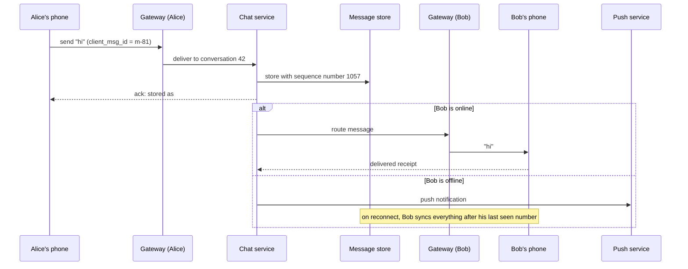
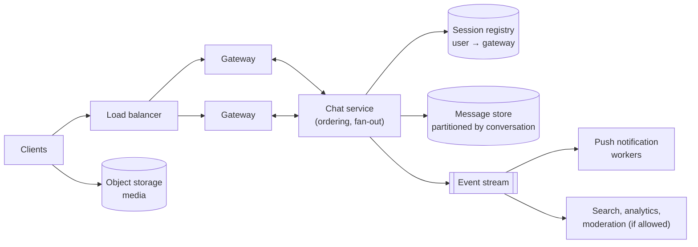

# Designing A Chat System

*Real-time delivery, correct ordering, and never losing a message — for millions of people who are online, offline, and switching devices.*

---

> *“Make it work, then make it beautiful, then if you really, really have to, make it fast.”*
>
> — **Joe Armstrong**, co-creator of Erlang (attributed; widely quoted)

## At a Glance

> **In one sentence:** A chat system keeps long-lived connections to online users through gateway servers, assigns every message an order within its conversation, stores it durably before acknowledging it, fans it out to recipients who are online, and queues it with a push notification for those who aren't.

**You'll learn**

- Requirements that make chat hard: real time, ordering, durability, offline users, many devices
- Long-lived connections: WebSockets and connection gateways
- Message IDs, per-conversation ordering, and idempotent sending
- Storage design for billions of messages
- One-to-one vs. group fan-out, presence, and read receipts
- How end-to-end encryption changes the design

**Before you start:** [How To Design Any System](How-To-Design-Any-System.md) · [HTTP, TCP/IP, and the Protocol Stack](../03-How-The-Internet-Works/HTTP-TCP-IP-and-the-Protocol-Stack.md) · [Consistency vs Availability](../05-Distributed-Systems/Consistency-vs-Availability.md)

**Reading time:** about 15 minutes

---

## The Big Picture



*The message is stored before it is acknowledged, delivered live if the recipient is connected, and synced later if not.*

---

## Introduction

Sending a message looks trivial: one person types, another reads. But consider what users silently expect:

- The message arrives **instantly** when the other person is online.
- It arrives **eventually** when they're offline, on a plane, or their phone is off.
- It arrives **exactly once**, even if the sender's connection dropped mid-send and the app retried.
- Messages appear **in the same order** for everyone in the conversation.
- It shows up on **every device** — phone, laptop, tablet.
- **Nobody** except the participants can read it.
- History is still there **years later**.

Each of these is a distributed-systems problem. Together, at the scale of hundreds of millions of users, they make chat one of the best exercises in system design.

### Why Should Engineers Care?

Real-time features are everywhere: chat, collaborative editing, live dashboards, multiplayer games, notifications, live customer support. The patterns in this chapter — connection gateways, ordering, idempotent sends, fan-out, presence, and sync — apply to all of them.

---

## The Problem It Solves

Traditional web requests are short: the client asks, the server answers, the connection closes. Chat inverts this: the **server** must push data to the client the moment it's available. That requires:

1. **Persistent connections** to every online user — potentially millions at once.
2. **Routing**: knowing which server holds a given user's connection.
3. **Durability and ordering**: storing messages safely and in a consistent order.
4. **Offline handling**: storing and notifying, then syncing on reconnect.

---

## Historical Background

- **1970s–1980s — Early chat.** Unix `talk` and `write`, and university systems like PLATO, let users message each other in real time on shared machines.
- **1988 — IRC.** Internet Relay Chat introduced networked chat rooms (channels) relayed between servers — an early example of fan-out and server-to-server routing.
- **1996–2000s — Instant messengers.** ICQ (1996), AIM (1997), MSN Messenger (1999), and Jabber/XMPP (1999, standardized by the IETF in 2004) introduced buddy lists, presence ("online," "away"), and offline messages.
- **2009 — WhatsApp.** Built on Erlang and designed for mobile phones, it became famous for handling enormous numbers of concurrent connections per server with a very small team.
- **2011 — WebSockets standardized** as RFC 6455, giving browsers a full-duplex, long-lived connection to servers.
- **2013–2016 — End-to-end encryption at scale.** The Signal Protocol (from Open Whisper Systems) brought modern end-to-end encryption to mainstream messengers; WhatsApp completed its rollout to all users in 2016.
- **2010s–present — Team chat and communities.** Slack and Discord brought channels with very large memberships, rich history, and search — making storage and fan-out design central.

---

## Core Concepts

### Connection Models

| Technique | How it works | Trade-off |
|----------|-------------|----------|
| Short polling | Client asks "anything new?" every few seconds | Simple; wasteful and slow |
| Long polling | Server holds the request open until there's data | Works everywhere; one request per message batch |
| Server-Sent Events | One-way stream from server to client over HTTP | Simple push; client→server needs separate requests |
| WebSockets | Full-duplex, long-lived connection | Best for chat; stateful connections to manage |

Mobile apps typically keep a long-lived connection while in the foreground and rely on **push notifications** (APNs for Apple, FCM for Android) when backgrounded.

### Connection Gateways

Holding millions of open connections is a specialized job. **Gateway** (or edge) servers do only that: terminate connections, authenticate them, and forward messages to and from internal services. A **session registry** records which gateway currently holds each user's connections.

### Message Identity and Idempotency

Clients generate a unique `client_msg_id` for every message. If the send times out and the app retries, the server recognizes the ID and doesn't create a duplicate. The server then assigns the authoritative identity and order.

### Ordering

Global ordering across all conversations is unnecessary and expensive. What users need is a consistent order **within each conversation**. Common approaches:

- A **per-conversation sequence number**, assigned by the service that owns that conversation (one owner per conversation at a time).
- **Time-sortable IDs** (like Twitter's Snowflake: timestamp + machine ID + counter), which order well enough for most UIs but can disagree slightly across machines.

Per-conversation sequence numbers also make **sync** simple: "give me everything after #1057."

### Delivery States

```
sending → sent (stored on server) → delivered (reached a device) → read
```

Each transition is a small message itself. In large groups, per-user read receipts can generate more traffic than the messages — many products limit or aggregate them.

### Fan-Out

- **One-to-one:** deliver to one recipient's devices.
- **Small groups:** the server writes one copy of the message and delivers it to each member's connection (**fan-out on read or delivery**).
- **Very large channels:** members fetch recent messages when they open the channel instead of being pushed every message; only notifications are pushed.

### Presence

"Online," "last seen," and "typing…" are **soft state**: frequent, ephemeral, and acceptable to lose. Store it in memory (with TTLs), propagate it only to users who are looking, and never put it in the durable message store.

### End-to-End Encryption (E2EE)

With E2EE, messages are encrypted on the sender's device with keys that only recipients' devices hold. The server routes and stores **ciphertext** it cannot read. This changes the design: server-side search, spam scanning, and content moderation become much harder, and multi-device support requires encrypting for each device (or using device-to-device key sharing).

---

## Real-World Analogy

### A Postal Service With Couriers

The post office (message store) keeps every letter safely, numbered per mailbox. Couriers (gateways) stand at the doors of people who are home, handing letters over the moment they arrive. If you're not home, the letter waits in your numbered mailbox and a note goes under your door (push notification). When you get back, you ask for "everything after letter #1057." Each letter has a unique tracking number, so if the sender mails the same letter twice by mistake, the post office discards the copy.

---

## How It Works In Practice

### Step 1 — Requirements

- **Functional:** one-to-one and group messages (up to, say, 1,000 members), delivery and read receipts, online presence, message history, multiple devices, media attachments.
- **Non-functional:** delivery latency under ~500 ms when both users are online; no message loss once acknowledged; consistent order within a conversation; high availability; history kept indefinitely; privacy.
- **Out of scope for now:** voice/video calls, message search, bots.

### Step 2 — Estimation

```
Daily active users:        50 million
Messages per user per day: 40            → 2 billion messages/day
Average:                                 ≈ 23,000 messages/second
Peak (×4):                               ≈ 90,000 messages/second
Concurrent connections at peak:          ≈ 15 million
Connections per gateway (conservative):  ≈ 100,000 → ~150 gateway servers + headroom
Message size (text + metadata):          ≈ 200 bytes → ~400 GB/day → ~150 TB/year (before replication)
Media: stored separately in object storage; messages hold references.
```

Conclusions: a write-heavy, append-mostly workload; storage partitioned by conversation; a large, horizontally scaled gateway tier.

### Step 3 — API

```
WebSocket  wss://chat.example.com/connect          (authenticated with a token)

client → server   {type: "send", conversation_id, client_msg_id, body}
server → client   {type: "ack", client_msg_id, message_id, seq}
server → client   {type: "message", conversation_id, message_id, seq, sender, body}
client → server   {type: "receipt", conversation_id, up_to_seq, kind: "delivered" | "read"}

REST  GET /conversations/{id}/messages?after_seq=1057&limit=100   (sync and history)
REST  POST /media  → upload URL for attachments
```

### Step 4 — Data Model

```
messages   partition key: conversation_id
           clustering key: seq (descending for "latest first")
           columns: message_id, sender_id, body (or ciphertext), media_ref, created_at

conversations        conversation_id → type, member list, last_seq
user_conversations   user_id → list of (conversation_id, last_read_seq)   (the inbox)
sessions (in memory) user_id → [(device_id, gateway_id)]
```

This fits a wide-column store (Cassandra, ScyllaDB, Bigtable, HBase) very well: "latest 50 messages in conversation X" and "messages after seq N" are single-partition range scans. Very active conversations may need their partitions split by time bucket (`conversation_id + month`) to avoid enormous partitions.

### Step 5 — High-Level Design



### Step 6 — Deep Dives

**Deep dive 1: Sending a message without loss or duplicates.**

1. Client sends with a fresh `client_msg_id` and shows the message as "sending."
2. The chat service checks whether that `client_msg_id` was already stored for this sender; if so, it returns the existing ack.
3. Otherwise it assigns the next `seq` for the conversation, writes the message durably, and only then acknowledges it.
4. If the client doesn't receive the ack, it retries with the **same** ID. Retries are safe.

**Deep dive 2: Routing to online recipients.**

The chat service looks up each recipient's active sessions in the registry and forwards the message to those gateways. Gateways push it down the WebSocket. If a gateway has died, its sessions expire from the registry (heartbeats with TTLs) and clients reconnect to another gateway, then sync.

**Deep dive 3: Offline users and multi-device sync.**

Each device remembers the last `seq` it has for every conversation. On reconnect it asks for everything after that. The server doesn't need to track per-device delivery queues — the ordered, durable log per conversation *is* the queue. Push notifications are best-effort hints to open the app, not the delivery mechanism.

**Deep dive 4: Large groups.**

For a 1,000-member group, writing the message once and pushing to online members is fine. For channels with hundreds of thousands of members, pushing every message to every member is wasteful: deliver notification counts and let clients fetch messages when the channel is opened. Rate-limit senders in huge channels.

### Step 7 — Wrap-Up

- **Bottlenecks:** gateways (memory per connection), hot conversations (one very active group), presence traffic.
- **Failures:** gateway crash → clients reconnect and sync; message-store replica failure → quorum writes continue; push provider slow → notifications delayed, messages still safe.
- **Monitoring:** connected users, send-to-deliver latency, ack latency, reconnect rates, sync sizes, push success rates.

---

## Production Engineering Perspective

- **Deploying gateways drops connections.** Drain gradually: stop accepting new connections, ask clients to reconnect elsewhere in batches, then shut down. Otherwise millions reconnect at once — a self-inflicted **reconnect storm**.
- **Client backoff matters.** Clients must reconnect with exponential backoff and jitter. A server-side incident plus aggressive client retries can keep a system down after the original cause is fixed.
- **Heartbeats** detect dead connections (mobile networks often drop them silently) and keep NAT mappings alive.
- **Abuse and spam** are constant: rate-limit per user and per conversation, detect bulk-messaging patterns, and support reporting.
- **Data retention and deletion** policies — disappearing messages, account deletion, legal holds — must be designed into storage from the start.

---

## Tradeoffs

| Decision | Option A | Option B |
|---------|---------|---------|
| Transport | WebSockets: efficient, stateful | Long polling: works everywhere, more overhead |
| Ordering | Per-conversation sequence: exact, needs one owner per conversation | Time-sortable IDs: no coordination, approximate |
| Group delivery | Push every message to every member | Push notifications, fetch on open (large channels) |
| Storage | Wide-column store: great for partitioned logs | Relational: simpler queries, harder to scale writes |
| Encryption | End-to-end: strongest privacy | Server-readable: enables search, moderation, easier multi-device |
| Receipts | Per-user read receipts | Aggregated or disabled for large groups |

---

## Common Mistakes

### Beginner Mistakes

- Using short polling for real-time chat.
- Acknowledging a message before it's durably stored.
- No client-generated message ID, so retries create duplicates.

### Intermediate Mistakes

- Relying on push notifications as the delivery mechanism (they're best-effort).
- Storing presence and typing indicators in the durable database.
- Unbounded partitions for very active conversations.
- Clients that reconnect instantly without backoff.

### Senior-Level Mistakes

- Designing for global ordering that nobody needs, adding coordination everywhere.
- Adding end-to-end encryption late — it affects search, moderation, backups, and multi-device design.
- Forgetting that read receipts and presence in large groups can dwarf message traffic.

---

## Failure Scenarios

### Scenario 1: The Reconnect Storm

A gateway deploy restarts all gateways at once. Millions of clients reconnect in the same second, overwhelming authentication and sync services. The incident lasts much longer than the deploy.

**Mitigation:** rolling, drained deploys; client exponential backoff with jitter; admission control on reconnects; lightweight session resumption.

### Scenario 2: Duplicate Messages After a Flaky Network

On a train, a phone sends a message; the ack is lost; the app retries three times. Without idempotent sends, the recipient sees the message four times.

**Mitigation:** client-generated IDs and server-side deduplication.

### Scenario 3: The Hot Conversation

A celebrity joins a large group chat and message rates spike in one conversation. Its partition and its owning service instance become a hot spot.

**Mitigation:** time-bucketed partitions, per-conversation rate limits, and switching very large conversations to fetch-on-open delivery.

### Scenario 4: Push Provider Outage

The push provider degrades. Offline users don't get notifications, but no messages are lost — they sync when users open the app.

**Lesson:** keep the durable log as the source of truth; treat notifications as hints.

---

## Real-World Industry Examples

- **WhatsApp** has described running on Erlang and FreeBSD and, in a 2012 engineering blog post, reported more than 2 million concurrent connections on a single server.
- **Discord** has published detailed accounts of storing trillions of messages — first on Cassandra, then migrating to ScyllaDB in 2023 — with messages partitioned by channel and time bucket.
- **Signal** publishes its protocol specifications; the Signal Protocol's double-ratchet design is used by several major messengers for end-to-end encryption.
- **Slack** has written about its real-time messaging infrastructure, including channel servers and gateway servers that hold WebSocket connections.

---

## Interview Questions

### Beginner

**Q1: Why use WebSockets instead of regular HTTP requests for chat?**

*Model answer:* Chat needs the server to push messages the moment they arrive. WebSockets keep one full-duplex connection open, so the server can send immediately with low overhead. Regular requests would require polling, which is slow and wasteful.

### Intermediate

**Q2: How do you guarantee a message isn't duplicated when the client retries?**

*Model answer:* The client generates a unique message ID before sending and reuses it on every retry. The server stores messages keyed by that ID (per sender) and, on a retry, returns the original acknowledgment instead of storing a new copy.

**Q3: How does an offline user get their messages?**

*Model answer:* Messages are stored durably in a per-conversation ordered log. A push notification prompts the user; when the app reconnects, each device asks for messages after the last sequence number it has seen. The log, not the notification, guarantees delivery.

### Senior

**Q4: How would you order messages in a group chat with users worldwide?**

*Model answer:* Order within each conversation, not globally. Assign one owner per conversation (for example, by consistent hashing of the conversation ID to a chat-service instance, with failover) that hands out increasing sequence numbers as it stores each message. Clients render by sequence number. Cross-conversation order doesn't matter to users, so we avoid global coordination.

### Architecture / Leadership

**Q5: What changes if the product requires end-to-end encryption?**

*Model answer:* The server can no longer read messages, so server-side search, spam detection based on content, and moderation need new approaches (client-side search, metadata-based abuse signals, user reporting). Multi-device requires per-device keys and encrypting for each device. Backups need client-side encryption. Key verification UX matters. It's much easier to design this in from the start than to retrofit it.

---

## Hands-On Lab

Build a tiny chat server with per-room sequence numbers, idempotent sends, and sync-after-reconnect. Standard-library Python only; save as `chat_lab.py` and run it.

```python
import asyncio, json

class ChatServer:
    def __init__(self):
        self.log = {}          # room -> list of messages (the durable, ordered log)
        self.seen = set()      # (sender, client_msg_id) already stored
        self.online = {}       # user -> asyncio.Queue (their live connection)

    def send(self, room, sender, client_msg_id, body):
        key = (sender, client_msg_id)
        messages = self.log.setdefault(room, [])
        if key in self.seen:                                   # retry: don't duplicate
            return next(m for m in messages if (m["sender"], m["cid"]) == key)["seq"]
        self.seen.add(key)
        msg = {"seq": len(messages) + 1, "sender": sender, "cid": client_msg_id, "body": body}
        messages.append(msg)                                   # store BEFORE acking
        for user, queue in self.online.items():               # fan out to online users
            if user != sender:
                queue.put_nowait(msg)
        return msg["seq"]

    def sync(self, room, after_seq):
        return [m for m in self.log.get(room, []) if m["seq"] > after_seq]

async def main():
    server = ChatServer()
    server.online["bob"] = asyncio.Queue()                     # Bob is connected

    print("ack", server.send("room1", "alice", "m-1", "hi Bob"))
    print("ack", server.send("room1", "alice", "m-1", "hi Bob"))   # retry after lost ack
    print("ack", server.send("room1", "alice", "m-2", "are you there?"))
    print("Bob live-received:", [(await server.online["bob"].get())["body"] for _ in range(2)])

    del server.online["bob"]                                   # Bob goes offline
    server.send("room1", "alice", "m-3", "call me later")
    server.send("room1", "carol", "c-1", "me too")
    last_seen = 2                                              # Bob's phone remembers seq 2
    print("Bob syncs after reconnect:", [(m["seq"], m["body"]) for m in server.sync("room1", last_seen)])

asyncio.run(main())
```

**What to notice**
- The retried send returns the same sequence number: no duplicate appears.
- Bob receives messages live while connected, and gets exactly the ones he missed by asking for "everything after #2" — no per-device queue needed.
- Extend it: add a second room, a `read_up_to` pointer per user, and an unread-count function. Then think about what happens if two servers both try to assign `seq` for the same room.

---

## Test Yourself

*Answer each question in your head or on paper first, then open the answer to check.*

<details markdown="1">
<summary><strong>1. Why do chat systems use separate gateway servers?</strong></summary>

Holding millions of long-lived connections is a specialized job with different resource needs (memory per connection, connection churn) from message processing. Separating them lets each tier scale and be deployed independently.

</details>

<details markdown="1">
<summary><strong>2. Why is ordering done per conversation rather than globally?</strong></summary>

Users only need a consistent order within the conversation they're reading. Global ordering would require coordination across the whole system for no user-visible benefit.

</details>

<details markdown="1">
<summary><strong>3. When should the server acknowledge a message?</strong></summary>

Only after it has been durably stored. Acknowledging earlier risks losing a message the sender believes was sent.

</details>

<details markdown="1">
<summary><strong>4. Why aren't push notifications the delivery mechanism?</strong></summary>

They're best-effort and can be delayed, dropped, or disabled. The durable per-conversation log plus sync on reconnect guarantees delivery; notifications only prompt the user.

</details>

<details markdown="1">
<summary><strong>5. Where should presence ("online", "typing…") be stored?</strong></summary>

In memory with short TTLs. It's frequent, ephemeral, and fine to lose — putting it in the durable message store wastes capacity.

</details>

<details markdown="1">
<summary><strong>6. What is a reconnect storm, and how do you prevent one?</strong></summary>

Many clients reconnecting at the same moment (after a deploy or outage) and overloading the system. Prevent it with drained rolling deploys and client reconnect backoff with jitter.

</details>

<details markdown="1">
<summary><strong>7. Name two things end-to-end encryption makes harder for the server.</strong></summary>

Any two of: server-side search, content-based spam detection and moderation, server-side backups of readable history, simple multi-device sync.

</details>

---

## Cheat Sheet

| Component | Job |
|----------|----|
| Gateway | Hold WebSocket connections; authenticate; forward |
| Session registry | user → gateways/devices (in memory, TTL + heartbeat) |
| Chat service | Deduplicate, assign per-conversation `seq`, store, fan out |
| Message store | Partitioned by conversation (+ time bucket), clustered by `seq` |
| Push workers | Notify offline users (best-effort) |
| Object storage | Photos, videos, files; messages hold references |

**Send path:** client ID → dedupe → assign seq → store → ack → fan out → receipts.

**Sync:** each device keeps `last_seq` per conversation → "give me everything after N."

**Scale numbers to remember:** connections per gateway (tens of thousands to millions, depending on the stack) · messages/s = users × messages per day ÷ 86,400 · storage = messages × size × replication.

**Always:** idempotent sends · heartbeats · reconnect backoff with jitter · rate limits · presence in memory · drained deploys.

---

## In the AI Era

- **AI features inside chat** — summaries of long threads, smart replies, translation, bots — add a new kind of participant. Treat an AI bot like any other client: it reads through the same APIs, respects the same permissions, and its messages are stored and ordered the same way.
- **Streaming AI replies** reuse the chat infrastructure: tokens stream to the client over the existing WebSocket, and the final message is stored once complete.
- **End-to-end encryption and AI are in tension.** A server that can't read messages can't summarize them. Options include on-device models or explicit, per-conversation user consent — a product and privacy decision, not only a technical one.
- **Messages are untrusted input.** Any AI feature that reads chat history can be targeted by prompt injection written into a message. See [Securing AI Systems](../15-AI-Era-Engineering/Securing-AI-Systems.md).

**Try it:** Extend the lab so a "bot" user subscribes to a room and replies to messages that start with `/summary` by returning the last three messages. Where would you enforce which rooms the bot may read?

---

## Key Takeaways

1. Chat needs persistent connections, routing to the right gateway, durable ordered storage, and offline sync.
2. Clients generate message IDs so retries are idempotent; servers store before acknowledging.
3. Order within each conversation using sequence numbers — global order is unnecessary.
4. The per-conversation log is the delivery guarantee; push notifications are only hints.
5. Partition message storage by conversation (and time bucket) to serve history and sync as range scans.
6. Presence and typing indicators are soft state — keep them in memory.
7. Plan for reconnect storms, hot conversations, and large-group fan-out from the start.
8. End-to-end encryption reshapes search, moderation, backup, and multi-device design.

---

## What to Read Next

- **[Designing A Payment System](Designing-A-Payment-System.md)** — correctness when every message is money
- **[Consistency vs Availability](../05-Distributed-Systems/Consistency-vs-Availability.md)** — the guarantees behind ordering and sync
- **[How Load Balancing Works](../08-Scalability/How-Load-Balancing-Works.md)** — balancing long-lived connections

---

## Further Reading

- **RFC 6455 — The WebSocket Protocol (2011):** [https://datatracker.ietf.org/doc/html/rfc6455](https://datatracker.ietf.org/doc/html/rfc6455)
- **The Signal Protocol documentation:** [https://signal.org/docs/](https://signal.org/docs/)
- **Discord Engineering — "How Discord Stores Trillions of Messages" (2023):** [https://discord.com/blog/how-discord-stores-trillions-of-messages](https://discord.com/blog/how-discord-stores-trillions-of-messages)
- **WhatsApp Engineering — "1 million is so 2011" (2012):** [https://blog.whatsapp.com/](https://blog.whatsapp.com/)
- **XMPP standards (RFC 6120, 6121):** [https://xmpp.org/rfcs/](https://xmpp.org/rfcs/)
- **"Designing Data-Intensive Applications"** — Martin Kleppmann, chapters on partitioning and stream processing

---

*This chapter is part of the Modern Software Engineering Handbook — a comprehensive guide to the concepts, principles, and practices that every professional software engineer should know.*
