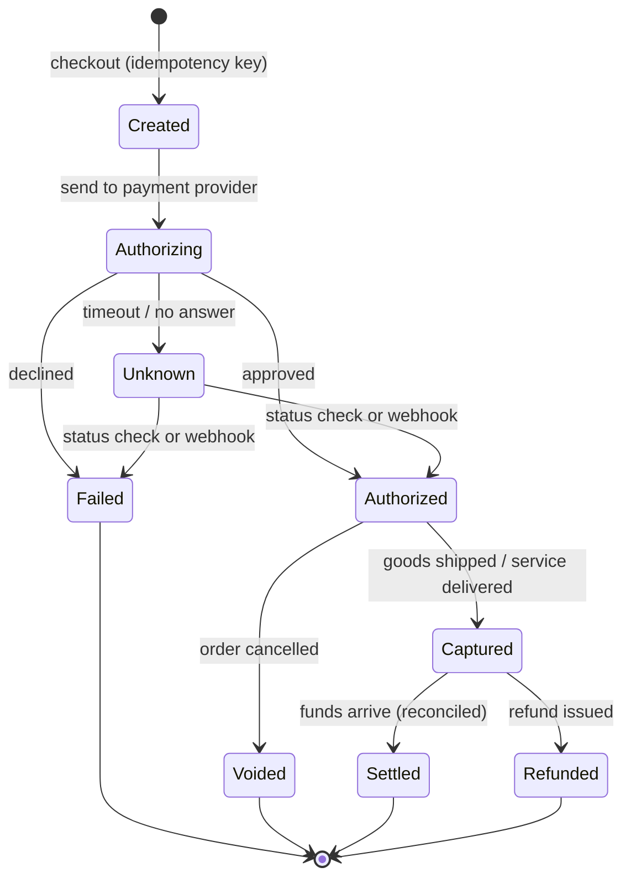
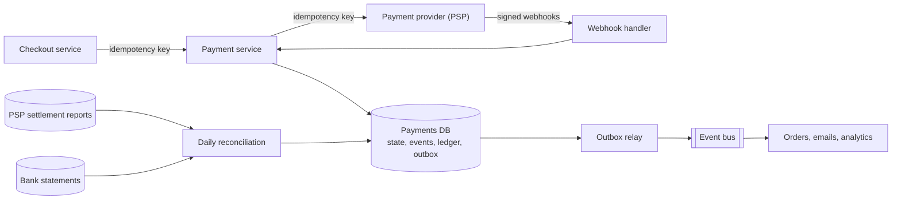

# Designing A Payment System

*When every bug is somebody's money, correctness beats speed, and "probably" is not good enough.*

---

> *“Idempotence Is Not a Medical Condition.”*
>
> — **Pat Helland**, article title, *ACM Queue*, 2012

## At a Glance

> **In one sentence:** A payment system moves money through external providers that can time out, retry, and disagree with you — so it is built around idempotency keys, an explicit state machine, an append-only double-entry ledger, asynchronous confirmation, and daily reconciliation that proves every cent is accounted for.

**You'll learn**

- How a card or bank payment actually flows: authorize, capture, settle, refund
- Why idempotency is the single most important property of payment APIs
- Payment state machines and handling unknown outcomes
- Double-entry ledgers and why balances are derived, not stored
- Webhooks, the outbox pattern, and reconciliation
- Security and compliance basics: tokenization and PCI DSS

**Before you start:** [How To Design Any System](How-To-Design-Any-System.md) · [How Databases Work](../04-Data-And-Storage/How-Databases-Work.md) · [Why Distributed Systems Are Hard](../05-Distributed-Systems/Why-Distributed-Systems-Are-Hard.md)

**Reading time:** about 15 minutes

---

## The Big Picture



*A payment is a state machine. The dangerous state is "Unknown" — the design exists to resolve it safely, never by guessing.*

---

## Introduction

A customer clicks "Pay" on a slow mobile connection. Nothing happens for ten seconds, so they click again. Meanwhile, the first request reached your server, which called the card provider, which charged the card — but the response was lost on the way back. Your server logged a timeout. The second click starts a brand-new payment.

What should happen? The customer must be charged **exactly once**. Your system must end up **agreeing with the provider** about what happened. And a year later, an auditor must be able to see **every step**. Most of payment engineering is about this one scenario and its many variations.

### Why Should Engineers Care?

- Payment bugs cost real money and real trust — often with legal and regulatory consequences.
- The same patterns (idempotency, state machines, ledgers, reconciliation) apply to anything valuable: inventory, credits, loyalty points, bookings, and any system that calls an external API with side effects.
- Payments are a favorite interview topic precisely because they punish vague thinking about failure.

---

## The Problem It Solves

Moving money involves systems you don't control: payment service providers (PSPs), card networks, banks, and real-time payment systems. Every call can:

- **succeed** and tell you,
- **fail** and tell you,
- **succeed without telling you** (lost response),
- **be delayed** and complete hours later,
- **be reversed** later (refunds, chargebacks).

A payment system must turn this uncertainty into a record that is always **correct, complete, and auditable**.

---

## Historical Background

- **1494 — Double-entry bookkeeping.** Luca Pacioli described the double-entry method used by Venetian merchants: every transaction is recorded as equal debits and credits, so the books always balance. Modern payment ledgers still use this 500-year-old idea.
- **1950 — Diners Club** introduced a general-purpose charge card.
- **1958–1966 — Bank card networks.** BankAmericard (later Visa) and the network that became Mastercard created the four-party model: cardholder, issuing bank, merchant, and acquiring bank.
- **1994 — The first secure online purchases** used encrypted web connections, opening e-commerce.
- **1998–2011 — Online payment providers.** PayPal and later developer-focused providers such as Stripe made accepting payments an API call, popularizing idempotency keys in public APIs.
- **2004 — PCI DSS.** The major card brands created the Payment Card Industry Data Security Standard for anyone storing, processing, or transmitting card data.
- **2016 — UPI.** India's National Payments Corporation launched the Unified Payments Interface, enabling instant bank-to-bank payments at huge scale — a sign that real-time payments are becoming the norm worldwide.

---

## Core Concepts

### The Players

| Party | Role |
|------|-----|
| Customer | Pays with a card, bank account, or wallet |
| Merchant (you) | Sells something and requests payment |
| Payment service provider (PSP) | API you call; talks to networks and banks |
| Acquirer | Merchant's bank that receives funds |
| Card network | Routes authorization and settlement (Visa, Mastercard, etc.) |
| Issuer | Customer's bank that approves and funds the payment |

### Authorize, Capture, Settle

- **Authorize:** the issuer approves and places a hold on the funds.
- **Capture:** the merchant requests the held money (often when goods ship).
- **Settle:** funds actually move between banks, usually in batches, days later.
- **Refund / void:** return funds after capture, or release a hold before capture.
- **Chargeback:** the customer disputes a payment through their bank.

### Idempotency Keys

The client generates a unique key for each *intended* payment and sends it with every attempt. The server stores the key with the result. A retry with the same key returns the stored result — it never charges again. Your service should require keys from its clients **and** send keys to its PSP.

### State Machines

Represent each payment as an explicit state with allowed transitions (see the Big Picture). Transitions are recorded as events, never silently overwritten. Invalid transitions (capturing a failed payment, refunding twice) are rejected by code.

### Unknown Outcomes

When a PSP call times out, the payment is **unknown**, not failed. Never mark it failed and never simply retry a new charge. Instead:

1. Retry the *same* request with the *same* idempotency key, or
2. Query the PSP for the payment's status, and
3. Wait for the PSP's **webhook** (an asynchronous notification of the final result).

### Money Representation

- Store amounts as **integers in minor units** (e.g., 1999 cents), never floating-point numbers.
- Always store the **currency** with the amount.
- Be explicit about rounding rules, especially for fees, taxes, and currency conversion.

### Double-Entry Ledger

Every movement of money is a **transaction** made of **entries** that sum to zero: money leaves one account and enters another.

```
Transaction: customer pays order #881 (₹500.00)
  debit   customer_receivable        +50000
  credit  merchant_revenue           -50000
                                     ------
                                          0   ← must always balance
```

Balances are **derived** by summing entries — never stored as a mutable number that code updates in place. The ledger is **append-only**: mistakes are corrected with new, reversing entries, preserving history.

### Reconciliation

At least daily, compare your records with the PSP's settlement reports and your bank statements, line by line. Differences — a payment you think succeeded but the PSP says failed, fees you didn't expect, missing refunds — are flagged for investigation. Reconciliation is how you *prove* correctness instead of assuming it.

---

## Real-World Analogy

### A Careful Shopkeeper With a Receipt Book

A careful shopkeeper writes every sale in a numbered receipt book, in ink, with a copy. If a customer returns an item, they don't erase the original line; they write a new "refund" line. If a customer says, "I think I paid yesterday," the shopkeeper looks up the receipt number instead of charging again. At the end of the day, they count the cash drawer and compare it with the receipt book. If the numbers don't match, they don't go home until they know why.

That shopkeeper is running idempotency, an append-only ledger, and reconciliation.

---

## How It Works In Practice

### Step 1 — Requirements

- **Functional:** create a payment for an order; support cards and bank transfers via a PSP; capture, refund, void; show payment status; handle webhooks; produce reports.
- **Non-functional:** never double-charge; never lose a payment record; strong consistency for payment state and ledger; full audit trail; PCI DSS scope minimized; latency of a few seconds is acceptable; high availability for checkout.

### Step 2 — Estimation

```
Orders per day:           2 million      → ~23 payments/second average, ~200/second peak
Ledger entries:           ~4 per payment lifecycle → ~8 million rows/day → ~3 billion/year
Webhooks:                 ~2–3 per payment
Storage:                  modest (hundreds of GB/year); retention often 7–10 years for audit
```

Conclusion: payment systems are usually **not** throughput-bound. They're **correctness-bound**. A relational database with strong transactions is a natural fit.

### Step 3 — API

```
POST /payments
  Headers: Idempotency-Key: 5f1c...e2
  Body:    { order_id, amount_minor: 50000, currency: "INR", method_token }
  → 201 { payment_id, status: "authorized" | "failed" | "pending" }

POST /payments/{id}/capture      (Idempotency-Key required)
POST /payments/{id}/refunds      (Idempotency-Key required) { amount_minor }
GET  /payments/{id}
POST /webhooks/psp               (signed by the PSP; verify the signature)
```

### Step 4 — Data Model

```
payments          payment_id, order_id, amount_minor, currency, status, psp_reference,
                  idempotency_key (unique), created_at, updated_at
payment_events    payment_id, from_status, to_status, reason, raw_psp_response, at
ledger_txns       txn_id, payment_id, description, at
ledger_entries    txn_id, account, amount_minor (signed), currency
                  -- invariant: SUM(amount_minor) per txn_id = 0
outbox            event_id, payload, published_at (null until published)
```

### Step 5 — High-Level Design



### Step 6 — Deep Dives

**Deep dive 1: Exactly-once charging.** There is no true "exactly once" over a network — there is "at least once, made safe by idempotency."

1. Checkout sends `POST /payments` with an idempotency key.
2. The payment service inserts a row with that key under a **unique constraint**. If the insert fails because the key exists, it returns the stored result (or "in progress").
3. It calls the PSP, passing its own idempotency key for that attempt.
4. On success or decline, it records the new state, the event, and the ledger entries **in one database transaction**.
5. On timeout, it records `unknown` and schedules a status check. The webhook or status check later resolves it.

**Deep dive 2: Publishing events without losing them (the outbox pattern).** After a payment succeeds, other services need to know (ship the order, send a receipt). Writing to the database and then publishing to a message bus can fail halfway. Instead, write the event into an `outbox` table **in the same transaction** as the payment update. A separate relay reads unpublished outbox rows and publishes them, marking each as sent. Consumers must be idempotent, because the relay may publish twice.

**Deep dive 3: Webhooks.** PSP webhooks can arrive late, twice, or out of order. The handler must:

- verify the signature (reject forgeries),
- deduplicate by event ID,
- apply only **valid state transitions** (ignore a "succeeded" event for a payment already refunded, but log it),
- respond quickly and do heavy work asynchronously.

**Deep dive 4: Reconciliation.** A daily job loads PSP settlement files and compares them with internal records by PSP reference:

| Internal | PSP | Action |
|---------|----|-------|
| Captured ₹500 | Settled ₹500 − fee ₹10 | ✔ record fee entry |
| Captured ₹500 | Not found | ⚠ investigate (maybe still pending) |
| Not found | Settled ₹500 | ⚠ investigate (lost response? bug?) |
| Refunded ₹200 | Refunded ₹250 | ⚠ amount mismatch |

Unresolved differences go to a finance operations queue. The goal is not zero differences on day one; it's that **every** difference is explained.

### Step 7 — Wrap-Up

- **Consistency:** payment state and ledger in one relational database with serializable or carefully designed transactions; other services consume events asynchronously.
- **Availability:** if the PSP is down, fail fast and let the user retry — never "assume success"; consider a secondary PSP for resilience.
- **Security:** never store raw card numbers; use PSP tokenization; keep payment services in a separate, audited environment.
- **Monitoring:** authorization rate by provider and method, count of payments in `unknown`, webhook lag, reconciliation differences, ledger imbalance (must be zero).

---

## Production Engineering Perspective

- **Minimize PCI scope.** Use the PSP's hosted payment fields or SDK so raw card data goes directly to the PSP and never touches your servers. Your systems handle only tokens.
- **Everything is audited.** Who issued this refund? When? Why? Store actor, reason, and timestamps for every manual action.
- **Deploy carefully.** Payment changes go behind feature flags, with small rollouts and dashboards watching authorization rates.
- **Test with the PSP's sandbox** and simulate timeouts, duplicate webhooks, and out-of-order events — not just the happy path.
- **Data retention and privacy:** financial records are often retained for years by law, while personal data may need minimizing. Separate the two where possible.

---

## Tradeoffs

| Decision | Option A | Option B |
|---------|---------|---------|
| Database | Relational with ACID transactions: correctness | Distributed NoSQL: scale you likely don't need |
| Confirmation | Synchronous response to user | Pending + asynchronous webhook (more robust) |
| Providers | One PSP: simpler | Multiple PSPs: resilience, better rates, more complexity |
| Ledger | Append-only double-entry: auditable | Mutable balance column: simple, dangerous |
| Consistency with other services | Outbox + events: reliable, eventual | Distributed transactions: fragile, slow |
| Retries | Automatic with same key: safe | New attempt without key: double charges |

---

## Common Mistakes

### Beginner Mistakes

- Using floating-point numbers for money.
- Treating a timeout as a failure and letting the user pay again.
- Storing raw card numbers in your database or logs.

### Intermediate Mistakes

- Idempotency implemented in application memory instead of a unique database constraint.
- Updating a `balance` column in place instead of appending ledger entries.
- Processing webhooks without signature verification or deduplication.
- Publishing events outside the database transaction ("dual write").

### Senior-Level Mistakes

- No reconciliation, so silent discrepancies accumulate for months.
- Coupling checkout availability to non-essential services (fraud scoring, analytics) without fallbacks.
- Ignoring currency, rounding, and fee rules until finance finds the problem.

---

## Failure Scenarios

### Scenario 1: The Double Charge

A timeout leads the client to retry with a new request and no idempotency key. The customer is charged twice; support refunds manually; the ledger now needs correcting entries.

**Prevention:** mandatory idempotency keys end to end, unique constraints, "unknown" state instead of "failed."

### Scenario 2: The Webhook Arrives First

The PSP's success webhook arrives before your own synchronous call has recorded the payment. A naive handler can't find the payment and discards the event. The payment stays "unknown" forever.

**Prevention:** store unmatched webhooks and retry matching; resolve unknown payments with periodic status checks.

### Scenario 3: The Lost Event

A payment succeeds and is committed, but the service crashes before publishing "payment succeeded." The order never ships.

**Prevention:** the transactional outbox pattern.

### Scenario 4: The Silent Fee Change

The PSP changes a fee structure. Internal reports still assume the old fees. Revenue is overstated for two months until reconciliation is added.

**Prevention:** daily reconciliation against settlement reports, with alerts on unexplained differences.

---

## Real-World Industry Examples

- **Stripe** documents idempotency keys as a core part of its public API and has written about designing robust, idempotent APIs.
- **Uber** has written about LedgerStore, its storage system for immutable financial ledger records, as part of a payments platform spanning many countries and payment methods.
- **UPI** (India) processes billions of real-time bank-to-bank transactions per month, with a central switch (NPCI) coordinating between banks and payment apps.
- **Modern ledger databases** such as TigerBeetle are built specifically around double-entry accounting and strict invariants, showing how central the ledger is to financial systems.

---

## Interview Questions

### Beginner

**Q1: Why store money as integers?**

*Model answer:* Floating-point numbers can't represent most decimal fractions exactly, so sums and comparisons drift (0.1 + 0.2 ≠ 0.3). Storing integers in minor units (cents, paise) makes arithmetic exact. The currency must be stored alongside the amount.

### Intermediate

**Q2: How do you prevent double charges?**

*Model answer:* Require an idempotency key on every payment request, store it under a unique constraint with the request and its result, and return the stored result on retries. Pass idempotency keys to the PSP as well. Treat timeouts as "unknown" and resolve them via status checks and webhooks rather than creating new charges.

**Q3: What is the transactional outbox pattern?**

*Model answer:* Writing an event to an outbox table in the same database transaction as the business change, then having a separate process publish outbox rows to the message bus. It ensures events are never lost and never published for changes that didn't commit. Consumers must handle duplicates.

### Senior

**Q4: Why use a double-entry ledger instead of a balance column?**

*Model answer:* A ledger records every movement as balanced debits and credits in an append-only log, so balances are derivable, history is preserved, corrections are explicit reversing entries, and invariants (every transaction sums to zero) can be checked automatically. A mutable balance column loses history, hides bugs, and is prone to race conditions.

### Architecture / Leadership

**Q5: How would you make checkout resilient to a PSP outage?**

*Model answer:* Detect PSP failures quickly (timeouts, circuit breakers), show users a clear retry message rather than a silent failure, and optionally route new payments to a secondary PSP with its own tokenization and reconciliation. Never mark uncertain payments as succeeded. Monitor authorization rate per provider so degradations are caught within minutes, and practice failover before it's needed.

---

## Hands-On Lab

A tiny payment service with idempotency, a double-entry ledger, and reconciliation — in SQLite (built into Python). Save as `payments_lab.py` and run it.

```python
import sqlite3, random
random.seed(4)

db = sqlite3.connect(":memory:")
db.executescript("""
CREATE TABLE payments (id INTEGER PRIMARY KEY, idem_key TEXT UNIQUE, order_id TEXT,
                       amount INTEGER, status TEXT);
CREATE TABLE entries  (txn TEXT, account TEXT, amount INTEGER);
""")

class Timeout(Exception): pass

def psp_charge(amount, idem_key, psp_state={}):
    """Fake provider: charges once per key, but loses 40% of responses."""
    psp_state.setdefault(idem_key, amount)
    if random.random() < 0.4:
        raise Timeout()
    return "succeeded"

def pay(order_id, amount, idem_key):
    try:
        with db:
            db.execute("INSERT INTO payments (idem_key, order_id, amount, status) "
                       "VALUES (?, ?, ?, 'unknown')", (idem_key, order_id, amount))
    except sqlite3.IntegrityError:
        pass                                       # retry of an existing payment
    status = db.execute("SELECT status FROM payments WHERE idem_key = ?", (idem_key,)).fetchone()[0]
    if status == "succeeded":
        return status
    try:
        result = psp_charge(amount, idem_key)      # same key on every attempt
    except Timeout:
        return "unknown"                           # NOT failed, NOT charged again
    with db:                                       # state + ledger in ONE transaction
        db.execute("UPDATE payments SET status = ? WHERE idem_key = ?", (result, idem_key))
        db.execute("INSERT INTO entries VALUES (?, 'customer', ?)", (idem_key, amount))
        db.execute("INSERT INTO entries VALUES (?, 'revenue', ?)", (idem_key, -amount))
    return result

for n in range(1, 6):                              # 5 orders, client retries until done
    key = f"order-{n}-attempt"
    while (status := pay(f"order-{n}", 50000, key)) != "succeeded":
        print(f"order-{n}: {status}, retrying with the same key")

charged_by_psp = sum(psp_charge.__defaults__[0].values())
ledger_total = db.execute("SELECT SUM(amount) FROM entries WHERE account = 'customer'").fetchone()[0]
imbalance = db.execute("SELECT SUM(amount) FROM entries").fetchone()[0]
print(f"\nPSP says it charged: {charged_by_psp}   ledger says: {ledger_total}   imbalance: {imbalance}")
print("reconciled!" if charged_by_psp == ledger_total and imbalance == 0 else "MISMATCH - investigate")
```

**What to notice**
- Many responses are "lost," yet each customer is charged exactly once, because every retry reuses the idempotency key and the PSP deduplicates.
- The ledger always sums to zero, and reconciliation compares *your* records with *the provider's*.
- Break it on purpose: in the `while` line, replace `key` with `f"order-{n}-{random.random()}"` so every retry sends a *new* key. Reconciliation now fails — the provider charged customers more than once, and your ledger doesn't know.

---

## Test Yourself

*Answer each question in your head or on paper first, then open the answer to check.*

<details markdown="1">
<summary><strong>1. What is the difference between authorization and capture?</strong></summary>

Authorization asks the customer's bank to approve and hold the funds. Capture actually requests the held money, often later (for example, when goods ship).

</details>

<details markdown="1">
<summary><strong>2. A PSP call times out. What state should the payment be in?</strong></summary>

"Unknown" (or pending) — not failed. Resolve it by retrying with the same idempotency key, querying the PSP's status, or waiting for its webhook.

</details>

<details markdown="1">
<summary><strong>3. Why must idempotency be enforced with a database unique constraint?</strong></summary>

Concurrent retries may reach different servers at the same moment. Only a unique constraint in shared, durable storage guarantees that just one of them creates the payment.

</details>

<details markdown="1">
<summary><strong>4. What invariant does a double-entry ledger enforce?</strong></summary>

The entries of every transaction sum to zero — money is never created or destroyed, only moved between accounts.

</details>

<details markdown="1">
<summary><strong>5. How do you correct a wrong ledger entry?</strong></summary>

Add new reversing (and, if needed, correcting) entries. Never edit or delete existing entries; the ledger is append-only for auditability.

</details>

<details markdown="1">
<summary><strong>6. What three checks should a webhook handler perform?</strong></summary>

Verify the signature, deduplicate by event ID, and apply only valid state transitions (handling out-of-order events).

</details>

<details markdown="1">
<summary><strong>7. What does reconciliation compare?</strong></summary>

Your internal payment and ledger records against the PSP's settlement reports and bank statements, flagging every difference for investigation.

</details>

---

## Cheat Sheet

**Golden rules:** idempotency keys everywhere · integers for money, always with currency · timeouts mean *unknown* · state machine with valid transitions only · append-only double-entry ledger · outbox for events · verify and dedupe webhooks · reconcile daily · never store raw card data.

| Term | Meaning |
|-----|--------|
| Authorize | Approve and hold funds |
| Capture | Take the held funds |
| Settle | Funds actually move between banks |
| Void | Cancel an authorization before capture |
| Refund | Return captured funds |
| Chargeback | Customer disputes via their bank |
| Tokenization | Replace card data with a token held by the PSP |
| PCI DSS | Security standard for handling card data |
| Reconciliation | Proving your records match the provider's and bank's |

**Payment flow:** create (key) → authorize → capture → settle → (refund / chargeback).

---

## In the AI Era

- **AI agents that spend money** (booking travel, buying supplies, paying invoices) must go through the same guarantees: idempotency keys, spending limits, and human approval above thresholds. An agent retrying a "buy" tool after a timeout is exactly the double-charge scenario in this chapter.
- **Fraud detection** increasingly uses machine learning. Keep it advisory with clear fallbacks: if the fraud model is slow or down, checkout must follow a defined policy (allow small amounts, hold large ones), not hang.
- **Reconciliation is a good fit for AI assistance** — explaining mismatches, matching messy bank descriptions to payments — as long as a human approves any ledger correction.
- **AI-generated payment code needs extra review.** Check for floats, missing idempotency, and retries without keys.

**Try it:** Write the tool definition for an AI agent's `pay_invoice` tool. Include which parameters the model may set, which are fixed by your code (idempotency key, payer account), and the amount above which a human must approve.

---

## Key Takeaways

1. Payment systems are correctness-bound, not throughput-bound — choose strong consistency.
2. Idempotency keys, enforced by unique constraints, turn "at least once" into "exactly once" in effect.
3. A timeout is an unknown outcome; resolve it with the provider, never by guessing.
4. Model payments as explicit state machines with valid transitions.
5. Use an append-only double-entry ledger; derive balances; correct with reversing entries.
6. Use the transactional outbox to publish events reliably, and make consumers idempotent.
7. Reconcile daily against provider and bank records — that's how you know you're right.
8. Minimize PCI scope with tokenization; never store raw card data.

---

## What to Read Next

- **[Designing A Search System](Designing-A-Search-System.md)** — a very different design driven by ranking and scale
- **[Backup, Recovery, and Durability](../04-Data-And-Storage/Backup-Recovery-and-Durability.md)** — protecting records you can never lose
- **[Consistency vs Availability](../05-Distributed-Systems/Consistency-vs-Availability.md)** — why payments choose consistency

---

## Further Reading

- **Pat Helland — "Idempotence Is Not a Medical Condition" (ACM Queue, 2012):** [https://queue.acm.org/detail.cfm?id=2187821](https://queue.acm.org/detail.cfm?id=2187821)
- **Stripe — Idempotent requests (API documentation):** [https://docs.stripe.com/api/idempotent_requests](https://docs.stripe.com/api/idempotent_requests)
- **Chris Richardson — Transactional outbox pattern:** [https://microservices.io/patterns/data/transactional-outbox.html](https://microservices.io/patterns/data/transactional-outbox.html)
- **PCI Security Standards Council:** [https://www.pcisecuritystandards.org](https://www.pcisecuritystandards.org)
- **NPCI — Unified Payments Interface:** [https://www.npci.org.in](https://www.npci.org.in)
- **Martin Kleppmann — "Designing Data-Intensive Applications,"** chapters on transactions and stream processing

---

*This chapter is part of the Modern Software Engineering Handbook — a comprehensive guide to the concepts, principles, and practices that every professional software engineer should know.*
