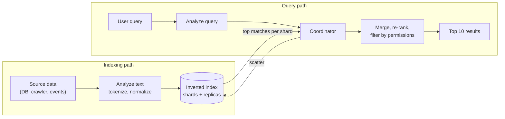
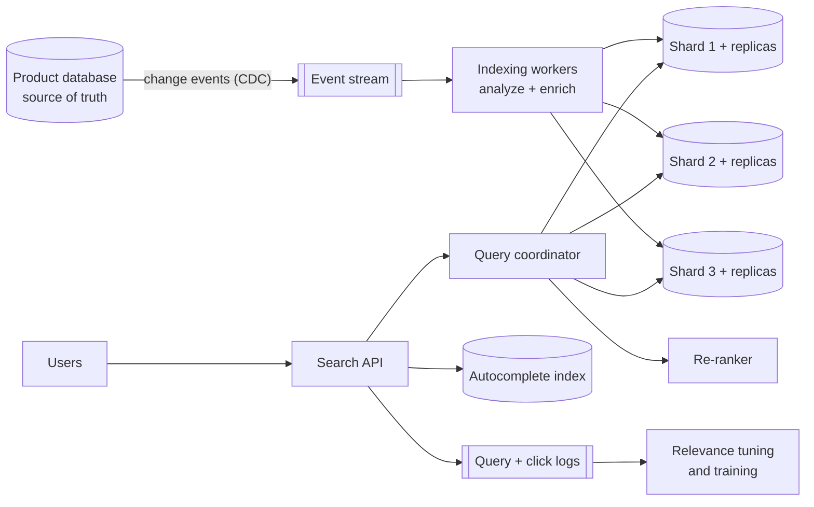

# Designing A Search System

*Finding the best ten results out of billions of documents in a fraction of a second — and keeping them fresh.*

---

> *“In this paper, we present Google, a prototype of a large-scale search engine which makes heavy use of the structure present in hypertext.”*
>
> — **Sergey Brin and Lawrence Page**, "The Anatomy of a Large-Scale Hypertextual Web Search Engine," 1998

## At a Glance

> **In one sentence:** A search system ingests documents, analyzes their text into terms, builds an inverted index from each term to the documents containing it, splits that index across shards, and answers queries by scattering them to every shard, scoring matches with a ranking function, and merging the top results.

**You'll learn**

- How the inverted index works and why it makes search fast
- Text analysis: tokenizing, normalizing, stemming
- Ranking with TF-IDF and BM25, plus signals like popularity and freshness
- Sharding and replicating an index; scatter-gather queries
- Keeping the index fresh with near-real-time indexing
- Autocomplete, typo tolerance, and hybrid keyword + vector search

**Before you start:** [How To Design Any System](How-To-Design-Any-System.md) · [How Databases Work](../04-Data-And-Storage/How-Databases-Work.md) · [Database Sharding](../08-Scalability/Database-Sharding.md)

**Reading time:** about 15 minutes

---

## The Big Picture



*Two paths share one index: documents flow in through analysis, and queries fan out to every shard and merge back.*

---

## Introduction

Try a simple experiment: search your laptop for a word inside your files using a tool that doesn't use an index. It reads every file, one by one. With a few thousand files, that's tolerable. With a billion web pages — or a hundred million products — it's impossible.

Search engines solve this by doing the heavy work **ahead of time**. When a document arrives, they break its text into words and record, for every word, which documents contain it. That structure — the **inverted index** — is like the index at the back of a book. At query time, instead of reading every document, the engine looks up a few words and intersects short lists.

But finding *matching* documents is only half the problem. A query like "cheap flights" matches millions of pages. Users want the **best ten**. Search design is therefore two problems at once: **retrieval** (find candidates fast) and **ranking** (order them well).

### Why Should Engineers Care?

Nearly every product has search: e-commerce catalogs, documentation, logs, code, messages, support tickets, internal wikis. Search also underpins observability (log search), security (event search), and now AI (retrieval for RAG). Knowing how it works helps you choose and tune tools like Elasticsearch, OpenSearch, Solr, and vector databases — and recognize when a database `LIKE '%word%'` query will fall over.

---

## The Problem It Solves

| Approach | Query time for N documents | Problem |
|---------|---------------------------|--------|
| Scan every document | Proportional to N | Too slow beyond small N |
| SQL `LIKE '%term%'` | Usually a full scan | Can't use normal B-tree indexes; no ranking |
| Inverted index | Proportional to matching documents | Fast retrieval; needs ranking on top |

Search also needs things databases don't do natively: relevance ranking, typo tolerance, stemming ("running" matches "run"), synonyms, highlighting, faceting ("filter by brand"), and autocomplete.

---

## Historical Background

- **1960s–1970s — Information retrieval research.** Gerard Salton's SMART system at Cornell developed the vector space model and TF-IDF weighting, still foundational today. Karen Spärck Jones introduced inverse document frequency in 1972.
- **1990 — Archie** indexed file names on FTP servers — arguably the first internet search engine.
- **1994–1995 — Web search begins.** WebCrawler (1994) indexed full page text; AltaVista (1995) showed full-text web search at large scale.
- **1994 onward — BM25.** Stephen Robertson and colleagues developed the Okapi BM25 ranking function, tested in the TREC evaluations of the mid-1990s. It remains a default ranking function in modern search engines.
- **1998 — PageRank.** Brin and Page's paper described using the link structure of the web as a quality signal, a key reason early Google results were better.
- **1999 — Lucene.** Doug Cutting released the Lucene search library, which later powered Solr (2004) and Elasticsearch (2010).
- **2010s — Learning to rank.** Machine-learned ranking models combined hundreds of signals.
- **2018–present — Neural and hybrid search.** Transformer models enabled semantic retrieval with embeddings; production systems increasingly combine keyword and vector search.

---

## Core Concepts

### The Inverted Index

```
Documents:
  1: "cheap flights to paris"
  2: "paris hotels and flights"
  3: "cheap hotels"

Inverted index (term → postings list of document IDs):
  cheap   → [1, 3]
  flights → [1, 2]
  paris   → [1, 2]
  hotels  → [2, 3]
```

Query "cheap flights": intersect `[1, 3]` and `[1, 2]` → document 1. Postings lists are sorted and compressed, so intersecting them is fast even when they're long. Real indexes also store **term frequencies** and **positions** (for phrase queries like `"new york"`).

### Text Analysis

The same analysis must be applied to documents and queries:

1. **Tokenize:** split into words (harder than it looks for languages without spaces, like Chinese or Thai).
2. **Normalize:** lowercase, remove accents, unify Unicode forms.
3. **Remove stop words** (optional): "the," "a," "of."
4. **Stem or lemmatize:** "running," "runs" → "run".
5. **Synonyms:** "laptop" ↔ "notebook".

Analysis choices determine what can match. Aggressive stemming improves recall but can hurt precision ("university" and "universe" may stem together).

### Ranking: TF-IDF and BM25

- **Term frequency (TF):** a term appearing more often in a document suggests relevance.
- **Inverse document frequency (IDF):** rare terms are more informative than common ones ("paris" matters more than "flights" if "flights" is everywhere).
- **BM25** improves TF-IDF by **saturating** term frequency (the 20th mention adds little) and **normalizing for document length** (a short document mentioning the term is more focused than a long one).

### Beyond Text Relevance

Final ranking usually blends:

- text relevance (BM25 or semantic similarity),
- popularity and quality (clicks, sales, ratings, links — PageRank-style signals),
- freshness (newer news articles),
- personalization and location,
- business rules (in stock, allowed in this country).

Often a cheap first-stage ranker selects a few hundred candidates, then a more expensive **re-ranker** (a machine-learned model) orders the final results.

### Precision and Recall

- **Precision:** of the results shown, how many are relevant?
- **Recall:** of all relevant documents, how many did we find?

Users mostly see the top of the list, so metrics like **precision@10**, **NDCG** (which rewards putting the best results first), and **click-through rate** are common.

### Sharding the Index

- **Document partitioning** (most common): each shard holds a full inverted index for a subset of documents. Every query goes to every shard (**scatter-gather**); each returns its local top-k; a coordinator merges them.
- **Term partitioning:** each shard holds complete postings lists for some terms. Queries touch fewer shards, but multi-term queries need cross-shard work and popular terms create hot spots.

**Replicas** of each shard serve more queries per second and provide failover.

### Freshness: Segments and Near-Real-Time Indexing

Rewriting a huge index on every change is too slow. Lucene-based engines write new documents into small, immutable **segments** that become searchable after a short **refresh interval** (often about a second), and merge segments in the background. Deletes are marked and cleaned up during merges. This is why search is typically **eventually consistent** with its source database.

---

## Real-World Analogy

### A Library With a Great Card Catalog and a Great Librarian

The card catalog (inverted index) tells you instantly which books mention "volcanoes." But that might be three hundred books. The great librarian (ranking) knows which ones are clear, current, and popular with students like you, and hands you the best five. A big library splits its catalog across several rooms (shards); an assistant asks every room at once and combines the best suggestions (scatter-gather).

---

## How It Works In Practice

### Step 1 — Requirements (e-commerce product search)

- **Functional:** keyword search over products; filters (brand, price, rating); sorting; autocomplete; typo tolerance; results only for products available in the user's country.
- **Non-functional:** p99 query latency under 200 ms; new or changed products searchable within ~1 minute; high availability (search down means sales down); relevance measured and improvable.

### Step 2 — Estimation

```
Products:            100 million documents × ~5 KB each ≈ 500 GB of source data
Index size:          often roughly comparable to source text size, varies with options
Queries:             20 million/day ≈ 230/s average, ~1,500/s peak (sales events higher)
Updates:             price and stock changes: ~5,000/s at peak
```

Conclusion: the index needs sharding (for size and update rate) and replicas (for query rate and availability). Price and stock updates are frequent — keep them in a form that's cheap to update, or apply them as filters from a separate fast store.

### Step 3 — API

```
GET /search?q=running+shoes&brand=acme&price_max=5000&sort=relevance&page=1
  → { results: [{product_id, title, price, snippet}], facets: {brand: {...}}, total_estimate }

GET /autocomplete?prefix=runn
  → ["running shoes", "running shorts", "running watch"]
```

### Step 4 — Data Model

```
Search document (denormalized for search, rebuilt from the source of truth):
  product_id, title, description, brand, category_path, price, rating,
  in_stock, allowed_countries[], popularity_score, updated_at
```

The search index is **derived data**. The product database remains the source of truth; the index can always be rebuilt from it.

### Step 5 — High-Level Design



### Step 6 — Deep Dives

**Deep dive 1: Scatter-gather and tail latency.** A query waits for the *slowest* shard. With 50 shards, even if each is slow only 1% of the time, the query is slow often. Mitigations: fewer, larger shards where possible; replicas with **hedged requests** (send to a second replica if the first is slow); per-shard timeouts that return partial results rather than failing.

**Deep dive 2: Keeping the index fresh and correct.** Use change data capture from the product database into an event stream, and idempotent indexing workers keyed by `product_id` with version checks (never let an older update overwrite a newer one). Periodically rebuild the whole index into a new index and switch an alias over to it — this fixes drift and lets you change analysis settings safely.

**Deep dive 3: Relevance.** Start with BM25 plus field boosts (title matters more than description). Add popularity and in-stock signals. Measure with offline judgments (human-labeled query/result pairs) and online metrics (click-through, add-to-cart, zero-result rate). Change ranking through A/B tests, not opinions.

**Deep dive 4: Autocomplete and typos.** Autocomplete uses a separate prefix structure (tries or edge n-grams) built from popular past queries and product names, ranked by popularity. Typo tolerance uses edit distance ("fuzzy" matching) limited to one or two edits, applied carefully because it can surface irrelevant matches.

### Step 7 — Wrap-Up

- **Bottlenecks:** hot queries during sales (cache results for popular queries for a few seconds), heavy facet computations, frequent stock updates.
- **Failures:** a shard's replicas all down → return partial results with a flag; indexing pipeline stalls → alert on index lag; bad analyzer change → roll back by switching the alias to the previous index.
- **Monitoring:** p50/p99 latency, zero-result rate, index lag, click-through rate, error rate per shard.

---

## Production Engineering Perspective

- **Index lag is an SLO.** Track the time from a source change to searchability; alert when it grows.
- **Reindexing is routine.** Keep it automated and fast; you'll need it for mapping changes, analyzer changes, and recovery.
- **Capacity for peaks:** sales events can multiply query rates many times. Pre-scale replicas and cache popular queries.
- **Security:** filter by permissions and tenant *inside the search query* (so ranking and counts are correct), never only after fetching results.
- **Relevance is a product.** Give it an owner, metrics, and a feedback loop from query logs.

---

## Tradeoffs

| Decision | Option A | Option B |
|---------|---------|---------|
| Index partitioning | By document: simple, scatter-gather to all shards | By term: fewer shards per query, hot terms, complex |
| Freshness | Short refresh interval: fresher results | Longer interval: better indexing throughput |
| Shard count | Many small shards: parallelism, flexibility | Fewer large shards: less scatter-gather overhead |
| Ranking | BM25 + rules: transparent, cheap | Learned re-ranking: better relevance, harder to explain |
| Retrieval | Keyword only: exact, predictable | Hybrid keyword + vector: handles meaning, more cost |
| Consistency | Eventual (typical) | Read-your-writes for a user's own edits (extra work) |

---

## Common Mistakes

### Beginner Mistakes

- Using `LIKE '%term%'` on a large table and wondering why it's slow.
- Different analysis for indexing and querying, so obvious matches fail.
- Treating the search index as the source of truth.

### Intermediate Mistakes

- Too many tiny shards, making every query fan out needlessly.
- No versioning in the indexing pipeline, so stale updates overwrite fresh ones.
- Applying permission filters after retrieving the top 10, leaving users with empty or leaky results.

### Senior-Level Mistakes

- Tuning relevance by anecdote ("the CEO searched X") instead of metrics and experiments.
- No plan for full reindexing, making analyzer or schema changes risky.
- Ignoring tail latency in scatter-gather designs.

---

## Failure Scenarios

### Scenario 1: The Slow Shard

One shard's host has a failing disk. Every query waits for it; overall p99 latency triples.

**Mitigation:** replicas with adaptive routing, hedged requests, per-shard timeouts with partial results, and alerts on per-shard latency.

### Scenario 2: The Stale Price

Search shows an old price because an out-of-order update overwrote a newer one. Customers complain at checkout.

**Mitigation:** version numbers on documents (reject older versions), and use the source of truth for price at checkout.

### Scenario 3: The Analyzer Change

An engineer changes stemming rules on the live index. Many queries start returning irrelevant results.

**Mitigation:** build a new index with the new analyzer, evaluate it offline and with an A/B test, then switch the alias — with a one-step rollback.

### Scenario 4: The Zero-Result Spike

After a catalog import, the zero-result rate jumps for common queries. A field was renamed and is no longer indexed.

**Mitigation:** monitor zero-result rate and top queries; validate imports; test searches on key queries after every pipeline change.

---

## Real-World Industry Examples

- **Google's 1998 paper** described crawling, indexing, and PageRank, and remains one of the most influential system design papers ever written.
- **Elasticsearch and OpenSearch** (both built on Lucene) power search for many companies, using document-partitioned shards, replicas, segments, and near-real-time refresh.
- **Amazon, eBay, and other marketplaces** have published research on learning-to-rank and query understanding for product search.
- **GitHub** has written about building code search with a custom engine designed for code's unusual text (symbols, exact substrings) at very large scale.

---

## Interview Questions

### Beginner

**Q1: What is an inverted index?**

*Model answer:* A map from each term to the list of documents (and often positions and frequencies) where it appears. Queries look up their terms and combine the lists, avoiding a scan of every document.

### Intermediate

**Q2: What does BM25 improve over plain TF-IDF?**

*Model answer:* It saturates term frequency, so repeated mentions add diminishing value, and normalizes by document length, so a short, focused document isn't beaten just because a long one mentions a term more times. It has tunable parameters (k1 for saturation, b for length normalization).

**Q3: Why is a search index usually eventually consistent?**

*Model answer:* Documents are indexed asynchronously from the source of truth and become searchable after a refresh interval, because rebuilding index structures on every write would be too slow. The system trades a small delay for high indexing throughput.

### Senior

**Q4: How do you keep scatter-gather query latency low with many shards?**

*Model answer:* Keep shard count reasonable, use replicas and route to the fastest, send hedged requests to a second replica when the first is slow, set per-shard deadlines and allow partial results, cache popular queries, and monitor per-shard latency to catch slow nodes.

### Architecture / Leadership

**Q5: How would you improve search relevance for a large catalog in a measurable way?**

*Model answer:* Define metrics first — offline (NDCG on a labeled query set) and online (click-through, conversion, zero-result rate). Analyze query logs for the biggest failure categories: zero results, misspellings, synonyms, poor ranking. Make targeted changes (synonyms, field boosts, popularity signals, a learned re-ranker), validate offline, then A/B test. Give relevance an owner and a regular review cadence.

---

## Hands-On Lab

Build an inverted index, BM25 ranking, and sharded scatter-gather search in pure Python. Save as `search_lab.py` and run it.

```python
import math, re
from collections import Counter, defaultdict

docs = {
    1: "Cheap flights to Paris and Rome",
    2: "Paris hotels near the Eiffel Tower",
    3: "Cheap hotels in Rome for students",
    4: "Flights flights flights: cheap flight deals every day",
    5: "A long guide to Paris: museums, cafes, walks, markets, parks, and cheap eats",
    6: "Rome travel guide with cheap flights and hotel tips",
}

def analyze(text):
    words = re.findall(r"[a-z]+", text.lower())
    stop = {"to", "and", "the", "in", "for", "a", "with", "near", "every"}
    return [w.rstrip("s") for w in words if w not in stop]   # crude stemming: drop plural "s"

class Shard:
    def __init__(self, doc_ids):
        self.postings = defaultdict(dict)          # term -> {doc_id: term frequency}
        self.length = {}
        for d in doc_ids:
            terms = analyze(docs[d])
            self.length[d] = len(terms)
            for term, tf in Counter(terms).items():
                self.postings[term][d] = tf

    def search(self, query_terms, idf, avg_len, k1=1.2, b=0.75, top_k=3):
        scores = defaultdict(float)
        for term in query_terms:
            for d, tf in self.postings.get(term, {}).items():
                norm = tf * (k1 + 1) / (tf + k1 * (1 - b + b * self.length[d] / avg_len))
                scores[d] += idf[term] * norm
        return sorted(scores.items(), key=lambda x: -x[1])[:top_k]

shards = [Shard([1, 2, 3]), Shard([4, 5, 6])]           # document-partitioned index
N = len(docs)
all_lengths = [n for s in shards for n in s.length.values()]
avg_len = sum(all_lengths) / N
df = Counter(t for s in shards for t in s.postings for _ in s.postings[t])
idf = {t: math.log(1 + (N - n + 0.5) / (n + 0.5)) for t, n in df.items()}

def search(query):
    terms = analyze(query)
    partial = [hit for s in shards for hit in s.search(terms, idf, avg_len)]   # scatter
    return sorted(partial, key=lambda x: -x[1])[:3]                           # gather + merge

for q in ["cheap flights", "paris", "rome hotels"]:
    print(f"\n{q!r}")
    for doc_id, score in search(q):
        print(f"  {score:5.2f}  [{doc_id}] {docs[doc_id]}")
```

**What to notice**
- Document 4 mentions "flight" four times and document 1 only once, yet document 4 scores only about 25% higher, not four times higher: BM25 **saturates** term frequency. Set `k1=10` (weaker saturation) and its lead grows to over 80%.
- For "paris," the long guide (doc 5) scores well below the short, focused documents: **length normalization**. Set `b=0` (no length normalization) and it ties with them.
- Each shard only knows its own documents; the coordinator merges their local top results. Real engines work the same way, with statistics like IDF shared or approximated across shards.
- Keyword matching has limits: search for "budget airfare" and document 4 isn't found at all, though it's exactly about that. That gap is what semantic (vector) search addresses.

---

## Test Yourself

*Answer each question in your head or on paper first, then open the answer to check.*

<details markdown="1">
<summary><strong>1. Why is an inverted index faster than scanning documents?</strong></summary>

It precomputes, for each term, which documents contain it. A query only reads the postings lists for its terms instead of every document.

</details>

<details markdown="1">
<summary><strong>2. Why must documents and queries use the same text analysis?</strong></summary>

Matching compares analyzed terms. If "Running" is indexed as "run" but the query is analyzed as "running," they won't match.

</details>

<details markdown="1">
<summary><strong>3. What does IDF capture?</strong></summary>

How rare a term is across the collection. Rare terms are more informative, so they contribute more to relevance than common ones.

</details>

<details markdown="1">
<summary><strong>4. What is scatter-gather?</strong></summary>

Sending a query to every shard in parallel (scatter), getting each shard's top results, and merging them into a global top list (gather).

</details>

<details markdown="1">
<summary><strong>5. Why do search engines use immutable segments?</strong></summary>

Writing small new segments is much cheaper than rewriting the whole index. Segments become searchable after a refresh and are merged in the background.

</details>

<details markdown="1">
<summary><strong>6. What's the difference between precision and recall?</strong></summary>

Precision: the share of returned results that are relevant. Recall: the share of all relevant documents that were returned.

</details>

<details markdown="1">
<summary><strong>7. Where should permission filtering happen in search?</strong></summary>

Inside the search query itself, so results, counts, and ranking only consider documents the user may see — not after fetching the top results.

</details>

---

## Cheat Sheet

| Concept | Remember it as |
|--------|---------------|
| Inverted index | term → documents (+ frequencies, positions) |
| Analysis | tokenize → normalize → stop words → stem → synonyms |
| TF | more mentions → more relevant (with diminishing returns) |
| IDF | rarer term → more informative |
| BM25 | TF-IDF + saturation (k1) + length normalization (b) |
| Two-stage ranking | cheap retrieval of candidates → expensive re-ranker |
| Document partitioning | each shard indexes a subset of documents; query all shards |
| Segments + refresh | near-real-time indexing, background merges |
| Hybrid search | keyword (exact) + vector (meaning) |

**Metrics:** p99 latency · index lag · zero-result rate · click-through · precision@10 · NDCG.

**Operational musts:** index is derived data · versioned updates · automated full reindex with alias switch · permission filters inside queries · cache hot queries.

---

## In the AI Era

Search is the retrieval engine behind most AI assistants, and AI is changing search itself:

- **RAG depends on search quality.** If retrieval misses the right passage, the model can't answer correctly. Everything in this chapter — analysis, ranking, freshness, permissions — directly affects AI answer quality.
- **Hybrid retrieval is the norm.** Keyword search (BM25) catches exact names, codes, and error messages; vector search catches meaning. Combining them, then re-ranking, usually beats either alone.
- **Vector indexes** use approximate nearest neighbor structures (such as HNSW), trading a little recall for speed — another precision/recall trade-off to measure.
- **Generated answers above results** raise new questions: citing sources, handling "no good results," and evaluating answer quality, not just ranking. See [Evaluating AI Systems](../15-AI-Era-Engineering/Evaluating-AI-Systems.md).

**Try it:** In the lab, add a document that says "Budget airfare to the French capital." Search "cheap flights paris." Keyword search misses it — explain what an embedding model would add, and what it might get wrong.

---

## Key Takeaways

1. Search = retrieval (find candidates fast with an inverted index) + ranking (order them well).
2. Analysis must be identical at index and query time; it decides what can match.
3. BM25 is a strong default for text relevance; real systems blend in popularity, freshness, and learned re-rankers.
4. Document-partitioned shards with replicas and scatter-gather are the common architecture; tail latency is the main challenge.
5. The index is derived, eventually consistent data — version updates and rebuild regularly.
6. Filter by permissions inside the query.
7. Measure relevance with offline judgments and online experiments, not anecdotes.

---

## What to Read Next

- **[Designing An AI Assistant Over Private Data](Designing-An-AI-Assistant-Over-Private-Data.md)** — search as the foundation of RAG
- **[How Caching Works](../05-Distributed-Systems/How-Caching-Works.md)** — caching popular queries
- **[Data Replication Strategies](../04-Data-And-Storage/Data-Replication-Strategies.md)** — keeping derived indexes in sync

---

## Further Reading

- **Brin & Page — "The Anatomy of a Large-Scale Hypertextual Web Search Engine" (1998):** [http://infolab.stanford.edu/~backrub/google.html](http://infolab.stanford.edu/~backrub/google.html)
- **Manning, Raghavan & Schütze — "Introduction to Information Retrieval"** (free online from Stanford): [https://nlp.stanford.edu/IR-book/](https://nlp.stanford.edu/IR-book/)
- **Robertson & Zaragoza — "The Probabilistic Relevance Framework: BM25 and Beyond" (2009)**
- **Apache Lucene documentation:** [https://lucene.apache.org](https://lucene.apache.org)
- **Jeff Dean & Luiz André Barroso — "The Tail at Scale" (2013), *Communications of the ACM*** — tail latency in fan-out systems
- **GitHub Engineering — "The technology behind GitHub's new code search" (2023):** [https://github.blog/engineering/](https://github.blog/engineering/)

---

*This chapter is part of the Modern Software Engineering Handbook — a comprehensive guide to the concepts, principles, and practices that every professional software engineer should know.*
