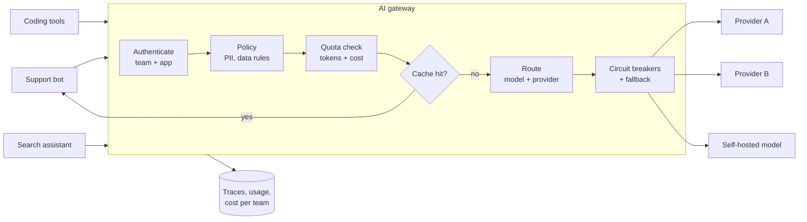
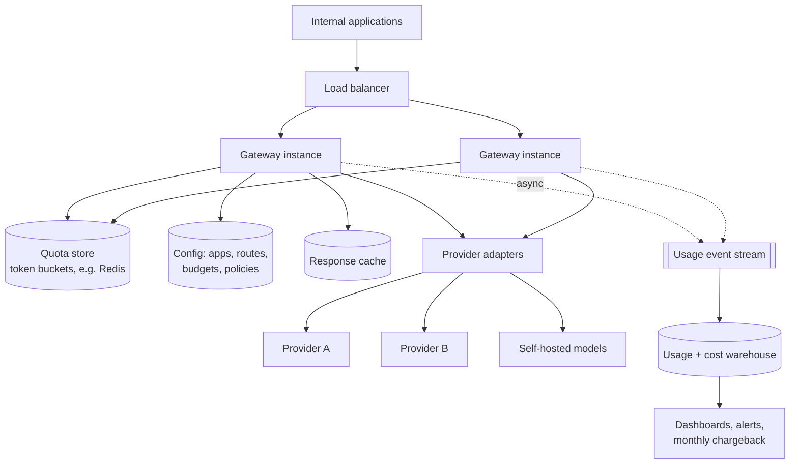

# Designing An AI Gateway: Routing, Quotas, and Fallbacks

*One front door for every model call in the company — so that keys, costs, limits, outages, and audits are handled once, correctly.*

---

> *“Essentially everyone, when they first build a distributed application, makes the following eight assumptions. All prove to be false in the long run and all cause big trouble and painful learning experiences.”*
>
> — **Peter Deutsch**, introducing the "Fallacies of Distributed Computing," Sun Microsystems, 1990s

## At a Glance

> **In one sentence:** An AI gateway is a shared proxy between internal applications and model providers that authenticates callers, enforces token and cost budgets, routes each request to the right model, caches where safe, fails over when a provider degrades, streams responses, and records every call for cost, quality, and audit.

**You'll learn**

- Why organizations centralize model access behind a gateway
- Requirements: routing, quotas, fallbacks, streaming, observability, governance
- Token-based rate limiting and cost attribution
- Circuit breakers and failover across providers and models
- Safe caching of model responses
- Where policies like PII redaction and data residency are enforced

**Before you start:** [How To Design Any System](How-To-Design-Any-System.md) · [Rate Limiting and Throttling](../08-Scalability/Rate-Limiting-and-Throttling.md) · [How LLMs Actually Work](../15-AI-Era-Engineering/How-LLMs-Actually-Work.md)

**Reading time:** about 15 minutes

---

## The Big Picture



*Every application gets the same guarantees without re-implementing them — and the company gets one place to see and control all AI usage.*

---

## Introduction

Six months after a company's first AI feature, a platform engineer audits model usage and finds:

- Eleven teams calling three providers directly, each with its own API keys — two of them committed to Git at some point.
- No idea which team spends what; the monthly bill arrives as one large number.
- Every team implemented its own retry logic; two of them retry immediately and endlessly on HTTP 429, making rate-limit incidents worse.
- When one provider had an outage, four features went down; one team had a fallback, and it silently switched to a model whose output format broke its parser.
- Legal asks, "Do we send customer personal data to external providers?" Nobody can answer confidently.

The fix is the same one organizations adopted for payments, email, and HTTP traffic long ago: **a shared gateway** that every call goes through. This chapter designs one.

### Why Should Engineers Care?

As AI usage spreads across a company, the cross-cutting concerns — keys, quotas, cost, reliability, compliance, and observability — become more important than any single feature. The gateway is also a classic system design problem: a high-throughput proxy with rate limiting, routing, caching, circuit breakers, and streaming.

---

## The Problem It Solves

| Without a gateway | With a gateway |
|------------------|---------------|
| Provider keys spread across teams and repos | Keys held centrally; apps use internal credentials |
| No per-team cost visibility | Usage and cost attributed per team, app, and feature |
| Inconsistent retries and rate-limit handling | Standard backoff, queuing, and quotas |
| Provider outage = feature outage | Automatic, tested fallbacks |
| Unknown data flows | Enforced policies and audit logs |
| Switching models requires code changes | Routing configuration changes |

---

## Historical Background

- **2000s — API gateways.** As service-oriented architectures spread, API gateways centralized authentication, rate limiting, and routing for HTTP APIs.
- **2010s — Service meshes and edge proxies.** Proxies such as Envoy (open-sourced by Lyft in 2016) standardized retries, timeouts, circuit breaking, and observability between services.
- **2012 onward — Circuit breakers popularized.** Michael Nygard's *Release It!* (2007) described the circuit breaker pattern; Netflix's Hystrix library (2012) made it widely known.
- **2023 onward — LLM gateways.** As companies adopted several model providers, open-source and commercial "LLM gateways" and "AI gateways" appeared, adding token-aware limits, model routing, prompt logging, and cost tracking on top of classic gateway features.

---

## Core Concepts

### A Unified Interface

Applications call one internal API (often compatible with a popular provider's request format). The gateway translates to each provider's API, so applications aren't tied to one vendor's SDK.

### Token-Aware Quotas

Requests vary a thousandfold in cost, so limits must count **tokens and money**, not requests:

- **Input tokens** can be counted before the call.
- **Output tokens** are known only afterward — reserve an estimate (for example, the request's `max_output_tokens`), then settle the difference when the response completes.
- Budgets exist at several levels: per request (max size), per user per minute, per team per day, per month.

### Routing

The gateway chooses a model and provider per request, using:

- **Explicit choice** by the caller ("use the large model"), within allowed options,
- **Policy** ("customer data from the EU goes only to EU-hosted models"),
- **Cost/quality tiers** ("summaries use the small model"),
- **Health** (avoid a provider with an open circuit breaker),
- **Capacity** (spread load across provider accounts or regions).

### Fallbacks and Circuit Breakers

A **circuit breaker** tracks recent failures per provider and model. When errors or latency cross a threshold, it "opens" and the gateway stops sending traffic there for a cooldown period, then lets a few test requests through ("half-open"). Fallback chains define what to try instead — but **only models that have passed the application's evaluations** should be in an application's fallback chain.

### Caching

- **Exact caching:** identical model, parameters, and input → reuse the response. Safe for deterministic tasks (classification, extraction, embeddings).
- **Semantic caching:** similar inputs reuse answers. Risky: different questions can look similar, and personalized answers must never be shared across users.
- **Provider prompt caching:** stable prompt prefixes are processed once and reused; the gateway can help by keeping prompts well-structured and routing related requests consistently.

### Streaming

Most interactive uses stream tokens. The gateway must proxy streams without buffering, count tokens as they pass, handle client disconnects (stop the upstream request to save cost), and enforce timeouts suited to long generations.

### Observability and Governance

Each call is logged with: team, app, feature, user (or pseudonymous ID), model, provider, tokens, cost, latency, time to first token, cache status, errors, and policy decisions. Whether prompt and response **content** is logged — and who may read it — is a governance decision.

---

## Real-World Analogy

### A Company Travel Desk

Instead of every employee booking flights with their own credit card, a company uses a travel desk. It holds the corporate accounts (API keys), applies the travel policy (routing and data rules), enforces department budgets (quotas), books an alternative airline when a flight is cancelled (fallback), and produces a monthly report of who spent what (cost attribution). Employees still decide where they need to go; the desk makes sure the trip is booked safely and within policy.

---

## How It Works In Practice

### Step 1 — Requirements

- **Functional:** single API for chat/completions, embeddings, and tool calling; streaming; per-team credentials; routing rules; fallback chains; exact caching; usage and cost reporting; admin configuration.
- **Non-functional:**
  - **Overhead:** add only a few milliseconds of latency (model calls take seconds; the gateway must not add noticeably).
  - **Availability:** higher than any single provider — the gateway is on the critical path for all AI features.
  - **Correct accounting:** cost attributed accurately per team.
  - **Security:** keys never leave the gateway; requests authenticated; audit logs.
  - **Compliance:** enforce data-residency and data-classification rules.

### Step 2 — Estimation

```
Applications:        40, across 15 teams
Requests:            5 million/day ≈ 60/second average, ~500/second peak
Streaming share:     70% of requests → ~350 concurrent streams at peak × average ~8 s
                     (Little's Law: 500/s × ~8 s ≈ 4,000 concurrent requests at peak)
Tokens:              ~2,000 input + 300 output per request → ~10B input + 1.5B output tokens/day
Log volume:          metadata ~1 KB/request → ~5 GB/day; content logging (if enabled) far more
```

Conclusions: the gateway handles **many long-lived concurrent connections**, not heavy computation. An asynchronous, streaming-friendly proxy is essential. Accounting and logging must be asynchronous so they don't slow requests.

### Step 3 — API

```
POST /v1/chat
  Headers: Authorization: Bearer <internal app token>
  Body:    { model: "tier:large" | "provider/model-name", messages, tools?, max_output_tokens,
             stream: true, metadata: { feature: "ticket-summary" } }
  → streamed tokens, then usage: { input_tokens, output_tokens, cost, provider, model, cache }

POST /v1/embeddings
GET  /v1/usage?team=support&from=...&to=...
PUT  /admin/routes/{app}      (routing rules, fallback chains, budgets)
```

### Step 4 — Data Model

```
apps          app_id, team_id, token_hash, allowed_models[], data_classification
budgets       scope (app|team), period (minute|day|month), token_limit, cost_limit
routes        app_id, model_alias → ordered list of (provider, model, region) + conditions
usage_events  request_id, app_id, team_id, feature, model, provider, input_tokens,
              output_tokens, cost, latency_ms, ttft_ms, cache_status, error, timestamp
breaker_state provider+model → state (closed | open | half_open), failure stats, open_until
```

### Step 5 — High-Level Design



### Step 6 — Deep Dives

**Deep dive 1: Token budgets that actually hold.**

1. Estimate input tokens (tokenizer or provider's counting endpoint).
2. Reserve `input + max_output_tokens` from the team's token bucket atomically in the shared quota store.
3. If the reservation fails, return HTTP 429 with a `Retry-After` header.
4. After the response, compute actual usage and refund the unused reservation.
5. Monthly cost budgets trigger alerts at 50/80/100%, and at 100% either block or require approval, per team policy.

**Deep dive 2: Failover without surprises.**

- Circuit breakers per provider+model, opened on elevated error rates, timeouts, or time-to-first-token degradation.
- Fallback chains are defined **per application**, containing only models the application has evaluated.
- Retries happen only **before the first streamed token** has been sent to the client. After that, switching models mid-answer would produce a garbled response — fail cleanly instead.
- Retries use backoff with jitter and a **retry budget** (for example, at most 10% extra requests), so the gateway never multiplies load during a provider incident.

**Deep dive 3: Streaming and cancellation.** The gateway proxies server-sent events as they arrive, counting tokens incrementally. If the client disconnects, the gateway cancels the upstream request so the company doesn't pay for an answer nobody will read. Proxy and load-balancer timeouts are set for long generations.

**Deep dive 4: Policy enforcement.** Before routing, requests are checked against the app's data classification: an app handling regulated personal data may only route to approved providers and regions; optional PII detection can redact or block. Policies are configuration with audit history, not code scattered across applications.

### Step 7 — Wrap-Up

- **Bottlenecks:** concurrent connections, quota-store latency (keep it in-region and fast), log pipeline volume.
- **Failures:** gateway instance crash → load balancer routes around it (streams in progress fail; clients retry); quota store unavailable → fail open with conservative local limits, or fail closed for cost-critical apps; all providers down → clear errors so apps can use non-AI fallbacks.
- **Monitoring:** per-provider error rate, latency, and time to first token; breaker state changes; 429 rates per team; cost per team versus budget; cache hit rate; gateway overhead latency.

---

## Production Engineering Perspective

- **The gateway is critical infrastructure.** Deploy it redundantly across zones, roll out changes gradually, and keep its own dependencies (config store, quota store) highly available with safe fallbacks.
- **Make the right thing easy.** Provide client libraries and templates so teams adopt the gateway by default rather than calling providers directly. Block direct egress to provider APIs from production networks once migration is complete.
- **Chargeback builds good behavior.** When teams see their own costs, they optimize prompts, choose smaller models, and cache — without platform mandates.
- **Evaluate before routing changes.** A "cheaper model" routing rule is a behavior change for every app it touches; require each app's evals to pass before switching.
- **Content logging is sensitive.** Default to metadata-only logging, with opt-in, access-controlled, time-limited content logging for debugging and evaluation.

---

## Tradeoffs

| Decision | Option A | Option B |
|---------|---------|---------|
| Build vs. buy | Open-source or commercial gateway (fast) | Build your own (control, effort) |
| Quota store unavailable | Fail open (availability) | Fail closed (cost safety) |
| Fallback | Automatic to evaluated models (resilience) | Fail and let the app decide (predictability) |
| Caching | Exact only (safe) | Semantic (savings, correctness risk) |
| Logging | Metadata only (privacy) | Full content (debuggability, evaluation data) |
| API shape | Provider-compatible (easy adoption) | Own abstraction (flexibility, more work) |

---

## Common Mistakes

### Beginner Mistakes

- Rate limiting by request count instead of tokens.
- Buffering streamed responses, destroying time to first token.
- Proxy timeouts shorter than long generations.

### Intermediate Mistakes

- Fallback chains including models no one has evaluated for that application.
- Retrying after streaming has begun, producing mixed or duplicated output.
- Unbounded retries that amplify provider incidents.
- Semantic caching across users for personalized answers.

### Senior-Level Mistakes

- Making the gateway a single point of failure without zone redundancy and safe degradation.
- Allowing direct provider access to continue "temporarily" forever, so governance is never complete.
- Logging full prompt content by default, creating a sensitive data store nobody planned to protect.

---

## Failure Scenarios

### Scenario 1: The Silent Model Swap

Provider A has a partial outage; the gateway fails over to a different model for all apps. One app's JSON parser breaks on the new model's output; thousands of support tickets go unclassified.

**Mitigation:** per-app fallback chains limited to evaluated models; schema validation in apps; alerts on fallback activation.

### Scenario 2: The Runaway Agent

An agent loop in a new feature makes thousands of calls overnight. The team's daily token budget stops it at its limit; an alert fires; the cost is contained.

**Lesson:** budgets at multiple levels (per request, per minute, per day) turn potential disasters into routine alerts.

### Scenario 3: The Retry Storm

A provider starts returning 429s. Several apps and the gateway each retry three times — every original request becomes up to 16 attempts, deepening the overload.

**Mitigation:** retries only at one layer (the gateway), retry budgets, respect `Retry-After`, and circuit breakers.

### Scenario 4: The Abandoned Streams

A UI bug opens a new request for every keystroke and abandons the old ones. Without cancellation, the company pays for thousands of unread answers.

**Mitigation:** cancel upstream requests on client disconnect; per-user concurrency limits.

---

## Real-World Industry Examples

- **Open-source LLM gateways and proxies** (for example, LiteLLM, and AI-focused extensions of API gateways such as Envoy AI Gateway and Kong's AI plugins) provide unified APIs, fallbacks, and usage tracking.
- **Cloud providers** offer managed model access with quotas and monitoring built in, and several CDN and edge companies offer AI gateway products for caching, rate limiting, and analytics.
- **Envoy** and **Netflix's Hystrix** established the retry, timeout, and circuit-breaker patterns that AI gateways reuse.
- Many organizations describe centralizing model access for cost control and governance as a key step in scaling AI adoption.

---

## Interview Questions

### Beginner

**Q1: Why should an organization route AI calls through a gateway?**

*Model answer:* To centralize concerns every app would otherwise duplicate: key management, authentication, token and cost limits, retries and fallbacks, routing between models, caching, logging, cost attribution, and policy enforcement such as data residency.

### Intermediate

**Q2: How do you rate limit by tokens when output length is unknown in advance?**

*Model answer:* Reserve input tokens plus the request's maximum output tokens from a token bucket before calling the model, then settle after the response by refunding unused tokens. Also cap `max_output_tokens` per request and enforce per-minute and per-day budgets.

**Q3: When is it unsafe to retry a model request?**

*Model answer:* After tokens have already been streamed to the client (switching mid-answer corrupts output), when the request triggered side-effecting tool calls, when retry budgets are exhausted, or when the provider signals overload (respect `Retry-After` instead).

### Senior

**Q4: How do you design fallbacks so they don't cause silent quality regressions?**

*Model answer:* Define fallback chains per application using only models that pass that application's evaluation suite, validate outputs with schemas, alert when fallbacks activate, and record which model served each request so quality metrics can be segmented by model.

### Architecture / Leadership

**Q5: How would you roll out an AI gateway across 15 teams already calling providers directly?**

*Model answer:* Start with a provider-compatible API so migration is a configuration change, offer immediate benefits (cost dashboards, fallbacks, higher shared quotas), migrate a few teams as design partners, publish migration guides and client libraries, then set a deadline after which direct provider keys are revoked and egress is blocked. Track adoption and incidents throughout.

---

## Hands-On Lab

Simulate a gateway with a flaky provider, a circuit breaker, a fallback, per-team token budgets, and cost tracking. Pure Python; save as `gateway_lab.py` and run it.

```python
import random, time
from collections import defaultdict
random.seed(11)

PRICES = {"provider-a/large": 10.0, "provider-b/large": 12.0}   # $ per million tokens (made up)

class Provider:
    def __init__(self, name, failure_rate):
        self.name, self.failure_rate = name, failure_rate
    def call(self, tokens):
        if random.random() < self.failure_rate:
            raise ConnectionError(f"{self.name} error")
        return tokens

class CircuitBreaker:
    def __init__(self, threshold=3, cooldown=0.05):
        self.failures, self.threshold, self.cooldown, self.open_until = 0, threshold, cooldown, 0.0
    def allow(self):
        return time.monotonic() >= self.open_until
    def record(self, ok):
        self.failures = 0 if ok else self.failures + 1
        if self.failures >= self.threshold:
            self.open_until, self.failures = time.monotonic() + self.cooldown, 0

providers = {"provider-a/large": Provider("A", failure_rate=0.0),
             "provider-b/large": Provider("B", failure_rate=0.0)}
breakers = {name: CircuitBreaker() for name in providers}
budgets = {"support": 40_000, "search": 400_000}                 # tokens per day
spent = defaultdict(int); cost = defaultdict(float); served_by = defaultdict(int)

def gateway(team, tokens, chain=("provider-a/large", "provider-b/large")):
    if spent[team] + tokens > budgets[team]:
        return "429 budget exceeded"
    for name in chain:
        if not breakers[name].allow():
            continue                                               # circuit open: skip
        try:
            used = providers[name].call(tokens)
            breakers[name].record(ok=True)
            spent[team] += used; cost[team] += used * PRICES[name] / 1e6; served_by[name] += 1
            return f"200 via {name}"
        except ConnectionError:
            breakers[name].record(ok=False)
    return "503 all providers unavailable"

results = defaultdict(int)
for i in range(300):
    if i == 100: providers["provider-a/large"].failure_rate = 0.9   # provider A degrades
    if i == 200: providers["provider-a/large"].failure_rate = 0.0   # ...and recovers
    team = "support" if i % 3 == 0 else "search"
    results[gateway(team, tokens=random.randint(500, 2500)).split(" via")[0]] += 1
    time.sleep(0.001)

print("responses:", dict(results))
print("served by:", dict(served_by))
print("tokens used:", dict(spent), " budgets:", budgets)
print("cost ($):", {team: round(c, 4) for team, c in cost.items()})
```

**What to notice**
- While provider A is failing, requests are served by provider B — users see successes, not errors — and the breaker stops the gateway from wasting attempts on A. After A recovers, traffic returns to it.
- The support team hits its daily token budget and starts receiving `429` responses; the search team is unaffected. Budgets contain one team's problem.
- Cost is attributed per team, with different prices per provider — the basis for chargeback.
- Try setting both providers' failure rates to 0.9 and watch `503` responses appear: fallbacks can't create capacity that doesn't exist, so applications need their own non-AI fallback.

---

## Test Yourself

*Answer each question in your head or on paper first, then open the answer to check.*

<details markdown="1">
<summary><strong>1. Name four responsibilities of an AI gateway.</strong></summary>

Any four of: authentication and key management, token and cost quotas, routing between models and providers, fallbacks and circuit breaking, caching, streaming proxying, logging and cost attribution, policy enforcement (PII, data residency).

</details>

<details markdown="1">
<summary><strong>2. Why must AI quotas count tokens rather than requests?</strong></summary>

Request costs vary by orders of magnitude. Token counts (and cost) reflect real load and spend; request counts don't.

</details>

<details markdown="1">
<summary><strong>3. What does a circuit breaker do in the gateway?</strong></summary>

Stops sending requests to a failing provider or model for a cooldown period, then tests it with a few requests before fully restoring traffic — protecting latency, cost, and the struggling provider.

</details>

<details markdown="1">
<summary><strong>4. Why should fallback chains be defined per application?</strong></summary>

Different models behave differently. Only models that pass a given application's evaluations (format, quality) are safe fallbacks for it.

</details>

<details markdown="1">
<summary><strong>5. Why cancel the upstream request when a client disconnects?</strong></summary>

Otherwise the provider keeps generating tokens you pay for, for an answer nobody will read.

</details>

<details markdown="1">
<summary><strong>6. When is response caching safe?</strong></summary>

For exact matches on deterministic tasks (classification, extraction, embeddings) where the output doesn't depend on the user. Semantic or cross-user caching of personalized answers is risky.

</details>

<details markdown="1">
<summary><strong>7. Why should retries happen at only one layer?</strong></summary>

Retries at several layers multiply: three layers each retrying three times can turn one request into many, amplifying an outage.

</details>

---

## Cheat Sheet

**Request path:** authenticate app → apply policy (data class, PII, region) → reserve tokens → cache check → route (alias → provider/model) → circuit breaker → call with timeout → stream back → settle tokens → async usage event.

| Concern | Mechanism |
|--------|----------|
| Keys | Held only by the gateway; apps get internal tokens |
| Cost control | Token buckets per app/team; monthly cost budgets and alerts |
| Reliability | Timeouts, retry budgets, circuit breakers, evaluated fallbacks |
| Latency | Async streaming proxy; no buffering; low-overhead checks |
| Savings | Exact caching, prompt-prefix structure, model routing by tier |
| Governance | Per-app policies, audit logs, metadata-first logging |
| Visibility | Usage events → warehouse → per-team dashboards and chargeback |

**Rules:** retry only before streaming starts · retry at one layer only · respect `Retry-After` · cancel on disconnect · evaluate before changing routes.

---

## In the AI Era

An AI gateway exists *because* of the AI era, but it's built entirely from classic ideas in this handbook: [rate limiting](../08-Scalability/Rate-Limiting-and-Throttling.md), [load balancing](../08-Scalability/How-Load-Balancing-Works.md), [caching](../05-Distributed-Systems/How-Caching-Works.md), circuit breakers from [distributed systems](../05-Distributed-Systems/Why-Distributed-Systems-Are-Hard.md), and [capacity planning](../08-Scalability/Auto-scaling-and-Capacity-Planning.md).

Newer responsibilities are emerging:

- **Agent-aware limits:** budgets per agent run (steps, tokens, time), not just per request.
- **Tool governance:** gateways for tool calls (for example, MCP servers) that apply the same authentication, allow-lists, and audit logging to actions as to model calls.
- **Evaluation hooks:** sampling traffic for quality grading, and routing experiments between models with measured outcomes.

**Try it:** Extend the lab with a third "small" model that costs a tenth as much. Route requests under 800 tokens to it, and compare total cost before and after. What would you need to verify before turning this on for a real application?

---

## Key Takeaways

1. An AI gateway centralizes keys, quotas, routing, fallbacks, caching, observability, and policy for all model calls.
2. Quotas must count tokens and cost; reserve before the call and settle after.
3. Circuit breakers and per-app, evaluated fallback chains keep features up when providers degrade.
4. Retry only before streaming starts, only at one layer, and within a retry budget.
5. Proxy streams without buffering and cancel abandoned requests.
6. Cache exact, deterministic, non-personalized requests; be very careful with semantic caching.
7. The gateway is critical infrastructure: redundant, carefully deployed, and adopted by making it the easy path.

---

## What to Read Next

- **[Rate Limiting and Throttling](../08-Scalability/Rate-Limiting-and-Throttling.md)** — the algorithms behind token budgets
- **[Building LLM-Powered Systems](../15-AI-Era-Engineering/Building-LLM-Powered-Systems.md)** — what the applications behind the gateway look like
- **[Securing AI Systems](../15-AI-Era-Engineering/Securing-AI-Systems.md)** — policy, data handling, and agent guardrails

---

## Further Reading

- **Michael Nygard — "Release It!" (2nd edition, 2018)** — timeouts, circuit breakers, bulkheads
- **Envoy Proxy documentation — circuit breaking, retries, timeouts:** [https://www.envoyproxy.io/docs](https://www.envoyproxy.io/docs)
- **Martin Fowler — "CircuitBreaker":** [https://martinfowler.com/bliki/CircuitBreaker.html](https://martinfowler.com/bliki/CircuitBreaker.html)
- **Google SRE Book — "Handling Overload" and "Addressing Cascading Failures":** [https://sre.google/sre-book/table-of-contents/](https://sre.google/sre-book/table-of-contents/)
- **Marc Brooker — "Timeouts, retries, and backoff with jitter"** (Amazon Builders' Library): [https://aws.amazon.com/builders-library/](https://aws.amazon.com/builders-library/)

---

*This chapter is part of the Modern Software Engineering Handbook — a comprehensive guide to the concepts, principles, and practices that every professional software engineer should know.*
