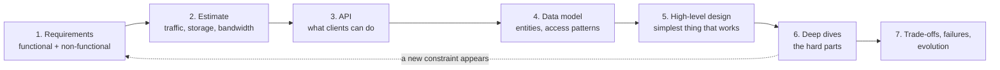
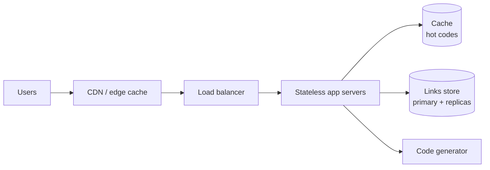

# How To Design Any System

*A repeatable method for turning a vague idea into an architecture you can defend — at any scale.*

---

> *“There are two ways of constructing a software design: One way is to make it so simple that there are obviously no deficiencies, and the other way is to make it so complicated that there are no obvious deficiencies.”*
>
> — **C. A. R. (Tony) Hoare**, "The Emperor's Old Clothes," Turing Award lecture, 1980

## At a Glance

> **In one sentence:** Good system design is a disciplined sequence — clarify requirements, estimate scale, define the API and data model, sketch the simplest architecture that works, then deepen the parts that are hard for *this* problem while stating every trade-off out loud.

**You'll learn**

- A seven-step framework you can apply to any design problem
- How to turn vague requests into functional and non-functional requirements
- Back-of-the-envelope estimation for traffic, storage, and bandwidth
- How to choose the data model and API before the boxes and arrows
- How to find the real bottleneck and deepen only where it matters
- How to present trade-offs, in interviews and in design reviews

**Before you start:** [How To Think Like An Engineer](../01-Foundations/How-To-Think-Like-An-Engineer.md) · [Why Distributed Systems Are Hard](../05-Distributed-Systems/Why-Distributed-Systems-Are-Hard.md) · [Vertical vs Horizontal Scaling](../08-Scalability/Vertical-vs-Horizontal-Scaling.md)

**Reading time:** about 20 minutes

---

## The Big Picture



*Design is a loop, not a line: a deep dive often reveals a requirement you missed, and you go back.*

---

## Introduction

Two engineers are asked the same question: *"Design a URL shortener."*

The first starts drawing immediately. Load balancer, a fleet of servers, a Cassandra cluster, Kafka, Redis, a CDN. Twenty minutes later there is an impressive diagram. Then someone asks: "How many URLs are created per day?" The engineer doesn't know. "Do links expire?" Not considered. "What happens if two people shorten the same URL?" Never discussed. "Why Cassandra?" Because it scales. The design might be fine — or wildly over-built, or missing its one hard problem. Nobody can tell, including its author.

The second engineer spends the first few minutes asking questions. Roughly how many links are created and clicked per day? Do users need custom aliases? Analytics? Expiry? How fast must a redirect be? With answers in hand, they estimate: about 100 million new links per month and 100 reads per write — so roughly 4,000 redirects per second on average, perhaps 20,000 at peak, and a few terabytes of data over several years. That is a *read-heavy key-value lookup problem*. The design falls out almost naturally: a simple write path that generates short codes, a key-value store, and aggressive caching of hot links close to users. The hard parts — generating unique codes without collisions, and handling a viral link receiving millions of clicks — get the deep attention.

Both engineers know the same technologies. The difference is **method**. This chapter teaches that method.

### Why Should Engineers Care?

System design is not only an interview ritual. Every meaningful feature is a small design problem: a new service, a new table, a new background job, a new integration. Engineers who design systematically:

- Build the right thing the first time more often, because requirements are explicit
- Avoid over-engineering, because estimates reveal what scale actually needs
- Communicate decisions clearly, because trade-offs are written down
- Catch failure modes on paper, where fixing them is cheap
- Earn trust — senior engineers are largely judged on the quality of their designs

### Where This Shows Up

| Situation | What "design" means there |
|----------|--------------------------|
| A new feature | Which services change, what data is stored, what can fail |
| A design document | A written proposal with alternatives and trade-offs |
| An architecture review | Defending (or improving) a proposed design |
| An incident postmortem | Understanding why a design failed under real conditions |
| A system design interview | Demonstrating structured thinking in 45 minutes |
| Buying vs. building | Deciding which parts you should own at all |

---

## The Problem It Solves

Designing software systems is hard for a specific reason: **the space of possible designs is enormous, and the cost of a wrong decision grows over time.** A data model chosen in week one may be impossible to change in year three, when a hundred services depend on it.

Without a method, teams fall into predictable traps:

1. **Solution-first thinking.** Picking technologies before understanding the problem ("we'll use microservices and Kafka").
2. **Missing requirements.** Discovering after launch that data must be deleted on request, or must stay in one country, or must be auditable.
3. **Wrong scale assumptions.** Building for a billion users when you have a thousand — or the reverse.
4. **Invisible trade-offs.** Decisions that were never discussed, so nobody knows why the system is the way it is.
5. **Ignored failure modes.** Designs that work beautifully until one dependency slows down.

A design method does not guarantee a good design. It guarantees that the important questions get asked while answers are still cheap.

---

## Historical Background

### 1968: The NATO Software Engineering Conference

The term "software engineering" was popularized at a NATO conference that openly discussed a "software crisis": projects were late, over budget, and unreliable. Participants argued that software needed the kind of deliberate design discipline used in other engineering fields.

### 1968: Conway's Law

Melvin Conway observed that organizations design systems that mirror their own communication structures. It remains one of the most reliable predictions in system design: team boundaries become service boundaries.

### 1972: Parnas and Information Hiding

David Parnas's paper "On the Criteria To Be Used in Decomposing Systems into Modules" argued that modules should hide *design decisions likely to change*. It is still the best single rule for drawing boundaries between components.

### 1975: *The Mythical Man-Month*

Fred Brooks emphasized conceptual integrity — a design should reflect one coherent set of ideas — and warned that the first version of a system is often a prototype you will rebuild ("plan to throw one away").

### 1990s–2000s: Internet Scale

Companies such as Amazon, Google, and eBay faced load no textbook anticipated. Their public papers — Google File System (2003), MapReduce (2004), Bigtable (2006), Dynamo (2007) — turned hard-won design lessons into shared vocabulary: partitioning, replication, eventual consistency, and designing for failure.

### 2000s–2010s: Design Docs and Architecture Decision Records

Large engineering organizations standardized written design documents reviewed before implementation. In 2011, Michael Nygard proposed **Architecture Decision Records (ADRs)** — short documents capturing one decision, its context, and its consequences — so that the *why* survives after the people leave.

### 2010s–Present: The System Design Interview

As distributed systems became the norm, "design Twitter" or "design a URL shortener" became standard interview questions. Their popularity spread a shared, teachable method — the one this chapter formalizes.

---

## Core Concepts

### Functional vs. Non-Functional Requirements

- **Functional requirements** describe *what the system does*: "users can shorten a URL," "users can send a message to a group."
- **Non-functional requirements** describe *how well it must do it*: latency, availability, durability, consistency, security, cost, compliance.

Non-functional requirements drive architecture far more than functional ones. "Users can send messages" can be built a hundred ways; "messages must arrive within one second, in order, and never be lost" eliminates most of them.

| Non-functional requirement | Question to ask | Typical example |
|---------------------------|----------------|----------------|
| Scale | How many users, requests, and bytes? | 10M daily users, 5K requests/s peak |
| Latency | How fast, at which percentile? | p99 under 200 ms |
| Availability | How much downtime is acceptable? | 99.9% (≈ 43 minutes/month) |
| Durability | Can we ever lose data? | Never lose a confirmed payment |
| Consistency | Must every reader see the latest write? | Balance: yes. Like count: no |
| Security & privacy | Who may see what? What regulations apply? | Personal data, deletion requests |
| Cost | What budget? | Must run under a fixed monthly budget |

### Back-of-the-Envelope Estimation

Estimation turns vague scale into numbers that constrain design. The goal is the right **order of magnitude**, not precision.

Useful constants:

| Quantity | Value |
|---------|------|
| Seconds per day | ~86,400 ≈ 10⁵ |
| Seconds per month | ~2.6 million |
| 1 million requests/day | ≈ 12 requests/second average |
| Peak-to-average ratio | commonly 2–5× |
| 1 KB × 1 billion | 1 TB |

The standard chain:

```
Daily active users × actions per user per day   = requests per day
Requests per day ÷ 86,400                       = average requests per second
Average × peak factor                           = peak requests per second
Writes per day × size per record × retention    = storage
Requests per second × response size             = bandwidth
```

### The Read/Write Ratio

Most systems are either **read-heavy** (social feeds, product catalogs, URL redirects — often 100:1 or more) or **write-heavy** (metrics, logs, IoT). This single ratio shapes the design:

- Read-heavy → caching, read replicas, CDNs, denormalized read models
- Write-heavy → append-only logs, batching, partitioning, write-optimized storage

### Access Patterns Before Databases

Choose storage by listing the **queries you must answer**, then picking the data model and database that answer them efficiently. "Get a URL by its short code" is a key-value lookup. "Show the 20 latest messages in a conversation" is a range query on (conversation, time). "Find products matching these words" is full-text search. Different access patterns, different tools.

### The Simplest Design That Works

Start with the least complex architecture that meets the requirements — often a single service and a single database — and add complexity only where estimates or requirements demand it. Every component you add is something that can fail, must be monitored, and must be understood by every future engineer.

### Deep Dives

After the high-level design, most of the value is in **two or three deep dives** on the parts that are genuinely hard for *this* problem: unique ID generation for a URL shortener, message ordering for chat, exactly-once charging for payments, ranking for search. Spending equal time on every box is a sign you haven't found the hard part.

### Trade-offs, Stated Explicitly

Every decision gives something up. A strong design names what was chosen, what was rejected, and why:

> "We use asynchronous replication to keep write latency low. The trade-off: if the primary fails, the last few seconds of writes may be lost. That's acceptable for link creation, because users can retry, but we'd choose differently for payments."

---

## Real-World Analogy

### Designing a House

An architect doesn't begin by choosing bricks. They ask who will live there, how many people, what budget, what climate, what local building codes. They sketch the floor plan (the high-level design) before the plumbing (the deep dives). They know that moving a wall on paper costs nothing, while moving it after construction costs a fortune. And they make trade-offs explicit: a bigger kitchen means a smaller living room.

Software design follows the same logic — with one difference that makes it harder: the house must be able to grow from a one-bedroom cottage to an apartment tower *while people are living in it*.

---

## How It Works In Practice

### The Seven Steps

| Step | Output | Typical time in a 45-minute interview |
|-----|-------|--------------------------------------|
| 1. Requirements | Functional list, non-functional targets, what's out of scope | 5 min |
| 2. Estimation | Requests/s, storage, bandwidth, read/write ratio | 5 min |
| 3. API | Main endpoints or operations | 3–5 min |
| 4. Data model | Entities, keys, access patterns, storage choice | 5 min |
| 5. High-level design | Components and data flow | 10 min |
| 6. Deep dives | 2–3 hard problems solved in detail | 10–15 min |
| 7. Wrap-up | Bottlenecks, failures, monitoring, evolution | 3–5 min |

### Worked Example: A URL Shortener

**Step 1 — Requirements.**

- Functional: shorten a long URL; redirect a short URL to the long one; optional custom alias; optional expiry.
- Non-functional: redirects are fast (p99 < 50 ms at the server) and highly available (redirect failures break other people's content); links are never lost; short codes are hard to guess in sequence.
- Out of scope (say so explicitly): user accounts, detailed analytics dashboards.

**Step 2 — Estimation.**

```
New links:        100 million per month   ≈ 40 writes/second average
Read:write ratio: 100 : 1                 ≈ 4,000 redirects/second average
Peak (×5):                                ≈ 20,000 redirects/second
Record size:      ~500 bytes (URL + metadata)
Storage:          100M × 12 months × 5 years × 500 B ≈ 3 TB
Short-code space: 62 characters (a–z, A–Z, 0–9), 7 characters → 62⁷ ≈ 3.5 trillion codes
```

Conclusion: a read-heavy key-value workload. Writes are modest; reads need caching. Seven-character codes are plenty.

**Step 3 — API.**

```
POST /links          { "url": "https://...", "alias": "optional", "expires_at": "optional" }
                     → 201 { "short": "https://sho.rt/aZ3kQ9x" }
GET  /{code}         → 301/302 redirect to the long URL, or 404
```

(302 keeps redirects flowing through your servers so you can count clicks or change the target; 301 lets browsers cache the redirect, reducing load but losing that control — a trade-off worth stating.)

**Step 4 — Data model.**

```
links
  code        (primary key, 7 chars)
  long_url
  created_at
  expires_at  (nullable)
```

Access pattern: *get by code*, overwhelmingly. A key-value store or a single relational table with a primary key works. At 3 TB, one well-provisioned relational database with replicas could even handle it; a distributed key-value store makes growth easier. State the choice and why.

**Step 5 — High-level design.**



**Step 6 — Deep dives.**

- *Generating unique codes.* Options: (a) hash the URL and take 7 characters — simple, but collisions must be detected and resolved; (b) a counter encoded in base-62 — no collisions, but codes are sequential and guessable, and a single counter is a bottleneck; (c) pre-generated random codes handed out in batches to each server — no coordination per request, not guessable. Option (c) with a uniqueness check on insert is a strong answer.
- *Hot links.* A viral link may get a large share of all traffic. Cache it at the edge (CDN) and in memory; with a 302 redirect, use a short cache lifetime.
- *Expiry.* Store `expires_at`, check it on read, and clean up lazily plus with a periodic background job.

**Step 7 — Wrap-up.**

- Bottleneck: the database under a cold cache — keep replicas and warm caches.
- Failures: if the code generator fails, servers keep working from their pre-fetched batches.
- Abuse: rate-limit link creation; scan target URLs for phishing and malware.
- Evolution: add analytics by publishing click events to a queue — without slowing down redirects.

### Presenting a Design

Whether in an interview or a design review, the same habits work:

- Say what you're doing: "Let me first clarify requirements, then estimate scale."
- Write numbers down. Refer back to them when choosing components.
- Draw data flow, not just boxes. Every arrow should mean something: a request, a message, a replication stream.
- For each major choice, give one alternative and the reason you rejected it.
- Invite challenges: "The riskiest assumption here is the read/write ratio. If it's closer to 1:1, I'd change the storage choice."

---

## Production Engineering Perspective

In real organizations, design is a written, reviewed artifact.

### The Design Document

A typical design doc contains:

1. **Context and problem** — why this work matters now
2. **Goals and non-goals** — including what you are deliberately *not* doing
3. **Requirements and estimates**
4. **Proposed design** — diagrams, API, data model
5. **Alternatives considered** — and why they were rejected
6. **Failure modes and mitigations**
7. **Security, privacy, and compliance**
8. **Rollout, migration, and rollback plan**
9. **Monitoring** — how we'll know it works
10. **Open questions**

### Architecture Decision Records

For individual decisions, a short ADR keeps history honest:

```
# ADR-012: Use pre-generated random codes for short links

Status: Accepted
Context: Sequential IDs are guessable; hashing needs collision handling at scale.
Decision: A code service pre-generates random 7-char base-62 codes and hands
          batches of 10,000 to each app server.
Consequences: No per-request coordination; codes unguessable; a small number of
              codes are wasted when servers restart. Requires a uniqueness constraint.
```

### Designing for Operability

Designs that look elegant on a whiteboard can be miserable to run. Ask during design:

- How do we deploy this without downtime?
- How do we roll back a bad change — including a data migration?
- What does on-call see when it breaks? Which dashboard, which alert?
- How do we backfill, reprocess, or repair data?
- What happens during a regional outage?

---

## Tradeoffs

### Benefits of a Structured Design Method

- Requirements become explicit, so fewer surprises after launch
- Estimates prevent both over- and under-engineering
- Written trade-offs make decisions reviewable and reversible
- Teams share a common vocabulary for discussing designs

### Costs

- Upfront time before code is written
- Risk of "analysis paralysis" on decisions that are cheap to change
- Designs made on paper are still guesses until real traffic arrives

### Matching Effort to Stakes

| Decision | Reversibility | Design effort |
|---------|--------------|--------------|
| Internal tool, small team | Easy to change | A short written plan |
| New service with its own data | Moderate | Design doc + review |
| Core data model, public API, payment flow | Very hard to change | Thorough doc, alternatives, prototypes, review |

### When NOT to Over-Design

- Early-stage products searching for users: speed of learning beats scalability. Design for 10× current load, not 10,000×.
- Prototypes explicitly meant to be thrown away.
- Decisions that are cheap to reverse — make them quickly and move on.

---

## Common Mistakes

### Beginner Mistakes

- **Jumping to technologies** before understanding requirements.
- **Skipping estimation**, then being unable to justify any choice.
- **Designing only the happy path**, with no thought for failures.
- **Drawing boxes without data flow** — a diagram that explains nothing.

### Intermediate Mistakes

- **Treating every component as equally important**, instead of finding the hard part.
- **Choosing a database by popularity**, not by access pattern.
- **Adding caches, queues, and microservices "for scale"** that estimates don't justify.
- **Ignoring data lifecycle**: retention, deletion, backfills, migrations.

### Senior-Level Mistakes

- **Designing around the org chart unknowingly** (Conway's Law) — or ignoring it when it matters.
- **Optimizing for the interview-style problem** instead of the organization's real constraints: team skills, budget, existing platforms.
- **Not writing down why.** In two years, nobody remembers why the system works this way, and it becomes impossible to change safely.
- **One-way-door decisions made casually**, such as a public API or a partitioning key.

---

## Failure Scenarios

### Scenario 1: The Requirement Nobody Asked About

A team designs a user-data platform that replicates everything to analytics systems. After launch, legal requires honoring deletion requests within 30 days. Personal data now lives in a dozen derived stores with no deletion path. The fix takes a quarter.

**Lesson:** privacy, retention, and deletion are requirements. Ask about them in step 1.

### Scenario 2: The Wrong Scale Assumption

A startup builds a sharded, multi-region architecture for "millions of users" before launch. The product pivots twice. Each change requires modifying six services and three data stores. Competitors with a simple monolith ship faster.

**Lesson:** design for the next order of magnitude, not the last one you can imagine.

### Scenario 3: The Hidden Bottleneck

A design scales its stateless app tier beautifully — but every request writes to a single counter row for statistics. At peak, lock contention on that row caps the whole system.

**Lesson:** during deep dives, trace a request end to end and ask, at every step, "what is shared?"

### Scenario 4: No Failure Plan for a Dependency

A checkout service calls a recommendations service synchronously. When recommendations slows down, checkout threads fill up waiting, and checkout fails. Revenue stops because of a *non-essential* feature.

**Lesson:** classify dependencies as critical or optional; give optional ones strict timeouts and fallbacks.

---

## Real-World Industry Examples

- **Amazon** is known for its written-document culture: narrative memos and design docs reviewed in meetings, and a strong emphasis on distinguishing "one-way" from "two-way door" decisions.
- **Google** has long used design docs reviewed before significant implementation work, a practice described in its public engineering writing.
- **The Dynamo paper (2007)** is a model design document in its own right: explicit requirements (always writable shopping carts), explicit trade-offs (eventual consistency), and explicit techniques for each problem.
- **Architecture Decision Records** are used by many companies and open-source projects to preserve decision history alongside the code.

---

## Interview Questions

### Beginner

**Q1: Why start a design with requirements instead of architecture?**

*Model answer:* Because requirements — especially non-functional ones like latency, availability, consistency, and scale — determine which architectures are acceptable. Without them, you can't tell a good design from a bad one. Starting with architecture usually leads to building for imagined problems while missing real ones.

**Q2: Estimate the average and peak requests per second for 10 million daily users who each make 20 requests per day.**

*Model answer:* 10M × 20 = 200M requests per day. Divided by ~86,400 seconds ≈ 2,300 requests per second on average. With a peak factor of 3–5×, peak is roughly 7,000–12,000 requests per second.

### Intermediate

**Q3: How do you decide where to spend time in a deep dive?**

*Model answer:* I look for the parts that are hard specifically for this problem — where requirements conflict, where scale concentrates (hot keys, fan-out), where correctness is critical (money, ordering), or where a shared resource could bottleneck. Generic components like load balancers rarely need deep dives; the unique-ID scheme, ordering guarantee, or consistency boundary usually does.

**Q4: What makes a good data model decision?**

*Model answer:* Starting from the access patterns — the queries that must be fast — and choosing keys and storage that serve them efficiently, while considering growth, consistency needs, and how hard the choice will be to change later. Partition keys and primary identifiers deserve extra care because they are the hardest to change.

### Senior

**Q5: How do you avoid over-engineering while still designing for growth?**

*Model answer:* Design for roughly the next order of magnitude, based on real growth data. Keep the architecture simple but make likely future changes cheap: stateless services, clean module boundaries, IDs that don't assume a single database, and data models that can be partitioned. Defer expensive decisions until evidence demands them, and document the trigger points ("shard when writes exceed X").

### Architecture / Leadership

**Q6: How would you run a design review so that it improves designs rather than just approving them?**

*Model answer:* Require a written doc in advance with goals, non-goals, alternatives, and failure modes. In the review, focus on the riskiest assumptions and irreversible decisions, not style. Ask "what would make this fail?" and "what did you reject and why?". Record decisions and open questions as ADRs or action items. Keep reviews proportional to stakes so small changes aren't slowed down.

---

## Hands-On Lab

**Experiment 1 — Build your own estimation calculator.**

```python
def estimate(daily_users, actions_per_user, read_write_ratio, record_bytes,
             retention_years, peak_factor=4):
    requests_per_day = daily_users * actions_per_user
    avg_rps = requests_per_day / 86_400
    writes_per_day = requests_per_day / (read_write_ratio + 1)
    storage_tb = writes_per_day * 365 * retention_years * record_bytes / 1e12
    print(f"average requests/s : {avg_rps:,.0f}")
    print(f"peak requests/s    : {avg_rps * peak_factor:,.0f}")
    print(f"writes/s (avg)     : {writes_per_day / 86_400:,.0f}")
    print(f"storage            : {storage_tb:,.1f} TB over {retention_years} years")

print("URL shortener");  estimate(20_000_000, 10, 100, 500, 5)
print("\nChat app");      estimate(50_000_000, 40, 1, 200, 3)
```

Change one input at a time and watch which output moves. Notice how the read/write ratio changes the storage estimate but not the request rate — and how peak factor changes capacity needs without changing storage.

**Experiment 2 — Design on paper, then attack your design.**
Pick one: a pastebin, a leaderboard for a mobile game, or a restaurant reservation system. Spend 30 minutes producing the seven outputs from this chapter. Then spend 10 minutes as an attacker and a pessimist: list five ways it fails (a dependency slows down, traffic spikes 10×, a region goes down, a malicious user, a bad deploy) and one mitigation for each.

**Experiment 3 — Write an ADR.**
Take one real decision from your current project (a database, a framework, a queue). Write a five-line ADR: status, context, decision, consequences. If you can't write the context, that's a sign the decision was never really made — it just happened.

---

## Test Yourself

*Answer each question in your head or on paper first, then open the answer to check.*

<details markdown="1">
<summary><strong>1. What are the seven steps of the design method in this chapter?</strong></summary>

Requirements → estimation → API → data model → high-level design → deep dives → trade-offs, failures, and evolution.

</details>

<details markdown="1">
<summary><strong>2. Why do non-functional requirements shape architecture more than functional ones?</strong></summary>

Many architectures can deliver a feature, but constraints like latency, availability, consistency, durability, and scale rule most of them out. They are what make the design problem specific.

</details>

<details markdown="1">
<summary><strong>3. 1 million requests per day is roughly how many requests per second?</strong></summary>

About 12 per second on average (1,000,000 ÷ 86,400). Peaks are typically 2–5× higher.

</details>

<details markdown="1">
<summary><strong>4. Why list access patterns before choosing a database?</strong></summary>

Databases are good at different queries. Knowing which queries must be fast — key lookups, range scans, full-text search, joins — tells you which data model and storage engine fit.

</details>

<details markdown="1">
<summary><strong>5. What is the main risk of sequential IDs as public short codes?</strong></summary>

They are guessable: anyone can enumerate other people's links. A single counter can also become a coordination bottleneck.

</details>

<details markdown="1">
<summary><strong>6. What is an Architecture Decision Record?</strong></summary>

A short document recording one important decision: its context, the decision, and the consequences. It preserves the *why* for future engineers.

</details>

<details markdown="1">
<summary><strong>7. What does Conway's Law predict?</strong></summary>

That a system's structure will mirror the communication structure of the organization that builds it — team boundaries tend to become component boundaries.

</details>

---

## Cheat Sheet

**The seven steps:** Requirements → Estimate → API → Data model → High-level design → Deep dives → Trade-offs & failures.

**Requirements checklist:** users and use cases · scale · latency (percentile) · availability · durability · consistency · security and privacy · data retention and deletion · cost · what's out of scope.

**Estimation constants:** 1 day ≈ 86,400 s · 1M/day ≈ 12/s · peak ≈ 2–5× average · 1 KB × 1B = 1 TB.

| If the workload is… | Reach for… |
|--------------------|-----------|
| Read-heavy | Caching, replicas, CDN, denormalized reads |
| Write-heavy | Append-only logs, batching, partitioning |
| Spiky | Queues, auto-scaling, rate limiting |
| Global | Regional deployments, edge caching, data residency |
| Money or inventory | Strong consistency, idempotency, audit logs |

**For every big decision, say:** what you chose · one alternative · why · what you gave up · when you'd revisit it.

---

## In the AI Era

AI assistants are good at producing plausible architectures quickly — which makes the method in this chapter more important, not less.

- **Use AI to widen your options, not to choose.** Ask for three alternative designs with their trade-offs, then evaluate them against *your* requirements and estimates.
- **Use AI as a reviewer.** Paste your design doc and ask: "List the five most likely failure modes and the requirement I seem to have missed." It's a cheap first review before the human one.
- **Beware the generic answer.** Models reproduce the most common design for a problem ("design a chat app" → the same diagram every time). Your constraints — team size, budget, compliance, existing systems — are what make your design right, and the model doesn't know them unless you say so.
- **AI features are system design problems.** Token budgets become part of estimation, model latency becomes part of the latency budget, and provider outages become a dependency failure mode. See [Designing An AI Assistant Over Private Data](Designing-An-AI-Assistant-Over-Private-Data.md) and [Designing An AI Gateway](Designing-An-AI-Gateway.md).

**Try it:** Ask an assistant to design a URL shortener. Then compare its answer against the seven steps: which requirements did it assume without asking? Which numbers did it skip?

---

## Key Takeaways

1. Design is a method: requirements, estimation, API, data model, high-level design, deep dives, and trade-offs.
2. Non-functional requirements — scale, latency, availability, consistency, durability, privacy — drive architecture.
3. Back-of-the-envelope numbers turn opinions into constraints; aim for the right order of magnitude.
4. Choose data models and databases from access patterns, not popularity.
5. Start with the simplest design that works, and add complexity only where numbers demand it.
6. Most of a design's value is in two or three deep dives on the genuinely hard parts.
7. State trade-offs explicitly and write decisions down so they can be revisited.
8. Match design effort to how hard a decision is to reverse.

---

## What to Read Next

- **[How To Handle 1 Million Users](How-To-Handle-1-Million-Users.md)** — the method applied to growth, step by step
- **[Designing A Chat System](Designing-A-Chat-System.md)** — a full worked design with real-time delivery
- **[Why Distributed Systems Are Hard](../05-Distributed-Systems/Why-Distributed-Systems-Are-Hard.md)** — the failure modes every design must survive

---

## Further Reading

### Papers and Essays

- **"On the Criteria To Be Used in Decomposing Systems into Modules" (1972)** — David Parnas
- **"How Do Committees Invent?" (1968)** — Melvin Conway, the origin of Conway's Law
- **"Dynamo: Amazon's Highly Available Key-value Store" (2007)** — DeCandia et al.: [https://www.allthingsdistributed.com/files/amazon-dynamo-sosp2007.pdf](https://www.allthingsdistributed.com/files/amazon-dynamo-sosp2007.pdf)
- **"Documenting Architecture Decisions" (2011)** — Michael Nygard: [https://cognitect.com/blog/2011/11/15/documenting-architecture-decisions](https://cognitect.com/blog/2011/11/15/documenting-architecture-decisions)

### Books

- **"Designing Data-Intensive Applications"** — Martin Kleppmann
- **"The Mythical Man-Month"** — Fred Brooks
- **"System Design Interview" (Volumes 1 and 2)** — Alex Xu (and Sahn Lam for Volume 2)
- **"A Philosophy of Software Design"** — John Ousterhout

### Talks and Blogs

- **Jeff Dean — "Designs, Lessons and Advice from Building Large Distributed Systems"** (LADIS 2009 keynote)
- **The Architecture of Open Source Applications:** [https://aosabook.org](https://aosabook.org)
- **High Scalability:** [http://highscalability.com](http://highscalability.com)

---

*This chapter is part of the Modern Software Engineering Handbook — a comprehensive guide to the concepts, principles, and practices that every professional software engineer should know.*
