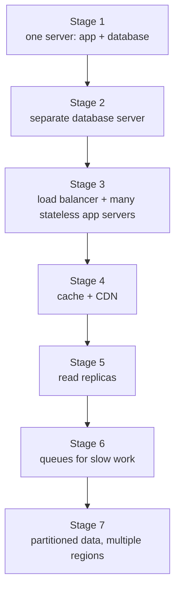
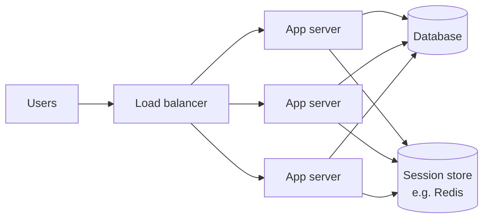
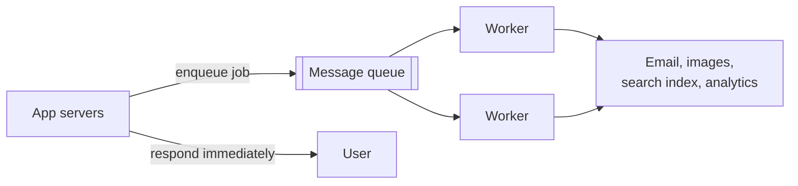

# How To Handle 1 Million Users

*Scaling is not one big decision. It is a series of small ones, each made when the numbers say it's time.*

---

> *“One of the most common types of advice we give at Y Combinator is to do things that don't scale.”*
>
> — **Paul Graham**, "Do Things that Don't Scale," 2013

## At a Glance

> **In one sentence:** Systems grow in stages — one server, then a separate database, then many stateless app servers behind a load balancer, then caches, CDNs, read replicas, queues, and finally partitioned data — and the skill is knowing which bottleneck you have *now* and fixing only that one.

**You'll learn**

- The typical stages of growth from 1 user to millions
- How to find the current bottleneck with measurements, not guesses
- Why statelessness is the key that unlocks horizontal scaling
- Where caches, CDNs, replicas, and queues each help — and what they cost
- When to partition data and go multi-region
- Which problems are *not* solved by adding servers

**Before you start:** [How To Design Any System](How-To-Design-Any-System.md) · [Vertical vs Horizontal Scaling](../08-Scalability/Vertical-vs-Horizontal-Scaling.md) · [How Caching Works](../05-Distributed-Systems/How-Caching-Works.md)

**Reading time:** about 15 minutes

---

## The Big Picture



*Each stage fixes one specific bottleneck. Skipping ahead adds cost and complexity you don't need yet.*

---

## Introduction

A developer launches a side project on a single small cloud server: web app and database on the same machine. It works perfectly for the first thousand users. Then a popular newsletter mentions it. Within an hour, pages take ten seconds to load, then time out. The developer upgrades to a bigger server. It helps for a day. Then the database runs out of connections. They add a cache — and users start seeing each other's shopping carts because the cache key forgot the user ID. They add a second app server — and users are randomly logged out, because sessions were stored in memory on the first one.

None of these problems are exotic. They are the **standard problems of growth**, and they arrive in a predictable order. Engineers who know that order can fix each problem calmly as it appears — or, better, see it coming.

This chapter walks through that journey, from one server to millions of users, explaining at every stage *what breaks*, *why*, and *what to change*.

### Why Should Engineers Care?

- Most real systems are somewhere in the middle of this journey. Knowing the stages tells you what your system needs next — and what it doesn't.
- The same bottlenecks show up in interviews ("how would you scale this?") and in production incidents.
- Premature scaling is expensive too. Knowing the stages keeps you from building stage-7 infrastructure for a stage-2 product.

---

## The Problem It Solves

Growth breaks systems in two ways:

1. **Capacity:** some resource runs out — CPU, memory, disk I/O, database connections, network bandwidth.
2. **Coordination:** some shared thing becomes contended — a lock, a hot row, a single queue, a single leader.

Adding "more servers" only fixes capacity problems in components that can be copied. Most scaling work is really about **making components copyable** (stateless) and **removing shared hot spots**.

---

## Historical Background

- **1990s — Vertical scaling era.** Web sites grew by buying bigger servers. When a site outgrew the biggest machine it could afford, it was in trouble.
- **Late 1990s–2000s — Commodity horizontal scaling.** Companies like Google built on large numbers of cheap machines, designing software to tolerate their failures. The LAMP stack plus load balancers, caching (memcached was released in 2003, created at LiveJournal), and MySQL replication became the standard recipe for growing web apps.
- **2006 — The cloud.** Amazon Web Services launched S3 and EC2, making it possible to rent servers by the hour. Scaling became an operational decision instead of a purchasing process.
- **2010s — Managed services and containers.** Managed databases, load balancers, queues, and CDNs turned many scaling stages into configuration. Containers and orchestration (Kubernetes, released in 2014) made running many copies of a service routine.
- **Today.** A small team can operate a service for millions of users — if it understands which stage it's in and what that stage requires.

---

## Core Concepts

### Measure Before You Scale

Every stage starts with a measurement: which resource is saturated? Use the **USE method** (Utilization, Saturation, Errors) for resources and **RED metrics** (Rate, Errors, Duration) for services. Scaling without measuring usually scales the wrong thing.

### Stateless Services

A service is **stateless** if any instance can handle any request because it keeps no per-user data in local memory or disk between requests. State moves to shared systems: databases, caches, object storage. Statelessness is what allows you to add, remove, and replace servers freely.

### The Database Is Usually the Last Bottleneck Standing

App servers are easy to copy. Databases hold shared, mutable state and are hard to copy while staying consistent. Most of the later stages are about reducing and spreading database load: caching, replicas, queues, and finally partitioning.

### Latency Budgets

At scale, every request crosses many components. A **latency budget** allocates the total acceptable time (say, 300 ms for a page) across them. Every new network hop must fit inside the budget.

### Asynchronous Work

Not everything must happen before you reply to the user. Sending emails, generating thumbnails, updating search indexes, and recomputing recommendations can go into a **queue** and be processed by background workers — making user-facing requests faster and absorbing traffic spikes.

---

## Real-World Analogy

### A Restaurant That Becomes Popular

A small restaurant starts with one cook who also takes orders and washes dishes (stage 1). As it gets busier, a separate dishwasher is hired (separate database). Then several cooks work in parallel from the same recipes (stateless app servers) while a host seats guests evenly (load balancer). Popular dishes are prepared in advance (cache). A takeaway counter near the door serves drinks without entering the kitchen (CDN). Eventually the restaurant opens a second location (multiple regions) — and discovers that keeping the menus and inventory consistent between locations is its own hard problem.

Notice that the owner didn't open a second location on day one.

---

## How It Works In Practice

### Stage 1: One Server (up to hundreds or low thousands of users)

Everything — web server, application, database — on one machine.

- **Why it's good:** simplest to build, deploy, debug, and pay for.
- **What breaks first:** the app and database compete for CPU and memory; one failure takes everything down; deploys cause downtime.
- **Do now anyway:** automated backups, basic monitoring, and infrastructure you can recreate from scripts.

### Stage 2: Separate the Database

Move the database to its own server (often a managed database service).

- **Why:** app and database can be sized independently; the database gets dedicated memory for caching data pages.
- **Watch:** database connections. Each app process opening many connections can exhaust the database. Use a **connection pool**.

### Stage 3: Load Balancer + Multiple Stateless App Servers



- **Why:** handle more requests in parallel and survive the loss of any one server; deploy without downtime by replacing servers gradually.
- **Required change:** make the app stateless. Move sessions to a shared store or signed tokens; store uploads in object storage, not on local disk.
- **What breaks next:** the database, now receiving traffic from many app servers.

### Stage 4: Cache and CDN

- **Application cache** (Redis, Memcached): store results of expensive or frequent queries — product pages, user profiles, computed feeds.
- **CDN:** serve static assets (images, scripts, styles, videos) and cacheable pages from edge locations near users.
- **Why:** most traffic is reads of a small set of popular items. A good cache can absorb the large majority of reads.
- **New risks:** stale data, cache stampedes when popular entries expire, and data leaks when cache keys omit the user. See [How Caching Works](../05-Distributed-Systems/How-Caching-Works.md).

### Stage 5: Read Replicas

Add database replicas that receive a copy of every write and serve read queries.

- **Why:** spread read load that caching can't absorb (search pages, reports, less-popular items).
- **New risk:** replication lag — a user may not see their own recent write. Route "read-your-own-writes" queries to the primary for a short time after a write.
- **Also:** replicas are a failover option if the primary fails.

### Stage 6: Queues and Background Workers



- **Why:** faster responses, smoother load (the queue absorbs spikes), and isolation (a slow email provider no longer slows down sign-ups).
- **Requirements:** jobs must be **idempotent** (they may run twice), failures need retries with backoff, and permanently failing jobs go to a dead-letter queue for inspection.

### Stage 7: Partition the Data and Go Multi-Region

When a single primary database can no longer handle the *write* volume or data size — even on the largest practical machine — split the data:

- **Split by feature** first: users, orders, and messages in separate databases.
- **Shard** within a feature by a key such as `user_id` or `tenant_id`. See [Database Sharding](../08-Scalability/Database-Sharding.md).
- **Multiple regions** for latency and disaster recovery: serve users from the nearest region; decide carefully which data must be globally consistent.

### A Rough Map (Not a Rule)

| Users (active) | Typical shape |
|---------------|--------------|
| Up to ~10K | One or two servers; managed database; backups; monitoring |
| ~10K–100K | Load balancer, several stateless app servers, cache, CDN |
| ~100K–1M | Read replicas, queues and workers, careful indexing, autoscaling |
| 1M+ | Data partitioning by feature, then sharding; multiple regions; dedicated platform teams |

These numbers vary enormously with the product. A chat app with 100K users may be harder than a blog with 10M. Always scale from measurements.

### Things Adding Servers Won't Fix

- A missing database index
- An N+1 query pattern
- A single hot row or lock everyone contends for
- A slow third-party API called synchronously on every request
- A memory leak
- A badly chosen shard key

Fix these first — they are cheaper than any new infrastructure.

---

## Production Engineering Perspective

- **Observability grows with the system.** At stage 1, logs and a CPU graph are enough. By stage 5 you need request tracing across services, per-endpoint latency percentiles, database query statistics, and queue depth dashboards.
- **Load test before growth events.** Launches, marketing campaigns, and seasonal peaks are predictable. Test at 2–3× the expected peak.
- **Degrade gracefully.** Decide in advance which features can be switched off under load (recommendations, non-critical widgets) so that core features (login, checkout) survive.
- **Capacity headroom.** Run at 50–70% utilization at peak so spikes and failures don't push you over the edge.
- **Cost awareness.** Each stage adds cost. Review what you're paying for; unused replicas and oversized instances are common.

---

## Tradeoffs

| Stage | Benefit | Cost / new risk |
|------|--------|----------------|
| Separate database | Independent sizing | Network hop, connection limits |
| Load balancer + stateless apps | Horizontal scale, zero-downtime deploys | Must externalize state |
| Cache | Huge read reduction | Staleness, stampedes, key mistakes |
| CDN | Low latency worldwide | Invalidation, cost, cache-key design |
| Read replicas | Read scale, failover | Replication lag |
| Queues | Fast responses, smoothing | Eventual processing, retries, duplicates |
| Sharding | Write and storage scale | Cross-shard queries, resharding, complexity |
| Multi-region | Latency, disaster recovery | Consistency, cost, operational complexity |

### When NOT to Scale Yet

If you haven't measured a bottleneck, don't add a component "for scale." Every stage adds failure modes. For many products, stage 3 or 4 with good indexing is enough for a very long time.

---

## Common Mistakes

### Beginner Mistakes

- Storing sessions or uploaded files on the app server's local disk.
- No connection pooling, so the database runs out of connections under load.
- Scaling app servers while the database is the actual bottleneck.

### Intermediate Mistakes

- Caching without including user or permission context in the cache key.
- Letting every cached entry expire at the same moment (stampede).
- Putting non-idempotent jobs on a queue with automatic retries.
- Reading from replicas immediately after a write and showing stale data.

### Senior-Level Mistakes

- Sharding before exhausting simpler options, then paying the complexity forever.
- Going multi-region without deciding which data needs global consistency.
- Ignoring the organizational side: more services need more on-call, runbooks, and ownership.

---

## Failure Scenarios

### Scenario 1: The Launch-Day Stampede

A cache is flushed during a deploy right before a big launch. Every request misses and goes to the database, which saturates; requests time out; clients retry, making it worse.

**Mitigations:** never flush caches during peak; warm caches before shifting traffic; request coalescing; retry budgets with backoff and jitter.

### Scenario 2: The Sticky Session Trap

Sessions are kept in app-server memory with sticky load balancing. An app server crashes and thousands of users are logged out mid-checkout. Auto-scaling also can't rebalance load, because users are pinned.

**Mitigation:** store sessions in a shared store or use signed, stateless tokens.

### Scenario 3: The Synchronous Third Party

Sign-up sends a welcome email synchronously. The email provider slows down to 20 seconds per call; sign-up threads fill up; the whole site slows.

**Mitigation:** move email to a queue; set strict timeouts on all third-party calls.

### Scenario 4: The Hot Row

Every page view increments a single "total views" counter row. At scale, row-lock contention limits throughput for the entire database.

**Mitigation:** count in memory or in a cache and flush periodically, or shard the counter across several rows and sum them on read.

---

## Real-World Industry Examples

- **Memcached** was created at LiveJournal in 2003 to cut database load and was later adopted widely, including at Facebook, which described scaling it to enormous size in its 2013 NSDI paper "Scaling Memcache at Facebook."
- **Instagram** famously served millions of users with a very small engineering team in its early years by using simple, well-understood components (PostgreSQL, Redis, Django) and scaling them carefully.
- **Stack Overflow** has publicly described serving very high traffic from a relatively small number of powerful servers — a reminder that vertical scaling plus good engineering goes a long way.
- **Shopify** handles extreme spikes during flash sales and Black Friday; it has written publicly about load testing and resiliency practices for these predictable peaks.

---

## Interview Questions

### Beginner

**Q1: Why must app servers be stateless before you add more of them?**

*Model answer:* With a load balancer, consecutive requests from the same user may go to different servers. If a server keeps sessions or files locally, other servers can't see them — users get logged out or lose uploads. Moving state to shared stores lets any server handle any request and lets servers be added or removed freely.

### Intermediate

**Q2: Your database CPU is at 90% and most queries are reads. What do you do, in order?**

*Model answer:* First check for missing indexes and inefficient queries (cheapest fix). Then cache frequently read data in the application or a cache layer. Then add read replicas for remaining read traffic, handling replication lag for read-your-writes cases. Only if writes are the bottleneck would I consider partitioning.

**Q3: When would you introduce a message queue?**

*Model answer:* When work doesn't need to finish before responding to the user (emails, thumbnails, indexing), when a slow or unreliable dependency shouldn't slow down user requests, or when traffic is spiky and a buffer would smooth it. Jobs must then be idempotent and have retry and dead-letter handling.

### Senior

**Q4: How do you decide it's time to shard?**

*Model answer:* When write throughput or data size exceeds what one primary can handle even after query optimization, vertical scaling, caching, archiving old data, and splitting by feature — and growth projections say it will keep increasing. I'd pick a shard key from the dominant access pattern (usually user or tenant), plan the migration carefully, and accept that cross-shard queries and transactions become harder.

### Architecture / Leadership

**Q5: How do you prepare a system and team for a 10× traffic event, like a major launch?**

*Model answer:* Forecast the load and its shape, load test at 2–3× the forecast, fix the bottlenecks found, pre-scale capacity, confirm auto-scaling and rate limits, prepare feature flags to shed non-essential features, freeze risky deploys, set up dashboards and alerts for the event, assign on-call roles, and rehearse the runbook. Afterward, run a review to capture what we learned.

---

## Hands-On Lab

See a cache change a service's throughput on your own machine. Save as `scale_lab.py` and run `python scale_lab.py`. Standard library only.

```python
import threading, time, urllib.request
from functools import lru_cache
from http.server import ThreadingHTTPServer, BaseHTTPRequestHandler

USE_CACHE = False

def slow_database_query(product_id):
    time.sleep(0.02)                              # pretend the database takes 20 ms
    return f"product {product_id}".encode()

cached_query = lru_cache(maxsize=1000)(slow_database_query)

class Handler(BaseHTTPRequestHandler):
    def do_GET(self):
        pid = int(self.path.strip("/") or 0)
        body = cached_query(pid) if USE_CACHE else slow_database_query(pid)
        self.send_response(200); self.end_headers(); self.wfile.write(body)
    def log_message(self, *args): pass           # keep the output quiet

def load_test(seconds=5, clients=20):
    count, stop = [0], time.time() + seconds
    def client(i):
        while time.time() < stop:
            urllib.request.urlopen(f"http://127.0.0.1:8099/{i % 10}").read()
            count[0] += 1
    threads = [threading.Thread(target=client, args=(i,)) for i in range(clients)]
    for t in threads: t.start()
    for t in threads: t.join()
    return count[0] / seconds

server = ThreadingHTTPServer(("127.0.0.1", 8099), Handler)
threading.Thread(target=server.serve_forever, daemon=True).start()

print(f"without cache: {load_test():7.0f} requests/second")
USE_CACHE = True
print(f"with cache:    {load_test():7.0f} requests/second")
server.shutdown()
```

**What to notice**
- Without the cache, every request waits on the "database," so throughput is capped by how many 20 ms queries can run at once.
- With the cache, only the first request for each product is slow; the rest are served from memory, and throughput jumps — until something else (Python, the HTTP layer, your CPU) becomes the bottleneck. **The bottleneck moved.** That's scaling in one sentence.
- Try `clients=100`, or make product IDs unique per request (`/{time.time_ns()}`) so the cache never hits. The cache only helps when requests repeat.

---

## Test Yourself

*Answer each question in your head or on paper first, then open the answer to check.*

<details markdown="1">
<summary><strong>1. What is usually the first change when a single-server app starts struggling?</strong></summary>

Move the database to its own server (often a managed database), so the app and database stop competing for CPU and memory and can be scaled independently.

</details>

<details markdown="1">
<summary><strong>2. What does "stateless" mean for an app server?</strong></summary>

It keeps no per-user data locally between requests. Sessions, uploads, and other state live in shared stores, so any server can handle any request.

</details>

<details markdown="1">
<summary><strong>3. Which problem do read replicas introduce?</strong></summary>

Replication lag: a read from a replica may not include a very recent write, so a user may not see their own change. Route those reads to the primary for a short time.

</details>

<details markdown="1">
<summary><strong>4. Why must queued jobs be idempotent?</strong></summary>

Queues typically deliver at least once. After failures, timeouts, or retries, a job can run more than once, and repeated runs must not cause duplicate side effects.

</details>

<details markdown="1">
<summary><strong>5. Name three problems that adding servers will not fix.</strong></summary>

Any three of: a missing index, an N+1 query, a hot row or lock, a slow synchronous third-party call, a memory leak, a bad shard key.

</details>

<details markdown="1">
<summary><strong>6. What does a CDN do for scale?</strong></summary>

It serves static and cacheable content from edge servers near users, cutting latency and removing that traffic from your origin servers.

</details>

<details markdown="1">
<summary><strong>7. What is the first step before any scaling change?</strong></summary>

Measure: find which resource or component is actually saturated. Scaling without measurement usually scales the wrong thing.

</details>

---

## Cheat Sheet

| Stage | Add | Fixes | Watch out for |
|------|----|------|--------------|
| 1 | One server + backups + monitoring | Getting started | Single point of failure |
| 2 | Separate (managed) database | App and DB competing | Connection limits → pooling |
| 3 | Load balancer + stateless app servers | App CPU, availability, deploys | Sessions and files must move out |
| 4 | Cache + CDN | Repeated reads, static files | Staleness, stampedes, cache keys |
| 5 | Read replicas | Remaining read load | Replication lag |
| 6 | Queues + workers | Slow work, spikes | Idempotency, retries, dead letters |
| 7 | Split by feature → shard → multi-region | Write volume, data size, latency | Cross-shard queries, consistency, cost |

**Fix these before buying hardware:** indexes · N+1 queries · hot rows · synchronous third-party calls · memory leaks.

**Rules:** measure first · keep 30–50% headroom at peak · load test before big events · decide in advance what to switch off under load.

---

## In the AI Era

AI features change the scaling story in three ways:

- **The expensive tier moves.** For an AI feature, the bottleneck is often the model — rate limits, token costs, and seconds of latency — not your app servers or database. Queues, caching (including prompt caching), and per-user token budgets become the main scaling tools.
- **Traffic shapes change.** A single user action can trigger many model and tool calls (agents). Estimation must include calls per action and tokens per call.
- **AI makes growth-stage code easy to write — and easy to get wrong.** Assistants readily produce caching layers, queue consumers, and retry loops. Review them for the classic mistakes in this chapter: cache keys missing the user, non-idempotent retried jobs, and retries without backoff.

**Try it:** For an AI chat feature with 100,000 daily users sending 10 messages each, estimate peak messages per second and the tokens per minute you'd need from your model provider (assume 1,500 input and 300 output tokens per message). Compare with a provider's published rate limits.

---

## Key Takeaways

1. Systems grow in stages; each stage fixes one bottleneck and introduces new trade-offs.
2. Measure first — scale only the component that is actually saturated.
3. Statelessness is the prerequisite for horizontal scaling.
4. Caches and CDNs absorb most read traffic; replicas take much of the rest; queues remove slow work from requests.
5. The database is usually the last and hardest bottleneck; partition only after simpler options are exhausted.
6. Many "scaling" problems are really indexing, query, or hot-spot problems that no amount of hardware fixes.
7. Plan for peaks: load tests, headroom, graceful degradation, and rehearsed runbooks.

---

## What to Read Next

- **[Designing A Chat System](Designing-A-Chat-System.md)** — scaling a real-time system with millions of connections
- **[Database Sharding](../08-Scalability/Database-Sharding.md)** — the final stage in depth
- **[Auto-scaling and Capacity Planning](../08-Scalability/Auto-scaling-and-Capacity-Planning.md)** — adding capacity automatically

---

## Further Reading

- **"Scaling Memcache at Facebook" (2013)** — Nishtala et al., NSDI: [https://www.usenix.org/system/files/conference/nsdi13/nsdi13-final170_0.pdf](https://www.usenix.org/system/files/conference/nsdi13/nsdi13-final170_0.pdf)
- **"Do Things that Don't Scale" (2013)** — Paul Graham: [https://paulgraham.com/ds.html](https://paulgraham.com/ds.html)
- **The Twelve-Factor App** — principles for stateless, scalable services: [https://12factor.net](https://12factor.net)
- **"Designing Data-Intensive Applications"** — Martin Kleppmann, chapters on replication and partitioning
- **Brendan Gregg — The USE Method:** [https://www.brendangregg.com/usemethod.html](https://www.brendangregg.com/usemethod.html)
- **"Site Reliability Engineering"** (Google) — chapters on load balancing, overload handling, and cascading failures: [https://sre.google/books/](https://sre.google/books/)

---

*This chapter is part of the Modern Software Engineering Handbook — a comprehensive guide to the concepts, principles, and practices that every professional software engineer should know.*
