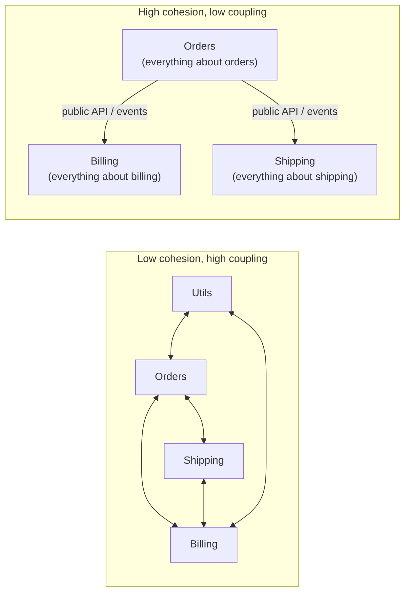

# Coupling, Cohesion, and Boundaries

*Good architecture puts things that change together in the same place, and keeps things that change separately apart.*

---

> *“Any organization that designs a system (defined broadly) will produce a design whose structure is a copy of the organization's communication structure.”*
>
> — **Melvin Conway**, "How Do Committees Invent?", 1968

## At a Glance

> **In one sentence:** Coupling is how much components depend on each other and cohesion is how closely a component's contents belong together — and good boundaries, drawn around business capabilities and design decisions likely to change, maximize cohesion inside each component while minimizing and stabilizing the coupling between them.

**You'll learn**

- Coupling and cohesion, and why they determine the cost of change
- Types of coupling: data, temporal, deployment, semantic
- Information hiding and stable interfaces
- Domain-Driven Design ideas: bounded contexts and ubiquitous language
- Dependency direction, the dependency inversion principle, and cycles
- Measuring and enforcing boundaries with fitness functions

**Before you start:** [What Is Software Architecture?](What-Is-Software-Architecture.md) · [Monoliths vs Microservices](Monoliths-vs-Microservices-The-Real-Tradeoffs.md)

**Reading time:** about 10 minutes

---

## The Big Picture



*On the left, every change ripples everywhere. On the right, each box can change internally without anyone else noticing.*

---

## Introduction

A developer is asked to add a new discount type. It should be a small change. But discount logic lives in the orders module, the checkout controller, a `utils/pricing.py` file, two database triggers, the invoice generator, and a nightly report. Three of those places have slightly different rules. The change takes two weeks and introduces a bug in invoices.

Nothing here is a "bad algorithm." It's **bad boundaries**. The concept of "pricing" was never given a home, so it spread everywhere, and everything became coupled to everything.

Coupling and cohesion are the two oldest and most useful ideas in software design. They explain why some codebases stay easy to change for decades while others become frozen within a few years.

### Why Should Engineers Care?

- The cost of every future change depends on how well boundaries were drawn.
- Boundaries decide which teams must coordinate — and how often.
- The same principles apply at every scale: functions, classes, modules, services, and organizations.

---

## The Problem It Solves

| Symptom | Underlying cause |
|--------|-----------------|
| Small changes touch many files and teams | Low cohesion: related logic scattered |
| Changing one module breaks unrelated ones | High coupling: hidden dependencies |
| Can't deploy one service without others | Deployment coupling |
| Can't test a module without the whole system | Dependencies on concrete implementations |
| Circular imports and "god" modules | Unmanaged dependency direction |
| Two teams argue about the meaning of "customer" | No bounded contexts |

---

## Historical Background

- **1968 — Conway's Law.** System structure mirrors organizational communication structure.
- **1972 — Information hiding.** David Parnas argued modules should hide design decisions likely to change behind stable interfaces.
- **1974–1979 — Structured design.** Larry Constantine, Glenford Myers, and Wayne Stevens formalized **coupling** and **cohesion** as design quality measures.
- **1990s–2000s — Object-oriented principles.** Robert C. Martin's SOLID principles, including the dependency inversion principle, and his package metrics (instability and abstractness).
- **2003 — Domain-Driven Design.** Eric Evans introduced **bounded contexts** and **ubiquitous language**, giving teams a way to draw boundaries around business meaning.
- **2010s — Microservices and team topologies** made boundaries organizational as well as technical (*Team Topologies*, Skelton and Pais, 2019).

---

## Core Concepts

### Cohesion

How strongly the elements inside a component belong together. High cohesion: a module that handles everything about invoices. Low cohesion: a `utils` module containing date helpers, PDF generation, and tax rules.

**Rule:** things that change for the same reason belong together.

### Coupling

How much one component depends on another. Some coupling is necessary — the point is to make it **small, explicit, and stable**.

| Type | Example | Risk |
|-----|--------|-----|
| Content coupling | Module reads another's internal tables or private fields | Any internal change breaks others |
| Data coupling via shared database | Services share tables | Schema changes need coordination |
| Semantic coupling | Both sides must understand the same hidden meaning (status codes, magic values) | Silent breakage |
| Temporal coupling | Caller needs the callee to be up right now | Cascading failures |
| Deployment coupling | Must release together | Slower delivery, riskier releases |
| API coupling (explicit, versioned) | Documented interface | Lowest, when stable |

### Information Hiding

Hide decisions likely to change — the database schema, the pricing algorithm, a third-party provider — behind an interface. Consumers depend on *what* the module does, not *how*.

### Dependency Direction

Dependencies should point toward **stable, abstract** things (business rules, interfaces) and away from **volatile, concrete** things (frameworks, databases, UI).

- **Dependency inversion principle:** high-level policy shouldn't depend on low-level details; both should depend on abstractions.
- **Hexagonal architecture (ports and adapters):** the core domain defines interfaces (ports); infrastructure implements them (adapters).
- **Acyclic dependencies:** module dependencies should form no cycles; cycles fuse modules into one untestable, undeployable lump.

### Instability Metric

Robert C. Martin's instability for a module: `I = Ce / (Ca + Ce)`, where `Ce` is outgoing dependencies and `Ca` is incoming. `I = 0` is maximally stable (many depend on it, it depends on nothing); `I = 1` is maximally unstable. Stable modules should be abstract; volatile modules should have few dependents.

### Bounded Contexts

In Domain-Driven Design, a bounded context is a boundary within which a model and its language are consistent. "Customer" in billing (payment methods, invoices) differs from "customer" in support (tickets, history). Rather than one giant shared model, each context has its own model, and contexts translate at their edges. Bounded contexts are natural candidates for modules, services, and team ownership.

### Boundaries and Teams

Conway's Law means boundaries that cut across teams create coordination costs. Good boundaries let one team own a capability end to end.

---

## Real-World Analogy

### Departments in a Company

A well-run company has departments with clear responsibilities (high cohesion) and simple, formal ways of working together — request forms, shared calendars, agreed processes (low, explicit coupling). If the finance team can change its internal spreadsheets without warning anyone, that's information hiding. If every department edits the same shared spreadsheet directly, one person's change can break everyone's work — that's a shared database.

---

## How It Works In Practice

### Drawing Boundaries

1. **Find the business capabilities:** ordering, payments, catalog, shipping, identity, notifications.
2. **Look for language differences:** where does "order" or "customer" mean something different? That's a boundary.
3. **Group by rate and reason of change:** things that change together stay together.
4. **Assign data ownership:** each piece of data has exactly one owner that writes it.
5. **Define interfaces:** APIs or events at each boundary; internals are private.
6. **Match teams:** each boundary has one owning team.

### Enforcing Boundaries

```
Architecture rules (checked in CI):
  - orders may depend on: payments.api, catalog.api
  - payments may not depend on: orders (use events instead)
  - no module may import another module's `internal` package
  - domain code may not import web or database frameworks
  - the module dependency graph must have no cycles
```

Tools such as import linters, ArchUnit (Java), and dependency-cruiser (JavaScript) turn these rules into tests.

### Breaking a Cycle

If `orders → payments` and `payments → orders`:

- Move the shared concept to a third module both depend on, **or**
- Invert one dependency with an interface owned by the depending module, **or**
- Replace one direction with an **event** (payments publishes "payment succeeded"; orders listens).

---

## Production Engineering Perspective

- **Shared databases are the most expensive coupling** in production: schema changes require coordinated deploys and migrations across teams.
- **Temporal coupling becomes outages:** synchronous dependencies need timeouts and fallbacks; events and queues reduce it.
- **Contract testing** catches API coupling breaks before deployment.
- **Change analysis:** track which modules are frequently changed together in version control ("change coupling") — it reveals hidden coupling better than diagrams.

---

## Tradeoffs

| Choice | Benefit | Cost |
|-------|--------|-----|
| Strict boundaries | Independent change, clear ownership | Some duplication; translation at edges |
| Shared libraries | Reuse | Coupling everyone to the library's releases |
| Events instead of calls | Less temporal coupling | Eventual consistency, harder debugging |
| One shared model | Simple at first | Becomes a bottleneck and source of conflicts |
| Separate models per context | Each fits its purpose | Mapping between contexts |

"Don't repeat yourself" applies within a boundary. Across boundaries, a little duplication is often better than coupling.

---

## Common Mistakes

### Beginner Mistakes

- `utils`, `common`, or `helpers` modules that grow without limit.
- Reaching into another module's internals because it's convenient.
- Organizing code only by technical layer (controllers, services, repositories) rather than by capability.

### Intermediate Mistakes

- Shared databases between services or modules.
- Circular dependencies between modules.
- One enterprise-wide "canonical" data model everyone must use.

### Senior-Level Mistakes

- Boundaries that don't match team ownership.
- Premature abstraction — interfaces for everything, even things that never change.
- Relying on documentation instead of automated enforcement.

---

## Failure Scenarios

### Scenario 1: The Shared Table

Five services read and write the `customers` table. A column rename requires coordinated releases across five teams and still breaks a nightly job nobody knew about.

**Fix:** one owner of customer data; others use an API or subscribe to events.

### Scenario 2: The Utils Monster

A `common` library used by every service includes business rules. Every change requires every service to upgrade; old versions linger with old rules.

**Fix:** keep shared libraries purely technical and small; put business rules in their owning module.

### Scenario 3: The Hidden Semantic Coupling

Service A sets `status = 7` to mean "on hold." Service B interprets 7 as "shipped." Nothing crashes; orders ship incorrectly.

**Fix:** explicit, documented, versioned contracts; meaningful enums; contract tests.

### Scenario 4: The Cycle

`orders` and `billing` import each other. Neither can be tested, deployed, or understood alone.

**Fix:** break the cycle with an interface, a shared abstraction, or events.

---

## Real-World Industry Examples

- **Amazon's API mandate**, as widely retold, required teams to expose functionality only through service interfaces — enforcing information hiding at organizational scale.
- **Shopify's modular monolith** uses automated boundary checks (they open-sourced a tool called Packwerk) to enforce component dependencies within one Ruby codebase.
- **Domain-Driven Design** is widely used to find service and module boundaries in complex business domains.
- **Team Topologies** describes stream-aligned teams owning end-to-end capabilities, aligning organizational and technical boundaries.

---

## Interview Questions

### Beginner

**Q1: What are coupling and cohesion?**

*Model answer:* Cohesion is how closely the parts of a component belong together — high cohesion means it has one clear responsibility. Coupling is how much components depend on each other — low, explicit coupling means changes stay local. Good design aims for high cohesion and low coupling.

### Intermediate

**Q2: Why is a shared database considered strong coupling?**

*Model answer:* Every component that reads or writes the tables depends on their structure and meaning. Changing the schema requires coordinating all of them, and one component can break another's data. It prevents independent evolution and deployment.

**Q3: How would you break a circular dependency between two modules?**

*Model answer:* Extract the shared concept into a module both depend on, invert one dependency using an interface owned by the high-level module, or replace one direction of calls with events so the dependency becomes one-way.

### Senior

**Q4: How do you find good boundaries in an existing messy codebase?**

*Model answer:* Look at business capabilities and language differences (bounded contexts), analyze change coupling in version history (files that change together), map data ownership, and interview teams about coordination pain. Then define target modules, enforce dependency rules in CI, and move code gradually.

### Architecture / Leadership

**Q5: How does Conway's Law affect architecture decisions?**

*Model answer:* The architecture will tend to mirror team communication structures. If boundaries cut across teams, those teams must coordinate constantly. So design boundaries and team ownership together — sometimes restructuring teams to achieve the desired architecture (the "inverse Conway maneuver").

---

## Hands-On Lab

Analyze a module dependency graph: compute instability, find cycles, and check architecture rules. Pure Python; save as `boundaries_lab.py` and run it.

```python
deps = {   # module -> modules it imports
    "web":       ["orders", "catalog", "payments", "utils"],
    "orders":    ["catalog", "payments", "utils"],
    "payments":  ["orders", "utils"],          # payments -> orders creates a cycle!
    "catalog":   ["utils"],
    "shipping":  ["orders", "utils"],
    "utils":     [],
}

# 1) Instability I = Ce / (Ca + Ce)
incoming = {m: 0 for m in deps}
for m, targets in deps.items():
    for t in targets:
        incoming[t] += 1
print(f"{'module':10} {'Ca(in)':>6} {'Ce(out)':>7} {'instability':>11}")
for m in deps:
    ca, ce = incoming[m], len(deps[m])
    print(f"{m:10} {ca:6} {ce:7} {ce / (ca + ce) if ca + ce else 0:11.2f}")

# 2) Cycle detection (depth-first search)
def find_cycles(graph):
    cycles, stack, visiting, done = [], [], set(), set()
    def visit(node):
        visiting.add(node); stack.append(node)
        for nxt in graph[node]:
            if nxt in visiting:
                cycles.append(stack[stack.index(nxt):] + [nxt])
            elif nxt not in done:
                visit(nxt)
        visiting.discard(node); done.add(node); stack.pop()
    for n in graph:
        if n not in done:
            visit(n)
    return cycles

print("\ncycles:", find_cycles(deps) or "none")

# 3) Architecture rules as a fitness function
forbidden = {("payments", "orders"): "payments must not depend on orders (use events)",
             ("catalog", "orders"): "catalog must not depend on orders"}
violations = [msg for (a, b), msg in forbidden.items() if b in deps.get(a, [])]
print("rule violations:", violations or "none")
```

**What to notice**
- `utils` is maximally stable (everyone depends on it, it depends on nothing) — so it must stay small and stable. `web` is maximally unstable, which is fine: nothing depends on it.
- The `orders ↔ payments` cycle fuses two modules into one. The fitness function catches the dependency that caused it.
- Fix the cycle by removing `"orders"` from `payments` (imagine payments now publishes a "payment succeeded" event), re-run, and watch the cycle and violation disappear. In a real project, run checks like this in CI.

---

## Test Yourself

*Answer each question in your head or on paper first, then open the answer to check.*

<details markdown="1">
<summary><strong>1. What does "high cohesion" mean?</strong></summary>

The elements of a component belong together and change for the same reasons — the component has one clear responsibility.

</details>

<details markdown="1">
<summary><strong>2. What is information hiding?</strong></summary>

Hiding design decisions likely to change behind a stable interface, so consumers don't depend on internal details.

</details>

<details markdown="1">
<summary><strong>3. What is temporal coupling?</strong></summary>

A dependency that requires another component to be available at the same moment (for example, a synchronous call), so its failure or slowness affects the caller.

</details>

<details markdown="1">
<summary><strong>4. How is Martin's instability metric calculated?</strong></summary>

I = Ce / (Ca + Ce), where Ce is outgoing dependencies and Ca is incoming dependencies.

</details>

<details markdown="1">
<summary><strong>5. What is a bounded context?</strong></summary>

A boundary within which a domain model and its terms have one consistent meaning; different contexts may model the same real-world concept differently.

</details>

<details markdown="1">
<summary><strong>6. Why are dependency cycles harmful?</strong></summary>

They make modules impossible to understand, test, build, or deploy independently — effectively fusing them into one.

</details>

<details markdown="1">
<summary><strong>7. When is duplication better than reuse?</strong></summary>

Across boundaries, when sharing would couple independently evolving components; a little duplicated code can be cheaper than coordinated changes.

</details>

---

## Cheat Sheet

**Goal:** high cohesion inside, low and explicit coupling between.

| Coupling type | Reduce it with |
|--------------|---------------|
| Content / shared internals | Public interfaces, private internals |
| Shared database | Single data owner, APIs, events |
| Semantic | Explicit contracts, enums, contract tests |
| Temporal | Async messaging, timeouts, fallbacks |
| Deployment | Backward-compatible APIs, independent pipelines |

**Boundary recipe:** business capabilities → language differences (bounded contexts) → change together? → one data owner → interfaces → one team.

**Rules to automate:** no cycles · no internal imports across modules · domain doesn't import frameworks · allowed-dependency lists.

**Instability:** I = Ce / (Ca + Ce) — stable modules should be abstract and small.

---

## In the AI Era

- **Boundaries help AI assistants.** A well-bounded module with a clear public interface fits in an assistant's context and can be changed safely; tangled code encourages changes that ripple unpredictably.
- **Fitness functions guard against AI-assisted erosion.** When code is generated quickly, automated dependency rules are the cheapest way to keep architecture intact.
- **Put AI behind a boundary.** Keep prompts, provider SDKs, and model-specific logic inside one module with a stable interface, so models and providers can change without touching the rest of the system. See [Where the Model Fits](Where-The-Model-Fits-Architecting-With-AI-Components.md).

**Try it:** Add an `ai_assistant` module to the lab that depends on `orders` and `catalog`. Should anything depend on `ai_assistant`? Write a rule that enforces your answer.

---

## Key Takeaways

1. Things that change together belong together; things that change separately should be apart.
2. Some coupling is necessary — keep it small, explicit, stable, and one-directional.
3. Hide decisions likely to change behind interfaces.
4. Shared databases and dependency cycles are the most damaging forms of coupling.
5. Use bounded contexts to draw boundaries around business meaning, aligned with teams.
6. Enforce boundaries automatically; documentation alone erodes.

---

## What to Read Next

- **[Event-Driven Architecture](Event-Driven-Architecture.md)** — reducing temporal coupling with events
- **[How To Refactor Large Systems](How-To-Refactor-Large-Systems.md)** — redrawing boundaries in existing systems
- **[Monoliths vs Microservices](Monoliths-vs-Microservices-The-Real-Tradeoffs.md)** — boundaries within one deployable or across many

---

## Further Reading

- **David Parnas — "On the Criteria To Be Used in Decomposing Systems into Modules" (1972)**
- **Melvin Conway — "How Do Committees Invent?" (1968):** [https://www.melconway.com/Home/Committees_Paper.html](https://www.melconway.com/Home/Committees_Paper.html)
- **Eric Evans — "Domain-Driven Design" (2003)** and **Vaughn Vernon — "Domain-Driven Design Distilled" (2016)**
- **Matthew Skelton & Manuel Pais — "Team Topologies" (2019)**
- **Robert C. Martin — "Clean Architecture" (2017)** — dependency rules and component metrics
- **Vlad Khononov — "Balancing Coupling in Software Design" (2024)**

---

*This chapter is part of the Modern Software Engineering Handbook — a comprehensive guide to the concepts, principles, and practices that every professional software engineer should know.*
