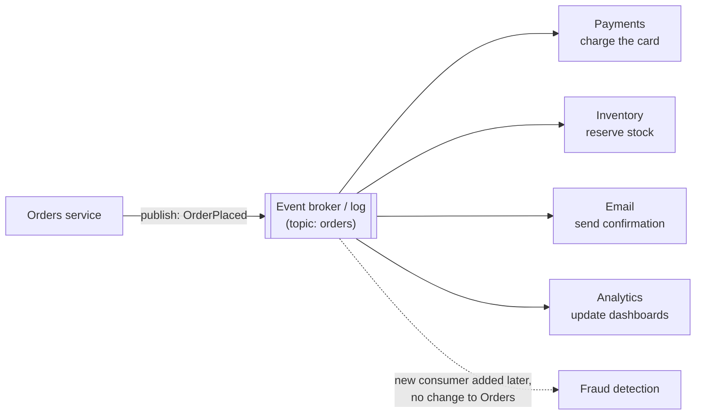
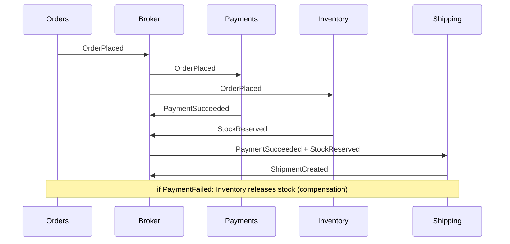

# Event-Driven Architecture

*Instead of telling other services what to do, announce what happened — and let anyone who cares react.*

---

> *“Data on the Outside versus Data on the Inside.”*
>
> — **Pat Helland**, paper title, CIDR 2005

## At a Glance

> **In one sentence:** In event-driven architecture, components publish immutable facts ("OrderPlaced," "PaymentFailed") to a broker or log, and other components subscribe and react independently — reducing temporal coupling and enabling new consumers without changing producers, at the cost of eventual consistency, duplicate and out-of-order delivery, and harder end-to-end reasoning.

**You'll learn**

- Events vs. commands vs. messages
- Event notification, event-carried state transfer, event sourcing, and CQRS
- Brokers and logs: queues, pub/sub, and Kafka-style partitioned logs
- Delivery guarantees, idempotent consumers, and ordering
- Choreography vs. orchestration for multi-step workflows
- Schema evolution, tracing, and the pitfalls of event-driven systems

**Before you start:** [Coupling, Cohesion, and Boundaries](Coupling-Cohesion-And-Boundaries.md) · [Consistency vs Availability](../05-Distributed-Systems/Consistency-vs-Availability.md)

**Reading time:** about 10 minutes

---

## The Big Picture



*The producer doesn't know or care who listens. Adding a consumer is a deployment, not a negotiation.*

---

## Introduction

An e-commerce checkout service starts simply: after saving an order, it calls the payment service, then inventory, then email, then analytics — all synchronously. Every new feature adds another call: loyalty points, fraud checks, the warehouse system, a partner feed. Checkout gets slower, and whenever any of those services is down, checkout fails. The checkout team is now a bottleneck: every new feature needs *their* code change.

The event-driven version flips the relationship. Checkout saves the order and publishes one fact: **"OrderPlaced."** Every interested service subscribes and does its own work. Checkout doesn't wait for emails or analytics, doesn't fail when the loyalty service is down, and doesn't change when a new consumer appears.

That flexibility is real. So are the new problems: events arrive twice, arrive late, arrive out of order, and "the order" is now spread across many services that agree only eventually. Event-driven architecture is powerful precisely when you design for those problems from the start.

### Why Should Engineers Care?

- Events are the backbone of modern integration: microservices, data pipelines, analytics, notifications, and audit trails.
- Understanding delivery guarantees prevents duplicate charges, lost updates, and inconsistent data.
- Choosing between events and direct calls is one of the most common architectural decisions.

---

## The Problem It Solves

| Problem with direct calls | Event-driven approach |
|--------------------------|----------------------|
| Caller waits for every downstream step | Publish and move on |
| Downstream outage breaks the caller | Broker buffers events until consumers recover |
| Producer must change to add consumers | Consumers subscribe independently |
| Spikes overload downstream services | Consumers process at their own pace |
| No history of what happened | Event log is an audit trail and can be replayed |

---

## Historical Background

- **1980s–1990s — Message-oriented middleware.** Enterprises used message queues (such as IBM MQ) to integrate systems reliably.
- **2001 — Java Message Service (JMS)** standardized messaging APIs; **2003 — *Enterprise Integration Patterns*** (Hohpe and Woolf) catalogued messaging patterns still used today.
- **2005 — Event sourcing** was described by Martin Fowler; **CQRS** was popularized by Greg Young around 2010.
- **2007 — RabbitMQ** (AMQP) became a popular open-source broker.
- **2011 — Apache Kafka**, created at LinkedIn, introduced the durable, partitioned, replayable log as a central integration backbone; Jay Kreps's 2013 essay "The Log" explained the idea.
- **2010s — Cloud messaging services** (such as Amazon SQS/SNS, Google Pub/Sub, Azure Event Hubs) and stream processing frameworks made event-driven designs widespread.
- **2019 — CloudEvents** became a CNCF specification for describing events in a common format.

---

## Core Concepts

### Events, Commands, and Messages

- **Event:** a fact about something that happened, named in the past tense ("OrderPlaced"). The producer doesn't expect a specific response.
- **Command:** a request for something to happen ("ChargeCard"), directed at one handler, which may refuse.
- **Message:** the envelope carrying either.

Events describe the producer's world; consumers decide what to do.

### Styles of Event Use

| Style | What the event carries | Trade-off |
|------|----------------------|----------|
| **Event notification** | Minimal data ("Order 123 placed") | Consumers call back for details — coupling returns |
| **Event-carried state transfer** | Full relevant data | Consumers keep local copies; bigger events, stale copies |
| **Event sourcing** | Every state change stored as an event; state is rebuilt from the log | Full history and replay; complex queries and schema evolution |
| **CQRS** | Separate write model and read models (often updated by events) | Optimized reads; eventual consistency between models |

### Queues vs. Logs

- **Queue** (for example, RabbitMQ, SQS): messages are consumed and removed; good for distributing work among workers.
- **Pub/sub topic:** each subscriber gets its own copy.
- **Log** (for example, Kafka): events are retained in order within **partitions**; many consumer groups read at their own positions and can **replay** history.

### Delivery Guarantees

| Guarantee | Meaning | Reality |
|----------|--------|--------|
| At most once | May lose messages, never duplicates | Rarely acceptable for business events |
| At least once | Never lose, may duplicate | The common default |
| Exactly once | Each message processed once | Only within specific systems; end-to-end it's achieved by at-least-once + idempotent processing |

### Idempotent Consumers

Because duplicates happen (retries, redeliveries, rebalances), consumers must make processing safe to repeat: record processed event IDs, use upserts, or check versions before applying changes.

### Ordering

Global ordering is expensive and rarely needed. Brokers like Kafka guarantee order **within a partition**, so events for the same entity (same order ID) should use the same partition key. Consumers should still handle out-of-order events using version numbers or timestamps from the source.

### The Outbox Pattern

Writing to a database and publishing an event are two separate operations; either can fail. The transactional outbox writes the event into an outbox table in the same database transaction as the state change, and a relay publishes it afterward — guaranteeing the event is published if and only if the change committed. (See [Designing A Payment System](../06-System-Design/Designing-A-Payment-System.md).)

### Choreography vs. Orchestration

- **Choreography:** services react to each other's events with no central controller. Flexible and decoupled, but the overall workflow is implicit and hard to see.
- **Orchestration:** a coordinator (workflow engine or saga orchestrator) tells services what to do and tracks progress. The workflow is explicit and easier to monitor, at the cost of a central component.

Long, business-critical workflows (order fulfillment, onboarding) often benefit from orchestration; simple fan-out notifications fit choreography.

### Schema Evolution

Events outlive the code that produced them. Use schemas (JSON Schema, Avro, Protobuf) with a registry, make changes backward-compatible (add optional fields, never repurpose fields), and version event types when meaning changes.

---

## Real-World Analogy

### A Newspaper vs. Phone Calls

Instead of phoning every person who might care about a piece of news (direct calls), you publish it in a newspaper (event broker). Anyone can subscribe; new readers don't require you to change how you write; readers read at their own pace, and back issues are archived (the log). But you can't be sure exactly when each reader sees the news, some may get two copies, and if you need a reply, a newspaper is the wrong tool.

---

## How It Works In Practice

### Designing an Event

```json
{
  "type": "order.placed",
  "id": "evt_01J8Z…",
  "source": "orders-service",
  "time": "2026-09-27T10:15:02Z",
  "subject": "order/881",
  "version": 3,
  "data": {
    "order_id": "881",
    "customer_id": "c-42",
    "total_minor": 250000,
    "currency": "INR",
    "items": [{"sku": "BOOK-7", "qty": 2}]
  }
}
```

A unique `id` enables deduplication; `version` (or sequence) enables ordering checks; `type` and a schema make evolution manageable.

### A Choreographed Order Flow



### Operating Event-Driven Systems

- **Monitor consumer lag** (how far behind each consumer is) — a key health signal.
- **Dead-letter queues** hold messages that repeatedly fail, for investigation and replay.
- **Trace context in events** lets distributed tracing follow a request through asynchronous hops.
- **Replay carefully:** consumers must be idempotent, and side effects (emails, charges) must not repeat.

---

## Production Engineering Perspective

- **The broker is critical infrastructure** — replicate it, monitor it, and plan capacity for peak event rates and retention.
- **Backpressure:** consumers that fall behind must be scaled or throttled; unbounded lag means stale data everywhere.
- **Poison messages** (events that always fail) must go to a dead-letter queue rather than blocking a partition forever.
- **Data retention and privacy:** event logs can hold personal data for a long time; plan deletion (for example, crypto-shredding or compaction) for regulatory requests.
- **Testing:** contract tests for event schemas; end-to-end tests for critical flows.

---

## Tradeoffs

| Benefit | Cost |
|--------|-----|
| Loose temporal coupling | Eventual consistency |
| Easy to add consumers | Hard to see the whole workflow |
| Buffering during outages and spikes | Consumer lag and staleness |
| Audit trail and replay | Duplicates, ordering, schema evolution |
| Independent scaling of consumers | More infrastructure to run |

**Use events when:** multiple consumers react to the same fact, work can happen later, or you need decoupling and history. **Use direct calls when:** you need an immediate answer or strong consistency.

---

## Common Mistakes

### Beginner Mistakes

- Assuming each event is delivered exactly once.
- Publishing an event before the database transaction commits (or after, without an outbox).
- Using events for request/response interactions that need an immediate answer.

### Intermediate Mistakes

- Events that are really commands in disguise ("SendEmailNow"), coupling producer to consumer.
- Breaking schema changes that crash old consumers.
- No dead-letter queue, so one bad message blocks processing.

### Senior-Level Mistakes

- Complex business workflows spread across dozens of choreographed services with no visibility.
- Event sourcing everywhere, including simple CRUD domains that don't need it.
- Treating the event log as a shared database that every team queries in its own way.

---

## Failure Scenarios

### Scenario 1: The Duplicate Email

A consumer crashes after sending a confirmation email but before committing its offset. On restart, it processes the event again and sends a second email.

**Fix:** record processed event IDs (idempotency) before or atomically with side effects; accept that some side effects need their own deduplication.

### Scenario 2: The Out-of-Order Update

"AddressChanged v2" arrives before "AddressChanged v1." The consumer applies v1 last and stores an old address.

**Fix:** partition by entity ID and check versions; ignore events older than the stored version.

### Scenario 3: The Lost Event

An order is saved, then the service crashes before publishing. Downstream services never learn about it.

**Fix:** the transactional outbox pattern.

### Scenario 4: The Invisible Workflow

An order gets stuck. Nobody can tell which of eight choreographed services dropped it.

**Fix:** correlation IDs and tracing across events, workflow dashboards, or orchestration for critical flows.

---

## Real-World Industry Examples

- **LinkedIn** created Apache Kafka to unify data flow between systems; Kafka is now used widely for event streaming.
- **Uber, Netflix, and many others** describe large Kafka-based event pipelines for real-time processing and analytics.
- **Workflow engines** such as Temporal (originating from Uber's Cadence) provide durable orchestration for long-running workflows.
- **CloudEvents** is a CNCF specification for a common event envelope across platforms.

---

## Interview Questions

### Beginner

**Q1: What's the difference between an event and a command?**

*Model answer:* An event states a fact that already happened ("OrderPlaced") and can have any number of interested consumers; the producer doesn't expect a particular reaction. A command asks a specific handler to do something ("ChargeCard"), and that handler may accept or reject it.

### Intermediate

**Q2: Why must event consumers be idempotent?**

*Model answer:* Most systems deliver at least once, so the same event can arrive more than once due to retries, crashes, or rebalances. Idempotent processing — deduplicating by event ID, upserting, or version checks — ensures duplicates don't cause double side effects.

**Q3: How do you keep events for the same entity in order?**

*Model answer:* Use the entity ID as the partition key so all its events land in one ordered partition, and include a version or sequence number so consumers can detect and ignore stale or out-of-order events.

### Senior

**Q4: When would you choose orchestration over choreography?**

*Model answer:* For long-running, business-critical workflows with many steps, compensations, timeouts, and a need for visibility — such as order fulfillment or account onboarding. An orchestrator makes the process explicit, monitorable, and easier to change. Choreography suits simpler fan-out reactions where services truly don't need coordination.

### Architecture / Leadership

**Q5: What governance do event-driven systems need at scale?**

*Model answer:* A schema registry with compatibility rules, naming and ownership conventions for topics and event types, documented contracts, standard envelopes (for example, CloudEvents), consumer-lag and dead-letter monitoring, tracing across events, retention and privacy policies, and guidance on when to use events versus direct calls.

---

## Hands-On Lab

Build a tiny event bus with at-least-once delivery and see why consumers must be idempotent and version-aware. Pure Python; save as `events_lab.py` and run it.

```python
import random
from collections import defaultdict
random.seed(6)

class Bus:
    """At-least-once delivery: sometimes redelivers, sometimes reorders."""
    def __init__(self): self.subscribers = defaultdict(list)
    def subscribe(self, topic, handler): self.subscribers[topic].append(handler)
    def publish(self, topic, events):
        deliveries = []
        for e in events:
            deliveries.append(e)
            if random.random() < 0.3:
                deliveries.append(e)                         # duplicate delivery
        random.shuffle(deliveries)                           # out-of-order delivery
        for e in deliveries:
            for handler in self.subscribers[topic]:
                handler(e)

emails_naive, emails_safe = [], []
seen_ids = set()
address_naive, address_safe = {}, {}

def naive_consumer(e):
    if e["type"] == "OrderPlaced":
        emails_naive.append(e["order"])
    if e["type"] == "AddressChanged":
        address_naive[e["customer"]] = e["address"]         # last write wins

def safe_consumer(e):
    if e["id"] in seen_ids:                                  # idempotency: skip duplicates
        return
    seen_ids.add(e["id"])
    if e["type"] == "OrderPlaced":
        emails_safe.append(e["order"])
    if e["type"] == "AddressChanged":
        current = address_safe.get(e["customer"], (0, None))
        if e["version"] > current[0]:                        # ignore stale versions
            address_safe[e["customer"]] = (e["version"], e["address"])

bus = Bus()
bus.subscribe("orders", naive_consumer)
bus.subscribe("orders", safe_consumer)

events = [{"id": f"o{i}", "type": "OrderPlaced", "order": i} for i in range(10)]
events += [{"id": f"a{v}", "type": "AddressChanged", "customer": "c-42",
            "version": v, "address": f"address #{v}"} for v in range(1, 4)]
bus.publish("orders", events)

print(f"orders placed: 10   emails sent - naive: {len(emails_naive)}, idempotent: {len(emails_safe)}")
print(f"final address - naive: {address_naive['c-42']!r}, version-aware: {address_safe['c-42'][1]!r}")
```

**What to notice**
- The naive consumer sends duplicate confirmation emails because the bus redelivered some events — normal behavior for at-least-once systems.
- The naive consumer may end with an old address because updates arrived out of order; the version-aware consumer always keeps the newest.
- Change `random.seed(6)` to other values: the naive results change run to run, while the safe consumer is always correct. Correctness must not depend on luck.
- In production, `seen_ids` lives in a durable store (often updated in the same transaction as the consumer's state change).

---

## Test Yourself

*Answer each question in your head or on paper first, then open the answer to check.*

<details markdown="1">
<summary><strong>1. Why are events named in the past tense?</strong></summary>

They record facts that already happened, not requests for action — the producer isn't telling anyone what to do.

</details>

<details markdown="1">
<summary><strong>2. What delivery guarantee do most messaging systems provide by default?</strong></summary>

At-least-once delivery, which means duplicates are possible.

</details>

<details markdown="1">
<summary><strong>3. How is "exactly once" achieved in practice end to end?</strong></summary>

At-least-once delivery combined with idempotent processing (deduplication, upserts, version checks).

</details>

<details markdown="1">
<summary><strong>4. What's the difference between a queue and a log like Kafka?</strong></summary>

A queue removes messages once consumed and distributes work; a log retains ordered events so multiple consumer groups can read independently and replay history.

</details>

<details markdown="1">
<summary><strong>5. What problem does the transactional outbox solve?</strong></summary>

The dual-write problem: it guarantees an event is published if and only if the database change committed.

</details>

<details markdown="1">
<summary><strong>6. What is consumer lag, and why monitor it?</strong></summary>

How far behind the latest event a consumer is. Growing lag means stale data and possible overload.

</details>

<details markdown="1">
<summary><strong>7. What is CQRS?</strong></summary>

Command Query Responsibility Segregation: separating the write model from one or more read models, often kept in sync with events.

</details>

---

## Cheat Sheet

| Concept | Remember it as |
|--------|---------------|
| Event | Past-tense fact, many consumers |
| Command | Request to one handler |
| Queue | Work distribution; consumed once |
| Log (Kafka) | Retained, ordered per partition, replayable |
| At-least-once | Default; duplicates happen |
| Idempotent consumer | Dedupe by ID, upsert, version check |
| Partition key | Same entity → same partition → ordered |
| Outbox | Publish iff the transaction committed |
| Choreography | Services react to events; implicit flow |
| Orchestration | Coordinator drives steps; explicit flow |

**Operate:** consumer lag · dead-letter queues · schema registry · trace context in events · retention and privacy plans.

---

## In the AI Era

- **Events are a natural trigger for AI work.** "TicketCreated" can trigger classification and summarization asynchronously, keeping slow model calls off the user's critical path.
- **AI consumers must be idempotent too.** Reprocessing an event shouldn't re-charge tokens needlessly or send a duplicate AI-generated reply — cache results by event ID.
- **Event logs make great evaluation data.** Past events and outcomes can be replayed against new prompts or models to compare behavior before rollout.
- **Agents as event-driven workers:** long-running agent tasks fit orchestration engines well, with durable state, retries, timeouts, and human approval steps.

**Try it:** Add a consumer to the lab that "summarizes" each order with a fake slow AI call. Make it idempotent so duplicates don't trigger a second call.

---

## Key Takeaways

1. Events announce facts; consumers react independently — reducing temporal coupling and enabling new consumers.
2. Delivery is usually at-least-once: design idempotent, version-aware consumers.
3. Order matters per entity; partition by entity ID and check versions.
4. Use the outbox pattern to publish reliably from transactional systems.
5. Choose choreography for simple reactions and orchestration for critical multi-step workflows.
6. Govern schemas, monitor consumer lag, and trace events end to end.

---

## What to Read Next

- **[How To Refactor Large Systems](How-To-Refactor-Large-Systems.md)** — events as a tool for incremental migration
- **[Designing A Payment System](../06-System-Design/Designing-A-Payment-System.md)** — outbox and idempotency in a critical domain
- **[Consistency vs Availability](../05-Distributed-Systems/Consistency-vs-Availability.md)** — the consistency models events imply

---

## Further Reading

- **Gregor Hohpe & Bobby Woolf — "Enterprise Integration Patterns" (2003):** [https://www.enterpriseintegrationpatterns.com](https://www.enterpriseintegrationpatterns.com)
- **Jay Kreps — "The Log: What every software engineer should know about real-time data's unifying abstraction" (2013)**
- **Martin Fowler — "What do you mean by 'Event-Driven'?" (2017):** [https://martinfowler.com/articles/201701-event-driven.html](https://martinfowler.com/articles/201701-event-driven.html)
- **Pat Helland — "Data on the Outside versus Data on the Inside" (CIDR 2005)**
- **Martin Kleppmann — "Designing Data-Intensive Applications,"** chapter on stream processing
- **CloudEvents specification:** [https://cloudevents.io](https://cloudevents.io)

---

*This chapter is part of the Modern Software Engineering Handbook — a comprehensive guide to the concepts, principles, and practices that every professional software engineer should know.*
