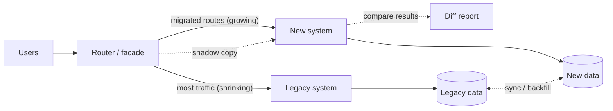

# How To Refactor Large Systems

*Big rewrites usually fail. Large systems are changed the way cities are rebuilt — one street at a time, while people keep living there.*

---

> *“Any fool can write code that a computer can understand. Good programmers write code that humans can understand.”*
>
> — **Martin Fowler**, *Refactoring: Improving the Design of Existing Code*, 1999

## At a Glance

> **In one sentence:** Large systems are best improved incrementally — protect behavior with tests and observability, find seams, redirect traffic piece by piece to new implementations using patterns like the strangler fig, branch by abstraction, parallel runs, and feature flags, and retire old code as you go — instead of betting everything on a big-bang rewrite.

**You'll learn**

- Why big rewrites so often fail
- Characterization tests and making legacy code safe to change
- Seams, branch by abstraction, and the strangler fig pattern
- Parallel runs (shadow traffic) and dark launches
- Data migrations: dual writes, backfills, and verification
- How to plan, prioritize, and finish large refactors

**Before you start:** [Coupling, Cohesion, and Boundaries](Coupling-Cohesion-And-Boundaries.md) · [Deployments: Strategies and Risks](../11-Production-Engineering/Deployments-Strategies-And-Risks.md)

**Reading time:** about 10 minutes

---

## The Big Picture



*The strangler fig: new code grows around the old system, taking over one route at a time, until the old system can be removed.*

---

## Introduction

A company decides its ten-year-old monolith is too hard to change and starts a rewrite. The new system will use modern technology and a clean design. The plan: two years, then switch over.

Two years later, the new system is only 60% done. Meanwhile, the old system kept changing — the business couldn't pause for two years — so the rewrite is chasing a moving target. Nobody remembers all the edge cases the old system handles; they were never written down, only encoded in years of bug fixes. The switchover, when it finally happens, causes weeks of incidents. Some rewrites are abandoned entirely.

In 2000, Joel Spolsky famously called rewriting from scratch "the single worst strategic mistake that any software company can make," pointing to Netscape's rewrite as an example. The warning holds up: old code contains years of hard-won knowledge.

The alternative is less dramatic and far more successful: **change the system incrementally**, keeping it working and delivering value at every step.

### Why Should Engineers Care?

- Most engineering time is spent changing existing systems, not building new ones.
- Incremental refactoring lets you improve architecture without stopping feature work.
- These techniques reduce the risk of migrations — databases, frameworks, cloud providers, service extractions.

---

## The Problem It Solves

| Big-bang rewrite | Incremental refactoring |
|-----------------|------------------------|
| Value delivered only at the end | Value delivered continuously |
| Chasing a moving target | Old and new evolve together |
| Hidden edge cases rediscovered in production | Behavior compared continuously |
| One high-risk cutover | Many small, reversible steps |
| Easy to cancel halfway with nothing to show | Every step leaves the system better |

---

## Historical Background

- **1990s — Refactoring formalized.** William Opdyke's 1992 thesis and Martin Fowler's *Refactoring* (1999) defined refactoring as small, behavior-preserving transformations.
- **2000 — "Things You Should Never Do, Part I."** Joel Spolsky's essay warned against full rewrites.
- **2004 — Michael Feathers' *Working Effectively with Legacy Code*** defined legacy code as code without tests and introduced **seams** and **characterization tests**.
- **2004 — Strangler fig application.** Martin Fowler named the pattern after strangler fig vines that gradually grow around a host tree; he later renamed it "strangler fig application."
- **2007 — Branch by abstraction** was described by Paul Hammant as a way to make large changes on trunk.
- **2010s — Parallel runs and dark launching** became standard for high-risk migrations; GitHub's Scientist library (open-sourced in 2016) popularized running old and new code side by side and comparing results.

---

## Core Concepts

### Refactoring, Precisely

Refactoring means changing structure **without changing behavior**, in small steps, each verified. Changing behavior is a separate step. Mixing the two makes both risky.

### Characterization Tests

For legacy code without tests, write tests that capture what the code *currently* does — even if it looks wrong — so you notice when you change it. They document real behavior, bugs included.

### Seams

A seam is a place where you can change behavior without editing the code there: an interface, a configuration point, a function parameter, a network boundary. Creating seams is often the first step in making legacy code testable and replaceable.

### Branch by Abstraction

1. Introduce an abstraction (interface) in front of the code you want to replace.
2. Make all callers use the abstraction.
3. Build the new implementation behind the same abstraction.
4. Switch callers gradually (feature flags), then remove the old implementation.

All on the main branch, with the system always releasable.

### Strangler Fig

Put a facade or router in front of the legacy system. Implement new functionality — or re-implement old functionality — in the new system, and route those requests to it. Over time, the new system handles more routes until the legacy system can be switched off.

### Parallel Run (Shadow Traffic)

Send the same input to both old and new implementations; return the old result to users; compare results in the background. Differences reveal missed edge cases before any user is affected.

### Data Migration Patterns

- **Dual writes:** write to old and new stores (ideally via an outbox or change data capture rather than two direct writes).
- **Backfill:** copy historical data to the new store.
- **Verify:** compare records and aggregates between stores.
- **Switch reads**, then **switch writes**, then **retire** the old store.

### Finish What You Start

A half-finished migration — two systems doing the same job forever — is often worse than either system alone. Plan and fund the final step: deleting the old code and data.

---

## Real-World Analogy

### Renovating a House While Living in It

You don't demolish your home and live in a tent for two years. You renovate one room at a time: set up a temporary kitchen, rebuild the real one, move back, then tackle the bathroom. The house stays livable throughout. You also check what's behind each wall before knocking it down (characterization tests), because old houses hide surprises — plumbing that was rerouted decades ago for reasons nobody remembers.

---

## How It Works In Practice

### A Strangler Fig Migration Plan

1. **Map the legacy system:** endpoints, traffic, dependencies, data, and business value per area.
2. **Add the facade:** route all traffic through a proxy or router you control.
3. **Improve observability:** metrics per route on both systems.
4. **Pick the first slice:** valuable, well-bounded, low-risk (often a read-only feature).
5. **Build it in the new system;** parallel-run and compare.
6. **Shift traffic gradually** (1% → 10% → 100%) with quick rollback.
7. **Repeat** for the next slice; prioritize by value and risk.
8. **Retire** legacy routes, code, and data as they become unused.

### Prioritizing What to Refactor

Refactor where **pain × change frequency** is highest: code that is both hard to work with *and* frequently changed. A messy module nobody touches can wait. Version control history reveals "hotspots" (files that change often and are complex).

### Making Refactoring Part of Normal Work

- **Boy Scout rule:** leave code a little better than you found it.
- **Preparatory refactoring:** before adding a feature, refactor to make the feature easy to add.
- **Dedicated capacity** for larger structural work, tracked like features, with clear outcomes.

---

## Production Engineering Perspective

- **Observability first:** you can't safely migrate what you can't measure. Compare error rates, latencies, and business metrics between old and new paths.
- **Shadow traffic side effects:** the new path must not send duplicate emails or charges during parallel runs — disable or stub side effects.
- **Rollback at every step:** feature flags and routing rules make each step reversible.
- **Data verification** is essential: count, checksum, and sample-compare records after backfills and during dual writes.
- **Communicate timelines** to dependent teams; migrations fail as often from coordination problems as from technical ones.

---

## Tradeoffs

| Approach | Benefit | Cost |
|---------|--------|-----|
| Big-bang rewrite | Clean slate; no legacy constraints | High risk; long time without value; moving target |
| Strangler fig | Incremental value, low risk | Running two systems for a while; routing complexity |
| Branch by abstraction | Always releasable; in-codebase migration | Temporary indirection |
| Parallel run | Catches edge cases safely | Extra compute; handling side effects |
| Dual writes | Keeps stores in sync | Consistency risks; needs verification |

---

## Common Mistakes

### Beginner Mistakes

- Mixing refactoring and behavior changes in one commit.
- Refactoring without tests.
- Renaming or moving large amounts of code in one huge change.

### Intermediate Mistakes

- Starting a rewrite without understanding the old system's behavior.
- Shadowing traffic without disabling side effects.
- Migrating data without verification.

### Senior-Level Mistakes

- Big-bang rewrites justified by technology fashion rather than measured pain.
- Never finishing migrations, leaving multiple systems doing the same job.
- Refactoring low-value code while hotspots remain.

---

## Failure Scenarios

### Scenario 1: The Endless Rewrite

A rewrite runs two years over schedule while the legacy system keeps changing. The project is canceled with nothing delivered.

**Better:** strangler fig with value delivered every few weeks.

### Scenario 2: The Forgotten Edge Case

The new tax calculation ignores a rounding rule the old code applied for one region. It's discovered after launch through customer complaints.

**Better:** parallel runs comparing results across real traffic before switching.

### Scenario 3: The Double Charge in Shadow Mode

The shadow implementation of checkout calls the real payment provider.

**Better:** stub or disable side effects in shadow mode; compare decisions, not actions.

### Scenario 4: The Two Systems Forever

After migrating 90% of routes, the team moves on. The legacy system still runs the last 10%, costs money, and needs security patches.

**Better:** plan and fund the final 10% and the decommissioning.

---

## Real-World Industry Examples

- **GitHub's Scientist library (open-sourced in 2016)** runs old and new code paths side by side and reports mismatches; GitHub used it for risky refactors such as permission checks.
- **The strangler fig pattern** is widely used for mainframe and monolith modernization, often with an API gateway or proxy as the routing layer.
- **Shopify** described extracting and modularizing parts of its monolith incrementally rather than rewriting it.
- **Netscape's rewrite** of its browser in the late 1990s is often cited (for example, by Joel Spolsky) as a cautionary tale about full rewrites.

---

## Interview Questions

### Beginner

**Q1: What is refactoring?**

*Model answer:* Changing the internal structure of code without changing its external behavior, in small, safe steps verified by tests — to make it easier to understand and change.

### Intermediate

**Q2: What is the strangler fig pattern?**

*Model answer:* Placing a routing layer in front of a legacy system and gradually implementing functionality in a new system, routing more and more traffic to it until the legacy system can be retired — avoiding a single big-bang cutover.

**Q3: How do you refactor code that has no tests?**

*Model answer:* First write characterization tests that capture current behavior, create seams where needed to make code testable, then refactor in small steps, running the tests after each. Where tests are hard, use parallel runs in production to compare old and new behavior.

### Senior

**Q4: How would you migrate a service to a new database without downtime?**

*Model answer:* Set up change data capture or dual writes (preferably via an outbox) to the new database, backfill historical data, verify counts and samples continuously, shadow-read from the new database and compare, switch reads gradually behind a flag, then switch writes, keep the old database in sync for rollback for a period, and finally decommission it.

### Architecture / Leadership

**Q5: A team proposes rewriting a core system from scratch. How do you evaluate it?**

*Model answer:* Ask what specific problems the rewrite solves and whether incremental approaches could solve them; how the team will capture existing behavior and edge cases; how the business will keep changing during the rewrite; when the first value is delivered; and what the rollback plan is. Usually I'd push for a strangler fig approach with the same end goal, delivering value in slices and reducing risk.

---

## Hands-On Lab

Simulate a strangler fig migration with a parallel run: the new implementation shadows the old one, differences are reported, and traffic shifts gradually. Pure Python; save as `strangler_lab.py` and run it.

```python
import random, hashlib
random.seed(2)

def legacy_shipping_fee(order):
    fee = 50 if order["weight_kg"] <= 1 else 50 + 20 * (order["weight_kg"] - 1)
    if order["region"] == "north-east":                   # a rule added years ago, undocumented
        fee += 30
    return round(fee)

def new_shipping_fee(order):
    fee = 50 + 20 * max(0, order["weight_kg"] - 1)          # clean rewrite... missing the region rule
    return round(fee)

orders = [{"id": i, "weight_kg": random.choice([0.5, 1, 2, 3.5]),
           "region": random.choice(["south", "west", "north", "north-east"])} for i in range(1_000)]

# Phase 1: parallel run (shadow) - users always get the legacy answer
mismatches = [(o, legacy_shipping_fee(o), new_shipping_fee(o)) for o in orders
              if legacy_shipping_fee(o) != new_shipping_fee(o)]
print(f"shadow run: {len(mismatches)} of {len(orders)} results differ")
for o, old, new in mismatches[:3]:
    print(f"  order {o['id']}: region={o['region']:10} weight={o['weight_kg']}  legacy={old} new={new}")

# Phase 2: after fixing the new code, route a growing percentage of users to it
def new_shipping_fee_fixed(order):
    return new_shipping_fee(order) + (30 if order["region"] == "north-east" else 0)

def route(order, percent):
    bucket = int(hashlib.sha256(str(order["id"]).encode()).hexdigest(), 16) % 100
    return new_shipping_fee_fixed if bucket < percent else legacy_shipping_fee

for percent in [1, 10, 50, 100]:
    served_new = sum(route(o, percent) is new_shipping_fee_fixed for o in orders)
    wrong = sum(route(o, percent)(o) != legacy_shipping_fee(o) for o in orders)
    print(f"rollout {percent:3}%: {served_new:4} orders on new code, {wrong} differences")
```

**What to notice**
- The clean rewrite silently dropped an undocumented regional surcharge — exactly the kind of hidden knowledge old code carries. The shadow run found it before any customer was affected.
- After the fix, traffic moves gradually with zero differences at every step; at 100%, the legacy function can be deleted.
- In real systems, the comparison runs in production on live traffic, and differences are logged and investigated — sometimes they reveal bugs in the *old* code, which then need a deliberate decision.

---

## Test Yourself

*Answer each question in your head or on paper first, then open the answer to check.*

<details markdown="1">
<summary><strong>1. Why do big-bang rewrites often fail?</strong></summary>

They deliver no value until the end, chase a moving target as the old system keeps changing, lose undocumented behavior, and end in a single high-risk cutover.

</details>

<details markdown="1">
<summary><strong>2. What is a characterization test?</strong></summary>

A test that captures what existing code currently does (including quirks), so any change in behavior during refactoring is detected.

</details>

<details markdown="1">
<summary><strong>3. What is a seam?</strong></summary>

A place where behavior can be changed without editing the code at that point — for example, an interface, configuration, or network boundary.

</details>

<details markdown="1">
<summary><strong>4. Describe branch by abstraction in four steps.</strong></summary>

Add an abstraction in front of the old code, move callers onto it, build the new implementation behind it, then switch gradually and remove the old implementation.

</details>

<details markdown="1">
<summary><strong>5. What must you watch for in shadow (parallel) runs?</strong></summary>

Side effects: the shadow path must not send emails, charge cards, or write to production data.

</details>

<details markdown="1">
<summary><strong>6. How do you choose what to refactor first?</strong></summary>

Focus on hotspots — code that is both hard to change and changed frequently — and on slices with high value and low risk.

</details>

<details markdown="1">
<summary><strong>7. Why plan the final decommissioning step?</strong></summary>

Unfinished migrations leave two systems doing the same job, doubling cost, complexity, and security exposure.

</details>

---

## Cheat Sheet

**Principles:** small steps · behavior-preserving · tests first · always releasable · measure old vs. new · finish the job.

| Technique | Use for |
|----------|--------|
| Characterization tests | Locking in legacy behavior |
| Seams | Making code testable and replaceable |
| Branch by abstraction | Large in-codebase replacements |
| Strangler fig | Replacing a system route by route |
| Parallel run / shadow | Catching hidden behavior differences |
| Feature flags | Gradual, reversible switching |
| Dual writes + backfill + verify | Data migrations |

**Prioritize:** pain × change frequency. **Never:** mix refactoring with behavior change in one step.

---

## In the AI Era

- **AI is very good at mechanical refactoring** — renames, extractions, framework upgrades — when tests exist to verify behavior. Without tests, it can confidently change behavior.
- **Use AI to understand legacy code:** explaining unfamiliar modules, drafting characterization tests, and summarizing hidden business rules — then verify with parallel runs.
- **"Let's have AI rewrite it all" is still a big-bang rewrite.** The risks — lost edge cases, moving targets, risky cutover — don't disappear because code is generated faster. Use AI within an incremental strategy.
- **Parallel runs work for AI migrations too:** when replacing rules with a model (or one model with another), shadow the new version and compare decisions before switching.

**Try it:** Ask an AI assistant to write characterization tests for `legacy_shipping_fee` in the lab. Does it discover the regional rule? What would it have missed if the rule depended on a database lookup?

---

## Key Takeaways

1. Prefer incremental refactoring to big-bang rewrites; keep the system working and delivering value.
2. Protect behavior with characterization tests and observability before changing structure.
3. Create seams; use branch by abstraction and the strangler fig to replace pieces gradually.
4. Parallel runs reveal hidden behavior differences safely — without side effects.
5. Migrate data with dual writes, backfills, and continuous verification.
6. Prioritize hotspots, and finish migrations by deleting the old system.

---

## What to Read Next

- **[Where the Model Fits: Architecting With AI Components](Where-The-Model-Fits-Architecting-With-AI-Components.md)** — adding AI to existing systems safely
- **[Deployments: Strategies and Risks](../11-Production-Engineering/Deployments-Strategies-And-Risks.md)** — feature flags and gradual rollout
- **[Event-Driven Architecture](Event-Driven-Architecture.md)** — using events to decouple during migrations

---

## Further Reading

- **Martin Fowler — "Refactoring" (2nd edition, 2018)**
- **Michael Feathers — "Working Effectively with Legacy Code" (2004)**
- **Martin Fowler — "StranglerFigApplication":** [https://martinfowler.com/bliki/StranglerFigApplication.html](https://martinfowler.com/bliki/StranglerFigApplication.html)
- **Paul Hammant — "Branch by Abstraction"** and Martin Fowler's bliki entry: [https://martinfowler.com/bliki/BranchByAbstraction.html](https://martinfowler.com/bliki/BranchByAbstraction.html)
- **GitHub — Scientist library:** [https://github.com/github/scientist](https://github.com/github/scientist)
- **Joel Spolsky — "Things You Should Never Do, Part I" (2000):** [https://www.joelonsoftware.com/2000/04/06/things-you-should-never-do-part-i/](https://www.joelonsoftware.com/2000/04/06/things-you-should-never-do-part-i/)

---

*This chapter is part of the Modern Software Engineering Handbook — a comprehensive guide to the concepts, principles, and practices that every professional software engineer should know.*
