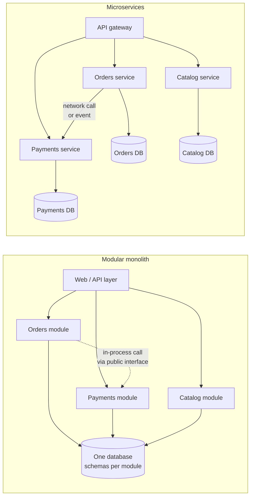

# Monoliths vs Microservices: The Real Tradeoffs

*Microservices solve organizational scaling problems by accepting distributed-systems problems. Choose them for the first reason, knowing you'll pay for the second.*

---

> *“You shouldn't start a new project with microservices, even if you're sure your application will be big enough to make it worthwhile.”*
>
> — **Martin Fowler**, "MonolithFirst," 2015

## At a Glance

> **In one sentence:** A monolith is one deployable unit and a microservices architecture is many independently deployable services, and the real trade-off is team autonomy and independent scaling versus the costs of network calls, distributed data, operational overhead, and harder debugging — which is why a well-structured modular monolith is the right starting point for most products.

**You'll learn**

- What monoliths, modular monoliths, and microservices really are
- What microservices actually buy you — and what they cost
- The "distributed monolith" anti-pattern
- Data ownership and consistency across services
- How team structure (Conway's Law) drives the decision
- When and how to extract services from a monolith

**Before you start:** [What Is Software Architecture?](What-Is-Software-Architecture.md) · [Why Distributed Systems Are Hard](../05-Distributed-Systems/Why-Distributed-Systems-Are-Hard.md)

**Reading time:** about 10 minutes

---

## The Big Picture



*The same boundaries can exist in both. The difference is whether crossing a boundary is a function call or a network call — and who can deploy what, independently.*

---

## Introduction

In 2014, microservices were the future. Conference talks showed diagrams of hundreds of small services at Netflix and Amazon. Many teams — including five-person startups — split their applications into dozens of services.

A few years later, a different story emerged. Teams spent more time on infrastructure, service discovery, distributed tracing, and debugging network failures than on features. Simple changes required coordinated deployments of several services. Data was duplicated and inconsistent. Some companies publicly moved back to monoliths or consolidated services — for example, the team behind Amazon Prime Video's audio/video monitoring tool described in 2023 how moving a specific workload from distributed serverless components back into a single process cut its costs by about 90%.

Neither "microservices are the future" nor "monoliths are better" is the lesson. The lesson is that microservices are a **trade-off** — a specific solution to specific problems, mostly organizational — and they carry large, predictable costs.

### Why Should Engineers Care?

- This is one of the most consequential and hard-to-reverse architectural decisions.
- Many engineers work in systems that chose microservices too early — or monoliths that should have been split.
- Understanding the real trade-offs lets you argue from evidence rather than fashion.

---

## The Problem It Solves

Microservices address problems that appear as organizations grow:

| Problem in a large monolith | How microservices help |
|----------------------------|-----------------------|
| Hundreds of engineers in one codebase step on each other | Teams own separate services |
| Every release bundles everyone's changes | Services deploy independently |
| One component's load forces scaling everything | Scale services independently |
| One bug or memory leak crashes everything | Failures can be isolated |
| One technology stack for all problems | Teams can choose appropriate technologies |

If you don't have these problems, microservices mostly add cost.

---

## Historical Background

- **1990s–2000s — Monoliths and SOA.** Most applications were monoliths; large enterprises adopted service-oriented architecture with enterprise service buses, often heavyweight.
- **Early 2000s — Amazon** reorganized around small teams owning services with well-defined APIs, a practice widely cited as an early form of microservices.
- **2011–2014 — Microservices named.** The term spread in software architecture circles; James Lewis and Martin Fowler's 2014 article "Microservices" defined its characteristics.
- **2013–2016 — Enabling technology.** Docker (2013), Kubernetes (2014), and cloud platforms made running many services practical; Netflix open-sourced much of its microservices tooling.
- **2015 — "MonolithFirst."** Fowler cautioned against starting with microservices.
- **Late 2010s–2020s — Correction.** Concepts like the **modular monolith** gained traction; companies including Shopify described large modular monoliths, and several organizations published accounts of consolidating services.

---

## Core Concepts

### Definitions

- **Monolith:** one deployable unit containing all functionality. Not necessarily messy.
- **Modular monolith:** one deployable unit with strong internal module boundaries, explicit interfaces, and data owned per module.
- **Microservices:** independently deployable services, each owning its data, communicating over the network, typically owned by one team.
- **Distributed monolith:** multiple services that must be deployed together and share data or tightly coupled APIs — the costs of both, the benefits of neither.

### What Microservices Buy

- **Independent deployment** per team.
- **Independent scaling** of hot components.
- **Fault isolation** (if designed with timeouts, bulkheads, fallbacks).
- **Technology flexibility.**
- **Clear ownership** aligned with teams.

### What Microservices Cost

| Cost | Why |
|-----|----|
| Network latency and failure | Every cross-service call can be slow or fail |
| Distributed data | No cross-service joins or transactions; eventual consistency |
| Operational overhead | Deployment, monitoring, tracing, service discovery per service |
| Debugging difficulty | Problems span services and teams |
| Testing complexity | Contract tests, integration environments |
| Duplication | Shared logic and models copied or versioned across services |
| Organizational coordination | API changes need versioning and communication |

### Availability Math

Synchronous chains multiply failure probability. If a request needs six services in series, each 99.9% available, the chain is about 99.4% available (0.999⁶) — roughly six times the downtime of one service. Latency adds up the same way.

### Data Ownership

Each service owns its data; others access it only through its API or events. This is the hardest part of microservices: queries that were simple joins become API compositions or replicated read models, and transactions become sagas with compensating actions.

### Conway's Law and the "Inverse Conway Maneuver"

Architecture mirrors team structure. Microservices work best when service boundaries match team boundaries. Organizations sometimes restructure teams deliberately to get the architecture they want.

### Service Size

"Micro" is misleading. Good services are sized around a **business capability** that one team can own — not around the smallest possible function. Very small services multiply network calls and operational costs.

---

## Real-World Analogy

### One Big Kitchen vs. Food Court

A single restaurant kitchen (monolith) is efficient: everyone shares ingredients, cooks coordinate by talking, and one menu is simple to manage. As it grows to hundreds of cooks, people collide, and changing one dish requires coordinating everyone.

A food court (microservices) lets each stall run independently, with its own menu, staff, and hours. But now every stall needs its own equipment and staff, a combined meal requires visiting several counters, and if the shared payment system fails, every stall is affected. A food court makes sense for a large mall — not for a family restaurant.

---

## How It Works In Practice

### A Decision Guide

Start with a **modular monolith** unless several of these are true:

- Multiple teams (commonly several teams of 5–10 engineers) are blocked by each other's releases.
- Components have very different scaling or reliability needs.
- Clear, stable domain boundaries have emerged.
- You have platform capabilities: CI/CD per service, observability, service discovery, on-call per team.
- The organization can staff ownership for each service.

### Building a Good Modular Monolith

- Organize code by **business capability** (orders, payments, catalog), not technical layer.
- Modules expose explicit public interfaces; internals are private.
- Each module owns its tables; no cross-module table access.
- Enforce rules with automated checks (dependency linting, architecture tests).
- Communicate between modules through interfaces or in-process events — making later extraction easier.

### Extracting a Service (When It's Time)

1. Pick a module with a clear boundary, independent data, and a real reason to split (team autonomy, scaling).
2. Make it a clean module inside the monolith first.
3. Move its data to a separate store; replace direct table access with API calls or events.
4. Deploy it separately; route traffic gradually (see [How To Refactor Large Systems](How-To-Refactor-Large-Systems.md)).
5. Add timeouts, retries, circuit breakers, and observability for the new network boundary.

---

## Production Engineering Perspective

- **Platform first:** before many services, invest in a paved road — templates, CI/CD, logging, tracing, metrics, alerts, service discovery, and secrets management.
- **Every service needs an owner and on-call.** Unowned services become outages waiting to happen.
- **API versioning and contract tests** prevent breaking consumers.
- **Resilience patterns** (timeouts, circuit breakers, bulkheads) are mandatory once calls cross the network.
- **Cost visibility:** many services with idle capacity can cost far more than a monolith.

---

## Tradeoffs

| Dimension | Modular monolith | Microservices |
|----------|-----------------|--------------|
| Development speed (small team) | Fast | Slower (infrastructure overhead) |
| Team independence (large org) | Limited | High |
| Deployment | Simple, all together | Independent, more complex |
| Data consistency | ACID transactions | Eventual consistency, sagas |
| Performance | In-process calls | Network latency |
| Failure modes | Whole-app crashes | Partial failures, cascades |
| Observability | Easier | Requires distributed tracing |
| Scaling | Whole app | Per service |
| Cost | Lower | Higher (overhead per service) |

---

## Common Mistakes

### Beginner Mistakes

- Starting a new product with dozens of services.
- Splitting by technical layer ("user service," "database service") instead of business capability.
- Sharing one database across services.

### Intermediate Mistakes

- Long synchronous call chains between services.
- Services that must always be deployed together (distributed monolith).
- No distributed tracing, so debugging is guesswork.

### Senior-Level Mistakes

- Service boundaries that don't match team boundaries.
- Adopting microservices without platform investment.
- Treating "rewrite as microservices" as the fix for a messy monolith — messy boundaries become messy network calls.

---

## Failure Scenarios

### Scenario 1: The Distributed Monolith

Twelve services share a database and call each other synchronously. Every release requires coordinating five teams. One slow service stalls the others.

**Fix:** clarify ownership, split data, introduce asynchronous events, or merge tightly coupled services back together.

### Scenario 2: The Chatty Page

A product page calls eight services in sequence; p99 latency is two seconds and availability suffers.

**Fix:** parallelize calls, build read models or a backend-for-frontend, and reduce synchronous dependencies.

### Scenario 3: The Consistency Surprise

An order is created in the orders service, but the inventory service's update fails. There's no cross-service transaction; stock is wrong.

**Fix:** sagas with compensating actions, the outbox pattern, and idempotent consumers.

### Scenario 4: The Startup Infrastructure Tax

A small team spends most of its time maintaining Kubernetes, service mesh, and pipelines for 20 services. Features slow down.

**Fix:** consolidate into a modular monolith until organizational scale requires more.

---

## Real-World Industry Examples

- **Amazon** is often cited for its early move to small teams owning services with strict API boundaries.
- **Netflix** runs a large microservices architecture supported by extensive platform and resilience tooling.
- **Shopify** has described running a large modular monolith with enforced component boundaries.
- **Amazon Prime Video (2023)** published how moving a specific monitoring workload from distributed serverless components into a single application reduced its infrastructure cost by about 90% — a reminder that architecture choices depend on the workload.
- **Segment (2018)** described consolidating many microservices back into a single service to reduce operational burden.

---

## Interview Questions

### Beginner

**Q1: What is the main benefit of microservices?**

*Model answer:* Independent deployment and ownership: separate teams can develop, deploy, and scale their services without coordinating every release, which matters most in large organizations.

### Intermediate

**Q2: What is a distributed monolith?**

*Model answer:* A system split into services that are still tightly coupled — shared databases, synchronous chains, coordinated deployments — so it has the network and operational costs of microservices without the independence benefits.

**Q3: How do you handle a transaction that spans services?**

*Model answer:* Avoid it where possible by drawing boundaries around consistency needs. Otherwise use a saga: a sequence of local transactions with compensating actions on failure, coordinated by orchestration or events, with idempotent steps and the outbox pattern for reliable messaging.

### Senior

**Q4: When would you recommend moving from a monolith to microservices?**

*Model answer:* When organizational scaling problems appear — many teams blocked by shared releases — or components have clearly different scaling or reliability needs, domain boundaries are stable, and the platform (CI/CD, observability, on-call) can support multiple services. Even then, extract gradually, starting with a well-bounded module.

### Architecture / Leadership

**Q5: Your organization has 80 microservices for 15 engineers. What do you do?**

*Model answer:* Map services to owners and dependencies, measure operational load and incident sources, and identify tightly coupled clusters. Consolidate those into fewer, capability-aligned services (or a modular monolith), keeping boundaries as modules. Invest in a paved road for what remains. The goal is an architecture proportional to the team.

---

## Hands-On Lab

See what synchronous service chains do to availability and latency. Pure Python; save as `chain_lab.py` and run it.

```python
import random
random.seed(4)

def simulate(services, availability=0.999, mean_latency_ms=20, calls=100_000, parallel=False):
    ok, latencies = 0, []
    for _ in range(calls):
        results = [(random.random() < availability, random.expovariate(1 / mean_latency_ms))
                   for _ in range(services)]
        if all(success for success, _ in results):
            ok += 1
        times = [t for _, t in results]
        latencies.append(max(times) if parallel else sum(times))
    latencies.sort()
    return ok / calls, latencies[len(latencies) // 2], latencies[int(len(latencies) * 0.99)]

print("services  availability   p50 latency   p99 latency   (sequential calls)")
for n in [1, 3, 6, 10]:
    avail, p50, p99 = simulate(n)
    minutes_down = (1 - avail) * 30 * 24 * 60
    print(f"{n:8}  {avail:9.3%}  {p50:9.0f} ms  {p99:9.0f} ms   ~ {minutes_down:5.0f} min/month failing")

avail, p50, p99 = simulate(6, parallel=True)
print(f"\n6 services called in PARALLEL: p50 {p50:.0f} ms, p99 {p99:.0f} ms (availability unchanged: {avail:.3%})")
```

**What to notice**
- Each added synchronous dependency multiplies the chance of failure: ten services at 99.9% each give roughly 99% availability — about ten times the downtime of a single service.
- Latency adds up along a sequential chain; calling independent services in parallel helps latency but not availability.
- In a monolith, these would be in-process function calls: no network failures, microseconds instead of milliseconds. That's the cost microservices must earn back through team autonomy and independent scaling.

---

## Test Yourself

*Answer each question in your head or on paper first, then open the answer to check.*

<details markdown="1">
<summary><strong>1. What is a modular monolith?</strong></summary>

A single deployable application organized into strongly bounded modules with explicit interfaces and module-owned data.

</details>

<details markdown="1">
<summary><strong>2. What is the approximate availability of six services at 99.9% each called in series?</strong></summary>

About 99.4% (0.999⁶).

</details>

<details markdown="1">
<summary><strong>3. Why is sharing one database across microservices a problem?</strong></summary>

It couples services through the schema, so changes require coordination and services can't evolve or deploy independently — creating a distributed monolith.

</details>

<details markdown="1">
<summary><strong>4. How should microservices be sized?</strong></summary>

Around a business capability that one team can own — not as small as possible.

</details>

<details markdown="1">
<summary><strong>5. What does Conway's Law imply for microservices?</strong></summary>

Service boundaries tend to mirror team boundaries, so services work best when aligned with how teams are organized.

</details>

<details markdown="1">
<summary><strong>6. What must be in place before running many microservices?</strong></summary>

Platform capabilities: automated CI/CD per service, observability and distributed tracing, service discovery, secrets management, and clear ownership with on-call.

</details>

<details markdown="1">
<summary><strong>7. What is a saga?</strong></summary>

A sequence of local transactions across services with compensating actions to undo earlier steps if a later step fails.

</details>

---

## Cheat Sheet

| Choose a modular monolith when | Consider microservices when |
|-------------------------------|---------------------------|
| One or a few teams | Many teams blocked by shared releases |
| Domain still changing | Stable, well-understood boundaries |
| Limited platform/ops capacity | Mature platform and on-call per service |
| Strong consistency needs across features | Components with very different scaling needs |

**Microservice must-haves:** own data · API contracts + versioning · timeouts, retries, circuit breakers · distributed tracing · independent CI/CD · clear owner.

**Warning signs:** shared database · lockstep deploys · long synchronous chains · more services than engineers.

**Availability in series:** A_total = A₁ × A₂ × … × Aₙ.

---

## In the AI Era

- **AI features are often good candidates for separate services:** they have unusual scaling (GPU or rate-limited providers), long latencies, and different release cycles (prompt and model changes). A separate AI service or gateway can isolate those concerns. See [Designing An AI Gateway](../06-System-Design/Designing-An-AI-Gateway.md).
- **AI coding assistants work better in coherent codebases.** A modular monolith with clear boundaries gives an assistant full context in one place; many tiny repositories make cross-cutting changes harder for humans and AI alike.
- **Agents calling many services** inherit all the chain-availability math from this chapter — bound their steps and use timeouts.

**Try it:** Add a "model call" with 99.5% availability and 1,500 ms mean latency to the lab's chain. How does it change the end-to-end numbers, and what would you do about it?

---

## Key Takeaways

1. Microservices trade organizational scalability for distributed-systems complexity.
2. Start with a modular monolith; extract services when team and scaling needs justify them.
3. Each synchronous dependency multiplies failure probability and adds latency.
4. Services must own their data; cross-service consistency needs sagas and events.
5. Avoid the distributed monolith: shared databases and lockstep deployments.
6. Align services with teams and business capabilities, and invest in the platform first.

---

## What to Read Next

- **[Coupling, Cohesion, and Boundaries](Coupling-Cohesion-And-Boundaries.md)** — drawing the boundaries that make either style work
- **[Event-Driven Architecture](Event-Driven-Architecture.md)** — decoupling services with events
- **[How To Refactor Large Systems](How-To-Refactor-Large-Systems.md)** — extracting services safely

---

## Further Reading

- **James Lewis & Martin Fowler — "Microservices" (2014):** [https://martinfowler.com/articles/microservices.html](https://martinfowler.com/articles/microservices.html)
- **Martin Fowler — "MonolithFirst" (2015):** [https://martinfowler.com/bliki/MonolithFirst.html](https://martinfowler.com/bliki/MonolithFirst.html)
- **Sam Newman — "Building Microservices" (2nd edition, 2021)** and **"Monolith to Microservices" (2019)**
- **Chris Richardson — Microservices patterns:** [https://microservices.io](https://microservices.io)
- **Shopify Engineering — "Deconstructing the Monolith" (2019):** [https://shopify.engineering](https://shopify.engineering)
- **Segment — "Goodbye Microservices: From 100s of problem children to 1 superstar" (2018)**

---

*This chapter is part of the Modern Software Engineering Handbook — a comprehensive guide to the concepts, principles, and practices that every professional software engineer should know.*
