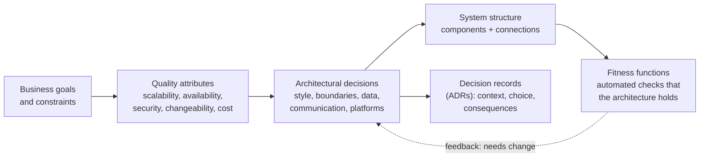

# What Is Software Architecture?

*Architecture is the set of decisions that are expensive to change — and the job of making them deliberately, explaining them clearly, and revisiting them when the world changes.*

---

> *“All architecture is design but not all design is architecture. Architecture represents the significant design decisions that shape a system, where significant is measured by cost of change.”*
>
> — **Grady Booch**, 2006

## At a Glance

> **In one sentence:** Software architecture is the structure of a system — its major components, how they communicate, where data lives, and the constraints everyone follows — chosen to achieve quality attributes like scalability, availability, security, and changeability, with every significant decision recorded as a trade-off.

**You'll learn**

- What architecture is (and isn't) and why "cost of change" defines it
- Quality attributes and how they drive architectural choices
- Common architectural styles and when each fits
- Views for describing architecture (the C4 model)
- Architecture Decision Records and fitness functions
- The role of an architect in modern teams

**Before you start:** [How To Design Any System](../06-System-Design/How-To-Design-Any-System.md) · [How To Think Like An Engineer](../01-Foundations/How-To-Think-Like-An-Engineer.md)

**Reading time:** about 10 minutes

---

## The Big Picture



*Architecture turns business goals into structure through explicit trade-offs — and keeps checking that the structure still serves the goals.*

---

## Introduction

Two teams build similar products. Both write good code. Three years later, one team ships features weekly; the other takes months for anything significant. The difference isn't code quality line by line. It's the **shape** of the system: where boundaries were drawn, how components depend on each other, how data is owned, and which decisions were made deliberately versus by accident.

The second team's system grew without a plan. Every module can reach into every other module's database tables. Business rules are duplicated in four places. A change to how orders are priced touches thirty files across six services. Nobody remembers why the system uses two different message queues.

That's what architecture is about: the decisions that determine how hard the *next* change will be.

### Why Should Engineers Care?

- Every engineer makes architectural decisions, even without the title — adding a dependency, choosing where logic lives, designing an API.
- Architecture determines how fast teams can move years from now.
- Understanding trade-offs helps you evaluate designs, write better proposals, and avoid fashionable mistakes.

---

## The Problem It Solves

| Without deliberate architecture | With it |
|--------------------------------|--------|
| Structure emerges by accident | Structure chosen for goals |
| Every module depends on everything | Clear boundaries and dependency rules |
| Quality attributes ignored until crises | Scalability, availability, security designed in |
| Decisions forgotten | Decisions recorded with reasons |
| Rewrites every few years | Evolution through planned change |

---

## Historical Background

- **1968 — NATO conference and Conway's Law.** The "software crisis" prompted interest in structure; Melvin Conway observed that systems mirror organizations.
- **1972 — David Parnas** argued for modules that hide design decisions likely to change — still the basis of good boundaries.
- **1992 — Perry and Wolf** published "Foundations for the Study of Software Architecture," helping establish architecture as a discipline.
- **1994 — Design Patterns** ("Gang of Four") gave a shared vocabulary for design structures.
- **1995 — Kruchten's "4+1" view model** proposed describing architecture through multiple views.
- **2000s — Service-oriented architecture (SOA)**, then **Domain-Driven Design** (Eric Evans, 2003) emphasized modeling around business domains.
- **2011 — Architecture Decision Records** proposed by Michael Nygard.
- **2014 — Microservices** described by James Lewis and Martin Fowler; the **C4 model** (Simon Brown) popularized simple, layered architecture diagrams.
- **2017 — *Building Evolutionary Architectures*** (Ford, Parsons, Kua) introduced fitness functions — automated checks that architecture keeps its intended properties.

---

## Core Concepts

### Architecture = Significant, Hard-to-Change Decisions

Examples: the overall style (monolith, services, event-driven), how data is partitioned and owned, communication protocols, public APIs, the choice of primary database, security model, and deployment platform. Variable names and internal algorithms usually aren't architecture — they're cheap to change.

### Quality Attributes

Non-functional properties the architecture must achieve:

| Attribute | Question |
|----------|---------|
| Performance / latency | How fast under expected load? |
| Scalability | How does it grow with users and data? |
| Availability / reliability | How does it survive failures? |
| Security | How does it resist and contain attacks? |
| Modifiability / changeability | How costly are likely changes? |
| Testability | Can parts be tested independently? |
| Deployability | Can parts be released independently and safely? |
| Observability | Can we understand its behavior in production? |
| Cost | What does it cost to build and run? |

Attributes conflict: more availability may cost consistency and money; more security may cost usability. Architecture is choosing which to favor, based on the business.

### Architectural Styles

| Style | Shape | Fits when |
|------|------|----------|
| Layered (n-tier) | UI → logic → data | Straightforward business apps |
| Modular monolith | One deployable, strong internal modules | Most products, especially early |
| Microservices | Many independently deployable services | Many teams needing independent delivery |
| Event-driven | Components react to events | Decoupled workflows, integration, streaming |
| Hexagonal (ports and adapters) | Core logic isolated from I/O | Testability, swapping infrastructure |
| Serverless | Functions triggered by events | Spiky or low workloads, small ops teams |
| Pipeline / batch | Stages transform data | Data processing, ETL, ML training |

### Describing Architecture: The C4 Model

- **Context:** the system and the people and systems around it.
- **Containers:** deployable units — web app, API, database, queue.
- **Components:** major parts inside a container.
- **Code:** classes and functions (rarely diagrammed).

Most conversations need only the first two levels.

### Architecture Decision Records (ADRs)

Short documents capturing one decision: context, the decision, alternatives, and consequences. Stored with the code, they preserve the reasoning after people move on.

### Fitness Functions

Automated checks that architecture still holds: dependency rules ("the domain layer must not import the web framework"), performance budgets, security checks, cycle detection. They turn architectural intentions into tests.

### Evolutionary Architecture

Assume requirements will change. Favor decisions that keep options open, make likely changes cheap, and defer irreversible choices until you have enough information — the "last responsible moment."

---

## Real-World Analogy

### City Planning

A city planner doesn't design every building. They decide the street grid, zoning (what goes where), utilities, transport lines, and building codes. Those choices shape everything built afterward and are very expensive to change — moving a highway or a sewer line takes decades. Individual buildings can be rebuilt freely. Software architecture is the city plan; code is the buildings.

---

## How It Works In Practice

### From Goals to Decisions

1. **Understand drivers:** business goals, constraints (budget, team skills, regulations, deadlines), and the top three to five quality attributes.
2. **Write quality attribute scenarios:** "When a region fails, checkout recovers within 5 minutes with no data loss" is testable; "highly available" isn't.
3. **Consider options** for each significant decision, with trade-offs.
4. **Decide and record** in ADRs.
5. **Validate** with prototypes, load tests, and fitness functions.
6. **Revisit** when drivers change.

### A Quality Attribute Scenario

```
Source:      A peak-season traffic spike
Stimulus:    5× normal checkout requests for 2 hours
Environment: Normal operation, one zone degraded
Response:    Checkout continues; non-essential features degrade
Measure:     p99 checkout latency < 1 s; error rate < 0.1%
```

### The Architect's Role Today

In modern teams, architecture is less about a single person drawing diagrams and more about:

- facilitating decisions across teams,
- keeping decisions visible (ADRs, diagrams, principles),
- guarding a few critical cross-cutting concerns (data ownership, security, APIs),
- coding enough to stay grounded in reality.

---

## Production Engineering Perspective

- **Architecture must be operable:** design for deployment, observability, and incident response, not just for the whiteboard.
- **Diagrams rot;** keep them simple, close to the code, and updated with major changes (or generated from infrastructure definitions).
- **Platform decisions are architectural:** a shared deployment platform, observability stack, or identity system shapes every team.
- **Cost is an architectural attribute** in the cloud era; architecture reviews should include cost estimates.

---

## Tradeoffs

| Decision | Favoring A | Favoring B |
|---------|-----------|-----------|
| Monolith vs. services | Simplicity, consistency | Team autonomy, independent scaling |
| Sync vs. async communication | Simpler reasoning | Decoupling, resilience |
| Shared vs. owned data | Easy joins | Independent evolution |
| Build vs. buy | Control, fit | Speed, less maintenance |
| Up-front design vs. emergent | Fewer surprises | Faster learning |
| Standardization vs. team choice | Consistency, shared tooling | Right tool per problem |

---

## Common Mistakes

### Beginner Mistakes

- Treating architecture as diagrams rather than decisions.
- Choosing a style because it's popular ("everyone uses microservices").
- Ignoring quality attributes until production problems appear.

### Intermediate Mistakes

- Big up-front designs that lock in decisions before the problem is understood.
- No record of why decisions were made.
- Letting dependency rules erode without automated checks.

### Senior-Level Mistakes

- Architecture that ignores team structure (Conway's Law) and fights the organization.
- "Ivory tower" architects who don't code or operate the systems they design.
- Optimizing for hypothetical scale instead of likely change.

---

## Failure Scenarios

### Scenario 1: Résumé-Driven Architecture

A five-person team adopts microservices, Kubernetes, and event sourcing for a new product. Most time goes to infrastructure. A competitor with a simple monolith ships faster.

**Lesson:** match architecture to team size and actual needs.

### Scenario 2: The Big Ball of Mud

A system grows without boundaries; every module touches every table. Simple changes require coordinating many teams.

**Lesson:** enforce module boundaries early with fitness functions.

### Scenario 3: The Forgotten Decision

A team replaces a "legacy" queue, not knowing it was chosen for strict ordering guarantees. Payments start processing out of order.

**Lesson:** ADRs record why decisions exist.

### Scenario 4: The Unmet Attribute

A system meets every functional requirement but was never designed for data residency. Expansion into a new region requires re-architecting storage.

**Lesson:** identify key quality attributes and constraints up front.

---

## Real-World Industry Examples

- **Amazon's shift to services** in the early 2000s, driven by the need for team autonomy, is often cited as an origin of service-oriented practices at scale.
- **Shopify** has publicly described maintaining a large **modular monolith**, enforcing boundaries within one codebase rather than splitting into many services.
- **ADRs** are used by many organizations and open-source projects to preserve decision history.
- **The C4 model** is widely used for lightweight architecture diagrams.

---

## Interview Questions

### Beginner

**Q1: What is software architecture?**

*Model answer:* The significant design decisions that shape a system — its major components, how they interact, where data lives, and the rules they follow — especially those that are expensive to change. It exists to achieve quality attributes like scalability, availability, security, and changeability.

### Intermediate

**Q2: What are quality attributes, and why do they matter more than features for architecture?**

*Model answer:* Non-functional properties like performance, availability, security, and modifiability. Many architectures can deliver the same features, but they differ enormously in how they meet these attributes, so attributes drive architectural choices.

**Q3: What is an ADR, and why use one?**

*Model answer:* An Architecture Decision Record captures one decision: its context, the choice, alternatives, and consequences. It preserves reasoning so future engineers understand why things are as they are and can revisit decisions safely.

### Senior

**Q4: How do you keep an architecture from eroding over time?**

*Model answer:* Make the intended structure explicit (principles, diagrams, ADRs), encode rules as fitness functions — dependency checks, performance budgets, API compatibility tests — in CI, review significant changes, and revisit decisions when drivers change.

### Architecture / Leadership

**Q5: How do you decide how much architecture to design up front?**

*Model answer:* In proportion to the cost of changing the decision later and the uncertainty involved. Irreversible, high-impact decisions (data ownership, public APIs, core platforms) deserve deliberate analysis; reversible ones should be made quickly and adjusted with experience. Defer irreversible decisions until you have enough information, and design to keep options open.

---

## Hands-On Lab

Make an architectural decision with a weighted trade-off matrix, then record it as an ADR. Pure Python; save as `decision_lab.py` and run it.

```python
# Quality attributes weighted by what matters for THIS product (weights sum to 1)
weights = {"time_to_market": 0.30, "team_autonomy": 0.10, "operational_simplicity": 0.25,
           "independent_scaling": 0.10, "consistency": 0.15, "cost": 0.10}

# Scores 1-5 for each option (5 = best), from the team's discussion
options = {
    "modular monolith": {"time_to_market": 5, "team_autonomy": 3, "operational_simplicity": 5,
                         "independent_scaling": 2, "consistency": 5, "cost": 5},
    "microservices":    {"time_to_market": 2, "team_autonomy": 5, "operational_simplicity": 2,
                         "independent_scaling": 5, "consistency": 2, "cost": 2},
    "serverless":       {"time_to_market": 4, "team_autonomy": 4, "operational_simplicity": 4,
                         "independent_scaling": 5, "consistency": 3, "cost": 4},
}

scores = {name: sum(weights[a] * s for a, s in attrs.items()) for name, attrs in options.items()}
for name, score in sorted(scores.items(), key=lambda x: -x[1]):
    print(f"{name:18} {score:.2f}")

best = max(scores, key=scores.get)
print(f"""
# ADR-001: Use a {best} for the initial platform
Status: Proposed
Context: 6 engineers, one product, launch in 4 months; top priorities are
         time to market and operational simplicity.
Decision: {best}.
Alternatives: {', '.join(n for n in options if n != best)} (scores above).
Consequences: Revisit when the team exceeds ~4 independent teams or a
              component needs very different scaling.
""")
```

**What to notice**
- The matrix doesn't make the decision — the **weights** do. For a large organization with many teams and very uneven load, try `time_to_market` 0.05, `team_autonomy` 0.35, `operational_simplicity` 0.10, and `independent_scaling` 0.25: the ranking flips, and the modular monolith drops to last.
- The ADR records the context that justified the choice and the trigger for revisiting it. Without that, the next team inherits a decision without the reasons.
- Scores are opinions; the value of the exercise is making them explicit so they can be discussed and challenged.

---

## Test Yourself

*Answer each question in your head or on paper first, then open the answer to check.*

<details markdown="1">
<summary><strong>1. According to Booch, what makes a design decision architectural?</strong></summary>

Its significance, measured by the cost of changing it.

</details>

<details markdown="1">
<summary><strong>2. Name five quality attributes.</strong></summary>

Any five of: performance, scalability, availability, security, modifiability, testability, deployability, observability, cost.

</details>

<details markdown="1">
<summary><strong>3. What are the four levels of the C4 model?</strong></summary>

Context, containers, components, and code.

</details>

<details markdown="1">
<summary><strong>4. What is a fitness function?</strong></summary>

An automated check that the system still has an intended architectural property, such as dependency rules, performance budgets, or security constraints.

</details>

<details markdown="1">
<summary><strong>5. Why write quality attribute scenarios?</strong></summary>

They make vague goals ("highly available") specific and testable (stimulus, environment, response, and measure).

</details>

<details markdown="1">
<summary><strong>6. What is a modular monolith?</strong></summary>

A single deployable application with strong internal module boundaries, giving much of the structure of services without distributed-systems complexity.

</details>

<details markdown="1">
<summary><strong>7. What does "last responsible moment" mean?</strong></summary>

Deferring an irreversible decision until you have enough information, but not so late that delaying causes harm.

</details>

---

## Cheat Sheet

**Architecture =** significant decisions (high cost of change) + structure + rules + rationale.

**Process:** drivers → quality attribute scenarios → options → decide → ADR → validate → fitness functions → revisit.

| Artifact | Purpose |
|---------|--------|
| C4 diagrams (context, containers) | Shared understanding |
| ADRs | Why decisions were made |
| Quality attribute scenarios | Testable goals |
| Fitness functions | Automated guardrails |
| Principles | Guidance for everyday decisions |

**Default advice:** start simple (modular monolith), draw boundaries carefully, record decisions, automate the rules, evolve deliberately.

---

## In the AI Era

- **AI generates code quickly but doesn't hold the architecture in its head.** Without explicit boundaries and fitness functions, AI-assisted changes can erode structure fast. Architecture rules enforced in CI protect the design.
- **Write architecture down for humans and agents.** ADRs, module rules, and a short architecture overview in the repository give AI coding assistants the context to make changes that fit.
- **AI components are a new architectural element** with unusual quality attributes (probabilistic output, per-token cost, provider dependency). See [Where the Model Fits](Where-The-Model-Fits-Architecting-With-AI-Components.md).
- **AI can help explore options,** summarizing trade-offs and drafting ADRs — but the weights come from your business context.

**Try it:** Ask an AI assistant to propose an architecture for your current project. Then check it against your top three quality attributes. Which of its assumptions don't fit your constraints?

---

## Key Takeaways

1. Architecture is the set of significant decisions — measured by cost of change.
2. Quality attributes, not features, drive architectural choices, and they trade off against each other.
3. Choose styles to fit the problem and the organization; start simple.
4. Describe architecture with lightweight views (C4) and record decisions in ADRs.
5. Protect architecture with fitness functions in CI.
6. Design for evolution: keep options open and revisit decisions as drivers change.

---

## What to Read Next

- **[Monoliths vs Microservices: The Real Tradeoffs](Monoliths-vs-Microservices-The-Real-Tradeoffs.md)** — the most common architectural debate
- **[Coupling, Cohesion, and Boundaries](Coupling-Cohesion-And-Boundaries.md)** — drawing lines that last
- **[How To Design Any System](../06-System-Design/How-To-Design-Any-System.md)** — the design method in practice

---

## Further Reading

- **Len Bass, Paul Clements & Rick Kazman — "Software Architecture in Practice" (4th edition, 2021)**
- **Neal Ford, Rebecca Parsons & Patrick Kua — "Building Evolutionary Architectures" (2nd edition, 2023)**
- **Mark Richards & Neal Ford — "Fundamentals of Software Architecture" (2nd edition, 2025)**
- **Simon Brown — The C4 model:** [https://c4model.com](https://c4model.com)
- **Michael Nygard — "Documenting Architecture Decisions" (2011):** [https://cognitect.com/blog/2011/11/15/documenting-architecture-decisions](https://cognitect.com/blog/2011/11/15/documenting-architecture-decisions)
- **Martin Fowler — "Who Needs an Architect?" (IEEE Software, 2003)**

---

*This chapter is part of the Modern Software Engineering Handbook — a comprehensive guide to the concepts, principles, and practices that every professional software engineer should know.*
