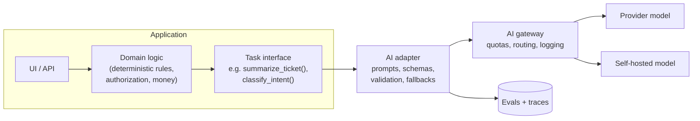
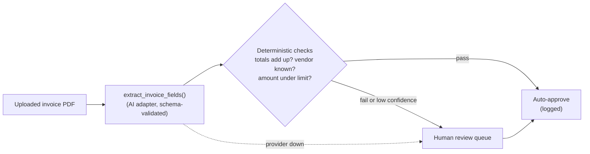

# Where the Model Fits: Architecting With AI Components

*Treat the model as a powerful, unreliable, expensive dependency — and design the architecture so the rest of the system doesn't have to care which model it is.*

---

> *“AI is the new electricity.”*
>
> — **Andrew Ng**, talk at Stanford Graduate School of Business, 2017

## At a Glance

> **In one sentence:** Architecting with AI components means isolating models behind stable, task-shaped interfaces, keeping deterministic business rules in code, placing model calls off the critical path where possible, surrounding them with validation, evaluation, and fallbacks, and routing all access through shared infrastructure — so models, prompts, and providers can change without destabilizing the system.

**You'll learn**

- The unusual quality attributes of AI components
- Where models belong — and where they don't — in an architecture
- Task-shaped interfaces and the anti-corruption layer for AI
- Patterns: AI as enhancement, AI in the loop, AI as a service, AI behind a gateway
- Keeping business rules deterministic and auditable
- Architecture decisions for prompts, evaluations, data, and agents

**Before you start:** [What Is Software Architecture?](What-Is-Software-Architecture.md) · [Building LLM-Powered Systems](../15-AI-Era-Engineering/Building-LLM-Powered-Systems.md) · [Coupling, Cohesion, and Boundaries](Coupling-Cohesion-And-Boundaries.md)

**Reading time:** about 10 minutes

---

## The Big Picture



*The domain asks for a task, not a model. Everything model-specific — prompts, providers, output parsing — lives behind the adapter.*

---

## Introduction

A team adds AI to its customer-support product. The first version is fast to build: controller code builds a prompt, calls a provider SDK, parses the reply with string matching, and writes the result straight into the database. It works.

Six months later, the system has AI calls scattered across forty files. Each builds prompts differently. Three use a deprecated model the provider is retiring. A refund decision now depends partly on model output, and nobody can explain to auditors why a particular refund was denied. Switching providers to cut costs would mean touching every one of those files. And when the provider had an outage, the whole support app went down — including features that had nothing to do with AI.

The model wasn't the problem. The **architecture around it** was. AI components need the same architectural discipline as databases, payment providers, and message brokers — plus a few considerations of their own.

### Why Should Engineers Care?

- AI features are being added to almost every product; architecture determines whether they stay maintainable.
- Models, prices, and providers change fast. Systems that isolate them can adapt; systems that don't get stuck.
- Some decisions (money, access, safety) must remain deterministic and auditable even when AI is involved.

---

## The Problem It Solves

| Without architectural discipline | With it |
|---------------------------------|--------|
| Provider SDK calls spread everywhere | One adapter per task behind an interface |
| Prompts in string literals across the code | Versioned prompts in one place |
| Model output trusted directly | Validated, schema-checked output |
| AI on critical paths | AI as optional enhancement where possible |
| Business rules hidden inside prompts | Rules in code; AI proposes, code decides |
| Provider outage = product outage | Fallbacks and degradation |
| No record of why a decision was made | Traces and audit logs |

---

## Historical Background

- **2000s — Anti-corruption layers.** Domain-Driven Design (2003) described translation layers that protect a domain model from external systems' models — a pattern now applied to AI providers.
- **2010s — ML in production.** Google's paper "Hidden Technical Debt in Machine Learning Systems" (Sculley et al., 2015) showed that the model is a small part of a real ML system; the surrounding data, configuration, and serving infrastructure dominate.
- **2020–2023 — Foundation models via APIs.** Large language models became general-purpose components callable over HTTP, bringing AI into ordinary application architecture.
- **2023 onward — AI platform layers.** Gateways, prompt management, evaluation tooling, and standard tool protocols (such as MCP, introduced in 2024) emerged as shared architectural building blocks.

---

## Core Concepts

### Quality Attributes of AI Components

| Attribute | Ordinary service | AI component |
|----------|-----------------|-------------|
| Determinism | Same input → same output | Output varies |
| Correctness | Bugs are defects | "Wrong but plausible" is a normal failure mode |
| Latency | Milliseconds | Seconds, varies with output length |
| Cost | Per server | Per token, per call |
| Change | You control releases | Providers update and retire models |
| Security | Input validation | Plus prompt injection and data exposure |
| Testability | Unit tests | Plus evaluation suites over datasets |

Architecture must account for each of these.

### Task-Shaped Interfaces

The domain shouldn't call "the LLM." It should call a task: `classify_ticket(text) -> Category`, `summarize_thread(messages) -> Summary`, `extract_invoice_fields(document) -> InvoiceFields`. Behind each interface, an adapter owns the prompt, model choice, schema validation, and fallback. Swapping a provider — or replacing the model with rules, or rules with a model — changes the adapter, not the domain.

This is the classic **anti-corruption layer** and **ports-and-adapters** pattern applied to AI.

### AI Proposes, Code Decides

Keep decisions involving money, access, safety, and compliance in deterministic code:

- The model *extracts* invoice fields; code *validates* totals and approves payments under rules.
- The model *suggests* a refund reason; policy code *decides* eligibility.
- The model *drafts* a reply; a human or a rule-based check *approves* sensitive ones.

This keeps behavior auditable and limits the impact of model mistakes or prompt injection.

### Placement Patterns

| Pattern | Example | Coupling to model |
|--------|--------|------------------|
| **AI as enhancement** | Summaries, suggestions, smart search on top of a working product | Low — product works without it |
| **AI in the loop** | Drafts that humans approve | Medium — humans catch errors |
| **AI as a core capability** | Document extraction pipeline | High — needs strong validation and evaluation |
| **AI as autonomous agent** | Agent that acts on systems | Highest — needs permissions, limits, approvals, audit |

Start low on this ladder and move up only with evidence and safeguards.

### Shared AI Infrastructure

Cross-cutting concerns belong in shared layers rather than in each feature:

- **AI gateway:** keys, quotas, routing, fallbacks, logging (see [Designing An AI Gateway](../06-System-Design/Designing-An-AI-Gateway.md)).
- **Prompt and configuration management:** versioned, reviewed, deployable.
- **Evaluation platform:** datasets, graders, CI integration.
- **Retrieval services:** shared, permission-aware search over company data.
- **Observability:** traces for every model and tool call.

### Data Architecture for AI

- Retrieval indexes are **derived data** — keep them in sync with sources, including deletes and permissions.
- Conversation histories and traces are **sensitive data** with retention and access rules.
- Evaluation datasets and prompt versions are **engineering assets** — version and back them up.

---

## Real-World Analogy

### Hiring a Brilliant Contractor

A company hires a brilliant but occasionally overconfident contractor. It doesn't give them the company checkbook. It gives them clear tasks with defined deliverables ("draft this report in this format"), reviews their work against checklists, keeps final approvals with employees who are accountable, routes their access through a front desk that logs visits, and makes sure the business keeps running on days they don't show up. If a better contractor comes along, the task definitions stay the same — only the person doing them changes.

---

## How It Works In Practice

### Designing an AI Feature Architecturally

1. **Define the task and its contract:** inputs, output schema, quality bar, latency and cost budgets.
2. **Decide placement:** enhancement, in-the-loop, core, or agent — and why.
3. **Specify what code decides:** rules, permissions, and limits outside the model.
4. **Design the adapter:** prompt version, model choice, validation, retries, fallback ladder.
5. **Route through shared infrastructure:** gateway, retrieval service, tracing.
6. **Build the evaluation set** and add it to CI.
7. **Write an ADR** covering the model choice, data handling, and how to change providers.

### Example: Invoice Processing



The model does what it's good at (reading messy documents); code does what code is good at (arithmetic, rules, limits); humans handle exceptions.

### Architecture Checklist for AI Features

- [ ] Task interface independent of any provider SDK
- [ ] Prompts versioned in one place
- [ ] Output validated against a schema
- [ ] Decisions about money, access, and safety made in code
- [ ] Off the critical path, or with a tested fallback
- [ ] Calls routed through the gateway (quotas, logging)
- [ ] Evaluation suite in CI
- [ ] Data retention and privacy rules for prompts and outputs
- [ ] ADR recording model choice and change plan

---

## Production Engineering Perspective

- **Model deprecations are scheduled breaking changes;** track model versions in an inventory and plan upgrades with evaluations.
- **Cost belongs in architecture reviews:** tokens per request × volume, and which components drive it.
- **Latency budgets:** model calls often dominate; architect for streaming, async processing, and caching.
- **Blast radius:** a prompt change affects every request that uses it; deploy prompts like code with canaries.
- **Portability:** keep provider-specific features (special tools, response formats) inside adapters so you can switch or use multiple providers.

---

## Tradeoffs

| Decision | Benefit | Cost |
|---------|--------|-----|
| Task-shaped interfaces | Swappable models, clean domain | Some abstraction overhead |
| Using provider-specific features | Better quality or cost now | Harder to switch later |
| AI in the loop vs. autonomous | Safety, accountability | Human time; slower |
| Central AI platform | Consistency, governance | Can become a bottleneck if over-centralized |
| Self-hosting models | Data control, cost at scale | Operational burden, capability gap |
| Rules vs. model for a task | Rules: predictable, cheap; model: flexible | Rules: brittle for messy input; model: costly, probabilistic |

---

## Common Mistakes

### Beginner Mistakes

- Calling provider SDKs directly from controllers and UI code.
- Parsing model output with string matching instead of schemas.
- Letting the model make final decisions about money or permissions.

### Intermediate Mistakes

- Prompts scattered across the codebase without versioning.
- No fallback when the model is unavailable.
- Business rules written into prompts instead of code.

### Senior-Level Mistakes

- Designing the architecture around one provider's specific features, making migration very costly.
- Building autonomous agents before in-the-loop versions have proven reliable.
- No evaluation infrastructure, so architecture changes (models, prompts, retrieval) can't be judged.

---

## Failure Scenarios

### Scenario 1: The Model Retirement

A provider retires the model used in forty files. Each call must be found, changed, and retested under deadline pressure.

**Fix:** task interfaces and adapters; a model inventory; evaluation suites to validate replacements.

### Scenario 2: The Unauditable Decision

A regulator asks why a loan application was rejected. The decision came from a model's free-text answer, with no recorded rule or rationale.

**Fix:** AI proposes, code decides; log inputs, outputs, versions, and the deterministic rule that made the final decision.

### Scenario 3: The Product Outage From an Optional Feature

The AI summary panel blocks page rendering; a provider outage takes down the entire page.

**Fix:** AI as enhancement — render the page first, load AI results asynchronously with fallbacks.

### Scenario 4: The Prompt That Became a Policy

Refund rules are gradually written into a prompt by different people. Nobody can say what the policy is, and changes aren't reviewed.

**Fix:** policy in code and configuration; the prompt handles language, not rules.

---

## Real-World Industry Examples

- **"Hidden Technical Debt in Machine Learning Systems" (Google, 2015)** showed that the surrounding system dominates ML complexity — the same holds for LLM features.
- **AI gateways and platform teams** have emerged in many organizations to centralize model access, cost, and governance.
- **Human-in-the-loop designs** are common in high-stakes domains (finance, healthcare, legal) where AI drafts or extracts and people approve.
- **The Model Context Protocol** standardizes how AI applications connect to tools and data, separating integrations from specific models and clients.

---

## Interview Questions

### Beginner

**Q1: Why wrap AI calls behind an interface?**

*Model answer:* So the rest of the system depends on a stable task contract rather than a specific provider, model, or prompt. Models and providers change often; an interface keeps those changes contained in one adapter and makes testing and fallbacks easier.

### Intermediate

**Q2: What does "AI proposes, code decides" mean?**

*Model answer:* Use the model for what it's good at — interpreting messy input, drafting, extracting — but make final decisions about money, access, safety, or compliance with deterministic, auditable code (or humans). It limits the impact of model errors and prompt injection and keeps behavior explainable.

**Q3: How do you keep an AI feature from taking down the product?**

*Model answer:* Keep it off the critical path (enhancement or asynchronous), set deadlines and timeouts, validate outputs, provide fallbacks down to a non-AI experience, route calls through a gateway with circuit breakers, and test degradation.

### Senior

**Q4: How would you design for switching model providers?**

*Model answer:* Task-shaped interfaces with adapters that own prompts, schemas, and provider-specific details; calls routed through a gateway; evaluation suites per task to validate alternatives; avoidance of provider-specific features outside adapters; and an inventory of models in use with deprecation dates.

### Architecture / Leadership

**Q5: What shared AI infrastructure should an organization build, and what should stay with product teams?**

*Model answer:* Shared: gateway (keys, quotas, routing, logging), evaluation tooling, prompt/version management conventions, permission-aware retrieval services, observability, and security guidance. Product teams own their task definitions, prompts, evaluation datasets, UX, and quality bars, because they understand their users and domain. Keep the platform a paved road, not a mandatory bottleneck.

---

## Hands-On Lab

Build a task-shaped AI interface with swappable adapters, schema validation, a rules-based fallback, and contract tests. Pure Python (fake providers); save as `ai_architecture_lab.py` and run it.

```python
import json
from typing import Protocol

CATEGORIES = {"billing", "shipping", "account", "other"}

class TicketClassifier(Protocol):            # the port: what the domain needs
    def classify(self, text: str) -> str: ...

class ProviderAAdapter:                      # adapter for "provider A" (fake)
    PROMPT_VERSION = "classify-v3"
    def classify(self, text):
        raw = json.dumps({"category": "billing" if "refund" in text.lower() else "shipping"})
        return validate(raw)

class ProviderBAdapter:                      # a different provider with a different output style
    PROMPT_VERSION = "classify-v1-b"
    def classify(self, text):
        raw = "Category: " + ("account" if "password" in text.lower() else "other")
        return validate(json.dumps({"category": raw.split(": ")[1]}))

class RulesFallback:                         # deterministic fallback, no AI at all
    def classify(self, text):
        t = text.lower()
        if "refund" in t or "charge" in t: return "billing"
        if "package" in t or "delivery" in t: return "shipping"
        if "password" in t or "login" in t: return "account"
        return "other"

def validate(raw_json):
    category = json.loads(raw_json).get("category")
    if category not in CATEGORIES:
        raise ValueError(f"invalid category {category!r}")
    return category

class ResilientClassifier:                   # composition: primary adapter, then fallback
    def __init__(self, primary, fallback): self.primary, self.fallback = primary, fallback
    def classify(self, text):
        try:
            return self.primary.classify(text)
        except Exception:
            return self.fallback.classify(text)

# Domain code depends only on the port
def route_ticket(classifier: TicketClassifier, text: str) -> str:
    queue = {"billing": "finance-team", "shipping": "logistics", "account": "support-l1"}
    return queue.get(classifier.classify(text), "general-queue")

# Contract tests every adapter must pass
def contract_test(impl):
    cases = ["I want a refund", "Where is my package?", "Reset my password", "Hello"]
    return all(impl.classify(c) in CATEGORIES for c in cases)

for impl in [ProviderAAdapter(), ProviderBAdapter(), RulesFallback(),
             ResilientClassifier(ProviderAAdapter(), RulesFallback())]:
    print(f"{type(impl).__name__:22} contract ok: {contract_test(impl)}   "
          f"'refund please' -> {route_ticket(impl, 'refund please')}")
```

**What to notice**
- `route_ticket` never changes, whichever implementation is plugged in — the domain depends on the task, not the model.
- Provider B returns a different raw format; its adapter translates and validates it. Provider quirks stay inside adapters.
- The contract test is the same for every implementation — a cheap first gate before running a full evaluation suite.
- Notice that Provider B routes "refund please" to the general queue: it passes the contract (valid category) but not the *quality* bar. Contracts check shape; evaluations check correctness. You need both.

---

## Test Yourself

*Answer each question in your head or on paper first, then open the answer to check.*

<details markdown="1">
<summary><strong>1. Name three quality attributes where AI components differ from ordinary services.</strong></summary>

Any three of: non-determinism, plausible-but-wrong failures, high and variable latency, per-token cost, provider-controlled changes, prompt injection risk, evaluation-based testing.

</details>

<details markdown="1">
<summary><strong>2. What is a task-shaped interface?</strong></summary>

An interface named after a business task (for example, classify_ticket or extract_invoice_fields) rather than a model, hiding prompts, providers, and parsing in an adapter.

</details>

<details markdown="1">
<summary><strong>3. What does an anti-corruption layer do for AI integrations?</strong></summary>

It translates between the provider's formats and behaviors and the domain's model, preventing provider-specific details from spreading through the system.

</details>

<details markdown="1">
<summary><strong>4. Why keep business rules out of prompts?</strong></summary>

Rules in prompts are unreviewable, unauditable, applied probabilistically, and vulnerable to injection. Rules belong in code or configuration; prompts handle language.

</details>

<details markdown="1">
<summary><strong>5. Which placement pattern has the lowest risk?</strong></summary>

AI as enhancement — the product works without it, so failures degrade experience rather than breaking functionality.

</details>

<details markdown="1">
<summary><strong>6. What's the difference between a contract test and an evaluation?</strong></summary>

A contract test checks that outputs have the right shape and allowed values; an evaluation checks whether outputs are actually correct and good on a representative dataset.

</details>

<details markdown="1">
<summary><strong>7. What did Google's 2015 "Hidden Technical Debt" paper highlight?</strong></summary>

That in real ML systems the model code is a small part; data pipelines, configuration, serving, and monitoring make up most of the complexity and debt.

</details>

---

## Cheat Sheet

**Principles:** task interfaces, not model calls · AI proposes, code decides · off the critical path · validate everything · evaluate every change · route through shared infrastructure · record decisions.

| Layer | Owns |
|------|-----|
| Domain | Business rules, authorization, money, final decisions |
| Task interface (port) | What the domain needs from AI |
| AI adapter | Prompts, model choice, schemas, validation, fallbacks |
| AI gateway | Keys, quotas, routing, logging, circuit breakers |
| Evaluation platform | Datasets, graders, CI gates |

**Placement ladder:** enhancement → in the loop → core capability → autonomous agent (add safeguards at each step).

---

## In the AI Era

This chapter brings the handbook's AI-era thread into architecture: models are a new kind of component, but the tools for managing them are old ones — interfaces and adapters (Parnas, 1972), anti-corruption layers (Evans, 2003), fallbacks and bulkheads ([resilience](../10-Reliability/How-Netflix-Builds-Resilient-Systems.md)), and decision records. What's genuinely new is the need to test with evaluations instead of assertions and to design explicitly for plausible-but-wrong output.

**Try it:** Draw the C4 container diagram for an AI feature you know. Mark which boxes are deterministic and which are probabilistic. Is any money, access, or safety decision made inside a probabilistic box?

---

## Key Takeaways

1. AI components have unusual quality attributes: non-determinism, plausible errors, latency, per-token cost, and provider-driven change.
2. Isolate models behind task-shaped interfaces with adapters that own prompts, validation, and fallbacks.
3. Let AI propose and code decide, especially for money, access, and safety.
4. Prefer AI as an enhancement off the critical path; move toward autonomy only with safeguards.
5. Centralize cross-cutting concerns in shared infrastructure: gateway, evaluation, retrieval, observability.
6. Test adapters with contracts and evaluations, and record AI decisions in ADRs.

---

## What to Read Next

- **[Designing An AI Gateway](../06-System-Design/Designing-An-AI-Gateway.md)** — the shared access layer in depth
- **[Graceful Degradation for AI Features](../10-Reliability/Graceful-Degradation-For-AI-Features.md)** — fallbacks for AI components
- **[Evaluating AI Systems](../15-AI-Era-Engineering/Evaluating-AI-Systems.md)** — the testing discipline AI architecture depends on

---

## Further Reading

- **Sculley et al. — "Hidden Technical Debt in Machine Learning Systems" (NeurIPS 2015):** [https://papers.nips.cc/paper/5656-hidden-technical-debt-in-machine-learning-systems](https://papers.nips.cc/paper/5656-hidden-technical-debt-in-machine-learning-systems)
- **Eric Evans — "Domain-Driven Design" (2003)** — anti-corruption layers
- **Alistair Cockburn — "Hexagonal Architecture" (2005):** [https://alistair.cockburn.us/hexagonal-architecture/](https://alistair.cockburn.us/hexagonal-architecture/)
- **Chip Huyen — "AI Engineering" (O'Reilly, 2025)**
- **Anthropic — "Building Effective Agents":** [https://www.anthropic.com/engineering/building-effective-agents](https://www.anthropic.com/engineering/building-effective-agents)
- **Model Context Protocol:** [https://modelcontextprotocol.io](https://modelcontextprotocol.io)

---

*This chapter is part of the Modern Software Engineering Handbook — a comprehensive guide to the concepts, principles, and practices that every professional software engineer should know.*
