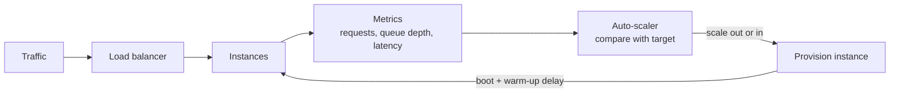

# Auto-scaling and Capacity Planning: Matching Resources to Demand

*How systems grow and shrink themselves — and how engineers make sure they grow fast enough, and shrink cheaply enough.*

---

> *“Design for ~10x growth, but plan to rewrite before ~100x.”*
>
> — **Jeff Dean**, "Designs, Lessons and Advice from Building Large Distributed Systems," LADIS keynote, 2009

## At a Glance

> **In one sentence:** Auto-scaling adds and removes capacity automatically based on demand signals, while capacity planning forecasts how much you'll need — and both depend on choosing the right metrics, keeping headroom for spikes, and accounting for how long new capacity takes to become ready.

**You'll learn**

- Reactive, scheduled, and predictive scaling
- Choosing scaling metrics: CPU, requests, queue depth, latency
- Cooldowns, flapping, and startup time
- Capacity planning with headroom, peaks, and Little's Law
- Load testing to find real limits
- Cost trade-offs of reserved vs. on-demand capacity

**Before you start:** [Vertical vs Horizontal Scaling](Vertical-vs-Horizontal-Scaling.md) · [How Load Balancing Works](How-Load-Balancing-Works.md)

**Reading time:** about 40 minutes

---

## The Big Picture



*Auto-scaling is a feedback loop — and the delay before new capacity is ready is where requests pile up.*

---

## Introduction

Imagine a restaurant that only ever staffs exactly three servers, no matter whether it's a slow Tuesday lunch or a packed Saturday night. On Tuesday, those three servers stand around with nothing to do, drawing wages for no reason. On Saturday, the same three servers are drowning — tables wait forty minutes for a menu, food comes out cold, and customers walk out. The restaurant needed neither three servers nor ten servers; it needed the *right number of servers for the current demand*, adjusted continuously throughout the week.

A good restaurant manager solves this with a schedule built from history ("Saturday dinner is always our busiest shift — staff eight servers") and with real-time judgment ("the dining room is filling up faster than expected tonight — call in an extra server"). That's two different scaling strategies working together: **predictive** scaling based on known patterns, and **reactive** scaling based on what's happening right now.

**Auto-scaling is the restaurant manager for your infrastructure.** It watches signals — CPU load, request queues, latency, custom business metrics — and automatically adds or removes compute capacity to match demand, without a human deciding in the moment. **Capacity planning** is the schedule the manager builds ahead of time: how many servers do we need at 2 AM versus 8 PM, how many extra do we keep on standby in case someone calls in sick, and how many do we pre-book for New Year's Eve because we already know it will be slammed.

Together, these two disciplines are what let a service run efficiently on a quiet Tuesday and survive a flash sale on Black Friday without either bankrupting the company in idle compute or falling over under load.

### Why Should Engineers Care About Auto-scaling and Capacity Planning?

Every engineer who has ever been paged at 2 AM because a service fell over during a traffic spike understands the value of this topic instinctively. Engineers who understand it deeply can:

- Design systems that absorb 10x traffic spikes without manual intervention
- Avoid paying for idle capacity that sits unused 90% of the time
- Reason quantitatively about how many servers a system needs, using queueing theory instead of guesswork
- Diagnose why an autoscaler "isn't working" (usually: wrong metric, cold-start lag, or no headroom)
- Plan capacity for known high-traffic events instead of hoping reactive scaling saves the day
- Make sound build-vs-buy tradeoffs between cloud auto-scaling, Kubernetes-native scaling, and custom schedulers

### Where Is This Used?

| Context | Example | Purpose |
|---------|---------|---------|
| Cloud VMs | AWS Auto Scaling Groups, Azure VM Scale Sets, GCP Managed Instance Groups | Add/remove virtual machines based on load |
| Container orchestration | Kubernetes Horizontal Pod Autoscaler (HPA), Cluster Autoscaler | Scale pod replicas and underlying nodes |
| Event-driven workloads | KEDA (Kubernetes Event-Driven Autoscaling) | Scale based on queue depth, Kafka lag, custom metrics |
| Serverless | AWS Lambda concurrency scaling, Google Cloud Run | Scale instances per-request, down to zero |
| Databases | Amazon Aurora Serverless, DynamoDB auto-scaling | Scale read/write capacity units automatically |
| Big events | Amazon Prime Day, Black Friday, Super Bowl ad campaigns | Pre-scale capacity ahead of known demand spikes |

---

## The Problem It Solves

### The Fixed-Capacity Problem

Before auto-scaling, engineers provisioned servers for a fixed capacity target — usually peak demand plus a safety margin. This created two permanent, simultaneous problems:

1. **Over-provisioning most of the time.** If you provision for your Black Friday peak (say, 500 servers), those 500 servers sit mostly idle for the other 364 days of the year, burning money.
2. **Under-provisioning during unexpected spikes.** No fixed number is ever exactly right. A viral tweet, a competitor's outage sending users your way, or a marketing campaign performing better than forecast can all blow past even a generous fixed capacity plan.

### The Elasticity Problem

Demand for most internet services is not flat — it has daily cycles (peak in the evening, trough at 3 AM), weekly cycles (weekday vs. weekend), seasonal cycles (holiday shopping), and occasional shocks (viral content, breaking news, marketing launches). A fixed fleet size cannot track any of this.

### What Happens Without This?

- **Wasted spend:** Idle servers running 24/7 for a load pattern that only needs them 4 hours a day
- **Outages during spikes:** Fixed capacity gets overwhelmed, leading to timeouts, 5xx errors, and cascading failures
- **Manual, error-prone scaling:** An on-call engineer manually launching instances at 2 AM, guessing at the right number
- **Slow incident response:** By the time a human notices load climbing and provisions more capacity, the damage (dropped requests, angry customers) is already done
- **No way to handle known events safely:** Without capacity planning math, teams either wildly over-provision for Black Friday (wasting money) or under-provision (risking an outage during the one day that matters most for revenue)

| Need | How Auto-scaling and Capacity Planning Solve It |
|------|--------------------------------------------------|
| **Cost efficiency** | Run only the capacity you need, when you need it |
| **Resilience to spikes** | Automatically add capacity when demand rises |
| **Predictable performance** | Maintain target latency/CPU levels even as load changes |
| **Operational safety net** | Remove the need for a human to react instantly at 3 AM |
| **Confidence for known events** | Pre-scale ahead of predictable demand instead of reacting after the fact |

---

## Historical Background

### 1990s–2000s: Manual Capacity Planning

Before the cloud, capacity planning meant buying physical servers months in advance based on forecasted growth. Amazon's own retail site in the early 2000s ran this way — engineers ordered hardware for the holiday shopping season based on projections, and any miss in either direction (too few servers, or racks of hardware sitting idle in January) was a real, physical, expensive problem.

### 2006: Amazon EC2 and the Birth of Elastic Compute

Amazon Web Services launched **EC2** in August 2006, introducing the idea that compute could be rented by the hour and provisioned programmatically. This was the prerequisite for auto-scaling to exist at all — you cannot automatically add capacity if capacity takes six weeks to arrive on a truck.

### 2009: AWS Auto Scaling

AWS launched **Auto Scaling** in 2009, allowing EC2 instances to be automatically added or removed from a group based on CloudWatch metrics like CPU utilization. This was the first widely used, cloud-native auto-scaling product, and it set the pattern most systems still follow: define a min/max/desired instance count, define a scaling policy tied to a metric, and let the system react.

### 2013: Netflix Builds Scryer

Netflix, running almost entirely on AWS, found that reactive auto-scaling based on current CPU was too slow to react to its own traffic patterns — by the time CPU climbed high enough to trigger scaling, users were already seeing degraded performance. In 2013, Netflix engineers Xiao Shi and colleagues on the Netflix Cloud Engineering team published details of **Scryer**, a predictive auto-scaling system that used historical traffic patterns (Netflix's traffic is famously regular — it rises every evening as people get home and turn on their TVs) to launch capacity *before* it was needed rather than after.

### 2015–2016: Kubernetes and the Horizontal Pod Autoscaler

Kubernetes, open-sourced by Google in 2014 (based on Google's internal Borg system), introduced the **Horizontal Pod Autoscaler (HPA)** in Kubernetes 1.1 (2015), initially scaling on CPU utilization. Kubernetes 1.6 (2017) added support for custom and external metrics via the metrics API, opening the door to scaling on queue depth, requests-per-second, and other application-level signals.

### 2017–2018: Cluster Autoscaler

As Kubernetes adoption grew, scaling *pods* wasn't enough if there weren't enough underlying *nodes* to schedule them onto. The **Kubernetes Cluster Autoscaler** project, matured around 2017–2018, added the ability to add and remove worker nodes from a cluster automatically based on pending (unschedulable) pods and node utilization.

### 2019: KEDA

Microsoft and Red Hat jointly released **KEDA (Kubernetes Event-Driven Autoscaling)** in 2019, extending Kubernetes autoscaling beyond CPU/memory to arbitrary event sources — Kafka consumer lag, RabbitMQ queue depth, Azure Service Bus, Prometheus queries, and dozens of other "scalers." KEDA became a CNCF project and reached graduation status in the CNCF in 2023.

### 2020: AWS Predictive Scaling

AWS added **Predictive Scaling** to EC2 Auto Scaling in 2020, using machine learning to forecast capacity needs based on historical load patterns — bringing Netflix's Scryer-style idea into the managed AWS product itself.

### 2020s: Serverless and Scale-to-Zero

Platforms like AWS Lambda, Google Cloud Run, and Knative pushed auto-scaling to its logical extreme: scale to exactly zero instances when there's no traffic, and scale up per-request. This shifted capacity planning conversations from "how many servers" to "how fast can we cold-start a new execution environment."

---

## Core Concepts

### Reactive vs. Predictive Autoscaling

| Dimension | Reactive Autoscaling | Predictive Autoscaling |
|-----------|----------------------|--------------------------|
| **Trigger** | Current metric value crosses a threshold | Forecasted future demand based on historical patterns |
| **Lag** | Always scales *after* load has already risen | Can scale *ahead* of load, before it arrives |
| **Complexity** | Simple: if metric > threshold, scale out | Requires a forecasting model trained on historical data |
| **Best for** | Unpredictable, spiky, novel traffic | Regular, cyclical, well-understood traffic (daily/weekly patterns) |
| **Risk** | Under-provisioned during the scale-up lag window | Forecast error — wrong prediction wastes money or under-provisions |
| **Examples** | Kubernetes HPA on CPU, AWS target tracking policies | Netflix Scryer, AWS Predictive Scaling |

In practice, mature systems use **both together**: predictive scaling sets a sensible baseline ahead of known patterns, and reactive scaling handles the unexpected delta on top of that baseline.

### Scaling Metrics

The metric an autoscaler watches determines how well it tracks real user pain. Common choices, roughly in order of how directly they reflect user experience:

| Metric | What It Measures | Strengths | Weaknesses |
|--------|-------------------|-----------|------------|
| **CPU utilization** | % of CPU capacity in use | Simple, universally available | Doesn't capture I/O-bound or memory-bound bottlenecks; lags behind actual user pain |
| **Memory utilization** | % of memory in use | Good for memory-bound workloads (caches, JVMs) | Can be noisy; garbage collection causes spikes unrelated to load |
| **Queue depth** | Number of unprocessed messages/jobs waiting | Directly reflects backlog; great for async workloads | Requires a queue-based architecture; doesn't apply to synchronous request/response services |
| **Requests-in-flight / concurrency** | Number of requests currently being processed per instance | Closely tracks actual load and latency risk | Requires application-level instrumentation |
| **Latency (P50/P95/P99)** | Response time distribution | Directly reflects user experience | Reactive by nature — latency has already degraded by the time you see it |
| **Custom business metrics** | e.g., checkout attempts/sec, active WebSocket connections, orders/sec | Ties scaling to the thing that actually matters to the business | Requires custom instrumentation and often a metrics adapter (e.g., KEDA scaler) |

A good rule of thumb: **CPU and memory are proxies; queue depth and requests-in-flight are closer to ground truth.** A service can have low CPU but still be falling behind if requests are I/O-bound and piling up waiting on a slow downstream dependency — CPU-based scaling would never notice.

### The Cold-Start Problem

Auto-scaling assumes that adding a new instance makes capacity available quickly. In reality, a freshly launched instance is not immediately as fast as a warm one. This gap is the **cold-start problem**, and it has several layers:

```
Scaling decision made
        │
        ▼
┌───────────────────────┐   Instance/VM boot time
│  Provision compute     │   (seconds to minutes: EC2 boot,
│  (launch VM / pod)     │    container image pull, pod scheduling)
└───────────┬───────────┘
            ▼
┌───────────────────────┐   Application startup
│  App process starts    │   (JVM class loading, dependency
│  and initializes       │    injection wiring, config fetch)
└───────────┬───────────┘
            ▼
┌───────────────────────┐   Connection pool warmup
│  Connections to DB,    │   (TCP handshakes, TLS negotiation,
│  cache, downstream     │    pool ramps from 0 to target size)
│  services established  │
└───────────┬───────────┘
            ▼
┌───────────────────────┐   JIT / cache warmup
│  Hot code paths get    │   (JIT compiler optimizes hot methods,
│  optimized; local      │    local caches populate from cold)
│  caches populate       │
└───────────┬───────────┘
            ▼
     Instance is at FULL capacity
     (may be minutes after it was
      first marked "healthy")
```

Each layer adds latency between "the autoscaler decided to add capacity" and "that capacity is actually absorbing load at full efficiency." A health check might pass ("the process responds to `/health`") long before the instance is actually fast — a JVM-based service, for example, can pass health checks in 5 seconds but not reach peak per-request throughput for 60–90 seconds while the JIT compiler warms up hot code paths.

### Capacity Planning Math: Little's Law

**Little's Law** is the fundamental equation of queueing theory, and it is the single most useful piece of math for capacity planning:

```
L = λ × W

L = average number of requests in the system (in flight)
λ = average arrival rate (requests per second)
W = average time each request spends in the system (seconds)
```

This lets you compute how much *concurrency* (and therefore how many server threads / instances) you need to handle a given request rate at a given latency.

**Worked example 1 — sizing a service:**

Suppose your API receives λ = 2,000 requests/second, and each request takes on average W = 150ms (0.15s) to process.

```
L = λ × W = 2,000 × 0.15 = 300
```

You need to be able to hold **300 requests in flight at once**. If each server instance can safely handle 50 concurrent in-flight requests (based on load testing), you need:

```
300 / 50 = 6 instances (minimum, no headroom)
```

**Worked example 2 — the effect of latency creeping up:**

Now suppose a downstream dependency slows down and average latency rises from 150ms to 400ms, with request rate unchanged at 2,000 req/s:

```
L = 2,000 × 0.4 = 800 requests in flight
800 / 50 = 16 instances needed
```

Without any change in *traffic volume*, a 2.6x latency increase requires 2.6x more concurrent capacity, because slower requests occupy server resources for longer. This is exactly why **latency-based degradation is a capacity multiplier** — a slow database can silently force an autoscaler to add far more instances than raw traffic growth would suggest, and it's why queue-depth or in-flight metrics catch problems that CPU-based metrics miss.

**Worked example 3 — headroom planning (N+1 / N+2 redundancy):**

Little's Law tells you the *minimum* capacity to serve current load. Real systems need headroom above that minimum for two reasons: (1) to absorb load if one or more instances fail, and (2) to absorb bursts before the autoscaler reacts.

- **N+1 redundancy:** provision one more instance than the calculated minimum, so a single instance failure doesn't cause overload. If Little's Law says you need 6 instances, run 7.
- **N+2 redundancy:** provision two extra instances — common for services where an instance failure combined with a deploy (taking one more instance temporarily offline) shouldn't cause a capacity shortfall. If Little's Law says 6, run 8.

A common production formula combines Little's Law with a headroom factor:

```
Required instances = ceil( (λ × W) / per-instance capacity ) + redundancy buffer

Example: 6 instances (from Little's Law) + N+2 redundancy = 8 instances minimum,
plus autoscaler target utilization of 70% (not 100%) to leave burst headroom:
8 / 0.70 ≈ 12 instances actually provisioned
```

Running at a *target* utilization below 100% (commonly 60–75%) is itself a form of headroom: it gives the autoscaler time to react to a burst before existing capacity is saturated.

---

## Real-World Analogy

### The Call Center

Picture a customer support call center that takes phone calls (requests) and staffs agents (server instances) to answer them.

**Reactive scaling (the naive approach):** The manager waits until the hold queue gets long, then starts calling in agents from the break room. By the time those agents pick up a headset, ten minutes have passed, and during those ten minutes, callers were on hold getting angrier. This is exactly the cold-start problem — the "capacity" exists on paper (agents are in the building) but isn't actually serving calls yet.

**Predictive scaling:** The manager looks at the last twelve Mondays and sees that call volume always spikes at 9 AM (people calling before work) and 5 PM (people calling after work). Instead of waiting for the queue to build, agents are scheduled to start fifteen minutes *before* those known peaks, fully logged in and ready. This mirrors Netflix's Scryer: known daily patterns are met with pre-positioned capacity, not a reaction after the fact.

**Little's Law in the call center:** If calls arrive at λ = 100 calls/hour and each call takes W = 6 minutes (0.1 hours) to handle, then L = 100 × 0.1 = 10 — you need 10 agents simultaneously on the phone to keep pace. If a new product launch causes average call handling time to jump to 12 minutes (customers have more questions), L doubles to 20 agents needed, even though call *volume* didn't change — exactly parallel to the latency-creep example above.

**N+2 redundancy:** The center doesn't schedule exactly 10 agents for a shift that needs 10 — it schedules 12, because agents take breaks, someone might call in sick, and a sudden 5-minute burst of calls shouldn't immediately overflow the queue.

**Pre-scaling for a known event:** When the company announces a huge product recall, the call center manager doesn't wait for the phones to start ringing off the hook on launch day — she books extra temporary agents for that specific day in advance, exactly like a team pre-scaling a fleet ahead of a Black Friday sale or a Super Bowl commercial.

---

## How It Works Internally

### The Reactive Autoscaling Loop

```
                  ┌─────────────────────────────┐
                  │   Metrics Pipeline           │
                  │  (CPU, memory, queue depth,  │
                  │   custom app metrics)        │
                  └──────────────┬───────────────┘
                                 │  scrape/aggregate every N seconds
                                 ▼
                  ┌─────────────────────────────┐
                  │   Autoscaler Controller       │
                  │  1. Read current metric value │
                  │  2. Compare against target     │
                  │  3. Compute desired replica    │
                  │     count                     │
                  │  4. Apply cooldown/stabilization│
                  └──────────────┬───────────────┘
                                 │  scale decision
                                 ▼
                  ┌─────────────────────────────┐
                  │  Orchestrator / Cloud API     │
                  │  (Kubernetes API server,      │
                  │   AWS Auto Scaling Group)     │
                  └──────────────┬───────────────┘
                                 │  launch or terminate instances/pods
                                 ▼
                  ┌─────────────────────────────┐
                  │   New Instance Lifecycle      │
                  │  provision → boot → app init  │
                  │  → warm up → healthy → serving│
                  └──────────────┬───────────────┘
                                 │  register with load balancer
                                 ▼
                        Traffic now distributed
                        across the new capacity
```

### Step-by-Step Detail

**Step 1: Metric collection.** A metrics pipeline (CloudWatch, Prometheus, Datadog) continuously scrapes CPU, memory, queue depth, and application-level custom metrics from every running instance.

**Step 2: Evaluation.** At a fixed interval (Kubernetes HPA defaults to every 15 seconds; AWS Auto Scaling evaluates CloudWatch alarms typically every 60 seconds, or as fast as 10 seconds with high-resolution metrics), the controller compares the current aggregated metric value against the configured target.

**Step 3: Desired replica calculation.** For a target-tracking policy (the most common pattern), the formula is roughly:

```
desiredReplicas = currentReplicas × ( currentMetricValue / desiredMetricValue )
```

For example, if 4 pods are running at an average CPU of 90% and the target is 60%:

```
desiredReplicas = 4 × (90 / 60) = 6
```

**Step 4: Stabilization and cooldown.** To avoid "flapping" (rapidly scaling up and down as a metric oscillates around the threshold), autoscalers apply cooldown periods (AWS: scale-out and scale-in cooldowns, often 300s for scale-in) or stabilization windows (Kubernetes HPA: default 0s for scale-up, 300s for scale-down as of Kubernetes 1.18+ tunable behavior).

**Step 5: Provisioning.** The orchestrator (Kubernetes scheduler, AWS Auto Scaling Group, GCP Managed Instance Group) launches the new instances/pods. If there isn't enough underlying node capacity, a Cluster Autoscaler must also add nodes first — a second layer of scaling below the pod layer.

**Step 6: Warmup and health checking.** New instances pass through the cold-start sequence described earlier before they can be trusted with full traffic.

**Step 7: Registration with the load balancer.** Once healthy, the instance is registered with the load balancer / service mesh and begins receiving traffic — often with a "slow start" ramp so it isn't immediately hit with a full share of traffic while still warming up.

### The Predictive Autoscaling Loop

```
Historical metrics (weeks/months of load data)
        │
        ▼
┌─────────────────────────┐
│  Forecasting model        │   Netflix Scryer: pattern matching against
│  (time-series prediction) │   historical days with similar traffic shape
└─────────────┬─────────────┘   AWS Predictive Scaling: ML forecast model
              │  predicted load curve for next 24-48h
              ▼
┌─────────────────────────┐
│  Capacity schedule        │   e.g. "scale to 40 instances by 6:45 AM,
│  generated ahead of time  │    ahead of the known 7 AM traffic ramp"
└─────────────┬─────────────┘
              │
              ▼
┌─────────────────────────┐
│  Scheduled scaling action │   Capacity is launched BEFORE demand
│  executes ahead of demand │   arrives, absorbing cold-start latency
└─────────────────────────┘   invisibly, before users ever see it
```

---

## Components and Architecture

### 1. Metrics Source

The raw signal the autoscaler reacts to: infrastructure metrics (CPU, memory, network I/O) from a monitoring agent, or application metrics (queue depth, requests-in-flight, custom business counters) exposed via an endpoint like Prometheus `/metrics` or pushed to CloudWatch.

### 2. Metrics Adapter

Translates external metric sources into a form the autoscaler understands. In Kubernetes, this is the **Metrics Server** (for CPU/memory) or a **Custom/External Metrics Adapter** (for Prometheus queries, SQS queue depth, Kafka lag) — this is precisely the role KEDA plays, exposing dozens of event sources as scalers the HPA can consume.

### 3. Autoscaler Controller

The decision-making component: Kubernetes HPA controller, AWS Auto Scaling service, or a custom scheduler. Applies the scaling policy (target tracking, step scaling, predictive) and computes the desired capacity.

### 4. Orchestrator / Provisioning Layer

The system that actually creates or destroys compute: the Kubernetes control plane (for pods), the Cluster Autoscaler (for nodes), or a cloud provider's instance-management API (EC2 Auto Scaling Group, GCP Managed Instance Group).

### 5. Load Balancer / Service Registry

Once new capacity is healthy, it must be discoverable — registered with a load balancer's target group, added to a service mesh's endpoint list, or added to DNS-based service discovery.

### 6. Forecasting Engine (Predictive Scaling Only)

A model trained on historical metrics that outputs a predicted load curve, used to generate a pre-emptive capacity schedule. Netflix's Scryer used pattern matching against historically similar days; AWS Predictive Scaling for EC2 Auto Scaling uses a machine-learning forecast built into the service.

### The Two-Layer Scaling Architecture (Kubernetes)

```
                    ┌───────────────────────────┐
                    │  Horizontal Pod Autoscaler │
                    │  (scales pod replica count)│
                    └──────────────┬─────────────┘
                                   │  more pods requested
                                   ▼
                    ┌───────────────────────────┐
                    │  Kubernetes Scheduler       │
                    │  tries to place new pods    │
                    └──────────────┬─────────────┘
                                   │  no node has room
                                   ▼
                    ┌───────────────────────────┐
                    │  Cluster Autoscaler         │
                    │  (adds worker nodes from a  │
                    │   cloud provider node pool) │
                    └──────────────┬─────────────┘
                                   │  new nodes join cluster
                                   ▼
                         Pods scheduled onto new nodes
```

This two-layer design is a common source of confusion: scaling pods (HPA) and scaling the nodes those pods run on (Cluster Autoscaler) are separate mechanisms, and both must be configured correctly, or pods can be "scaled up" on paper while sitting unschedulable in a `Pending` state.

---

## End-to-End Flow

### Example: A Ticket-Sales Startup Prepares for a Concert On-Sale

Priya is the infrastructure lead at a mid-size ticketing company. Taylor Swift's team has just announced that tickets for a stadium show go on sale Friday at 10:00 AM sharp — a classic "known event" traffic spike, similar in shape to a Black Friday sale or a Super Bowl ad airing.

**Tuesday — Capacity planning begins.**

Priya pulls historical data from the last comparable on-sale: peak arrival rate hit λ = 8,000 requests/second for the checkout service, with average request latency W = 200ms under healthy conditions. Using Little's Law:

```
L = λ × W = 8,000 × 0.2 = 1,600 requests in flight at peak
```

Load testing showed each checkout-service instance safely handles 40 concurrent in-flight requests before latency degrades, so:

```
1,600 / 40 = 40 instances minimum
```

Priya adds N+2 redundancy and targets 70% utilization for burst headroom:

```
(40 + 2) / 0.70 ≈ 60 instances to provision for the peak window
```

Normal steady-state traffic only needs 8 instances, so this is a 7.5x scale-up versus baseline — too large a jump to trust to reactive autoscaling alone, given the cold-start time for the JVM-based checkout service (roughly 90 seconds to full throughput after the process starts).

**Wednesday — Pre-scaling scheduled.**

Priya configures a **scheduled scaling action** (AWS Auto Scaling scheduled actions, similar to how Amazon plans for Prime Day) to raise the Auto Scaling Group's minimum instance count from 8 to 60 starting at 9:30 AM Friday — 30 minutes before the on-sale, giving every layer of the cold-start sequence (boot, app init, connection pool warmup, JIT warmup) time to finish before real traffic arrives.

**Friday, 9:30 AM — Pre-scaling executes.**

The Auto Scaling Group launches 52 new instances. Over the next 25 minutes: EC2 instances boot (about 45 seconds each), the checkout application starts and connects its database connection pools (about 20 seconds to ramp from 0 to 50 connections per instance), and the JVM's JIT compiler works through its warmup period under a small amount of synthetic warmup traffic Priya's team sends deliberately. By 9:55 AM, all 60 instances report healthy and are registered with the load balancer's target group.

**Friday, 10:00:00 AM — On-sale opens.**

Request rate jumps from a baseline of roughly 400 req/s to over 7,600 req/s within 90 seconds. Because capacity was already in place and warm, average latency holds at 210ms — barely above the 200ms target — instead of spiking into multi-second territory the way it would have if reactive autoscaling had to detect the spike, launch instances, and wait through a 90-second cold start while thousands of fans hit "refresh."

**10:15 AM — Reactive scaling handles the unexpected delta.**

A regional sports blog picks up the on-sale and links to it, pushing traffic 15% above Priya's forecast. The reactive Kubernetes HPA layer, watching requests-in-flight per pod, adds 9 more pods over the next three minutes, absorbing the extra load the predictive plan didn't anticipate.

**11:30 AM — Scale-down begins.**

Demand tapers off as the initial rush subsides. The Auto Scaling Group's cooldown and target-tracking policy gradually reduces instance count back toward baseline over the next hour, avoiding a "shrink to nothing instantly" pattern that could cause a second spike (from fans retrying failed purchases) to be caught under-provisioned again.

---

## Production Engineering Perspective

### Scalability

- **Layered scaling:** Combine predictive scaling for known patterns with reactive scaling for the unpredictable remainder — neither alone is sufficient at real scale.
- **Multi-metric policies:** Scale on the metric closest to user pain (requests-in-flight, queue depth) rather than CPU alone, which can lag or mislead for I/O-bound services.
- **Scale nodes and pods together:** In Kubernetes, ensure the Cluster Autoscaler's node pool can grow fast enough to keep up with HPA's pod-count decisions, or pods will sit `Pending`.

### Reliability

- **Minimum instance counts:** Never let an Auto Scaling Group or Deployment scale down below a safe floor (N+1 or N+2) even during low traffic — a single-instance failure at 3 AM shouldn't cause an outage.
- **Graceful termination:** When scaling in, drain connections before terminating instances (see load balancer connection draining) so in-flight requests complete.
- **Circuit breakers on scale-out:** Cap maximum instance count (a hard ceiling) to prevent a runaway feedback loop (e.g., a bug causing infinite retries) from scaling a fleet — and the associated bill — into the thousands.

### Performance

| Metric | Target | How to Achieve |
|--------|--------|-----------------|
| **Scale-out reaction time** | Seconds to low minutes | High-resolution metrics (sub-minute), aggressive scale-up stabilization windows |
| **Cold-start time** | As low as possible for the workload | Pre-baked machine images (AMIs), smaller container images, lazy connection pool warmup tuned to ramp fast |
| **Scale-in safety** | No dropped in-flight requests | Connection draining, longer scale-in cooldowns than scale-out |
| **Forecast accuracy (predictive)** | Within 10-20% of actual peak | Retrain forecasting models regularly on recent traffic, not stale data |

### Availability

- **Redundancy across zones:** Auto-scaled fleets should span multiple availability zones, not just multiple instances in one zone.
- **Fail-safe minimums:** Even a "smart" predictive scaler should have a hard-coded reactive fallback and a sane minimum, in case the forecast is wrong or the forecasting service itself is unavailable.
- **Health-check-gated traffic:** New instances must pass health checks — and ideally a readiness check that confirms warmup is complete, not just that the process is alive — before receiving full production traffic.

### Maintainability

- **Infrastructure as code:** Define scaling policies, thresholds, and schedules in Terraform/CloudFormation/Kubernetes manifests, not through manual console changes that get lost.
- **Observable scaling decisions:** Log every scale-out/scale-in event with the metric value that triggered it — this is essential for diagnosing "why did we scale up at 2 AM" during a postmortem.
- **Regularly revisit thresholds:** Traffic patterns and application performance change over time (a code change can silently make requests slower); scaling targets set a year ago may no longer be right.

---

## Tradeoffs

### ✅ Benefits

| Benefit | Explanation |
|---------|-------------|
| **Cost efficiency** | Pay for capacity that matches actual demand instead of provisioning for peak year-round |
| **Resilience to unexpected spikes** | Reactive scaling absorbs traffic the team didn't specifically plan for |
| **Reduced operational burden** | No human needs to manually launch servers at 2 AM |
| **Better user experience during known events** | Predictive/pre-scaling avoids cold-start latency during launches and sales |
| **Quantitative capacity decisions** | Little's Law and headroom formulas replace guesswork with math |

### ❌ Drawbacks

| Drawback | Explanation |
|----------|-------------|
| **Reaction lag** | Reactive scaling always trails the actual spike by at least one evaluation interval plus cold-start time |
| **Forecast error (predictive)** | A wrong prediction either wastes money (over-forecast) or leaves a gap (under-forecast) |
| **Flapping risk** | Poorly tuned cooldowns cause oscillating scale-up/scale-down cycles that waste resources and destabilize latency |
| **Complexity** | Multi-metric, multi-layer (pod + node) scaling policies are hard to reason about and debug |
| **Stateful workloads resist scaling** | Databases, caches with local state, and long-lived connections don't scale as cleanly as stateless web tiers |

### ⚠️ Limitations

- **Autoscaling cannot fix an inefficient application** — if each request is unnecessarily slow, adding instances is a costly workaround, not a fix.
- **Cold starts set a hard floor on reaction speed** — no autoscaling policy can out-run a slow-booting application; the only fix is making the boot path faster or pre-scaling ahead of time.
- **Predictive models degrade on novel events** — a forecasting model trained on regular daily patterns has no data for a genuinely unprecedented spike (a first-of-its-kind viral event), so reactive scaling must remain as a backstop.

### 🔁 Alternatives

| Approach | When to Use |
|----------|-------------|
| **Fixed over-provisioning** | Extremely latency-sensitive systems where any cold-start risk is unacceptable, and cost is not the primary constraint |
| **Serverless / scale-to-zero (Lambda, Cloud Run)** | Spiky or infrequent workloads where per-request billing beats maintaining a fleet |
| **Manual scaling via runbooks** | Small teams, low-traffic systems where the operational overhead of autoscaling infrastructure isn't yet justified |
| **Load shedding / graceful degradation** | When true additional capacity isn't available fast enough — degrade non-critical features instead of scaling |

### When NOT to Use Auto-scaling

- **Very small or low-traffic systems** — the operational complexity of tuning autoscaling policies can exceed the cost savings for a service that never needs more than one or two instances.
- **Strictly stateful, hard-to-replicate services** — a single-writer primary database instance typically isn't horizontally auto-scaled the way a stateless API tier is (though read replicas can be).
- **Systems with extremely tight, unforgiving latency SLAs and no tolerance for cold starts** — these usually need fixed, pre-warmed over-provisioning instead.
- **When the bottleneck isn't compute** — if the real constraint is a downstream database or third-party API rate limit, adding more application instances just shifts the queue, it doesn't relieve it.

---

## Common Mistakes

### Beginner Mistakes

1. **Scaling on CPU alone for I/O-bound services** — A service waiting on a slow database call can have low CPU utilization while still being completely saturated in terms of requests-in-flight. CPU-only scaling misses this entirely.

2. **No minimum instance count / no headroom** — Letting an Auto Scaling Group scale all the way down to a single instance during quiet periods removes all redundancy; a single failure becomes a full outage.

3. **Ignoring cold-start time when setting scale-up thresholds** — Setting a CPU threshold of 90% with a 90-second cold start means the system is already badly overloaded by the time new capacity becomes useful. Scale earlier (e.g., 60-70%) to leave a buffer.

### Intermediate Mistakes

4. **Too-aggressive scale-in cooldowns** — Scaling in too quickly after a spike subsides can cause "flapping" if a second burst of traffic follows shortly after (common with retries from the first spike's dropped requests).

5. **Forgetting that HPA and Cluster Autoscaler are two separate layers** — Pods can be "scheduled to scale up" but sit `Pending` indefinitely if there's no available node capacity and the Cluster Autoscaler isn't configured or is too slow to add nodes.

6. **Not load testing to find true per-instance capacity** — Plugging a guessed "capacity per instance" number into Little's Law-based sizing produces confidently wrong answers. Always derive it from real load tests.

### Senior-Level Architectural Mistakes

7. **Relying solely on reactive scaling for known events** — Treating a Black Friday or product launch like ordinary traffic and trusting reactive autoscaling to catch up is a common cause of launch-day outages; known events need pre-scaling, planned in capacity math ahead of time.

8. **Building a predictive model with no reactive fallback** — A purely predictive system that mis-forecasts (or whose forecasting pipeline itself fails) has no safety net. Production systems should always layer a reactive policy on top of, or underneath, predictive scaling.

9. **Ignoring downstream capacity when scaling the application tier** — Auto-scaling the web/API tier without also planning capacity for the database, cache, or third-party APIs those instances depend on just moves the bottleneck — often into a place (a shared database connection limit) that fails much more catastrophically.

10. **Treating scale-up and scale-in symmetrically** — Scaling out should be fast and eager (protect users from slowness); scaling in should be slow and cautious (protect against flapping and dropped connections). Using the same cooldown/threshold for both is a common design flaw.

---

## Failure Scenarios

### Scenario 1: The Cold-Start Death Spiral

**What happens:** Traffic spikes suddenly. The autoscaler correctly decides to add 20 new instances. But the new instances take 90 seconds to become fully warm, and in the meantime the existing (already-overloaded) instances are handling both normal traffic and the retries generated by users refreshing a slow-loading page. The retries themselves add more load than the original spike.

**Why it fails:** The autoscaler's reaction time plus cold-start time is longer than users' patience, so the "fix" (more capacity) arrives too late to prevent a wave of client retries that makes the problem temporarily worse before it gets better.

**How to diagnose:**
- Monitor: requests-in-flight and queue depth continue climbing even after new instances register as healthy
- Retry storms are visible as a multiplier on request volume disproportionate to unique users
- New instance latency is much higher than steady-state instance latency for the first 1-2 minutes after registration

**Solutions:**
- **Pre-scale ahead of known spikes** rather than relying purely on reactive scaling
- **Reduce cold-start time** — smaller container images, pre-baked AMIs with dependencies pre-installed, lazy vs. eager connection pool warmup tuned for fast ramp
- **Client-side jittered retry with backoff** to avoid synchronized retry storms
- **Load shedding** (return 429/503 for excess load) to protect existing capacity while new instances warm up, rather than letting every instance degrade

### Scenario 2: Autoscaler Flapping

**What happens:** A service's HPA is configured with tight thresholds and short cooldowns. Traffic naturally oscillates slightly around the scaling threshold, causing the autoscaler to add pods, then immediately remove them, then add them again — dozens of times per hour.

**Why it fails:** Each scale event has cold-start cost, and connections are repeatedly established and torn down. Latency becomes unpredictable, and in Kubernetes, rapid pod churn adds scheduler and API-server load.

**How to diagnose:**
- Kubernetes HPA events show frequent alternating `ScalingReplicaSet` up/down events in a short window
- Instance count graph looks like a sawtooth rather than a smooth curve
- P99 latency is elevated during flapping periods, not just during genuine spikes

**Solutions:**
- **Widen the stabilization window** for scale-down decisions (Kubernetes HPA `behavior.scaleDown.stabilizationWindowSeconds`)
- **Use a wider tolerance band** around the target metric rather than a single threshold
- **Scale on a smoothed/averaged metric** rather than instantaneous point-in-time values

### Scenario 3: Black Friday Under-Provisioning

**What happens:** A retail company forecasts Black Friday traffic based on last year's numbers, but this year's marketing campaign drives 3x more traffic than forecast. Pre-scaled capacity, sized for the forecast, is exhausted within the first hour, and reactive scaling can't launch new capacity fast enough because the Auto Scaling Group's maximum instance count was also capped based on the same forecast.

**Why it fails:** Pre-scaling based on a single point forecast, with a hard ceiling set at "forecast plus a small buffer," leaves no room for reactive scaling to compensate when the forecast itself is wrong.

**How to diagnose:**
- Auto Scaling Group is at its configured maximum instance count while request queues/latency continue degrading
- CloudWatch alarms show scale-out actions being requested but capped by the Auto Scaling Group's `MaxSize`
- Checkout conversion drops sharply as latency and error rates climb

**Solutions:**
- **Set generous ceiling limits** on Auto Scaling Groups for known high-stakes events — the cost of an unused instance is far lower than the cost of a failed sale
- **Plan for multiple forecast scenarios** (P50, P90, P99 traffic projections), not a single point estimate
- **Keep reactive scaling active on top of pre-scaling**, so unexpected upside is still caught
- **Rehearse with load testing** at the P99 forecast level before the actual event, not just the expected case

---

## Security Considerations

### Scaling Policies as an Attack Surface

Auto-scaling policies that react purely to traffic volume can be exploited. A **distributed denial-of-wallet attack** deliberately drives up an autoscaled system's resource usage (and cloud bill) without necessarily causing an outage — the attacker's goal is cost, not downtime. Defenses include:

- **Rate limiting and WAF rules upstream** of the autoscaled tier, so malicious traffic never counts toward scaling metrics in the first place
- **Hard ceilings on Auto Scaling Group / HPA maximum replica counts**, paired with alerting when those ceilings are approached, so a runaway scale-out is caught by a human quickly
- **Cost anomaly alerts** (AWS Cost Anomaly Detection, budget alarms) as a secondary detection layer independent of the autoscaler itself

### IAM and Least Privilege for Scaling Actions

The autoscaler's provisioning credentials (the IAM role attached to an AWS Auto Scaling Group, or the Kubernetes service account backing the Cluster Autoscaler) should be scoped narrowly — permission to launch/terminate instances of the specific type and image in the specific account, not broad administrative access. A compromised autoscaling controller with over-broad permissions is a significant blast radius.

### Warm Instance Image Hygiene

Pre-baked AMIs or container images used to reduce cold-start time must be kept patched. A "golden image" built six months ago and reused for every scale-out event can silently reintroduce known vulnerabilities that were already fixed in the current fleet baseline — image build pipelines should run on the same cadence as regular patching, not be frozen once created.

---

## Performance Considerations

### Bottlenecks

| Bottleneck | Why It Happens | How to Fix |
|------------|-----------------|------------|
| **Cold-start latency** | New instances aren't fully warm (JIT, caches, connection pools) when they start receiving traffic | Pre-baked images, faster boot paths, synthetic warmup traffic before registering with load balancer |
| **Downstream database connection limits** | Scaling the application tier without scaling the database's max-connections setting causes connection exhaustion | Use connection pooling proxies (PgBouncer, RDS Proxy); scale database read replicas alongside app tier |
| **Metrics evaluation lag** | Coarse-grained metric intervals (e.g., 5-minute CloudWatch datapoints) delay scaling decisions | Use high-resolution (1-second/10-second) custom metrics for latency-sensitive scaling |
| **Node provisioning lag (Kubernetes)** | Cluster Autoscaler must wait for a cloud provider to actually boot a new VM before pods can schedule | Maintain a small buffer of pre-provisioned "slack" nodes; use faster-booting node types |
| **Scale-in causing dropped connections** | Instances terminated before in-flight requests complete | Connection draining / graceful termination periods before instance termination |

### Optimization Strategies

1. **Pre-bake dependencies into machine images/containers** so cold-start time is boot time, not "install and configure everything from scratch" time.
2. **Warm connection pools before registering with the load balancer** — establish a baseline number of DB/cache connections during startup, before the instance is marked ready for traffic.
3. **Use requests-in-flight or queue-depth metrics** instead of CPU alone, so scaling decisions track real user-facing load.
4. **Right-size the target utilization** — a lower target (e.g., 50-60%) leaves more burst headroom at the cost of running slightly more capacity on average; tune based on how spiky your traffic actually is.
5. **Layer predictive scaling on top of reactive scaling** for workloads with strong daily/weekly patterns, using historical data the way Netflix's Scryer and AWS Predictive Scaling do.

### Scaling Challenges

- **Stateful services (databases, caches with local state) don't horizontally auto-scale as cleanly** as stateless web tiers — vertical scaling, sharding, or read-replica scaling are the more common patterns.
- **Multi-tier dependency chains compound cold-start delay** — if service A auto-scales and then calls newly-scaled service B which itself needs to warm up, the effective cold-start time is the sum, not the max, of each tier's warmup.
- **Global, multi-region capacity planning** adds coordination complexity — a traffic spike routed by DNS/GSLB to a specific region needs that region's autoscaler to react, not a global average.

---

## Real-World Industry Examples

### Netflix — Scryer Predictive Autoscaling

Netflix's traffic is highly periodic: it rises every evening in each time zone as people get home from work and start streaming, and falls overnight. Netflix's Cloud Engineering team built **Scryer**, described publicly around 2013, which analyzes historical traffic data to predict the shape of the next day's load curve and provisions EC2 capacity ahead of the predicted peak, rather than reacting to CPU thresholds after the peak has already started. Scryer worked alongside Netflix's existing reactive autoscaling (built on AWS Auto Scaling), giving Netflix a baseline of pre-positioned capacity plus a reactive layer for the unpredictable remainder. Netflix also famously uses **Chaos Monkey** and broader Chaos Engineering practices to continuously verify that its auto-scaled, redundant architecture actually survives instance failures in production.

### AWS — Auto Scaling Groups, Predictive Scaling, and EC2 Fleet

AWS's EC2 Auto Scaling supports multiple scaling policy types: **target tracking** (maintain a metric like CPU at a target value), **step scaling** (add capacity in defined increments as a metric crosses thresholds), **scheduled scaling** (pre-set capacity changes at known times — exactly the mechanism used for planned events), and, since 2020, **Predictive Scaling**, which uses machine learning trained on up to 14 days (with lookback up to the available history) of CloudWatch metrics to forecast load and pre-provision capacity ahead of the forecasted peak, similar in spirit to Netflix's Scryer but as a managed AWS feature available to any customer.

### Kubernetes — Horizontal Pod Autoscaler, Cluster Autoscaler, and KEDA

Kubernetes ships the **Horizontal Pod Autoscaler (HPA)**, which by default scales Deployments/ReplicaSets on CPU and memory via the Metrics Server, and supports custom/external metrics for application-level scaling signals. The **Cluster Autoscaler** (a separate, cloud-provider-integrated project) adds and removes worker nodes based on pending unschedulable pods and node utilization. **KEDA**, released by Microsoft and Red Hat in 2019 and now a graduated CNCF project, extends this model to event-driven scaling — scaling a Deployment based on Kafka consumer lag, RabbitMQ queue length, Azure Service Bus queue depth, Prometheus query results, or dozens of other external event sources, including the ability to scale down to zero replicas when there's no work, something the vanilla HPA cannot do on its own.

### Amazon — Prime Day and Black Friday Capacity Planning

Amazon's retail organization plans capacity for Prime Day and Black Friday/Cyber Monday months in advance, running large-scale load tests against production-scale infrastructure to validate that forecasted peak traffic can be served, well before pre-scaling begins on the actual event day. AWS itself, as the infrastructure provider both for Amazon retail and for its own customers running similar sales events, has publicly discussed handling record-setting request volumes during Prime Day, relying on a combination of pre-provisioned baseline capacity (scheduled scaling, sized using capacity-planning math like the Little's Law approach shown earlier) and reactive auto-scaling layered on top to absorb any forecast error.

### Uber — Cell-Based and Ring-Based Capacity Architecture

Uber's infrastructure is organized around a **cell-based architecture**, partitioning capacity and traffic into independent cells (sometimes aligned to geography) so that a capacity shortfall or failure in one cell doesn't cascade globally. Within services, Uber has used consistent-hashing-based membership and request-routing libraries (such as its open-sourced **Ringpop** project) to distribute load across a dynamically changing set of nodes, letting individual cells scale their node membership up and down without a central bottleneck recalculating routing for the whole fleet on every change. This cellular approach to capacity planning — scale and reason about capacity per-cell rather than as one giant global pool — is a common pattern at Uber's scale, where ride-hailing demand has extremely sharp, geographically localized peaks (a stadium letting out, a snowstorm in one city) that a single global capacity pool would struggle to isolate and absorb efficiently.

---

## Case Studies

### Case Study 1: Netflix Building Scryer After Reactive Scaling Fell Short

**What happened:** Netflix's reactive, CPU-threshold-based auto-scaling on AWS was consistently a step behind Netflix's own highly predictable daily traffic curve — by the time CPU crossed the scale-out threshold each evening, the system was already under stress, and new instances took time to become fully useful.

**Root cause:** Reactive scaling, by definition, only responds after a metric has already moved — for a traffic pattern as regular and well-understood as Netflix's daily viewing curve, waiting for that reaction was strictly worse than acting on a forecast.

**Solution:** Netflix's Cloud Engineering team built Scryer, a predictive scaling system that used historical traffic patterns (matching the shape of the current day against similar historical days) to launch capacity ahead of the predicted peak, layered on top of existing reactive scaling as a safety net for anything the forecast missed.

**Lesson:** When traffic has strong, well-understood periodicity, predictive scaling based on historical patterns consistently outperforms pure reactive scaling — the value isn't replacing reactive scaling, it's giving it a head start.

### Case Study 2: A Retailer's Database Bottleneck Behind a Perfectly Scaled Web Tier

**What happened:** A retail company (a pattern seen repeatedly across the e-commerce industry during peak sales events) auto-scaled its stateless web/API tier smoothly during a major sale — CPU and request metrics all looked healthy, and the HPA/Auto Scaling Group added instances exactly as designed. Despite this, users still saw timeouts and errors.

**Root cause:** The database behind the auto-scaled web tier had a fixed maximum connection limit. As the web tier scaled from 10 to 80 instances, each opening its own connection pool, the database connection limit was exhausted well before the web tier itself was under-provisioned. The bottleneck had simply moved one layer down, invisible to metrics watching only the web tier.

**Solution:** Introducing a connection-pooling proxy (the same role played by tools like PgBouncer or AWS RDS Proxy) between the web tier and the database decoupled the number of application instances from the number of physical database connections, and the database's own capacity was scaled (read replicas added) ahead of the next sale using the same Little's Law-based approach applied to database query throughput rather than just web request throughput.

**Lesson:** Auto-scaling one tier of a system without capacity-planning the tiers it depends on just relocates the bottleneck — end-to-end capacity planning has to follow the request through every dependency, not stop at the first tier that happens to have an autoscaler attached.

### Case Study 3: A Streaming Service's Super Bowl Ad Cold-Start Surprise

**What happened:** A streaming service ran a Super Bowl television ad, a classic instance of a known, precisely-timed traffic event (the ad's air time was known to the second). Sign-up traffic surged the moment the ad aired, and while the company had pre-scaled its web tier ahead of time, its authentication/sign-up microservice — a newer, less-tested service — had not been included in the pre-scaling plan and was left on default reactive autoscaling with a JVM-based cold start of roughly 60-90 seconds.

**Root cause:** Capacity planning had focused on the obviously "front door" services (the main web app, the CDN) and missed a downstream dependency that hadn't previously been under significant load, so nobody thought to include it in the pre-scaling schedule.

**Solution:** The team retroactively mapped every service in the sign-up request path, applied the same Little's Law-based sizing to each one, and added all of them — not just the front-door services — to the pre-scaling schedule for future marketing events, along with reducing that service's cold-start time by pre-baking its container image with dependencies already installed.

**Lesson:** Capacity planning for a known event must trace the *entire* request path, not just the most visible entry point — the weakest link in a chain of dependent services determines the actual user experience, no matter how well the other links are scaled.

---

## Practical Code Examples

### Kubernetes: Horizontal Pod Autoscaler (CPU + Custom Metric)

```yaml
apiVersion: autoscaling/v2
kind: HorizontalPodAutoscaler
metadata:
  name: checkout-service-hpa
spec:
  scaleTargetRef:
    apiVersion: apps/v1
    kind: Deployment
    name: checkout-service
  minReplicas: 8
  maxReplicas: 80
  metrics:
    - type: Resource
      resource:
        name: cpu
        target:
          type: Utilization
          averageUtilization: 60
    - type: Pods
      pods:
        metric:
          name: requests_in_flight_per_pod
        target:
          type: AverageValue
          averageValue: "40"
  behavior:
    scaleUp:
      stabilizationWindowSeconds: 0
      policies:
        - type: Percent
          value: 100
          periodSeconds: 30
    scaleDown:
      stabilizationWindowSeconds: 300
      policies:
        - type: Percent
          value: 20
          periodSeconds: 60
```

### KEDA: Scaling on Queue Depth (SQS) Down to Zero

```yaml
apiVersion: keda.sh/v1alpha1
kind: ScaledObject
metadata:
  name: order-processor-scaledobject
spec:
  scaleTargetRef:
    name: order-processor
  minReplicaCount: 0
  maxReplicaCount: 100
  cooldownPeriod: 120
  triggers:
    - type: aws-sqs-queue
      metadata:
        queueURL: https://sqs.us-east-1.amazonaws.com/123456789012/orders-queue
        queueLength: "5"          # target: 5 messages per replica
        awsRegion: "us-east-1"
```

### AWS Auto Scaling Group with Scheduled (Pre-Scaling) Action (Terraform)

```hcl
resource "aws_autoscaling_group" "checkout" {
  name                = "checkout-asg"
  min_size            = 8
  max_size            = 100
  desired_capacity    = 8
  vpc_zone_identifier = var.subnet_ids
  target_group_arns   = [aws_lb_target_group.checkout.arn]

  launch_template {
    id      = aws_launch_template.checkout.id
    version = "$Latest"
  }
}

resource "aws_autoscaling_policy" "target_tracking_cpu" {
  name                   = "target-tracking-cpu"
  autoscaling_group_name = aws_autoscaling_group.checkout.name
  policy_type             = "TargetTrackingScaling"

  target_tracking_configuration {
    predefined_metric_specification {
      predefined_metric_type = "ASGAverageCPUUtilization"
    }
    target_value = 60.0
  }
}

# Scheduled pre-scaling ahead of a known event (concert on-sale, Black Friday)
resource "aws_autoscaling_schedule" "pre_scale_for_onsale" {
  scheduled_action_name  = "pre-scale-friday-onsale"
  autoscaling_group_name = aws_autoscaling_group.checkout.name
  min_size               = 60
  max_size               = 120
  desired_capacity       = 60
  start_time              = "2026-07-17T09:30:00Z"
}

resource "aws_autoscaling_schedule" "scale_back_down" {
  scheduled_action_name  = "scale-back-down-friday"
  autoscaling_group_name = aws_autoscaling_group.checkout.name
  min_size               = 8
  max_size               = 100
  desired_capacity       = 8
  start_time              = "2026-07-17T14:00:00Z"
}
```

### Python: Little's Law Capacity Calculator

```python
import math
from dataclasses import dataclass


@dataclass
class CapacityPlan:
    arrival_rate_rps: float          # lambda: requests per second
    avg_latency_seconds: float       # W: average time in system
    capacity_per_instance: int       # max safe concurrent in-flight per instance
    redundancy_buffer: int = 2       # N+2 by default
    target_utilization: float = 0.70 # leave headroom for bursts

    def in_flight_requests(self) -> float:
        """Little's Law: L = lambda * W"""
        return self.arrival_rate_rps * self.avg_latency_seconds

    def minimum_instances(self) -> int:
        return math.ceil(self.in_flight_requests() / self.capacity_per_instance)

    def instances_with_redundancy(self) -> int:
        return self.minimum_instances() + self.redundancy_buffer

    def instances_to_provision(self) -> int:
        """Final number to provision, accounting for target utilization headroom."""
        return math.ceil(self.instances_with_redundancy() / self.target_utilization)

    def summary(self) -> str:
        return (
            f"Arrival rate:            {self.arrival_rate_rps:.0f} req/s\n"
            f"Avg latency:              {self.avg_latency_seconds*1000:.0f} ms\n"
            f"In-flight requests (L):   {self.in_flight_requests():.0f}\n"
            f"Minimum instances:        {self.minimum_instances()}\n"
            f"With N+{self.redundancy_buffer} redundancy:      {self.instances_with_redundancy()}\n"
            f"Provisioned (headroom):   {self.instances_to_provision()}"
        )


if __name__ == "__main__":
    # Steady-state baseline
    baseline = CapacityPlan(
        arrival_rate_rps=400,
        avg_latency_seconds=0.2,
        capacity_per_instance=40,
    )
    print("--- Baseline ---")
    print(baseline.summary())

    # Concert on-sale peak (from the worked example above)
    peak = CapacityPlan(
        arrival_rate_rps=8000,
        avg_latency_seconds=0.2,
        capacity_per_instance=40,
    )
    print("\n--- On-sale Peak ---")
    print(peak.summary())

    # What happens if a downstream dependency slows down at peak?
    degraded_peak = CapacityPlan(
        arrival_rate_rps=8000,
        avg_latency_seconds=0.4,   # latency doubled due to slow downstream call
        capacity_per_instance=40,
    )
    print("\n--- On-sale Peak with Degraded Downstream Latency ---")
    print(degraded_peak.summary())
```

### Python: Simple Predictive Pre-Scaling Script

```python
"""
Simplified predictive scaling: forecast tomorrow's load curve as the
average of the same weekday over the last 4 weeks, then generate a
pre-scaling schedule that launches capacity 15 minutes ahead of each
forecasted ramp, in the spirit of Netflix's Scryer / AWS Predictive Scaling.
"""

from collections import defaultdict
from datetime import datetime, timedelta

LEAD_TIME = timedelta(minutes=15)


def forecast_next_day(historical_by_hour: dict[str, list[float]]) -> dict[int, float]:
    """historical_by_hour: {'monday': [req/s for each of last 4 mondays' hour X], ...}"""
    forecast = {}
    for hour in range(24):
        samples = historical_by_hour.get(hour, [])
        forecast[hour] = sum(samples) / len(samples) if samples else 0
    return forecast


def build_prescale_schedule(forecast: dict[int, float], capacity_per_instance: int,
                             avg_latency_s: float, redundancy: int = 2):
    schedule = []
    for hour, req_rate in sorted(forecast.items()):
        in_flight = req_rate * avg_latency_s
        instances = max(1, -(-in_flight // capacity_per_instance) + redundancy)  # ceil + buffer
        launch_time = f"{hour:02d}:00" 
        schedule.append({
            "scale_at": launch_time,
            "forecasted_req_s": round(req_rate, 1),
            "target_instances": int(instances),
        })
    return schedule


# Example usage with synthetic historical data (4 prior Fridays, by hour)
historical = defaultdict(list)
historical[9] = [3800, 4100, 3950, 4200]   # 9 AM traffic, last 4 Fridays
historical[10] = [7200, 7600, 7100, 7800]  # 10 AM on-sale traffic spike
historical[11] = [5200, 5400, 5100, 5300]

forecast = forecast_next_day(historical)
schedule = build_prescale_schedule(
    forecast, capacity_per_instance=40, avg_latency_s=0.2, redundancy=2
)

for entry in schedule:
    if entry["forecasted_req_s"] > 0:
        print(entry)
```

---

## Frequently Asked Questions

**Q: Is predictive autoscaling always better than reactive autoscaling?**

No. Predictive scaling shines for regular, well-understood traffic patterns (Netflix's daily viewing curve, a service with a strong weekday/weekend cycle). It performs poorly for genuinely novel events with no historical precedent. Mature systems layer predictive scaling as a baseline and keep reactive scaling active on top to catch forecast error and unexpected spikes.

**Q: What metric should I scale on if I only get to pick one?**

Prefer a metric close to actual user-facing load: requests-in-flight (concurrency) or queue depth over raw CPU utilization. CPU is a reasonable proxy for CPU-bound workloads but is misleading for I/O-bound services waiting on slow downstream dependencies.

**Q: How do I decide how much headroom (N+1 vs N+2) to plan for?**

It depends on failure tolerance and blast radius. N+1 covers a single instance failure. N+2 covers a single instance failure happening *during* a rolling deployment (which temporarily removes another instance from service) — a common real-world combination. For very high-stakes services, some teams plan for a full availability-zone failure as an additional layer on top of N+1/N+2.

**Q: Why does my Kubernetes HPA say pods are scaling up, but nothing actually happens?**

This is almost always the two-layer scaling problem: the HPA has requested more pods, but there's no available node capacity to schedule them onto, and either the Cluster Autoscaler isn't configured, is too slow, or has hit its own maximum node count. Check for pods stuck in `Pending` state and inspect Cluster Autoscaler logs/events.

**Q: How far in advance should I pre-scale for a known event like a product launch?**

Long enough to cover the full cold-start chain: instance boot, application startup, connection pool warmup, and JIT/cache warmup. For a typical JVM-based service this is often 15-30 minutes; for lighter-weight services (Go, precompiled binaries with pre-warmed connection pools) it can be much shorter. Always validate the actual number with load testing rather than assuming.

**Q: Can auto-scaling replace capacity planning entirely?**

No. Auto-scaling is the mechanism; capacity planning is the judgment about how much capacity is needed and when, including headroom, redundancy, and known-event forecasting. A system with excellent autoscaling infrastructure but no capacity planning will still be under-provisioned for known events and may scale inefficiently for lack of sensible min/max bounds and target utilization choices.

---

## Interview Questions

### Beginner Questions

**Q1: What is the difference between reactive and predictive autoscaling?**

Reactive autoscaling responds to current metric values crossing a threshold (e.g., scale out when CPU exceeds 70%) — it always trails the actual change in load by at least one evaluation interval plus cold-start time. Predictive autoscaling forecasts future demand based on historical patterns and provisions capacity ahead of time, so it can be ready before the load arrives. Most production systems use both together: predictive scaling for known patterns, reactive scaling as a safety net for anything unexpected.

**Q2: What is the cold-start problem in the context of auto-scaling?**

It's the gap between "a new instance has been launched" and "that instance is actually serving traffic at full efficiency." It includes VM/container boot time, application startup (dependency initialization), connection pool warmup to databases and caches, and JIT compiler / local cache warmup. A health check can pass long before an instance is truly warm, which is why naive "healthy = ready for full traffic" logic can hurt performance during scale-out events.

**Q3: What metrics can trigger autoscaling, and which is "best"?**

Common metrics include CPU utilization, memory utilization, queue depth, requests-in-flight/concurrency, latency, and custom business metrics. There's no single best metric for every case — CPU works well for CPU-bound workloads, but for I/O-bound services, requests-in-flight or queue depth tracks real user-facing load much more accurately, since CPU can look healthy while requests are actually piling up waiting on a slow downstream dependency.

### Intermediate Questions

**Q4: Explain Little's Law and how you'd use it to size a service.**

Little's Law states L = λ × W, where L is the average number of requests in the system, λ is the arrival rate (requests/second), and W is the average time each request spends in the system. Given a target arrival rate and measured average latency, you compute L, then divide by the safe concurrent capacity of a single instance (determined via load testing) to get the minimum number of instances needed. You then add a redundancy buffer (N+1/N+2) and divide by a target utilization (e.g., 70%) to leave headroom for bursts.

**Q5: How does a rise in downstream latency affect capacity requirements, even if request volume doesn't change?**

Via Little's Law, L = λ × W — if λ (arrival rate) stays constant but W (average latency) increases because a downstream dependency slows down, L (in-flight requests) increases proportionally. Slower requests occupy server resources for longer, so more concurrent capacity is needed to hold the same throughput. This is why latency degradation acts as a capacity multiplier and why concurrency-based metrics catch problems CPU-based metrics can miss.

**Q6: What's the difference between scaling Kubernetes pods (HPA) and scaling Kubernetes nodes (Cluster Autoscaler), and why does it matter?**

The HPA adjusts how many replicas of a pod should run, based on metrics like CPU or custom signals. The Cluster Autoscaler adjusts how many underlying worker nodes exist in the cluster, based on whether there's room to schedule pods. They are separate control loops: HPA can decide to scale up, but if there isn't enough node capacity and the Cluster Autoscaler is slow, misconfigured, or capped, the new pods sit `Pending` instead of actually running. Both layers need to be correctly configured together for scaling to work end-to-end.

### Senior Questions

**Q7: You're planning capacity for a known high-traffic event (a product launch). Walk through your approach end-to-end.**

A senior answer should cover:
- Gather historical data from comparable past events (or extrapolate from steady-state traffic plus an estimated multiplier)
- Apply Little's Law to compute required in-flight capacity at the forecasted peak arrival rate and expected latency
- Add redundancy (N+1/N+2) and a target-utilization headroom factor
- Trace the *entire* request path, not just the front-door service — auth, checkout, database, third-party APIs all need to be included
- Schedule pre-scaling (scheduled scaling actions) ahead of the known event start time, accounting for the full cold-start chain (boot, app init, connection pool warmup, JIT warmup)
- Keep reactive scaling active on top, with generous (not tightly capped) maximum instance limits, in case actual traffic exceeds the forecast
- Load test at the P99 forecast scenario before the real event, not just the expected case
- Plan a controlled scale-down after the event to avoid a second under-provisioning window from post-event retry traffic

**Q8: How would you diagnose an autoscaler that appears to be "flapping" — repeatedly scaling up and down?**

1. Check the metric being scaled on for noisy oscillation around the threshold (common with CPU on bursty, short-duration workloads)
2. Inspect the cooldown/stabilization window configuration — a too-short scale-down cooldown lets the system shrink right before the next burst arrives
3. Check whether the scaling policy uses instantaneous point-in-time metric values instead of a smoothed average
4. Look at the scaling event history/logs for the pattern's period and amplitude
5. Fix by widening the stabilization window for scale-down, applying a tolerance band around the target value rather than a hard threshold, and/or smoothing the input metric

### Architecture Questions

**Q9: Design a capacity planning and auto-scaling strategy for a service that experiences both a predictable daily traffic curve and occasional unpredictable viral spikes.**

A strong answer covers:
- **Baseline via predictive scaling:** Build a forecasting model (or a simpler historical-average approach) from the regular daily/weekly pattern, and use scheduled or predictive scaling to pre-position a baseline capacity curve ahead of known peaks
- **Reactive layer on top:** Configure target-tracking autoscaling (on requests-in-flight or queue depth, not just CPU) to handle the delta above the predicted baseline
- **Generous ceilings:** Set maximum instance counts well above the predicted peak, so genuine viral spikes aren't artificially capped
- **Fast cold-start path:** Pre-baked images, lazy-but-fast connection pool warmup, so the reactive layer's response is as fast as possible when it does need to kick in
- **Multi-tier capacity awareness:** Ensure downstream dependencies (databases, caches, third-party APIs) are capacity-planned alongside the front-line service, not left as an invisible bottleneck
- **Load shedding as a last resort:** Rate limiting or graceful degradation for the rare case where even reactive scaling can't keep up fast enough

**Q10: How would you approach capacity planning for a globally distributed system with region-specific traffic patterns (similar to Uber's cell-based architecture)?**

A strong answer covers:
- **Partition capacity planning by region/cell**, not as one global pool — different regions have different traffic shapes (time zones, local events) and should scale independently
- **Apply Little's Law per-cell**, using each cell's own arrival rate and latency characteristics rather than a single global average that would mask local hot spots
- **Isolate failure and capacity shortfalls to a cell** so a local spike (a stadium event, a regional promotion) doesn't force a decision that affects unrelated regions
- **Use consistent hashing or similar routing** (as in Uber's Ringpop) so that adding/removing capacity within a cell causes minimal redistribution disruption
- **Coordinate cross-cell overflow carefully**, if supported — routing excess load from an overloaded cell to a neighboring cell with spare capacity, with clear limits to avoid cascading the problem
- **Plan headroom and redundancy per cell**, not just globally, since a cell that's "fine on average" can still be under-provisioned for its own local peak

---

## Hands-On Lab

Simulate a traffic spike and see how scaling delay turns into queued requests — then use Little's Law to size capacity.

```python
def simulate(boot_minutes, target_util=0.7, per_server_rps=100):
    servers, pending, queue, worst = 5, [], 0.0, 0.0
    for minute in range(60):
        rps = 300 if minute < 10 else 900                  # traffic triples at minute 10
        servers += sum(1 for ready in pending if ready == minute)
        pending = [ready for ready in pending if ready > minute]
        capacity = servers * per_server_rps
        queue = max(0.0, queue + (rps - capacity) * 60)    # requests waiting
        worst = max(worst, queue)
        needed = rps / (per_server_rps * target_util)       # servers for target utilization
        shortfall = int(needed + 0.999) - servers - len(pending)
        pending += [minute + boot_minutes] * max(0, shortfall)
    return worst

for boot in [1, 3, 10]:
    print(f"new servers take {boot:>2} min to start -> worst backlog {simulate(boot):>9,.0f} requests")

# Little's Law: requests in progress = arrival rate x time in system
rps, latency_s = 900, 0.2
print("concurrent requests in flight:", rps * latency_s)
```

**What to notice**
- The slower new capacity comes online, the bigger the backlog during a spike — and a backlog means slow responses and timeouts. This is why teams keep headroom (a 70% target instead of 100%), scale on leading signals like queue depth, and pre-scale before known events.
- Little's Law (L = λ × W) tells you how many requests are in flight at once: 900 requests/s × 0.2 s = 180 concurrent requests. Size thread pools, connection pools, and GPU batch slots from this number.

---

## Test Yourself

*Answer each question in your head or on paper first, then open the answer to check.*

<details markdown="1">
<summary><strong>1. Why is CPU utilization sometimes the wrong scaling metric?</strong></summary>

Many services are limited by something else — I/O waits, connection pools, downstream calls, memory, or GPU capacity. CPU can look fine while requests queue. Queue depth, in-flight requests, or latency often reflect the real bottleneck better.

</details>

<details markdown="1">
<summary><strong>2. What is scaling "flapping," and how do you prevent it?</strong></summary>

Rapidly adding and removing instances as a metric crosses the threshold back and forth. Prevent it with cooldown periods, different thresholds for scaling out and in, and scaling in more slowly than scaling out.

</details>

<details markdown="1">
<summary><strong>3. Why keep headroom instead of targeting 100% utilization?</strong></summary>

New capacity takes time to start, and traffic can spike faster than scaling reacts. Queueing delay also rises steeply as utilization nears 100%. Targets around 60–75% leave room to absorb bursts.

</details>

<details markdown="1">
<summary><strong>4. State Little's Law and give a use for it.</strong></summary>

L = λ × W: the average number of items in a system equals the arrival rate times the average time each spends in it. Example: 500 requests/s × 0.1 s = 50 concurrent requests, which sizes worker pools and connection limits.

</details>

<details markdown="1">
<summary><strong>5. When should you use scheduled or predictive scaling instead of reactive scaling?</strong></summary>

When demand is predictable (business hours, weekly patterns) or when events are known in advance (launches, sales, broadcasts), especially if instances start slowly. Reactive scaling alone reacts after the spike has begun.

</details>

<details markdown="1">
<summary><strong>6. Why must load tests go beyond the expected peak?</strong></summary>

To find where and how the system breaks — the first bottleneck, whether it degrades gracefully or collapses — and to confirm auto-scaling and limits behave as expected before real users find out.

</details>

<details markdown="1">
<summary><strong>7. What does auto-scaling NOT fix?</strong></summary>

A bottleneck that doesn't scale with instances — a single database, a lock, a rate-limited third-party API. Adding more app servers can even make it worse by sending more load to that bottleneck.

</details>

---

## Cheat Sheet

| Scaling type | Triggers | Best for |
|-------------|---------|---------|
| Reactive (target tracking) | Metric crosses threshold | Unpredictable traffic |
| Scheduled | Time of day / calendar | Known daily or weekly patterns |
| Predictive | Forecast from history | Regular patterns with slow startup |

**Good scaling signals:** requests per instance · queue depth · in-flight requests · p95 latency · (CPU when CPU-bound)

**Capacity math:**
- Peak load = average × peak-to-average ratio (often 2–5×)
- Instances = peak load ÷ (capacity per instance × target utilization)
- Concurrency (Little's Law) = arrival rate × time in system
- Add N+1 (or N+2) for failures and deploys

**Avoid:** scaling on the wrong metric · no cooldown · ignoring startup time · forgetting downstream limits · never load testing.

---

## In the AI Era

Auto-scaling AI inference breaks several assumptions that work well for web servers.

- **Capacity is scarce and slow to add.** Web servers start in seconds on abundant CPUs. GPU instances may be unavailable in a region, and a new replica must load many gigabytes of weights before serving — cold starts measured in minutes, not seconds.
- **CPU utilization is the wrong signal.** Better scaling signals for inference servers include request queue depth, tokens generated per second, time to first token, and KV-cache memory utilization.
- **Plan in tokens, not requests.** One request may use 200 tokens and another 200,000. Capacity plans should forecast input and output tokens per second at peak, plus concurrency.
- **Cost dominates.** GPU hours are expensive, so the tradeoff between reserved capacity (cheaper, committed) and on-demand or serverless capacity (flexible, pricier, possibly unavailable) is a central business decision.

If you consume models through an API rather than hosting them, capacity planning becomes **quota planning**: your provider's rate limits *are* your capacity. Know them, monitor your headroom against them, and request increases before a launch — not during it.

**Try it:** Estimate peak tokens per second for an AI feature: daily active users × requests per user per day × average tokens per request, then apply a peak-to-average ratio from this chapter. Compare the result with your provider's token-per-minute limit.

---

## Key Takeaways

1. **Auto-scaling and capacity planning are complementary, not interchangeable.** Auto-scaling is the mechanism that adds/removes capacity automatically; capacity planning is the judgment about how much capacity is needed, including headroom and known-event forecasting.

2. **Reactive scaling always trails demand.** It reacts only after a metric has already moved, and cold-start time adds further delay before new capacity is truly useful.

3. **Predictive scaling shines for regular, cyclical traffic.** Netflix's Scryer and AWS Predictive Scaling both exploit well-understood historical patterns to pre-position capacity ahead of demand.

4. **Choose scaling metrics close to actual user pain.** Requests-in-flight and queue depth reflect real load better than CPU alone, especially for I/O-bound services.

5. **The cold-start problem has multiple layers** — boot time, application startup, connection pool warmup, and JIT/cache warmup — and each adds latency between "capacity was launched" and "capacity is fully effective."

6. **Little's Law (L = λ × W) is the core capacity planning equation.** It converts arrival rate and latency into required concurrency, and shows why rising latency is a capacity multiplier even at constant traffic volume.

7. **Headroom (N+1/N+2 redundancy, sub-100% target utilization) is not optional.** It protects against instance failures, deployment-time capacity reduction, and burst traffic before the autoscaler can react.

8. **Known events need pre-scaling, not just reactive faith.** Black Friday, product launches, and Super Bowl ads should be planned with capacity math and scheduled scaling ahead of time, tracing the entire request path, not just the front-door service.

9. **Two-layer scaling (pods and nodes, or application and downstream database) must be planned together.** Scaling one layer without the other just relocates the bottleneck.

10. **Auto-scaling policies are also an operational and security surface.** Flapping, runaway scale-out from bugs or attacks, and stale warm images all need explicit safeguards — ceilings, cooldowns, and patched golden images.

---

## What to Read Next

- **[Rate Limiting and Throttling](Rate-Limiting-and-Throttling.md)** — what to do when capacity can't keep up
- **[Why Distributed Systems Are Hard](../05-Distributed-Systems/Why-Distributed-Systems-Are-Hard.md)** — cascading failures during overload
- **[Building LLM-Powered Systems](../15-AI-Era-Engineering/Building-LLM-Powered-Systems.md)** — capacity and cost planning for AI features

---

## Further Reading

### Foundational Papers

- **"Little's Law" — John D. C. Little (1961), "A Proof for the Queuing Formula: L = λW"**, Operations Research, the original derivation of the equation underlying all capacity planning math
- **Netflix Technology Blog — "Scryer: Netflix's Predictive Auto Scaling Engine" (2013)**: [https://netflixtechblog.com/scryer-netflixs-predictive-auto-scaling-engine-a3f8fc922270](https://netflixtechblog.com/scryer-netflixs-predictive-auto-scaling-engine-a3f8fc922270)
- **Netflix Technology Blog — "Scryer: Netflix's Predictive Auto Scaling Engine — Part 2"**: further detail on the forecasting approach behind Scryer
- **Google — "Borg, Omega, and Kubernetes" (2016, CACM)**: describes the internal cluster-management heritage behind Kubernetes' scaling model

### Academic Resources

- **MIT 6.033 — Computer Systems Engineering**: covers queueing theory fundamentals underpinning capacity planning
- **Stanford CS 244B — Distributed Systems**: covers load distribution and scaling techniques
- **MIT OpenCourseWare — Performance Engineering of Software Systems (6.172)**: [https://ocw.mit.edu/courses/6-172-performance-engineering-of-software-systems-fall-2018/](https://ocw.mit.edu/courses/6-172-performance-engineering-of-software-systems-fall-2018/)

### Industry Engineering Blogs

- **Netflix TechBlog**: [https://netflixtechblog.com/](https://netflixtechblog.com/)
- **AWS Architecture Blog**: [https://aws.amazon.com/blogs/architecture/](https://aws.amazon.com/blogs/architecture/)
- **AWS Compute Blog — Auto Scaling and Predictive Scaling posts**: [https://aws.amazon.com/blogs/compute/](https://aws.amazon.com/blogs/compute/)
- **Uber Engineering Blog**: [https://www.uber.com/blog/engineering/](https://www.uber.com/blog/engineering/)
- **Kubernetes Blog**: [https://kubernetes.io/blog/](https://kubernetes.io/blog/)

### Official Documentation

- **Kubernetes — Horizontal Pod Autoscaling**: [https://kubernetes.io/docs/tasks/run-application/horizontal-pod-autoscale/](https://kubernetes.io/docs/tasks/run-application/horizontal-pod-autoscale/)
- **Kubernetes — Cluster Autoscaler (autoscaler project)**: [https://github.com/kubernetes/autoscaler/tree/master/cluster-autoscaler](https://github.com/kubernetes/autoscaler/tree/master/cluster-autoscaler)
- **AWS — EC2 Auto Scaling User Guide**: [https://docs.aws.amazon.com/autoscaling/ec2/userguide/what-is-amazon-ec2-auto-scaling.html](https://docs.aws.amazon.com/autoscaling/ec2/userguide/what-is-amazon-ec2-auto-scaling.html)
- **AWS — Predictive Scaling for EC2 Auto Scaling**: [https://docs.aws.amazon.com/autoscaling/ec2/userguide/ec2-auto-scaling-predictive-scaling.html](https://docs.aws.amazon.com/autoscaling/ec2/userguide/ec2-auto-scaling-predictive-scaling.html)
- **KEDA — Official Documentation**: [https://keda.sh/docs/latest/](https://keda.sh/docs/latest/)

### Books

- **"Site Reliability Engineering" by Google/Beyer, Jones, Petoff, Murphy** — chapters on handling load and capacity planning: [https://sre.google/sre-book/table-of-contents/](https://sre.google/sre-book/table-of-contents/)
- **"The Art of Capacity Planning" by John Allspaw** — a dedicated, practical treatment of capacity planning for web operations
- **"Designing Data-Intensive Applications" by Martin Kleppmann** — foundational coverage of scalability and load-handling patterns
- **"Release It!" by Michael T. Nygard** — stability patterns relevant to scaling and load, including circuit breakers and bulkheads

---

*This chapter is part of the Software Engineering Handbook — a comprehensive guide to the concepts, principles, and practices that every professional software engineer should know.*
