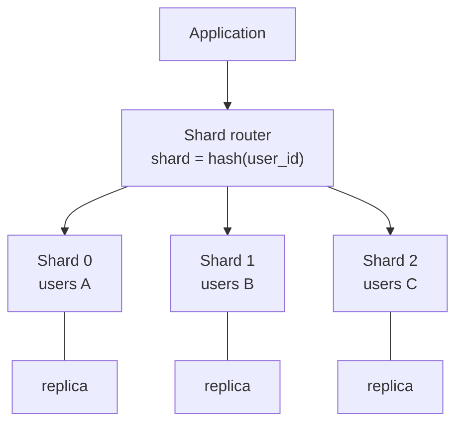

# Database Sharding: Splitting Data to Scale Beyond One Machine

*How Instagram, YouTube, Pinterest, and Notion keep billions of rows queryable by cutting a single database into many.*

---

> *“Life beyond Distributed Transactions: an Apostate's Opinion.”*
>
> — **Pat Helland**, paper title, CIDR 2007

## At a Glance

> **In one sentence:** Sharding splits one database's data across many independent databases by a shard key, so storage and write load can grow beyond one machine — at the cost of harder cross-shard queries, transactions, hot spots, and resharding.

**You'll learn**

- When sharding is (and isn't) necessary
- Range, hash, directory, and geographic sharding
- How to choose a good shard key
- Hot shards, cross-shard queries, and distributed transactions
- Resharding safely and consistent hashing

**Before you start:** [How Databases Work](../04-Data-And-Storage/How-Databases-Work.md) · [Data Replication Strategies](../04-Data-And-Storage/Data-Replication-Strategies.md)

**Reading time:** about 40 minutes

---

## The Big Picture



*A router uses the shard key to send each query to exactly one shard; each shard is its own replicated database.*

---

## Introduction

Imagine a single filing cabinet trying to hold every customer record for a national bank. At first it works fine — a few thousand folders, one clerk, one cabinet. But as the bank grows to millions of customers, the cabinet overflows. You can't buy a bigger cabinet forever; eventually no cabinet is big enough, and even if it were, one clerk can't retrieve folders fast enough for the whole country.

The bank's solution is obvious in hindsight: **open branch offices**. Split customers alphabetically, or by region, or by account number, and give each branch its own cabinet and its own clerk. A customer in Ohio doesn't wait behind a customer in California. Each branch is smaller, faster, and independently manageable. The tradeoff: if you need to compile a report across *every* customer in the country, you now have to visit every branch and combine the results.

**Database sharding is this branch-office strategy applied to data.** Instead of one enormous database instance holding every row, you split (or "shard") the dataset across many smaller, independent database instances, each holding a subset of the data. A single logical table might live across dozens, hundreds, or even thousands of physical machines, with an application-level or middleware routing layer deciding which shard owns which row.

Sharding is the technique that lets Instagram store tens of billions of photos, lets YouTube manage hundreds of millions of videos' worth of metadata, and lets Notion track billions of content blocks — all while keeping individual queries fast, because no single machine ever has to search the entire dataset.

### Why Should Engineers Care About Sharding?

Sharding is one of the most consequential — and most irreversible — architectural decisions a growing system makes. Engineers who understand it deeply can:

- Recognize *before* a single database becomes a bottleneck, rather than firefighting it in production
- Choose a shard key that avoids hot spots and expensive resharding later
- Design applications that gracefully handle the loss of cross-shard transactions and joins
- Build and safely operate resharding/rebalancing pipelines without downtime
- Avoid the classic mistake of sharding too early (needless complexity) or too late (an emergency migration under load)

### Where Is Sharding Used?

| System | Sharding Approach | Purpose |
|--------|-------------------|---------|
| Instagram (Postgres) | Logical shards mapped to physical DBs, composite 64-bit IDs | Store tens of billions of photos/likes across thousands of logical shards |
| YouTube (Vitess/MySQL) | Range + hash sharding via a routing/query layer | Scale MySQL horizontally without rewriting application queries |
| Pinterest (MySQL) | Range-based shards ("shard ID" embedded in object IDs) | Partition pins, boards, and users across thousands of MySQL hosts |
| Notion (Postgres) | Hash-based sharding on workspace ID | Distribute blocks/workspaces across 480+ Postgres shards |
| Discord (Cassandra/ScyllaDB) | Hash-based partitioning by channel ID | Store trillions of messages across a distributed ring |
| Uber (Schemaless/MySQL) | Hash-based sharding underneath an abstraction layer | Scale trip and rider/driver data horizontally |
| MongoDB / Vitess / Citus | Built-in range, hash, or directory-based sharding | General-purpose horizontal scaling for relational/document data |

---

## The Problem It Solves

### The Single-Database Ceiling

A single database server — no matter how large — has finite CPU, memory, disk I/O, and connection capacity. As a dataset and its query volume grow, you eventually hit walls:

- **Storage limits:** A table with billions of rows may not fit on a single disk, or indexes may no longer fit in memory, causing every query to hit slow disk I/O.
- **Write throughput limits:** A single primary database can only accept so many writes per second before it saturates its disk, WAL/redo log, or CPU.
- **Connection limits:** Databases have a maximum number of concurrent connections; a viral product can exceed this in minutes.
- **Vacuum/maintenance limits:** Operations like Postgres's `VACUUM` or MySQL's `ALTER TABLE` become impractically slow on tables with billions of rows.

### Why Vertical Scaling and Read Replicas Aren't Enough

Two common first responses to database growth are:

1. **Vertical scaling** — buy a bigger machine (more CPU, RAM, faster disks). This works for a while, but it has a hard ceiling (the largest cloud instance available), it's expensive, and it does nothing for write throughput once a single primary is the bottleneck.
2. **Read replicas** — add read-only copies of the database to spread out read traffic. This helps read-heavy workloads, but every replica still has the *entire* dataset, so storage limits remain, and — critically — **all writes still funnel through one primary**.

Sharding is the technique that breaks through both ceilings: by splitting data (not just read traffic) across many machines, both storage *and* write throughput scale horizontally.

### What Sharding Provides

| Need | How Sharding Solves It |
|------|------------------------|
| **Storage scalability** | Each shard holds only a fraction of the total data |
| **Write scalability** | Writes to different shards happen on different machines, in parallel |
| **Read scalability** | Reads for a given row only need to query its owning shard |
| **Fault isolation** | A failure or slow query on one shard doesn't necessarily degrade the others |
| **Operational flexibility** | Individual shards can be backed up, migrated, or upgraded independently |

### What Happens Without Sharding?

- A single database becomes a hard scaling ceiling — the application literally cannot grow past what one machine can hold and serve
- Write-heavy workloads (chat apps, social feeds, ad-tech event logging) saturate the primary's disk I/O and replication lag balloons
- Maintenance operations (index rebuilds, schema migrations, backups) take hours or days, and can lock large tables
- A single hardware failure can take down the *entire* dataset, not just a fraction of it
- Engineering teams eventually face an emergency, unplanned migration under production load — the worst time to design a sharding scheme

---

## Historical Background

### 1980s–1990s: Mainframe Partitioning

The core idea of splitting data across storage units predates the web. Mainframe databases used **horizontal partitioning** to split large tables across disk volumes for performance, and distributed database research (e.g., **IBM's R\*** project, early 1980s) explored splitting relational data across independent nodes.

### Late 1990s–2000s: The Web-Scale Problem Emerges

As web applications began serving millions of users on commodity relational databases (MySQL, Postgres), engineers hit single-server limits that mainframe-style partitioning hadn't anticipated. Early large sites — eBay, Friendster, LiveJournal — pioneered **application-level sharding**: manually splitting users or content across multiple MySQL instances and routing queries in application code, because no off-the-shelf tool did it for them.

- **2006: LiveJournal's memcached and sharding practices** became widely cited as an early public case study of splitting a MySQL-backed social site (user data partitioned across multiple "clusters") to survive rapid growth.
- **2007: Amazon's Dynamo paper** (SOSP 2007) formalized *consistent hashing* as a mechanism for partitioning data across a distributed key-value store, deeply influencing how future sharded systems (and NoSQL databases broadly) would distribute data and handle node addition/removal.

### 2008–2012: NoSQL and Purpose-Built Sharded Systems

- **2008: Google's Bigtable paper** (OSDi 2006, widely adopted after) described range-based sharding of massive tables across tablet servers, directly inspiring HBase and Cassandra's partitioning models.
- **2009: MongoDB** shipped with built-in sharding support (range-based, later hash-based), making sharding accessible without hand-rolled application logic.
- **2010: Facebook's Cassandra** (originally built in-house, open-sourced 2008) used consistent hashing to shard data across a ring of nodes.
- **2011: Instagram's engineering team** (then a small startup, before the 2012 Facebook acquisition) published a widely read blog post, *"Sharding & IDs at Instagram,"* describing their Postgres-based logical-shard scheme with custom 64-bit IDs — a design still referenced today as a canonical example of thoughtful, low-complexity sharding.

### 2013–Present: Sharding as Infrastructure

- **2013: Vitess** was created at YouTube (Google) to let its enormous MySQL fleet scale horizontally without every application team reimplementing sharding logic. Vitess later became a CNCF graduated project (2019) and now powers companies like Slack, GitHub, HubSpot, and Square.
- **2015: Uber's Schemaless** paper described a custom sharded storage layer built on top of many MySQL instances to scale trip data.
</br>
- **2018: Citus** (a Postgres extension, later acquired by Microsoft in 2019) brought distributed/sharded tables directly into Postgres via `citus_shard_key`-style distribution, popularizing "distributed Postgres" as a first-class option.
- **2021: Notion** published details of migrating its single large Postgres database into **480 logical shards across 32 physical Postgres instances**, hash-partitioned by workspace ID, after its dataset grew beyond what vertical scaling and read replicas could sustain.
- **2020s: Discord** detailed migrating trillions of messages from Cassandra to ScyllaDB, retaining a hash-partitioned-by-channel sharding model while dramatically improving tail latency.

Sharding has moved from an ad-hoc survival tactic invented independently by growing startups to a well-understood, tooled discipline — but it remains one of the hardest and most consequential decisions in distributed systems design.

---

## Core Concepts

### What Is a Shard?

A **shard** is a horizontal partition of a dataset: a subset of rows from a logical table (or set of tables) stored on its own database instance (or its own portion of storage). Each shard is a fully functional, independent database — it just doesn't hold the *whole* dataset.

```
Logical table: users (500 million rows)

Shard 1 (10.0.1.1) -----> users where shard_key in [0 - 99,999,999]
Shard 2 (10.0.1.2) -----> users where shard_key in [100,000,000 - 199,999,999]
Shard 3 (10.0.1.3) -----> users where shard_key in [200,000,000 - 299,999,999]
Shard 4 (10.0.1.4) -----> users where shard_key in [300,000,000 - 399,999,999]
Shard 5 (10.0.1.5) -----> users where shard_key in [400,000,000 - 499,999,999]
```

### The Shard Key

The **shard key** (or partition key) is the column (or derived value) used to decide which shard a given row belongs to. Choosing it well is the single most important decision in a sharding design — it is very hard to change later.

A good shard key:
- Has high cardinality (many distinct values, so data spreads evenly)
- Distributes access evenly (no single value receives disproportionate traffic — avoiding "hot shards")
- Aligns with your dominant query pattern (most queries should be answerable from a single shard)

### Sharding Strategies

**1. Range-Based Sharding**

Rows are assigned to shards based on ranges of the shard key.

```
Shard A: user_id 1        - 10,000,000
Shard B: user_id 10,000,001 - 20,000,000
Shard C: user_id 20,000,001 - 30,000,000
```

| Pros | Cons |
|------|------|
| Simple to reason about; range queries are efficient | New users (sequential IDs) all land on the newest shard — hot spot |
| Easy to add new ranges as data grows | Requires careful rebalancing as ranges fill unevenly |

**2. Hash-Based Sharding**

A hash function is applied to the shard key, and the result (often modulo the shard count, or via consistent hashing) determines the shard.

```
shard_id = hash(user_id) % num_shards
```

| Pros | Cons |
|------|------|
| Even distribution of writes and storage | Range queries (e.g. "all users created this week") become full scatter-gather |
| No natural hot spot from sequential IDs | Resharding (changing num_shards) can require moving most of the data unless using consistent hashing |

**3. Directory-Based Sharding**

A lookup service (a "shard directory" or "shard map") maintains an explicit mapping from shard key to physical shard, rather than deriving it algorithmically.

```
Lookup Table (shard_map):
  user_id 552019 -> shard 7
  user_id 552020 -> shard 3
  user_id 552021 -> shard 7
```

| Pros | Cons |
|------|------|
| Maximum flexibility — any key can be moved to any shard | The directory itself must be highly available and fast (often cached aggressively) |
| Enables online resharding one row/range at a time | Adds a lookup hop to every query (usually mitigated with caching) |

**4. Geo-Based (Location) Sharding**

Data is sharded by geography — e.g., European users' data lives in EU-region shards, US users' data lives in US-region shards.

```
Shard "eu-west" -----> users where region = 'EU'
Shard "us-east" -----> users where region = 'US'
Shard "ap-south" ----> users where region = 'APAC'
```

| Pros | Cons |
|------|------|
| Reduces latency (data lives close to users) | Uneven shard sizes if user population is geographically skewed |
| Helps satisfy data-residency/compliance requirements (GDPR) | Cross-region queries and moves (e.g. a user relocating) are expensive |

### Comparing the Strategies

| Strategy | Distribution | Range Queries | Resharding Cost | Typical Use Case |
|----------|--------------|----------------|------------------|-------------------|
| Range-based | Uneven (hot new range) | Fast | Moderate (split ranges) | Time-series, ordered IDs |
| Hash-based | Even | Slow (scatter-gather) | High unless consistent hashing | User/entity data at scale |
| Directory-based | Fully controllable | Depends on backing store | Low (move one entry at a time) | Systems needing fine-grained rebalancing |
| Geo-based | Depends on population | Fast within region | High for cross-region moves | Latency-sensitive, compliance-driven apps |

### Cross-Shard Queries and Joins

The central cost of sharding is that **queries spanning multiple shards become fundamentally harder.**

```
Single database:
  SELECT * FROM orders o JOIN users u ON o.user_id = u.id
  WHERE u.country = 'DE';
  -- One query, one query planner, one transaction.

Sharded database (sharded by user_id):
  For each shard:
      SELECT * FROM orders o JOIN users u ON o.user_id = u.id
      WHERE u.country = 'DE';
  Then merge/aggregate results in the application layer.
  -- N queries, N round trips, manual merge, no cross-shard
     transactional consistency, no single query planner to
     optimize the join.
```

Why this is hard:
- **No native cross-shard JOIN.** The database engine on shard A has no visibility into shard B's data. Joins across shards must be done in application code ("scatter-gather"), which is slower and loses query-planner optimizations.
- **No cross-shard transactions (without extra machinery).** A transaction that must atomically update rows on two different shards requires distributed transaction protocols (two-phase commit, sagas) that add latency and operational risk — most sharded systems avoid them outright.
- **Aggregate queries (COUNT, SUM, GROUP BY) become scatter-gather.** Every shard must be queried and results merged/re-aggregated in the application or a query-routing layer.
- **Secondary indexes not aligned with the shard key require either a full scatter-gather or a separate, duplicated secondary index (a "global index") that must be kept in sync.**

---

## Real-World Analogy

### The Public Library System

Imagine a city's public library system with one enormous central library. Every book, in every genre, sits on one set of shelves, and the same staff check every book in and out. As the city grows to millions of residents, the central library becomes impossibly crowded — long checkout lines, and the building itself can't hold any more shelves.

The city's solution: **open branch libraries**, each responsible for a subset of the collection.

- **Range-based sharding** is like assigning branches by call number: Branch 1 holds fiction A–F, Branch 2 holds fiction G–M, and so on. Finding "all fiction starting with C" is fast — go straight to Branch 1. But if a new bestselling author's last name starts with "F," Branch 1 gets crowded while Branch 5 (U–Z) sits mostly empty.
- **Hash-based sharding** is like assigning every book a random branch based on a hash of its ISBN. Books are evenly spread across branches — no branch is ever crowded. But now, "find all fiction starting with C" requires calling *every* branch and combining the answers, because a hash gives no locality.
- **Directory-based sharding** is like a central card catalog that says exactly which branch holds which book, independent of any formula. The library can freely move an individual book to a less-busy branch, but every patron must consult the catalog first (fast if the catalog itself is well-indexed and cached).
- **Geo-based sharding** is like assigning branches by neighborhood: your local branch holds the books most relevant to your area (local history, closest to your commute). It's convenient day-to-day, but if you want a book from the branch across town, you have to specifically request an inter-branch transfer.

Now imagine a patron requests a report: "list every book checked out by anyone in the city this month, grouped by genre." In the single central library, one librarian pulls one ledger. Across branch libraries, headquarters must call every branch, collect their individual lists, and manually merge and re-sort them — exactly the scatter-gather cost of a cross-shard query.

---

## How It Works Internally

### The Complete Write Path

```
  Application
       │
       ▼
  ┌─────────────────────────────────────┐
  │      Shard Router / Middleware       │
  │                                      │
  │  1. Extract shard key from the       │
  │     write (e.g. user_id = 552019)    │
  │                                      │
  │  2. Compute target shard:            │
  │     - hash(user_id) % N   (hash)     │
  │     - or lookup in shard map (dir.)  │
  │     - or range lookup (range)        │
  │                                      │
  │  3. Open connection to owning shard  │
  │                                      │
  │  4. Execute INSERT/UPDATE on that    │
  │     shard's database instance only   │
  │                                      │
  │  5. Return result to application     │
  └─────────────────────────────────────┘
       │
       ▼
  Physical Shard (e.g. Postgres instance #7)
```

### The Complete Read Path (Single-Shard Query)

```
Application: "Get user 552019's profile"
       │
       ▼
Shard Router: shard = hash(552019) % 64 = shard 41
       │
       ▼
Query only shard 41 --------> Return row directly
```

### The Complete Read Path (Cross-Shard / Scatter-Gather Query)

```
Application: "Count all users signed up today"
       │
       ▼
Shard Router: no single shard key present -> fan out to all shards
       │
       ├──> Shard 1: SELECT COUNT(*) WHERE created_at = today
       ├──> Shard 2: SELECT COUNT(*) WHERE created_at = today
       ├──> Shard 3: SELECT COUNT(*) WHERE created_at = today
       ...
       └──> Shard N: SELECT COUNT(*) WHERE created_at = today
       │
       ▼
Aggregator: sum all partial counts, return single result
```

### Resharding: Moving Data Without Downtime

When a shard grows too large or too hot, its data must be split or moved — while the system stays online. A common pattern (used by Vitess, and conceptually by Instagram, Notion, and Pinterest's migrations):

```
Step 1: Dual-write
  New writes are written to BOTH the old shard and the new
  target shard. Reads still come from the old shard.

Step 2: Backfill
  A background job copies existing historical data from the
  old shard to the new shard, in small batches, to avoid
  overloading either.

Step 3: Verify
  Compare row counts / checksums between old and new shard
  to confirm the backfill is complete and consistent.

Step 4: Cutover
  Update the shard map / routing rules so reads (and then
  writes) point to the new shard.

Step 5: Cleanup
  Stop dual-writing; delete the now-redundant data from the
  old shard.
```

This is essentially the same "double-write, backfill, verify, cutover" pattern used for zero-downtime data migrations generally — sharding just applies it at the level of entire partitions of data.

---

## Components and Architecture

### 1. Shard Key / Partition Key

The column (or composite value) used to route rows to shards. Chosen once, hard to change — the foundation of the whole design.

### 2. Shard Router (Query Router / Middleware)

The component that decides, for every query, which physical shard(s) to talk to. Implementations vary:
- **Application-level routing** (Instagram's early Postgres approach — routing logic lives in app code)
- **Proxy-based routing** (Vitess's `VTGate`, ProxySQL — a dedicated network layer between app and database)
- **Database-native routing** (Citus's coordinator node, MongoDB's `mongos` router)

### 3. Shard Map / Metadata Store

For directory-based (and often hash-based) sharding, a small, highly-available metadata service tracks which shard owns which key range or key. This metadata store must itself be fast and resilient — it's queried on nearly every request (often cached at the edge).

### 4. Physical Shards

The actual database instances (Postgres, MySQL, Cassandra nodes, etc.), each independently running, replicating, and backing up its own subset of data.

### 5. ID Generator

In many sharded systems, primary keys are generated to *encode* the shard they belong to, so that given only the ID, you can determine the shard without a lookup. Instagram's scheme (described below) and Twitter's Snowflake IDs are the canonical examples.

### 6. Cross-Shard Aggregator / Fan-Out Layer

A component (sometimes part of the router, sometimes a separate service) responsible for scatter-gather queries: dispatching a query to every relevant shard in parallel and merging results.

```
                     ┌────────────────────┐
                     │   Shard Router /    │
                     │   Query Layer       │
                     └─────────┬──────────┘
                               │
        ┌──────────────┬──────┴───────┬──────────────┐
        v              v               v              v
   Shard 1 DB     Shard 2 DB      Shard 3 DB     Shard N DB
   (replica set)  (replica set)   (replica set)  (replica set)
```

---

## End-to-End Flow

### Example: Maria Uploads a Photo on a "Gramstagram"-Style App

Let's trace a write and a subsequent read through a sharded photo-sharing service modeled closely on Instagram's real, publicly documented sharding scheme.

**Background:**
- The app uses Postgres, split into **2,000 logical shards**, mapped onto **~40 physical database instances** (roughly 50 logical shards per physical machine — Instagram's own published ratio was similar, allowing them to move logical shards between physical machines without changing application-facing IDs).
- Every ID (photo ID, user ID) is a **64-bit composite ID**: 41 bits for a millisecond timestamp, 13 bits for the logical shard ID, and 10 bits for an auto-incrementing per-shard sequence.

**Step 1: Maria uploads a photo at 3:14:07 PM UTC.**

The application first determines *which logical shard* should own this new photo. Because photos belong to users, the app shards by `user_id`: Maria's `user_id` hashes to logical shard **1,742**.

**Step 2: ID Generation**

The application asks logical shard 1,742's ID sequence for the next value (or generates it locally using the epoch-timestamp + shard-id + sequence scheme):

```
timestamp_ms (41 bits) = 1,752,507,247,000
shard_id     (13 bits) = 1742
sequence     (10 bits) = 5   (5th ID generated this millisecond on this shard)

photo_id = (timestamp_ms << 23) | (shard_id << 10) | sequence
         = 6821912532299785 * ... (a single 64-bit integer)
```

Because the shard ID is embedded directly in the photo ID, **any future lookup of this photo can compute its owning shard without a directory lookup** — just bit-shift the ID.

**Step 3: Write**

The shard router extracts shard 1,742 from the newly minted ID, maps logical shard 1,742 to physical database host `pg-shard-08.internal`, and executes:

```sql
INSERT INTO photos (id, user_id, image_url, caption, created_at)
VALUES (6821912532299785, 552019, 's3://...', 'sunset', now());
```

Total round trip: ~4ms (single shard, single machine, no cross-shard coordination needed).

**Step 4: Maria's followers' feeds are updated**

A background fan-out worker reads Maria's follower list (itself sharded by `user_id` of the *follower*, not Maria), and for each follower, writes a feed entry to *that follower's* shard. A follower with `user_id` 998211 lives on logical shard 640, physical host `pg-shard-31.internal` — a completely different machine. This write happens independently and in parallel with writes to other followers' shards.

**Step 5: A friend, Dev, opens his feed 40 seconds later**

The app looks up Dev's `user_id`, computes his logical shard (640, same physical host `pg-shard-31.internal` as above), and reads his precomputed feed table directly from that one shard — no cross-shard query needed, because Maria's photo was already written into Dev's feed shard during fan-out. This read completes in ~8ms.

**Step 6: Product analytics team runs a report ("photos uploaded today, by hour")**

This query cannot be answered from a single shard. The shard router (or a dedicated analytics pipeline, in practice usually a separate data warehouse fed by CDC/ETL rather than live scatter-gather) fans the query out to all 40 physical hosts, each returning hourly counts for its subset of photos, and an aggregator sums the results. This takes ~1.2 seconds — dramatically slower than the single-shard writes/reads above, illustrating exactly why cross-shard queries are the expensive path.

---

## Production Engineering Perspective

### Scalability

| Level | How It Scales | Example |
|-------|----------------|---------|
| **Single shard** | Vertical scaling within the shard | Upgrade one Postgres instance's instance type |
| **More shards** | Increase logical shard count or split hot shards | Instagram's 2,000 logical shards over ~40 physical hosts |
| **Physical rebalancing** | Move logical shards to new physical hardware without changing IDs | Instagram moving logical shards to new DB hosts transparently |
| **Global** | Combine geo-sharding with per-region horizontal sharding | Notion's per-workspace hash shards across regions |

**Key principle:** decouple the *logical* shard count (which determines routing and is hard to change) from the *physical* machine count (which should be easy to change). This is precisely what Instagram's logical/physical split and Vitess's `VTGate` abstraction both achieve.

### Reliability

- **Replicate every shard independently** — each shard should have its own primary + replica(s); losing one shard's primary should not affect other shards.
- **Design for partial failure** — a scatter-gather query should tolerate one slow/unavailable shard (via timeouts and partial results) rather than failing the entire request.
- **Shard-level backups** — back up and test-restore each shard independently; a corrupted shard should be recoverable without restoring the entire dataset.

### Performance

| Metric | Target | How to Achieve |
|--------|--------|-----------------|
| Single-shard query latency | Same as an unsharded query (no penalty) | Route directly using the shard key; avoid unnecessary lookups |
| Cross-shard query latency | Bounded by the slowest shard | Parallel fan-out, aggressive per-shard timeouts |
| Shard size | Keep well within one machine's comfortable capacity (commonly tens to low hundreds of GB per shard) | Split proactively, not reactively |
| Resharding downtime | Zero | Dual-write + backfill + verify + cutover pattern |

### Availability

- **No single shard should be a single point of failure for the whole system** — a well-sharded design means one shard's outage degrades only the users/data on that shard, not everyone.
- **Shard map / directory availability is critical** for directory-based schemes — cache it aggressively (client-side or via a fast distributed cache) so a directory outage doesn't take down all routing.
- **Graceful degradation for cross-shard features** — e.g., a "trending" feature that depends on all shards responding should degrade to partial/cached results rather than failing entirely if one shard times out.

### Maintainability

- **Automate shard provisioning** — creating a new shard (schema, replication, monitoring, backups) should be a one-command/one-pipeline operation, not manual toil.
- **Instrument per-shard metrics** — track query latency, error rate, and storage per shard individually; aggregate dashboards hide the "hot shard" problem.
- **Version and test the routing logic thoroughly** — a bug in shard-key computation can silently write data to the wrong shard, which is extremely painful to detect and repair after the fact.

---

## Tradeoffs

### ✅ Benefits

| Benefit | Explanation |
|---------|-------------|
| **Horizontal storage scaling** | Total dataset size is bounded only by the number of shards, not one machine's disk |
| **Horizontal write scaling** | Writes to different shards proceed in parallel on different machines |
| **Fault isolation** | A single shard's failure or slowness affects only its subset of data/users |
| **Independent operations** | Shards can be upgraded, migrated, or backed up on independent schedules |
| **Lower per-query working set** | Indexes and hot data for one shard are more likely to fit in memory |

### ❌ Drawbacks

| Drawback | Explanation |
|----------|-------------|
| **No native cross-shard joins** | Multi-shard joins must be done in application code, losing query-planner optimization |
| **No easy cross-shard transactions** | Atomic updates across shards require distributed transaction protocols (2PC, sagas) — complex and slower |
| **Operational complexity** | You now operate N databases instead of one — N times the monitoring, backups, failover configs |
| **Resharding is hard** | Changing the shard key or shard count later requires a careful, often lengthy, data migration |
| **Hot shards** | A poorly chosen shard key can concentrate traffic on one shard, defeating the purpose of sharding |

### ⚠️ Limitations

- **Sharding does not fix a poorly indexed or inefficient query** — it only distributes the pain; a bad query is still bad, just on a smaller dataset per shard.
- **Global uniqueness constraints (e.g. unique email) are hard** — enforcing uniqueness across shards typically requires a separate, centralized lookup index, adding a coordination point.
- **Secondary access patterns not aligned with the shard key are expensive** — if you shard by `user_id` but frequently query "find the photo with this exact URL," that query becomes a full scatter-gather unless you maintain a separate secondary index.

### 🔁 Alternatives

| Approach | When to Use |
|----------|-------------|
| **Vertical scaling** | Simpler; sufficient until you hit a hard single-machine ceiling |
| **Read replicas** | Read-heavy workloads where writes are not yet the bottleneck |
| **Caching layer (Redis/Memcached)** | Reduces database load for hot reads without touching the data model |
| **Managed distributed databases (CockroachDB, Google Spanner, YugabyteDB)** | Built-in sharding with cross-shard transactions, at the cost of higher latency/complexity under the hood |
| **Data partitioning within one instance (native table partitioning)** | Useful for time-series data pruning without the operational overhead of separate machines |

### When NOT to Shard

- **Your dataset comfortably fits, and will continue to fit, on one well-specified machine** — sharding adds substantial complexity for no benefit.
- **You haven't yet exhausted vertical scaling, indexing, caching, and read replicas** — these are far simpler levers and should be pulled first.
- **Your workload is dominated by cross-entity joins and multi-row transactions** — sharding fights against these access patterns; consider a distributed SQL database with built-in transactions instead, or reconsider the data model.
- **Your team lacks the operational maturity to run many database instances** — sharding multiplies operational surface area; underestimating this is a common, costly mistake.

---

## Common Mistakes

### Beginner Mistakes

1. **Sharding before it's needed** — Introducing sharding when a single, well-tuned database (with proper indexing and caching) would have sufficed for years. This adds permanent complexity for a problem you don't have yet.

2. **Choosing a low-cardinality or unevenly distributed shard key** — Sharding by `country` when 80% of users are in one country just recreates a single overloaded shard with extra steps.

3. **Ignoring cross-shard query patterns until production** — Designing the write path around a shard key without checking whether the application's *read* patterns can actually be satisfied by that key.

### Intermediate Mistakes

4. **Sequential IDs as the shard key with range-based sharding** — All new writes land on the newest (last) shard, creating a permanent hot spot exactly when write throughput matters most.

5. **No plan for resharding** — Hardcoding `shard_id = hash(key) % N` with a fixed `N` means changing `N` later requires moving almost all the data. Consistent hashing or directory-based schemes avoid this trap.

6. **Under-provisioning the shard map / routing layer** — Treating the directory or router as an afterthought; when it becomes slow or unavailable, *every* shard becomes unreachable, even though the shards themselves are healthy.

### Senior-Level Architectural Mistakes

7. **Choosing a shard key that doesn't match the dominant access pattern** — E.g., sharding a photo-sharing app by `photo_id` when nearly every query is "get this user's photos" forces cross-shard scatter-gather for the most common operation.

8. **Underestimating the cost of secondary indexes and uniqueness constraints across shards** — Building global uniqueness (e.g. unique usernames) as an afterthought, requiring a bolt-on centralized service that becomes its own bottleneck and single point of failure.

9. **Performing resharding as a "big bang" cutover instead of gradual dual-write + backfill + verify** — A large, all-at-once migration under production load is exactly the scenario that produces multi-hour outages and data loss; incremental, verifiable migrations are safer even though they take longer.

10. **Not isolating noisy tenants within a shard** — In multi-tenant hash sharding (e.g., by `workspace_id`), a single very large or very active tenant landing on a shard can degrade performance for every other tenant co-located on that shard — "hot shard" caused not by the hash function but by real-world data skew.

---

## Failure Scenarios

### Scenario 1: The Hot Shard

**What happens:** One shard receives disproportionately more traffic or storage than the others — for example, a celebrity user's account, or a single very large customer workspace, lands on one shard and generates 100x the read/write volume of a typical shard.

**Why it fails:** Hash-based sharding distributes *keys* evenly, but it cannot guarantee that the *access pattern* of every key is evenly distributed. One extremely popular row can overwhelm the single machine hosting its shard, while every other shard sits comfortably under load.

**How to diagnose:**
- Per-shard dashboards show one shard's CPU/IOPS/connection count far exceeding the others
- Query latency percentiles are fine in aggregate but terrible for a specific subset of users
- Replication lag climbs on exactly one shard's replica

**Solutions:**
- Split the hot key onto its own dedicated shard (a documented Instagram and Pinterest practice: give unusually large/active entities their own isolated shard)
- Add a caching layer in front of the hot shard to absorb read traffic
- Use finer-grained logical shards (more logical shards than physical machines) so a hot logical shard can be moved to an underutilized physical host without an application-level ID change
- For extreme cases, sub-shard a single large tenant's data further (e.g., shard a huge workspace's data by a secondary key)

### Scenario 2: A Resharding Migration Goes Wrong

**What happens:** During a migration to increase the shard count (e.g., 64 shards to 128), a bug in the dual-write logic causes some writes during the migration window to be written to only the old shard, not the new one. After cutover, those rows are missing on the new shard.

**Why it fails:** Resharding requires perfect consistency between old and new locations during the dual-write window. Any gap — a retry that only hits one target, a race condition, a partial failure that isn't rolled back symmetrically — creates silent data loss that isn't visible until a user reports missing data.

**How to diagnose:**
- Row-count and checksum comparisons between old and new shard reveal a discrepancy before cutover (this is why the "verify" step is mandatory, not optional)
- User reports of "my data disappeared" after a migration is the worst-case, post-hoc signal
- Application-level write-path logs show writes that succeeded on one target and failed (or were never attempted) on the other

**Solutions:**
- Never skip the verification step — checksum/row-count comparisons *before* cutting reads over
- Use idempotent, retryable dual-write logic with explicit tracking of which writes succeeded on which target
- Keep the old shard's data intact (don't delete) for a safety window after cutover, so any discovered gap can be backfilled
- Roll cutover out gradually (a percentage of traffic/keys at a time), not all at once

### Scenario 3: Cross-Shard Transaction Inconsistency

**What happens:** An application performs a "transfer" operation that must decrement a balance on shard A and increment a balance on shard B. A network failure occurs after the decrement commits but before the increment does.

**Why it fails:** Each shard is an independent database with its own local transaction guarantees; there is no built-in mechanism to make an operation spanning two shards atomic. Without additional coordination, partial failures leave the system in an inconsistent state (money "disappears").

**How to diagnose:**
- Reconciliation jobs comparing expected vs. actual aggregate totals across shards reveal drift
- Application logs show a decrement committed with no matching increment logged
- User/support reports of "my balance is wrong"

**Solutions:**
- Avoid designing operations that require cross-shard atomicity in the first place — model the data so operations that must be atomic live on the same shard (e.g., shard by account, and keep both sides of a common operation within one account's shard where feasible)
- Where cross-shard atomicity is unavoidable, use the **saga pattern** (a sequence of local transactions with compensating actions on failure) rather than distributed two-phase commit, which is operationally fragile at scale
- Use idempotency keys and a durable outbox/event log so a failed second step can always be retried safely
- Consider a distributed SQL database (Spanner, CockroachCB) if true cross-shard ACID transactions are a frequent, first-class requirement — that's precisely the problem those systems are built to solve

### Scenario 4: The Directory Service Becomes a Bottleneck

**What happens:** In a directory-based sharding scheme, the central shard-map lookup service experiences a traffic spike or partial outage, and suddenly every query across every shard is blocked waiting on a directory lookup.

**Why it fails:** The directory was designed as "just a small lookup table," but at scale it receives a lookup on nearly every single query in the system, making it a de facto single point of failure for the entire sharded architecture.

**How to diagnose:**
- Latency graphs show a spike in "directory lookup" time correlating exactly with overall request latency spikes, even though individual shards report normal load
- Directory service error rate or connection pool exhaustion metrics spike
- Shards themselves show idle capacity while overall throughput drops

**Solutions:**
- Cache shard-map lookups aggressively at the client/application layer, with a short TTL and event-driven invalidation on shard moves
- Run the directory service as a highly available, horizontally scaled cluster in its own right (it deserves the same production rigor as the shards it maps)
- Embed shard identity directly in generated IDs where possible (Instagram/Snowflake-style composite IDs) to eliminate the lookup for the common case, reserving the directory only for administrative shard-location changes

---

## Security Considerations

### Access Control Per Shard

Each shard is a full database instance and must be secured as one: least-privilege credentials, network isolation (private subnets, security groups), and encryption at rest — multiplied across every shard rather than configured once.

### Consistent Enforcement of Row-Level Policies

Multi-tenant sharded systems (Notion's per-workspace shards, for example) must ensure tenant isolation is enforced not just by the shard key routing logic but at the database/query layer too — a bug in the router should not be able to leak one tenant's rows into another tenant's shard or query results.

### Credential and Secret Sprawl

Operating dozens or hundreds of shards means dozens or hundreds of sets of database credentials. Centralize credential management (a secrets manager, short-lived credentials via IAM) rather than static per-shard passwords scattered across configuration files.

### Backup and Restore Security

Shard backups multiply the number of places sensitive data is stored at rest. Apply the same encryption, access-control, and retention policies uniformly across every shard's backups — a single misconfigured shard's backup bucket is a full data-breach vector.

### Audit Logging Across Shards

Because a single logical action (e.g., "delete user") may touch multiple shards, ensure audit/compliance logging happens at the application/router layer, not left to be individually reconstructed from N different shards' logs after the fact.

---

## Performance Considerations

### Bottlenecks

| Bottleneck | Why It Happens | How to Fix |
|------------|-----------------|------------|
| **Hot shard** | Uneven access pattern despite even hashing | Isolate hot keys onto dedicated shards; add caching |
| **Cross-shard scatter-gather queries** | Query can't be answered from one shard | Denormalize/precompute (e.g. fan-out on write, as Instagram does for feeds) |
| **Shard map / directory lookups** | Every query needs a routing decision | Cache aggressively; embed shard ID in generated keys |
| **Resharding migrations** | Backfilling large volumes of data while serving live traffic | Throttle backfill rate; run during low-traffic windows; batch copies |
| **Uneven shard sizes over time** | Organic data growth is rarely perfectly uniform | Monitor per-shard size/QPS; split proactively before a shard becomes a true outlier |

### Optimization Strategies

1. **Denormalize for the dominant read pattern.** Instagram's feed fan-out (writing a copy of each new photo into every follower's own feed shard at write time) trades extra write work for dramatically cheaper, single-shard reads — the single highest-leverage optimization in most sharded social systems.

2. **Embed the shard ID in generated primary keys.** Eliminates a directory lookup for the overwhelmingly common case of "fetch this exact row by ID."

3. **Batch and parallelize scatter-gather queries.** When a cross-shard query is unavoidable, fan out to all shards concurrently (not sequentially) and apply a tight per-shard timeout so one slow shard doesn't stall the whole query.

4. **Keep shards small enough to stay memory-resident for hot indexes.** A shard whose working set fits in RAM avoids disk I/O for the vast majority of queries — this is often a better sizing heuristic than "how many rows fit on disk."

5. **Use connection pooling per shard.** With dozens or hundreds of shards, naive per-request connections multiply quickly; a pooler (PgBouncer, ProxySQL) per shard (or shared pooling tier) keeps connection counts sane.

### Scaling Challenges

- **The number of shards itself becomes an operational scaling problem** — Instagram, Notion, and Vitess-based systems all deliberately over-provision *logical* shards relative to *physical* machines specifically so that scaling out later means moving logical shards to new hardware, not re-deriving IDs or rewriting application code.
- **Rebalancing at scale is a continuous process, not a one-time migration** — mature sharded systems (Vitess, Cassandra/ScyllaDB rings) treat shard/tablet rebalancing as an ongoing background operation, not a rare emergency event.
- **Query patterns evolve, but the shard key can't easily follow** — a shard key chosen for today's dominant access pattern may become suboptimal as the product evolves; anticipate this by leaving room for secondary indexing strategies (materialized views, search indexes) rather than assuming the shard key will forever match every future query.

---

## Real-World Industry Examples

### Instagram — Logical Shards Mapped to Physical Postgres Databases

Instagram's engineering team published their approach in a now-classic 2011/2012 blog post, *"Sharding & IDs at Instagram,"* while running on Postgres before their 2012 acquisition by Facebook.

- **~2,000 logical shards** were created up front, each a Postgres schema, distributed across a much smaller number of physical database machines.
- Because there were far more logical shards than physical machines, Instagram could **move logical shards between physical hosts to rebalance load — without changing any application-facing ID**, since the shard ID is embedded in the ID itself, not derived from which physical box currently hosts it.
- **Custom 64-bit IDs** were generated combining a millisecond timestamp, a logical shard ID, and a per-shard auto-increment sequence — avoiding both the coordination overhead of a centralized ID service and the collision risk of naive per-shard auto-increment alone.
- This design is frequently cited as a model of "just enough" sharding complexity: simple enough to build with a small team, flexible enough to scale for years.

### YouTube / Vitess — Sharding MySQL at Google Scale

**Vitess** was built inside YouTube (part of Google since 2006) to let a large fleet of MySQL instances scale horizontally without every team reimplementing sharding by hand.

- Vitess introduces `VTGate`, a routing/proxy layer that applications talk to as if it were a single MySQL database; `VTGate` transparently splits queries across the correct shards based on a defined "vindex" (Vitess's shard-key abstraction, supporting hash, range/lookup, and consistent-hash-like schemes).
- It supports **online resharding** (`Reshard` workflows) that perform the dual-write/backfill/verify/cutover pattern under the hood, without requiring application downtime.
- Vitess became a **CNCF graduated project in 2019** and is now used well beyond Google — by Slack, GitHub (for parts of its infrastructure), Square, and HubSpot — as a general-purpose way to shard MySQL.

### Pinterest — Range-Sharded MySQL with Embedded Shard IDs

Pinterest's infrastructure blog has described splitting its core object data (pins, boards, users) across **thousands of MySQL shards**, with the shard ID encoded directly into generated object IDs (conceptually similar to Instagram's scheme), allowing any service to compute an object's shard directly from its ID without a lookup service. Pinterest also built internal tooling to handle shard-level backups, failover, and gradual resharding as specific shards grew disproportionately large.

### Notion — Hash-Sharded Postgres by Workspace

In a widely referenced 2021 engineering blog post, Notion described migrating from a single (heavily read-replicated) Postgres database — which was approaching the limits of what vertical scaling and read replicas could sustain — to **480 logical shards distributed across 32 physical Postgres instances**, hash-partitioned primarily by **workspace ID**.

- The choice of `workspace_id` as the shard key matched Notion's dominant access pattern: almost every query (blocks, pages, comments) is scoped to a single workspace, so the vast majority of queries stay within a single shard.
- The migration itself used a dual-write, backfill, and verification process executed table by table and shard by shard, explicitly designed to avoid downtime for a product already serving a large, active user base.
- Notion over-provisioned logical shard count (480) relative to physical machine count (32) for exactly the same reason Instagram did: it lets them move logical shards to new hardware later without another painful re-sharding of IDs.

### Discord — Hash-Partitioned Cassandra/ScyllaDB by Channel

Discord has published multiple engineering posts about storing **trillions of messages** using a data store partitioned by `channel_id` (with `message_id`/time as a clustering key) — first on Cassandra, later migrated to **ScyllaDB** (a Cassandra-compatible database written in C++) to address tail-latency and compaction issues at extreme scale. The hash-based partitioning-by-channel scheme matches Discord's dominant read pattern (fetch recent messages for one channel), keeping the vast majority of reads within a single partition/shard.

### Uber — Schemaless, a Sharded Datastore Abstraction over MySQL

Uber's engineering team described **Schemaless**, an internally built append-only, sharded data store layered on top of many MySQL instances, used to store trip and rider/driver data at a scale that a single MySQL instance could not sustain. Schemaless hashed a key to determine a shard, abstracting the underlying MySQL sharding details away from application engineers, similar in spirit to what Vitess does for YouTube.

---

## Case Studies

### Case Study 1: Instagram's 2011 Sharding & ID Scheme Announcement

**What happened:** As Instagram's user base exploded in its first two years, its single Postgres database could no longer handle the write volume of photos, likes, and comments. The team needed to shard, but with a very small engineering team, they could not afford a heavyweight distributed-systems project.

**Root cause:** A classic hypergrowth mismatch — a single-node relational database architecture built for an MVP, colliding with viral, exponential user growth.

**Solution:** Instagram designed a deliberately simple scheme: many logical Postgres schemas (shards) mapped onto few physical machines, with custom composite 64-bit IDs encoding the logical shard directly, avoiding both a centralized ID-generation service and a lookup directory for the common case.

**Lesson:** Sharding doesn't require an exotic distributed database — a disciplined, simple scheme on a familiar relational database (Postgres), combined with a well-chosen shard key and self-describing IDs, can carry a company through years of hypergrowth. Complexity should be proportional to actual need, not theoretical purity.

### Case Study 2: Notion's 2021 Database Sharding Migration

**What happened:** By 2021, Notion's single, heavily-read-replicated Postgres database was approaching hard limits — vacuum times, replication lag, and connection saturation were all worsening as the platform's block-based content model generated enormous row counts. Notion needed to shard without disrupting a live, growing product used by millions.

**Root cause:** A single-primary Postgres architecture, appropriate at Notion's earlier scale, could no longer keep pace with both storage growth and write throughput as usage compounded.

**Solution:** Notion's infrastructure team designed a hash-based sharding scheme keyed on `workspace_id` — matching their dominant query pattern where nearly all reads/writes are scoped to one workspace — and executed the migration via the standard dual-write, backfill, verify, and cutover pattern, moving to 480 logical shards spread across 32 physical Postgres machines.

**Lesson:** Choosing a shard key that matches your application's real, dominant access pattern (workspace-scoped queries, in Notion's case) is what makes sharding tractable; a mismatched shard key would have turned nearly every query into an expensive scatter-gather.

### Case Study 3: A Resharding Incident from a Hot-Tenant Shard

**What happened:** A B2B SaaS company (a pattern documented across multiple public engineering post-mortems in the industry, not tied to one specific company here) hash-sharded its data by `customer_id`. One enterprise customer's usage grew far beyond typical customers, and, purely by the luck of the hash function, landed on the same shard as several other mid-sized customers. That shard's CPU and I/O began saturating, causing elevated latency for every customer co-located on it — not just the large one.

**Root cause:** Hash-based sharding guarantees even distribution of *keys*, not even distribution of *load*. A single outsized tenant can overwhelm a shard regardless of how well the hash function spreads other keys.

**Solution:** The team built tooling to detect per-shard load outliers, moved the oversized customer to a dedicated, isolated shard, and — for future large customers — proactively provisioned dedicated shards at onboarding rather than relying purely on the hash function.

**Lesson:** Hot shards are not always a bug in the hashing algorithm — they're often a natural consequence of real-world data and usage skew. Production sharding systems need ongoing per-shard load monitoring and a mechanism (isolated shards, sub-sharding) to handle outliers, not just a one-time even distribution at design time.

---

## Practical Code Examples

### SQL: A Simple Range-Based Sharding Scheme (Conceptual, per Physical DB)

```sql
-- Shard 1 database (10.0.1.1) holds users 1 - 10,000,000
CREATE TABLE users (
    id BIGINT PRIMARY KEY,
    email TEXT NOT NULL,
    created_at TIMESTAMPTZ NOT NULL DEFAULT now()
);

-- Application enforces the range at the routing layer, e.g.:
-- if user_id BETWEEN 1 AND 10000000 -> connect to shard 1
-- if user_id BETWEEN 10000001 AND 20000000 -> connect to shard 2
```

### SQL: Hash-Based Sharding with Postgres + Citus-Style Distribution

```sql
-- Using the Citus extension (distributed Postgres)
SELECT create_distributed_table('orders', 'customer_id');
-- Citus hashes customer_id to assign rows to shards automatically,
-- and co-locates related tables distributed on the same key so
-- joins on customer_id stay within a single shard.

SELECT create_distributed_table('order_items', 'customer_id',
                                 colocate_with => 'orders');
```

### Python: An Instagram-Style Composite ID Generator

```python
import time

EPOCH = 1704067200000  # custom epoch, e.g. 2024-01-01T00:00:00Z, in ms

class ShardedIDGenerator:
    """
    64-bit ID layout:
      41 bits: milliseconds since custom epoch  (~69 years of IDs)
      13 bits: logical shard id                 (up to 8,192 shards)
      10 bits: per-shard, per-millisecond sequence (up to 1,024 IDs/ms/shard)
    """
    def __init__(self, shard_id: int):
        if not (0 <= shard_id < 8192):
            raise ValueError("shard_id must fit in 13 bits")
        self.shard_id = shard_id
        self._last_ms = -1
        self._sequence = 0

    def next_id(self) -> int:
        now_ms = int(time.time() * 1000) - EPOCH
        if now_ms == self._last_ms:
            self._sequence = (self._sequence + 1) % 1024
            if self._sequence == 0:
                # sequence exhausted for this millisecond; spin to next ms
                while now_ms <= self._last_ms:
                    now_ms = int(time.time() * 1000) - EPOCH
        else:
            self._sequence = 0
        self._last_ms = now_ms

        return (now_ms << 23) | (self.shard_id << 10) | self._sequence

    @staticmethod
    def shard_of(object_id: int) -> int:
        """Extract the owning shard directly from an ID -- no lookup needed."""
        return (object_id >> 10) & 0x1FFF


gen = ShardedIDGenerator(shard_id=1742)
photo_id = gen.next_id()
print(photo_id, "-> shard", ShardedIDGenerator.shard_of(photo_id))
```

### Python: A Consistent-Hashing Shard Router

```python
import hashlib
import bisect

class ShardRouter:
    """
    Routes keys to shards using consistent hashing, so adding or
    removing a shard only reassigns a small fraction of keys --
    critical for minimizing data movement during resharding.
    """
    def __init__(self, shards, virtual_nodes=150):
        self.virtual_nodes = virtual_nodes
        self.ring = {}
        self.sorted_hashes = []
        for shard in shards:
            self.add_shard(shard)

    def _hash(self, key: str) -> int:
        return int(hashlib.sha1(key.encode()).hexdigest(), 16)

    def add_shard(self, shard_name: str):
        for i in range(self.virtual_nodes):
            h = self._hash(f"{shard_name}#{i}")
            self.ring[h] = shard_name
            bisect.insort(self.sorted_hashes, h)

    def remove_shard(self, shard_name: str):
        to_remove = [h for h, s in self.ring.items() if s == shard_name]
        for h in to_remove:
            del self.ring[h]
            self.sorted_hashes.remove(h)

    def get_shard(self, key: str) -> str:
        h = self._hash(key)
        idx = bisect.bisect(self.sorted_hashes, h) % len(self.sorted_hashes)
        return self.ring[self.sorted_hashes[idx]]


router = ShardRouter(["pg-shard-01", "pg-shard-02", "pg-shard-03", "pg-shard-04"])
print(router.get_shard("workspace:acme-corp"))

# Adding a fifth shard only remaps ~1/5th of keys, not all of them
router.add_shard("pg-shard-05")
print(router.get_shard("workspace:acme-corp"))
```

### Pseudocode: Zero-Downtime Resharding (Dual-Write / Backfill / Verify / Cutover)

```
function reshard_range(old_shard, new_shard, key_range):
    # 1. Start dual-writing new writes to both shards
    enable_dual_write(key_range, targets=[old_shard, new_shard])

    # 2. Backfill historical rows in small batches to avoid overload
    for batch in old_shard.scan(key_range, batch_size=5000):
        new_shard.bulk_upsert(batch)
        sleep(BACKFILL_THROTTLE_MS)

    # 3. Verify consistency before cutting reads over
    old_checksum = old_shard.checksum(key_range)
    new_checksum = new_shard.checksum(key_range)
    assert old_checksum == new_checksum, "backfill mismatch -- do not cut over"

    # 4. Cut reads (then writes) over to the new shard
    update_shard_map(key_range, owner=new_shard)

    # 5. Stop dual-writing once fully cut over and stable
    disable_dual_write(key_range)

    # 6. Retain old shard's data for a safety window before deleting
    schedule_cleanup(old_shard, key_range, after_days=7)
```

---

## Frequently Asked Questions

**Q: Should I choose range-based, hash-based, or directory-based sharding?**

Use range-based when your dominant queries are range scans (time-series data, ordered event logs) and you can tolerate proactively splitting hot ranges. Use hash-based when even distribution of writes matters more than range-query efficiency (most user/entity-centric applications — this is what Notion and Discord both do). Use directory-based when you need maximum flexibility to move individual keys between shards for rebalancing or tenant isolation, and can afford the operational cost of running a highly available directory service.

**Q: How do I pick a good shard key?**

Start from your dominant, highest-volume query pattern, not from the schema. If 90% of your queries are scoped to a single entity (a user, a workspace, a tenant), shard by that entity's ID — that's exactly why Notion sharded by `workspace_id` and Instagram effectively sharded around user-centric access. A good shard key has high cardinality, spreads load evenly, and keeps the majority of real queries within a single shard.

**Q: Can I avoid cross-shard joins entirely?**

Not entirely, but you can minimize them significantly through denormalization: write data in the shape your reads need (Instagram's feed fan-out on write is the textbook example), maintain purpose-built secondary indexes for cross-cutting queries, and push genuinely cross-shard analytical queries into a separate data warehouse fed by CDC/ETL rather than serving them live from the sharded operational database.

**Q: How many shards should I start with?**

Deliberately over-provision *logical* shards relative to your current *physical* machine count — both Instagram (2,000 logical shards) and Notion (480 logical shards) did this. It lets you scale out by moving logical shards to new physical hardware later, without ever having to change a generated ID's shard encoding or re-shard application logic.

**Q: What's the difference between sharding and partitioning?**

The terms overlap and are often used loosely, but a common distinction: "partitioning" usually refers to splitting a table within a single database instance (e.g., Postgres native table partitioning, primarily for maintenance/pruning benefits), while "sharding" specifically refers to splitting data across multiple independent database instances/machines for horizontal scaling. Sharding is a form of horizontal partitioning, but not all partitioning is sharding.

**Q: Is sharding reversible if I get the shard key wrong?**

It's possible but expensive — essentially a full resharding migration using the same dual-write/backfill/verify/cutover pattern used to shard in the first place, just targeting a new key. This is precisely why choosing the shard key carefully upfront, based on real dominant access patterns rather than convenience, is one of the highest-leverage decisions in the whole design.

---

## Interview Questions

### Beginner Questions

**Q1: What is database sharding and why would you use it?**

Sharding is splitting a dataset horizontally across multiple independent database instances, each holding a subset of the rows. It's used when a single database instance can no longer handle the storage volume, write throughput, or connection load of an application — sharding lets both storage and write capacity scale by adding more machines, not just a bigger one.

**Q2: What is a shard key, and why is choosing it important?**

The shard key is the column (or derived value) used to decide which shard a given row lives on. It's critically important because it determines both how evenly data and traffic are distributed (avoiding hot shards) and which queries can be answered from a single shard versus requiring an expensive cross-shard scatter-gather. It is also very difficult to change after the fact.

**Q3: What's the difference between range-based and hash-based sharding?**

Range-based sharding assigns contiguous ranges of the shard key to each shard (e.g., user IDs 1–10M on shard 1), which makes range queries efficient but risks hot spots when new data (like sequential IDs) all lands on the same shard. Hash-based sharding applies a hash function to the shard key to decide the shard, which evenly distributes load but makes range queries expensive because matching rows are scattered across every shard.

### Intermediate Questions

**Q4: Why are cross-shard joins hard, and how do systems work around this?**

Each shard is an independent database with no visibility into other shards' data, so there's no native query planner that can join across them. Systems work around this by denormalizing data at write time so the common queries stay within one shard (e.g., writing a copy of a post into every follower's own feed shard), by performing scatter-gather in application code for unavoidable cross-shard queries, or by routing genuinely cross-cutting analytical queries to a separate data warehouse rather than the live sharded database.

**Q5: Walk through what happens during a zero-downtime resharding migration.**

The standard pattern: (1) enable dual-writes so new writes go to both the old and new shard, (2) backfill historical data from old to new shard in throttled batches, (3) verify consistency between old and new via row-count/checksum comparisons, (4) cut reads (then writes) over to the new shard via the shard map, and (5) after a safety window, stop dual-writing and clean up the old copy. Skipping the verification step is the most common cause of silent data loss during resharding.

**Q6: What is a hot shard, and how would you detect and fix one?**

A hot shard is a shard receiving disproportionately more load (traffic, storage, or both) than its peers — often caused by an unusually popular entity (a celebrity user, a huge tenant) landing on it, even though the hash function distributes keys evenly overall. You detect it via per-shard monitoring (CPU, IOPS, latency, connection count) showing an outlier. Fixes include isolating the hot key/tenant onto its own dedicated shard, adding a caching layer in front of it, or sub-sharding further.

### Senior Questions

**Q7: How would you decide whether a system needs sharding at all, versus other scaling techniques?**

I'd first check whether vertical scaling, proper indexing, query optimization, caching, and read replicas have been fully exhausted — these are far simpler and should be pulled first. I'd look at concrete signals: is storage approaching a single machine's practical ceiling, is write throughput saturating the primary's disk/WAL, are maintenance operations (vacuum, backups, schema migrations) becoming impractically slow? Only once those signals are clear and growth trends show they'll persist would I introduce sharding, given its significant, largely irreversible operational complexity cost.

**Q8: Describe how you'd design a sharding scheme for a new social app expected to reach hundreds of millions of users.**

I'd shard primarily by `user_id` (matching the dominant "fetch this user's data" access pattern), using hash-based distribution for even spread, over-provisioning logical shards (e.g., a few thousand) relative to initial physical machine count so I can move logical shards to new hardware later without re-deriving IDs. I'd generate composite IDs that embed the logical shard ID directly (Instagram/Snowflake-style), denormalize feed data via fan-out-on-write to avoid cross-shard reads for the most common query, maintain a lightweight, heavily cached directory for administrative shard-location changes, and push cross-cutting analytics to a separate warehouse via CDC rather than live scatter-gather queries.

### Architecture Questions

**Q9: Design a sharding strategy for a multi-tenant B2B SaaS product where tenants vary enormously in size (from 5-person teams to 50,000-person enterprises).**

Shard by `tenant_id` using hash-based distribution for the default case, since almost every query is naturally tenant-scoped. Critically, don't rely on the hash function alone to handle size skew: implement per-shard load monitoring, and give unusually large tenants dedicated, isolated shards (either proactively at onboarding based on expected size, or reactively when monitoring detects a hot shard). For very large enterprise tenants, consider sub-sharding their own data further by a secondary key (e.g., team or project ID) if a single shard can't comfortably hold their full workload. Maintain a directory or metadata layer that tracks which tenants have dedicated shards versus shared ones, and design the routing layer so this is transparent to application code.

**Q10: How would you handle a feature that requires an atomic operation across two different shards (e.g., transferring credits between two users' accounts on different shards)?**

First, I'd challenge whether the data model could avoid this — e.g., could the ledger of a transfer be modeled as an append-only event on a third, well-defined shard, keeping both sides eventually consistent rather than requiring true cross-shard atomicity? If cross-shard atomicity truly can't be avoided, I'd implement the operation as a **saga**: a sequence of local, shard-scoped transactions, each with a defined compensating action if a later step fails, backed by a durable outbox/event log and idempotency keys so retries are always safe. I would avoid distributed two-phase commit across application-managed shards — it's operationally fragile and creates cross-shard locking that undermines the whole reason for sharding. If atomic cross-shard transactions were a frequent, first-class requirement rather than an edge case, I'd reconsider whether a distributed SQL database with built-in cross-shard ACID transactions (e.g., Spanner, CockroachDB) is a better foundation than hand-rolled sharding.

---

## Hands-On Lab

**Experiment 1 — What happens to your data when you add a shard?**

```python
import hashlib, bisect

keys = [f"user-{i}" for i in range(100_000)]
h = lambda s: int(hashlib.md5(s.encode()).hexdigest(), 16)

# Naive: shard = hash(key) % N
moved = sum(h(k) % 4 != h(k) % 5 for k in keys)
print(f"hash % N, 4 -> 5 shards: {moved / len(keys):.0%} of keys move")

# Consistent hashing with 100 virtual nodes per shard
def ring(n):
    points = sorted((h(f"shard{s}-vn{v}"), s) for s in range(n) for v in range(100))
    return [p for p, _ in points], [s for _, s in points]

def lookup(r, key):
    hashes, shards = r
    return shards[bisect.bisect(hashes, h(key)) % len(hashes)]

r4, r5 = ring(4), ring(5)
moved = sum(lookup(r4, k) != lookup(r5, k) for k in keys)
print(f"consistent hashing, 4 -> 5 shards: {moved / len(keys):.0%} of keys move")
```

Expected: about **80%** of keys move with `hash % N`, but only about **20%** (≈ 1/5, the new shard's fair share) with consistent hashing.

**Experiment 2 — A bad shard key creates a hot shard.**

```python
import random
from collections import Counter
random.seed(3)

countries = random.choices(["IN", "US", "BR", "DE", "JP"], weights=[60, 20, 10, 5, 5], k=100_000)
users = range(100_000)

shard_of = {"IN": 0, "US": 1, "BR": 2, "DE": 3, "JP": 4}
by_country = Counter(shard_of[c] for c in countries)
by_user = Counter(u % 5 for u in users)
print("rows per shard, shard key = country:", sorted(by_country.values(), reverse=True))
print("rows per shard, shard key = user_id:", sorted(by_user.values(), reverse=True))
```

Sharding by country puts most of the data (and traffic) on one shard, while others sit nearly idle — and you can never split India's data further without changing the key. A high-cardinality key such as `user_id` spreads load evenly.

---

## Test Yourself

*Answer each question in your head or on paper first, then open the answer to check.*

<details markdown="1">
<summary><strong>1. What is the difference between sharding and replication?</strong></summary>

**Replication** copies the *same* data to several machines (availability, read scale). **Sharding** splits *different* data across machines (write and storage scale). Large systems usually do both: each shard is replicated.

</details>

<details markdown="1">
<summary><strong>2. What makes a good shard key?</strong></summary>

High cardinality, even distribution of data *and* traffic, and alignment with the most common queries, so most requests touch only one shard. `user_id` or `tenant_id` are common choices.

</details>

<details markdown="1">
<summary><strong>3. Range sharding vs. hash sharding?</strong></summary>

**Range** keeps nearby keys together (efficient range scans) but can create hot spots, such as all new data landing on the newest range. **Hash** spreads keys evenly but makes range queries touch every shard.

</details>

<details markdown="1">
<summary><strong>4. What is a hot shard, and how can you fix one?</strong></summary>

A shard receiving far more data or traffic than others — for example, one celebrity account or one huge tenant. Fixes: a better shard key, splitting that shard, adding a random suffix to spread a hot key, or moving large tenants to dedicated shards.

</details>

<details markdown="1">
<summary><strong>5. Why are cross-shard transactions hard?</strong></summary>

Each shard is an independent database. Atomically changing data on several requires a distributed protocol like two-phase commit, which is slow and fragile. Design so that most transactions stay within one shard.

</details>

<details markdown="1">
<summary><strong>6. Why does hash(key) % N cause pain when you add a shard?</strong></summary>

Changing N changes the result for most keys, so most data must move. Consistent hashing or a directory of fixed virtual partitions moves only a small fraction.

</details>

<details markdown="1">
<summary><strong>7. What should you try before sharding?</strong></summary>

Query and index tuning, a bigger machine, read replicas, caching, archiving old data, and splitting unrelated tables into separate databases. Sharding adds permanent complexity.

</details>

---

## Cheat Sheet

| Strategy | How keys map to shards | Pros | Cons |
|---------|----------------------|------|-----|
| Range | Key ranges (A–F, G–M…) | Range scans | Hot spots |
| Hash | hash(key) → shard | Even spread | Range queries hit all shards |
| Directory / lookup | Table says where each key lives | Flexible moves | Extra lookup, directory must scale |
| Geographic | By region | Data residency, low latency | Uneven regions |

**Good shard key:** high cardinality · even load · used by most queries · rarely changes.

**Before sharding:** tune queries → add indexes → scale up → add read replicas → cache → archive → split databases by feature → *then* shard.

**Resharding safely:** double-write or backfill → verify → switch reads → switch writes → clean up.

---

## In the AI Era

The largest AI models are too big for one GPU, so they are **sharded** — and the tradeoffs mirror database sharding closely.

- **Tensor parallelism** splits each layer's weight matrices across GPUs; every layer needs fast communication between the shards, so it is used within tightly connected machines.
- **Pipeline parallelism** places different layers on different GPUs, passing activations along like an assembly line; it communicates less but must keep all stages busy.
- **Data parallelism** keeps a full copy of the model on each group and splits the *requests* or training data — the equivalent of read replicas.

The lesson from this chapter holds: **cross-shard communication is the cost you are always fighting.** The interconnect between GPUs plays the role the network plays between database shards.

At the application layer, vector indexes and conversation stores for multi-tenant AI products are sharded by tenant — which also makes per-customer data isolation, deletion, and residency requirements much easier to enforce.

**Try it:** A multi-tenant AI assistant stores embeddings for 5,000 customers of very different sizes. Choose a shard key and explain how you'd handle the few customers large enough to be "hot shards."

---

## Key Takeaways

1. **Sharding splits a dataset horizontally across multiple independent database instances, scaling both storage and write throughput beyond what one machine can handle.**

2. **The shard key is the single most consequential decision in the design.** Choose it based on your dominant, real-world query pattern — not convenience — because changing it later requires a full resharding migration.

3. **Range-based, hash-based, directory-based, and geo-based sharding each trade off differently between even distribution, range-query efficiency, and rebalancing flexibility.**

4. **Cross-shard joins and transactions are the fundamental cost of sharding.** No shard has visibility into another's data, so multi-shard operations require application-level scatter-gather, denormalization, or distributed-transaction patterns like sagas.

5. **Hot shards happen even with perfectly even hashing**, because real-world access patterns (a popular user, a huge tenant) are rarely uniform. Continuous per-shard monitoring and the ability to isolate outliers are essential.

6. **Resharding must be done via dual-write, backfill, verify, and cutover — never a "big bang" cutover** — to avoid downtime and silent data loss.

7. **Over-provision logical shards relative to physical machines.** Instagram (2,000 logical shards) and Notion (480 logical shards) both used this pattern to enable rebalancing without changing application-facing IDs.

8. **Embedding the shard ID directly in generated primary keys** (Instagram's composite 64-bit IDs, Twitter's Snowflake) eliminates the need for a directory lookup on the most common operations.

9. **Sharding should be a last resort among scaling techniques**, applied only after vertical scaling, indexing, caching, and read replicas have been exhausted — it is powerful but adds substantial, largely irreversible operational complexity.

10. **Real-world sharding schemes succeed by matching the shard key to the dominant access pattern** — Instagram and Pinterest around user-centric object IDs, Notion around workspace ID, Discord around channel ID — not by chasing theoretical purity.

---

## What to Read Next

- **[Consistency vs Availability](../05-Distributed-Systems/Consistency-vs-Availability.md)** — consistency guarantees across shards
- **[How Load Balancing Works](How-Load-Balancing-Works.md)** — consistent hashing and request routing
- **[SQL vs NoSQL: The Real Difference](../04-Data-And-Storage/SQL-vs-NoSQL-The-Real-Difference.md)** — databases with sharding built in

---

## Further Reading

### Foundational Papers

- **"Dynamo: Amazon's Highly Available Key-value Store" (SOSP 2007)** — introduced consistent hashing for partitioning at scale: [https://www.allthingsdistributed.com/files/amazon-dynamo-sosp2007.pdf](https://www.allthingsdistributed.com/files/amazon-dynamo-sosp2007.pdf)
- **"Bigtable: A Distributed Storage System for Structured Data" (OSDI 2006)** — Google's range-sharded wide-column store, foundational to HBase and Cassandra's partitioning models: [https://research.google/pubs/bigtable-a-distributed-storage-system-for-structured-data/](https://research.google/pubs/bigtable-a-distributed-storage-system-for-structured-data/)
- **"Consistent Hashing and Random Trees" (STOC 1997)** — Karger, Lehman, Leighton, et al., the original paper introducing consistent hashing: [https://www.cs.princeton.edu/courses/archive/fall09/cos518/papers/chash.pdf](https://www.cs.princeton.edu/courses/archive/fall09/cos518/papers/chash.pdf)
- **"Spanner: Google's Globally-Distributed Database" (OSDI 2012)** — a distributed SQL database with built-in sharding and cross-shard transactions: [https://research.google/pubs/spanner-googles-globally-distributed-database/](https://research.google/pubs/spanner-googles-globally-distributed-database/)

### Academic Resources

- **MIT 6.824 — Distributed Systems**: covers sharding, consistent hashing, and distributed transactions: [https://pdos.csail.mit.edu/6.824/](https://pdos.csail.mit.edu/6.824/)
- **CMU 15-445/645 — Database Systems**: covers partitioning, sharding, and distributed query processing: [https://15445.courses.cs.cmu.edu/](https://15445.courses.cs.cmu.edu/)
- **Stanford CS 245 — Principles of Data-Intensive Systems**: covers data partitioning and distributed storage design

### Industry Engineering Blogs

- **Instagram Engineering — "Sharding & IDs at Instagram"**: [https://instagram-engineering.com/sharding-ids-at-instagram-1cf5a71e5a5c](https://instagram-engineering.com/sharding-ids-at-instagram-1cf5a71e5a5c)
- **Notion Engineering Blog — "Sharding Postgres at Notion"**: [https://www.notion.so/blog/sharding-postgres-at-notion](https://www.notion.so/blog/sharding-postgres-at-notion)
- **Vitess Documentation — Sharding**: [https://vitess.io/docs/concepts/sharding/](https://vitess.io/docs/concepts/sharding/)
- **Discord Engineering Blog — "How Discord Stores Trillions of Messages"**: [https://discord.com/blog/how-discord-stores-trillions-of-messages](https://discord.com/blog/how-discord-stores-trillions-of-messages)
- **Pinterest Engineering Blog**: [https://medium.com/pinterest-engineering](https://medium.com/pinterest-engineering)
- **Uber Engineering Blog — Schemaless**: [https://www.uber.com/blog/engineering/](https://www.uber.com/blog/engineering/)

### Official Documentation

- **Vitess Documentation**: [https://vitess.io/docs/](https://vitess.io/docs/)
- **Citus Documentation (Distributed Postgres)**: [https://docs.citusdata.com/](https://docs.citusdata.com/)
- **MongoDB Sharding Documentation**: [https://www.mongodb.com/docs/manual/sharding/](https://www.mongodb.com/docs/manual/sharding/)
- **PostgreSQL Table Partitioning Documentation**: [https://www.postgresql.org/docs/current/ddl-partitioning.html](https://www.postgresql.org/docs/current/ddl-partitioning.html)
- **Apache Cassandra Documentation — Data Distribution**: [https://cassandra.apache.org/doc/latest/cassandra/architecture/dynamo.html](https://cassandra.apache.org/doc/latest/cassandra/architecture/dynamo.html)

### Books

- **"Designing Data-Intensive Applications" by Martin Kleppmann** — the definitive chapter-length treatment of partitioning/sharding, replication, and distributed transactions
- **"Database Internals" by Alex Petrov** — deep coverage of partitioning strategies and distributed storage engines
- **"Site Reliability Engineering" by Google (Beyer, Jones, Petoff, Murphy)** — operational perspective on scaling stateful systems
- **"System Design Interview" by Alex Xu** — accessible walkthroughs of sharding tradeoffs in interview-style system designs

---

*This chapter is part of the Software Engineering Handbook — a comprehensive guide to the concepts, principles, and practices that every professional software engineer should know.*
