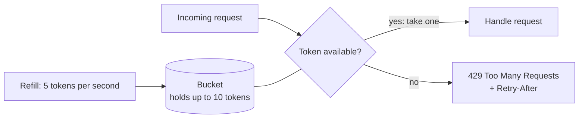

# Rate Limiting and Throttling: Controlling the Flow of Requests

*How systems protect themselves — and their users — by deciding how much traffic is enough.*

---

> *“If at first you don't succeed, back off exponentially.”*
>
> — **Dan Sandler**, epigraph to "Addressing Cascading Failures," Google's *Site Reliability Engineering* book, 2016

## At a Glance

> **In one sentence:** Rate limiting caps how many requests a client can make in a period, protecting services from overload, abuse, and runaway costs — using algorithms like token bucket or sliding window, enforced consistently across servers, with clear 429 responses.

**You'll learn**

- Why rate limiting and throttling exist
- Token bucket, leaky bucket, fixed window, and sliding window algorithms
- Distributed rate limiting with a shared store
- Choosing limits per user, key, IP, or tenant
- HTTP 429, Retry-After, and client-side backoff
- Load shedding and graceful degradation

**Before you start:** [How Load Balancing Works](How-Load-Balancing-Works.md)

**Reading time:** about 40 minutes

---

## The Big Picture



*A token bucket refills at a steady rate; each request spends a token, and an empty bucket means HTTP 429.*

---

## Introduction

Imagine a popular nightclub with a single door and a fire-code capacity of 200 people. On a busy Saturday night, a line of a thousand people wants in at once. The bouncer at the door doesn't let everyone in simultaneously — that would violate fire code and create a crush at the bar. Instead, the bouncer admits people at a steady pace: one group in, roughly one group out. Some nights, the bouncer also caps how many times the same rowdy group can re-enter after being asked to leave.

**Rate limiting is the bouncer at the door of your API.** It controls how many requests a client can make in a given time period, protecting the system behind it from being overwhelmed — whether that overwhelm comes from a traffic spike, a buggy retry loop, a scraper, or a malicious attacker. **Throttling** is the related practice of slowing down or delaying requests, rather than outright rejecting them, when a system is approaching its limits.

Every major API you've ever used — Stripe, GitHub, Twitter/X, Google Maps, Shopify — enforces rate limits. They are not an afterthought; they are a first-class part of API design, as fundamental as authentication or versioning.

### Why Should Engineers Care About Rate Limiting?

Rate limiting shows up the moment a system has more than one caller and finite capacity — which is to say, almost immediately. Engineers who understand it well can:

- Protect backend services and databases from being taken down by traffic spikes or runaway clients
- Design fair multi-tenant systems where one noisy customer can't starve everyone else
- Build resilient APIs that degrade gracefully under load instead of falling over
- Prevent abuse: credential stuffing, scraping, denial-of-wallet attacks on pay-per-use infrastructure
- Make informed tradeoffs between strict fairness, implementation complexity, and distributed-systems correctness

### Where Is This Used?

| Layer | Example | Purpose |
|-------|---------|---------|
| Client SDK | Stripe SDK's built-in backoff | Avoid hitting server limits from a single client |
| API Gateway | Kong, Amazon API Gateway, Apigee | Enforce per-key limits before requests reach services |
| CDN / Edge | Cloudflare Rate Limiting, AWS WAF | Block abusive traffic before it reaches origin |
| Service-level | Custom middleware in a microservice | Protect a specific service's resources (CPU, DB connections) |
| Database | Postgres `statement_timeout`, connection pool caps | Prevent runaway queries from exhausting the DB |
| Message queues | Kafka consumer quotas, SQS throttling | Control the rate consumers pull from a queue |

---

## The Problem It Solves

### The Shared Resource Problem

Every backend service sits behind finite resources: CPU cores, database connections, memory, third-party API quotas, bandwidth. When the number of incoming requests exceeds what those resources can sustain, something has to give — and without rate limiting, what gives is usually *everything*: latency spikes for all users, connection pools exhaust, the database falls over, and the outage cascades to unrelated services sharing the same infrastructure.

### The Fairness Problem

In a multi-tenant system, one customer's traffic spike (a bug, a batch job, a viral event) can consume all available capacity, starving every other customer. Without rate limiting, there is no way to guarantee that tenant A's mistake doesn't become tenant B's outage.

### The Abuse Problem

Public-facing APIs are targets: credential-stuffing bots try millions of password combinations, scrapers hammer product pages, and attackers probe for weaknesses. Rate limiting is a first line of defense — it doesn't stop a determined attacker alone, but it raises the cost of abuse dramatically.

### What Happens Without This?

- A single misbehaving client (a retry loop with no backoff) can degrade service for every other client
- Database connection pools exhaust, causing cascading failures across unrelated services
- Third-party API costs spiral out of control (pay-per-request providers, LLM APIs, SMS gateways)
- Attackers can brute-force credentials or scrape entire datasets with no friction
- Traffic spikes turn into full outages instead of graceful slowdowns
- Engineers get paged for "mystery" outages that are actually one tenant's runaway script

| Need | How Rate Limiting Solves It |
|------|------------------------------|
| **Stability** | Cap concurrent load so backend resources stay within safe operating limits |
| **Fairness** | Guarantee every client gets a bounded, predictable share of capacity |
| **Cost control** | Prevent unbounded usage of metered, pay-per-call dependencies |
| **Security** | Slow down brute-force and credential-stuffing attacks |
| **Predictability** | Clients can plan around documented, enforced limits instead of guessing |

---

## Historical Background

### 1970s–1980s: Traffic Shaping in Telecom Networks

The conceptual roots of rate limiting predate the web. Telecommunications engineers developed **traffic shaping** and **traffic policing** to manage bandwidth on shared circuits. The **leaky bucket algorithm** was formally proposed by **Jonathan S. Turner** in a 1986 paper for regulating burst traffic in packet-switched networks, and was later adopted by the ATM Forum in the early 1990s as a standard traffic-shaping mechanism for asynchronous transfer mode (ATM) networks.

### 1990s: TCP Congestion Control

Around the same period, **Van Jacobson**'s work on TCP congestion control (1988, further formalized through the 1990s) introduced ideas like slow start and congestion avoidance — not rate limiting in the API sense, but the same underlying philosophy: don't let senders overwhelm a shared, finite-capacity channel.

### 2000s: The API Economy Emerges

As web APIs became products in their own right, rate limiting moved from network infrastructure into application logic:

- **2006: Amazon Web Services (S3, EC2)** launches with documented API request limits and retry-with-backoff guidance
- **2006: Twitter API** launches and quickly becomes famous for its rate limits — the "Rate Limit Exceeded" error became a well-known developer meme as Twitter's API grew popular faster than its infrastructure could scale
- **2008: Flickr and Twitter** popularize the `X-RateLimit-Limit` / `X-RateLimit-Remaining` / `X-RateLimit-Reset` header convention that is still widely used today

### 2010s: Standardization and the Token Bucket Era

- **2010: Stripe** launches and builds rate limiting deeply into its API philosophy, favoring the token bucket algorithm for smooth, predictable enforcement
- **2012: Nginx** adds the `limit_req` module, bringing leaky-bucket-style rate limiting to one of the world's most widely deployed reverse proxies
- **2014: Redis** becomes the de facto backing store for distributed rate limiters, thanks to atomic operations (`INCR`, `EXPIRE`) and, later, Lua scripting support for compound atomic logic
- **2017: Cloudflare** launches its dedicated Rate Limiting product, bringing edge-level throttling to any website without code changes

### 2019–Present: Standardization and the API-First World

- **2023: IETF RateLimit Headers draft** (`draft-ietf-httpapi-ratelimit-headers`) works to standardize `RateLimit-Limit`, `RateLimit-Remaining`, and `RateLimit-Reset` headers across the industry, replacing the fragmented `X-RateLimit-*` conventions each vendor had invented independently
- Modern platforms (Shopify, GitHub, Stripe, OpenAI, Anthropic) now treat rate limits as a core part of API documentation and developer experience, not just a defensive backend measure

---

## Core Concepts

### Rate Limiting vs Throttling

These terms are often used interchangeably, but they describe related, distinct strategies:

| Concept | What It Does | Typical Response |
|---------|--------------|-------------------|
| **Rate limiting** | Enforces a hard cap on requests per time window; excess requests are **rejected** | HTTP 429 Too Many Requests |
| **Throttling** | **Slows down** or queues excess requests instead of rejecting them outright | Delayed response, or a lower processing rate |

In practice, most production systems combine both: reject requests far beyond the limit, but throttle (delay) requests that are only slightly over.

### The Four Classic Algorithms

| Algorithm | Core Idea | Allows Bursts? | Memory Cost | Typical Use |
|-----------|-----------|-----------------|--------------|--------------|
| **Token Bucket** | Tokens refill at a fixed rate; each request consumes a token | Yes, up to bucket size | O(1) per client | Stripe, AWS API Gateway |
| **Leaky Bucket** | Requests queue and drain at a constant rate | No — smooths bursts out | O(1) + queue | Shopify Admin API |
| **Fixed Window** | Count requests in a fixed time window (e.g., per minute) | Yes, at window boundary (2x burst) | O(1) per client | Simple internal services |
| **Sliding Window** | Weighs current + previous window counts, or logs timestamps | Controlled | O(1) (log) to O(n) (full log) | GitHub, most production gateways |

### Token Bucket — Visualized

```
   Refill rate: 10 tokens/sec         Bucket capacity: 100 tokens

   ┌─────────────────────┐
   │  ● ● ● ● ● ● ● ● ●  │  <- tokens accumulate up to capacity
   │  ● ● ● ● ● ● ● ●    │
   └─────────┬───────────┘
             │  each request removes 1 token
             ▼
        Request allowed if a token is available
        Request rejected (or queued) if bucket is empty
```

### Leaky Bucket — Visualized

```
   Requests arrive at variable rate
        │  │  │     │  │  │  │
        ▼  ▼  ▼     ▼  ▼  ▼  ▼
   ┌─────────────────────┐
   │   Queue (bucket)     │   <- bursts are absorbed here, up to capacity
   └─────────┬───────────┘
             │  drains at a CONSTANT rate
             ▼
        Backend processes requests at a steady pace
        (queue overflow = requests dropped)
```

### Fixed Window — Visualized

```
 Window: 00:00-00:59         Window: 01:00-01:59
 ┌──────────────────┐        ┌──────────────────┐
 │ count: 0 -> 100   │        │ count resets to 0 │
 └──────────────────┘        └──────────────────┘
             ▲
    Boundary problem: a client can send 100 requests
    at 00:59 and another 100 at 01:00 — 200 requests
    in a 2-second window, despite a "100/minute" limit.
```

### Sliding Window — Visualized

```
 Sliding Window Log (per-client):
   [t-58s] [t-40s] [t-25s] [t-10s] [t-2s]
   ─────────────── now ───────────────►
   Only requests within the trailing 60s window count.
   As time moves forward, old entries "slide out" of the window.

 Sliding Window Counter (approximation):
   weight = (time remaining in current window / window size)
   estimated_count = current_window_count
                    + previous_window_count * weight
```

---

## Real-World Analogy

### The Highway On-Ramp Metering Light

Many major highways use **ramp metering**: a traffic light at each on-ramp that releases one car every few seconds instead of letting cars merge freely.

- **Fixed window** is like a light that turns green for 10 seconds every minute, letting through as many cars as can fit — but if cars cluster right at the start of two consecutive green phases, you get a burst of cars merging almost back-to-back.
- **Leaky bucket** is the metering light itself: cars queue on the ramp (the bucket) and are released onto the highway (drained) at a constant, fixed rate — one car every 4 seconds, no matter how many are waiting. If the ramp (queue) fills up, cars are turned away.
- **Token bucket** is like a metering system that stockpiles "merge permits" during light traffic — if no cars used the ramp for a while, permits accumulate (up to a cap), so when a burst of cars does arrive, several can merge in quick succession before the steady-state rate kicks back in.
- **Sliding window** is a smarter metering light with a rolling odometer: it looks at exactly how many cars merged in the *last* 60 seconds (not "since the top of the minute") and adjusts accordingly, avoiding the boundary-burst problem of fixed windows.

The highway itself (the backend) never sees more cars per second than it can safely handle — regardless of how bursty the demand at the ramp is.

---

## How It Works Internally

### The Complete Request Flow (Token Bucket Example)

```
  Client request arrives
       │
       ▼
  ┌───────────────────────────────────┐
  │        Rate Limiter                │
  │                                     │
  │  1. Identify the client (API key,   │
  │     IP, user ID, or combination)    │
  │                                     │
  │  2. Look up (or create) the         │
  │     client's bucket state           │
  │     - tokens remaining              │
  │     - last refill timestamp          │
  │                                     │
  │  3. Compute tokens to add:          │
  │     elapsed = now - last_refill     │
  │     new_tokens = elapsed * rate     │
  │     tokens = min(capacity,          │
  │                   tokens+new_tokens)│
  │                                     │
  │  4. Decision:                       │
  │     if tokens >= 1:                 │
  │        tokens -= 1; ALLOW           │
  │     else:                           │
  │        REJECT (429) or QUEUE        │
  │                                     │
  │  5. Persist updated state           │
  │     (in-memory, Redis, etc.)        │
  │                                     │
  │  6. Attach headers:                 │
  │     RateLimit-Limit: 100            │
  │     RateLimit-Remaining: 42         │
  │     RateLimit-Reset: 17             │
  └───────────────────────────────────┘
       │
       ▼
  Forward to backend (if allowed)
  or return 429 (if rejected)
```

### Step-by-Step Detail

**Step 1: Client Identification**

The rate limiter needs a **key** to track state per-client. Common choices:
- API key or OAuth client ID (most precise, requires authentication)
- Source IP address (works for anonymous traffic, but breaks down behind shared NATs/proxies)
- User ID (for authenticated, per-user limits)
- A composite key: `api_key + endpoint` (different limits per route)

**Step 2: State Lookup**

For a single-server system, state can live in local memory (a hash map). For distributed systems (the common case), state must live in a shared store — almost always **Redis**, because of its atomic increment operations and sub-millisecond latency.

**Step 3: Time-Based Computation**

Token bucket and leaky bucket algorithms are computed *lazily* — rather than running a background timer that refills every bucket every second (which doesn't scale to millions of clients), the refill amount is computed on-demand at request time, based on elapsed time since the last request.

**Step 4: Allow/Reject/Queue Decision**

The core decision point. Rate limiting rejects immediately (429). Throttling may instead delay the response or place the request in a queue to be processed later, smoothing the load rather than discarding it.

**Step 5: State Persistence**

The updated counter/bucket state must be written back atomically — this is where race conditions live if not handled carefully (see "Distributed Rate Limiting Challenges" below).

**Step 6: Response Headers**

Well-designed APIs always communicate limit state back to the client via headers, so well-behaved clients can self-throttle *before* hitting a hard rejection:

```
RateLimit-Limit: 100
RateLimit-Remaining: 42
RateLimit-Reset: 17          (seconds until the window resets)
Retry-After: 30              (sent only on a 429 response)
```

---

## Components and Architecture

### 1. Identifier Extractor

Determines the rate-limit key for an incoming request — from an API key header, JWT claim, source IP, or a combination. Misconfiguring this is one of the most common production bugs (see Common Mistakes).

### 2. Limit Policy Store

Defines the actual limits: which algorithm, what rate, what burst capacity, and whether the limit applies per-endpoint, per-tenant tier (free vs. paid), or globally. Often expressed declaratively:

```yaml
policies:
  - match: "/api/v1/orders/*"
    algorithm: token_bucket
    rate: 100/minute
    burst: 20
    tier_overrides:
      enterprise: 1000/minute
```

### 3. Counter / Bucket Store

The actual state backend. Options, in increasing order of scalability and complexity:

| Store | Pros | Cons |
|-------|------|------|
| In-process memory | Zero latency, no dependency | Doesn't work across multiple instances |
| Local + sticky sessions | Simple | Fragile, breaks with autoscaling |
| Redis (single instance) | Fast, atomic ops, widely supported | Single point of failure unless clustered |
| Redis Cluster | Scalable, atomic per-key via hash slots | Cross-slot Lua scripts require careful key design |
| Distributed counters (e.g., Cloudflare's edge-local + async sync) | Scales globally | Eventually consistent — approximate limits |

### 4. Enforcement Point

Where the allow/reject decision is physically applied — client SDK, API gateway, sidecar proxy, service middleware, or database proxy. (Covered in depth below.)

### 5. Feedback Channel

Response headers (`RateLimit-*`, `Retry-After`) and error bodies that tell the client what happened and how to behave — essential for well-behaved client backoff.

### 6. Observability Layer

Metrics on limiter behavior are as important as the limiter itself:
- Requests allowed vs. rejected, per client/tenant
- Near-limit clients (approaching but not exceeding — early warning for capacity planning)
- Latency added by the rate-limiting check itself

### Where to Enforce Rate Limits

Rate limiting can — and often should — happen at multiple layers simultaneously, each catching a different failure mode:

```
Client SDK ──► API Gateway ──► Service Mesh / Middleware ──► Database
 (self-limit)   (per-key,         (per-service,                (connection
                 coarse)           fine-grained)                 pool caps)
```

| Layer | Purpose | Example |
|-------|---------|---------|
| **Client-side** | Well-behaved SDKs self-throttle to avoid ever hitting server limits; reduces wasted round trips | Stripe SDK's automatic exponential backoff on 429 |
| **API Gateway / Edge** | First line of defense; blocks abusive traffic before it consumes any backend resources | Kong, AWS API Gateway usage plans, Cloudflare Rate Limiting |
| **Service-level** | Protects a specific service's own resources (CPU, memory, downstream calls) independent of the gateway's coarse limits | Middleware in a Node/Go/Python service using a local or Redis-backed limiter |
| **Database-level** | Last line of defense against runaway queries or connection exhaustion | Postgres `max_connections`, PgBouncer pool limits, query timeouts |

**Why multiple layers?** The gateway limit protects against a noisy tenant; the service-level limit protects that specific service even if the gateway limit is generous; the database-level limit protects the data layer even if a bug bypasses the service-level limiter entirely. Defense in depth applies to rate limiting just as it does to security.

---

## End-to-End Flow

### Example: Priya's E-Commerce Integration Hits Shopify's Admin API

Priya is a backend engineer at a mid-sized fashion retailer, "Northwind Apparel," integrating their inventory system with Shopify's Admin API to sync stock levels across 40,000 SKUs.

**Background:** Shopify's Admin REST API uses a **leaky bucket** algorithm. Standard Shopify Plus stores get a bucket capacity of 40 requests, refilling at 2 requests/second (as of Shopify's documented 2024 REST Admin API limits for Plus plans).

**Step 1 — Priya's script starts a sync at 10:00:00 AM.**

The script needs to update 40,000 products. It fires off requests as fast as possible in a loop.

**Step 2 — The first 40 requests succeed immediately.**

Shopify's bucket starts full (40/40). Each request drains one unit. Response headers on every call report the current state:

```
HTTP/1.1 200 OK
X-Shopify-Shop-Api-Call-Limit: 38/40
```

**Step 3 — At request 41 (roughly 200ms in), the bucket is empty.**

Shopify's leaky bucket refills at 2/second, but Priya's script is firing at ~200 requests/second. Shopify responds:

```
HTTP/1.1 429 Too Many Requests
Retry-After: 2.0
```

**Step 4 — Priya's script (if written naively) ignores the header and retries immediately.**

This produces a hot loop of 429 responses — no progress is made, and Northwind's IP gets flagged for review by Shopify's abuse detection.

**Step 5 — Priya fixes the script to respect `Retry-After` and paces requests at 2/second.**

The sync now takes `40,000 / 2 = 20,000 seconds ≈ 5.5 hours` — too slow for a nightly job window.

**Step 6 — Priya switches to Shopify's Bulk Operations API** (GraphQL-based, designed for exactly this use case — bulk import/export outside the per-request rate limit), which processes the entire 40,000-SKU sync as a single asynchronous job, polling for completion every 10 seconds instead of making 40,000 rate-limited calls.

**Result:** The sync completes in 12 minutes instead of theoretically hours, and Northwind never triggers Shopify's abuse flags again. This is a textbook illustration of why understanding *which* algorithm a provider uses, and reading their documented `Retry-After` and limit headers, is a core engineering skill — not an edge case.

---

## Production Engineering Perspective

### Scalability

| Level | How It Scales | Example |
|-------|---------------|---------|
| **Single instance, in-memory** | Works only until you run more than one instance | A single Express.js process with an in-memory Map |
| **Shared Redis instance** | Scales to many API instances sharing consistent state | Most production API gateways |
| **Redis Cluster / sharded** | Scales to very high request volumes by sharding keys across nodes | Large multi-tenant SaaS platforms |
| **Edge-local with async aggregation** | Scales globally, trading strict accuracy for near-zero added latency | Cloudflare's distributed rate limiting |

**Key principle:** As request volume grows, the rate limiter itself must not become the bottleneck it was designed to prevent. A poorly-scaled centralized Redis instance can become a single point of contention under high load.

### Reliability

- **Fail open vs. fail closed:** If the rate-limiting store (e.g., Redis) becomes unavailable, does the system allow all traffic through (fail open — risk of overload) or reject all traffic (fail closed — risk of unnecessary downtime)? Most production systems fail open for availability, with a fallback local limiter as a safety net.
- **Redundancy:** Run the backing store (Redis) with replication and automatic failover (Redis Sentinel or a managed service like AWS ElastiCache/ElastiCache Serverless).
- **Graceful degradation:** When near capacity, throttle before rejecting — a delayed response is a better user experience than an outright error.

### Performance

| Metric | Target | How to Achieve |
|--------|--------|-----------------|
| **Added latency per check** | < 1ms | Use Redis with Lua scripting (single round trip); avoid multiple sequential Redis calls |
| **Throughput of the limiter itself** | 100,000+ checks/sec | Shard Redis by key; use local caching for read-heavy limit metadata |
| **Memory per client** | O(1), a few bytes | Prefer counters over full timestamp logs for high-cardinality clients |

### Availability

- The rate limiter must not itself introduce a new single point of failure. A Redis outage should degrade rate-limiting accuracy, not take down the entire API.
- Circuit-break around the rate-limiting store: if Redis calls start timing out, fall back to a permissive local limiter rather than blocking all requests.

### Maintainability

- **Centralize policy configuration** so limits can be tuned without redeploying every service (a policy store, feature flags, or a config service).
- **Version your rate-limit responses** — clients should be able to rely on consistent header semantics as limits change.
- **Document limits publicly** and keep documentation in lockstep with actual enforced values — a mismatch erodes developer trust (a common complaint about early Twitter API docs).

---

## Tradeoffs

### ✅ Benefits

| Benefit | Explanation |
|---------|------------|
| **System protection** | Prevents backend overload from traffic spikes or runaway clients |
| **Fairness** | Ensures no single tenant can monopolize shared capacity |
| **Cost control** | Bounds usage of metered downstream dependencies |
| **Abuse mitigation** | Raises the cost of scraping, brute-forcing, and denial-of-service attempts |
| **Predictability** | Clients can build reliable integrations around documented limits |

### ❌ Drawbacks

| Drawback | Explanation |
|----------|------------|
| **Added complexity** | Every request now requires a stateful check, adding a dependency (often Redis) |
| **Added latency** | Even a fast check (sub-millisecond) adds up at extreme scale |
| **False positives** | Legitimate bursty clients (e.g., a bulk import) get rejected unless burst allowances are well-tuned |
| **Coordination overhead** | Distributed rate limiting across many nodes requires careful design to remain accurate |
| **Operational burden** | The rate-limiting store itself becomes infrastructure that must be monitored, scaled, and kept highly available |

### ⚠️ Limitations

- **Rate limiting cannot fully stop determined attackers** — distributed attacks from many IPs/keys can still evade per-key limits; it raises cost, not impossibility.
- **Perfectly accurate distributed rate limiting is expensive** — most real systems accept small amounts of over-admission (a few percent) in exchange for low latency and high availability.
- **Static limits don't adapt to real capacity** — a fixed "100 req/min" limit doesn't know if your backend is currently healthy or degraded; adaptive/dynamic limiting is more complex but more accurate.

### 🔁 Alternatives

| Approach | When to Use |
|----------|------------|
| **Concurrency limiting (semaphores)** | Cap simultaneous in-flight requests rather than requests-per-time — better for protecting resources tied to request *duration*, not just count |
| **Load shedding** | Drop lowest-priority requests only when actually overloaded, rather than enforcing a static quota at all times |
| **Priority queues / QoS tiers** | Serve paying/critical traffic first instead of uniformly limiting everyone |
| **Autoscaling** | Add capacity to absorb load instead of restricting demand (works for elastic infrastructure, not for hard external dependencies) |

### When NOT to Use Rate Limiting

- **Internal, trusted, low-volume services** where the operational overhead of a rate limiter outweighs the risk it mitigates
- **Systems where concurrency limiting is a better fit** — e.g., protecting a connection pool, where "5 concurrent requests" matters more than "100 requests per minute"
- **Extremely latency-sensitive hot paths** where even a sub-millisecond Redis round trip is unacceptable — consider local, approximate limiting instead

---

## Common Mistakes

### Beginner Mistakes

1. **Using fixed window without considering the boundary burst problem** — A "100 requests/minute" fixed window allows 200 requests in a 2-second span if timed at a window boundary. Use sliding window if precise enforcement matters.

2. **Rate limiting by IP address alone** — Many legitimate users share IPs (corporate NAT, mobile carrier NAT, VPNs). This both under-limits (many users behind one IP each get the full quota... no, actually they share it, causing false positives) and mis-attributes abuse. Prefer API keys or authenticated user IDs when available.

3. **Not returning `Retry-After` or `RateLimit-*` headers** — Without these, clients have no way to self-throttle intelligently and will often retry immediately, worsening the problem the limiter exists to prevent.

### Intermediate Mistakes

4. **In-memory rate limiting behind a load balancer with multiple instances** — Each instance tracks its own counter, so the *effective* limit becomes `configured_limit × number_of_instances`. This silently breaks the intended policy as the service scales horizontally.

5. **Not handling clock skew in distributed rate limiters** — If different servers' clocks disagree by even a few hundred milliseconds, window-based algorithms can allow more (or fewer) requests than intended at window boundaries. Rely on the shared store's (e.g., Redis's) clock, not each application server's local clock.

6. **Choosing fixed window because "it's simpler" for user-facing APIs** — This trades user experience for implementation convenience: seemingly-random rejections at window boundaries confuse developers. Sliding window log/counter is usually worth the modest extra complexity.

### Senior-Level Architectural Mistakes

7. **Treating rate limiting as purely a technical concern, not a product decision** — Limits communicate pricing tiers, fairness policy, and trust levels. Senior engineers involve product/API design stakeholders when setting limits, not just infrastructure teams.

8. **No coordinated multi-layer strategy** — Enforcing a limit only at the gateway, with no service-level or database-level backstop, means a single misconfiguration or bypass (an internal service calling another service directly) removes all protection.

9. **Ignoring race conditions in "check-then-increment" logic** — A naive `GET counter; if counter < limit: INCR counter` pattern is not atomic. Under concurrent requests, this allows more requests through than the configured limit (a classic TOCTOU — time-of-check-to-time-of-use — bug). Use atomic operations (Redis `INCR`+`EXPIRE`, or a Lua script) instead.

10. **Conflating rate limiting with load shedding** — Applying a static per-client quota as the *only* overload protection ignores real-time system health. A system can be well within every client's quota and still be overloaded (e.g., a downstream dependency degraded). Combine rate limiting (fairness) with load shedding (system-health-aware admission control).

---

## Failure Scenarios

### Scenario 1: The Race Condition Under Load

**What happens:** A service uses a naive "read counter, check limit, increment counter" pattern (three separate Redis calls, not atomic) to enforce a 100-requests-per-second-per-key limit. Under a sudden burst of 500 concurrent requests from one key, far more than 100 are admitted.

**Why it fails:** Between the `GET` and the `SET`/`INCR`, many concurrent requests read the *same* stale counter value and all decide independently that they're under the limit. This is a textbook time-of-check-to-time-of-use (TOCTOU) race.

**How to diagnose:**
- Compare actual admitted request counts (from access logs) against the configured limit during a known burst
- Load-test the limiter directly with concurrent requests from a single key and observe admitted count exceeding the configured limit
- Check whether the implementation uses multiple round trips to the store instead of one atomic operation

**Solutions:**
- Use Redis `INCR` (atomic) combined with `EXPIRE` set only on first increment, or a Lua script that performs check-and-increment as a single atomic operation
- Use Redis's `CL.THROTTLE` (RedisCell module) or a well-tested library (e.g., `redis-cell`, `rate-limiter-flexible`) rather than hand-rolling the logic
- Load test the limiter itself before trusting it in production

### Scenario 2: Clock Skew in a Multi-Region Deployment

**What happens:** A globally distributed API has rate-limiting logic running in three regions, each computing "current window" based on its own server clock. NTP drift causes one region's clock to run 400ms ahead.

**Why it fails:** Window-boundary calculations (fixed or sliding window) become inconsistent across regions. A client routed to different regions across requests can see inconsistent, occasionally contradictory limit states — or, worse, exploit the skew to get slightly more throughput than intended by timing requests around each region's boundary.

**How to diagnose:**
- Compare `RateLimit-Reset` values returned by different regions for the same client at the same wall-clock instant
- Check NTP sync status/drift metrics on the servers or containers hosting the limiter
- Look for a client whose effective throughput exceeds the configured limit when their traffic is routed across regions

**Solutions:**
- Centralize the "source of truth" clock and counter in a single logical store per client (e.g., route rate-limit checks for a given key to one authoritative Redis region, even if the application logic is multi-region)
- Use algorithms that don't depend on precise clock synchronization for correctness — sliding window log with timestamps sourced from the shared store (Redis's own time via `TIME` command) rather than each app server's local clock
- Enforce strict NTP synchronization (chrony, AWS Time Sync Service) as baseline infrastructure hygiene, not just for rate limiting

### Scenario 3: Thundering Herd After a Rate-Limited Outage

**What happens:** A downstream payment provider's API rate-limits Northwind Apparel's checkout service during a flash sale. Checkout requests queue up client-side with naive fixed-interval retries (no jitter). When the rate limit window resets, all queued retries fire in the same instant, immediately re-triggering the rate limit.

**Why it fails:** Synchronized retries create a self-sustaining oscillation: burst → 429 → wait fixed interval → burst again, precisely because every client waits the *same* amount of time before retrying.

**How to diagnose:**
- Graph request volume over time at the provider boundary — a sawtooth pattern synchronized with the rate-limit window is the signature of this failure
- Check retry logic for fixed delays without jitter

**Solutions:**
- Implement **exponential backoff with jitter** (randomized delay) on the client side, as recommended in the classic AWS Architecture Blog post "Exponential Backoff And Jitter" (2015)
- Respect `Retry-After` headers exactly rather than using an independent fixed retry policy
- Queue and smooth outbound requests server-side (a leaky-bucket-style outbound rate limiter) rather than letting every client retry independently

---

## Security Considerations

### Rate Limiting as a Defense Layer, Not a Silver Bullet

Rate limiting slows down brute-force login attempts, credential stuffing, and scraping — but a well-resourced attacker can distribute requests across many IPs, accounts, or API keys to stay under per-key limits. Combine rate limiting with:

- **CAPTCHA or proof-of-work challenges** after repeated failures, not just hard rejection
- **Anomaly detection** (unusual request patterns, geographic inconsistency) layered on top of static limits
- **Account lockout policies** for authentication endpoints specifically, distinct from general API rate limits

### Protecting the Rate Limiter Itself

The rate-limiting store (typically Redis) becomes a critical piece of infrastructure and a potential attack surface:

- Never expose the Redis instance backing the rate limiter to the public internet
- Use authentication (Redis AUTH / ACLs) and TLS for connections to the rate-limit store
- Monitor the store's own resource usage — an attacker who can cause unbounded key creation (e.g., via unauthenticated, per-IP keys with no cardinality cap) can exhaust the store's memory, a denial-of-service against the very system meant to prevent denial-of-service

### Information Disclosure via Headers

`RateLimit-Remaining` and similar headers, while helpful for legitimate clients, also give attackers precise information about how close they are to a limit, letting them time bursts just under the threshold. This is a known, accepted tradeoff — the developer-experience benefit generally outweighs the marginal information leaked, but it's worth being deliberate about for highly sensitive endpoints (e.g., authentication).

### Bypassing Rate Limits via Header Spoofing

If client identification relies on a client-supplied header (e.g., a naive `X-Forwarded-For`-based IP limiter), attackers can spoof headers to appear as different clients on every request. Only trust identification data set by a system you control (the gateway/load balancer setting `X-Forwarded-For` itself, not trusting an inbound value from the public internet).

---

## Performance Considerations

### Bottlenecks

| Bottleneck | Why It Happens | How to Fix |
|------------|---------------|------------|
| **Redis round-trip latency** | Every request incurs a network hop to check/update state | Use Lua scripting to bundle check+increment into one round trip; co-locate Redis in the same AZ/region |
| **Hot keys** | A single very high-traffic client (or IP shared by many users) creates contention on one Redis key | Shard the counter across multiple sub-keys and sum, or use approximate/probabilistic counting |
| **High-cardinality sliding window logs** | Storing a full timestamp log per client for sliding-window-log accuracy consumes significant memory at scale | Use sliding window *counter* (approximation) instead of a full log for high-volume clients |
| **Synchronous limiter checks on the hot path** | Adds latency to every single request, even fast ones | Consider async/local caching of limit decisions with periodic reconciliation for very high QPS scenarios |
| **Connection pool exhaustion to the store** | Too many application instances opening too many connections to Redis | Use connection pooling and a Redis proxy (e.g., Twemproxy, Envoy) to multiplex connections |

### Optimization Strategies

1. **Bundle logic into Lua scripts:** Redis executes Lua scripts atomically and in a single round trip, avoiding both race conditions and multiple network hops.

2. **Use approximate algorithms at extreme scale:** Sliding window *counters* trade small accuracy loss for O(1) memory instead of the O(n) memory of a full sliding window log.

3. **Local caching with periodic sync:** For very high-QPS edge deployments (e.g., Cloudflare), each edge node can track counts locally and periodically reconcile with a global store, trading strict accuracy for near-zero added latency.

4. **Co-locate the rate limiter with the service:** Minimize network hops between the enforcement point and the state store — cross-region Redis calls can add tens of milliseconds, defeating the purpose of a lightweight check.

5. **Cache limit *policy* (not state) aggressively:** Policy (what the limit *is* for a given key) changes far less often than state (how many requests have been used) — cache policy locally with a short TTL to avoid a store round trip just to know the configured limit.

### Distributed Rate Limiting Challenges

Running a rate limiter across multiple nodes/regions introduces problems that don't exist in a single-process implementation:

**1. Clock skew:** Algorithms that depend on wall-clock time (fixed and sliding windows especially) can behave inconsistently if different nodes' clocks disagree. Mitigate by sourcing time from the shared store itself (e.g., Redis's `TIME` command) rather than trusting each node's local clock.

**2. Coordination via Redis:** Redis is the standard choice for coordinating state across nodes because it offers atomic primitives (`INCR`, `EXPIRE`) and, critically, **Lua scripting**, which lets a check-and-increment sequence run as a single atomic unit server-side — eliminating the network round trips (and the race window) that a multi-command client-side implementation would have.

**3. Race conditions:** Even with Redis, naive multi-step client-side logic (read, decide, write as separate commands) reintroduces races under concurrency. The fix is always the same: push the read-decide-write sequence into a single atomic server-side operation (a Lua script, or Redis's native `INCR`+`EXPIRE` combo used correctly).

**4. Network partitions:** If a node loses connectivity to the shared Redis store, it must decide whether to fail open (risk over-admission) or fail closed (risk unnecessary rejection) — there is no way to enforce a globally accurate limit without a reachable, consistent source of truth during a partition. Most production systems choose to fail open for availability and accept temporary over-admission as the lesser evil.

**5. Cross-region latency vs. accuracy:** A single global Redis instance gives perfectly accurate global limits but adds latency for far-away nodes. Regional Redis instances with async reconciliation give low latency but only *approximately* accurate global limits. This is a fundamental CAP-theorem-adjacent tradeoff with no free lunch.

### Scaling Challenges

- **Multi-region consistency** for globally distributed APIs is genuinely hard — most large platforms (Cloudflare, Stripe) accept eventual consistency and slight over-admission in exchange for low latency worldwide.
- **Per-tenant limit customization** (free tier vs. enterprise tier, thousands of distinct policies) requires an efficient policy lookup that itself doesn't become a bottleneck at request-time scale.
- **Bursty, event-driven traffic** (e.g., webhook fan-out, flash sales) stresses static per-minute limits; adaptive or credit-based systems handle this better than fixed configuration.

---

## Real-World Industry Examples

### Stripe — Token Bucket with Documented Smoothing

Stripe's API enforces rate limits using a **token bucket** algorithm, per API key, applied separately to read and write requests. As of Stripe's published documentation, live-mode API keys are limited to roughly 100 read operations per second and 100 write operations per second, with test-mode keys limited lower. Stripe's official Ruby, Python, and Node SDKs include built-in automatic retry with exponential backoff for `429` responses, reflecting Stripe's philosophy that rate limiting should be a smooth, predictable experience rather than a hard wall developers constantly fight. Stripe's engineering blog and API documentation explicitly recommend implementing idempotency keys alongside retry logic, since a rate-limited request that is retried must not be processed twice.

### GitHub — Layered REST and GraphQL Limits

GitHub's REST API enforces **5,000 requests per hour** for authenticated users (much lower, 60/hour, for unauthenticated requests), while the GraphQL API uses a fundamentally different **points-based** system: each query costs a calculated number of points based on the complexity of the requested fields and connections, with a budget of 5,000 points per hour for most authenticated users. This reflects a key architectural lesson: a flat request-count limit doesn't map well to APIs where a single request (a deep GraphQL query) can be far more expensive than another. GitHub returns standard `X-RateLimit-Limit`, `X-RateLimit-Remaining`, and `X-RateLimit-Reset` headers, and GitHub Apps and Enterprise customers get higher, separately-documented limits.

### Cloudflare — Rate Limiting as an Edge Product

Cloudflare launched a dedicated **Rate Limiting** product (2017) that lets any website — regardless of backend technology — enforce rate limits at the edge, across Cloudflare's global network of data centers, before traffic ever reaches the origin server. Because Cloudflare operates at the edge across hundreds of points of presence worldwide, its rate limiting implementation must solve the distributed coordination problem at extreme scale: Cloudflare's public engineering blog has described using approximate, locally-enforced counting with asynchronous global aggregation, deliberately trading perfect accuracy for the ability to block abusive traffic within milliseconds, close to its source, without a slow round trip to a centralized counter.

### Twitter/X — The Original Poster Child for API Rate Limits

Twitter's API rate limits became so well-known among developers in the late 2000s and 2010s that "hitting the rate limit" became a common developer complaint and meme in its own right. Twitter's REST API v1.1 historically enforced limits like 15 requests per 15-minute window for many endpoints (varying by endpoint and authentication context). In 2023, under new ownership as X, the platform made headlines for dramatically tightening API rate limits (including a widely reported temporary emergency limit of a few thousand posts read per day for unverified accounts in July 2023, described by the company at the time as a measure against data scraping and system manipulation) — a real-world example of rate limits being used not just for stability, but as a business and anti-abuse lever.

### Shopify — Leaky Bucket for the Admin API

Shopify's REST Admin API explicitly documents its use of the **leaky bucket algorithm**: a bucket with a capacity of 40 requests (standard stores) that leaks (refills capacity) at 2 requests per second. This is a deliberate design choice — the leaky bucket's constant drain rate smooths request processing on Shopify's backend regardless of how bursty a merchant's integration traffic is, and Shopify documents the exact bucket parameters so integrators can calculate safe request pacing rather than discovering the limit empirically. Shopify's GraphQL Admin API instead uses a **cost-based, points-per-second** model (similar in spirit to GitHub's GraphQL limiting), because query complexity — not request count — is what actually determines backend load for a graph API.

---

## Case Studies

### Case Study 1: Twitter's 2023 Emergency Rate Limit Change

**What happened:** In July 2023, X (formerly Twitter) abruptly and temporarily imposed much stricter rate limits on how many posts accounts could *read* per day — reported at the time as roughly 600 posts/day for unverified accounts (with different, higher limits for verified accounts), down from effectively unlimited casual browsing.

**Root cause:** The company's own public statements attributed the change to countering aggressive data scraping (widely speculated to be related to AI training data collection) and "system manipulation," rather than a pure capacity/stability issue — an example of rate limiting being deployed as a business-policy tool, not only an infrastructure-protection one.

**Solution:** Limits were relaxed within days as the immediate concern was addressed and user backlash mounted, but the episode illustrated that rate limits are a lever platform owners can and do pull for reasons beyond server load — a fact application architects must plan around when depending on third-party APIs.

**Lesson:** Never assume a third-party API's rate limits are fixed and purely technical. Build integrations that read and respect `Retry-After`/limit headers dynamically, and have a degraded-mode fallback for when an upstream provider's limits change without notice.

### Case Study 2: The AWS "Exponential Backoff and Jitter" Insight

**What happened:** In the early 2010s, AWS engineers observed that many client applications hitting AWS service rate limits (S3, DynamoDB, EC2 APIs) used naive fixed-delay retries. Under load, many clients retrying in lockstep created synchronized traffic spikes precisely at each retry interval, worsening the very throttling event they were trying to recover from.

**Root cause:** Uncoordinated clients converging on the same retry timing turns individually-reasonable behavior into a collective thundering herd — a distributed-systems failure mode that only manifests at scale, not in single-client testing.

**Solution:** AWS published its now-widely-cited 2015 Architecture Blog post "Exponential Backoff And Jitter," recommending that retry delays include randomized jitter (e.g., "full jitter": `sleep = random(0, min(cap, base * 2^attempt))`) so that many clients retrying after the same failure spread their retries out over time instead of synchronizing.

**Lesson:** Rate limit *enforcement* logic (server-side) and rate limit *response* logic (client-side retry/backoff) must be designed together — a well-designed limiter can still cause cascading problems if every client's retry behavior is naive and synchronized.

### Case Study 3: Redis-Backed Rate Limiter Race Condition at Scale

**What happened:** Several engineering teams across the industry (documented in numerous public postmortems and blog posts on services like Figma's and other companies' engineering blogs discussing rate-limiter design) have independently discovered the same bug pattern: a rate limiter implemented as separate `GET` then `SET`/`INCR` Redis calls from application code, rather than as an atomic Lua script, allows significant over-admission under concurrent load — sometimes multiples of the configured limit — precisely during the traffic spikes the limiter exists to control.

**Root cause:** Redis commands are individually atomic, but a *sequence* of Redis commands issued from application code is not atomic as a whole unless explicitly wrapped in a transaction (`MULTI`/`EXEC`) or, more robustly, a single Lua script. Under high concurrency, many requests read the same "before increment" state and all pass the check.

**Solution:** The standard, well-documented fix is to move the entire check-and-increment logic into a single Redis Lua script (or use a purpose-built module like RedisCell's `CL.THROTTLE`, or a maintained library such as `rate-limiter-flexible`) so the whole operation executes atomically on the Redis server, with no window for a race.

**Lesson:** "It works in my local test" is not sufficient validation for a rate limiter — the entire point of the component is to behave correctly under concurrent load, so it must be load-tested with genuine concurrency before being trusted in production.

---

## Practical Code Examples

### Token Bucket (Python)

```python
import time
import threading

class TokenBucket:
    """Allows bursts up to `capacity`, refilling at `refill_rate` tokens/sec."""

    def __init__(self, capacity: int, refill_rate: float):
        self.capacity = capacity
        self.refill_rate = refill_rate
        self.tokens = float(capacity)
        self.last_refill = time.monotonic()
        self.lock = threading.Lock()

    def _refill(self):
        now = time.monotonic()
        elapsed = now - self.last_refill
        self.tokens = min(self.capacity, self.tokens + elapsed * self.refill_rate)
        self.last_refill = now

    def allow_request(self, cost: int = 1) -> bool:
        with self.lock:
            self._refill()
            if self.tokens >= cost:
                self.tokens -= cost
                return True
            return False


if __name__ == "__main__":
    bucket = TokenBucket(capacity=10, refill_rate=2)  # 10 burst, 2/sec refill
    for i in range(15):
        allowed = bucket.allow_request()
        print(f"request {i}: {'ALLOWED' if allowed else 'REJECTED'}")
        time.sleep(0.1)
```

### Leaky Bucket (Python)

```python
import time
import threading
from collections import deque

class LeakyBucket:
    """Queues requests and drains them at a constant `leak_rate` per second."""

    def __init__(self, capacity: int, leak_rate: float):
        self.capacity = capacity
        self.leak_rate = leak_rate
        self.queue = deque()
        self.last_leak = time.monotonic()
        self.lock = threading.Lock()

    def _leak(self):
        now = time.monotonic()
        elapsed = now - self.last_leak
        to_leak = int(elapsed * self.leak_rate)
        for _ in range(min(to_leak, len(self.queue))):
            self.queue.popleft()
        if to_leak > 0:
            self.last_leak = now

    def allow_request(self) -> bool:
        with self.lock:
            self._leak()
            if len(self.queue) < self.capacity:
                self.queue.append(time.monotonic())
                return True
            return False


if __name__ == "__main__":
    bucket = LeakyBucket(capacity=5, leak_rate=1)  # drains 1 request/sec
    for i in range(10):
        allowed = bucket.allow_request()
        print(f"request {i}: {'ALLOWED' if allowed else 'REJECTED (bucket full)'}")
        time.sleep(0.2)
```

### Fixed Window Counter (Go)

```go
package main

import (
	"fmt"
	"sync"
	"time"
)

type FixedWindowLimiter struct {
	mu         sync.Mutex
	limit      int
	windowSize time.Duration
	count      int
	windowStart time.Time
}

func NewFixedWindowLimiter(limit int, windowSize time.Duration) *FixedWindowLimiter {
	return &FixedWindowLimiter{
		limit:       limit,
		windowSize:  windowSize,
		windowStart: time.Now(),
	}
}

func (l *FixedWindowLimiter) Allow() bool {
	l.mu.Lock()
	defer l.mu.Unlock()

	now := time.Now()
	if now.Sub(l.windowStart) >= l.windowSize {
		l.windowStart = now
		l.count = 0
	}

	if l.count < l.limit {
		l.count++
		return true
	}
	return false
}

func main() {
	limiter := NewFixedWindowLimiter(5, time.Second)
	for i := 0; i < 8; i++ {
		fmt.Printf("request %d: allowed=%v\n", i, limiter.Allow())
		time.Sleep(150 * time.Millisecond)
	}
}
```

### Sliding Window Counter (Python)

```python
import time
import threading
import math

class SlidingWindowCounter:
    """Approximates a sliding window using weighted previous + current fixed windows."""

    def __init__(self, limit: int, window_size: float):
        self.limit = limit
        self.window_size = window_size
        self.current_window_start = time.time()
        self.current_count = 0
        self.previous_count = 0
        self.lock = threading.Lock()

    def _rotate_if_needed(self, now: float):
        elapsed = now - self.current_window_start
        if elapsed >= self.window_size:
            windows_passed = int(elapsed // self.window_size)
            if windows_passed == 1:
                self.previous_count = self.current_count
            else:
                self.previous_count = 0
            self.current_count = 0
            self.current_window_start += windows_passed * self.window_size

    def allow_request(self) -> bool:
        with self.lock:
            now = time.time()
            self._rotate_if_needed(now)

            elapsed_in_current = now - self.current_window_start
            weight = max(0.0, 1 - (elapsed_in_current / self.window_size))
            estimated_count = self.previous_count * weight + self.current_count

            if estimated_count < self.limit:
                self.current_count += 1
                return True
            return False


if __name__ == "__main__":
    limiter = SlidingWindowCounter(limit=5, window_size=1.0)
    for i in range(10):
        print(f"request {i}: {'ALLOWED' if limiter.allow_request() else 'REJECTED'}")
        time.sleep(0.15)
```

### Distributed Rate Limiter with Redis + Lua (Atomic Token Bucket)

This is the production-grade pattern: the entire check-and-consume operation runs as a single atomic Lua script on the Redis server, eliminating the race conditions described in Failure Scenario 1.

```python
import time
import redis

TOKEN_BUCKET_LUA = """
-- KEYS[1] = bucket key
-- ARGV[1] = capacity
-- ARGV[2] = refill_rate (tokens per second)
-- ARGV[3] = now (unix timestamp, seconds, float)
-- ARGV[4] = requested cost

local key = KEYS[1]
local capacity = tonumber(ARGV[1])
local refill_rate = tonumber(ARGV[2])
local now = tonumber(ARGV[3])
local cost = tonumber(ARGV[4])

local bucket = redis.call("HMGET", key, "tokens", "last_refill")
local tokens = tonumber(bucket[1])
local last_refill = tonumber(bucket[2])

if tokens == nil then
    tokens = capacity
    last_refill = now
end

local elapsed = math.max(0, now - last_refill)
tokens = math.min(capacity, tokens + elapsed * refill_rate)

local allowed = 0
if tokens >= cost then
    tokens = tokens - cost
    allowed = 1
end

redis.call("HMSET", key, "tokens", tokens, "last_refill", now)
redis.call("EXPIRE", key, math.ceil(capacity / refill_rate) + 1)

return {allowed, tostring(tokens)}
"""

class RedisTokenBucketLimiter:
    def __init__(self, redis_client: redis.Redis, capacity: int, refill_rate: float):
        self.redis = redis_client
        self.capacity = capacity
        self.refill_rate = refill_rate
        self.script = self.redis.register_script(TOKEN_BUCKET_LUA)

    def allow_request(self, client_id: str, cost: int = 1) -> tuple[bool, float]:
        key = f"rate_limit:{client_id}"
        now = time.time()
        allowed, remaining = self.script(
            keys=[key],
            args=[self.capacity, self.refill_rate, now, cost],
        )
        return bool(int(allowed)), float(remaining)


if __name__ == "__main__":
    r = redis.Redis(host="localhost", port=6379, decode_responses=True)
    limiter = RedisTokenBucketLimiter(r, capacity=10, refill_rate=2)

    for i in range(15):
        allowed, remaining = limiter.allow_request("user_42")
        print(f"request {i}: allowed={allowed} tokens_remaining={remaining:.2f}")
        time.sleep(0.1)
```

**Why the Lua script matters:** Every read, computation, and write happens inside Redis's single-threaded execution engine as one atomic unit — no other client's request can interleave between the check and the update, which is exactly the race condition that plagues naive multi-command implementations. This is the same pattern used internally by libraries like `rate-limiter-flexible` and the RedisCell (`CL.THROTTLE`) module.

---

## Frequently Asked Questions

**Q: What's the practical difference between token bucket and leaky bucket?**

Token bucket allows bursts: if a client hasn't made requests for a while, tokens accumulate (up to capacity), letting a sudden burst through all at once. Leaky bucket smooths traffic to a constant output rate regardless of how bursty the input is — it never lets more than the drain rate through per unit time, even if many requests just arrived. Choose token bucket when occasional bursts are fine (most APIs); choose leaky bucket when you need a strictly smoothed, constant-rate output (e.g., protecting a downstream system that truly cannot handle any burst).

**Q: Why is fixed window rate limiting considered flawed?**

Because it resets sharply at window boundaries, a client can send the full quota right before a window ends and the full quota again right after it starts — doubling the effective burst rate right at the boundary, even though the average rate looks compliant. Sliding window (log or counter) avoids this by continuously considering a rolling time range instead of discrete resets.

**Q: How do I rate limit across multiple servers without a shared datastore?**

You generally can't do it *accurately* without some form of coordination — that's what makes distributed rate limiting hard. Approximations exist (each server enforces `limit / number_of_servers` locally), but they get inaccurate as server count changes dynamically. In practice, almost all production distributed rate limiters use a shared, fast datastore (usually Redis) as the source of truth.

**Q: What HTTP status code should a rate-limited request return?**

`429 Too Many Requests` (defined in RFC 6585), typically accompanied by a `Retry-After` header indicating how long to wait, plus `RateLimit-Limit` / `RateLimit-Remaining` / `RateLimit-Reset` headers (per the IETF's RateLimit Headers draft) so clients can proactively pace themselves rather than discovering the limit only via failures.

**Q: Should rate limits differ by API endpoint?**

Yes, in most real systems. A cheap, cacheable `GET /status` endpoint can sustain much higher throughput than an expensive `POST /reports/generate` endpoint that triggers heavy computation. Uniform, flat limits across all endpoints either over-restrict cheap operations or under-protect expensive ones — GitHub's GraphQL points system and Shopify's cost-based GraphQL limiting both exist precisely to address this.

**Q: What's the difference between rate limiting and load shedding?**

Rate limiting enforces a *per-client* quota, intended to guarantee fairness and predictability, regardless of overall system health. Load shedding is a *system-health-aware* mechanism: it drops or deprioritizes requests (often the lowest-priority ones first) only when the system is actually approaching overload, irrespective of any individual client's quota. A system can be fully within every client's rate limit and still need load shedding if, say, a downstream dependency has degraded. Well-designed systems use both together — rate limiting for steady-state fairness, load shedding as an emergency valve. Backpressure is a closely related third concept: rather than dropping requests outright, backpressure propagates a "slow down" signal upstream (e.g., a full queue causing a producer to block or slow its send rate), letting the system self-regulate without discarding work.

---

## Interview Questions

### Beginner Questions

**Q1: What is rate limiting and why do APIs use it?**

Rate limiting caps how many requests a client can make within a time period. APIs use it to protect backend resources from being overwhelmed, ensure fair usage across many clients/tenants, control costs on metered dependencies, and slow down abusive or malicious traffic. Without it, a single misbehaving client could degrade or take down service for everyone.

**Q2: What's the difference between rate limiting and throttling?**

Rate limiting typically rejects requests that exceed a defined quota (returning an error like HTTP 429). Throttling instead slows down or delays excess requests — queuing them to be processed later — rather than rejecting them outright. Many production systems combine both: reject requests far beyond the limit, but delay/queue requests only modestly over it.

**Q3: Name the four classic rate limiting algorithms and describe one difference between them.**

Token bucket, leaky bucket, fixed window, and sliding window. A key difference: token bucket and fixed window can allow bursts (token bucket up to bucket capacity; fixed window at window boundaries), while leaky bucket enforces a strictly constant output rate regardless of input burstiness, and sliding window avoids the boundary-burst problem that fixed window has by continuously considering a rolling time range.

### Intermediate Questions

**Q4: Walk through how a token bucket algorithm decides whether to allow a request.**

The bucket has a maximum capacity and a fixed refill rate (tokens/second). On each request, the algorithm computes how much time has elapsed since the last check, adds `elapsed * refill_rate` tokens (capped at capacity), then checks if at least one token (or the request's specific cost) is available. If so, it deducts the token(s) and allows the request; otherwise it rejects (or queues) the request. Because refill is computed lazily at request time rather than via a background timer, it scales to large numbers of independent clients without needing a timer per client.

**Q5: Why is a race condition possible in a naive rate limiter, and how do you fix it?**

If checking the current count and incrementing it are done as separate operations (e.g., a `GET` then a conditional `SET` from application code), concurrent requests can all read the same "before" state and all pass the check, allowing more requests through than the configured limit — a classic time-of-check-to-time-of-use bug. The fix is to make the check-and-increment sequence atomic: use Redis's native atomic `INCR`, or better, bundle the entire check-and-update logic into a single Lua script that Redis executes as one atomic unit, or use a purpose-built module like RedisCell.

**Q6: How would you rate limit a GraphQL API differently from a REST API, and why?**

REST endpoints usually have roughly comparable cost per request, so a flat "requests per minute" limit is reasonable. GraphQL lets a single query request deeply nested, expensive data (many joins/resolvers) in one call, so a flat per-request limit would either be too generous for complex queries or too strict for simple ones. Instead, GraphQL APIs (GitHub, Shopify) typically use a **points-based** or **cost-based** system: each query is statically or dynamically assigned a cost based on its complexity, and clients have a points budget per time window rather than a request-count budget.

### Senior Questions

**Q7: Design a rate limiter for a multi-region API gateway that must remain accurate and low-latency.**

A strong answer should cover: (1) the fundamental tradeoff — a single global Redis gives perfect accuracy but adds cross-region latency, while regional stores with async reconciliation give low latency but only approximate global accuracy; (2) choosing per-region enforcement with a conservative local budget (e.g., `global_limit / number_of_regions`, possibly weighted by historical traffic share) as a pragmatic middle ground; (3) using Redis Lua scripts (or RedisCell) for atomic per-region enforcement to avoid local race conditions; (4) sourcing time from the store itself, not local server clocks, to avoid clock-skew-induced inconsistency; (5) failing open (allowing traffic) if the regional store becomes unreachable, to preserve availability over strict accuracy; (6) periodically reconciling regional counts to a global view for monitoring/alerting even if not used for real-time enforcement.

**Q8: A client complains they're being rate limited even though they claim to be well under the documented quota. How do you debug this?**

Check: (1) client identification — are multiple distinct users/services being incorrectly bucketed under the same key (e.g., shared IP, shared API key used by multiple internal services)? (2) algorithm behavior — is this a fixed-window boundary-burst effect where the client's traffic pattern legitimately clusters near window edges? (3) clock skew — if the system is distributed, do different nodes disagree on the current window/time? (4) multiple enforcement layers — is a gateway-level limit *and* a service-level limit both applying, with the service-level one being stricter than documented? (5) actual vs. documented limits — has a recent policy change (e.g., a lowered tier limit) not been reflected in documentation? Pull the actual counter state from the backing store and the request logs for the specific key/time range in question to get ground truth rather than relying on the client's self-reported usage.

### Architecture Questions

**Q9: Design the rate limiting strategy for a public API platform with free, pro, and enterprise tiers, supporting both REST and GraphQL, at global scale.**

A comprehensive answer touches: (1) per-tier policy configuration stored centrally (a policy service or config store), keyed by API key/tenant, with different rate/burst/points values per tier; (2) REST endpoints rate limited by request count (token bucket, for burst tolerance), GraphQL endpoints rate limited by computed query cost/points; (3) multi-layer enforcement — edge/gateway for coarse, cheap-to-check limits catching abuse early; service-level limits for endpoint-specific protection; database-level connection/query limits as the final backstop; (4) Redis (sharded/clustered for scale) as the coordination layer, with Lua scripts for atomicity; (5) clear, standardized response headers (`RateLimit-*`, `Retry-After`) so client SDKs across tiers can self-throttle predictably; (6) observability — per-tenant dashboards showing usage against quota, alerting on tenants approaching limits (both for capacity planning and for proactive customer communication about upgrading tiers); (7) a documented, versioned public API contract for limits so changes don't silently break integrations.

**Q10: How do rate limiting, backpressure, and load shedding fit together in a resilient system architecture, and when would you use each?**

Rate limiting is a *per-client fairness* mechanism — a static or tier-based quota enforced regardless of current system health, protecting against any single client monopolizing shared capacity. Backpressure is a *flow-control* mechanism between components of the same system (e.g., a slow consumer signaling a fast producer to slow down, such as a full queue blocking further writes, or TCP's own windowing) — it's cooperative and internal, propagating "slow down" signals upstream rather than dropping work. Load shedding is a *system-health-aware, emergency* mechanism — actively dropping or deprioritizing requests (often the least important ones, via a priority scheme) only when the system detects it's actually approaching overload, independent of any individual client's quota. A resilient architecture layers all three: rate limiting sets steady-state fair-use boundaries at the edge; backpressure lets internal components signal capacity constraints to each other without data loss where possible; load shedding is the last-resort circuit breaker that sacrifices some requests (deliberately, by priority) to keep the system alive when the first two aren't enough. Designing all three together, rather than relying on just one, is what separates systems that degrade gracefully under extreme load from systems that fall over completely.

---

## Hands-On Lab

Implement the two most common algorithms and throw the same burst of traffic at both.

```python
import time

class TokenBucket:
    def __init__(self, rate, capacity):
        self.rate, self.capacity = rate, capacity
        self.tokens, self.last = capacity, 0.0
    def allow(self, now):
        self.tokens = min(self.capacity, self.tokens + (now - self.last) * self.rate)
        self.last = now
        if self.tokens >= 1:
            self.tokens -= 1
            return True
        return False

class SlidingWindowLog:
    def __init__(self, limit, window):
        self.limit, self.window, self.log = limit, window, []
    def allow(self, now):
        self.log = [t for t in self.log if t > now - self.window]
        if len(self.log) < self.limit:
            self.log.append(now)
            return True
        return False

# 25 requests arrive at once at t=0, then 1 request every 0.1 s for 3 seconds
arrivals = [0.0] * 25 + [round(0.1 * i, 1) for i in range(1, 31)]

for name, limiter in [("token bucket (5/s, burst 10)", TokenBucket(rate=5, capacity=10)),
                      ("sliding window (10 per 2 s)", SlidingWindowLog(limit=10, window=2.0))]:
    decisions = [limiter.allow(t) for t in arrivals]
    print(f"{name:30} allowed {sum(decisions):>2} of {len(arrivals)}   "
          f"burst allowed: {sum(decisions[:25])}   rejected (HTTP 429): {decisions.count(False)}")
```

**What to notice**
- The token bucket lets a burst up to its capacity through at once, then settles to its refill rate. That is friendly to real clients, which are bursty.
- The sliding window strictly enforces "at most N in any window", with no bursts beyond N.
- Both need shared state (for example, in Redis) when you run more than one server — otherwise each server enforces its own separate limit.

---

## Test Yourself

*Answer each question in your head or on paper first, then open the answer to check.*

<details markdown="1">
<summary><strong>1. How does a token bucket work?</strong></summary>

Tokens are added at a steady rate up to a maximum (the bucket size). Each request uses one token; with no tokens, the request is rejected or delayed. The bucket size allows short bursts; the refill rate sets the long-term average.

</details>

<details markdown="1">
<summary><strong>2. What's wrong with a simple fixed-window counter?</strong></summary>

A client can send the full limit at the end of one window and again at the start of the next, getting double the intended rate in a short time. Sliding windows smooth this out.

</details>

<details markdown="1">
<summary><strong>3. Why does rate limiting need shared state in a multi-server system?</strong></summary>

If each server counts separately, a client spread across 10 servers gets 10× the limit. A shared store such as Redis (with atomic operations) or a dedicated rate-limit service keeps one count per client.

</details>

<details markdown="1">
<summary><strong>4. What should a rate-limited response look like?</strong></summary>

HTTP **429 Too Many Requests**, a `Retry-After` header saying when to try again, and ideally headers showing the limit and remaining quota, so well-behaved clients can slow down.

</details>

<details markdown="1">
<summary><strong>5. What is load shedding, and how is it different from rate limiting?</strong></summary>

Rate limiting enforces per-client fairness. Load shedding protects the *service* when it's overloaded overall, rejecting low-priority work first (for example, background jobs before checkout requests) to keep the most important traffic working.

</details>

<details markdown="1">
<summary><strong>6. Should a rate limiter fail open or fail closed if its store is unavailable?</strong></summary>

It depends on the purpose. For abuse and cost protection, failing closed is safer. For general fairness, many systems fail open (allow traffic) to avoid turning a limiter outage into a full outage — often with a local fallback limit.

</details>

<details markdown="1">
<summary><strong>7. Why should AI or expensive APIs limit by cost or tokens, not just requests?</strong></summary>

One request can cost thousands of times more than another. Request counts don't reflect the real load or spend; token or cost budgets do.

</details>

---

## Cheat Sheet

| Algorithm | Allows bursts? | Memory | Notes |
|----------|---------------|-------|------|
| Token bucket | Yes, up to bucket size | Tiny | Most common; rate + burst |
| Leaky bucket | No — smooth output | Tiny (queue) | Shapes traffic to a steady rate |
| Fixed window | Yes, at window edges (up to 2×) | Tiny | Simple, edge problem |
| Sliding window log | No | Stores each timestamp | Exact, memory-heavy |
| Sliding window counter | Small | Tiny | Good approximation, widely used |

**Response:** `429 Too Many Requests` + `Retry-After` (+ limit/remaining headers).

**Client side:** exponential backoff with jitter · respect `Retry-After` · cap total retries.

**Limit by:** API key / user (fairness) · IP (anonymous abuse) · tenant (plans) · endpoint (expensive operations) · tokens or cost (AI and heavy workloads).

---

## In the AI Era

Rate limiting in AI systems is about **tokens and money**, not just requests.

**Limits you consume.** Model providers typically enforce several limits at once: requests per minute, input tokens per minute, and output tokens per minute, often per model. Clients must handle HTTP 429 responses correctly — respect the `retry-after` header, back off with jitter, and avoid retry storms from many workers retrying in sync.

**Limits you enforce.** Counting requests is not enough to protect your own AI features, because one request can cost a thousand times more than another. Effective controls include:

- Per-user and per-tenant **token or cost budgets** (per minute and per month).
- Maximum input size and maximum output tokens per request.
- **Agent loop limits:** maximum iterations, tool calls, wall-clock time, and spend per task. A confused agent will happily loop forever — and bill you for every step.
- Concurrency limits on expensive operations like long-document processing.

Rate limits are also a security control: unrestricted AI endpoints attract abuse ("free model access via your app"), and cost-exhaustion attacks are cheap for an attacker and expensive for you.

**Try it:** Design a token-bucket limiter where each request's cost is its estimated token count instead of 1. What do you do when the actual output length exceeds the estimate?

---

## Key Takeaways

1. **Rate limiting caps requests per client per time window; throttling delays or queues excess requests rather than rejecting them outright.** Most production systems combine both.

2. **The four classic algorithms — token bucket, leaky bucket, fixed window, sliding window — trade off burst tolerance, smoothness, and implementation complexity differently.** Token bucket and leaky bucket are duals of each other (accumulate-and-burst vs. queue-and-smooth); fixed window is simple but boundary-flawed; sliding window fixes the boundary problem at modest extra cost.

3. **Enforce limits at multiple layers — client, gateway, service, and database — for real defense in depth.** No single layer is sufficient on its own.

4. **Distributed rate limiting is fundamentally harder than single-process rate limiting.** Clock skew, coordination overhead, and race conditions are real engineering problems, not edge cases.

5. **Redis with Lua scripting is the industry-standard pattern for atomic, distributed rate limit enforcement**, because it collapses the check-and-increment sequence into a single atomic server-side operation, eliminating race conditions.

6. **Always return standardized headers** (`RateLimit-Limit`, `RateLimit-Remaining`, `RateLimit-Reset`, `Retry-After`) so well-behaved clients can self-throttle before hitting a hard rejection.

7. **Client retry logic matters as much as server-side enforcement.** Naive fixed-delay retries create synchronized thundering herds; exponential backoff with jitter (per AWS's well-known 2015 guidance) is the standard fix.

8. **Rate limiting, backpressure, and load shedding are related but distinct.** Rate limiting is per-client fairness; backpressure is cooperative internal flow control; load shedding is emergency, system-health-aware admission control. Resilient systems use all three together.

9. **Real platforms choose algorithms deliberately and document them:** Stripe and AWS API Gateway favor token bucket; Shopify's REST Admin API explicitly documents leaky bucket; GitHub and Shopify's GraphQL APIs use cost/points-based limiting because flat request counts don't reflect true backend cost for graph queries.

10. **A rate limiter is itself production infrastructure** — it needs monitoring, load testing under real concurrency, high availability, and a considered fail-open-vs-fail-closed policy, not just a quick implementation bolted onto request handling.

---

## What to Read Next

- **[Auto-scaling and Capacity Planning](Auto-scaling-and-Capacity-Planning.md)** — adding capacity instead of rejecting traffic
- **[Why Distributed Systems Are Hard](../05-Distributed-Systems/Why-Distributed-Systems-Are-Hard.md)** — retries, backoff, and retry storms
- **[Securing AI Systems](../15-AI-Era-Engineering/Securing-AI-Systems.md)** — cost-exhaustion and abuse of AI endpoints

---

## Further Reading

### Foundational Papers

- **Turner, J. S., "New Directions in Communications (or Which Way to the Information Age?)" (1986)** — early formalization of the leaky bucket concept for traffic shaping in packet networks
- **Jacobson, V., "Congestion Avoidance and Control" (1988), ACM SIGCOMM** — the foundational paper on TCP congestion control, conceptually related to rate limiting for shared-resource protection: [https://dl.acm.org/doi/10.1145/52324.52356](https://dl.acm.org/doi/10.1145/52324.52356)
- **IETF Draft: "RateLimit header fields for HTTP" (draft-ietf-httpapi-ratelimit-headers)** — the ongoing standardization effort for `RateLimit-*` response headers: [https://datatracker.ietf.org/doc/draft-ietf-httpapi-ratelimit-headers/](https://datatracker.ietf.org/doc/draft-ietf-httpapi-ratelimit-headers/)
- **RFC 6585 — "Additional HTTP Status Codes"** — defines the `429 Too Many Requests` status code: [https://datatracker.ietf.org/doc/html/rfc6585](https://datatracker.ietf.org/doc/html/rfc6585)

### Academic Resources

- **MIT 6.829 — Computer Networks** — covers traffic shaping, congestion control, and flow control fundamentals: [https://ocw.mit.edu/courses/6-829-computer-networks-fall-2002/](https://ocw.mit.edu/courses/6-829-computer-networks-fall-2002/)
- **Stanford CS 244B — Distributed Systems** — covers distributed coordination problems directly relevant to distributed rate limiting
- **UC Berkeley CS 162 — Operating Systems and System Programming** — covers concurrency, race conditions, and atomic operations foundational to correct rate limiter implementation

### Industry Engineering Blogs

- **AWS Architecture Blog — "Exponential Backoff And Jitter" (2015)**: [https://aws.amazon.com/blogs/architecture/exponential-backoff-and-jitter/](https://aws.amazon.com/blogs/architecture/exponential-backoff-and-jitter/)
- **Stripe Engineering Blog**: [https://stripe.com/blog/engineering](https://stripe.com/blog/engineering)
- **Cloudflare Blog — Rate Limiting**: [https://blog.cloudflare.com/tag/rate-limiting/](https://blog.cloudflare.com/tag/rate-limiting/)
- **Figma Blog — "An Alternative Approach to Rate Limiting"**: [https://www.figma.com/blog/an-alternative-approach-to-rate-limiting/](https://www.figma.com/blog/an-alternative-approach-to-rate-limiting/)
- **Shopify Dev Blog / Docs — API Rate Limits**: [https://shopify.dev/docs/api/usage/rate-limits](https://shopify.dev/docs/api/usage/rate-limits)
- **GitHub Docs — Rate limits for the REST API**: [https://docs.github.com/en/rest/using-the-rest-api/rate-limits-for-the-rest-api](https://docs.github.com/en/rest/using-the-rest-api/rate-limits-for-the-rest-api)

### Official Documentation

- **Redis Documentation — Lua Scripting**: [https://redis.io/docs/latest/develop/interact/programmability/eval-intro/](https://redis.io/docs/latest/develop/interact/programmability/eval-intro/)
- **Stripe API Docs — Rate Limits**: [https://stripe.com/docs/rate-limits](https://stripe.com/docs/rate-limits)
- **Amazon API Gateway — Throttle API Requests**: [https://docs.aws.amazon.com/apigateway/latest/developerguide/api-gateway-request-throttling.html](https://docs.aws.amazon.com/apigateway/latest/developerguide/api-gateway-request-throttling.html)
- **Nginx Docs — `ngx_http_limit_req_module`**: [https://nginx.org/en/docs/http/ngx_http_limit_req_module.html](https://nginx.org/en/docs/http/ngx_http_limit_req_module.html)
- **Cloudflare Docs — Rate Limiting Rules**: [https://developers.cloudflare.com/waf/rate-limiting-rules/](https://developers.cloudflare.com/waf/rate-limiting-rules/)

### Books

- **"Designing Data-Intensive Applications" by Martin Kleppmann** — foundational coverage of distributed coordination problems underlying distributed rate limiting
- **"Site Reliability Engineering" by Google (Beyer, Jones, Petoff, Murphy)** — chapters on load shedding, graceful degradation, and handling overload
- **"Release It!" by Michael T. Nygard** — covers stability patterns including throttling, circuit breakers, and bulkheads in production systems
- **"Web API Design: The Missing Link" by Google/Apigee** — practical guidance on API rate limiting as part of overall API design

---

*This chapter is part of the Software Engineering Handbook — a comprehensive guide to the concepts, principles, and practices that every professional software engineer should know.*
