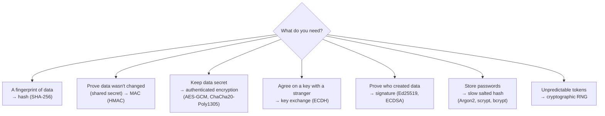

# Cryptography for Engineers

*You don't need to invent cryptography. You do need to know which tool does what — and the handful of mistakes that break even perfect algorithms.*

---

> *“The enemy knows the system.”*
>
> — **Claude Shannon**, "Communication Theory of Secrecy Systems," 1949 (Shannon's maxim)

## At a Glance

> **In one sentence:** Engineers use a small toolkit — hashes for fingerprints, MACs for integrity, authenticated symmetric encryption for confidentiality, public-key cryptography for key exchange and signatures, and slow password hashing for credentials — and security depends far more on choosing the right tool, managing keys well, and using vetted libraries than on the algorithms themselves.

**You'll learn**

- Hash functions, MACs, and the difference between them
- Symmetric encryption and why it must be authenticated (AES-GCM, ChaCha20-Poly1305)
- Public-key cryptography: key exchange and digital signatures
- Password hashing (bcrypt, scrypt, Argon2)
- Randomness, nonces, and key management
- Common mistakes and why "don't roll your own crypto" is real advice
- Post-quantum cryptography and crypto agility

**Before you start:** [How HTTPS Protects Your Data](../03-How-The-Internet-Works/How-HTTPS-Protects-Your-Data.md) · [Why Hackers Succeed](Why-Hackers-Succeed.md)

**Reading time:** about 10 minutes

---

## The Big Picture



*Most crypto bugs come from using the wrong tool for the job — like encrypting passwords or using a plain hash as a signature.*

---

## Introduction

A developer needs to store API tokens in a database. They "encrypt" them with a reversible function they found online — actually just base64 encoding. Another stores passwords with SHA-256. A third builds a "secure" session cookie by appending a SHA-256 hash of the user ID. A fourth encrypts files with AES but reuses the same nonce for every file.

Every one of these systems uses well-known, respected algorithms. Every one is broken — not because the math failed, but because the **wrong tool** was used, or a **detail** (salt, nonce, key) was wrong.

Cryptography is unusual in software: code that is completely broken looks exactly like code that works. The encrypted output is gibberish either way. Tests pass. Only an attacker notices. That's why engineers need a clear mental model of what each primitive guarantees — and a firm habit of using high-level, well-reviewed libraries.

### Why Should Engineers Care?

- Almost every system handles secrets: passwords, tokens, keys, personal data.
- Crypto mistakes are silent until exploited, and often catastrophic when they are.
- Knowing the building blocks helps you use TLS, JWTs, signed URLs, and encrypted storage correctly.

---

## The Problem It Solves

Cryptography provides:

| Property | Question | Tool |
|---------|---------|-----|
| **Confidentiality** | Can anyone else read it? | Encryption |
| **Integrity** | Was it changed? | MACs, signatures, authenticated encryption |
| **Authenticity** | Who created or sent it? | MACs (shared key), signatures (public key) |
| **Non-repudiation** | Can the sender deny it? | Digital signatures |

Encoding (base64, hex) provides **none** of these — it's just a different representation.

---

## Historical Background

- **Ancient times — Substitution ciphers** such as the Caesar cipher, easily broken by frequency analysis (described by the Arab scholar al-Kindi in the 9th century).
- **1883 — Kerckhoffs's principle:** a cryptosystem should remain secure even if everything about it except the key is public.
- **1940s — WWII codebreaking** (Enigma at Bletchley Park) showed the power of cryptanalysis; Claude Shannon's 1949 paper founded modern cryptography on information theory.
- **1976 — Diffie–Hellman key exchange** — public-key cryptography is born. **1977 — RSA** and the **DES** standard follow.
- **1990s — Crypto wars** over export controls; SSL brings encryption to the web.
- **1999–2015 — Password hashing:** bcrypt (1999), scrypt (2009), and Argon2 (winner of the Password Hashing Competition, 2015).
- **2001 — AES** (Rijndael) becomes the U.S. standard symmetric cipher.
- **2017 — SHA-1 collision** ("SHAttered") demonstrated by Google and CWI Amsterdam; MD5 was broken much earlier.
- **2018 — TLS 1.3** simplifies and strengthens HTTPS.
- **2024 — Post-quantum standards:** NIST published its first post-quantum cryptography standards, including ML-KEM (FIPS 203) for key establishment.

---

## Core Concepts

### Hash Functions

A hash maps any input to a fixed-size fingerprint. A cryptographic hash (SHA-256, SHA-3, BLAKE2) must make it infeasible to find two inputs with the same hash or to reverse the hash.

Uses: file integrity checks, content addressing, building blocks for signatures and MACs. **Not** for passwords (too fast) and **not** for authenticity (anyone can compute a hash).

### Message Authentication Codes (MACs)

A MAC (such as **HMAC-SHA256**) combines a secret key with the data. Only someone with the key can create or verify it, proving integrity and authenticity between parties who share the key. Used in signed cookies, webhook signatures, and API request signing. Compare MACs with **constant-time** comparison to avoid timing attacks.

### Symmetric Encryption — Always Authenticated

One shared key encrypts and decrypts. Use **authenticated encryption (AEAD)**: **AES-GCM** or **ChaCha20-Poly1305**. These encrypt *and* detect tampering. Plain modes like AES-CBC without a MAC, or ECB mode, are unsafe for new designs.

AEAD requires a **nonce** (number used once). Reusing a nonce with the same key can catastrophically break GCM's security. Use random 96-bit nonces from a cryptographic RNG (or counters managed carefully) and never repeat them for a given key.

### Public-Key Cryptography

Each party has a **private key** (secret) and a **public key** (shareable).

- **Key exchange** (ECDH, X25519): two parties agree on a shared secret over an open channel — used in every TLS handshake.
- **Digital signatures** (Ed25519, ECDSA, RSA-PSS): the private key signs; anyone with the public key verifies. Used for software updates, code signing, JWTs signed with asymmetric keys, and certificates.
- **Encryption** with public keys is used mostly to establish symmetric keys (hybrid encryption), since public-key operations are slow.

### Password Hashing

Passwords need hashes that are **slow and memory-hard** with a unique **salt** per password: **Argon2id** (recommended by OWASP), **scrypt**, or **bcrypt**. Tune parameters so a single hash takes tens to hundreds of milliseconds on your servers. Never encrypt passwords (encryption is reversible) and never use a plain fast hash.

### Randomness

Security tokens, keys, nonces, and salts must come from a **cryptographically secure random number generator** (`secrets` in Python, `crypto.getRandomValues` in browsers, `/dev/urandom`). General-purpose RNGs (`random`, `Math.random`) are predictable.

### Key Management

Algorithms are only as strong as their key handling:

- Store keys in a **key management service (KMS)** or hardware security module (HSM), not in code.
- **Envelope encryption:** data is encrypted with a data key; the data key is encrypted with a master key held in KMS.
- **Rotate** keys and support multiple active key versions.
- **Separate** keys by purpose and environment.

### Crypto Agility

Algorithms age: MD5 and SHA-1 fell; quantum computers threaten today's public-key algorithms in the future. Design systems so algorithms and keys can be changed — version your ciphertext formats and signatures — and follow current guidance on **post-quantum** migration, especially for data that must stay secret for many years ("harvest now, decrypt later").

---

## Real-World Analogy

### Locks, Seals, and Signatures

- A **hash** is like a fingerprint of a document: it identifies it, but anyone can take a fingerprint.
- A **MAC** is a wax seal made with a stamp only you and your partner own: tampering breaks it, and only the two of you can make it.
- **Encryption** is a locked box: without the key, you can't see inside. **Authenticated** encryption is a locked box that also shows if someone drilled into it.
- A **digital signature** is a signature only you can make but anyone can check against your public sample.
- **Password hashing** is a lock deliberately made slow to pick, so trying millions of keys takes years.

---

## How It Works In Practice

### Choosing Tools (a practical map)

| Task | Use | Avoid |
|-----|-----|------|
| Store user passwords | Argon2id / scrypt / bcrypt | SHA-256, MD5, encryption |
| Sign webhook payloads | HMAC-SHA256 + timestamp | Plain hash of payload |
| Encrypt a field in the database | AES-GCM via a vetted library + KMS keys | Home-made XOR, ECB mode |
| Session or API tokens | 128+ bits from a CSPRNG | `random`, timestamps, sequential IDs |
| Verify software updates | Signatures (Ed25519) | Checksums downloaded from the same server |
| Data in transit | TLS 1.2+ (prefer 1.3) | Custom protocols |
| File integrity (non-adversarial) | SHA-256 | MD5 for anything security-relevant |

### Signed Webhooks, Correctly

```
signature = HMAC_SHA256(secret, timestamp + "." + raw_body)
Receiver:
  1. Reject if timestamp is older than 5 minutes (replay protection)
  2. Recompute HMAC over the exact raw bytes received
  3. Compare with constant-time comparison
```

### Use High-Level Libraries

Prefer libraries that make safe choices for you — for example, libsodium or Google's Tink, or the high-level APIs of your language's well-maintained crypto library — over assembling primitives yourself.

---

## Production Engineering Perspective

- **TLS everywhere,** including internal traffic; automate certificate issuance and renewal.
- **Encrypt at rest** using managed KMS keys; control and audit who can use them.
- **Rotate secrets and keys** with automation; plan for emergency rotation.
- **Inventory cryptography:** know which algorithms and key sizes you use where, so migrations (for example, to post-quantum algorithms) are possible.
- **Monitor certificate expiry** — an expired certificate is one of the most common self-inflicted outages.

---

## Tradeoffs

| Choice | Benefit | Cost |
|-------|--------|-----|
| Slower password hashing | Harder cracking | More CPU per login; DoS risk if unlimited |
| Application-level field encryption | Protects against DB leaks | Harder querying and indexing |
| Client-side / end-to-end encryption | Provider can't read data | Lost features (search), key recovery problems |
| Frequent key rotation | Limits exposure | Operational complexity |
| Early post-quantum adoption | Future protection | Larger keys, newer implementations |

---

## Common Mistakes

### Beginner Mistakes

- Treating base64 or hex encoding as encryption.
- Storing passwords with fast hashes or reversible encryption.
- Using `random` for tokens.

### Intermediate Mistakes

- Encryption without authentication (tampering goes undetected).
- Reusing nonces or IVs.
- Comparing MACs or tokens with normal string comparison (timing leaks).
- Hard-coding keys in source code.

### Senior-Level Mistakes

- Designing custom cryptographic protocols instead of using TLS or established schemes.
- No key rotation or versioning, making algorithm migration impossible.
- Accepting algorithm choices from untrusted input (for example, JWT `alg: none` confusion).

---

## Failure Scenarios

### Scenario 1: The Unsalted Password Database

A breach leaks a table of SHA-256 password hashes. Common passwords are cracked instantly with precomputed tables; reused passwords compromise other sites.

**Mitigation:** Argon2id/scrypt/bcrypt with unique salts; MFA; breach-password checks at signup.

### Scenario 2: The Nonce Reuse

A service encrypts records with AES-GCM using a fixed nonce. An attacker who sees two ciphertexts can recover information and may forge messages.

**Mitigation:** random nonces from a CSPRNG (or a safe counter scheme); use libraries that manage nonces.

### Scenario 3: The Forgeable Cookie

A session cookie is `user_id + SHA256(user_id)`. Anyone can compute the hash for any user ID and log in as them.

**Mitigation:** HMAC with a server-side secret, or opaque random session IDs stored server-side.

### Scenario 4: The JWT Algorithm Confusion

A service accepts whatever algorithm a token's header specifies, including `none` or a symmetric algorithm using the public key as the secret.

**Mitigation:** fix the expected algorithm on the server; use well-maintained JWT libraries with strict validation.

---

## Real-World Industry Examples

- **TLS 1.3 (2018)** removed older, weaker options and mandated forward secrecy.
- **The SHAttered attack (2017)** produced the first practical SHA-1 collision, accelerating migration away from SHA-1 certificates and signatures.
- **Signal Protocol** combines key exchange, ratcheting, and authenticated encryption to provide end-to-end encryption for messengers.
- **NIST's post-quantum standards (2024)** — including ML-KEM, ML-DSA, and SLH-DSA — began the long migration to quantum-resistant cryptography; major browsers and platforms have started deploying hybrid post-quantum key exchange.

---

## Interview Questions

### Beginner

**Q1: What's the difference between hashing, encoding, and encryption?**

*Model answer:* Encoding (base64) changes representation and is freely reversible — no security. Hashing produces a fixed-size fingerprint and is one-way. Encryption transforms data with a key so it can only be reversed by someone with the key.

### Intermediate

**Q2: Why shouldn't you store passwords with SHA-256?**

*Model answer:* SHA-256 is designed to be fast, so attackers can test billions of guesses per second, and without salts they can use precomputed tables. Password hashing algorithms like Argon2id, scrypt, or bcrypt are deliberately slow and salted, making each guess expensive and per-user.

**Q3: What does authenticated encryption provide that plain encryption doesn't?**

*Model answer:* Integrity and authenticity: it detects any modification of the ciphertext (and associated data) and refuses to decrypt tampered data. Plain encryption can be modified in ways that change the plaintext without detection.

### Senior

**Q4: How would you design encryption for a sensitive database column?**

*Model answer:* Use envelope encryption: encrypt values with AES-GCM using data keys, which are themselves encrypted by a master key in a KMS. Store a key version with each ciphertext for rotation, bind ciphertext to its row using associated data (to prevent swapping values between rows), restrict and audit KMS access, and consider whether searchable or deterministic encryption is needed (and its leakage trade-offs).

### Architecture / Leadership

**Q5: How should an organization prepare for post-quantum cryptography?**

*Model answer:* Inventory where public-key cryptography is used (TLS, VPNs, signing, stored data protection), prioritize data with long confidentiality requirements, build crypto agility (versioned formats, configurable algorithms), follow standards bodies and vendors adopting hybrid post-quantum key exchange, and plan migrations gradually rather than waiting for a deadline.

---

## Hands-On Lab

Use the right primitive for each job. Requires Python with the `cryptography` package (`pip install cryptography`); save as `crypto_lab.py` and run it.

```python
import base64, hashlib, hmac, os, secrets
from cryptography.hazmat.primitives.ciphers.aead import AESGCM
from cryptography.hazmat.primitives.asymmetric.ed25519 import Ed25519PrivateKey
from cryptography.exceptions import InvalidTag, InvalidSignature

# 1) Encoding is not encryption
print("base64 'secret':", base64.b64encode(b"secret"), "->", base64.b64decode(b"c2VjcmV0"))

# 2) Hash: fingerprint, changes completely with a 1-character edit
print("sha256('pay 100'):", hashlib.sha256(b"pay 100").hexdigest()[:16], "...")
print("sha256('pay 900'):", hashlib.sha256(b"pay 900").hexdigest()[:16], "...")

# 3) MAC: only key holders can create a valid tag
key = secrets.token_bytes(32)
msg = b'{"event":"payment.succeeded","amount":500}'
tag = hmac.new(key, msg, hashlib.sha256).digest()
forged = b'{"event":"payment.succeeded","amount":50000}'
print("webhook genuine:", hmac.compare_digest(tag, hmac.new(key, msg, hashlib.sha256).digest()))
print("webhook forged: ", hmac.compare_digest(tag, hmac.new(key, forged, hashlib.sha256).digest()))

# 4) Authenticated encryption: confidentiality + tamper detection
aes = AESGCM(AESGCM.generate_key(bit_length=256))
nonce = os.urandom(12)                                 # never reuse with the same key
ciphertext = aes.encrypt(nonce, b"card ending 4242", b"user:42")
print("decrypted:", aes.decrypt(nonce, ciphertext, b"user:42"))
tampered = bytes([ciphertext[0] ^ 1]) + ciphertext[1:]
for label, ct, aad in [("tampered ciphertext", tampered, b"user:42"), ("moved to another user", ciphertext, b"user:99")]:
    try:
        aes.decrypt(nonce, ct, aad)
    except InvalidTag:
        print(f"{label}: rejected (InvalidTag)")

# 5) Signatures: anyone can verify with the public key, only the owner can sign
private = Ed25519PrivateKey.generate()
public = private.public_key()
release = b"app-v2.3.1.tar.gz sha256=9c1f..."
signature = private.sign(release)
public.verify(signature, release)
print("release signature valid")
try:
    public.verify(signature, b"app-v2.3.1.tar.gz sha256=EVIL...")
except InvalidSignature:
    print("modified release: signature INVALID")

# 6) Tokens from a cryptographic RNG
print("session token:", secrets.token_urlsafe(32))
```

**What to notice**
- Base64 "hides" nothing — anyone can decode it.
- A one-character change produces a completely different hash — but anyone can compute hashes, so a hash alone proves nothing about who wrote the data.
- The forged webhook fails the MAC check because the attacker doesn't have the key.
- AES-GCM rejects both a flipped bit and a ciphertext moved to another user (thanks to the associated data `user:42`).
- The signature verifies with the public key and fails for any modified release — this is how software updates are protected.

---

## Test Yourself

*Answer each question in your head or on paper first, then open the answer to check.*

<details markdown="1">
<summary><strong>1. What does Shannon's maxim ("the enemy knows the system") mean in practice?</strong></summary>

Security must rest on secret keys, not on keeping the algorithm or design secret — assume attackers know exactly how your system works.

</details>

<details markdown="1">
<summary><strong>2. Why is a plain hash unsuitable for proving a message came from you?</strong></summary>

Anyone can compute a hash of any message. Authenticity requires a secret: a MAC (shared key) or a digital signature (private key).

</details>

<details markdown="1">
<summary><strong>3. Which symmetric encryption modes should you use for new designs?</strong></summary>

Authenticated encryption modes such as AES-GCM or ChaCha20-Poly1305.

</details>

<details markdown="1">
<summary><strong>4. What happens if you reuse a nonce with AES-GCM?</strong></summary>

Security can break badly: information about plaintexts leaks and attackers may be able to forge messages.

</details>

<details markdown="1">
<summary><strong>5. Name three password hashing algorithms.</strong></summary>

Argon2 (Argon2id recommended), scrypt, and bcrypt.

</details>

<details markdown="1">
<summary><strong>6. What is envelope encryption?</strong></summary>

Encrypting data with a data key, then encrypting that data key with a master key held in a KMS or HSM.

</details>

<details markdown="1">
<summary><strong>7. Why compare MACs in constant time?</strong></summary>

Normal comparisons stop at the first differing byte; attackers can measure timing to guess valid MACs byte by byte.

</details>

---

## Cheat Sheet

| Need | Primitive | Examples |
|-----|----------|---------|
| Fingerprint | Hash | SHA-256, SHA-3, BLAKE2 |
| Integrity + authenticity (shared key) | MAC | HMAC-SHA256 |
| Confidentiality + integrity | AEAD | AES-GCM, ChaCha20-Poly1305 |
| Agree on a key | Key exchange | X25519 / ECDH (+ post-quantum hybrids) |
| Prove authorship | Signature | Ed25519, ECDSA, RSA-PSS |
| Store passwords | Password hash | Argon2id, scrypt, bcrypt |
| Tokens, keys, nonces | CSPRNG | `secrets`, `crypto.getRandomValues` |

**Rules:** encoding ≠ encryption · always authenticate encryption · never reuse nonces · slow salted hashes for passwords · constant-time comparisons · keys in KMS, never in code · use vetted high-level libraries · design for crypto agility.

---

## In the AI Era

- **AI-generated crypto code is a risk.** Assistants sometimes suggest outdated algorithms (MD5, ECB mode), static IVs, or `random` for tokens. Check generated code against this chapter's table.
- **Signing and provenance matter more:** as AI generates code, content, and models, signatures and provenance systems (for example, signed artifacts and content credentials) help verify where things came from.
- **Protect AI secrets:** API keys for model providers are bearer credentials — keep them in secrets managers and rotate them.
- **Don't send secrets or unneeded sensitive data to AI tools;** encryption in transit doesn't hide data from the service processing it.

**Try it:** Ask an AI assistant to "encrypt a string in Python." Check whether it uses authenticated encryption, a random nonce, and a securely generated key.

---

## Key Takeaways

1. Pick the right primitive: hash, MAC, authenticated encryption, key exchange, signature, or password hash.
2. Encoding provides no security; plain hashes provide no authenticity.
3. Use authenticated encryption and never reuse nonces.
4. Store passwords with slow, salted algorithms like Argon2id, scrypt, or bcrypt.
5. Use cryptographic RNGs for tokens and keys, and constant-time comparisons for secrets.
6. Keys belong in a KMS or HSM, with rotation and versioning.
7. Use vetted high-level libraries and plan for crypto agility, including post-quantum migration.

---

## What to Read Next

- **[Software Supply Chain Security](Software-Supply-Chain-Security.md)** — signatures and hashes protecting your dependencies
- **[How HTTPS Protects Your Data](../03-How-The-Internet-Works/How-HTTPS-Protects-Your-Data.md)** — these primitives working together in TLS
- **[Zero Trust Architecture](Zero-Trust-Architecture.md)** — tokens, certificates, and mTLS

---

## Further Reading

- **Claude Shannon — "Communication Theory of Secrecy Systems" (1949)**
- **Jean-Philippe Aumasson — "Serious Cryptography" (2nd edition, 2024)**
- **Dan Boneh & Victor Shoup — "A Graduate Course in Applied Cryptography"** (free online): [https://toc.cryptobook.us](https://toc.cryptobook.us)
- **OWASP — Password Storage Cheat Sheet and Cryptographic Storage Cheat Sheet:** [https://cheatsheetseries.owasp.org](https://cheatsheetseries.owasp.org)
- **NIST Post-Quantum Cryptography:** [https://csrc.nist.gov/projects/post-quantum-cryptography](https://csrc.nist.gov/projects/post-quantum-cryptography)
- **Latacora — "Cryptographic Right Answers":** [https://www.latacora.com/blog/2018/04/03/cryptographic-right-answers/](https://www.latacora.com/blog/2018/04/03/cryptographic-right-answers/)

---

*This chapter is part of the Modern Software Engineering Handbook — a comprehensive guide to the concepts, principles, and practices that every professional software engineer should know.*
