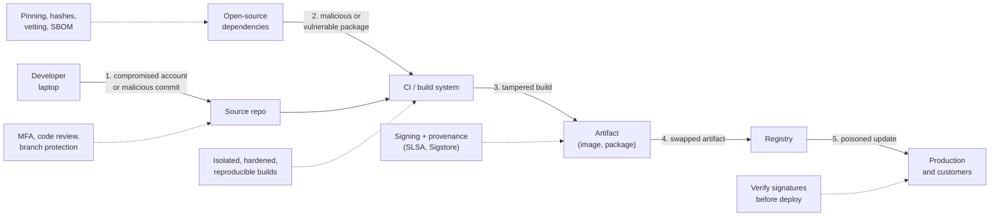
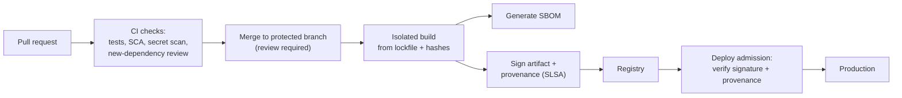

# Software Supply Chain Security

*Most of the code you ship, you didn't write. Attackers know that — and increasingly target dependencies, build systems, and update channels instead of your application.*

---

> *“Given enough eyeballs, all bugs are shallow.”*
>
> — **Eric S. Raymond**, *The Cathedral and the Bazaar*, 1999 ("Linus's Law")

## At a Glance

> **In one sentence:** Software supply chain security protects everything between a developer's keyboard and production — dependencies, package registries, build systems, CI pipelines, artifacts, and update channels — using inventories (SBOMs), pinned and verified dependencies, hardened and reproducible builds, signed artifacts with provenance (SLSA, Sigstore), and fast response when a dependency turns out to be vulnerable or malicious.

**You'll learn**

- Why supply chain attacks are so effective
- Landmark incidents: event-stream, SolarWinds, Codecov, Log4Shell, xz utils
- Attack types: typosquatting, dependency confusion, maintainer compromise, build compromise
- Lockfiles, pinning, hash verification, and update hygiene
- SBOMs, SLSA levels, and artifact signing with Sigstore
- How to respond when a critical dependency vulnerability drops

**Before you start:** [How Secure Systems Are Built](How-Secure-Systems-Are-Built.md) · [Cryptography for Engineers](Cryptography-For-Engineers.md)

**Reading time:** about 10 minutes

---

## The Big Picture



*Every link in the chain is a target. Controls at each link let you prove what you ship came from where you think it did.*

---

## Introduction

In March 2024, a Microsoft engineer named Andres Freund noticed that SSH logins on a test machine were using slightly more CPU than expected — about half a second slower. He investigated and discovered a sophisticated backdoor hidden in **xz utils**, a compression library included in many Linux distributions. An attacker had spent roughly two years building trust as a contributor to the project, eventually gaining maintainer access, then slipped malicious code into release tarballs in a way designed to evade review. It was caught shortly before it reached stable releases of major distributions.

Four years earlier, attackers had compromised the build system of **SolarWinds**, a network-management software vendor, inserting a backdoor into signed updates of its Orion product. Thousands of organizations installed the trojanized update, including government agencies.

Both attacks shared a strategy: instead of attacking thousands of targets individually, attack **one component that thousands of targets trust**.

Modern applications consist largely of open-source dependencies — often hundreds or thousands of packages, most pulled in indirectly. Each one, and each system that builds and delivers your software, is part of your attack surface.

### Why Should Engineers Care?

- A single malicious or vulnerable dependency can compromise every system that uses it.
- Customers and governments increasingly require SBOMs and proof of secure build practices.
- When a critical vulnerability like Log4Shell appears, how fast you can answer "are we affected?" depends on work done in advance.

---

## The Problem It Solves

| Attack path | Example |
|------------|--------|
| Vulnerable dependency | Log4Shell (Log4j, 2021) |
| Malicious package or update | event-stream (2018), xz utils (2024) |
| Typosquatting | A package named like a popular one with a small typo |
| Dependency confusion | A public package with the same name as a private internal one |
| Compromised maintainer account | Stolen registry credentials used to publish malware |
| Compromised build system | SolarWinds Orion (2020) |
| Compromised CI tooling | Codecov's Bash uploader (2021) exposed CI secrets |
| Deleted or changed packages | left-pad removal (2016) broke builds across the npm ecosystem |

---

## Historical Background

- **1984 — "Reflections on Trusting Trust."** Ken Thompson showed that a compromised compiler could insert backdoors invisible in source code — the original supply chain warning.
- **2016 — left-pad.** The removal of a tiny npm package broke builds worldwide, showing how deep dependency chains had become.
- **2018 — event-stream.** A popular npm package was handed to a new maintainer who added code targeting a specific cryptocurrency wallet.
- **2020 — SolarWinds.** Attackers compromised the build pipeline and shipped a backdoor in signed updates.
- **2021 — Codecov** (a modified uploader script leaked CI credentials), **dependency confusion** research by Alex Birsan (showing public packages could replace private ones at many large companies), and **Log4Shell** (a critical remote code execution flaw in the ubiquitous Log4j library, disclosed in December 2021).
- **2021 — Frameworks emerge.** U.S. Executive Order 14028 required SBOMs and secure development practices for software sold to the government; Google introduced **SLSA**; the **Sigstore** project launched to make signing easy.
- **2024 — xz utils backdoor** (CVE-2024-3094) was discovered just before wide distribution, highlighting the risks of under-resourced open-source maintainership.

---

## Core Concepts

### Dependency Hygiene

- **Lockfiles** (`package-lock.json`, `poetry.lock`, `go.sum`, `Cargo.lock`) record exact versions of every direct and transitive dependency, so builds are reproducible.
- **Hash pinning** verifies that downloaded packages match known cryptographic hashes.
- **Minimal dependencies:** every dependency is code you trust; avoid adding packages for trivial functionality.
- **Update regularly** with automated tools, in small batches, so security fixes are easy to apply.
- **Vet new dependencies:** maintenance activity, number of maintainers, popularity, security history, and install scripts.

### Typosquatting and Dependency Confusion

- **Typosquatting:** attackers publish packages with names close to popular ones (swapped letters, dashes vs. underscores).
- **Dependency confusion:** if a build tool checks public registries for a package name used internally, an attacker can publish a public package with that name and a higher version.
- **Defenses:** scoped/namespaced private packages, private registry proxies configured to prefer internal sources, exact names in lockfiles, and review of new dependencies.

### SBOM (Software Bill of Materials)

A machine-readable inventory of all components in a piece of software (formats: SPDX, CycloneDX). When a vulnerability is announced, an SBOM answers "which of our services include this, at which version?" in minutes rather than weeks.

### Secure Builds

- Builds run in **isolated, ephemeral** environments from version-controlled definitions.
- **Least-privilege** CI credentials, separated per environment; no secrets exposed to untrusted pull requests.
- **Reproducible builds** allow independent verification that a binary matches its source.

### Provenance and Signing

- **Provenance:** a signed record of how an artifact was built — which source commit, which builder, which inputs.
- **SLSA** (Supply-chain Levels for Software Artifacts) defines increasing levels of build integrity and provenance guarantees.
- **Sigstore** (cosign, Fulcio, Rekor) enables signing artifacts with short-lived certificates tied to identities, recorded in a public transparency log.
- **Verify before deploy:** admission policies reject images without valid signatures or provenance.

### Responding to a Critical Dependency Vulnerability

1. **Identify exposure** using SBOMs and dependency inventories.
2. **Assess reachability:** is the vulnerable code path used and exposed?
3. **Mitigate quickly:** upgrade, apply configuration workarounds, add WAF rules.
4. **Detect exploitation:** search logs for indicators.
5. **Communicate** with customers if they're affected.

---

## Real-World Analogy

### Food Safety

A restaurant doesn't grow every ingredient. It buys from suppliers — and a contaminated batch of lettuce can sicken customers at thousands of restaurants. Good restaurants know exactly which suppliers and batches they used (SBOM), buy from trusted sources with sealed packaging (signatures and hashes), keep their kitchen clean and controlled (secure builds), and can quickly pull any dish containing a recalled ingredient (vulnerability response).

---

## How It Works In Practice

### A Hardened Pipeline



### Log4Shell-Style Response Timeline

| Time | Action |
|-----|-------|
| Hour 0 | Vulnerability disclosed; security channel opened |
| Hour 1 | Query SBOMs and dependency inventories for affected versions |
| Hour 2–6 | Apply mitigations to internet-facing services; WAF rules |
| Day 1–3 | Upgrade all affected services; verify by rescanning |
| Week 1 | Review logs for exploitation attempts; customer communication |
| Afterward | Postmortem: how could we have answered faster? |

### Dependency Policy (example)

- New direct dependencies require review (maintenance, license, security history, install scripts).
- Lockfiles committed; CI fails if they're out of date.
- Automated update pull requests weekly; security updates immediately.
- Internal packages published under a private scope; registry proxy prefers internal sources.
- Production images must be signed and have provenance from the official CI builder.

---

## Production Engineering Perspective

- **Inventory first:** SBOMs for every deployable service, stored and queryable.
- **Watch advisories** through dependency scanners and vulnerability databases (for example, OSV and GitHub Advisory Database).
- **Protect maintainers' accounts:** MFA for registries, code hosting, and CI; branch protection and required reviews.
- **Limit build-time power:** install scripts and CI jobs can run arbitrary code — restrict network access and secrets during builds.
- **Contribute back:** critical open-source dependencies often have very few maintainers; funding and contributing improves everyone's security.

---

## Tradeoffs

| Practice | Benefit | Cost |
|---------|--------|-----|
| Pinning exact versions | Reproducible, controlled builds | Must actively update |
| Frequent automated updates | Faster security fixes | Churn; possible breakages |
| Fewer dependencies | Smaller attack surface | More code to write and maintain |
| Vendoring dependencies | Full control and review | Large repositories; update effort |
| Signature enforcement at deploy | Blocks tampered artifacts | Tooling and key/identity management |
| Reproducible builds | Independent verification | Significant engineering effort |

---

## Common Mistakes

### Beginner Mistakes

- Not committing lockfiles, so each build may pull different versions.
- Installing packages from memory or a quick search without checking the exact name.
- Running `curl | bash` installers in CI without verification.

### Intermediate Mistakes

- CI secrets available to workflows triggered by untrusted forks.
- Private package names that can be claimed on public registries.
- Dependency updates batched once a year, making security upgrades huge and risky.

### Senior-Level Mistakes

- No SBOMs, so the response to a critical vulnerability takes weeks.
- Build systems with broad production access and no isolation.
- Treating open-source dependencies as free and maintenance-free.

---

## Failure Scenarios

### Scenario 1: The Typo

A developer installs `requsets` instead of `requests`. The typosquatted package steals environment variables during installation.

**Mitigation:** review new dependencies, registry proxies with allow-lists, and scanners that flag suspicious packages.

### Scenario 2: The Internal Name

An internal package `acme-auth-utils` exists only in a private registry. An attacker publishes a public package with the same name and version 99.0.0; misconfigured builds pull the public one.

**Mitigation:** scoped names, registry configuration that never falls back to public sources for internal names, and lockfile hashes.

### Scenario 3: The Critical CVE Friday

A critical vulnerability is announced in a logging library. Nobody knows which of 300 services use it.

**Mitigation:** SBOMs and dependency inventories queryable in minutes.

### Scenario 4: The Tampered Artifact

An attacker with registry access replaces a container image with a backdoored one under the same tag.

**Mitigation:** deploy by immutable digest, verify signatures and provenance at admission, restrict registry write access.

---

## Real-World Industry Examples

- **SolarWinds (2020):** a build-system compromise led to backdoored signed updates reaching thousands of customers.
- **Log4Shell (2021):** a critical vulnerability in Log4j affected an enormous range of Java software; organizations with inventories responded far faster.
- **xz utils (2024):** a long-running social-engineering campaign against an open-source maintainer produced a backdoor that was caught by an engineer noticing a small performance anomaly.
- **SLSA, Sigstore, and OpenSSF** (Open Source Security Foundation) provide frameworks and tools widely adopted by package ecosystems and companies; npm and PyPI have added provenance and trusted publishing features.

---

## Interview Questions

### Beginner

**Q1: What is a lockfile, and why commit it?**

*Model answer:* A lockfile records the exact versions (and often hashes) of all direct and transitive dependencies. Committing it makes builds reproducible and prevents unexpected or malicious version changes from entering silently.

### Intermediate

**Q2: What is dependency confusion?**

*Model answer:* An attack where a build tool resolves a package name to a public registry instead of the intended private one — for example, because the public package has a higher version. Attackers publish packages matching internal names. Defenses include scoped names, registry configuration that prefers internal sources, and hash-pinned lockfiles.

**Q3: What is an SBOM used for?**

*Model answer:* It's an inventory of all components in software. It lets you quickly determine which systems include a vulnerable component, satisfy customer and regulatory requirements, and track licenses.

### Senior

**Q4: How would you protect a CI/CD pipeline from supply chain attacks?**

*Model answer:* Protected branches with required reviews and MFA; isolated, ephemeral build runners; least-privilege, short-lived credentials; no secrets for untrusted forks; pinned and hash-verified dependencies and CI actions; SBOM generation; artifact signing with provenance; deploy-time verification of signatures; and monitoring of pipeline configuration changes.

### Architecture / Leadership

**Q5: A critical vulnerability is announced in a widely used library. What should your organization be able to do, and how do you get there?**

*Model answer:* Within hours, identify every affected service from SBOMs, prioritize internet-facing exposure, apply mitigations, and upgrade within days while checking logs for exploitation. Getting there requires SBOMs for all services, automated dependency scanning, a regular update habit (so upgrades are small), an incident process for security events, and clear ownership of every service.

---

## Hands-On Lab

Three supply chain checks in pure Python: typosquat detection, unpinned dependencies, and hash verification. Save as `supply_chain_lab.py` and run it.

```python
import hashlib

# --- 1) Typosquatting: compare requested names with popular packages -----------
POPULAR = ["requests", "numpy", "pandas", "django", "flask", "cryptography", "urllib3", "boto3"]

def distance(a, b):
    """Levenshtein edit distance."""
    prev = list(range(len(b) + 1))
    for i, ca in enumerate(a, 1):
        cur = [i]
        for j, cb in enumerate(b, 1):
            cur.append(min(prev[j] + 1, cur[j - 1] + 1, prev[j - 1] + (ca != cb)))
        prev = cur
    return prev[-1]

requirements = """
requests==2.32.3
requsets==1.0.0
numpy>=1.26
pandas
djang0==5.0.1
cryptography==43.0.0 --hash=sha256:placeholder
""".split("\n")

print("Typosquat and pinning check:")
for line in filter(None, requirements):
    name = line.split("==")[0].split(">=")[0].split()[0].strip()
    suspects = [p for p in POPULAR if p != name and distance(name, p) <= 2]
    pinned = "==" in line
    flags = []
    if suspects: flags.append(f"looks like '{suspects[0]}' (possible typosquat)")
    if not pinned: flags.append("not pinned to an exact version")
    if pinned and "--hash" not in line: flags.append("no hash pin")
    print(f"  {name:14} {'; '.join(flags) or 'OK'}")

# --- 2) Hash verification of a downloaded artifact ----------------------------
artifact = b"pretend these are the bytes of tool-v1.4.2.tar.gz"
published_sha256 = hashlib.sha256(artifact).hexdigest()       # from the release page / lockfile

downloaded = artifact                                        # what we actually received
tampered = artifact + b" + backdoor"
for label, data in [("genuine download", downloaded), ("tampered download", tampered)]:
    ok = hashlib.sha256(data).hexdigest() == published_sha256
    print(f"\n{label}: {'hash matches - install' if ok else 'HASH MISMATCH - refuse to install'}", end="")
print()
```

**What to notice**
- `requsets` and `djang0` are one or two edits away from popular packages — exactly how typosquats catch hurried typing.
- Unpinned (`pandas`) and range-pinned (`numpy>=1.26`) dependencies can change on the next build without anyone noticing.
- A hash check refuses the tampered download. But if an attacker controls both the download and the page listing the hash, hashes alone aren't enough — that's why **signatures** and **provenance** from a trusted identity matter.
- Real tools do this at scale: dependency scanners, registry proxies, and hash-checking installers (for example, `pip install --require-hashes`).

---

## Test Yourself

*Answer each question in your head or on paper first, then open the answer to check.*

<details markdown="1">
<summary><strong>1. Why are supply chain attacks so attractive to attackers?</strong></summary>

Compromising one widely used component (a library, a build system, an update channel) gives access to every organization that trusts it.

</details>

<details markdown="1">
<summary><strong>2. How was the xz utils backdoor discovered?</strong></summary>

An engineer noticed SSH logins using unexpectedly more CPU and investigated, finding malicious code inserted by a long-time contributor who had gained maintainer trust.

</details>

<details markdown="1">
<summary><strong>3. What is typosquatting?</strong></summary>

Publishing malicious packages with names similar to popular ones, hoping developers mistype or misremember names.

</details>

<details markdown="1">
<summary><strong>4. What does SLSA stand for, and what does it address?</strong></summary>

Supply-chain Levels for Software Artifacts — a framework of increasing guarantees about build integrity and provenance.

</details>

<details markdown="1">
<summary><strong>5. What does Sigstore provide?</strong></summary>

Tools and services for signing artifacts with short-lived, identity-bound certificates and recording signatures in a public transparency log.

</details>

<details markdown="1">
<summary><strong>6. Why deploy container images by digest rather than tag?</strong></summary>

Tags can be moved to point at different images; a digest identifies exact image content and can't be silently swapped.

</details>

<details markdown="1">
<summary><strong>7. What made Log4Shell responses slow at many organizations?</strong></summary>

They didn't know where Log4j was used — often deep in transitive dependencies — because they lacked SBOMs and dependency inventories.

</details>

---

## Cheat Sheet

| Link in the chain | Controls |
|------------------|---------|
| Source | MFA, branch protection, required reviews, signed commits |
| Dependencies | Lockfiles, hash pinning, vetting, scoped names, registry proxy, automated updates |
| Build | Isolated ephemeral runners, least-privilege credentials, no secrets for forks, reproducibility |
| Artifacts | SBOM, signing, provenance (SLSA), immutable digests |
| Deploy | Verify signatures/provenance at admission |
| Response | SBOM queries, exposure triage, fast upgrades, log review |

**Landmark incidents:** left-pad 2016 · event-stream 2018 · SolarWinds 2020 · Codecov 2021 · dependency confusion 2021 · Log4Shell 2021 · xz utils 2024.

---

## In the AI Era

- **Hallucinated packages are a new typosquatting vector.** AI assistants sometimes suggest package names that don't exist; attackers register commonly hallucinated names ("slopsquatting"). Verify every suggested dependency before installing.
- **Models and datasets are dependencies too.** Downloaded model weights, tokenizers, and datasets can be tampered with or contain unsafe serialized code (for example, pickle-based formats). Prefer safe formats (such as safetensors), trusted sources, and hash verification.
- **AI coding agents install packages and edit build files** — run them in sandboxes, require review of dependency and CI changes, and never give them publishing credentials.
- **MCP servers and AI plugins** are third-party code with access to your tools and data; vet and pin them like any dependency.

**Try it:** Add three plausible-but-fake package names an AI might suggest (for example, `pandas-helpers-pro`) to the lab's requirements list. How would you verify whether they're real and trustworthy?

---

## Key Takeaways

1. Your software is mostly other people's code; every dependency and build step is attack surface.
2. Commit lockfiles, pin versions and hashes, vet new dependencies, and update continuously in small steps.
3. Defend against typosquatting and dependency confusion with scoped names and registry configuration.
4. Maintain SBOMs so you can answer "are we affected?" in minutes.
5. Harden builds and sign artifacts with provenance (SLSA, Sigstore); verify before deploying.
6. AI adds new supply chain risks: hallucinated packages, untrusted models, and powerful agents.

---

## What to Read Next

- **[Securing AI Systems](../15-AI-Era-Engineering/Securing-AI-Systems.md)** — supply chain and injection risks for AI
- **[Deployments: Strategies and Risks](../11-Production-Engineering/Deployments-Strategies-And-Risks.md)** — where artifact verification fits in delivery
- **[Why Hackers Succeed](Why-Hackers-Succeed.md)** — third parties as a top entry point

---

## Further Reading

- **Ken Thompson — "Reflections on Trusting Trust" (1984)**
- **SLSA framework:** [https://slsa.dev](https://slsa.dev)
- **Sigstore:** [https://www.sigstore.dev](https://www.sigstore.dev)
- **OpenSSF (Open Source Security Foundation) — Scorecard and guides:** [https://openssf.org](https://openssf.org)
- **CISA — Software Bill of Materials resources:** [https://www.cisa.gov/sbom](https://www.cisa.gov/sbom)
- **Alex Birsan — "Dependency Confusion: How I Hacked Into Apple, Microsoft and Dozens of Other Companies" (2021)**
- **OSV — Open Source Vulnerabilities database:** [https://osv.dev](https://osv.dev)

---

*This chapter is part of the Modern Software Engineering Handbook — a comprehensive guide to the concepts, principles, and practices that every professional software engineer should know.*
