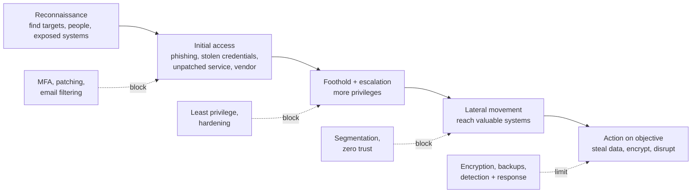

# Why Hackers Succeed

*Most breaches don't need genius. They exploit ordinary gaps — an unpatched server, a reused password, a trusted vendor, a busy person clicking a link.*

---

> *“Amateurs hack systems, professionals hack people.”*
>
> — **Bruce Schneier**, *Crypto-Gram* newsletter, 2000

## At a Glance

> **In one sentence:** Attackers succeed because defenders must protect everything while attackers need only one way in — and the ways in are usually mundane: stolen or weak credentials, unpatched software, misconfiguration, phishing, and trusted third parties — so security comes from reducing attack surface, layering defenses, and assuming breach.

**You'll learn**

- The attacker's mindset and why it differs from the builder's
- The most common real-world entry points behind breaches
- Attack surface and how it grows
- The stages of an attack, from reconnaissance to impact
- Defense in depth and "assume breach"
- Threat modeling with STRIDE

**Before you start:** [How HTTPS Protects Your Data](../03-How-The-Internet-Works/How-HTTPS-Protects-Your-Data.md) · [How To Think Like An Engineer](../01-Foundations/How-To-Think-Like-An-Engineer.md)

**Reading time:** about 10 minutes

---

## The Big Picture



*An attack is a chain. Every layer of defense is a chance to break it — which is why no single control needs to be perfect.*

---

## Introduction

In 2017, attackers broke into Equifax, one of the largest credit bureaus in the United States, and stole personal data of roughly 147 million people. The entry point was a known vulnerability in the Apache Struts web framework. A patch had been available for about two months. It hadn't been applied to the affected system.

In 2021, a ransomware attack on Colonial Pipeline disrupted fuel supplies along the U.S. East Coast. According to the company's testimony, the attackers got in using a compromised password for a legacy VPN account that didn't use multi-factor authentication.

Neither attack required extraordinary technical brilliance. Both exploited ordinary gaps that exist, somewhere, in almost every organization. That's the uncomfortable lesson of security: **attackers don't need to find the best way in — only one way in.** And the most common ways in are boring.

### Why Should Engineers Care?

- Every engineer writes code, configures systems, or holds credentials that could be the one way in.
- Security failures are among the most expensive incidents: data loss, legal liability, ransom, and lost trust.
- Thinking like an attacker catches problems during design, when they're cheapest to fix.

---

## The Problem It Solves

Builders ask "does it work for legitimate users?" Attackers ask "what can I make it do that nobody intended?" This asymmetry creates predictable gaps:

| Builder's assumption | Attacker's exploit |
|---------------------|-------------------|
| Users send valid input | Crafted input: injection, overflows |
| Internal network is safe | Once inside, move freely |
| Only our app calls this API | Call it directly, skip the checks in the UI |
| Old systems are unused | Forgotten systems are unpatched and unmonitored |
| Our vendors are trustworthy | Compromise the vendor to reach its customers |
| People follow procedures | Busy people click links and reuse passwords |

---

## Historical Background

- **1970s–1980s — Phone phreaking and early hacking.** Curiosity-driven exploration of phone networks and early computers.
- **1988 — The Morris worm** spread across the early internet by exploiting known weaknesses (including a buffer overflow in `fingerd` and weak passwords), infecting a significant fraction of connected machines. It led to the creation of the first Computer Emergency Response Team (CERT).
- **1990s–2000s — Worms and web attacks.** Code Red (2001), SQL Slammer (2003), and the rise of SQL injection and cross-site scripting as the web grew.
- **2009–2010 — Nation-state operations.** Operation Aurora targeted Google and other companies; Stuxnet showed that cyberattacks could cause physical damage.
- **2013 — Target breach** — attackers reportedly entered through credentials stolen from an HVAC vendor and reached payment systems.
- **2017 — WannaCry and NotPetya** spread using a leaked exploit for an already-patched Windows vulnerability, causing billions of dollars in damage. Equifax was breached the same year.
- **2020s — Ransomware and supply-chain attacks** (SolarWinds, 2020; Colonial Pipeline, 2021) became the dominant high-impact threats.

---

## Core Concepts

### The Common Entry Points

Year after year, industry breach reports (such as the Verizon Data Breach Investigations Report) find the same few causes behind most breaches:

1. **Stolen or weak credentials** — reused passwords, credential stuffing, leaked keys, no MFA.
2. **Phishing and social engineering** — tricking people into giving access or running malware.
3. **Exploiting known vulnerabilities** — unpatched software facing the internet.
4. **Misconfiguration** — public storage buckets, open admin panels, default passwords, overly broad permissions.
5. **Third parties** — vendors, contractors, and software dependencies with access or trust.

A large share of breaches involve a human element — a mistake, a stolen credential, or a successful manipulation.

### Attack Surface

Everything an attacker can reach: public endpoints, login pages, APIs, open ports, employee email, third-party integrations, build pipelines, dependencies, and cloud consoles. Attack surface grows quietly with every new service, forgotten test server, and added integration. **Reducing it** — removing what you don't need — is one of the most effective defenses.

### The Attack Chain

Frameworks such as the Lockheed Martin Cyber Kill Chain and MITRE ATT&CK describe attacks in stages: reconnaissance, initial access, execution, persistence, privilege escalation, lateral movement, collection, exfiltration, and impact. Defenders can break the chain at any stage.

### Defense in Depth

Layers of independent controls, so that one failure isn't fatal: MFA *and* anomaly detection, least privilege *and* network segmentation, encryption *and* access logging, backups *and* monitoring.

### Assume Breach

Design as if attackers are already inside somewhere: limit what any single account or system can reach, log and detect unusual behavior, and practice incident response. This mindset leads to [Zero Trust Architecture](Zero-Trust-Architecture.md).

### Threat Modeling with STRIDE

A structured way to ask "what can go wrong?" for each component and data flow:

| Threat | Violates | Example | Typical control |
|-------|---------|--------|----------------|
| **S**poofing | Authentication | Using stolen session cookies | MFA, strong session handling |
| **T**ampering | Integrity | Modifying a price in a request | Server-side validation, signatures |
| **R**epudiation | Non-repudiation | "I never made that transfer" | Audit logs |
| **I**nformation disclosure | Confidentiality | Reading other users' data | Access control, encryption |
| **D**enial of service | Availability | Flooding an endpoint | Rate limits, capacity |
| **E**levation of privilege | Authorization | User becomes admin | Least privilege, authorization checks |

---

## Real-World Analogy

### Burglars and Houses

Burglars rarely pick sophisticated locks. They look for the open window, the key under the mat, the house with newspapers piling up, or the neighbor who'll let a "delivery person" in. A secure house has layers: good locks (authentication), an alarm (detection), a safe for valuables (encryption), neighbors who notice strangers (monitoring), and insurance (backups and recovery). And the owners regularly check for open windows (attack surface review).

---

## How It Works In Practice

### A Typical Breach Story, Step by Step

1. **Recon:** attackers find employee names on a professional networking site and guess email formats.
2. **Initial access:** a phishing email leads to a fake login page; one employee enters their password. MFA isn't enforced for that system.
3. **Foothold:** the attacker logs into a VPN and finds an internal wiki with credentials in a page.
4. **Escalation:** those credentials belong to a service account with broad admin rights.
5. **Lateral movement:** the flat internal network allows access to database servers.
6. **Impact:** data is exfiltrated, then systems are encrypted for ransom.

Each step had a defense that would have broken the chain: phishing-resistant MFA, secrets out of wikis, least-privilege service accounts, network segmentation, and egress monitoring.

### Threat Modeling a Feature

For a "download invoice PDF" feature:

- **Spoofing:** can someone download without logging in? → require authentication.
- **Tampering:** can someone change the invoice ID in the URL? → yes → check ownership on the server (**IDOR** risk).
- **Repudiation:** do we log who downloaded what? → add audit logs.
- **Information disclosure:** are PDFs stored in a public bucket? → private storage, short-lived signed URLs.
- **Denial of service:** can someone request thousands of PDFs? → rate limits.
- **Elevation of privilege:** can a user access the admin invoice view? → server-side role checks.

Thirty minutes of this during design prevents most of the bugs a penetration test would find later.

---

## Production Engineering Perspective

- **Patch fast, especially internet-facing systems.** Track known exploited vulnerabilities (for example, the U.S. CISA "Known Exploited Vulnerabilities" catalog) and patch those first.
- **MFA everywhere,** preferably phishing-resistant (security keys, passkeys) for administrators and remote access.
- **Asset inventory:** you can't protect systems you don't know exist. Find and remove forgotten ones.
- **Secrets management:** no credentials in code, wikis, tickets, or chat.
- **Logging and detection:** centralize authentication, admin, and data-access logs; alert on anomalies.
- **Practice incident response** for security scenarios, including ransomware and credential leaks.

---

## Tradeoffs

| Control | Benefit | Cost |
|--------|--------|-----|
| Strict MFA | Blocks most credential attacks | User friction; support load |
| Fast patching | Closes known holes | Risk of breaking changes; testing effort |
| Least privilege | Limits blast radius | More access requests; admin work |
| Network segmentation | Slows lateral movement | Complexity; connectivity issues |
| Extensive logging | Detection and forensics | Cost, privacy, noise |
| Security reviews | Catch design flaws | Time before launch |

Security is always a balance between risk, cost, and usability. The goal is to make attacks expensive enough that attackers fail or go elsewhere — and to limit the damage when they don't.

---

## Common Mistakes

### Beginner Mistakes

- Trusting input from the client (hidden fields, prices, user IDs).
- Committing API keys or passwords to repositories.
- Assuming "no one will find this endpoint."

### Intermediate Mistakes

- MFA for most systems but not for the VPN, admin console, or email.
- Service accounts with far more permissions than needed.
- Ignoring old, "unused" systems that remain internet-facing.

### Senior-Level Mistakes

- A flat internal network where one compromised laptop reaches everything.
- No visibility into third-party access and dependencies.
- Security treated as a final review step rather than part of design.

---

## Failure Scenarios

### Scenario 1: The Unpatched Framework

A critical vulnerability in a web framework is announced with a patch. The team schedules the upgrade for next quarter. Attackers begin mass-scanning within days.

**Mitigation:** prioritize patches for known-exploited and internet-facing vulnerabilities within days; keep dependencies current so upgrades are small.

### Scenario 2: The Leaked Key

A developer pushes a cloud access key to a public repository. Automated bots find it within minutes and start crypto-mining on the account.

**Mitigation:** secret scanning in CI and on push, short-lived credentials, least-privilege keys, billing alerts.

### Scenario 3: The Forgotten Test Server

A staging server with production data copies and default admin credentials remains online after a project ends.

**Mitigation:** asset inventory, automatic expiry of temporary environments, no production data in test systems.

### Scenario 4: The Trusted Vendor

A supplier's remote-access credentials are stolen; the supplier's account has broad network access.

**Mitigation:** third-party access limited to specific systems, MFA, time-limited access, monitoring.

---

## Real-World Industry Examples

- **Equifax (2017):** an unpatched Apache Struts vulnerability led to the exposure of data on about 147 million people.
- **Target (2013):** attackers reportedly used credentials stolen from an HVAC contractor to reach systems that processed payment cards.
- **Capital One (2019):** a misconfigured web application firewall allowed a server-side request forgery (SSRF) that retrieved cloud credentials, exposing data on around 100 million people.
- **Colonial Pipeline (2021):** a compromised VPN password without MFA was reportedly the entry point for a ransomware attack that disrupted fuel supply.
- **MITRE ATT&CK** catalogs real attacker techniques and is widely used to plan defenses and detections.

---

## Interview Questions

### Beginner

**Q1: What are the most common ways attackers get in?**

*Model answer:* Stolen or weak credentials (especially without MFA), phishing, exploitation of known but unpatched vulnerabilities, misconfigurations such as public storage or open admin panels, and compromised third parties or dependencies.

### Intermediate

**Q2: What is defense in depth?**

*Model answer:* Using multiple independent layers of security so that the failure of one doesn't lead to a breach — for example, MFA plus anomaly detection plus least privilege plus network segmentation plus encryption and backups.

**Q3: Walk through STRIDE.**

*Model answer:* A threat-modeling checklist: Spoofing (pretending to be someone), Tampering (modifying data), Repudiation (denying actions), Information disclosure (leaking data), Denial of service (making it unavailable), and Elevation of privilege (gaining more access). Apply it to each component and data flow in a design.

### Senior

**Q4: How would you reduce the attack surface of a web application?**

*Model answer:* Inventory everything exposed; remove unused endpoints, services, ports, and old environments; put admin interfaces behind strong authentication and private networks; minimize third-party scripts and dependencies; restrict cloud permissions; and review new exposure during design reviews.

### Architecture / Leadership

**Q5: Where would you invest first to improve a company's security posture?**

*Model answer:* The controls that block the most common attacks: phishing-resistant MFA everywhere (starting with admins, email, and remote access), fast patching of internet-facing and known-exploited vulnerabilities, an asset inventory, secrets management, least privilege for service accounts, centralized logging with alerting, immutable backups, and a practiced incident response plan. Then build security into design reviews and development.

---

## Hands-On Lab

See why password storage matters. Pure Python (standard library); save as `password_lab.py` and run it.

```python
import hashlib, os, time

leaked_common = ["123456", "password", "qwerty", "iloveyou", "letmein", "dragon",
                 "monkey", "sunshine", "princess", "football", "welcome1", "Summer2024!"]
wordlist = leaked_common + [f"password{i}" for i in range(20_000)]      # an attacker's guess list

users = {"asha": "sunshine", "ravi": "Summer2024!", "meera": "tq8#Lp!v92xZ"}

# 1) Bad: unsalted fast hash
fast_db = {u: hashlib.sha256(p.encode()).hexdigest() for u, p in users.items()}
start = time.perf_counter()
lookup = {hashlib.sha256(w.encode()).hexdigest(): w for w in wordlist}   # precompute once, reuse forever
cracked = {u: lookup[h] for u, h in fast_db.items() if h in lookup}
print(f"SHA-256 (no salt): cracked {cracked} in {time.perf_counter() - start:.3f}s")

# 2) Better: salted, deliberately slow hash (scrypt)
def slow_hash(password, salt):
    return hashlib.scrypt(password.encode(), salt=salt, n=2**14, r=8, p=1)

salted_db = {}
for u, p in users.items():
    salt = os.urandom(16)
    salted_db[u] = (salt, slow_hash(p, salt))

start = time.perf_counter()
salt, target = salted_db["asha"]
tries = 0
for w in wordlist[:200]:                      # only 200 guesses for ONE user
    tries += 1
    if slow_hash(w, salt) == target:
        break
elapsed = time.perf_counter() - start
print(f"scrypt: {tries} guesses for one user took {elapsed:.2f}s "
      f"-> the full list would take ~{elapsed / tries * len(wordlist) / 60:.0f} min per user")
```

**What to notice**
- With a fast, unsalted hash, the attacker hashes their word list once and cracks every weak password instantly — for every user, and for every leaked database that used the same scheme.
- With a salt, each user's hash must be attacked separately; with a deliberately slow function (scrypt, bcrypt, Argon2), every guess costs real time.
- Meera's long random password isn't in any list — neither scheme cracks it. Strong, unique passwords plus MFA protect users even when a database leaks.

---

## Test Yourself

*Answer each question in your head or on paper first, then open the answer to check.*

<details markdown="1">
<summary><strong>1. Why do attackers have an advantage over defenders?</strong></summary>

Defenders must protect every entry point; attackers need to find just one weakness.

</details>

<details markdown="1">
<summary><strong>2. Name the five most common entry points for breaches.</strong></summary>

Stolen or weak credentials, phishing and social engineering, unpatched known vulnerabilities, misconfigurations, and compromised third parties.

</details>

<details markdown="1">
<summary><strong>3. What is attack surface?</strong></summary>

Everything an attacker can reach and try to abuse: endpoints, ports, APIs, people, integrations, dependencies, and consoles.

</details>

<details markdown="1">
<summary><strong>4. What does "assume breach" mean?</strong></summary>

Designing systems as if an attacker is already inside: limiting access and blast radius, and investing in detection and response.

</details>

<details markdown="1">
<summary><strong>5. What does the "E" in STRIDE stand for, and what control addresses it?</strong></summary>

Elevation of privilege — addressed by least privilege and server-side authorization checks.

</details>

<details markdown="1">
<summary><strong>6. Why is a slow hash good for passwords but bad for most other uses?</strong></summary>

Slowness makes each guess expensive for attackers cracking stolen hashes; for general data integrity or lookups, speed is desirable.

</details>

<details markdown="1">
<summary><strong>7. What did the Morris worm lead to?</strong></summary>

The creation of the first Computer Emergency Response Team (CERT), after it spread across the early internet in 1988.

</details>

---

## Cheat Sheet

**Top entry points:** credentials · phishing · unpatched vulnerabilities · misconfiguration · third parties.

**Attack chain:** recon → initial access → foothold/escalation → lateral movement → impact.

| Layer | Key controls |
|------|-------------|
| Identity | Phishing-resistant MFA, least privilege, short-lived credentials |
| Software | Fast patching, dependency updates, secure coding |
| Configuration | Private by default, no default passwords, reviewed IAM |
| Network | Segmentation, zero trust access, egress control |
| Data | Encryption, access logging, minimal retention |
| Detection & response | Centralized logs, alerts, practiced response, immutable backups |

**STRIDE:** Spoofing · Tampering · Repudiation · Information disclosure · Denial of service · Elevation of privilege.

---

## In the AI Era

- **Attackers use AI too:** more convincing phishing in any language, faster reconnaissance, and help writing exploits. The basics — MFA, patching, least privilege — matter even more.
- **AI adds new attack surface:** prompt injection, agents with broad permissions, leaked API keys, and data sent to model providers. See [Securing AI Systems](../15-AI-Era-Engineering/Securing-AI-Systems.md).
- **AI-generated code can introduce vulnerabilities** (injection, missing authorization checks) and hallucinated dependencies. Review it like any untrusted contribution.
- **Defenders benefit as well:** AI helps triage alerts, analyze logs, and review code for security issues — with humans verifying conclusions.

**Try it:** Threat-model an AI email assistant with STRIDE. Which threat category does prompt injection fall into — and which does data exfiltration through a tool call fall into?

---

## Key Takeaways

1. Attackers need one way in; defenders must cover them all — so reduce attack surface and layer defenses.
2. Most breaches start with ordinary gaps: credentials, phishing, unpatched software, misconfiguration, third parties.
3. Attacks are chains; every layer is a chance to break the chain.
4. Assume breach: limit blast radius and invest in detection and response.
5. Threat model with STRIDE during design, when fixes are cheapest.
6. Store passwords with salted, slow hashes and protect accounts with MFA.

---

## What to Read Next

- **[The Most Common Web Attacks](The-Most-Common-Web-Attacks.md)** — the specific bugs attackers exploit in web apps
- **[Zero Trust Architecture](Zero-Trust-Architecture.md)** — designing for "assume breach"
- **[Securing AI Systems](../15-AI-Era-Engineering/Securing-AI-Systems.md)** — the newest attack surface

---

## Further Reading

- **Verizon — Data Breach Investigations Report (annual):** [https://www.verizon.com/business/resources/reports/dbir/](https://www.verizon.com/business/resources/reports/dbir/)
- **MITRE ATT&CK:** [https://attack.mitre.org](https://attack.mitre.org)
- **CISA — Known Exploited Vulnerabilities Catalog:** [https://www.cisa.gov/known-exploited-vulnerabilities-catalog](https://www.cisa.gov/known-exploited-vulnerabilities-catalog)
- **Adam Shostack — "Threat Modeling: Designing for Security" (2014)**
- **Ross Anderson — "Security Engineering" (3rd edition, 2020; earlier editions free online):** [https://www.cl.cam.ac.uk/~rja14/book.html](https://www.cl.cam.ac.uk/~rja14/book.html)
- **U.S. House Oversight Committee — "The Equifax Data Breach" report (2018)**

---

*This chapter is part of the Modern Software Engineering Handbook — a comprehensive guide to the concepts, principles, and practices that every professional software engineer should know.*
