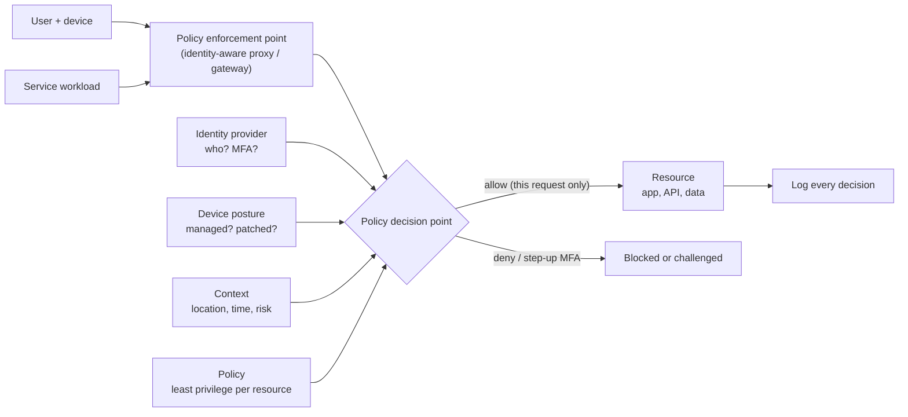
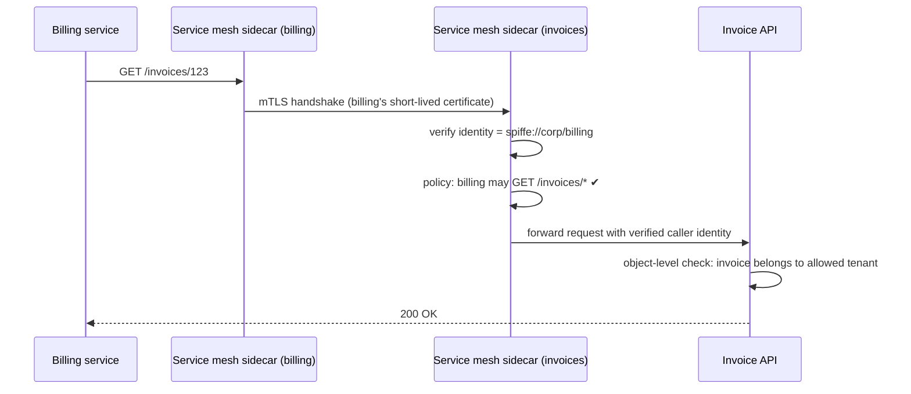

# Zero Trust Architecture

*Stop trusting the network. Verify every request — who is asking, from what device, for what, and whether it's allowed right now.*

---

> *“Never trust, always verify.”*
>
> — **John Kindervag**, the zero trust maxim, introduced while at Forrester Research, 2010

## At a Glance

> **In one sentence:** Zero trust replaces "inside the network means trusted" with continuous, per-request decisions based on strong identity, device health, and least-privilege policy, so that a stolen laptop, a phished password, or a compromised service can reach only what it's explicitly allowed to — and nothing more.

**You'll learn**

- Why perimeter security ("castle and moat") fails
- The core principles of zero trust
- Identity-aware access for people and workload identity for services
- Device posture, context, and continuous verification
- Micro-segmentation, mutual TLS, and service-to-service authorization
- How organizations migrate toward zero trust in practice

**Before you start:** [Why Hackers Succeed](Why-Hackers-Succeed.md) · [How HTTPS Protects Your Data](../03-How-The-Internet-Works/How-HTTPS-Protects-Your-Data.md)

**Reading time:** about 10 minutes

---

## The Big Picture



*Every request — from people or services — is checked against identity, device, context, and policy. Network location grants nothing.*

---

## Introduction

For decades, corporate security looked like a castle: a strong wall (firewall) around the network, and a moat (VPN) to get in. Inside the walls, systems trusted each other. If you were on the office network, you could reach most internal apps.

The trouble is that attackers get inside the walls — through a phishing email, a stolen VPN password, a compromised vendor, or a vulnerable server. Once inside, the castle model lets them move freely. Meanwhile, the walls themselves stopped matching reality: employees work from home and cafés, applications run in multiple clouds, and services talk to partners' APIs over the internet.

In 2009, Google was targeted by a sophisticated attack known as Operation Aurora. Its response was to rethink internal access entirely: an initiative called **BeyondCorp**, which moved access controls from the network perimeter to individual users, devices, and applications. Employees could work from any network, including untrusted ones, and still access internal apps — because access depended on who they were and what device they used, not where they were connected.

That idea — **no implicit trust based on network location** — is zero trust.

### Why Should Engineers Care?

- Modern systems are distributed across clouds, networks, and devices; there is no single perimeter to defend.
- Zero trust limits the blast radius of the most common attacks: stolen credentials and compromised machines.
- It shapes how services authenticate to each other — a daily concern for backend engineers.

---

## The Problem It Solves

| Perimeter model | Zero trust model |
|----------------|-----------------|
| Trust based on network location | Trust based on identity, device, and context |
| VPN grants broad network access | Access granted per application, per request |
| Flat internal network | Micro-segmented; services authorize each call |
| Authentication at the edge only | Authentication and authorization everywhere |
| Breach of one machine exposes much | Breach limited to that identity's explicit permissions |

---

## Historical Background

- **2003–2004 — Jericho Forum** argued for "de-perimeterization," anticipating zero trust ideas.
- **2009 — Operation Aurora** targeted Google and other companies, prompting Google's rethink of internal access.
- **2010 — "Zero trust"** was coined and popularized by John Kindervag at Forrester Research.
- **2014 onward — BeyondCorp papers.** Google published a series of papers describing how it moved employees to identity- and device-based access without a privileged corporate network.
- **2017 onward — Service meshes** (Istio, Linkerd) made mutual TLS and service identity easier; SPIFFE standardized workload identities.
- **2020 — NIST SP 800-207** defined zero trust architecture in a vendor-neutral standard.
- **2021–2022 — U.S. Executive Order 14028** and the subsequent federal zero trust strategy directed U.S. agencies toward zero trust architectures, accelerating adoption well beyond government.

---

## Core Concepts

### Principles

1. **Verify explicitly:** authenticate and authorize every request using all available signals.
2. **Least privilege:** grant only the access needed, for only as long as needed.
3. **Assume breach:** design so that any compromised component has limited reach, and log everything for detection.
4. **No implicit trust from network location:** the internal network is treated like the internet.

### Components (NIST SP 800-207 terms)

- **Policy decision point (PDP):** decides whether a request is allowed.
- **Policy enforcement point (PEP):** sits in the request path (proxy, gateway, sidecar) and enforces the decision.
- **Signals:** identity (with MFA), device posture, request context, threat intelligence, resource sensitivity.

### Strong Identity for People

- Single sign-on (SSO) through a central identity provider.
- **Phishing-resistant MFA** (security keys, passkeys/FIDO2) rather than SMS codes.
- **Step-up authentication** for sensitive actions.
- **Short sessions** and continuous re-evaluation (for example, revoke access if the device becomes non-compliant).

### Device Posture

Is the device managed by the company? Is the OS up to date? Is disk encryption on? Is endpoint protection running? Access policies can require a healthy, known device for sensitive applications.

### Identity for Workloads

Services need identities too — not shared passwords or network location:

- **Mutual TLS (mTLS):** both sides present certificates, proving service identity and encrypting traffic.
- **Workload identity standards** (such as SPIFFE) issue short-lived, automatically rotated identities.
- **Cloud workload identity** (for example, instance or pod identities) replaces long-lived keys.
- **Service-to-service authorization:** "the billing service may call the invoice API's `GET /invoices`, nothing else."

### Micro-segmentation

Instead of one big trusted network, small zones or per-workload policies allow only necessary connections. A compromised web server can't reach the payroll database simply because both are "internal."

### Identity-Aware Proxies

Rather than putting employees on a VPN, internal apps sit behind a proxy that authenticates the user, checks device posture and policy, and forwards only allowed requests. Users reach each app individually, not the network.

---

## Real-World Analogy

### A Modern Office Building With Badges on Every Door

In an old building, one guard checks you at the front door; after that, every room is open. In a modern secure building, your badge is checked at every door you open, and it only opens doors you need for your job. It stops working when you leave the company, can be disabled instantly if lost, and some rooms also require a PIN. Every door logs who entered and when. A stranger who slips in behind someone at the front door still can't get anywhere useful.

---

## How It Works In Practice

### Migrating an Internal App Off the VPN

1. Put the app behind an identity-aware proxy connected to the company SSO.
2. Require MFA; for sensitive apps, require a managed, compliant device.
3. Define groups allowed to use the app (least privilege).
4. Log every access decision to the security monitoring system.
5. Remove the app from VPN-reachable networks once users have moved.

### Service-to-Service Zero Trust



Identity is proven cryptographically, policy is enforced at the destination, and the application still performs object-level authorization.

### A Pragmatic Migration Path

Zero trust is a journey, not a product. A common order:

1. Central identity provider with SSO and MFA for everything.
2. Phishing-resistant MFA for administrators and remote access.
3. Device inventory and posture checks.
4. Identity-aware access for internal web apps; shrink the VPN.
5. Workload identities and mTLS between services.
6. Least-privilege, short-lived credentials for people and machines.
7. Micro-segmentation and continuous monitoring.

---

## Production Engineering Perspective

- **Availability matters:** the identity provider and policy engine become critical dependencies. Plan redundancy and break-glass access procedures.
- **Certificate automation** is essential for mTLS; manual certificate management fails at scale.
- **Policy as code:** keep access policies in version control with review, testing, and audit trails.
- **Observability:** log allow/deny decisions with identity, device, and resource; alert on unusual patterns.
- **Developer experience:** make the secure path the easy path — SDKs, sidecars, and templates rather than per-team custom integrations.

---

## Tradeoffs

| Choice | Benefit | Cost |
|-------|--------|-----|
| Per-request verification | Limits blast radius | Latency and dependency on identity systems |
| Device posture requirements | Blocks compromised/unmanaged devices | Friction for contractors and personal devices |
| mTLS everywhere | Strong service identity, encryption | Certificate management, debugging complexity |
| Micro-segmentation | Stops lateral movement | Policy maintenance; risk of breaking legitimate paths |
| Short-lived credentials | Leaks expire quickly | Rotation infrastructure required |

---

## Common Mistakes

### Beginner Mistakes

- Treating "internal" APIs as safe to call without authentication.
- Long-lived shared credentials between services.
- Believing a VPN alone equals security.

### Intermediate Mistakes

- mTLS for identity but no authorization policy — every authenticated service can call everything.
- SSO without MFA, or MFA that can be phished easily.
- No break-glass procedure if the identity provider fails.

### Senior-Level Mistakes

- Buying a "zero trust product" without changing access models or least-privilege practices.
- Enforcing policy only at the edge and not at data stores.
- Leaving legacy systems as permanent exceptions with broad network access.

---

## Failure Scenarios

### Scenario 1: The Phished VPN Password

An attacker phishes a VPN password and gains broad internal network access.

**Zero trust version:** apps require phishing-resistant MFA and a managed device; the stolen password alone reaches nothing.

### Scenario 2: The Compromised Web Server

A vulnerability gives an attacker a shell on a web server that can reach every database on the flat network.

**Zero trust version:** micro-segmentation and service authorization allow that server to reach only its own API dependencies.

### Scenario 3: The Identity Provider Outage

The SSO provider has an outage; nobody can log into anything, including the tools needed to respond.

**Mitigation:** redundancy, cached sessions with sensible lifetimes, and audited break-glass accounts stored securely offline.

### Scenario 4: The Forever Token

A service token created years ago with admin rights is found in an old repository.

**Mitigation:** short-lived, automatically rotated workload credentials; secret scanning; regular access reviews.

---

## Real-World Industry Examples

- **Google BeyondCorp:** published papers (from 2014) describe moving employees off a privileged network to identity- and device-based access.
- **NIST SP 800-207 (2020)** is the standard reference architecture for zero trust.
- **U.S. federal zero trust strategy (2022)**, following Executive Order 14028, set zero trust goals for federal agencies.
- **Service meshes** (Istio, Linkerd) and **SPIFFE/SPIRE** provide workload identity and mTLS for service-to-service zero trust.
- **Identity-aware proxy products** from major cloud and security vendors implement BeyondCorp-style access for internal apps.

---

## Interview Questions

### Beginner

**Q1: What does "zero trust" mean?**

*Model answer:* No user, device, or service is trusted automatically because of its network location. Every request is authenticated and authorized using identity, device health, and context, with least-privilege access.

### Intermediate

**Q2: How does zero trust limit the damage of stolen credentials?**

*Model answer:* Access also requires phishing-resistant MFA and a healthy managed device, permissions are narrow and per-application, sessions are short and continuously evaluated, and every access is logged — so a password alone reaches little, and misuse is more likely to be detected.

**Q3: What is mutual TLS, and why is it used between services?**

*Model answer:* Both client and server present certificates during the TLS handshake, so each proves its identity to the other and traffic is encrypted. It gives services cryptographic identities instead of relying on network location or shared secrets, enabling identity-based authorization.

### Senior

**Q4: A team says "our API is internal, so it doesn't need authentication." How do you respond?**

*Model answer:* Internal networks get compromised — through phished laptops, vulnerable services, or vendors. Without authentication and authorization, any compromised internal system can call the API. Require service identity (mTLS or signed tokens), authorize callers per operation, and still enforce object-level checks in the API.

### Architecture / Leadership

**Q5: How would you move a company from VPN-based access to zero trust?**

*Model answer:* Consolidate identity with SSO and MFA, then roll out phishing-resistant MFA starting with admins. Build a device inventory and posture checks. Move internal web apps behind an identity-aware proxy one at a time and retire VPN access for them. For services, introduce workload identity and mTLS via a mesh or platform, then service authorization policies. Shorten credential lifetimes, segment networks, log decisions centrally, and plan redundancy and break-glass access for the identity stack.

---

## Hands-On Lab

Build a tiny zero trust policy engine: short-lived signed tokens plus per-request decisions using identity, device posture, and resource sensitivity. Pure Python; save as `zero_trust_lab.py` and run it.

```python
import hmac, hashlib, json, time, base64

SIGNING_KEY = b"demo-key-rotate-me"            # in real life: managed, rotated keys

def issue_token(user, groups, mfa, ttl_s=300):
    payload = {"sub": user, "groups": groups, "mfa": mfa, "exp": time.time() + ttl_s}
    body = base64.urlsafe_b64encode(json.dumps(payload).encode())
    sig = hmac.new(SIGNING_KEY, body, hashlib.sha256).hexdigest()
    return body.decode() + "." + sig

def verify_token(token):
    body, sig = token.rsplit(".", 1)
    expected = hmac.new(SIGNING_KEY, body.encode(), hashlib.sha256).hexdigest()
    if not hmac.compare_digest(sig, expected):
        raise PermissionError("bad signature")
    claims = json.loads(base64.urlsafe_b64decode(body))
    if claims["exp"] < time.time():
        raise PermissionError("token expired")
    return claims

POLICY = {   # resource: (required group, sensitivity)
    "wiki":    ("employees", "low"),
    "payroll": ("hr", "high"),
    "prod-db": ("sre", "high"),
}

def decide(token, device, resource):
    try:
        claims = verify_token(token)
    except PermissionError as e:
        return f"DENY ({e})"
    group, sensitivity = POLICY[resource]
    if group not in claims["groups"]:
        return "DENY (not in required group)"
    if sensitivity == "high" and not claims["mfa"]:
        return "STEP-UP (MFA required)"
    if sensitivity == "high" and not (device["managed"] and device["patched"]):
        return "DENY (device not compliant)"
    return "ALLOW"

laptop_ok = {"managed": True, "patched": True}
personal_phone = {"managed": False, "patched": True}

priya = issue_token("priya", ["employees", "hr"], mfa=True)
sam = issue_token("sam", ["employees", "sre"], mfa=False)
tampered = priya.replace(priya[5], "X" if priya[5] != "X" else "Y", 1)

for who, token, device, resource in [
    ("priya", priya, laptop_ok, "payroll"),
    ("priya", priya, personal_phone, "payroll"),
    ("priya", priya, laptop_ok, "prod-db"),
    ("sam", sam, laptop_ok, "prod-db"),
    ("sam", sam, personal_phone, "wiki"),
    ("attacker", tampered, laptop_ok, "payroll"),
]:
    print(f"{who:8} -> {resource:8} : {decide(token, device, resource)}")
```

**What to notice**
- Every request is evaluated on its own — identity, group, MFA, and device — for the specific resource. There's no "inside the network" shortcut.
- Priya can read payroll from her managed laptop but not from a personal phone. Sam, who logged in without MFA, is asked to step up before touching the production database but can still read the wiki.
- A tampered token fails signature verification; an expired token would fail too. Short lifetimes limit the value of stolen tokens.
- Real systems use standard formats (JWTs, mTLS certificates) and hardened policy engines — but the decision logic has the same shape.

---

## Test Yourself

*Answer each question in your head or on paper first, then open the answer to check.*

<details markdown="1">
<summary><strong>1. What is the main flaw of the perimeter ("castle and moat") model?</strong></summary>

Once an attacker gets inside the network, they are implicitly trusted and can move laterally to many systems.

</details>

<details markdown="1">
<summary><strong>2. What are the core principles of zero trust?</strong></summary>

Verify explicitly, use least privilege, assume breach, and grant no implicit trust based on network location.

</details>

<details markdown="1">
<summary><strong>3. What event prompted Google's BeyondCorp initiative?</strong></summary>

The 2009 Operation Aurora attack.

</details>

<details markdown="1">
<summary><strong>4. What is device posture?</strong></summary>

The security state of the device making a request — managed or not, patched, encrypted, running endpoint protection — used as an access signal.

</details>

<details markdown="1">
<summary><strong>5. Why is mTLS alone not enough between services?</strong></summary>

It proves identity but doesn't decide what each identity may do. You also need authorization policies and object-level checks.

</details>

<details markdown="1">
<summary><strong>6. Which NIST publication defines zero trust architecture?</strong></summary>

NIST Special Publication 800-207 (2020).

</details>

<details markdown="1">
<summary><strong>7. Why are short-lived credentials important in zero trust?</strong></summary>

A stolen credential stops working quickly, limiting how long an attacker can use it.

</details>

---

## Cheat Sheet

**Principles:** verify explicitly · least privilege · assume breach · no trust from network location.

| For people | For services |
|-----------|-------------|
| SSO + phishing-resistant MFA | Workload identity (SPIFFE, cloud identities) |
| Device posture checks | mTLS between services |
| Identity-aware proxy instead of VPN | Service-to-service authorization policies |
| Short sessions, step-up auth | Short-lived, auto-rotated credentials |
| Access reviews | Micro-segmentation |

**Architecture:** signals (identity, device, context) → policy decision point → policy enforcement point → resource → log.

**Migration order:** SSO + MFA → phishing-resistant MFA → device inventory → identity-aware proxy → workload identity + mTLS → least privilege → segmentation + monitoring.

---

## In the AI Era

- **AI agents are identities too.** Give each agent its own workload identity, least-privilege permissions, short-lived credentials, and logged decisions — never a shared admin key.
- **Agents act on behalf of users:** authorization should combine the agent's identity *and* the user's permissions, so an agent can't access more than the user who invoked it.
- **Tool servers (such as MCP servers) are resources** that need authentication and authorization like any internal API; "it's only reachable from the agent" is perimeter thinking.
- **AI helps defenders** spot anomalous access patterns in the large volume of zero trust decision logs.

**Try it:** Extend the lab with an `agent` identity that can only access resources the invoking user can access, and only with read permissions. What new field does the token need?

---

## Key Takeaways

1. Zero trust removes implicit trust based on network location.
2. Every request is verified using identity, device, and context, and allowed only with least privilege.
3. People need SSO, phishing-resistant MFA, and healthy devices; services need workload identities, mTLS, and authorization policies.
4. Micro-segmentation and short-lived credentials limit lateral movement and stolen credentials.
5. The identity stack becomes critical infrastructure — plan redundancy and break-glass access.
6. Zero trust is an incremental migration, not a product purchase.

---

## What to Read Next

- **[How Secure Systems Are Built](How-Secure-Systems-Are-Built.md)** — building security into the whole lifecycle
- **[Cryptography for Engineers](Cryptography-For-Engineers.md)** — the primitives behind tokens and mTLS
- **[How HTTPS Protects Your Data](../03-How-The-Internet-Works/How-HTTPS-Protects-Your-Data.md)** — TLS and certificates in depth

---

## Further Reading

- **NIST SP 800-207 — Zero Trust Architecture (2020):** [https://csrc.nist.gov/pubs/sp/800/207/final](https://csrc.nist.gov/pubs/sp/800/207/final)
- **Google — BeyondCorp research papers:** [https://research.google/pubs/?text=beyondcorp](https://research.google/pubs/?text=beyondcorp)
- **SPIFFE — Secure Production Identity Framework for Everyone:** [https://spiffe.io](https://spiffe.io)
- **CISA — Zero Trust Maturity Model:** [https://www.cisa.gov/zero-trust-maturity-model](https://www.cisa.gov/zero-trust-maturity-model)
- **Evan Gilman & Doug Barth — "Zero Trust Networks" (O'Reilly, 2017; 2nd edition 2024)**

---

*This chapter is part of the Modern Software Engineering Handbook — a comprehensive guide to the concepts, principles, and practices that every professional software engineer should know.*
