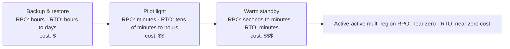
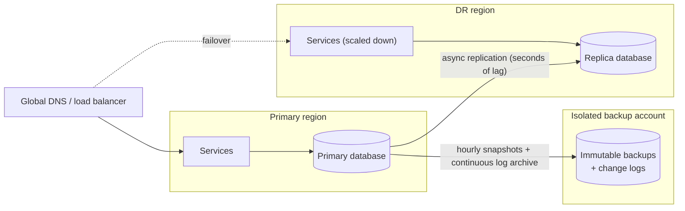

# Disaster Recovery Explained

*When a whole data center, region, or account is gone — how much data can you lose, how long can you be down, and have you actually practiced getting back?*

---

> *“Plans are worthless, but planning is everything.”*
>
> — **Dwight D. Eisenhower**, speech to the National Defense Executive Reserve Conference, 1957

## At a Glance

> **In one sentence:** Disaster recovery (DR) is the plan and the machinery to restore service after a large-scale failure — a lost region, a deleted account, ransomware, a corrupted database — chosen by two numbers, RPO (how much data you can lose) and RTO (how long you can be down), and proven only by regular recovery drills.

**You'll learn**

- What counts as a disaster, and why high availability isn't disaster recovery
- RPO and RTO, and how to choose them per system
- The four common DR strategies: backup & restore, pilot light, warm standby, active-active
- Replication vs. backups vs. isolated copies
- Failover and failback, DNS and data considerations
- How to run a DR drill

**Before you start:** [Backup, Recovery, and Durability](../04-Data-And-Storage/Backup-Recovery-and-Durability.md) · [Data Replication Strategies](../04-Data-And-Storage/Data-Replication-Strategies.md)

**Reading time:** about 15 minutes

---

## The Big Picture



*Faster recovery and less data loss cost more money and complexity. Each system should sit at the point its business needs — not further.*

---

## Introduction

In March 2021, a fire destroyed one data center building and damaged another at a cloud provider's campus in Strasbourg, France. Thousands of customers' servers went offline. Some recovered quickly from backups stored elsewhere. Others discovered that their backups had been stored **in the same building** — or not at all — and lost data permanently.

The technology in both groups was similar. The difference was a plan, made in advance, that assumed an entire site could disappear.

Disasters come in many forms: a fire or flood, a regional cloud outage, a deleted production account, a ransomware attack that encrypts everything reachable, a software bug that corrupts data and replicates the corruption everywhere. Disaster recovery is the discipline of making sure each of those is survivable — with known, acceptable losses.

### Why Should Engineers Care?

- Many teams believe replication or "the cloud" protects them. It protects against *some* failures and faithfully copies others.
- DR requirements shape architecture, cost, and team processes — they belong in design, not as an afterthought.
- Recovery that hasn't been practiced usually doesn't work the first time.

---

## The Problem It Solves

| Failure | High availability handles it? | Needs disaster recovery? |
|--------|------------------------------|-------------------------|
| One server dies | ✅ Redundant servers | — |
| One availability zone fails | ✅ Multi-zone deployment | — |
| A whole region fails | ❌ | ✅ |
| Data corrupted by a bug | ❌ Replication copies it | ✅ Point-in-time backups |
| Accidental deletion of a database or account | ❌ | ✅ Isolated backups |
| Ransomware | ❌ Encrypts reachable copies | ✅ Immutable, isolated backups |
| Provider-level outage or account lockout | ❌ | ✅ Copies outside that account or provider |

**High availability (HA)** keeps a service running through common, small failures, automatically. **Disaster recovery** restores service after large, rare failures, often with some loss and some manual steps.

---

## Historical Background

- **1970s–1980s — Mainframe DR.** Banks and governments kept backup tapes offsite and contracted "hot sites" — standby data centers ready to load their systems.
- **1990s — Formal business continuity planning** spread with regulation and the growth of online banking and trading.
- **2001 — September 11.** Financial firms in lower Manhattan that had geographically distant backup sites recovered far faster; regulators afterward pushed for greater geographic separation.
- **2005 — Hurricane Katrina** showed that regional disasters can take out primary and backup sites that are too close together, plus the people and supply chains needed to run them.
- **2010s — Cloud DR.** Cloud providers made second regions, cross-region replication, and infrastructure-as-code cheap enough for smaller organizations. Standard strategy names (backup & restore, pilot light, warm standby, multi-site) became common, for example in AWS's disaster recovery guidance.
- **2010s–2020s — Ransomware** turned "attackers delete or encrypt your backups" into a mainstream DR scenario, making immutable and isolated backups essential.

---

## Core Concepts

### RPO and RTO

```
                    disaster
                       │
   last good copy      ▼                      service restored
────────●──────────────✖──────────────────────────●─────────▶ time
        └──── RPO ─────┘└─────────── RTO ──────────┘
        data you lose     time you're down
```

- **RPO (Recovery Point Objective):** the maximum acceptable data loss, measured in time.
- **RTO (Recovery Time Objective):** the maximum acceptable time to restore service.

Set them **per system**, with the business: a payment ledger may need RPO ≈ 0; an analytics dashboard may accept a day.

### The Four Strategies

| Strategy | What runs in the DR location | Typical RPO | Typical RTO | Cost |
|---------|------------------------------|------------|------------|-----|
| **Backup & restore** | Nothing; backups stored there | Hours (backup frequency) | Hours to days | Lowest |
| **Pilot light** | Data replicated; core services minimal or off | Minutes | Tens of minutes to hours | Low–medium |
| **Warm standby** | A scaled-down but working copy | Seconds to minutes | Minutes | Medium–high |
| **Active-active** | Full capacity serving live traffic | Near zero | Near zero | Highest |

### Replication vs. Backup vs. Isolation

- **Replication** gives low RPO against site loss, but copies mistakes and corruption instantly.
- **Point-in-time backups** let you go back to before a bad change.
- **Isolated, immutable copies** (separate account, different credentials, write-once storage, sometimes a different provider) survive attackers and admin mistakes.

A solid DR design usually has all three.

### Failover and Failback

- **Failover:** switching production to the DR location. Involves promoting databases, scaling up services, and shifting traffic (DNS, global load balancers, anycast).
- **Failback:** returning to the original location after it's repaired — often harder than failover, because data written during the disaster must be synchronized back.

### Dependencies Count Too

A service in the DR region is useless if it depends on things still in the failed region: identity, secrets, configuration, container registries, DNS control plane, CI/CD, monitoring, or even the runbook stored on a wiki in the failed region.

---

## Real-World Analogy

### A Family Emergency Plan

A prepared family keeps copies of important documents in a safe place away from home (offsite backups), agrees on where to meet if the house is unusable (DR site), knows who calls whom (communication plan), and practices a fire drill occasionally (DR testing). They accept that some things in the house could be lost (RPO) and that it may take a while to be comfortable again (RTO). What they don't do is keep the only copy of their passports in a drawer next to the stove.

---

## How It Works In Practice

### Step 1: Classify Systems

| Tier | Examples | RPO | RTO | Strategy |
|-----|---------|-----|-----|---------|
| Tier 0 | Payments, authentication | ≈ 0 | Minutes | Active-active or warm standby with synchronous or near-synchronous replication |
| Tier 1 | Core product APIs | Minutes | < 1 hour | Warm standby |
| Tier 2 | Internal tools, reporting | Hours | < 1 day | Pilot light or backup & restore |
| Tier 3 | Batch analytics, archives | 1 day | Days | Backup & restore |

### Step 2: Design the Data Path



### Step 3: Write the Runbook

A DR runbook states, step by step: who can declare a disaster, how to promote the replica, how to scale up services, how to switch traffic, how to verify correctness, how to communicate with customers, and how to fail back. It must be accessible **without** the failed region.

### Step 4: Drill

| Drill type | What it proves |
|-----------|---------------|
| Tabletop exercise | People know roles and steps (no systems touched) |
| Restore test | Backups can actually be restored, and how long it takes |
| Component failover | One database or service can move to the DR site |
| Full region failover | The whole product can run from the DR region |
| Surprise drill | Response works without advance preparation |

Measure real RPO and RTO in each drill and compare them to targets.

---

## Production Engineering Perspective

- **Infrastructure as code** makes DR environments reproducible. A DR region built by hand drifts from production and fails when needed.
- **Keep DR capacity honest.** A warm standby with 10% capacity needs a tested plan (and cloud capacity) to scale to 100% quickly — capacity may be scarce during a regional event when everyone fails over at once.
- **Data consistency on failover:** asynchronous replication means the replica may be missing the last seconds of writes. Decide in advance how to reconcile them (for payments, check with providers; for user content, accept or recover from logs).
- **Avoid split-brain:** when the old primary comes back, it must not accept writes. Fence it before promoting the replica.
- **Regulation and contracts** may specify RPO/RTO, data residency (where DR copies may live), and testing frequency.

---

## Tradeoffs

| Decision | Benefit | Cost |
|---------|--------|-----|
| Lower RPO | Less data loss | Synchronous replication latency, cost |
| Lower RTO | Less downtime | Standing capacity, automation investment |
| Active-active | Near-zero RPO and RTO; capacity always verified | Complex data consistency, highest cost |
| Backup & restore | Cheap, simple | Long outages; large data loss window |
| Automated failover | Speed | Risk of false failovers and split-brain |
| Manual failover | Human judgment | Slower; depends on people being available |

---

## Common Mistakes

### Beginner Mistakes

- Treating replication as a backup.
- Storing backups in the same region, account, or building as production.
- Never testing a restore.

### Intermediate Mistakes

- DR region missing dependencies (secrets, identity, images, DNS access).
- Runbooks stored only in systems that would be down in a disaster.
- One set of credentials that can delete production *and* backups.

### Senior-Level Mistakes

- The same RPO/RTO for every system — overspending on some, underprotecting others.
- Never practicing failback.
- Assuming cloud capacity will be available in the DR region during a large regional outage.

---

## Failure Scenarios

### Scenario 1: The Backups in the Same Building

A site is destroyed by fire; backups were stored on a server in the same facility. Data is permanently lost.

**Mitigation:** the 3-2-1 rule with at least one offsite copy, plus an immutable copy.

### Scenario 2: The Replicated Corruption

A bad migration corrupts a table. Replication faithfully copies the corruption to the DR region within seconds. Failover doesn't help.

**Mitigation:** point-in-time recovery from backups and change logs to just before the migration.

### Scenario 3: Ransomware Reaches the Backups

Attackers gain administrator credentials and delete or encrypt backups before encrypting production.

**Mitigation:** immutable (write-once) backups, a separate backup account with separate credentials, and monitoring of backup deletions.

### Scenario 4: The Failover That Couldn't Start

During a regional outage, the DR region's services can't start because they pull container images from a registry in the failed region.

**Mitigation:** replicate all dependencies; test full failover, not just the database.

---

## Real-World Industry Examples

- **The 2021 Strasbourg data center fire** at OVHcloud showed the difference between customers with offsite backups and those without.
- **Cloud providers publish DR guidance** describing backup & restore, pilot light, warm standby, and multi-site active-active strategies.
- **Netflix** regularly evacuates AWS regions to prove multi-region resilience (see [How Netflix Builds Resilient Systems](How-Netflix-Builds-Resilient-Systems.md)).
- **Google's DiRT program** tests disaster scenarios across systems and people (see [How Google Handles Failures](How-Google-Handles-Failures.md)).
- **GitLab's 2017 incident** (accidental deletion during a database emergency) became a widely studied example of backups that weren't working as expected; GitLab published a detailed, transparent postmortem.

---

## Interview Questions

### Beginner

**Q1: What are RPO and RTO?**

*Model answer:* RPO is the maximum acceptable data loss measured in time — how far back you might have to go. RTO is the maximum acceptable downtime — how long until service is restored. Both are set per system based on business needs.

### Intermediate

**Q2: Why isn't database replication enough for disaster recovery?**

*Model answer:* Replication protects against losing a site but copies logical problems — accidental deletes, bad migrations, corruption, ransomware — to the replica almost instantly. You also need point-in-time backups and isolated, immutable copies.

**Q3: Compare pilot light and warm standby.**

*Model answer:* Pilot light keeps data replicated to the DR site with minimal or no running services, which must be started and scaled during a disaster — cheaper, slower. Warm standby runs a scaled-down but working copy of the whole stack that only needs scaling up and traffic switching — more expensive, faster recovery.

### Senior

**Q4: How would you prevent split-brain during a regional failover?**

*Model answer:* Ensure only one primary can accept writes: fence the old primary (revoke its write access, shut it down, or use a consensus-based leadership system with fencing tokens) before promoting the replica. Make traffic switching and database promotion part of one controlled procedure, and have a clear rule for when the old region comes back.

### Architecture / Leadership

**Q5: How would you build a DR program for a company that has never tested recovery?**

*Model answer:* Inventory systems and classify them into tiers with business-agreed RPO/RTO. Fix obvious gaps first: offsite, immutable backups and restore tests. Write runbooks stored outside production. Start with tabletop exercises and restore tests, then component failovers, then a full region failover. Measure actual RPO/RTO each time, track gaps as engineering work, and make drills a recurring, scheduled practice.

---

## Hands-On Lab

Simulate a region failure and measure the data you'd lose (RPO) with different DR strategies, plus rough recovery times (RTO). Pure Python; save as `dr_lab.py` and run it.

```python
import random
random.seed(8)

writes = sorted(random.uniform(0, 86_400) for _ in range(200_000))   # one day of writes (seconds)
disaster_at = 50_000.0                                               # region fails here

def lost_writes(last_safe_time):
    return sum(1 for w in writes if last_safe_time < w <= disaster_at)

strategies = {
    # name: (seconds of data at risk, typical recovery time)
    "nightly backup (backup & restore)":        (disaster_at % 86_400, "hours to days"),
    "hourly snapshots copied offsite":           (disaster_at % 3_600, "hours"),
    "async replication, 5 s lag (pilot light / warm standby)": (5, "minutes to ~1 hour"),
    "sync replication (active-active)":         (0, "seconds"),
}

print(f"disaster at t={disaster_at:.0f}s; writes so far: {sum(1 for w in writes if w <= disaster_at):,}\n")
for name, (at_risk_seconds, rto) in strategies.items():
    lost = lost_writes(disaster_at - at_risk_seconds)
    print(f"{name:58} RPO ~ {at_risk_seconds:>6.0f} s   lost writes: {lost:>7,}   RTO: {rto}")
```

**What to notice**
- The nightly backup loses everything since midnight; hourly snapshots lose up to an hour; asynchronous replication loses only the few seconds of lag; synchronous replication loses nothing (at a latency cost on every write).
- Now add a *logical* disaster: a bad migration at `t=49,000` corrupts data, and replication copies it within seconds. Which strategies let you recover the good data? (Only those with point-in-time copies from *before* 49,000 — replication alone doesn't.)
- Ask the business which row of this table it's willing to pay for, per system.

---

## Test Yourself

*Answer each question in your head or on paper first, then open the answer to check.*

<details markdown="1">
<summary><strong>1. What's the difference between high availability and disaster recovery?</strong></summary>

High availability keeps a service running through common, small failures automatically. Disaster recovery restores service after large, rare failures such as losing a region or data corruption, often with some loss and manual steps.

</details>

<details markdown="1">
<summary><strong>2. Which DR strategy has the lowest cost and the longest recovery?</strong></summary>

Backup & restore.

</details>

<details markdown="1">
<summary><strong>3. Why do you need immutable, isolated backups?</strong></summary>

So that attackers, compromised credentials, or admin mistakes can't delete or encrypt every copy of your data.

</details>

<details markdown="1">
<summary><strong>4. What is failback, and why is it hard?</strong></summary>

Returning production to the original site after a failover. Data written in the DR site during the disaster must be synchronized back, and the switch must avoid a second outage.

</details>

<details markdown="1">
<summary><strong>5. Why can asynchronous replication lose data during failover?</strong></summary>

The replica lags slightly behind the primary; writes acknowledged by the primary but not yet copied are lost if the primary's region fails.

</details>

<details markdown="1">
<summary><strong>6. Name three dependencies often forgotten in DR plans.</strong></summary>

Any three of: identity/authentication, secrets and keys, container registries, configuration stores, DNS control, CI/CD, monitoring, runbooks and documentation.

</details>

<details markdown="1">
<summary><strong>7. What does a DR drill measure?</strong></summary>

Whether recovery actually works, and the real RPO and RTO achieved compared with the targets — plus gaps in runbooks, tools, and people's readiness.

</details>

---

## Cheat Sheet

| Strategy | RPO | RTO | Cost |
|---------|----|----|-----|
| Backup & restore | Hours | Hours–days | $ |
| Pilot light | Minutes | Tens of minutes–hours | $$ |
| Warm standby | Seconds–minutes | Minutes | $$$ |
| Active-active | ≈ 0 | ≈ 0 | $$$$ |

**Protect against everything:** replication (site loss) + point-in-time backups (corruption, mistakes) + immutable isolated copies (attackers, account loss).

**DR plan checklist:** tiers with RPO/RTO · data path · dependency inventory · runbook stored outside production · failover and failback steps · split-brain prevention · communication plan · drill schedule.

**3-2-1-1:** 3 copies · 2 media · 1 offsite · 1 immutable/offline.

---

## In the AI Era

- **AI features have their own DR questions.** If your model provider or region is unavailable, what happens? Plan a secondary provider or a non-AI fallback — and include model access in DR drills.
- **AI data is part of your data.** Vector indexes, evaluation datasets, prompt versions, and fine-tuning data need backup and restore plans. Indexes can be rebuilt from source — but only if you know the embedding model and chunking settings and have time to re-embed everything.
- **Agents increase the "accidental deletion" risk.** Automated tools with delete permissions make immutable backups and point-in-time recovery more important, not less.
- **AI can help in recovery** — summarizing runbooks, checking steps, correlating signals — but DR procedures must remain executable by humans without AI tools, which may themselves be unavailable.

**Try it:** Extend the lab with a vector index that takes 6 hours to rebuild from source documents. What RTO does your AI search feature really have after a disaster, and how could you shorten it?

---

## Key Takeaways

1. High availability handles small failures; disaster recovery handles site loss, corruption, and attacks.
2. RPO (data loss) and RTO (downtime) drive the strategy — set them per system with the business.
3. The four strategies trade cost for speed: backup & restore, pilot light, warm standby, active-active.
4. Replication isn't backup; you need point-in-time and immutable, isolated copies too.
5. DR plans must include all dependencies and be executable when the primary region is gone.
6. Only regular drills turn a DR plan into a DR capability.

---

## What to Read Next

- **[Observability: Monitoring, Alerting, and Debugging](Observability-Monitoring-Alerting-And-Debugging.md)** — knowing quickly that a disaster is happening
- **[Backup, Recovery, and Durability](../04-Data-And-Storage/Backup-Recovery-and-Durability.md)** — backup mechanics in depth
- **[CAP Theorem Explained](../05-Distributed-Systems/CAP-Theorem-Explained.md)** — the consistency trade-offs behind multi-region designs

---

## Further Reading

- **AWS Well-Architected — "Disaster Recovery of Workloads on AWS: Recovery in the Cloud" (whitepaper):** [https://docs.aws.amazon.com/whitepapers/latest/disaster-recovery-workloads-on-aws/](https://docs.aws.amazon.com/whitepapers/latest/disaster-recovery-workloads-on-aws/)
- **Google Cloud — Disaster recovery planning guide:** [https://cloud.google.com/architecture/dr-scenarios-planning-guide](https://cloud.google.com/architecture/dr-scenarios-planning-guide)
- **Kripa Krishnan — "Weathering the Unexpected" (ACM Queue, 2012)**
- **GitLab — "Postmortem of database outage of January 31" (2017):** [https://about.gitlab.com/blog/postmortem-of-database-outage-of-january-31/](https://about.gitlab.com/blog/postmortem-of-database-outage-of-january-31/)
- **NIST SP 800-34 — Contingency Planning Guide for Federal Information Systems**

---

*This chapter is part of the Modern Software Engineering Handbook — a comprehensive guide to the concepts, principles, and practices that every professional software engineer should know.*
