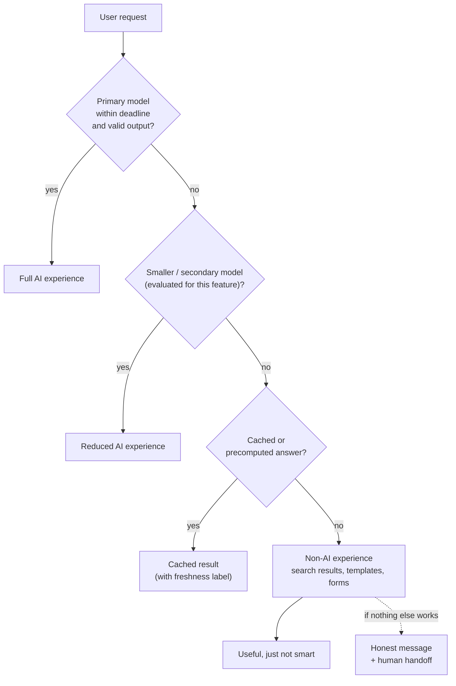

# Graceful Degradation for AI Features

*Models are slow, rate-limited, sometimes down, and sometimes wrong. Design AI features so users still get something useful when any of that happens.*

---

> *“Simplicity is prerequisite for reliability.”*
>
> — **Edsger W. Dijkstra**, "How do we tell truths that might hurt?" (EWD 498), 1975

## At a Glance

> **In one sentence:** AI features degrade gracefully when every model call has a deadline, a validated output, and a ladder of fallbacks — a cheaper model, a cached or precomputed answer, a non-AI experience, and finally an honest message — so that provider outages, rate limits, slow responses, and bad outputs never break the core product.

**You'll learn**

- How AI dependencies fail differently from ordinary services
- The degradation ladder: full → reduced → cached → non-AI → honest failure
- Latency budgets, deadlines, and streaming for slow models
- Output validation as a reliability mechanism
- Protecting the core product from optional AI features
- Testing degradation with failure injection

**Before you start:** [How Netflix Builds Resilient Systems](How-Netflix-Builds-Resilient-Systems.md) · [How LLMs Actually Work](../15-AI-Era-Engineering/How-LLMs-Actually-Work.md) · [Designing An AI Gateway](../06-System-Design/Designing-An-AI-Gateway.md)

**Reading time:** about 15 minutes

---

## The Big Picture



*Every rung is a real, tested product experience — not an afterthought.*

---

## Introduction

A travel company adds an AI assistant that turns a vague request ("somewhere warm in March, not too expensive") into three itinerary suggestions. It's a hit. Then the model provider has a rough afternoon: responses take 40 seconds, then return rate-limit errors. The assistant shows a spinner forever. Users can't reach the ordinary search box because the new AI panel replaced it on the home page. Bookings drop sharply for four hours.

The model outage lasted four hours. The *product* outage lasted four hours too — and it didn't need to. The search engine, the booking system, and the payment system were all fine. A good design would have given users a simpler experience — search results for "warm destinations in March," perhaps with cached suggestions — within seconds.

This chapter applies the reliability patterns of the previous chapters to AI features, and adds the ones AI specifically needs.

### Why Should Engineers Care?

- AI features are becoming central to products, and their dependencies are among the least predictable in the stack.
- Many AI failures are **silent**: a response arrives on time with HTTP 200 — and it's wrong, truncated, or malformed.
- Users forgive "the smart feature is temporarily limited." They don't forgive "the app doesn't work."

---

## The Problem It Solves

AI dependencies fail in more ways than typical services:

| Failure mode | Looks like |
|-------------|-----------|
| Provider outage | Connection errors, 5xx responses |
| Rate limits and quota exhaustion | HTTP 429, sometimes for minutes or hours |
| Extreme latency | Seconds to minutes under load or with long outputs |
| Capacity shortfalls | "Overloaded" errors at peak times |
| Truncated output | Output cut off at the token limit — broken JSON, half answers |
| Invalid output | Wrong format, missing fields, hallucinated values |
| Quality regression | A model or prompt update subtly makes answers worse |
| Safety refusals | The model declines a legitimate request |
| Cost limits | Budget exhausted mid-month |

The first four resemble classic dependency failures. The rest are **success-shaped failures** that ordinary retries and circuit breakers don't catch.

---

## Historical Background

- **1990s–2000s — Graceful degradation on the web.** Progressive enhancement taught web developers to build a basic experience that works everywhere and enhance it when capabilities are available — the same philosophy applied here.
- **2010s — Resilience patterns.** Circuit breakers, bulkheads, and fallbacks became standard for microservices (see [How Netflix Builds Resilient Systems](How-Netflix-Builds-Resilient-Systems.md)).
- **2010s — ML in production.** Recommendation and ranking systems commonly fell back to popularity-based or rule-based results when models were unavailable — an early version of the degradation ladder.
- **2022 onward — LLM features.** Hosted model APIs introduced long latencies, token-based rate limits, and non-deterministic outputs, making explicit degradation design a necessity. Teams increasingly place AI calls behind gateways with fallbacks and budgets.

---

## Core Concepts

### The Degradation Ladder

1. **Full experience:** the best model, full context, all features.
2. **Reduced experience:** a smaller or secondary model, shorter context, fewer tool calls — only models that pass this feature's evaluations.
3. **Cached or precomputed:** answers computed earlier for common requests (popular questions, nightly summaries), clearly labeled with their age.
4. **Non-AI experience:** the product without the AI layer — keyword search, filters, templates, standard forms.
5. **Honest failure:** a clear message, with a path forward (retry later, contact support, human handoff).

### Deadlines, Not Just Timeouts

Give each user request a total **deadline** (say, 8 seconds for an interactive answer) and allocate it across attempts. If the primary model hasn't started responding within 3 seconds, there's still time to try a fallback — but only if you decided that in advance.

### Streaming as Degradation

Streaming the first tokens quickly makes slow generations feel responsive. Measure and budget **time to first token** separately from total time. But once you've streamed text to the user, switching models mid-answer is no longer possible — so the fallback decision must happen before streaming begins.

### Validation as Reliability

Treat invalid output like a failed request:

- **Structure:** parse and validate against a schema; check for truncation.
- **Content checks:** required fields present, values within allowed ranges, citations pointing to real sources.
- **On failure:** retry once (perhaps with the error message), then move down the ladder.

### Protect the Core Product

The AI feature must be **optional to the critical path**. The booking button, the search box, and the checkout flow must not depend on a model call. Render the core experience first; enhance it with AI when the AI responds in time.

### Budgets and Kill Switches

- **Per-feature cost and token budgets** prevent runaway spend.
- **Kill switches** (feature flags) let operators turn an AI feature down to a lower rung instantly — during a provider incident, a quality regression, or a cost spike.

---

## Real-World Analogy

### A Restaurant When the Head Chef Is Out

When the head chef is sick, a good restaurant doesn't close. The sous-chef cooks a shorter menu (smaller model). Some dishes were prepared in advance and are served as-is (cached answers). The bar still serves drinks and simple snacks (non-AI experience). And if the kitchen truly can't cope, the host tells arriving guests honestly and offers a reservation for tomorrow (honest failure). Nobody finds the doors locked.

---

## How It Works In Practice

### Designing the Ladder for Three Features

| Feature | Full | Reduced | Cached / precomputed | Non-AI |
|--------|-----|--------|---------------------|-------|
| Support assistant | Large model + retrieval + tools | Small model + retrieval, no tools | Answers to top 500 questions | Search help-center articles; contact form |
| Ticket summarization | Large model | Small model | Nightly summaries | Show the first and last messages |
| Product description generator | Large model | Small model with a template | Previously generated copy | Structured fields shown as a list |

### Implementing Deadlines and Fallbacks

```
deadline = now + 8 s

try primary model (timeout: min(4 s, remaining), must start streaming within 2 s)
  → validate → return
on timeout / 429 / 5xx / invalid:
  if remaining > 2 s: try secondary model (timeout: remaining − 0.5 s) → validate → return
  if cached answer exists: return it (with "last updated" label)
  return non-AI experience
```

Record which rung served each request — it's the key reliability metric for the feature.

### What to Monitor

| Metric | Why |
|-------|----|
| Share of requests served per rung | Degradation is visible, not silent |
| Time to first token, total latency (p50/p95/p99) | User experience |
| Validation failure rate | Silent quality failures |
| 429 and error rates per provider/model | Dependency health |
| Tokens and cost per request, per feature | Budget |
| User feedback and task success per rung | Whether fallbacks are actually useful |

### Testing Degradation

Inject each failure mode in staging and, carefully, in production: provider errors, 429s, 30-second latency, truncated responses, malformed JSON, and budget exhaustion. Verify that each lands on the intended rung within the deadline. Run these tests after every change to prompts, models, or providers.

---

## Production Engineering Perspective

- **Evaluate fallbacks too.** A secondary model is only a safe fallback if it passes the feature's evaluation suite. Otherwise a "working" fallback may be quietly worse than the non-AI experience.
- **Precompute where you can.** Frequently asked questions, daily summaries, and embeddings can be generated in batch during off-peak hours, giving you a cheap, reliable cached rung.
- **Communicate degradation in the UI.** "Suggestions are simplified right now" builds more trust than silently worse results.
- **Put AI calls behind a gateway** so fallbacks, quotas, and circuit breakers are consistent across features (see [Designing An AI Gateway](../06-System-Design/Designing-An-AI-Gateway.md)).
- **Plan for success, too.** A viral AI feature can exhaust quotas; per-user limits and queueing for non-interactive work keep it from failing for everyone.

---

## Tradeoffs

| Decision | Benefit | Cost |
|---------|--------|-----|
| Longer deadline | More requests get the full experience | Slower worst case; worse UX during incidents |
| Automatic model fallback | Higher availability | Possible quality drop; must be evaluated |
| Cached answers | Fast, cheap, reliable | Staleness; limited to common requests |
| Non-AI fallback | Always works | Less capable; must be maintained |
| Strict output validation | Catches silent failures | More fallbacks triggered; false rejections |
| AI on the critical path | Richer core experience | Core availability tied to model availability |

---

## Common Mistakes

### Beginner Mistakes

- No timeout on model calls (a spinner forever).
- Trusting any HTTP 200 response as a success.
- Replacing a working non-AI feature (like search) with an AI-only one.

### Intermediate Mistakes

- Falling back to a model that was never evaluated for the feature.
- Retrying after streaming has started, producing garbled answers.
- Fallback paths that exist in code but have never been exercised.

### Senior-Level Mistakes

- Putting a model call on the critical path of checkout, login, or booking.
- No per-rung metrics, so the team doesn't notice that half of users have been on the fallback for a week.
- No cost budget or kill switch, so a traffic spike or loop becomes a financial incident.

---

## Failure Scenarios

### Scenario 1: The Infinite Spinner

The model provider slows to 60-second responses. The UI waits indefinitely; users leave.

**Mitigation:** deadlines, time-to-first-token limits, and the non-AI rung within a few seconds.

### Scenario 2: The Truncated JSON

A long input causes the model to hit its output limit mid-JSON. Parsing fails; the feature errors for exactly the most complex (and often most valuable) requests.

**Mitigation:** check stop reasons, raise output limits deliberately, split large tasks, validate and fall back.

### Scenario 3: The Quiet Quality Regression

A provider-side model update subtly changes behavior. No errors; the feature just gets worse, and user satisfaction drops over weeks.

**Mitigation:** pinned model versions, quality SLIs from automated checks and user feedback, and evaluation runs before accepting changes.

### Scenario 4: The Month-End Budget Wall

A popular new feature consumes the monthly AI budget by the 20th. Without a plan, every AI feature stops.

**Mitigation:** per-feature budgets, alerts at thresholds, automatic step-down to cheaper rungs, and prioritization of critical AI features.

---

## Real-World Industry Examples

- **Search and recommendation systems** have long fallen back to popularity or rule-based results when models are unavailable.
- **Major AI providers publish status pages** and rate-limit documentation, a reminder that outages and throttling are normal operating conditions to design for.
- **AI gateway products and open-source proxies** provide model fallbacks, retries, and budgets as standard features.
- **Many products display AI features as optional panels or suggestions** alongside the traditional interface, so the core product keeps working without them.

---

## Interview Questions

### Beginner

**Q1: Why shouldn't an AI feature be the only way to do something important?**

*Model answer:* Model calls can fail, be slow, be rate-limited, or return bad output. If a core action depends only on the AI feature, those failures become product outages. Keeping a non-AI path means users can always complete the task.

### Intermediate

**Q2: How do you handle a model response that arrives on time but is malformed?**

*Model answer:* Treat it as a failure: validate the output against a schema and business rules, check whether it was truncated, retry once if there's time (possibly including the validation error), and otherwise fall back to the next rung — a secondary model, cached answer, or non-AI experience.

**Q3: Why use a deadline rather than a fixed timeout per call?**

*Model answer:* A deadline bounds the total time a user waits across all attempts. It lets you decide how much time remains for fallbacks and prevents retries from stacking up into long waits.

### Senior

**Q4: How would you know whether your fallbacks are actually good?**

*Model answer:* Run each fallback through the feature's evaluation suite, track user task success and feedback per rung in production, and deliberately exercise fallbacks with failure injection. If a fallback performs worse than the non-AI experience, remove it from the ladder.

### Architecture / Leadership

**Q5: How would you set reliability requirements for a new AI feature?**

*Model answer:* Decide whether the feature is on the critical path (ideally not). Define SLOs for availability, latency (including time to first token), and quality. Design and evaluate the degradation ladder, set per-feature cost budgets and kill switches, route calls through a shared gateway, and require failure-injection tests before launch and after model or prompt changes.

---

## Hands-On Lab

Implement a degradation ladder with a total deadline, output validation, and per-rung metrics. Pure Python; save as `degradation_lab.py` and run it.

```python
import json, random, time
from collections import Counter
random.seed(5)

class ProviderError(Exception): pass

def fake_model(name, state, remaining):
    """Simulates a model call; `state` controls how the provider behaves right now."""
    if state == "down":      raise ProviderError(f"{name}: 503")
    if state == "limited":   raise ProviderError(f"{name}: 429")
    if state == "slow":                                               # would take far too long:
        time.sleep(remaining)                                         # we wait until the deadline,
        raise ProviderError(f"{name}: cancelled at deadline")         # then cancel the request
    if state == "truncated": return '{"suggestions": ["Goa", "Kera'   # cut off mid-JSON
    return json.dumps({"suggestions": ["Goa", "Kerala", "Andaman"]})

def call_with_deadline(name, state, remaining):
    text = fake_model(name, state, remaining)
    data = json.loads(text)                                           # raises if malformed
    assert isinstance(data.get("suggestions"), list) and data["suggestions"]
    return data["suggestions"]

CACHE = {"warm places in march": ["Goa", "Pondicherry"]}

def suggest(query, primary_state, secondary_state, deadline_s=0.05):
    end = time.perf_counter() + deadline_s
    for name, state in [("large-model", primary_state), ("small-model", secondary_state)]:
        remaining = end - time.perf_counter()
        if remaining <= 0.005:
            break
        try:
            return name, call_with_deadline(name, state, remaining)
        except (ProviderError, ValueError, AssertionError):
            continue                                                  # next rung
    if query in CACHE:
        return "cache", CACHE[query]
    return "non-AI search", ["Search results for: " + query]

served = Counter()
scenarios = ["ok", "slow", "down", "limited", "truncated"]
for i in range(200):
    primary = random.choices(scenarios, weights=[70, 10, 8, 7, 5])[0]
    secondary = random.choices(scenarios, weights=[85, 5, 5, 3, 2])[0]
    query = random.choice(["warm places in march", "cheap beach trip", "hill station weekend"])
    rung, _ = suggest(query, primary, secondary)
    served[rung] += 1

for rung, n in served.most_common():
    print(f"{rung:14} {n:4} requests ({n / 2:.0f}%)")
print("every request got an answer:", sum(served.values()) == 200)
```

**What to notice**
- Every request is served — most by the large model, some by the small model, a few from cache or plain search — and none shows an error or an endless spinner.
- Truncated JSON is caught by validation and handled exactly like an outage.
- The per-rung counts are the metric you'd put on a dashboard: if "small-model" or "non-AI search" climbs, something is wrong even though no errors are visible.
- Try making the primary provider fully `"down"` and the secondary `"slow"`: everything lands on cache or search, and no request waits much longer than its 50 ms deadline. Then remove the cache and search fallbacks and see what your users would have experienced.

---

## Test Yourself

*Answer each question in your head or on paper first, then open the answer to check.*

<details markdown="1">
<summary><strong>1. What are the rungs of the degradation ladder?</strong></summary>

Full AI experience → reduced (smaller or secondary model) → cached or precomputed answer → non-AI experience → honest failure with a path forward.

</details>

<details markdown="1">
<summary><strong>2. What is a "success-shaped failure"?</strong></summary>

A response that arrives on time with a success status but is wrong, truncated, malformed, or low quality. Only validation and quality checks catch it.

</details>

<details markdown="1">
<summary><strong>3. Why must the fallback decision happen before streaming starts?</strong></summary>

Once text from one model has been shown to the user, switching to another model mid-answer produces a garbled or inconsistent response.

</details>

<details markdown="1">
<summary><strong>4. When is a secondary model a safe fallback?</strong></summary>

Only when it has passed the same feature's evaluation suite. Otherwise it may silently deliver worse results than the non-AI experience.

</details>

<details markdown="1">
<summary><strong>5. What metric reveals silent degradation?</strong></summary>

The share of requests served by each rung (plus validation-failure rates and quality signals per rung).

</details>

<details markdown="1">
<summary><strong>6. What is a kill switch for an AI feature?</strong></summary>

A feature flag that lets operators instantly move the feature to a lower rung or turn it off during provider incidents, quality regressions, or cost spikes.

</details>

<details markdown="1">
<summary><strong>7. Why keep AI off the critical path?</strong></summary>

So that model outages, rate limits, or bad outputs never prevent users from completing core tasks like login, checkout, or booking.

</details>

---

## Cheat Sheet

**Ladder:** full → reduced model → cached/precomputed → non-AI → honest failure + human handoff.

| Failure | Detect with | Respond with |
|--------|------------|-------------|
| Outage / 5xx | Errors, circuit breaker | Next rung |
| Rate limit / 429 | Status code, `Retry-After` | Next rung; queue non-interactive work |
| Slow response | Deadline, time-to-first-token limit | Next rung before streaming starts |
| Truncation | Stop reason, parse failure | Retry once or next rung |
| Invalid output | Schema and business-rule validation | Retry once or next rung |
| Quality regression | Quality SLIs, evals, feedback | Pin versions; roll back; kill switch |
| Budget exhausted | Cost metrics and alerts | Step down to cheaper rungs |

**Rules:** deadlines over timeouts · validate every output · evaluate every fallback · keep AI off the critical path · measure served-by-rung · test degradation regularly.

---

## In the AI Era

This whole chapter belongs to the AI era, and it shows the handbook's central idea: the new problems are old problems in new clothes. Timeouts, circuit breakers, bulkheads, and fallbacks come from [distributed systems](../05-Distributed-Systems/Why-Distributed-Systems-Are-Hard.md) and [Netflix-style resilience](How-Netflix-Builds-Resilient-Systems.md). What's new is the need to treat **correctness** as a runtime signal: validating outputs, measuring quality per rung, and deciding when a less capable answer is better than a confidently wrong one.

**Agents raise the stakes.** For multi-step agents, degradation also means *reducing autonomy*: when models or tools are unreliable, switch from "act automatically" to "propose and wait for approval," or hand off to a human.

**Try it:** For one AI feature you use or build, write its degradation ladder in a table like the one in this chapter. Which rung doesn't exist yet?

---

## Key Takeaways

1. AI dependencies fail loudly (outages, 429s, latency) and silently (truncation, invalid or low-quality output).
2. Design a degradation ladder where every rung is a real, tested experience.
3. Use a total deadline and decide on fallbacks before streaming begins.
4. Validate every output; treat invalid output like a failed call.
5. Only evaluated models belong in fallback chains.
6. Keep AI off the critical path, and give every AI feature budgets and a kill switch.
7. Measure which rung served each request — it's how degradation becomes visible.

---

## What to Read Next

- **[Designing An AI Gateway](../06-System-Design/Designing-An-AI-Gateway.md)** — centralizing fallbacks, quotas, and circuit breakers
- **[Evaluating AI Systems](../15-AI-Era-Engineering/Evaluating-AI-Systems.md)** — measuring quality for each rung
- **[How Netflix Builds Resilient Systems](How-Netflix-Builds-Resilient-Systems.md)** — the resilience patterns this chapter builds on

---

## Further Reading

- **Michael Nygard — "Release It!" (2nd edition, 2018)** — stability patterns applicable to any dependency
- **Google SRE Book — "Handling Overload" and "Addressing Cascading Failures":** [https://sre.google/sre-book/table-of-contents/](https://sre.google/sre-book/table-of-contents/)
- **Marc Brooker — "Timeouts, retries, and backoff with jitter"** (Amazon Builders' Library): [https://aws.amazon.com/builders-library/](https://aws.amazon.com/builders-library/)
- **Your model provider's documentation** on rate limits, error codes, stop reasons, and status pages
- **"Building Effective Agents"** — Anthropic engineering blog: [https://www.anthropic.com/engineering/building-effective-agents](https://www.anthropic.com/engineering/building-effective-agents)

---

*This chapter is part of the Modern Software Engineering Handbook — a comprehensive guide to the concepts, principles, and practices that every professional software engineer should know.*
