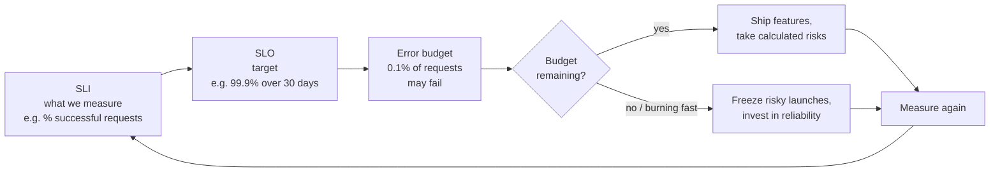
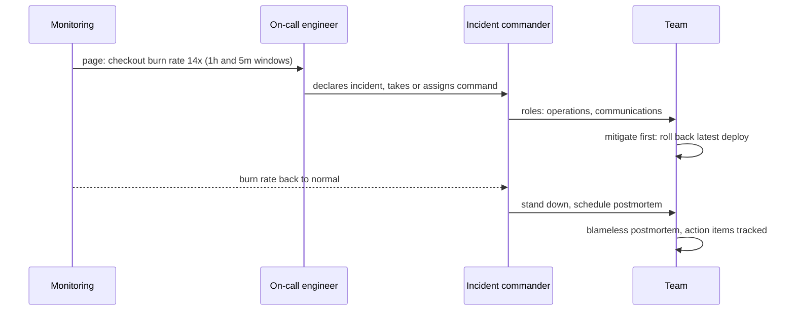

# How Google Handles Failures

*Site Reliability Engineering: treat reliability as a measurable feature, spend it deliberately, and learn from every failure.*

---

> *“SRE is what happens when you ask a software engineer to design an operations team.”*
>
> — **Benjamin Treynor Sloss**, founder of Google's Site Reliability Engineering team, in *Site Reliability Engineering*, 2016

## At a Glance

> **In one sentence:** Google's Site Reliability Engineering practice defines reliability with SLIs and SLOs, turns the allowed unreliability into an error budget that balances shipping speed against stability, alerts on how fast that budget burns, limits manual toil, and learns from incidents through blameless postmortems and regular disaster testing.

**You'll learn**

- What SRE is and why Google created it
- SLIs, SLOs, and SLAs — and how to choose good ones
- Error budgets and how they settle the "ship fast vs. stay stable" argument
- Alerting on burn rate instead of on causes
- Toil, on-call health, and automation
- Blameless postmortems and disaster recovery testing

**Before you start:** [Why Systems Go Down](Why-Systems-Go-Down.md)

**Reading time:** about 15 minutes

---

## The Big Picture



*The error budget turns reliability from an argument into a number both developers and operators agree on.*

---

## Introduction

In most companies, developers and operations teams want opposite things. Developers are rewarded for shipping features quickly. Operators are rewarded for stability — and every change is a risk to stability. The result is a slow, political tug-of-war: launch reviews, change freezes, and blame after every outage.

Around 2003, Google tried something different. Instead of hiring a traditional operations team, it asked software engineers to run production — and to solve operational problems with software. It also made a key conceptual move: **100% reliability is the wrong target.** Users can't tell the difference between 99.99% and 100% because their own Wi-Fi, phone, and ISP fail more often than that. Every extra "nine" costs much more and slows development. So choose the reliability users actually need, measure it precisely, and treat the remaining gap as a **budget** to spend on innovation.

That approach — Site Reliability Engineering — spread far beyond Google after its 2016 book, and its vocabulary (SLO, error budget, toil, blameless postmortem) is now standard across the industry.

### Why Should Engineers Care?

- SLOs and error budgets give teams an objective way to decide when to ship and when to slow down.
- Symptom-based alerting reduces pager noise and catches what users actually feel.
- These practices scale down: a two-person startup can define an SLO in an afternoon.

---

## The Problem It Solves

| Without SRE practices | With SRE practices |
|----------------------|-------------------|
| "Reliability" is an opinion | Reliability is a measured SLO |
| Endless arguments about launch risk | The error budget decides |
| Alerts on every CPU spike | Alerts when users are (or will be) affected |
| Operations work grows with the system | Toil is capped and automated away |
| Outages end in blame | Outages end in postmortems and fixes |

---

## Historical Background

- **2003 — SRE begins at Google.** Benjamin Treynor Sloss was asked to run a production team and staffed it with software engineers, defining the SRE role.
- **2000s — Borg and automation.** Google's cluster manager Borg (described publicly in a 2015 paper) ran enormous fleets with automation, making software-driven operations possible at scale.
- **2006 onward — DiRT.** Google's Disaster Recovery Testing program began deliberately breaking systems (and simulating disasters) to find weaknesses before real incidents did.
- **2016 — *Site Reliability Engineering*.** Google published the SRE book (free online), followed by *The Site Reliability Workbook* (2018) and *Building Secure and Reliable Systems* (2020).
- **2017 onward — Industry adoption.** SLOs, error budgets, and SRE roles spread across the industry and cloud platforms added built-in SLO tooling.

---

## Core Concepts

### SLI, SLO, SLA

| Term | Meaning | Example |
|-----|--------|--------|
| **SLI** — Service Level Indicator | A measurement of user-visible service quality | Proportion of HTTP requests that succeed within 300 ms |
| **SLO** — Service Level Objective | A target for an SLI over a time window | 99.9% of requests succeed within 300 ms, over 30 days |
| **SLA** — Service Level Agreement | A contract with consequences (refunds, credits) | 99.5% monthly availability or customers get credits |

SLAs are business contracts; SLOs are engineering targets, usually **stricter** than SLAs so you have warning before breaking a contract.

### Good SLIs Measure What Users Experience

- **Availability:** fraction of requests that succeed.
- **Latency:** fraction of requests faster than a threshold (percentiles, not averages).
- **Quality / freshness / correctness:** fraction of results that are complete, fresh, or correct.
- **Durability:** fraction of data that can be read back.

Measure as close to the user as practical — at the load balancer or the client — not just "is the process up?"

### The Nines

| SLO | Allowed downtime per 30 days |
|----|----------------------------|
| 99% | ~7.2 hours |
| 99.9% | ~43 minutes |
| 99.95% | ~22 minutes |
| 99.99% | ~4.3 minutes |
| 99.999% | ~26 seconds |

Each nine is roughly ten times harder and more expensive. Also remember: a service can't be more reliable than the critical dependencies it calls in series.

### Error Budgets

If the SLO is 99.9%, then 0.1% of requests may fail — that's the **error budget**. The policy:

- **Budget remaining:** ship features, run experiments, take calculated risks.
- **Budget exhausted:** pause risky launches; focus engineering time on reliability until the service is back within its SLO.

The error budget aligns everyone: developers want budget left to ship; so they care about reliability too.

### Alerting on Burn Rate

**Burn rate** is how fast you're consuming the error budget relative to the rate that would use exactly all of it by the end of the window. A burn rate of 1 uses the budget exactly over 30 days; a burn rate of 14.4 would use 2% of a 30-day budget in one hour.

The *Site Reliability Workbook* recommends **multi-window, multi-burn-rate** alerts, for example:

| Severity | Burn rate | Long window | Short window | Budget consumed |
|---------|----------|------------|-------------|----------------|
| Page | 14.4× | 1 hour | 5 minutes | 2% |
| Page | 6× | 6 hours | 30 minutes | 5% |
| Ticket | 1× | 3 days | 6 hours | 10% |

The long window proves the problem is significant; the short window confirms it's still happening (so alerts stop soon after recovery).

### Toil

**Toil** is manual, repetitive, automatable operational work that grows with the service and has no lasting value — restarting jobs by hand, manually provisioning accounts, copy-pasting runbook steps. Google aims to keep toil **below 50%** of an SRE's time; the rest goes to engineering work that reduces future toil.

### Blameless Postmortems

After significant incidents, the team writes a postmortem: impact, timeline, contributing factors, what went well, what went poorly, where we got lucky, and **action items with owners**. The document is blameless and widely shared so other teams learn too.

### Disaster Testing

Regular, planned exercises break things on purpose — shut down a data center, cut network links, make a key person unavailable — to confirm that systems fail over and that people know what to do.

---

## Real-World Analogy

### A Household Budget for Risk

A family decides it can afford to spend a set amount each month on fun. While money remains, they say yes to outings. When it's gone, they stay home and fix things around the house until next month. Nobody argues about each individual outing — the budget decides.

An error budget works the same way for risk. Launches, experiments, and migrations "spend" reliability. When the budget runs out, the team spends time making the service sturdier instead.

---

## How It Works In Practice

### Defining an SLO for a Checkout API

1. **Choose the user journey:** "A customer completes checkout."
2. **Choose SLIs:**
   - Availability: `successful checkout requests / all checkout requests` (5xx and timeouts count as failures; 4xx caused by user input don't).
   - Latency: `checkout requests completed under 800 ms / all checkout requests`.
3. **Choose targets from data and user needs:** current performance is 99.95% available; users complain when it drops below ~99.5%; the business wants room to ship. Choose **99.9% over 28 days** for availability and **99% under 800 ms** for latency.
4. **Write the error-budget policy:** what happens when the budget runs low, who decides, and what exceptions exist.
5. **Build dashboards and burn-rate alerts.**
6. **Review quarterly:** are the SLOs still what users need?

### Computing an Error Budget

```
SLO:                99.9% over 28 days
Requests in window: 50 million
Error budget:       0.1% × 50,000,000 = 50,000 failed requests
Incident:           30 minutes at 20% errors, 100,000 requests/hour
                    → 50,000 requests × 20% = 10,000 failures = 20% of the budget
```

### An Incident, the SRE Way



Key habits: **mitigate before diagnosing** (roll back first, understand later), clear roles, one communication channel, regular status updates, and a written timeline.

### Reducing Toil

For each recurring manual task, ask: can it be eliminated, automated, or made self-service? Track toil hours per week. Treat rising toil as a reliability risk — tired, overloaded on-call engineers make mistakes.

---

## Production Engineering Perspective

- **Start small.** One or two SLOs on the most important user journeys beat twenty half-maintained ones.
- **SLOs need buy-in.** Product, engineering, and leadership must agree on the error-budget policy *before* it's needed; otherwise it's ignored the first time it's inconvenient.
- **On-call must be sustainable.** Limit incidents per shift, ensure follow-up time, and fix noisy alerts. Google's guidance targets a small number of incidents per on-call shift so each gets proper attention.
- **Dependencies:** a service with five critical dependencies at 99.9% each can't promise 99.99%. Know your dependency chain and design for failures of each link.
- **Launch checklists** (Google calls the practice "production readiness reviews") cover monitoring, capacity, failure modes, rollback, and runbooks before a service takes real traffic.

---

## Tradeoffs

| Choice | Benefit | Cost |
|-------|--------|-----|
| Higher SLO | Happier users, stronger contracts | Much higher cost; slower change |
| Lower SLO | Faster iteration, lower cost | More visible failures |
| Strict budget policy | Real reliability investment | Delayed features when budget is exhausted |
| Symptom-based alerts | Fewer, more meaningful pages | Must also watch causes on dashboards for diagnosis |
| Dedicated SRE team | Deep reliability expertise | Risk of "throw it over the wall" if devs disengage |
| "You build it, you run it" | Strong ownership | Every team needs operational skills |

---

## Common Mistakes

### Beginner Mistakes

- Setting SLOs to 100% or to "as many nines as possible."
- Measuring server uptime instead of user-visible success.
- Using averages for latency instead of percentiles.

### Intermediate Mistakes

- Alerting on every cause (CPU, memory, disk) instead of user symptoms, flooding on-call.
- Having an error budget with no agreed policy for what happens when it's exhausted.
- Postmortems without owned, tracked action items.

### Senior-Level Mistakes

- SLOs promised above what dependencies can support.
- Treating SRE as a renamed operations team, without the engineering time to reduce toil.
- Never testing disaster recovery, so the first real test is a real disaster.

---

## Failure Scenarios

### Scenario 1: The Silent Degradation

A service is "up," but 3% of requests return empty results due to a cache bug. Uptime checks are green. Users complain for days.

**Mitigation:** SLIs that measure correctness or quality, not just HTTP 200s.

### Scenario 2: Alert Fatigue

On-call receives 40 pages a week, mostly CPU spikes that resolve themselves. A real incident page is snoozed along with the noise.

**Mitigation:** page only on SLO burn and clear user impact; move cause-based signals to dashboards and tickets.

### Scenario 3: The Ignored Budget

The error budget is exhausted in week two, but a big launch is scheduled. Leadership overrides the policy. The launch causes another incident.

**Mitigation:** agree on the policy in advance, including a documented exception process, and review exceptions afterward.

### Scenario 4: The Untested Failover

The secondary data center has never actually taken full traffic. During a real outage, it fails under load.

**Mitigation:** regular, planned failover drills — the essence of disaster recovery testing.

---

## Real-World Industry Examples

- **Google** publishes its SRE books for free; they describe SLOs, error budgets, toil, postmortems, on-call, and DiRT.
- **Cloud platforms** (Google Cloud, AWS, Azure) offer SLO monitoring and burn-rate alerting tools based on these ideas.
- **Many companies**, from startups to large enterprises, have adopted SLOs and error budgets; the Site Reliability Workbook includes case studies from organizations outside Google.
- **Public status pages and postmortems** have become an industry norm, reflecting the blameless, learn-in-public culture SRE popularized.

---

## Interview Questions

### Beginner

**Q1: What is the difference between an SLO and an SLA?**

*Model answer:* An SLO is an internal reliability target for a measured indicator, such as 99.9% of requests succeeding over 30 days. An SLA is an external contract with consequences if a level isn't met. SLOs are usually stricter than SLAs to give a safety margin.

### Intermediate

**Q2: How does an error budget help teams decide whether to launch?**

*Model answer:* The error budget is the allowed unreliability (for example, 0.1% of requests). While budget remains, the team can take risks and ship; when it's used up, launches pause and effort shifts to reliability. It replaces opinion-based arguments with an agreed, measurable rule.

**Q3: Why alert on burn rate instead of error rate?**

*Model answer:* Burn rate ties alerts to impact on the SLO. A short spike that barely touches the budget doesn't page anyone, while a moderate error rate sustained for hours does. Multi-window burn-rate alerts are both sensitive to real problems and quick to reset after recovery.

### Senior

**Q4: How would you choose SLO targets for a new service?**

*Model answer:* Start from the user journeys that matter, measure current performance, understand user tolerance (complaints, churn, business impact), consider dependency limits, and pick targets slightly below current performance so the budget is meaningful. Write the error-budget policy, then revisit the targets quarterly with real data.

### Architecture / Leadership

**Q5: How do you introduce SRE practices into an organization that doesn't have them?**

*Model answer:* Start with one important service: define SLIs and SLOs with the product owner, build dashboards and burn-rate alerts, and agree on an error-budget policy with leadership. Introduce blameless postmortems for significant incidents with tracked actions. Measure toil and on-call load. Show results — fewer noisy pages, clearer launch decisions — then expand to more services, providing shared tooling and templates.

---

## Hands-On Lab

Compute an error budget and see how burn-rate alerts behave during different incidents. Pure Python; save as `slo_lab.py` and run it.

```python
from itertools import accumulate

SLO = 0.999                         # 99.9% over 30 days
MINUTES = 30 * 24 * 60
BUDGET = 1 - SLO                     # allowed error fraction
NORMAL = 0.00005                     # background error rate: 0.005%

def run(name, incident):
    errors = [NORMAL] * MINUTES
    for start, length, rate in incident:
        for m in range(start, start + length):
            errors[m] = rate
    total = [0.0] + list(accumulate(errors))               # running sums for fast windows
    burn = lambda m, w: (total[m + 1] - total[m + 1 - w]) / w / BUDGET
    first_page = next((m for m in range(360, MINUTES)
                       if (burn(m, 60) > 14.4 and burn(m, 5) > 14.4)       # fast burn
                       or (burn(m, 360) > 6 and burn(m, 30) > 6)), None)   # slow burn
    extra = sum(e - NORMAL for e in errors) / MINUTES / BUDGET
    when = f"paged {first_page - incident[0][0]} min after start" if first_page else "no page"
    print(f"{name:34} incident used {extra:6.1%} of the budget   {when}")

run("5-minute blip at 10% errors",       [(20_000, 5, 0.10)])
run("2-hour outage at 5% errors",        [(20_000, 120, 0.05)])
run("slow burn: 1% errors for 10 hours", [(20_000, 600, 0.01)])
```

**What to notice**
- The short blip uses a small part of the budget and doesn't page anyone — no 3 a.m. wake-up for something that fixed itself.
- The two-hour outage pages about 17 minutes in — as soon as the one-hour window shows a burn rate above 14.4×. Serious, sustained problems always page.
- The slow burn takes a few hours to page, through the 6× (six-hour) alert, even though its error rate is only 1%. It uses as much budget as the outage, just more slowly.
- Try `SLO = 0.9999`: the same incidents consume ten times more budget, and even the short blip now pages. Every extra nine makes the same failures matter more.

---

## Test Yourself

*Answer each question in your head or on paper first, then open the answer to check.*

<details markdown="1">
<summary><strong>1. Why doesn't Google aim for 100% reliability?</strong></summary>

Users can't perceive the difference beyond a certain level (their own devices and networks fail more often), and each additional nine costs far more and slows development. The gap is better spent as an error budget.

</details>

<details markdown="1">
<summary><strong>2. With a 99.9% SLO over 30 days, roughly how much full downtime is allowed?</strong></summary>

About 43 minutes.

</details>

<details markdown="1">
<summary><strong>3. What happens when the error budget is exhausted?</strong></summary>

Per the agreed policy, risky launches pause and the team prioritizes reliability work until the service is back within its SLO.

</details>

<details markdown="1">
<summary><strong>4. What does a burn rate of 1 mean?</strong></summary>

Errors are consuming the budget at exactly the rate that would use all of it by the end of the SLO window.

</details>

<details markdown="1">
<summary><strong>5. Why use two windows (long and short) in burn-rate alerts?</strong></summary>

The long window shows the problem is significant; the short window confirms it's still happening, so alerts fire for real problems and stop soon after recovery.

</details>

<details markdown="1">
<summary><strong>6. What is toil?</strong></summary>

Manual, repetitive, automatable operational work that scales with the service and has no lasting value. SRE aims to keep it below half of engineers' time.

</details>

<details markdown="1">
<summary><strong>7. What is the first priority during an incident?</strong></summary>

Mitigation — stop the user impact (roll back, fail over, shed load) — before full diagnosis.

</details>

---

## Cheat Sheet

| Term | One-liner |
|-----|----------|
| SLI | Measurement of what users experience |
| SLO | Target for an SLI over a window |
| SLA | Contract with penalties (looser than the SLO) |
| Error budget | 1 − SLO: the unreliability you may spend |
| Burn rate | Budget consumption speed (1 = exactly on budget) |
| Toil | Manual, repetitive, automatable work (< 50%) |
| Postmortem | Blameless write-up with owned action items |
| DiRT | Planned disaster testing |

**Nines (30 days):** 99% = 7.2 h · 99.9% = 43 min · 99.95% = 22 min · 99.99% = 4.3 min · 99.999% = 26 s.

**Burn-rate alerts:** page at 14.4× (1 h + 5 min) and 6× (6 h + 30 min); ticket at 1× (3 days + 6 h).

**Incident roles:** incident commander · operations · communications · (scribe).

---

## In the AI Era

- **SLOs for AI features need quality SLIs.** An AI feature can return HTTP 200 with a wrong answer. Add SLIs such as "share of answers passing automated checks," "share with valid citations," or "share not flagged by users," alongside latency and availability. See [Evaluating AI Systems](../15-AI-Era-Engineering/Evaluating-AI-Systems.md).
- **Model providers are dependencies with their own SLOs.** Your AI feature can't be more reliable than the model API it calls — plan fallbacks accordingly.
- **Toil is a great target for AI assistance** — triaging tickets, drafting runbook steps, summarizing incidents — with humans approving actions in production.
- **Error budgets apply to model changes too.** Upgrading a model or prompt spends risk; roll it out with canaries and watch quality SLIs.

**Try it:** Define one availability SLI, one latency SLI, and one quality SLI for an AI support assistant. How would you measure the quality SLI automatically?

---

## Key Takeaways

1. SRE applies software engineering to operations, with reliability as a measured feature.
2. SLIs measure user experience; SLOs set targets; SLAs are contracts.
3. 100% is the wrong target; the error budget makes the reliability/velocity trade-off explicit.
4. Alert on SLO burn rate with multiple windows, not on every cause.
5. Keep toil low and on-call sustainable; automate recurring work.
6. Mitigate first during incidents; learn afterward with blameless postmortems and tracked actions.
7. Test failure deliberately so real disasters aren't the first test.

---

## What to Read Next

- **[How Netflix Builds Resilient Systems](How-Netflix-Builds-Resilient-Systems.md)** — chaos engineering and resilience patterns
- **[Observability: Monitoring, Alerting, and Debugging](Observability-Monitoring-Alerting-And-Debugging.md)** — building the signals SLOs depend on
- **[Disaster Recovery Explained](Disaster-Recovery-Explained.md)** — surviving the biggest failures

---

## Further Reading

- **Google — "Site Reliability Engineering" (2016), free online:** [https://sre.google/sre-book/table-of-contents/](https://sre.google/sre-book/table-of-contents/)
- **Google — "The Site Reliability Workbook" (2018), especially "Alerting on SLOs":** [https://sre.google/workbook/table-of-contents/](https://sre.google/workbook/table-of-contents/)
- **Alex Hidalgo — "Implementing Service Level Objectives" (2020)**
- **Verma et al. — "Large-scale cluster management at Google with Borg" (EuroSys 2015)**
- **Kripa Krishnan — "Weathering the Unexpected" (ACM Queue, 2012)** — on Google's disaster recovery testing

---

*This chapter is part of the Modern Software Engineering Handbook — a comprehensive guide to the concepts, principles, and practices that every professional software engineer should know.*
