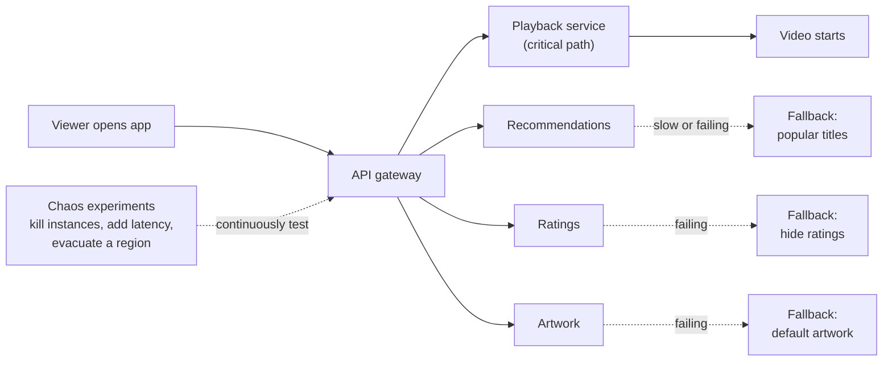
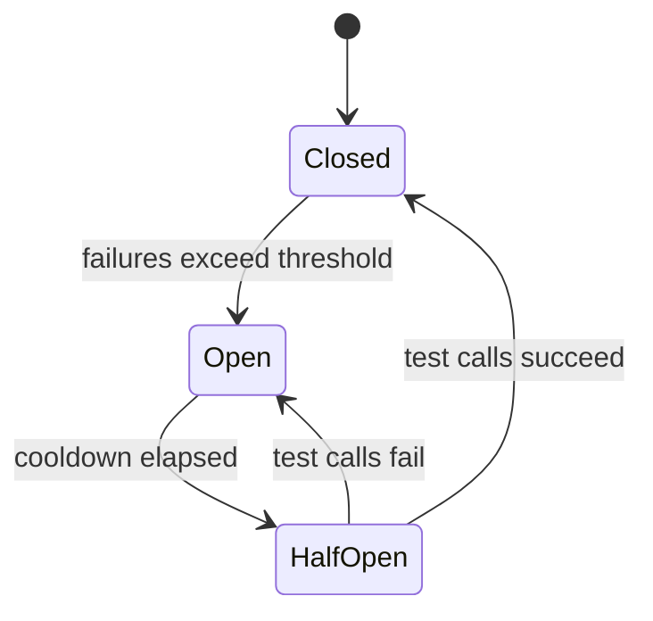

# How Netflix Builds Resilient Systems

*If failure is inevitable, make it routine: break things on purpose, contain the damage, and keep the core experience working.*

---

> *“The best way to avoid failure is to fail constantly.”*
>
> — **Netflix Technology Blog**, "5 Lessons We've Learned Using AWS," 2010

## At a Glance

> **In one sentence:** Netflix assumes any server, service, or even an entire cloud region can fail at any moment, so it designs every service with timeouts, fallbacks, and isolation, keeps the core "press play" path independent of non-essential features, and continuously injects failures in production — chaos engineering — to prove the system survives.

**You'll learn**

- Why Netflix moved to the cloud and embraced failure as normal
- Resilience patterns: timeouts, retries, circuit breakers, bulkheads, fallbacks
- Degrading gracefully: protecting the core experience
- Chaos engineering principles, from Chaos Monkey to region evacuation
- How to run a safe chaos experiment in your own system

**Before you start:** [Why Systems Go Down](Why-Systems-Go-Down.md) · [Why Distributed Systems Are Hard](../05-Distributed-Systems/Why-Distributed-Systems-Are-Hard.md)

**Reading time:** about 15 minutes

---

## The Big Picture



*Non-essential features degrade to simpler fallbacks; the path to pressing play stays protected — and chaos experiments keep proving it.*

---

## Introduction

In August 2008, Netflix suffered major database corruption in its own data center and couldn't ship DVDs to customers for three days. The lesson the company drew was not "buy a better database." It was that a single, vertically scaled system with single points of failure was the wrong architecture. Netflix decided to move to the cloud and to rebuild its systems on the assumption that **any component can fail at any time**.

That shift led to some of the most influential reliability practices in the industry. Netflix built resilience libraries such as Hystrix, which made circuit breakers and fallbacks mainstream, and it built Chaos Monkey — a tool that randomly shuts down production servers during business hours so engineers must build services that tolerate it. Later tools evacuated entire AWS regions to prove Netflix could survive losing one.

The philosophy is counterintuitive: **to make failures rare in impact, make them common in practice.**

### Why Should Engineers Care?

- Every system that calls other services faces the same partial failures Netflix designs for.
- Resilience patterns like timeouts, circuit breakers, and bulkheads are simple to apply and prevent many cascading outages.
- Chaos engineering is how you verify, not hope, that those patterns work.

---

## The Problem It Solves

In a microservice architecture, one user request may fan out to dozens of services. If each service is 99.9% available and a request depends on 30 of them *synchronously*, the request succeeds only about 97% of the time (0.999³⁰). Worse, one slow service can tie up threads in every caller, spreading the failure.

Netflix's answer has two parts:

1. **Design for failure:** every call to another service has a timeout, a limit, and a fallback, and non-essential features can't take down essential ones.
2. **Verify continuously:** inject real failures to find weaknesses before they cause outages.

---

## Historical Background

- **2008 — The database corruption incident** stops DVD shipping for three days and prompts the move to AWS.
- **2009–2016 — Cloud migration.** Netflix moves its services to AWS over several years, completing the migration of its streaming infrastructure around 2016.
- **2010–2011 — Chaos Monkey.** Netflix describes deliberately terminating instances in production; in 2011 it introduces the "Simian Army" (Chaos Monkey, Latency Monkey, Chaos Gorilla, and more).
- **2012 — Hystrix** is open-sourced, popularizing circuit breakers, bulkheads, and fallbacks for service calls. Chaos Monkey is open-sourced the same year.
- **December 24, 2012 — An AWS load-balancing outage** in the us-east-1 region disrupts Netflix streaming on Christmas Eve, pushing Netflix further toward multi-region active-active architecture.
- **2013 onward — Region evacuation.** "Chaos Kong" exercises shift all traffic out of an entire AWS region.
- **2014 — Failure Injection Testing (FIT)** allows precise, targeted failure injection for specific requests.
- **2016–2017 — Principles of Chaos Engineering** are published and the Chaos Automation Platform (ChAP) runs experiments with automatic safety checks.
- **2018 — Hystrix enters maintenance mode**, with Netflix recommending adaptive approaches (for example, adaptive concurrency limits); the patterns it popularized live on in libraries like Resilience4j and in service meshes.

---

## Core Concepts

### Timeouts

Every network call gets a timeout sized to what the caller can afford, not the default of the HTTP library (which may be minutes or infinite). A fast failure beats a slow one: it frees resources and allows a fallback.

### Retries (Carefully)

Retry only idempotent operations, only for transient errors, with exponential backoff and jitter, within a retry budget, and at one layer. Otherwise retries become the amplifier described in [Why Systems Go Down](Why-Systems-Go-Down.md).

### Circuit Breakers

When calls to a dependency fail repeatedly, the breaker **opens** and calls fail immediately (going straight to the fallback) for a cooldown period. It then lets a few test calls through (**half-open**); if they succeed, it **closes** again.



### Bulkheads

Named after the watertight compartments in a ship's hull: give each dependency its own limited pool of threads or connections (or concurrency limit). If one dependency hangs, it can exhaust only its own compartment, not the whole service.

### Fallbacks

What to return when a dependency fails:

| Fallback | Example |
|---------|--------|
| Static default | Default artwork, a generic greeting |
| Cached / stale data | Yesterday's recommendations |
| Simpler computation | Popular titles instead of personalized ones |
| Omit the feature | Hide the ratings row |
| Fail fast with a clear message | Only when the feature is essential |

### Critical vs. Non-Critical Paths

Netflix distinguishes what users absolutely need (sign in, browse, **start playback**) from what enriches the experience (personalized rows, ratings, artwork variants). Non-critical dependencies must never be able to break critical paths.

### Chaos Engineering

The *Principles of Chaos Engineering* describe experiments, not random destruction:

1. Define **steady state** with measurable business metrics (Netflix uses stream starts per second, often called SPS).
2. Form a **hypothesis** that steady state will continue during a failure.
3. Introduce **real-world events**: instance termination, latency, errors, region loss.
4. Run experiments **in production** (carefully), because staging never matches it.
5. **Minimize blast radius** and automate the experiments to run continuously.

---

## Real-World Analogy

### Fire Drills and Fire Doors

Buildings don't just hope fires never happen. They have fire doors that contain a fire to one section (bulkheads), sprinklers and alarms that trigger automatically (circuit breakers and alerts), marked exits and emergency lighting (fallbacks), and regular fire drills so people know what to do (chaos experiments). The drill is disruptive for a few minutes — which is far better than discovering during a real fire that the exit is locked.

---

## How It Works In Practice

### Applying the Patterns to One Service Call

```
Call "recommendations" for the home page:
  - Bulkhead:        at most 20 concurrent calls in flight
  - Timeout:         150 ms
  - Circuit breaker: open after 50% failures over 20 calls, cool down 10 s
  - Retry:           none (the page can do without it)
  - Fallback:        cached "popular in your country" list
  - Metrics:         success, timeout, rejected, fallback counts; latency percentiles
```

### Designing the Home Page for Failure

| Row | Dependency | If it fails |
|----|-----------|------------|
| "Continue watching" | Viewing history | Show cached version from the device |
| Personalized rows | Recommendations | Show popular titles |
| Ratings and badges | Ratings service | Hide them |
| Artwork | Artwork personalization | Use default artwork |
| Play button | Playback + licensing | Critical: invest heavily in redundancy |

### Running a Safe Chaos Experiment

1. **Pick a hypothesis:** "If the ratings service returns errors, stream starts per second stay within normal range."
2. **Measure steady state** for control and experiment groups.
3. **Limit the blast radius:** for example, 1% of traffic in one region, for 15 minutes.
4. **Set abort conditions:** automatically stop if the key metric drops by more than a set threshold.
5. **Inject the failure** (make ratings calls fail for the experiment group).
6. **Compare** experiment vs. control; if the hypothesis fails, you've found a weakness cheaply — fix it and re-run.
7. **Automate** passing experiments so regressions are caught continuously.

### Region Evacuation

Netflix runs **active-active** across multiple AWS regions. In an evacuation exercise, traffic is shifted from one region to the others, which must absorb it. Doing this regularly proves that capacity, data replication, and routing all work — so a real regional failure becomes an operational event rather than a crisis.

---

## Production Engineering Perspective

- **Start in staging, graduate to production.** Begin with failure injection in test environments, then small production experiments with tight abort conditions.
- **Run experiments during business hours**, when engineers are available to respond. Chaos Monkey was deliberately designed to run during the working day.
- **Observability comes first.** Without good metrics, you can't define steady state or detect harm. See [Observability](Observability-Monitoring-Alerting-And-Debugging.md).
- **Game days** bring a team together to run a planned failure scenario and practice the human response: alerts, runbooks, communication.
- **Test fallbacks as seriously as the main path.** A fallback that is never exercised will fail when it's finally needed.

---

## Tradeoffs

| Pattern | Benefit | Cost / risk |
|--------|--------|------------|
| Timeouts | Fast failure, freed resources | Too short → false failures |
| Retries | Survive blips | Amplification if uncontrolled |
| Circuit breakers | Stop hammering failing dependencies | Tuning; brief unavailability after recovery |
| Bulkheads | Contain failures | Unused capacity per pool; more tuning |
| Fallbacks | Keep users served | Stale or less relevant results; extra code paths |
| Chaos experiments in production | Real confidence | Controlled risk to real users; needs maturity |
| Multi-region active-active | Survive region loss | Cost, data replication complexity |

---

## Common Mistakes

### Beginner Mistakes

- Default HTTP client timeouts (often very long or unlimited).
- Retrying non-idempotent calls.
- One shared thread pool for all outgoing calls.

### Intermediate Mistakes

- Fallbacks that call another fragile service, or that are never tested.
- Circuit breakers that are configured but never observed or alerted on.
- "Chaos engineering" as random breakage without hypotheses, metrics, or abort conditions.

### Senior-Level Mistakes

- Treating every dependency as critical, so nothing can degrade gracefully.
- Multi-region architecture that's never exercised, and fails on its first real use.
- Running chaos experiments before the organization has basic observability and incident response.

---

## Failure Scenarios

### Scenario 1: The Slow Non-Essential Dependency

A recommendations service slows from 50 ms to 5 seconds. Without bulkheads and timeouts, every home-page request waits, the API tier's threads fill up, and nobody can press play — a non-essential feature takes down the essential one.

**Mitigation:** timeouts, a bulkhead for recommendations, and a popular-titles fallback.

### Scenario 2: The Fallback That Wasn't

A fallback reads from a cache that was decommissioned months ago. It throws an error the first time it's actually used — during an outage.

**Mitigation:** exercise fallbacks regularly through failure injection.

### Scenario 3: The Region That Couldn't Absorb Traffic

A region fails and traffic shifts to the remaining regions — which lack capacity and fall over too.

**Mitigation:** capacity plans that assume a region is missing, and regular evacuation exercises.

### Scenario 4: The Chaos Experiment Without Brakes

An experiment injects latency into a shared dependency across all traffic, and no automatic abort exists. A test becomes an outage.

**Mitigation:** small blast radius, automatic abort conditions tied to business metrics, and a kill switch.

---

## Real-World Industry Examples

- **Netflix** open-sourced Chaos Monkey, Hystrix, Eureka, Zuul, and other tools, and published the Principles of Chaos Engineering.
- **Amazon** runs "game days" and offers AWS Fault Injection Service for controlled experiments.
- **Google's DiRT** exercises (see [How Google Handles Failures](How-Google-Handles-Failures.md)) test disaster readiness across systems and people.
- **Resilience4j** (Java), **Polly** (.NET), and service meshes such as **Istio/Envoy** provide timeouts, retries, circuit breakers, and bulkheads as standard building blocks.

---

## Interview Questions

### Beginner

**Q1: What does a circuit breaker do?**

*Model answer:* It stops calling a dependency after repeated failures, failing fast (often to a fallback) for a cooldown period, then tests the dependency with a few calls before resuming normal traffic. It protects both the caller's resources and the struggling dependency.

### Intermediate

**Q2: What is a bulkhead, and why is it useful?**

*Model answer:* Isolating resources (thread pools, connection pools, concurrency limits) per dependency so one slow dependency can only exhaust its own share. Without bulkheads, one hanging dependency can consume all threads and take down unrelated features.

**Q3: How is chaos engineering different from just breaking things?**

*Model answer:* It's a controlled experiment: define steady state with metrics, hypothesize it will hold during a specific failure, limit blast radius, set automatic abort conditions, inject the failure, and compare against a control group. The goal is learning and verification, not disruption.

### Senior

**Q4: How would you make a page that depends on eight services resilient?**

*Model answer:* Classify each dependency as critical or optional. Call optional ones in parallel with tight timeouts, bulkheads, and circuit breakers, each with a tested fallback (cached, default, or omitted). For critical ones, invest in redundancy and fast failover. Measure the page's success by user-facing metrics and verify with failure-injection experiments.

### Architecture / Leadership

**Q5: How would you introduce chaos engineering in an organization new to it?**

*Model answer:* Start with prerequisites: good observability, defined steady-state metrics, and incident response. Run game days in staging, then small production experiments on one service with tight blast radius and automatic aborts. Share findings and fixes openly to build trust. Automate experiments that pass and expand scope gradually — for example, from instance termination to latency injection to zone or region failures.

---

## Hands-On Lab

Watch one slow dependency take down a service — then contain it with a timeout, a bulkhead, and a fallback. Uses real threads; save as `resilience_lab.py` and run it.

```python
import time
from concurrent.futures import ThreadPoolExecutor, TimeoutError as FutureTimeout

SLOW = 0.5            # the recommendations service is having a bad day: 500 ms per call

def recommendations():
    time.sleep(SLOW)
    return ["personalized row"]

def naive_home_page():
    return {"play_button": True, "rows": recommendations()}      # waits as long as it takes

recs_bulkhead = ThreadPoolExecutor(max_workers=5)                  # recommendations' own pool

def resilient_home_page():
    future = recs_bulkhead.submit(recommendations)
    try:
        rows = future.result(timeout=0.05)                         # 50 ms timeout
    except FutureTimeout:
        rows = ["popular titles (fallback)"]
    return {"play_button": True, "rows": rows}

def load_test(handler, requests=100, server_threads=10):
    latencies = []
    def timed():
        start = time.perf_counter(); handler(); latencies.append(time.perf_counter() - start)
    t0 = time.perf_counter()
    with ThreadPoolExecutor(max_workers=server_threads) as server:   # the service's worker pool
        for _ in range(requests):
            server.submit(timed)
    latencies.sort()
    print(f"{handler.__name__:22} total {time.perf_counter() - t0:5.2f}s   "
          f"p50 {latencies[50] * 1000:6.0f} ms   p99 {latencies[98] * 1000:6.0f} ms")

load_test(naive_home_page)
load_test(resilient_home_page)
recs_bulkhead.shutdown(wait=False, cancel_futures=True)
```

**What to notice**
- In the naive version, every home page waits half a second for a non-essential row, and requests queue behind each other in the service's thread pool. The play button is effectively unavailable.
- In the resilient version, pages return in about 50 ms with a fallback row. The slow dependency is confined to its own small pool (the bulkhead) and never holds the service's main threads for long.
- Set `SLOW = 0.01` (the dependency is healthy): both versions return personalized rows, but the resilient one is roughly twice as slow. Its 5-thread bulkhead is smaller than the service's 10 threads, so calls queue. Bulkheads must be sized for normal load — too small, and the protection itself becomes the bottleneck. Try `max_workers=10`.
- Extension: add a simple circuit breaker so that after 10 timeouts in a row, `resilient_home_page` skips the call entirely for 5 seconds.

---

## Test Yourself

*Answer each question in your head or on paper first, then open the answer to check.*

<details markdown="1">
<summary><strong>1. What event pushed Netflix to move to the cloud?</strong></summary>

A major database corruption in its own data center in August 2008 that stopped DVD shipping for three days.

</details>

<details markdown="1">
<summary><strong>2. What does Chaos Monkey do?</strong></summary>

It randomly terminates production instances (during business hours), forcing services to be built to tolerate instance loss.

</details>

<details markdown="1">
<summary><strong>3. What are the three states of a circuit breaker?</strong></summary>

Closed (normal), open (fail fast), and half-open (testing whether the dependency has recovered).

</details>

<details markdown="1">
<summary><strong>4. Why isolate dependencies with bulkheads?</strong></summary>

So one slow or failing dependency can only exhaust its own resources, not the threads and connections every other feature needs.

</details>

<details markdown="1">
<summary><strong>5. What is "steady state" in a chaos experiment?</strong></summary>

The normal, measurable behavior of the system — ideally a business metric such as stream starts per second — used to judge whether a failure harmed users.

</details>

<details markdown="1">
<summary><strong>6. Name three kinds of fallback.</strong></summary>

Any three of: static defaults, cached or stale data, a simpler computation, omitting the feature, failing fast with a clear message.

</details>

<details markdown="1">
<summary><strong>7. Why does Netflix practice evacuating entire regions?</strong></summary>

To prove that the remaining regions have enough capacity and that routing and data replication work, so a real regional failure is survivable.

</details>

---

## Cheat Sheet

| Pattern | Rule of thumb |
|--------|--------------|
| Timeout | On every network call, sized to the caller's budget |
| Retry | Idempotent calls only · backoff + jitter · budget · one layer |
| Circuit breaker | Open on sustained failures · half-open to test · alert on state changes |
| Bulkhead | Separate pool or concurrency limit per dependency |
| Fallback | Cached → simpler → omit → clear error; test it regularly |
| Critical path | Identify it; nothing optional may block it |

**Chaos experiment recipe:** steady-state metric → hypothesis → small blast radius → abort conditions → inject failure → compare with control → fix → automate.

**Netflix timeline:** 2008 DB corruption · 2010–11 Chaos Monkey & Simian Army · 2012 Hystrix open-sourced · 2012 Christmas Eve AWS outage · 2013+ region evacuation (Chaos Kong) · 2016–17 Chaos principles & ChAP.

---

## In the AI Era

- **Model APIs are dependencies like any other.** Wrap them with timeouts sized for generation length, circuit breakers, bulkheads (limit concurrent model calls per feature), and fallbacks — see [Graceful Degradation for AI Features](Graceful-Degradation-For-AI-Features.md).
- **Chaos experiments for AI features:** inject provider timeouts, rate-limit errors, malformed JSON, and very slow streams. Verify the product still works — perhaps without the AI feature.
- **Agents need bulkheads too.** Limit concurrent tool calls, per-run budgets, and per-tool concurrency so a confused agent can't exhaust shared resources.
- **Personalization fallbacks translate directly:** if the model is down, show search results, popular answers, or a human handoff rather than an error page.

**Try it:** In the lab, rename `recommendations` to `ai_summary` and set `SLOW = 3.0` (a slow model call). What fallback makes sense for a summary feature, and should it be a timeout or a streaming "still working" indicator?

---

## Key Takeaways

1. Netflix assumes everything fails and designs services to keep the core experience working anyway.
2. Timeouts, careful retries, circuit breakers, bulkheads, and fallbacks contain failures instead of spreading them.
3. Separate critical paths from optional features; optional failures must degrade gracefully.
4. Chaos engineering is disciplined experimentation: steady state, hypothesis, blast radius, abort conditions.
5. Test fallbacks and failovers regularly — untested recovery paths fail when needed.
6. Multi-region resilience only counts if you practice evacuating a region.

---

## What to Read Next

- **[Disaster Recovery Explained](Disaster-Recovery-Explained.md)** — surviving the loss of a whole site or region
- **[Observability: Monitoring, Alerting, and Debugging](Observability-Monitoring-Alerting-And-Debugging.md)** — the signals chaos experiments depend on
- **[How Load Balancing Works](../08-Scalability/How-Load-Balancing-Works.md)** — health checks and traffic shifting

---

## Further Reading

- **Principles of Chaos Engineering:** [https://principlesofchaos.org](https://principlesofchaos.org)
- **Netflix Technology Blog — "5 Lessons We've Learned Using AWS" (2010) and "The Netflix Simian Army" (2011):** [https://netflixtechblog.com](https://netflixtechblog.com)
- **Casey Rosenthal & Nora Jones — "Chaos Engineering: System Resiliency in Practice" (O'Reilly, 2020)**
- **Michael Nygard — "Release It!" (2nd edition, 2018)** — stability patterns and anti-patterns
- **Hystrix wiki — "How it Works":** [https://github.com/Netflix/Hystrix/wiki](https://github.com/Netflix/Hystrix/wiki)
- **Resilience4j documentation:** [https://resilience4j.readme.io](https://resilience4j.readme.io)

---

*This chapter is part of the Modern Software Engineering Handbook — a comprehensive guide to the concepts, principles, and practices that every professional software engineer should know.*
