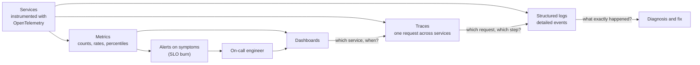
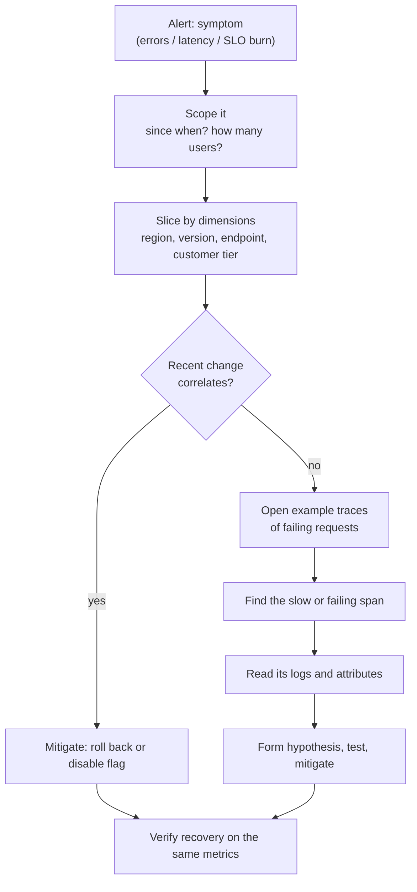

# Observability: Monitoring, Alerting, and Debugging

*Monitoring tells you something is wrong. Observability lets you ask why — including questions you didn't know you'd need to ask.*

---

> *“The most effective debugging tool is still careful thought, coupled with judiciously placed print statements.”*
>
> — **Brian Kernighan**, "Unix for Beginners," 1979

## At a Glance

> **In one sentence:** Observability is the ability to understand what a system is doing from the signals it emits — metrics for trends and alerts, structured logs for detailed events, and traces for following one request across many services — tied together by shared identifiers, and used to alert on user-visible symptoms and debug causes quickly.

**You'll learn**

- Monitoring vs. observability
- The three main signals: metrics, logs, and traces — and what each is good for
- The four golden signals, RED, and USE
- Why percentiles matter and averages mislead
- Alerting on symptoms, not causes; avoiding alert fatigue
- Distributed tracing, OpenTelemetry, and cardinality costs
- A practical debugging workflow for production incidents

**Before you start:** [How Google Handles Failures](How-Google-Handles-Failures.md) · [Why Distributed Systems Are Hard](../05-Distributed-Systems/Why-Distributed-Systems-Are-Hard.md)

**Reading time:** about 15 minutes

---

## The Big Picture



*Metrics tell you **that** something is wrong and roughly where; traces tell you **which step**; logs tell you **what exactly** happened. A shared trace ID links all three.*

---

## Introduction

At 2 a.m., an alert fires: checkout errors are elevated. The on-call engineer opens a dashboard. CPU is fine, memory is fine, the database is fine. Error rates are up, but only for some users. Where do you look?

In a poorly observable system, the next hour is guesswork: grepping unstructured logs across twenty servers, restarting things to see if it helps, and asking in chat whether anyone deployed anything.

In a well-observable system, the engineer filters the error metric by region, app version, and payment method, and sees that errors are concentrated in one payment method in one region. They open a trace of a failing request and see that a call to a fraud-scoring service takes 9 seconds and then times out. The logs attached to that trace show a new configuration for that region, deployed at 1:47 a.m. Rolling it back fixes the problem in fifteen minutes.

The difference isn't the engineer's talent. It's whether the system was built to answer questions about itself.

### Why Should Engineers Care?

- Time to detect and time to diagnose dominate outage length.
- As systems become distributed, "log into the server and look" stops working.
- Good observability also improves daily work: performance tuning, understanding user behavior, and verifying that a release did what you expected.

---

## The Problem It Solves

| Question during an incident | Signal that answers it |
|----------------------------|-----------------------|
| Is something wrong for users right now? | Symptom metrics and SLO alerts |
| Since when? How bad? Who is affected? | Metrics broken down by dimension |
| Which service or dependency is responsible? | Traces and service dependency maps |
| What exactly happened in this failing request? | Structured logs linked to the trace |
| Did the last change cause it? | Deploy and config-change markers on dashboards |

Monitoring answers questions you anticipated ("is CPU high?"). Observability lets you ask **new** questions ("what do failing requests have in common?") without shipping new code first.

---

## Historical Background

- **1980s–1990s — Syslog and SNMP.** Systems sent log lines to central servers and exposed counters via SNMP for network monitoring.
- **1999 onward — Host monitoring.** Tools such as Nagios (1999) checked whether hosts and services were up and alerted when they weren't.
- **2010 — Dapper.** Google published "Dapper, a Large-Scale Distributed Systems Tracing Infrastructure," describing how it traced requests across many services — the foundation of modern distributed tracing (followed by Zipkin, open-sourced by Twitter in 2012, and Jaeger, from Uber).
- **2012 — Prometheus** was started at SoundCloud, popularizing labeled, pull-based metrics; it joined the CNCF in 2016.
- **2016 — The four golden signals** (latency, traffic, errors, saturation) were described in Google's SRE book.
- **Mid-2010s — "Observability" enters software.** The term, borrowed from control theory (how well a system's internal state can be inferred from its outputs), was popularized for software by practitioners arguing for high-cardinality, event-based debugging.
- **2019 — OpenTelemetry** was formed from the merger of OpenTracing and OpenCensus, creating a vendor-neutral standard for traces, metrics, and logs.

---

## Core Concepts

### Metrics

Numeric measurements aggregated over time: request counts, error counts, latency histograms, queue depth, CPU. Cheap to store and query, ideal for dashboards and alerts. Metrics usually have **labels** (dimensions) such as `service`, `region`, `status_code`.

### Logs

Records of individual events. **Structured logs** (JSON or key-value) are far more useful than free text because they can be filtered and aggregated:

```json
{"ts":"2026-09-27T01:52:10Z","level":"error","service":"checkout","trace_id":"4bf92f35…",
 "user_tier":"premium","payment_method":"wallet","msg":"fraud check timeout","timeout_ms":9000}
```

### Traces

A **trace** follows one request through every service it touches. Each unit of work is a **span** with a start time, duration, and attributes; spans form a tree. Traces show where time goes and which dependency failed.

```
checkout.request                     ███████████████████████████████ 9.4 s
 ├─ auth.verify                      █ 20 ms
 ├─ cart.load                        ██ 45 ms
 ├─ fraud.score                      ████████████████████████████ 9.0 s  ← timeout
 └─ payment.authorize                (never reached)
```

### Correlation

Put the **trace ID** in every log line and attach exemplars (sample trace IDs) to metrics, so you can jump from a spike on a graph to example requests, and from a request to its logs.

### Golden Signals, RED, and USE

| Framework | For | Signals |
|----------|----|--------|
| Four golden signals | User-facing services | Latency, traffic, errors, saturation |
| RED | Request-driven services | Rate, Errors, Duration |
| USE | Resources (CPU, disk, pools) | Utilization, Saturation, Errors |

### Percentiles, Not Averages

Averages hide the slow requests users actually notice. If 99 requests take 50 ms and one takes 5 seconds, the average is about 100 ms — which describes nobody's experience. Use percentiles: **p50** (typical), **p95/p99** (the slow tail). Record latency as **histograms** so percentiles can be computed across many servers correctly (you can't average percentiles).

### Cardinality

Each unique combination of metric labels creates a separate time series. A label like `user_id` with millions of values can explode storage and cost. Keep high-cardinality details (user IDs, request IDs) in **logs and traces**, not metric labels.

### Alerting on Symptoms

- **Page** on symptoms that affect users now or soon (SLO burn rate, elevated errors or latency).
- **Ticket** or dashboard for causes and early warnings (disk 80% full, a replica lagging).
- Every page should be **actionable**, urgent, and have a runbook link.

---

## Real-World Analogy

### A Doctor's Toolkit

A doctor checks vital signs first — pulse, temperature, blood pressure (metrics). If something is off, they order imaging to see exactly where the problem is (traces). Then they read detailed test results and your history (logs). A thermometer alone can tell you that you're sick; it can't tell you why. And a doctor who ordered every possible test on every patient every day would drown in data and cost — which is why good observability, like good medicine, is selective.

---

## How It Works In Practice

### Instrumenting a Service

1. **Adopt OpenTelemetry** SDKs so traces, metrics, and logs share context and can go to any backend.
2. **Auto-instrument** frameworks, HTTP clients, and database drivers for spans and standard metrics.
3. **Add business-level signals:** checkouts completed, payments declined by reason, search zero-result rate.
4. **Log structured events** at meaningful points (not every line), always including `trace_id`.
5. **Record deploys and config changes** as events on dashboards.

### A Debugging Workflow



### Designing Dashboards

- **One overview per service:** the golden signals, SLO status, recent deploys.
- **Drill-down dashboards** for dependencies and resources.
- **Consistent layout** across services so on-call engineers can read any team's dashboard at 2 a.m.

### Designing Alerts

| Good alert | Bad alert |
|-----------|----------|
| "Checkout error budget burning at 14× over 1 h" | "CPU > 80% on host 17" |
| Links to a runbook and a dashboard | No context |
| Pages only when a human must act now | Pages for self-healing blips |
| Owned by a team | Nobody knows who owns it |

---

## Production Engineering Perspective

- **Observability has a cost.** Log volume, metric cardinality, and trace storage grow quickly. Use sampling for traces (for example, keep all errors and slow requests plus a small share of normal ones), log levels, and retention policies.
- **Protect sensitive data.** Never log passwords, tokens, full card numbers, or unnecessary personal data. Redact at the source.
- **Clock and context propagation:** ensure trace context passes through queues, async jobs, and third-party calls, or traces break into fragments.
- **Test your telemetry:** alerts should be reviewed after incidents ("did it fire? was it early enough?"), and noisy alerts should be fixed or deleted.
- **Dashboards as code** keep them versioned and reviewable.

---

## Tradeoffs

| Choice | Benefit | Cost |
|-------|--------|-----|
| More detailed logs | Easier debugging | Storage cost, noise, privacy risk |
| High-cardinality metrics | Fine-grained slicing | Cost explosion |
| 100% trace sampling | Complete visibility | Expensive at scale |
| Tail-based sampling (keep errors and slow traces) | Keeps interesting traces | More complex pipeline |
| Many alerts | Nothing missed (in theory) | Alert fatigue; real alerts ignored |
| Vendor platform | Fast setup, rich features | Cost, lock-in (mitigated by OpenTelemetry) |

---

## Common Mistakes

### Beginner Mistakes

- Unstructured log messages that can't be filtered.
- Averages instead of percentiles for latency.
- No request or trace ID, so events can't be correlated.

### Intermediate Mistakes

- Paging on causes (CPU, memory) instead of user symptoms.
- Putting user IDs or request IDs in metric labels.
- Logging secrets or personal data.
- Traces that stop at message queues or async boundaries.

### Senior-Level Mistakes

- No observability budget or sampling strategy, leading to surprise bills and then panicked data deletion.
- Every team inventing its own dashboards, labels, and alert styles.
- Alerts that are never reviewed after incidents, so noise grows and trust falls.

---

## Failure Scenarios

### Scenario 1: The Average That Lied

Average latency is a healthy 120 ms, but 2% of users — those with large carts — wait 8 seconds and abandon checkout. Nobody notices for weeks.

**Mitigation:** percentiles and latency histograms; slicing by meaningful dimensions such as cart size.

### Scenario 2: The Monitoring Outage

The monitoring system runs in the same cluster as the application. When the cluster fails, dashboards and alerts fail with it; the team learns about the outage from customers.

**Mitigation:** host monitoring separately from what it monitors; add external synthetic checks.

### Scenario 3: The Cardinality Bomb

A developer adds `session_id` as a metric label. Time series count jumps to millions; the metrics backend slows down and costs spike.

**Mitigation:** cardinality limits and review of new labels; high-cardinality data in logs and traces.

### Scenario 4: Alert Fatigue

Hundreds of low-value alerts per week train people to ignore pages. A real incident is noticed an hour late.

**Mitigation:** symptom-based paging, alert reviews, and deleting alerts that don't lead to action.

---

## Real-World Industry Examples

- **Google's Dapper paper (2010)** introduced large-scale distributed tracing with low-overhead sampling.
- **Twitter's Zipkin** and **Uber's Jaeger** brought distributed tracing to open source.
- **Prometheus**, started at SoundCloud, became the standard for labeled metrics in cloud-native systems.
- **OpenTelemetry** is now supported by most observability vendors, allowing instrumentation once and export anywhere.

---

## Interview Questions

### Beginner

**Q1: What are the three main types of telemetry, and what is each best for?**

*Model answer:* Metrics — cheap numeric aggregates for dashboards, trends, and alerts. Logs — detailed records of individual events for understanding exactly what happened. Traces — the path and timing of a single request across services, for finding where time was spent or where a failure occurred.

### Intermediate

**Q2: Why are averages misleading for latency?**

*Model answer:* Latency distributions have long tails; a few very slow requests can hide behind a good-looking average, and the average may match no real user's experience. Percentiles like p95 and p99 show the tail that users feel. Percentiles should be computed from histograms, not averaged across servers.

**Q3: What makes an alert good?**

*Model answer:* It fires on user-impacting symptoms, requires urgent human action, is rare enough to be taken seriously, and comes with context: what's affected, a dashboard, and a runbook. Cause-based signals belong on dashboards or in tickets.

### Senior

**Q4: How would you control observability costs at scale?**

*Model answer:* Limit metric cardinality (review labels, block high-cardinality ones); use tail-based trace sampling to keep errors and slow traces plus a small share of normal ones; set log levels and retention per data type; drop or aggregate noisy logs at the collector; and track observability spend per team so the costs are visible.

### Architecture / Leadership

**Q5: How would you standardize observability across 50 teams?**

*Model answer:* Adopt OpenTelemetry with shared libraries and defaults (trace propagation, standard labels, log format). Provide a service dashboard template with golden signals and SLOs, and an alerting policy based on SLO burn rates. Require runbook links on pages. Review alerts after incidents, and publish reliability and observability maturity metrics per team.

---

## Hands-On Lab

See why averages mislead, and build minimal structured logging and tracing. Pure Python; save as `observability_lab.py` and run it.

```python
import json, random, time, uuid, contextvars
from statistics import mean, quantiles
random.seed(3)

# --- 1) Averages vs. percentiles ---------------------------------------------
latencies = [random.gauss(80, 15) for _ in range(9_800)] + \
            [random.uniform(2_000, 6_000) for _ in range(200)]      # 2% very slow requests
p = quantiles(latencies, n=100)
print(f"average {mean(latencies):6.0f} ms   p50 {p[49]:6.0f} ms   p95 {p[94]:6.0f} ms   p99 {p[98]:6.0f} ms\n")

# --- 2) Structured logs + tracing with a shared trace ID ---------------------
current_trace = contextvars.ContextVar("trace_id")
spans = []

def log(level, msg, **fields):
    print(json.dumps({"level": level, "trace_id": current_trace.get(), "msg": msg, **fields}))

class span:
    def __init__(self, name): self.name = name
    def __enter__(self): self.start = time.perf_counter(); return self
    def __exit__(self, *exc):
        spans.append((current_trace.get(), self.name, (time.perf_counter() - self.start) * 1000))

def checkout(slow_fraud):
    current_trace.set(uuid.uuid4().hex[:8])
    with span("checkout"):
        with span("cart.load"):  time.sleep(0.01)
        with span("fraud.score"):
            time.sleep(0.3 if slow_fraud else 0.02)
            if slow_fraud:
                log("error", "fraud check slow", region="eu-west", timeout_ms=300)
        with span("payment.authorize"): time.sleep(0.03)

for i in range(5):
    checkout(slow_fraud=(i == 3))

# Find the slowest trace, then its slowest child span — the debugging workflow in miniature
slowest = max((s for s in spans if s[1] == "checkout"), key=lambda s: s[2])
print(f"\nslowest checkout: trace {slowest[0]} took {slowest[2]:.0f} ms")
for trace_id, name, ms in spans:
    if trace_id == slowest[0] and name != "checkout":
        print(f"   {name:18} {ms:6.0f} ms {'<-- here' if ms > 100 else ''}")
```

**What to notice**
- The average (about 160 ms) looks acceptable, while p99 shows some users waiting several seconds. The average describes nobody.
- The error log line carries the same `trace_id` as the slow trace, so you can jump from "slow request" to "what happened" instantly.
- The trace breakdown points straight at `fraud.score` — no guessing, no restarting services to see what changes.
- Real systems do this with OpenTelemetry, which also propagates the trace ID across service boundaries in HTTP headers.

---

## Test Yourself

*Answer each question in your head or on paper first, then open the answer to check.*

<details markdown="1">
<summary><strong>1. What's the difference between monitoring and observability?</strong></summary>

Monitoring checks known conditions you anticipated. Observability lets you investigate new, unanticipated questions from the signals the system already emits.

</details>

<details markdown="1">
<summary><strong>2. What are the four golden signals?</strong></summary>

Latency, traffic, errors, and saturation.

</details>

<details markdown="1">
<summary><strong>3. Why shouldn't you put user IDs in metric labels?</strong></summary>

Each unique label value creates a new time series, so millions of users means millions of series — exploding cost and slowing queries. Put such details in logs and traces.

</details>

<details markdown="1">
<summary><strong>4. What is a span?</strong></summary>

One timed unit of work within a trace (for example, a database query or a call to another service), with a start, duration, attributes, and a parent span.

</details>

<details markdown="1">
<summary><strong>5. Why can't you average p99 values from several servers?</strong></summary>

Percentiles don't combine by averaging. You need the underlying distributions — histograms — merged together, then compute the percentile.

</details>

<details markdown="1">
<summary><strong>6. What should page a human, and what shouldn't?</strong></summary>

Page on urgent, actionable, user-impacting symptoms (SLO burn, elevated errors or latency). Early warnings and causes (disk filling, a lagging replica) go to tickets or dashboards.

</details>

<details markdown="1">
<summary><strong>7. What is OpenTelemetry?</strong></summary>

A vendor-neutral open standard and set of SDKs for producing and exporting traces, metrics, and logs, formed in 2019 from OpenTracing and OpenCensus.

</details>

---

## Cheat Sheet

| Signal | Best for | Watch out for |
|-------|---------|--------------|
| Metrics | Trends, dashboards, alerts | Cardinality |
| Logs | Exact details of events | Volume, cost, sensitive data |
| Traces | Where time goes across services | Sampling, broken propagation |

**Frameworks:** Golden signals (latency, traffic, errors, saturation) · RED (rate, errors, duration) for services · USE (utilization, saturation, errors) for resources.

**Rules:** percentiles not averages · histograms for latency · trace ID in every log · page on symptoms, ticket on causes · runbook link on every page · monitoring hosted separately · redact secrets.

**Debug flow:** alert → scope → slice by dimensions → check recent changes → example traces → slow/failing span → logs → mitigate → verify.

---

## In the AI Era

- **AI features need AI-specific telemetry:** model and prompt version, tokens in and out, time to first token, cost per request, retrieved document IDs, tool calls, and quality signals (user feedback, automated checks). Without them, "why did the assistant say that?" can't be answered. See [Building LLM-Powered Systems](../15-AI-Era-Engineering/Building-LLM-Powered-Systems.md).
- **Traces fit agents naturally.** An agent run is a tree of model calls and tool calls — exactly the span structure of a trace. OpenTelemetry has emerging conventions for generative AI spans.
- **Prompts and outputs are sensitive logs.** Treat them like personal data: access control, redaction, retention limits.
- **AI can help read telemetry** — summarizing incidents, correlating alerts, drafting hypotheses — but the conclusions should be verified against the underlying data.

**Try it:** Extend the lab's `span` to record `model`, `input_tokens`, and `output_tokens` attributes for a fake "llm.call" span, then print cost per trace.

---

## Key Takeaways

1. Metrics detect, traces locate, logs explain — linked by a shared trace ID.
2. Use percentiles and histograms; averages hide the users who are suffering.
3. Page on user-visible symptoms; send causes and early warnings to dashboards and tickets.
4. Keep high-cardinality details out of metric labels.
5. Standardize on OpenTelemetry and consistent dashboards across teams.
6. Budget observability: sampling, retention, and redaction are part of the design.
7. A good debugging workflow — scope, slice, check changes, trace, log — beats guessing.

---

## What to Read Next

- **[Graceful Degradation for AI Features](Graceful-Degradation-For-AI-Features.md)** — keeping AI features useful when models fail
- **[How Google Handles Failures](How-Google-Handles-Failures.md)** — SLOs and burn-rate alerting
- **[Why Systems Go Down](Why-Systems-Go-Down.md)** — what your telemetry will be showing you during incidents

---

## Further Reading

- **Sigelman et al. — "Dapper, a Large-Scale Distributed Systems Tracing Infrastructure" (Google, 2010):** [https://research.google/pubs/dapper-a-large-scale-distributed-systems-tracing-infrastructure/](https://research.google/pubs/dapper-a-large-scale-distributed-systems-tracing-infrastructure/)
- **OpenTelemetry documentation:** [https://opentelemetry.io/docs/](https://opentelemetry.io/docs/)
- **Google SRE Book — "Monitoring Distributed Systems":** [https://sre.google/sre-book/monitoring-distributed-systems/](https://sre.google/sre-book/monitoring-distributed-systems/)
- **Charity Majors, Liz Fong-Jones & George Miranda — "Observability Engineering" (O'Reilly, 2022)**
- **Brendan Gregg — The USE Method:** [https://www.brendangregg.com/usemethod.html](https://www.brendangregg.com/usemethod.html)
- **Prometheus documentation:** [https://prometheus.io/docs/](https://prometheus.io/docs/)

---

*This chapter is part of the Modern Software Engineering Handbook — a comprehensive guide to the concepts, principles, and practices that every professional software engineer should know.*
