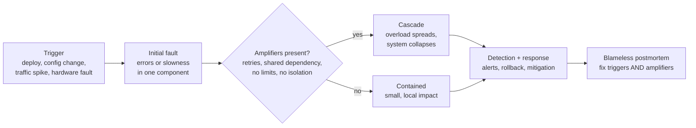
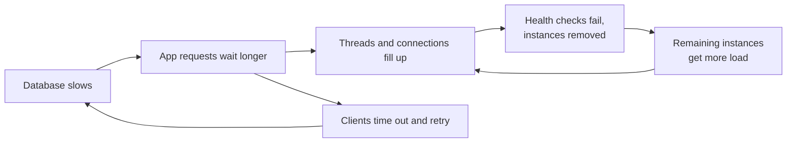
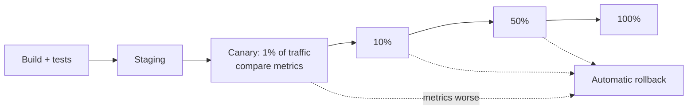

# Why Systems Go Down

*Outages rarely have one cause. They happen when ordinary changes, hidden dependencies, and feedback loops line up — and understanding that pattern is the first step to preventing it.*

---

> *“Post-accident attribution to a 'root cause' is fundamentally wrong.”*
>
> — **Richard I. Cook**, "How Complex Systems Fail," 1998

## At a Glance

> **In one sentence:** Most outages are triggered by change — a deploy, a configuration edit, a traffic shift — and made severe by amplifiers like retries, shared dependencies, overload, and missing limits, so reliable teams control change, remove amplifiers, and learn from every incident without blame.

**You'll learn**

- The most common triggers of real outages, and why change dominates
- How small problems become big ones: cascading failures, retry storms, overload collapse
- Hidden shared dependencies: DNS, certificates, configuration, identity, one region
- The Swiss cheese model and why "root cause" is usually several causes
- Defenses: progressive rollouts, limits, load shedding, isolation, fast rollback
- How blameless postmortems turn outages into improvements

**Before you start:** [Why Distributed Systems Are Hard](../05-Distributed-Systems/Why-Distributed-Systems-Are-Hard.md) · [How To Think Like An Engineer](../01-Foundations/How-To-Think-Like-An-Engineer.md)

**Reading time:** about 15 minutes

---

## The Big Picture



*You can't prevent every trigger. You can make sure triggers stay small — by removing the amplifiers.*

---

## Introduction

On an ordinary Tuesday, an engineer runs a routine maintenance command to remove a few servers from a storage subsystem. A typo in the command removes far more servers than intended. Two core subsystems must restart, which takes hours at their size. Countless websites and apps depending on that storage service fail for most of a working day.

This happened to Amazon S3 in the us-east-1 region on February 28, 2017. The public summary is a classic of the genre: a routine action, a small mistake, a tool that allowed too much at once, systems that had grown too large to restart quickly, and a huge number of other services that had quietly come to depend on one region.

Notice what the story is *not*: it is not "an engineer made a typo." Engineers will always make typos. The real questions are why a single command could remove so much capacity, why recovery took so long, and why so much of the internet depended on one place. Amazon's fixes addressed exactly those — the tool was changed to remove capacity more slowly and to refuse to go below minimum levels.

This chapter is about seeing outages that way.

### Why Should Engineers Care?

- Every engineer who ships changes will cause or witness incidents. Knowing the patterns helps you prevent them and respond calmly.
- Reliability is a feature users notice most when it's missing.
- The same small set of failure patterns — bad changes, cascading overload, hidden dependencies — explains most large outages. Learn them once, recognize them everywhere.

---

## The Problem It Solves

Modern systems are **complex**: many components, many teams, constant change, and interactions nobody fully understands. In such systems:

- Failures are **normal**, not exceptional — something is always partly broken.
- The worst outages come from **interactions**, not single broken parts.
- Fixing the single "root cause" of one incident rarely prevents the next one.

Understanding *why* systems go down gives you a framework for designing, operating, and learning that reduces both the frequency and the impact of outages.

---

## Historical Background

- **1979 — Three Mile Island.** The partial meltdown led sociologist Charles Perrow to write *Normal Accidents* (1984), arguing that in tightly coupled, complex systems, some accidents are inevitable.
- **1990 — The Swiss cheese model.** Psychologist James Reason described accidents as holes in many layers of defense lining up — each layer imperfect, harm occurring only when all fail together.
- **1990 — AT&T long-distance outage.** A software bug in switch recovery code spread from switch to switch, disrupting a large share of U.S. long-distance calls for hours — an early, famous cascading software failure.
- **1998 — "How Complex Systems Fail."** Richard Cook's short essay summarized decades of safety research in 18 points that became essential reading for software reliability engineers.
- **2000s–2010s — Web-scale postmortems.** Companies began publishing detailed incident reports. Google's Site Reliability Engineering book (2016) made blameless postmortems and error budgets mainstream.
- **2010s–2020s — Landmark outages** (all with public write-ups): Amazon S3 (2017), Cloudflare's regular-expression CPU exhaustion (2019), Facebook's backbone and BGP outage (2021), and the CrowdStrike faulty update that crashed millions of Windows machines (2024). Each shows the same patterns this chapter describes.

---

## Core Concepts

### Triggers: What Starts Outages

| Trigger | Examples |
|--------|---------|
| **Code changes** | A deploy with a bug, a performance regression |
| **Configuration changes** | Feature flags, routing rules, limits, firewall rules, DNS records |
| **Infrastructure changes** | Maintenance, migrations, capacity removal, OS or library upgrades |
| **Traffic changes** | Launches, viral events, bots, retries after another incident |
| **Dependency failures** | A provider, database, or internal service slows down or fails |
| **Expiry and exhaustion** | Expired certificates, full disks, exhausted connection pools, quota limits, integer overflows |
| **Hardware and environment** | Disk, network, power, cooling, region failures |

Google's SRE book notes that roughly 70% of outages are due to changes in a live system. Change is where most risk lives — which is good news, because change is something you control.

### Amplifiers: What Makes Outages Big

1. **Retries without limits.** A slow service causes timeouts; clients retry; load doubles or triples; the service gets slower.
2. **Overload collapse.** Beyond capacity, servers spend time on requests that will time out anyway, so useful throughput *falls* as load rises.
3. **Shared dependencies.** Many services depend on one database, one cache, one configuration service, one identity provider, one DNS provider, or one region.
4. **Tight coupling.** Synchronous call chains where one slow service blocks all callers.
5. **Global, instant changes.** A configuration change pushed everywhere at once has no chance to be caught early.
6. **Slow recovery.** Huge systems that take hours to restart, cold caches, and missing runbooks.

### Cascading Failure



Two feedback loops — retries hitting the database, and failing instances shifting load to the survivors — turn a slowdown into a total outage.

### Latent Failures

Many failures are **latent**: a bug in rarely used code, a backup that doesn't restore, a failover path that was never tested, a certificate that expires in six months. They sit silently until the moment they're needed. Reliability work largely consists of **finding latent failures before they find you**.

### Swiss Cheese and "Root Cause"

Every layer of defense has holes: tests miss cases, reviews miss details, monitoring misses symptoms, rollbacks are slow. An outage happens when holes line up. Looking for a single "root cause" usually stops at the last human action and misses the holes in every other layer. Better questions: *What contributed? What made it worse? What made it hard to detect and recover?*

### Blameless Culture

If people are punished for mistakes, they hide them, and the organization stops learning. Blameless postmortems assume people acted reasonably given what they knew, and focus on improving systems, tools, and processes. Blameless does not mean accountability-free: teams are accountable for completing the follow-up actions.

---

## Real-World Analogy

### A Traffic Jam From One Stalled Car

One car stalls on a highway at rush hour. Cars behind it slow down. Drivers brake harder than needed, creating waves. Some switch lanes, jamming the other lanes too. Navigation apps reroute everyone onto the same side streets, which jam as well. An hour later, the stalled car is gone, but the jam continues because the system is now overloaded.

The stalled car was the trigger. The amplifiers — no spare capacity, everyone reacting at once, all rerouting to the same place — turned it into a city-wide problem. Traffic engineers don't just tow cars faster; they add ramp meters (rate limits), separate lanes (isolation), and staggered routing (jitter).

---

## How It Works In Practice

### Anatomy of a Real Outage Pattern

**Cloudflare, July 2, 2019.** A new rule for its web application firewall contained a regular expression that caused excessive backtracking. The rule was deployed globally at once, and CPU usage on servers handling HTTP traffic spiked to 100% worldwide, causing widespread errors for about half an hour.

- **Trigger:** a configuration (rules) change.
- **Amplifier:** global, simultaneous deployment of that rule type; a regex engine without runtime limits.
- **Fixes Cloudflare described:** staged rollouts for rule changes, protections against excessive regex CPU use, and improved ability to quickly disable components.

**CrowdStrike, July 19, 2024.** A faulty content configuration update to endpoint security software caused Windows machines to crash, affecting millions of computers across airlines, banks, hospitals, and more. Recovery was slow because many machines needed manual intervention.

- **Trigger:** a content update pushed to production.
- **Amplifiers:** the update reached a huge number of machines very quickly; the code ran with high privilege, so failure meant a crash rather than a contained error; recovery required hands-on work.
- **Lesson widely drawn:** even "data" or "content" updates need staged rollouts, and components with deep privileges need extra safety.

### Defenses, Layer by Layer

| Layer | Defense |
|------|--------|
| **Change** | Code review, tests, staged/canary rollouts, feature flags, config validation, change freezes during peaks |
| **Capacity** | Headroom, load tests, autoscaling, quotas |
| **Overload** | Timeouts, retry budgets, backoff with jitter, circuit breakers, load shedding, rate limits |
| **Isolation** | Bulkheads, cell-based architecture, per-customer limits, multiple regions |
| **Dependencies** | Classify critical vs. optional; fallbacks; cached responses; no single shared choke point |
| **Detection** | SLO-based alerting on user symptoms; dashboards; synthetic checks |
| **Recovery** | One-click rollback, runbooks, practiced failover, fast restart |
| **Learning** | Blameless postmortems with tracked action items |

### Progressive Delivery

Rather than changing everything at once:



The same applies to configuration, feature flags, database migrations, and data or content pushes — anything that changes behavior in production.

### Load Shedding

When a server is overloaded, it's better to **reject some requests quickly** than to accept all of them and serve none well. Load shedding rejects excess work early (by queue length, concurrency, or priority), keeping latency acceptable for the requests that are accepted. Critical traffic (checkout, login) is prioritized over less important traffic (recommendations, analytics).

---

## Production Engineering Perspective

- **Every change should be reversible quickly.** Deploy tooling, feature flags, and configuration systems need a fast, tested undo.
- **Know your dependencies.** Keep a dependency map; for each dependency, know what happens when it's slow, down, or returning errors.
- **Watch for expiring things.** Certificates, domain registrations, API keys, licenses, and quotas should be tracked and alerted well in advance.
- **Protect recovery paths.** If your tools for fixing an outage depend on the thing that's broken (for example, the dashboard runs on the failed platform, or badge readers depend on the network that's down), you'll be stuck. Keep out-of-band access.
- **Incident response is a skill.** Clear roles (incident commander, communications, operations), a single channel, regular status updates, and a bias toward mitigation first, diagnosis second.

---

## Tradeoffs

| Practice | Benefit | Cost |
|---------|--------|-----|
| Staged rollouts | Catch bad changes early | Slower delivery; tooling investment |
| Retries | Survive transient errors | Amplify overload if unbounded |
| Load shedding | Protects core functions | Some users see errors |
| Multi-region | Survive regional failures | Cost, complexity, consistency challenges |
| Change freezes | Fewer incidents during peaks | Delayed fixes and features |
| Strict limits and quotas | Contain runaway behavior | Legitimate spikes may be throttled |

Reliability always costs something. The goal is not zero outages — it's the right level of reliability for what users need, at a sustainable cost. See [How Google Handles Failures](How-Google-Handles-Failures.md) for error budgets, which make that trade-off explicit.

---

## Common Mistakes

### Beginner Mistakes

- Unlimited retries with no backoff.
- No timeouts on network calls.
- Deploying to every server at once.
- Monitoring CPU but not what users experience (errors, latency).

### Intermediate Mistakes

- Treating configuration changes as safer than code changes.
- Health checks that depend on shared dependencies, causing all instances to be removed at once.
- Fallbacks that were never tested and fail when needed.
- Postmortems that stop at "human error."

### Senior-Level Mistakes

- Hidden single points of failure: one region, one DNS provider, one identity system, one config service.
- Systems that take hours to cold-start, with no plan to recover them.
- Postmortem action items that are never completed, so the same incident repeats.

---

## Failure Scenarios

### Scenario 1: The Retry Storm

A payment dependency slows down. Every caller retries three times immediately. Load on the dependency quadruples; it collapses completely.

**Mitigations:** retry budgets, exponential backoff with jitter, circuit breakers, and retrying at only one layer.

### Scenario 2: The Expired Certificate

An internal TLS certificate expires at 2 a.m. on a Sunday. Every service calling that API fails with handshake errors. Nobody was tracking it.

**Mitigations:** automated renewal, inventory of certificates, alerts 30/14/7 days before expiry.

### Scenario 3: The Health Check Trap

Health checks verify database connectivity. The database has a brief blip; all app instances fail health checks simultaneously and are removed from the load balancer — a total outage caused by the safety mechanism.

**Mitigations:** keep liveness checks shallow; use readiness checks carefully; never let a shared dependency's blip remove every instance.

### Scenario 4: The Cold Restart

After an outage, the whole fleet restarts at once. Caches are empty; every request hits the database; it overloads and the outage continues.

**Mitigations:** staged restarts, cache warming, admission control during recovery.

---

## Real-World Industry Examples

- **Amazon S3 (2017)** — a mistyped maintenance command removed too much capacity; the tool was changed to remove capacity more slowly with safety floors.
- **Cloudflare (2019)** — a regular expression in a globally deployed firewall rule exhausted CPU; staged rollouts and regex safeguards followed.
- **Facebook (2021)** — a faulty command during backbone maintenance disconnected data centers; DNS servers withdrew their BGP routes; recovery was slowed because internal tools and physical access depended on the same network.
- **CrowdStrike (2024)** — a faulty content update crashed millions of Windows machines; manual recovery was needed on many.
- **GitLab (2017)** — an accidental deletion during a database incident revealed that several backup methods were not working as expected; GitLab live-streamed its recovery and published a detailed postmortem.

---

## Interview Questions

### Beginner

**Q1: What is the most common trigger of production outages?**

*Model answer:* Changes — code deploys, configuration changes, and infrastructure changes. That's why staged rollouts, validation, and fast rollback are among the most effective reliability practices.

### Intermediate

**Q2: Explain how a cascading failure happens.**

*Model answer:* One component slows or fails; callers wait longer and hold resources; they time out and retry, adding load; overloaded instances fail health checks and are removed, shifting load to the rest, which then fail too. Feedback loops turn a local problem into a system-wide outage. Timeouts, retry budgets, circuit breakers, load shedding, and isolation break those loops.

**Q3: Why is "human error" a poor root cause?**

*Model answer:* People will always make mistakes; the useful question is why the system allowed a mistake to cause so much harm and why it wasn't caught or recovered from faster. Stopping at human error blocks learning and encourages hiding mistakes.

### Senior

**Q4: How would you find hidden single points of failure in a large system?**

*Model answer:* Build and review a dependency map; ask "what happens if this is down?" for DNS, identity, configuration, secrets, certificates, CI/CD, monitoring, and regions; run game days and failure-injection experiments; and study past incidents across the industry for dependencies you share.

### Architecture / Leadership

**Q5: Your organization has had three major incidents in a quarter, all triggered by configuration changes. What do you do?**

*Model answer:* Treat configuration as code: version control, review, automated validation, staged rollout with automatic rollback, and audit logs. Invest in fast kill switches. Review whether postmortem actions from the earlier incidents were completed. Track change-failure rate as a key metric, and make safe configuration delivery a platform capability rather than each team's burden.

---

## Hands-On Lab

Simulate a service near its capacity, then add a brief slowdown — with and without unlimited retries. Pure Python; save as `outage_lab.py` and run it.

```python
import random
random.seed(2)

def simulate(retry_limit, capacity=100, base_load=90, seconds=60, blip=(10, 15)):
    queue, history = 0.0, []
    pending_retries = 0.0
    for t in range(seconds):
        cap = capacity * (0.5 if blip[0] <= t < blip[1] else 1.0)   # 5-second slowdown
        arrivals = base_load + pending_retries
        queue += arrivals
        served = min(queue, cap)
        queue -= served
        # requests waiting too long time out; clients may retry them
        timed_out = max(0.0, queue - cap)          # anything beyond one second of work
        queue -= timed_out
        pending_retries = timed_out * retry_limit if retry_limit else 0.0
        success_rate = served / arrivals if arrivals else 1.0
        history.append((t, round(arrivals), round(success_rate * 100)))
    return history

for name, limit in [("no retries", 0), ("1 retry", 1), ("3 immediate retries", 3)]:
    h = simulate(limit)
    worst = min(s for _, _, s in h)
    recovered = next((t for t, _, s in h if t > 15 and s >= 99), None)
    print(f"{name:20} worst success {worst:3}%   back to normal at t={recovered}")
```

**What to notice**
- Without retries, the slowdown hurts only while it lasts, and the system recovers as soon as capacity returns.
- With aggressive retries, extra load keeps arriving after the slowdown ends. Depending on how much headroom exists, recovery is delayed or never happens at all — the outage outlives its cause. That is a **metastable failure**, and retries are the classic amplifier.
- Try `base_load=70` (more headroom): a single retry now recovers as soon as the slowdown ends, but three immediate retries *still* never recover. Headroom helps, but it can't absorb load that multiplies — retry budgets and backoff are what keep small problems small.

---

## Test Yourself

*Answer each question in your head or on paper first, then open the answer to check.*

<details markdown="1">
<summary><strong>1. What share of outages does Google's SRE book attribute to changes in a live system?</strong></summary>

Roughly 70%. Change is the largest source of risk — and the one you control most directly.

</details>

<details markdown="1">
<summary><strong>2. What is the difference between a trigger and an amplifier?</strong></summary>

A trigger starts the problem (a bad deploy, a traffic spike). An amplifier makes it bigger or longer (unbounded retries, shared dependencies, no load shedding, global changes).

</details>

<details markdown="1">
<summary><strong>3. What does the Swiss cheese model say?</strong></summary>

Every defensive layer has holes; accidents happen when the holes in several layers line up. Improving any layer reduces the chance of an outage.

</details>

<details markdown="1">
<summary><strong>4. What is a latent failure?</strong></summary>

A problem that exists silently until specific conditions trigger it — an untested failover, a broken backup, a soon-to-expire certificate, a bug in a rarely run code path.

</details>

<details markdown="1">
<summary><strong>5. Why can health checks make an outage worse?</strong></summary>

If they check shared dependencies, a brief dependency problem can make every instance fail its check at once, removing all capacity.

</details>

<details markdown="1">
<summary><strong>6. What is load shedding?</strong></summary>

Deliberately rejecting some requests quickly when overloaded, so that accepted requests are served well and the system doesn't collapse. Lower-priority traffic is shed first.

</details>

<details markdown="1">
<summary><strong>7. What makes a postmortem "blameless"?</strong></summary>

It assumes people acted reasonably with the information they had and focuses on improving systems and processes, so people report problems openly. Teams remain accountable for completing follow-up actions.

</details>

---

## Cheat Sheet

**Triggers:** code changes · config changes · infrastructure changes · traffic spikes · dependency failures · expiry and exhaustion · hardware.

**Amplifiers:** unbounded retries · overload collapse · shared dependencies · tight synchronous coupling · global instant changes · slow recovery.

| Defense | Stops |
|--------|------|
| Staged/canary rollouts + fast rollback | Bad changes reaching everyone |
| Timeouts + retry budgets + backoff with jitter | Retry storms |
| Circuit breakers + load shedding | Overload collapse |
| Bulkheads, cells, per-tenant limits | One problem affecting everyone |
| Critical vs. optional dependency classification | Non-essential failures breaking core features |
| Expiry tracking | Certificate, domain, key, and quota surprises |
| Blameless postmortems + tracked actions | Repeating the same incident |

**Incident response order:** detect → mitigate (roll back, shed, fail over) → communicate → diagnose → fix → learn.

---

## In the AI Era

- **AI-generated changes are still changes.** As assistants write more code and configuration, change volume rises — and so does the importance of staged rollouts, automated checks, and fast rollback.
- **Agents can trigger outages too.** An automated agent with production access can run the wrong command at machine speed. Apply the same safety floors that Amazon added after the S3 incident: rate limits on destructive actions, minimum-capacity guards, and human approval.
- **AI dependencies are new shared choke points.** Many features may depend on one model provider. Treat it like any critical dependency: timeouts, circuit breakers, fallbacks, and a non-AI path — see [Graceful Degradation for AI Features](Graceful-Degradation-For-AI-Features.md).
- **AI can speed up incident response** — summarizing logs, correlating alerts, drafting timelines and postmortems — as long as humans verify the conclusions.

**Try it:** Pick one public postmortem (Cloudflare, AWS, GitHub, and Google all publish them). List its triggers and amplifiers separately. Which amplifier also exists in a system you work on?

---

## Key Takeaways

1. Outages come from triggers plus amplifiers; you can't eliminate triggers, but you can remove amplifiers.
2. Change is the most common trigger — make every change staged, observable, and quickly reversible.
3. Retries, overload, shared dependencies, and tight coupling turn small faults into cascades.
4. Latent failures hide in untested paths; find them before production does.
5. Look for contributing factors, not a single root cause; "human error" is where analysis should start, not end.
6. Blameless postmortems with completed action items are how organizations actually get more reliable.

---

## What to Read Next

- **[How Google Handles Failures](How-Google-Handles-Failures.md)** — SLOs, error budgets, and SRE practices
- **[How Netflix Builds Resilient Systems](How-Netflix-Builds-Resilient-Systems.md)** — chaos engineering and resilience patterns
- **[Rate Limiting and Throttling](../08-Scalability/Rate-Limiting-and-Throttling.md)** — load shedding and overload protection

---

## Further Reading

- **Richard I. Cook — "How Complex Systems Fail" (1998):** [https://how.complexsystems.fail](https://how.complexsystems.fail)
- **Google — "Site Reliability Engineering" (2016), especially "Addressing Cascading Failures" and "Postmortem Culture":** [https://sre.google/sre-book/table-of-contents/](https://sre.google/sre-book/table-of-contents/)
- **AWS — "Summary of the Amazon S3 Service Disruption in the Northern Virginia (US-EAST-1) Region" (2017):** [https://aws.amazon.com/message/41926/](https://aws.amazon.com/message/41926/)
- **Cloudflare — "Details of the Cloudflare outage on July 2, 2019":** [https://blog.cloudflare.com/details-of-the-cloudflare-outage-on-july-2-2019/](https://blog.cloudflare.com/details-of-the-cloudflare-outage-on-july-2-2019/)
- **Charles Perrow — "Normal Accidents" (1984)**
- **Bronson et al. — "Metastable Failures in Distributed Systems" (HotOS 2021)**
- **Dan Luu — collection of public postmortems:** [https://github.com/danluu/post-mortems](https://github.com/danluu/post-mortems)

---

*This chapter is part of the Modern Software Engineering Handbook — a comprehensive guide to the concepts, principles, and practices that every professional software engineer should know.*
