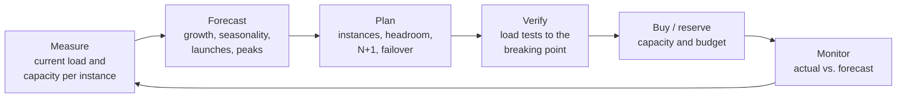

# Capacity Planning in Practice

*Forecast demand, find the real bottleneck, prove capacity with load tests, and pay only for the headroom you need.*

---

> *“An hour lost at a bottleneck is an hour lost for the entire system.”*
>
> — **Eliyahu M. Goldratt**, *The Goal*, 1984

## At a Glance

> **In one sentence:** Capacity planning in practice is a regular cycle — measure how much load each resource can handle, forecast demand including peaks and growth, keep headroom because latency explodes near full utilization, verify limits with load tests, and balance reliability against cost.

**You'll learn**

- The capacity planning cycle used by production teams
- Forecasting: trends, seasonality, launches, and peak-to-average ratios
- Why latency rises sharply near full utilization (queueing)
- Finding capacity per instance and identifying the true bottleneck
- Load testing: types, design, and common pitfalls
- N+1 redundancy, regional failover capacity, and cost trade-offs

**Before you start:** [Auto-scaling and Capacity Planning](../08-Scalability/Auto-scaling-and-Capacity-Planning.md) · [The Life of a Production Request](The-Life-Of-A-Production-Request.md)

**Reading time:** about 10 minutes

---

## The Big Picture



*Capacity planning is a loop, repeated monthly or quarterly — not a one-time calculation.*

---

## Introduction

A retail company knows its busiest day of the year is coming: a big annual sale. Last year, traffic peaked at 5× a normal day, and the site slowed to a crawl for two hours. This year, the team starts eight weeks early. They measure what one application instance can handle before latency degrades. They find that the real limit isn't the app servers at all — it's the connection pool on the inventory database. They forecast peak traffic from last year's data plus growth, add headroom, and plan for one region failing during the peak. Then they run load tests at 1.5× the forecast and discover a cache that collapses under the new load pattern. They fix it with three weeks to spare. On the day, peak traffic comes in 10% above forecast — and the site is fine.

Capacity planning is the discipline of turning "we hope it holds" into "we measured, we tested, and we know where it breaks."

### Why Should Engineers Care?

- Overload is one of the most common causes of outages, and the most predictable.
- Over-provisioning wastes money; cloud bills are a major engineering cost.
- Capacity numbers inform architecture decisions: when to cache, shard, or re-design.

---

## The Problem It Solves

| Question | Capacity planning answers it with |
|---------|----------------------------------|
| Will we survive next month's traffic? | Forecast + capacity per instance |
| What breaks first? | Load testing and bottleneck analysis |
| How much headroom do we need? | Queueing behavior, failover requirements, spike data |
| How much will it cost? | Instance counts × pricing, reserved vs. on-demand |
| When must we re-architect? | Projected date when a component hits its limit |

---

## Historical Background

- **1909–1917 — Queueing theory.** Agner Krarup Erlang studied telephone exchanges to decide how many lines were needed, founding queueing theory — still the mathematical basis of capacity planning.
- **1961 — Little's Law.** John Little proved that average items in a system equal arrival rate times average time in the system (L = λW).
- **1970s–1990s — Mainframe capacity planning** was a formal discipline, because hardware took months to buy and install.
- **2006 onward — Cloud computing** made capacity elastic, shifting the focus from purchasing lead times to cost, quotas, scaling speed, and headroom.
- **2010s — Load testing tools** (JMeter, Gatling, Locust, k6, and others) and production load testing practices spread widely.
- **2010s–2020s — FinOps** emerged as a practice for managing cloud costs across engineering and finance.

---

## Core Concepts

### Capacity Per Unit

Find the load one unit (instance, pod, database, shard) can handle **while meeting the SLO** — not the load at which it crashes. For example: "one API pod handles 400 requests/second at p99 < 200 ms; beyond 450, p99 exceeds the target."

### Demand Forecasting

- **Trend:** long-term growth (users, usage per user).
- **Seasonality:** daily, weekly, and yearly patterns.
- **Events:** launches, marketing campaigns, sales, news.
- **Peak-to-average ratio:** plan for peaks, not averages.

A simple forecast often fits growth in log space (exponential growth becomes a straight line), then applies the known peak ratio.

### Utilization and the Queueing Knee

As utilization approaches 100%, queues grow and latency rises sharply. For a simple single-server queue (M/M/1), average time in the system is `W = service_time / (1 − utilization)`:

| Utilization | Latency multiplier |
|------------|-------------------|
| 50% | 2× |
| 70% | 3.3× |
| 80% | 5× |
| 90% | 10× |
| 95% | 20× |

Real systems differ in detail, but the shape — a "knee" after which latency explodes — is universal. This is why targets like 60–75% peak utilization are common.

### Headroom and Redundancy

Capacity must cover:

- the forecast peak,
- plus a margin for forecast error and sudden spikes,
- plus **N+1** (or N+2): surviving the loss of one instance, zone, or — for multi-region designs — an entire region's traffic shifting to the others.

### The Bottleneck Moves

Adding app servers moves the limit to the database; adding database replicas moves it to the cache or the network. Capacity plans must consider the whole path: app instances, connection pools, databases, caches, queues, third-party rate limits, and quotas.

### Load Testing

| Test type | Question |
|----------|---------|
| Load test | Do we meet SLOs at expected peak? |
| Stress test | Where and how do we break? |
| Soak test | Do we degrade over hours (leaks, fragmentation)? |
| Spike test | Can we absorb a sudden jump? |
| Failover test | Can remaining capacity handle a lost zone or region? |

---

## Real-World Analogy

### Planning a Highway for Holiday Traffic

Traffic engineers don't size a highway for average Tuesday traffic; they plan for holiday weekends. They know that when a road is 90% full, a single braking car causes a jam (the queueing knee). They find the real bottleneck — often one narrow bridge, not the highway itself. They plan detours for when a lane closes (N+1). And they test with real traffic counts, not guesses.

---

## How It Works In Practice

### A Quarterly Capacity Review

1. **Current state:** peak load, utilization per resource, SLO compliance, cost.
2. **Capacity per unit:** from load tests or production observation.
3. **Forecast:** next two to four quarters, including known events.
4. **Plan:** units needed = forecast peak ÷ (capacity per unit × target utilization), plus redundancy.
5. **Constraints:** cloud quotas, reserved capacity, database limits, third-party rate limits.
6. **Risks and decisions:** components projected to hit limits; re-architecture timelines.
7. **Budget:** cost projection and savings opportunities.

### Worked Example

```
Peak today:                 12,000 requests/s
Growth:                     8% per month → ×2.5 in 12 months
Known event (annual sale):  3× normal peak for 6 hours
Forecast event peak:        12,000 × 2.5 × 3 = 90,000 requests/s
Capacity per pod at SLO:    400 requests/s
Target peak utilization:    70% → 280 requests/s per pod
Pods needed:                90,000 ÷ 280 ≈ 322
Survive one of 3 zones lost: 322 × 3/2 ≈ 483 pods across 3 zones
Database: writes scale with orders; current primary max ~15,000 writes/s at SLO;
          forecast event writes 22,000/s → needs sharding or write batching before the sale.
```

The last line is the most valuable output: it identifies a **re-architecture deadline** months in advance.

### Designing a Load Test

- **Realistic traffic mix:** the same ratio of endpoints, payload sizes, and cache hit patterns as production. Replaying anonymized production traffic is ideal.
- **Realistic data volume:** a test database with 1% of production data hides slow queries.
- **Ramp gradually** and record the point where latency crosses the SLO, not just where errors start.
- **Watch every tier**, including third-party dependencies (use stubs or coordinate with the provider).
- **Run long enough** to see leaks and warm-up effects.
- **Test failover** under load.

### Cost Levers

- **Right-size** over-provisioned instances.
- **Reserved or committed capacity** for predictable baseline load; on-demand or spot capacity for peaks and batch work.
- **Autoscaling** to follow daily patterns.
- **Efficiency work** (caching, query optimization) often reduces cost more than any purchasing decision.

---

## Production Engineering Perspective

- **Plan for the peak, operate at the average.** Autoscaling handles daily patterns; reserved capacity handles the floor; pre-scaling handles known events.
- **Quotas are capacity.** Cloud account limits, API rate limits, and IP address ranges can block scaling during an emergency. Request increases in advance.
- **Track forecast accuracy.** Compare last quarter's forecast with reality to improve the next one.
- **Capacity SLOs:** "p99 < 200 ms at forecast peak with one zone down" is a testable requirement.
- **Make capacity visible:** dashboards showing utilization against planned headroom per critical resource.

---

## Tradeoffs

| Choice | Benefit | Cost |
|-------|--------|-----|
| More headroom | Survives spikes and failures | Higher cost |
| Higher target utilization | Lower cost | Latency spikes; fragile under failure |
| Reserved capacity | Lower unit cost | Commitment; less flexibility |
| On-demand / spot | Flexibility | Higher price (on-demand) or interruption (spot) |
| Production load testing | Realistic results | Risk to real users; careful isolation needed |
| Synthetic load testing | Safe | May miss real traffic patterns |

---

## Common Mistakes

### Beginner Mistakes

- Planning from average traffic instead of peaks.
- Measuring capacity at the crash point instead of at the SLO.
- Load testing with tiny datasets or a single endpoint.

### Intermediate Mistakes

- Scaling the app tier while the database or a connection pool is the bottleneck.
- Forgetting failover capacity (the zone or region that must absorb traffic).
- Ignoring cloud quotas and third-party rate limits.

### Senior-Level Mistakes

- No link between capacity forecasts and architecture roadmaps, so limits are hit before redesigns are ready.
- Treating cost and capacity as separate conversations.
- Running at very high utilization to save money and paying for it in incidents.

---

## Failure Scenarios

### Scenario 1: The Hidden Pool Limit

App servers scale from 50 to 150 during a spike; each opens 20 database connections; the database's connection limit is exceeded and new connections fail.

**Mitigation:** connection poolers, per-service connection budgets, and capacity plans that include connection counts.

### Scenario 2: The Quota Wall

During a traffic surge, autoscaling requests more instances but the cloud account's instance quota is reached. Scaling stops at the worst moment.

**Mitigation:** track quotas as capacity; request increases ahead of forecast needs.

### Scenario 3: The Unrealistic Load Test

A load test passes easily at 3× peak, but it hit only one endpoint with cached responses. On the real sale day, uncached search queries overwhelm the database.

**Mitigation:** realistic traffic mix and data; replay production traffic where possible.

### Scenario 4: Failover Into Overload

A zone fails; its traffic shifts to the remaining two zones, which were each at 80% utilization. They overload and fail too.

**Mitigation:** plan utilization so that surviving zones can absorb a lost zone's traffic.

---

## Real-World Industry Examples

- **Retailers and marketplaces** (for example, Shopify for Black Friday/Cyber Monday) describe months of load testing and capacity preparation for predictable peaks.
- **Google's SRE book** discusses demand forecasting, provisioning, and load testing as core SRE responsibilities.
- **Cloud providers** publish quota and limit documentation, reflecting that quotas are part of capacity.
- **The FinOps Foundation** documents practices for managing cloud cost as an engineering concern.

---

## Interview Questions

### Beginner

**Q1: Why plan capacity for peaks instead of averages?**

*Model answer:* Users experience the system at its busiest moments, and traffic peaks can be several times the average. Capacity sized for the average fails exactly when the most users are present.

### Intermediate

**Q2: Why not run servers at 95% utilization to save money?**

*Model answer:* Queueing delay grows sharply as utilization approaches 100%, so latency becomes very high and unstable, and there's no headroom for spikes or for absorbing traffic when an instance or zone fails. Targets around 60–75% at peak balance cost and reliability.

**Q3: How do you determine capacity per instance?**

*Model answer:* Load test one instance (or observe production) with a realistic traffic mix, increasing load until the SLO (for example, p99 latency) is violated. The capacity is the highest load that still meets the SLO, not the crash point.

### Senior

**Q4: How would you prepare for a traffic event expected to be 5× normal peak?**

*Model answer:* Forecast the event's shape, measure per-component capacity, identify every bottleneck along the request path (including databases, pools, caches, quotas, and third parties), fix or scale them, load test at 1.5–2× the forecast with realistic traffic and a failover scenario, pre-scale, set up feature flags to shed non-essential load, and run a readiness review with on-call plans.

### Architecture / Leadership

**Q5: How do you connect capacity planning to cost and architecture decisions?**

*Model answer:* Review capacity quarterly with forecasts per critical component, projected dates when each hits its limit, and cost projections. Components nearing their limit become roadmap items with deadlines. Cost optimization (right-sizing, reserved capacity, efficiency work) is reviewed alongside, so reliability and spending are decided together.

---

## Hands-On Lab

Forecast demand, size a fleet, and see the queueing knee. Pure Python; save as `capacity_lab.py` and run it.

```python
import math

# 1) Forecast: fit exponential growth to 12 months of peak traffic (requests/second)
monthly_peaks = [5000, 5350, 5800, 6200, 6750, 7200, 7850, 8400, 9100, 9800, 10600, 11500]
xs, ys = range(len(monthly_peaks)), [math.log(v) for v in monthly_peaks]
n = len(monthly_peaks)
slope = (n * sum(x * y for x, y in zip(xs, ys)) - sum(xs) * sum(ys)) / \
        (n * sum(x * x for x in xs) - sum(xs) ** 2)
intercept = (sum(ys) - slope * sum(xs)) / n
growth = math.exp(slope) - 1
forecast_12 = math.exp(intercept + slope * (n - 1 + 12))
print(f"growth ~ {growth:.1%} per month; peak in 12 months ~ {forecast_12:,.0f} req/s")

# 2) Size the fleet
event_multiplier = 3            # annual sale
per_pod_at_slo = 400
target_util = 0.70
zones = 3
peak = forecast_12 * event_multiplier
pods = math.ceil(peak / (per_pod_at_slo * target_util))
pods_with_zone_loss = math.ceil(pods * zones / (zones - 1))
print(f"event peak ~ {peak:,.0f} req/s -> {pods} pods, {pods_with_zone_loss} to survive losing a zone")

# 3) The queueing knee (M/M/1): latency multiplier = 1 / (1 - utilization)
service_ms = 20
for util in [0.5, 0.7, 0.8, 0.9, 0.95, 0.99]:
    print(f"utilization {util:4.0%}: average latency {service_ms / (1 - util):7.0f} ms")
```

**What to notice**
- About 8% monthly growth more than doubles peak traffic in a year — plans made from today's numbers are obsolete quickly.
- Surviving a zone loss adds 50% to the fleet when you have three zones. Redundancy is a large, real cost.
- Latency is fine at 50–70% utilization, then climbs steeply: at 95% it's twenty times the service time. That curve is why "just run hotter to save money" backfires.

---

## Test Yourself

*Answer each question in your head or on paper first, then open the answer to check.*

<details markdown="1">
<summary><strong>1. What is "capacity per unit," and at what point should you measure it?</strong></summary>

The load one instance or component can handle — measured at the point where it still meets its SLO (for example, p99 latency), not where it crashes.

</details>

<details markdown="1">
<summary><strong>2. In an M/M/1 queue, how much higher is average latency at 90% utilization than the bare service time?</strong></summary>

About 10× (service time ÷ (1 − 0.9)).

</details>

<details markdown="1">
<summary><strong>3. What does N+1 mean in capacity planning?</strong></summary>

Having enough capacity to meet demand even after losing one unit (instance, zone, or region), so a single failure doesn't cause overload.

</details>

<details markdown="1">
<summary><strong>4. Name four types of load test.</strong></summary>

Load, stress, soak, and spike tests (plus failover tests under load).

</details>

<details markdown="1">
<summary><strong>5. Why include cloud quotas in capacity plans?</strong></summary>

Quotas cap how many resources you can create; hitting one during a surge stops scaling exactly when it's needed.

</details>

<details markdown="1">
<summary><strong>6. State Little's Law.</strong></summary>

L = λW: the average number of items in a system equals the arrival rate multiplied by the average time each spends in it.

</details>

<details markdown="1">
<summary><strong>7. What makes a load test realistic?</strong></summary>

A production-like traffic mix and payloads, realistic data volume and cache behavior, gradual ramps, long enough duration, all tiers observed, and failover scenarios included.

</details>

---

## Cheat Sheet

**Cycle:** measure → forecast → plan → verify (load test) → buy/reserve → monitor → repeat.

**Sizing formula:** units = forecast peak ÷ (capacity per unit at SLO × target utilization) → then add N+1 / zone / region failover.

**Queueing knee (M/M/1):** latency ≈ service time ÷ (1 − utilization) → 50%: 2× · 80%: 5× · 90%: 10× · 95%: 20×.

| Check every tier | Examples |
|-----------------|---------|
| Compute | Pods, instances, CPU, memory |
| Data | DB writes/s, connections, storage growth, replica lag |
| Caches and queues | Memory, hit rate, consumer throughput |
| Limits | Cloud quotas, API rate limits, IP ranges, licenses |

**Rules:** plan for peaks · target 60–75% peak utilization · test at 1.5–2× forecast · include failover capacity · track forecast accuracy.

---

## In the AI Era

- **Plan in tokens and GPUs.** For AI features, capacity means tokens per minute from providers, concurrent generations, and GPU memory for self-hosted models. Provider rate limits *are* your capacity ceiling; request increases before launches.
- **Queueing matters even more** because model calls are long: at a given request rate, more requests are in flight (Little's Law), so concurrency limits and queues must be sized for seconds, not milliseconds.
- **Cost forecasting is part of capacity planning.** Tokens per request × requests × price turns a usage forecast into a budget; model routing and caching are capacity and cost levers at once.
- **AI can help forecast** by analyzing usage trends and anomalies, but the plan should still be grounded in measured per-unit capacity and load tests.

**Try it:** Extend the lab: each request uses 1,800 input and 300 output tokens. Convert the event-peak forecast into tokens per minute and compare it with a provider rate limit you know.

---

## Key Takeaways

1. Capacity planning is a recurring loop: measure, forecast, plan, verify, buy, monitor.
2. Measure capacity per unit at the SLO, and plan for peaks, events, and growth.
3. Keep headroom: latency rises sharply near full utilization.
4. Include redundancy for instance, zone, and region failures.
5. Load tests must be realistic in traffic mix, data, and duration.
6. Check every tier and limit — databases, pools, quotas, third parties — because the bottleneck moves.
7. Decide capacity and cost together, and connect projected limits to architecture plans.

---

## What to Read Next

- **[SLOs in Practice](SLOs-In-Practice.md)** — the targets capacity must protect
- **[Operating LLM Features](Operating-LLM-Features.md)** — capacity and cost for AI workloads
- **[Auto-scaling and Capacity Planning](../08-Scalability/Auto-scaling-and-Capacity-Planning.md)** — scaling signals and automation

---

## Further Reading

- **Google SRE Book — "Software Engineering in SRE" (capacity planning case study) and "Handling Overload":** [https://sre.google/sre-book/table-of-contents/](https://sre.google/sre-book/table-of-contents/)
- **Neil J. Gunther — "Guerrilla Capacity Planning" (2007)**
- **Mor Harchol-Balter — "Performance Modeling and Design of Computer Systems: Queueing Theory in Action" (2013)**
- **John Little — "A Proof for the Queuing Formula: L = λW" (Operations Research, 1961)**
- **FinOps Foundation — FinOps Framework:** [https://www.finops.org](https://www.finops.org)
- **k6 and Locust load testing documentation:** [https://k6.io/docs/](https://k6.io/docs/) · [https://locust.io](https://locust.io)

---

*This chapter is part of the Modern Software Engineering Handbook — a comprehensive guide to the concepts, principles, and practices that every professional software engineer should know.*
