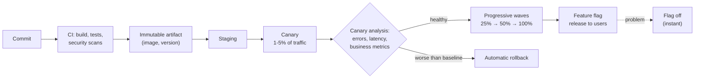

# Deployments: Strategies and Risks

*Most outages start with a change. Deploying well means making every change small, observable, gradual, and quick to undo.*

---

> *“If it hurts, do it more frequently, and bring the pain forward.”*
>
> — **Jez Humble and David Farley**, *Continuous Delivery*, 2010

## At a Glance

> **In one sentence:** Safe deployment separates *deploying* code from *releasing* features, rolls changes out gradually — rolling, blue-green, canary, feature flags — while automatically comparing health against a baseline, and keeps rollback (including for database and configuration changes) fast and rehearsed.

**You'll learn**

- Why deployments are the biggest source of production risk — and how frequency reduces it
- Rolling, blue-green, canary, and shadow deployments
- Feature flags and separating deploy from release
- Automated canary analysis and rollback
- Safe database migrations (expand and contract)
- Configuration changes as deployments

**Before you start:** [Why Systems Go Down](../10-Reliability/Why-Systems-Go-Down.md) · [The Life of a Production Request](The-Life-Of-A-Production-Request.md)

**Reading time:** about 10 minutes

---

## The Big Picture



*Code reaches production in small, verified steps; features reach users behind flags that can be turned off in seconds.*

---

## Introduction

For many years, a common way to deploy was the "big bang" release: months of changes bundled together, deployed on a weekend, with everyone on call. When something broke — and something always did — nobody knew which of the hundreds of changes caused it, and rolling back meant losing everything.

High-performing teams do the opposite. They deploy **many times a day**, each deployment containing a small change. Each change reaches a small share of users first, is automatically compared with the old version, and is rolled back in minutes if anything looks worse. Features are hidden behind flags and turned on separately, so shipping code and exposing features are two different decisions.

Research by the DORA program (published in *Accelerate*, 2018) found that teams deploying frequently also have *lower* change failure rates and faster recovery. Speed and stability aren't opposites; small, frequent, well-verified changes deliver both.

### Why Should Engineers Care?

- Changes cause most outages; how you deploy decides how big those outages get.
- Good deployment practices let you ship faster *and* sleep better.
- Every engineer who merges code relies on — and should understand — the deployment system.

---

## The Problem It Solves

| Risk | Deployment practice that contains it |
|-----|-------------------------------------|
| A bug reaches every user at once | Canary and progressive rollouts |
| Hard to know which change broke things | Small, frequent deployments |
| Slow recovery | Automated rollback; instant flag toggles |
| Downtime during deploy | Rolling or blue-green deploys with draining |
| Schema change breaks old code | Expand-and-contract migrations |
| "Harmless" config change breaks everything | Treat config like code: review, stage, roll out gradually |

---

## Historical Background

- **1990s–2000s — Release trains and maintenance windows.** Infrequent, large releases with planned downtime were the norm.
- **2001 — Agile Manifesto** encouraged frequent delivery of working software.
- **2006 — Continuous integration** was popularized by Martin Fowler's writing; automated builds and tests on every commit became standard.
- **2009 — "10+ Deploys per Day"** — John Allspaw and Paul Hammond's talk about Flickr helped launch the DevOps movement.
- **2010 — *Continuous Delivery*** by Jez Humble and David Farley described deployment pipelines and keeping software always releasable.
- **2010s — Canary analysis at scale.** Companies automated canary comparison; Netflix and Google open-sourced Kayenta (2018) for automated canary analysis.
- **2018 — *Accelerate*** by Nicole Forsgren, Jez Humble, and Gene Kim presented the DORA metrics: deployment frequency, lead time for changes, change failure rate, and time to restore service.

---

## Core Concepts

### Deploy vs. Release

- **Deploy:** put new code on production servers.
- **Release:** make a feature available to users.

Separating them with **feature flags** means code can be deployed dark (turned off), tested internally, released to 1% of users, and turned off instantly without redeploying.

### Deployment Strategies

| Strategy | How it works | Rollback | Cost |
|---------|-------------|---------|-----|
| **Recreate** | Stop old, start new | Redeploy old | Downtime |
| **Rolling** | Replace instances a few at a time | Roll forward/back gradually | Low; mixed versions during rollout |
| **Blue-green** | Run the new version (green) beside the old (blue), then switch traffic | Switch back instantly | Double capacity during switch |
| **Canary** | Send a small share of traffic to the new version, compare, expand | Stop and shift traffic back | Needs good metrics and routing |
| **Shadow (dark launch)** | Copy real traffic to the new version without returning its responses | Nothing to roll back | Extra load; careful with side effects |

### Canary Analysis

Compare the canary against a **baseline** (old version, same traffic share, same time window) on:

- error rates and latency percentiles,
- resource usage (CPU, memory, crashes),
- business metrics (checkouts, sign-ins, playback starts).

Use statistical comparison, not eyeballing. If the canary is significantly worse, roll back automatically.

### Progressive Delivery

Roll out in **waves**: one availability zone or region at a time, internal users first, then small percentages, with bake time between waves. A bad change should hit a small, recoverable blast radius.

### Database Migrations: Expand and Contract

During a rollout, old and new code run at the same time, so schema changes must work with both:

1. **Expand:** add the new column or table (nullable, unused). Old code ignores it.
2. **Migrate:** deploy code that writes to both old and new; backfill existing data.
3. **Switch:** deploy code that reads from the new structure.
4. **Contract:** after all old code is gone, remove the old column.

Never rename or drop a column in the same deployment that stops using it.

### Configuration Is Code

Feature flags, routing rules, rate limits, and firewall rules change behavior as much as code does. They need version control, review, validation, staged rollout, and audit logs.

### DORA Metrics

| Metric | What it measures |
|-------|-----------------|
| Deployment frequency | How often you deploy |
| Lead time for changes | Commit to production |
| Change failure rate | Share of deployments causing failures |
| Time to restore service | How fast you recover |

---

## Real-World Analogy

### Changing Tires on a Moving Bus — One Wheel at a Time

You can't stop the bus (production), so you change one tire at a time (rolling deploy), watching the ride after each (canary analysis). If a new tire wobbles, you swap the old one back before touching the others (rollback). Better still, you keep a second bus running beside the first and move passengers over only when it's proven smooth (blue-green). And some new features — like a new radio — you install switched off, turning them on for a few passengers first (feature flags).

---

## How It Works In Practice

### A Deployment Pipeline

1. **Commit** triggers CI: build, unit and integration tests, static analysis, dependency and security scans.
2. **Artifact:** build once, produce an immutable, versioned artifact (container image), promoted unchanged through environments.
3. **Staging:** deploy and run smoke and end-to-end tests.
4. **Canary:** deploy to a small share of production; compare with baseline for a bake period.
5. **Waves:** expand by zone or region with automated checks at each step.
6. **Release:** enable features with flags, gradually.
7. **Clean up:** remove old flags and code paths once a feature is fully launched.

### Automated Rollback Criteria (example)

```
Roll back automatically if, over 10 minutes, compared with baseline:
  - HTTP 5xx rate is higher with statistical significance, or > 2× baseline
  - p99 latency is > 20% higher
  - crash/restart count increases
  - checkout success rate drops by more than 1 percentage point
```

### Feature Flag Rollout

```
Day 1:  internal employees
Day 2:  1% of users (consistent by user ID, so each user has a stable experience)
Day 3:  10%   → watch metrics and support tickets
Day 5:  50%
Day 7:  100%  → schedule removal of the flag and old code
```

### When to Freeze

Change freezes during peak events (sales, launches, holidays) reduce risk but delay fixes. Many teams instead use **heightened caution**: only small, low-risk changes, extra reviewers, slower rollouts.

---

## Production Engineering Perspective

- **Rollback must be fast and practiced.** If rolling back takes an hour, you'll hesitate to do it. Aim for minutes, one command or one button.
- **Roll forward vs. roll back:** rolling back is usually safer during an incident; fix forward only when rollback is impossible (for example, after an irreversible data change).
- **Deploy during working hours** with the author available, not late Friday night.
- **Every deploy is an event** on dashboards, so metric changes can be correlated with it.
- **Flag debt:** old flags become confusing, risky code paths. Track and remove them.
- **Mixed versions:** during rolling deploys, old and new versions run together — APIs, message formats, and caches must be compatible in both directions.

---

## Tradeoffs

| Choice | Benefit | Cost |
|-------|--------|-----|
| Frequent small deploys | Easy diagnosis, low risk per change | Needs strong automation |
| Canary | Small blast radius, real traffic validation | Metrics and routing infrastructure; slower rollout |
| Blue-green | Instant switch and rollback | Double capacity; database is still shared |
| Feature flags | Decouple release; instant off | Complexity, flag debt, testing combinations |
| Long bake times | Catch slow-burning problems | Slower delivery |
| Change freezes | Fewer incidents at peaks | Pent-up risk after the freeze |

---

## Common Mistakes

### Beginner Mistakes

- Deploying to all servers at once.
- Building different artifacts for staging and production.
- No way to roll back quickly.

### Intermediate Mistakes

- Dropping or renaming a column while old code still uses it.
- Canary checks that only look at errors, missing latency or business metrics.
- Configuration changes pushed globally without review or staging.

### Senior-Level Mistakes

- Measuring success by deployment speed alone, ignoring change failure rate.
- Letting feature flags accumulate for years.
- Deploy tooling that itself has no staged rollout or rollback.

---

## Failure Scenarios

### Scenario 1: The Global Config Push

A new rate-limit setting is pushed to every region at once and blocks legitimate traffic worldwide.

**Mitigation:** staged config rollouts, validation, canarying config like code.

### Scenario 2: The Incompatible Migration

A deploy renames a database column. Old instances still running during the rollout crash on every query.

**Mitigation:** expand-and-contract migrations across multiple deploys.

### Scenario 3: The Slow Leak

A new version has a memory leak that only shows after six hours. The canary baked for 30 minutes and passed; all instances run out of memory overnight.

**Mitigation:** longer bake times for risky changes, memory growth checks in canary analysis, and alerts on restarts.

### Scenario 4: The Missing Business Metric

A change breaks the "apply coupon" button on mobile. No errors, no latency change — just fewer successful checkouts. The canary passes because it only checks technical metrics.

**Mitigation:** include business metrics in canary analysis and dashboards.

---

## Real-World Industry Examples

- **Flickr's 2009 talk** "10+ Deploys per Day" showed that frequent deployment and stability can coexist.
- **Netflix and Google** open-sourced Kayenta for automated canary analysis, integrated with the Spinnaker deployment platform.
- **Facebook** has described deploying its web code continuously, with changes rolled out progressively and controlled by feature gates.
- **The DORA research program** has published annual State of DevOps reports showing the link between delivery performance and organizational performance.

---

## Interview Questions

### Beginner

**Q1: What's the difference between deploying and releasing?**

*Model answer:* Deploying puts new code on production servers; releasing makes a feature available to users. Feature flags separate the two, so code can be deployed turned off and released gradually — or turned off instantly — without another deploy.

### Intermediate

**Q2: Compare blue-green and canary deployments.**

*Model answer:* Blue-green runs a full new environment beside the old and switches all traffic at once, with instant rollback by switching back; it needs double capacity. Canary sends a small share of traffic to the new version, compares metrics with the baseline, and expands gradually; it limits blast radius and validates with real traffic but needs good routing and metrics.

**Q3: How do you rename a database column without downtime?**

*Model answer:* Expand and contract: add the new column; deploy code that writes to both; backfill; deploy code that reads from the new column; after all old code is gone, stop writing the old column and finally drop it — across several deploys.

### Senior

**Q4: What would you include in automated canary analysis?**

*Model answer:* A same-sized baseline running the old version at the same time; statistical comparison of error rates, latency percentiles, saturation, crashes, and key business metrics; minimum traffic and duration for significance; automatic rollback on significant degradation; and extended bake time for changes with slow failure modes.

### Architecture / Leadership

**Q5: Your team deploys once a month and every release causes an incident. How do you improve?**

*Model answer:* Move toward smaller, more frequent deploys: invest in CI and test reliability, build immutable artifacts, automate deployment, add canary analysis and one-step rollback, introduce feature flags to decouple release, and adopt expand-and-contract for schema changes. Track DORA metrics to show progress. The goal is to make deploys boring.

---

## Hands-On Lab

Simulate canary analysis: can a 5% canary catch a bad release before it reaches everyone? Pure Python; save as `canary_lab.py` and run it.

```python
import math, random, hashlib
random.seed(9)

def serve(requests, error_rate):
    return sum(random.random() < error_rate for _ in range(requests))

def z_test(err_a, n_a, err_b, n_b):
    """Two-proportion z-test: how many standard errors worse is B than A?"""
    pa, pb = err_a / n_a, err_b / n_b
    pooled = (err_a + err_b) / (n_a + n_b)
    se = math.sqrt(pooled * (1 - pooled) * (1 / n_a + 1 / n_b)) or 1e-9
    return (pb - pa) / se

def canary(new_error_rate, traffic_per_min=20_000, share=0.05, minutes=10, old_error_rate=0.002):
    n = int(traffic_per_min * share * minutes)                 # requests to canary (and to baseline)
    base_err = serve(n, old_error_rate)
    can_err = serve(n, new_error_rate)
    z = z_test(base_err, n, can_err, n)
    verdict = "ROLL BACK" if z > 3 else "promote"
    print(f"new error rate {new_error_rate:.2%}: baseline {base_err}/{n}, canary {can_err}/{n}, "
          f"z = {z:5.1f} -> {verdict}")

canary(0.002)     # identical release
canary(0.004)     # twice as many errors
canary(0.0025)    # slightly worse: hard to detect in 10 minutes
canary(0.0025, minutes=60)

# Feature-flag bucketing: stable per user, so each user sees a consistent experience
def in_rollout(user_id, percent, flag="new-checkout"):
    bucket = int(hashlib.sha256(f"{flag}:{user_id}".encode()).hexdigest(), 16) % 100
    return bucket < percent

users = [f"user{i}" for i in range(10_000)]
print("\n1% rollout:", sum(in_rollout(u, 1) for u in users), "users;",
      "10% rollout:", sum(in_rollout(u, 10) for u in users), "users;",
      "everyone in the 1% group is also in the 10% group:",
      all(in_rollout(u, 10) for u in users if in_rollout(u, 1)))
```

**What to notice**
- A clearly bad release (double the error rate) is caught quickly from just 5% of traffic, and rolled back before 95% of users see it.
- A slightly worse release is hard to distinguish from noise in 10 minutes; longer bake times (or more traffic) make it detectable. Canary analysis is statistics — plan the traffic and duration you need.
- Hash-based bucketing gives each user a stable experience, and growing the percentage only *adds* users — nobody flips back and forth.

---

## Test Yourself

*Answer each question in your head or on paper first, then open the answer to check.*

<details markdown="1">
<summary><strong>1. Why do frequent small deploys reduce risk?</strong></summary>

Each change is small and easy to understand, problems are easy to attribute to a specific change, and rollback loses little. Teams also get more practice, making the process reliable.

</details>

<details markdown="1">
<summary><strong>2. What is a canary deployment?</strong></summary>

Releasing a new version to a small share of production traffic, comparing it with the old version, and expanding only if it's healthy.

</details>

<details markdown="1">
<summary><strong>3. What are the four DORA metrics?</strong></summary>

Deployment frequency, lead time for changes, change failure rate, and time to restore service.

</details>

<details markdown="1">
<summary><strong>4. What does expand-and-contract mean for database changes?</strong></summary>

Add new structures first, migrate code and data in steps while both old and new versions work, and remove old structures only after nothing uses them.

</details>

<details markdown="1">
<summary><strong>5. Why include business metrics in canary analysis?</strong></summary>

Some bugs cause no errors or latency changes but break user outcomes (fewer checkouts, sign-ins). Only business metrics catch them.

</details>

<details markdown="1">
<summary><strong>6. What is flag debt?</strong></summary>

Old, fully launched or abandoned feature flags that remain in code, adding complexity and untested paths. Remove flags once a rollout is complete.

</details>

<details markdown="1">
<summary><strong>7. Why hash user IDs for percentage rollouts?</strong></summary>

It gives each user a stable, consistent experience, and increasing the percentage only adds users rather than reshuffling them.

</details>

---

## Cheat Sheet

| Strategy | Use when |
|---------|---------|
| Rolling | Default for stateless services |
| Blue-green | You need instant switch and rollback |
| Canary | You want real-traffic validation with small blast radius |
| Shadow | Testing performance or correctness without user impact |
| Feature flags | Separating release from deploy; gradual exposure; kill switches |

**Pipeline:** commit → CI → immutable artifact → staging → canary + analysis → waves → flag release → flag cleanup.

**Migrations:** expand → dual-write + backfill → switch reads → contract.

**Rules:** small changes · build once · automate rollback · deploy in working hours · config is code · bake time proportional to risk · watch business metrics.

---

## In the AI Era

- **More changes, faster.** AI assistants increase the number of changes; staged rollouts and automated analysis are what keep change failure rate from rising with them.
- **Prompts and model versions are deployments.** Version them, canary them, compare quality metrics (not just errors) against the baseline, and keep rollback one step away. See [Evaluating AI Systems](../15-AI-Era-Engineering/Evaluating-AI-Systems.md).
- **Quality canaries need more data.** AI quality differences are subtle and noisy; evaluate offline first, then canary with enough traffic and a quality SLI.
- **Agents deploying code** must go through the same pipeline and gates as humans — no direct pushes to production.

**Try it:** Adapt the lab to compare "answer accepted by user" rates between an old and new prompt version. How many conversations would you need to detect a 2-point drop?

---

## Key Takeaways

1. Changes cause most outages; small, frequent, gradual changes contain them.
2. Separate deploy from release with feature flags.
3. Use canary analysis with baselines and statistics, including business metrics, and roll back automatically.
4. Make rollback fast and rehearsed; prefer rolling back during incidents.
5. Change database schemas with expand-and-contract across multiple deploys.
6. Treat configuration and prompts as code: reviewed, staged, and reversible.
7. Track DORA metrics to improve both speed and stability.

---

## What to Read Next

- **[Incident Response and Postmortems](Incident-Response-And-Postmortems.md)** — when a deploy goes wrong anyway
- **[SLOs in Practice](SLOs-In-Practice.md)** — the targets canary analysis protects
- **[Why Systems Go Down](../10-Reliability/Why-Systems-Go-Down.md)** — why change is the top trigger

---

## Further Reading

- **Jez Humble & David Farley — "Continuous Delivery" (2010)**
- **Nicole Forsgren, Jez Humble & Gene Kim — "Accelerate" (2018)** and the DORA research: [https://dora.dev](https://dora.dev)
- **John Allspaw & Paul Hammond — "10+ Deploys per Day: Dev and Ops Cooperation at Flickr" (Velocity 2009)**
- **Google SRE Workbook — "Canarying Releases":** [https://sre.google/workbook/canarying-releases/](https://sre.google/workbook/canarying-releases/)
- **Martin Fowler — "Feature Toggles (aka Feature Flags)":** [https://martinfowler.com/articles/feature-toggles.html](https://martinfowler.com/articles/feature-toggles.html)
- **Martin Fowler — "ParallelChange" (expand and contract):** [https://martinfowler.com/bliki/ParallelChange.html](https://martinfowler.com/bliki/ParallelChange.html)

---

*This chapter is part of the Modern Software Engineering Handbook — a comprehensive guide to the concepts, principles, and practices that every professional software engineer should know.*
