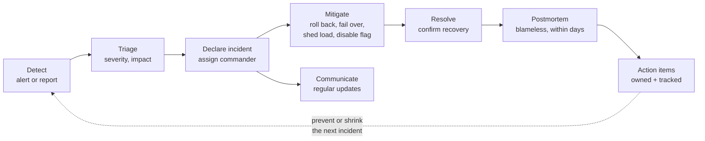

# Incident Response and Postmortems

*When production breaks, calm structure beats heroics — and what you learn afterward matters more than how you felt during it.*

---

> *“You build it, you run it.”*
>
> — **Werner Vogels**, Amazon CTO, in "A Conversation with Werner Vogels," *ACM Queue*, 2006

## At a Glance

> **In one sentence:** Good incident response detects problems through user-focused alerts, declares an incident early, assigns clear roles, mitigates impact before diagnosing root causes, communicates on a steady rhythm — and afterward, a blameless postmortem turns the incident into tracked improvements.

**You'll learn**

- Severity levels and when to declare an incident
- Incident roles: commander, operations, communications, scribe
- The response loop: detect, triage, mitigate, resolve, learn
- Mitigation techniques that work under pressure
- Internal and external communication during incidents
- How to write a blameless postmortem that leads to real change
- On-call practices that stay sustainable

**Before you start:** [Why Systems Go Down](../10-Reliability/Why-Systems-Go-Down.md) · [Observability](../10-Reliability/Observability-Monitoring-Alerting-And-Debugging.md)

**Reading time:** about 10 minutes

---

## The Big Picture



*Response stops the bleeding; the postmortem makes the next incident less likely or less painful.*

---

## Introduction

At 11:40 p.m., alerts fire: login failures are rising. Three engineers join a chat channel. One is restarting services. Another is reading logs. A third is posting updates to a customer channel — different from what the first two believe is happening. A manager asks for an ETA every five minutes. Someone deploys a fix that makes things worse. Two hours later, the incident ends, mostly because someone happened to roll back the right change.

Compare a different team. The first responder sees the page, checks the dashboard, and declares a SEV-2 within five minutes. An incident commander is named. Operations looks at recent changes: a deploy at 11:32. The commander decides to roll back first and investigate later. Communications posts a status update every 20 minutes. Recovery is confirmed by 12:05. Two days later, a blameless postmortem finds that the canary didn't check login success rate; an action item adds it.

The second team isn't smarter. It has a **process**, practiced in advance, that works when people are tired and stressed.

### Why Should Engineers Care?

- Every engineer with production code will be part of incidents — as responder, author of the change, or on-call.
- Clear roles and practiced steps reduce outage length, which matters more to users than how often you fail.
- Postmortems are the most effective mechanism organizations have for getting more reliable over time.

---

## The Problem It Solves

| Without a process | With a process |
|------------------|---------------|
| Unclear who's in charge | One incident commander |
| Everyone debugging the same thing | Roles and delegated tasks |
| Fixing before stopping the bleeding | Mitigation first |
| Confusing, inconsistent updates | One voice, regular cadence |
| Blame and hidden mistakes | Blameless learning |
| Same incident repeats | Tracked action items |

---

## Historical Background

- **1968–1970s — Incident Command System (ICS).** Developed in California after large wildfires revealed coordination failures among agencies; it defined clear roles and a single incident commander. Software incident management borrowed heavily from it.
- **Aviation safety culture.** Crash investigations focused on systemic causes and non-punitive reporting (for example, the Aviation Safety Reporting System, established in 1976), influencing blameless postmortems.
- **2000s — Web operations.** As online services grew, companies formalized on-call rotations, status pages, and incident reviews.
- **2012 — "Blameless PostMortems and a Just Culture."** John Allspaw's essay at Etsy popularized blameless postmortems in tech.
- **2016 — Google's SRE book** described incident management roles and postmortem culture in detail.
- **2010s–2020s — Public postmortems** from companies such as Cloudflare, GitHub, AWS, and GitLab normalized transparency after major incidents.

---

## Core Concepts

### Severity Levels

| Severity | Typical definition | Response |
|---------|-------------------|---------|
| SEV-1 | Critical: major user impact, data loss, security breach, revenue loss | All hands, executive notification, public status updates |
| SEV-2 | Significant: important feature degraded for many users | Incident commander, on-call teams, status page |
| SEV-3 | Minor: limited impact, workaround exists | Handled by owning team, tracked |
| SEV-4 | Low: no user impact yet | Ticket |

Define severities by **user impact**, in writing, before you need them. When unsure, declare higher and downgrade later.

### Roles

| Role | Responsibility |
|-----|---------------|
| **Incident commander (IC)** | Coordinates, decides, delegates; does not debug hands-on |
| **Operations lead** | Directs technical investigation and mitigation |
| **Communications lead** | Status page, customer and stakeholder updates |
| **Scribe** | Timeline of observations, decisions, and actions |
| **Subject-matter experts** | Pulled in by the IC as needed |

In small incidents, one person may hold several roles — but the IC role should be explicit.

### Mitigate First

The goal during an incident is to **stop user impact**, not to find the root cause. Common mitigations:

- Roll back the most recent change (deploy, config, flag)
- Disable a feature flag or kill switch
- Fail over to another region or replica
- Shed load or rate-limit abusive traffic
- Scale up capacity
- Restart a stuck component (knowing it may only buy time)

Diagnosis continues after impact is stopped.

### Communication Rhythm

- Internal updates at a fixed cadence (for example, every 15–30 minutes), even if the update is "no change."
- Status page updates for customer-facing impact.
- A single channel for the incident; side conversations summarized there.
- Updates state: current impact, what's being done, next update time.

### Blameless Postmortems

A postmortem documents what happened and what will change. It assumes people made reasonable decisions with the information they had. Typical sections:

1. Summary and impact (who, how many, how long, how bad)
2. Timeline (detection, key decisions, mitigation, resolution)
3. Contributing factors (not a single "root cause")
4. What went well; what went poorly; where we got lucky
5. Action items with owners and due dates (prevent, detect faster, mitigate faster)

### Incident Metrics

| Metric | Measures |
|-------|---------|
| Time to detect (TTD) | Start of impact → first alert or report |
| Time to acknowledge | Alert → a human engages |
| Time to mitigate (TTM) | Start → user impact stopped |
| Time to resolve | Start → fully fixed |
| Incident count by severity | Trend over time |
| Action item completion rate | Whether learning turns into change |

---

## Real-World Analogy

### A Hospital Emergency Room

In a well-run emergency room, a lead physician directs the team without doing every procedure personally (incident commander). Nurses and specialists take clear tasks (operations). Someone keeps records of every drug and time (scribe). Someone talks to the family (communications). The first priority is stabilizing the patient (mitigation), not identifying why they got sick. Afterward, difficult cases are reviewed in a meeting focused on learning, not blame (postmortem).

---

## How It Works In Practice

### The First Ten Minutes

1. **Acknowledge** the alert.
2. **Assess impact:** which users, which features, how many, since when? Check the service dashboard and SLO burn.
3. **Declare** if the impact meets a severity threshold; open an incident channel; name an IC.
4. **Check recent changes:** deploys, configs, flags, infrastructure changes, dependency status pages.
5. **Mitigate** with the safest available lever — usually rollback.
6. **Post the first update:** impact, actions, next update time.

### Incident Channel Example

```
[23:44] IC (Priya): Declaring SEV-2: login failures ~30% since 23:34. I'm IC.
        Ops lead: Sam. Comms: Lee. Scribe: Arjun.
[23:46] Sam: Deploy auth-service v412 at 23:32. Error spike starts 23:34.
[23:47] IC: Decision: roll back auth-service to v411. Sam, go.
[23:48] Lee: Status page updated: "Some users unable to log in; investigating."
[23:55] Sam: Rollback complete. Login errors dropping.
[00:05] IC: Error rate back to baseline for 10 min. Mitigated. Keeping incident open 30 min.
[00:35] IC: Resolved. Postmortem owner: Sam, due Thursday.
```

### Writing the Postmortem

Good postmortems ask **why the system made the mistake easy and the recovery hard**:

- Why did the change pass review and tests?
- Why didn't the canary catch it?
- Why did detection take 10 minutes?
- What would have made rollback faster?

Action items should span **prevention** (tests, validation), **detection** (alerts, canary metrics), and **mitigation** (faster rollback, runbooks). Each has one owner and a date.

### Sustainable On-Call

- Rotations large enough that people aren't on call too often.
- Handoffs with written summaries of ongoing issues.
- Compensation or time off after heavy on-call periods.
- Alert quality reviews: every page should be actionable.
- Shadowing for new on-call engineers before they take primary.

---

## Production Engineering Perspective

- **Practice when calm.** Game days, tabletop exercises, and "wheel of misfortune" sessions (replaying past incidents with a new responder) build skill before it's needed.
- **Runbooks** for known failure modes speed mitigation, especially at night. Keep them short, current, and linked from alerts.
- **Tooling:** paging, incident channels, status pages, and timeline capture should be one click away.
- **Escalation paths** must be clear, including to other teams and vendors.
- **Review incidents in aggregate** quarterly: recurring contributing factors point to systemic investments.
- **Security incidents** follow a related but distinct process (containment, forensics, legal and regulatory notification) — know when to switch.

---

## Tradeoffs

| Choice | Benefit | Cost |
|-------|--------|-----|
| Declare early and high | Fast mobilization | Occasional over-response |
| Roll back first | Fast mitigation | May lose a needed fix; must be safe |
| Frequent public updates | Customer trust | Communication effort during stress |
| Postmortem for every SEV-1/2 | Learning | Time; risk of "postmortem fatigue" |
| Detailed timelines | Accurate learning | Needs a dedicated scribe |
| Everyone on call | Shared ownership | Burnout risk without good tooling and alert quality |

---

## Common Mistakes

### Beginner Mistakes

- Debugging silently instead of declaring an incident.
- Trying fixes without recording them.
- Waiting for a root cause before mitigating.

### Intermediate Mistakes

- The incident commander also doing hands-on debugging, so nobody coordinates.
- Irregular or conflicting updates.
- Postmortems that list "human error" and stop.

### Senior-Level Mistakes

- Action items that are never prioritized, so incidents repeat.
- Punishing people after incidents, which teaches everyone to hide problems.
- No investment in on-call health, leading to attrition of the most experienced responders.

---

## Failure Scenarios

### Scenario 1: Too Many Cooks

Fifteen people join a call; three independently restart different services; logs become impossible to interpret.

**Mitigation:** one IC; changes to production only through the operations lead; others wait for assignments.

### Scenario 2: The Wrong Fix Under Pressure

A responder deploys an untested hotfix that introduces a second failure.

**Mitigation:** prefer known-safe mitigations (rollback, flags); require a second person to review emergency changes.

### Scenario 3: The Silent Outage

The service is down for two hours before anyone notices, because alerts watch CPU but not failed requests.

**Mitigation:** symptom-based alerting on SLOs; synthetic checks; postmortem action on detection.

### Scenario 4: The Repeat Incident

The same database failover problem causes three outages in six months; the action item from the first one was never done.

**Mitigation:** track action items to completion; review overdue items in regular reliability meetings.

---

## Real-World Industry Examples

- **Google's SRE book** describes incident management roles adapted from the Incident Command System and a detailed postmortem culture.
- **Etsy's blameless postmortem practice**, described by John Allspaw (2012), became a widely cited model.
- **PagerDuty** publishes an open incident response guide describing roles, severities, and processes.
- **Cloudflare, GitHub, AWS, and GitLab** publish detailed public postmortems after major incidents.

---

## Interview Questions

### Beginner

**Q1: What's the first priority during an incident?**

*Model answer:* Stop or reduce user impact — mitigate — using the safest option available, such as rolling back a recent change or disabling a feature. Root-cause analysis comes after impact is under control.

### Intermediate

**Q2: What does an incident commander do?**

*Model answer:* Coordinates the response: assesses severity, assigns roles, makes decisions (like whether to roll back), keeps everyone focused, ensures regular communication, and decides when the incident is resolved. They delegate hands-on work rather than doing it.

**Q3: What makes a postmortem blameless, and why does it matter?**

*Model answer:* It focuses on how the system, tools, and processes allowed the failure and made recovery hard, assuming people acted reasonably with what they knew. It matters because blame leads people to hide mistakes and information, which blocks learning.

### Senior

**Q4: How do you make sure postmortem action items actually get done?**

*Model answer:* Each item has one owner and a due date, is tracked in the normal work system, is prioritized by reliability impact, and is reviewed in a recurring meeting. Leadership treats overdue high-priority items as risks. Periodic reviews look for patterns across incidents.

### Architecture / Leadership

**Q5: How would you set up incident management for a growing company?**

*Model answer:* Define severity levels by user impact, an on-call structure per service, and clear incident roles. Provide tooling for paging, incident channels, status pages, and timelines. Write runbooks for common failures, practice with game days, require blameless postmortems for significant incidents, track action items, and monitor on-call load and alert quality.

---

## Hands-On Lab

Compute incident metrics from a timeline and generate a postmortem skeleton. Pure Python; save as `incident_lab.py` and run it.

```python
from datetime import datetime

timeline = [
    ("2026-09-26 23:32", "change",   "Deploy auth-service v412"),
    ("2026-09-26 23:34", "impact",   "Login error rate rises to ~30%"),
    ("2026-09-26 23:41", "detect",   "Alert: login SLO burn rate 14x"),
    ("2026-09-26 23:43", "ack",      "On-call acknowledges"),
    ("2026-09-26 23:44", "declare",  "SEV-2 declared, IC assigned"),
    ("2026-09-26 23:47", "decision", "Roll back auth-service to v411"),
    ("2026-09-26 23:55", "mitigate", "Rollback complete; errors falling"),
    ("2026-09-27 00:35", "resolve",  "Stable for 30 min; resolved"),
]

t = {kind: datetime.strptime(ts, "%Y-%m-%d %H:%M") for ts, kind, _ in timeline}
minutes = lambda a, b: int((t[b] - t[a]).total_seconds() // 60)

print(f"Time to detect:   {minutes('impact', 'detect'):3} min")
print(f"Time to ack:      {minutes('detect', 'ack'):3} min")
print(f"Time to mitigate: {minutes('impact', 'mitigate'):3} min   (user impact duration)")
print(f"Time to resolve:  {minutes('impact', 'resolve'):3} min")

print("\n# Postmortem: Login failures after auth-service v412\n")
print("## Impact\n~30% of login attempts failed for "
      f"{minutes('impact', 'mitigate')} minutes.\n")
print("## Timeline")
for ts, kind, what in timeline:
    print(f"- {ts[11:]} [{kind}] {what}")
print("\n## Contributing factors\n- ?\n\n## What went well\n- ?\n\n## What went poorly\n- ?\n"
      "\n## Where we got lucky\n- ?\n\n## Action items (owner, due date)\n"
      "- Prevent: ?\n- Detect faster: ?\n- Mitigate faster: ?")
```

**What to notice**
- Detection took 7 minutes and mitigation 21. Which is easier to shorten? (Detection: a canary check on login success would have caught it before most users.)
- The timeline records decisions, not just events — "Roll back" at 23:47 is what ended the impact.
- **Tabletop exercise:** with a teammate, replay this incident but assume rollback fails because v411's container image was deleted. What do you do next? Write the action item that would have prevented that situation.

---

## Test Yourself

*Answer each question in your head or on paper first, then open the answer to check.*

<details markdown="1">
<summary><strong>1. Why should the incident commander avoid hands-on debugging?</strong></summary>

Someone must coordinate — track what everyone is doing, make decisions, and ensure communication. Debugging absorbs attention and leaves the response leaderless.

</details>

<details markdown="1">
<summary><strong>2. What are common mitigation actions?</strong></summary>

Rolling back a change, disabling a feature flag, failing over, shedding or rate-limiting load, scaling up, and restarting stuck components.

</details>

<details markdown="1">
<summary><strong>3. When should you declare an incident?</strong></summary>

As soon as impact meets a severity threshold — and when unsure, declare early and at a higher severity; downgrading is cheap.

</details>

<details markdown="1">
<summary><strong>4. What should every status update include?</strong></summary>

Current impact, what's being done, and when the next update will come.

</details>

<details markdown="1">
<summary><strong>5. What three categories should postmortem action items cover?</strong></summary>

Prevention, faster detection, and faster mitigation or recovery.

</details>

<details markdown="1">
<summary><strong>6. What is time to detect?</strong></summary>

The time from when user impact began to when the team was alerted or became aware.

</details>

<details markdown="1">
<summary><strong>7. Which emergency-management system inspired software incident roles?</strong></summary>

The Incident Command System (ICS), developed for wildfire response in the 1970s.

</details>

---

## Cheat Sheet

**Response loop:** detect → triage → declare → mitigate → communicate → resolve → postmortem → action items.

| Role | Does | Doesn't |
|-----|-----|--------|
| Incident commander | Coordinate, decide, delegate | Debug hands-on |
| Operations lead | Investigate, change production | Talk to customers |
| Communications | Status page, stakeholders | Speculate on causes |
| Scribe | Timeline of facts and decisions | Filter information |

**First 10 minutes:** acknowledge · assess impact · declare + IC · check recent changes · mitigate (roll back) · first update.

**Postmortem sections:** summary & impact · timeline · contributing factors · went well / poorly / lucky · action items (owner + date).

**Metrics:** time to detect · time to mitigate · time to resolve · incidents by severity · action-item completion.

---

## In the AI Era

- **AI incidents are real incidents.** A model provider outage, a prompt regression, a jailbreak, or a data leak through an assistant should use the same severity levels, roles, and postmortems. Add AI-specific runbook steps: switch model, disable feature, roll back prompt version.
- **AI helps responders** — summarizing a noisy incident channel, drafting status updates, pulling relevant dashboards, and drafting postmortem timelines — while humans make decisions and verify facts.
- **Agents in production need incident controls:** a kill switch, action logs, and the ability to reverse or quarantine what an agent did.
- **Beware confident summaries.** An AI summary of an incident can sound authoritative while being wrong; timelines must be checked against logs.

**Try it:** Write a one-page runbook for "AI assistant is giving harmful or wrong answers at scale." What are the first three mitigation levers?

---

## Key Takeaways

1. Define severities by user impact and declare incidents early.
2. One incident commander coordinates; others take clear roles.
3. Mitigate first — usually by rolling back — and diagnose afterward.
4. Communicate on a fixed rhythm through one channel and a status page.
5. Blameless postmortems focus on systems, not individuals, so people share what really happened.
6. Action items must have owners and deadlines, and be tracked to completion.
7. Sustainable on-call and regular practice make response reliable.

---

## What to Read Next

- **[Capacity Planning in Practice](Capacity-Planning-In-Practice.md)** — preventing the overload incidents
- **[SLOs in Practice](SLOs-In-Practice.md)** — defining the impact that triggers incidents
- **[How Google Handles Failures](../10-Reliability/How-Google-Handles-Failures.md)** — the SRE practices behind this process

---

## Further Reading

- **Google SRE Book — "Managing Incidents" and "Postmortem Culture: Learning from Failure":** [https://sre.google/sre-book/table-of-contents/](https://sre.google/sre-book/table-of-contents/)
- **John Allspaw — "Blameless PostMortems and a Just Culture" (2012):** [https://www.etsy.com/codeascraft/blameless-postmortems](https://www.etsy.com/codeascraft/blameless-postmortems)
- **PagerDuty Incident Response documentation:** [https://response.pagerduty.com](https://response.pagerduty.com)
- **Sidney Dekker — "The Field Guide to Understanding 'Human Error'"**
- **Jeli / learning-from-incidents community:** [https://www.learningfromincidents.io](https://www.learningfromincidents.io)

---

*This chapter is part of the Modern Software Engineering Handbook — a comprehensive guide to the concepts, principles, and practices that every professional software engineer should know.*
