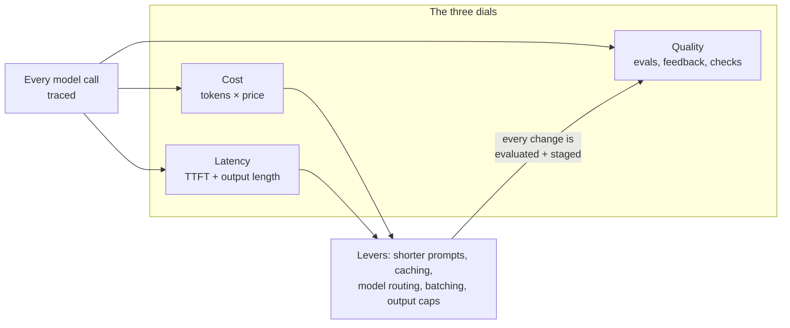

# Operating LLM Features: Cost, Latency, and Quality

*Shipping an AI feature is the easy part. Running it every day — within budget, fast enough, and still good — is production engineering.*

---

> *“You can't tell where a program is going to spend its time. Bottlenecks occur in surprising places, so don't try to second guess and put in a speed hack until you've proven that's where the bottleneck is.”*
>
> — **Rob Pike**, "Notes on Programming in C," 1989

## At a Glance

> **In one sentence:** Operating LLM features means instrumenting every call with tokens, cost, latency, and quality signals; setting SLOs and budgets per feature; cutting cost and latency with prompt design, caching, model routing, and batching; watching quality continuously; and changing prompts and models only through evaluated, staged rollouts.

**You'll learn**

- The three dials of LLM operations: cost, latency, and quality — and how they trade off
- What to log and measure for every model call
- Where LLM cost comes from and the main levers to reduce it
- Latency: time to first token, output length, streaming, and parallelism
- Monitoring quality in production, not just in offline evaluations
- Managing prompt and model changes as deployments

**Before you start:** [How LLMs Actually Work](../15-AI-Era-Engineering/How-LLMs-Actually-Work.md) · [SLOs in Practice](SLOs-In-Practice.md) · [Designing An AI Gateway](../06-System-Design/Designing-An-AI-Gateway.md)

**Reading time:** about 10 minutes

---

## The Big Picture



*Every cost or latency optimization can hurt quality. Measure all three, change one thing at a time, and let evaluations decide.*

---

## Introduction

A company launches an AI support assistant. It's popular: resolution rates improve and customers like it. Three months later, the finance team asks why the model bill is ten times the forecast. The engineering team can't answer quickly: logs show requests, but not tokens per feature, and nobody knows which customers, prompts, or code paths drive the cost.

The investigation eventually finds three culprits. The system prompt had grown to 6,000 tokens as people kept adding instructions. Retrieval was returning twenty long chunks per question. And a retry bug re-sent the whole conversation on every timeout. Fixing them cuts the cost by 70%. But one fix — trimming retrieval to five chunks — quietly lowers answer quality, and it takes two weeks of customer complaints to notice, because nobody was monitoring quality in production.

Operating LLM features is ordinary production engineering — instrumentation, budgets, SLOs, careful change management — applied to a component whose cost is per token, whose latency is seconds, and whose failures often look like successes.

### Why Should Engineers Care?

- Model usage can become one of the largest items in an engineering budget.
- Users feel latency in seconds, not milliseconds; small changes to output length or context size move it a lot.
- Quality can degrade silently after a prompt tweak, a model update, or a data change.

---

## The Problem It Solves

| Without LLM operations discipline | With it |
|----------------------------------|--------|
| One large monthly bill, no breakdown | Cost per feature, customer, and request |
| "The AI feels slow sometimes" | TTFT and total latency percentiles per feature |
| Quality known only from complaints | Quality SLIs and sampled grading |
| Prompt edits pushed straight to production | Versioned prompts, evaluations, canaries |
| Provider model updates as surprises | Pinned versions, planned upgrades |

---

## Historical Background

- **2010s — MLOps.** Teams operating machine-learning models developed practices for monitoring data drift, model performance, and retraining pipelines.
- **2020–2022 — Hosted LLM APIs** made powerful models available per token, turning inference into a variable operating cost.
- **2023 — LLMOps tooling.** Prompt management, tracing, evaluation, and cost-tracking tools appeared rapidly; AI gateways added quotas and routing.
- **2024 onward — Cost and latency features from providers**, such as prompt caching and discounted batch processing, and conventions for tracing generative AI calls (for example, OpenTelemetry's generative AI semantic conventions), made optimization more systematic.

---

## Core Concepts

### What to Record for Every Call

| Field | Why |
|------|----|
| Feature, customer/tenant, user (pseudonymous) | Attribution |
| Model and version, prompt template version | Reproducibility, regression analysis |
| Input tokens, cached input tokens, output tokens | Cost and efficiency |
| Cost (computed) | Budgets and chargeback |
| Time to first token, total latency | User experience |
| Stop reason (completed, max tokens, safety, error) | Truncation and failure detection |
| Retrieval IDs, tool calls | Debugging answers |
| Quality signals: validation result, user feedback, automated grade | Quality monitoring |

### Where Cost Comes From

```
cost per request = input tokens × input price
                 + output tokens × output price
                 − savings from cached input tokens
                 × number of calls per user action (agents, retries, chains)
```

Typical hidden drivers: growing system prompts, long conversation histories, too many retrieved chunks, verbose outputs, retries that resend everything, and agents that loop.

### Cost Levers

| Lever | How it helps | Quality risk |
|------|-------------|-------------|
| Trim prompts and instructions | Fewer input tokens on every call | Lost instructions |
| Prompt caching (stable prefix first) | Cheaper, faster repeated prefixes | Low |
| Fewer, better retrieved chunks (re-ranking) | Fewer input tokens | Missed context |
| Summarize long conversations | Bounded history | Lost details |
| Cap output length; ask for concise formats | Fewer output tokens, lower latency | Truncation |
| Route simple requests to smaller models | Much cheaper per request | Misrouted hard cases |
| Batch non-interactive work | Discounted, off-peak processing | Higher delay |
| Cache exact results for deterministic tasks | Skip calls entirely | Staleness |

### Latency Components

- **Time to first token (TTFT):** grows with input length and provider load; improved by shorter prompts, prompt caching, and nearby regions.
- **Generation time:** grows roughly linearly with output tokens; improved by shorter outputs and faster models.
- **Orchestration:** retrieval, tool calls, and sequential model calls add up; parallelize independent steps.
- **Streaming** hides generation time from users by showing text as it arrives.

### Quality in Production

Offline evaluations catch many problems before release, but production needs its own signals:

- **Validation rates:** schema failures, truncation, missing citations.
- **User signals:** thumbs up/down, edits, retries, escalations to humans, abandonment.
- **Sampled grading:** a small share of real traffic graded by an LLM judge or humans against a rubric.
- **Segment breakdowns:** by language, customer tier, feature, and model version.

### Change Management for Prompts and Models

Treat prompts and model versions as code:

1. Version them in source control.
2. Run the evaluation suite on every change.
3. Roll out with a canary; compare quality, cost, and latency against the baseline.
4. Keep one-step rollback.
5. Pin provider model versions; upgrade deliberately.

---

## Real-World Analogy

### Running a Restaurant Kitchen's Food Costs

A successful restaurant tracks the cost of every dish (cost per request), how long each takes to reach the table (latency), and how often plates come back (quality). When costs rise, the chef doesn't just buy cheaper ingredients — that can ruin the dish. They look at which dishes cost the most, trim waste (oversized portions, unused garnishes), prep common components in advance (caching), and send simple orders to a junior cook (smaller model), while tasting everything that leaves the kitchen (quality checks).

---

## How It Works In Practice

### A Weekly LLM Operations Review

1. **Cost:** total and per feature; top customers; week-over-week change; cost per successful outcome (for example, per resolved ticket).
2. **Latency:** TTFT and total latency p50/p95 per feature; outliers.
3. **Quality:** validation failures, feedback ratio, sampled grades, by segment.
4. **Reliability:** provider error and rate-limit rates; fallback usage.
5. **Changes:** prompts and models changed this week and their measured effect.
6. **Actions:** one or two optimizations to evaluate next week.

### Per-Feature SLOs and Budgets

```
Feature: Support assistant
  Latency SLO:  95% of answers begin streaming within 2 s; 95% complete within 12 s
  Quality SLO:  97% of answers pass automated checks (schema, citations, policy)
  Availability: 99.5% of questions answered by the AI (any rung of the fallback ladder)
  Budget:       ≤ $X per 1,000 conversations; alert at 80% of monthly budget
```

### An Optimization, Done Safely

*Goal: reduce cost of the ticket-summary feature.*

1. **Measure:** traces show average 9,000 input tokens, 60% of them from the full ticket history.
2. **Hypothesis:** summarizing older messages will cut input tokens by half with no quality loss.
3. **Evaluate offline** on 300 real tickets: quality score unchanged within noise; input tokens down 52%.
4. **Canary** to 5% of traffic for a week: cost per summary down 45%; user edit rate unchanged.
5. **Roll out**, and add the new version to the regression evaluation set.

---

## Production Engineering Perspective

- **Attribute everything.** Tag every call with feature and tenant. You can't optimize what you can't attribute.
- **Alert on cost anomalies,** such as sudden per-feature spikes that often mean loops or retry bugs.
- **Budget guardrails:** per-request token caps, per-user and per-tenant quotas, per-agent-run limits.
- **Protect privacy in traces:** prompts and outputs often contain personal data — apply redaction, access control, and retention limits.
- **Plan capacity with the provider:** rate limits, regional availability, and reserved or provisioned throughput for critical features.
- **Keep a model inventory:** which features use which models and versions, and their deprecation dates.

---

## Tradeoffs

| Optimization | Saves | Risks |
|-------------|------|------|
| Smaller model | Cost, latency | Quality on hard cases |
| Shorter context | Cost, TTFT | Missing information |
| Output caps | Cost, latency | Truncation |
| Caching | Cost, latency | Staleness, cross-user leaks if keyed badly |
| Batching | Cost | Delay |
| More sampling for quality monitoring | Visibility | Grading cost, privacy |
| Pinned model versions | Stability | Missing improvements; deprecation deadlines |

---

## Common Mistakes

### Beginner Mistakes

- Not logging token counts per request.
- Ignoring the stop reason, so truncated answers look like successes.
- Letting the system prompt grow indefinitely.

### Intermediate Mistakes

- Optimizing cost without measuring quality before and after.
- Retries that resend full context on every attempt, multiplying cost.
- Unpinned model versions that change behavior without notice.

### Senior-Level Mistakes

- No per-feature budgets, so one feature's growth starves others or surprises finance.
- Measuring quality only offline, missing drift in real traffic.
- Treating prompt changes as "content edits" outside the deployment process.

---

## Failure Scenarios

### Scenario 1: The Runaway Agent Bill

An agent feature loops on a failing tool call over a weekend, generating thousands of calls.

**Mitigation:** per-run step and cost limits, loop detection, and cost anomaly alerts.

### Scenario 2: The Silent Truncation

A new output format makes answers longer; 8% now hit the max-token limit and end mid-sentence. No errors are logged.

**Mitigation:** monitor stop reasons; alert on rising "max tokens" rates.

### Scenario 3: The Cost Cut That Cost Customers

Retrieval is reduced from ten chunks to three to save money. Costs drop; resolution rates fall; it takes weeks to connect the two.

**Mitigation:** evaluate every optimization against quality metrics offline and in a canary before rollout.

### Scenario 4: The Provider Model Update

A provider's alias (for example, "latest") starts pointing at a new model version. Output style changes and a downstream parser breaks.

**Mitigation:** pin exact versions; test upgrades with the evaluation suite; validate outputs.

---

## Real-World Industry Examples

- **Model providers** document token pricing, prompt caching, batch processing discounts, rate limits, and model deprecation schedules — all operational inputs.
- **OpenTelemetry** has semantic conventions for generative AI, standardizing how model calls, tokens, and related attributes are recorded in traces.
- **LLM observability and evaluation platforms** (both open-source and commercial) provide tracing, cost dashboards, prompt versioning, and online evaluation.
- **AI gateways** centralize quotas, routing, and cost attribution across teams (see [Designing An AI Gateway](../06-System-Design/Designing-An-AI-Gateway.md)).

---

## Interview Questions

### Beginner

**Q1: What determines the cost of an LLM request?**

*Model answer:* The number of input and output tokens multiplied by their prices (output tokens usually cost more), minus any discount for cached input, multiplied by the number of model calls per user action — which grows with agents, chains, and retries.

### Intermediate

**Q2: How would you reduce latency for a chat feature?**

*Model answer:* Stream responses; reduce input size (shorter prompts, fewer chunks, summarized history) and use prompt caching to lower time to first token; cap output length; run independent steps like retrieval and tool calls in parallel; route simple requests to faster models; and choose a nearby region.

**Q3: How do you monitor quality in production?**

*Model answer:* Track validation failures, stop reasons, user feedback, edits, escalations, and abandonment; grade a sample of real traffic with a validated LLM judge or human reviewers; and segment all of it by feature, language, customer tier, and model or prompt version.

### Senior

**Q4: How would you safely cut the cost of an AI feature by 50%?**

*Model answer:* Attribute cost to find the biggest drivers, form a hypothesis for each lever (prompt trimming, retrieval re-ranking, caching, routing to smaller models, output caps), evaluate each offline on a representative dataset for quality impact, canary the best candidates with cost and quality monitored against a baseline, and roll out only changes that meet the quality bar — one at a time, so effects are attributable.

### Architecture / Leadership

**Q5: What operational standards would you set for all AI features in a company?**

*Model answer:* Every call traced with feature, tenant, model and prompt version, tokens, cost, latency, and stop reason; per-feature SLOs for latency, quality, and availability; budgets and anomaly alerts; prompts and models versioned and changed through evaluation and canaries; pinned model versions with an upgrade process; privacy controls on traces; and a regular operations review.

---

## Hands-On Lab

Analyze a week of synthetic LLM traces: cost per feature, latency, truncation, and the savings from routing simple requests to a smaller model. Pure Python; save as `llm_ops_lab.py` and run it.

```python
import random
from collections import defaultdict
random.seed(13)

PRICE = {"large": (3.00, 15.00), "small": (0.25, 1.25)}   # $ per million tokens (in, out) — made-up prices
MAX_OUTPUT = 800

def make_call(feature):
    simple = random.random() < (0.7 if feature == "classify" else 0.3)
    inp = random.randint(300, 900) if feature == "classify" else random.randint(3000, 9000)
    out = random.randint(5, 20) if feature == "classify" else int(random.lognormvariate(5.6, 0.5))
    ttft = 0.2 + inp / 12_000 + random.expovariate(3)
    return {"feature": feature, "simple": simple, "in": inp, "out": min(out, MAX_OUTPUT),
            "truncated": out > MAX_OUTPUT, "ttft": ttft, "total": ttft + min(out, MAX_OUTPUT) / 60}

calls = [make_call(random.choice(["support_answer", "ticket_summary", "classify"]))
         for _ in range(30_000)]

def cost(c, model):
    pin, pout = PRICE[model]
    return (c["in"] * pin + c["out"] * pout) / 1e6

by_feature = defaultdict(list)
for c in calls:
    by_feature[c["feature"]].append(c)

def p95(values):
    values = sorted(values); return values[int(len(values) * .95)]

print(f"{'feature':16} {'calls':>6} {'cost $':>8} {'p95 TTFT':>9} {'p95 total':>10} {'truncated':>10}")
for f, cs in sorted(by_feature.items()):
    print(f"{f:16} {len(cs):6} {sum(cost(c, 'large') for c in cs):8.2f} "
          f"{p95([c['ttft'] for c in cs]):8.2f}s {p95([c['total'] for c in cs]):9.2f}s "
          f"{sum(c['truncated'] for c in cs) / len(cs):9.1%}")

all_large = sum(cost(c, "large") for c in calls)
routed = sum(cost(c, "small" if c["simple"] else "large") for c in calls)
print(f"\nall on large model: ${all_large:.2f}   route simple requests to small: ${routed:.2f} "
      f"({1 - routed / all_large:.0%} saving - IF the small model passes evals for those requests)")
```

**What to notice**
- Cost concentrates in the features with long inputs and outputs, not in the one with the most calls — attribution tells you where to optimize.
- The truncation column is a silent quality failure: those answers ended mid-sentence without any error.
- Routing simple requests to a smaller model saves a large share of cost *on paper*. Whether it's real depends on evaluating quality on those requests — and on how accurately you can tell "simple" from "hard."
- Try raising `MAX_OUTPUT` to 1,500: truncation disappears, while cost and latency barely change. The cap was saving almost nothing — it was just cutting off a few long answers, a pure quality loss. Measure before setting limits; every dial affects the others, but not always as much as you'd guess.

---

## Test Yourself

*Answer each question in your head or on paper first, then open the answer to check.*

<details markdown="1">
<summary><strong>1. What are the three dials of LLM operations?</strong></summary>

Cost, latency, and quality — which trade off against each other.

</details>

<details markdown="1">
<summary><strong>2. Why log the stop reason for every call?</strong></summary>

To detect truncated outputs (hitting the max-token limit), safety stops, and errors that otherwise look like successful responses.

</details>

<details markdown="1">
<summary><strong>3. Which latency metric is most affected by input length?</strong></summary>

Time to first token, because the whole prompt must be processed before generation starts.

</details>

<details markdown="1">
<summary><strong>4. Name four levers for reducing LLM cost.</strong></summary>

Any four of: trimming prompts, prompt caching, fewer/better retrieved chunks, summarizing history, capping output, routing to smaller models, batching, exact-result caching.

</details>

<details markdown="1">
<summary><strong>5. Why pin model versions?</strong></summary>

So behavior doesn't change unexpectedly when a provider updates a model alias; upgrades happen deliberately after evaluation.

</details>

<details markdown="1">
<summary><strong>6. How can a cost optimization hurt users?</strong></summary>

Shorter context, smaller models, or output caps can reduce answer quality or truncate answers. Every optimization needs quality evaluation before and after.

</details>

<details markdown="1">
<summary><strong>7. What's a useful business-level cost metric?</strong></summary>

Cost per successful outcome — for example, cost per resolved support ticket — rather than cost per request alone.

</details>

---

## Cheat Sheet

**Trace every call:** feature · tenant · model + version · prompt version · input/cached/output tokens · cost · TTFT · total latency · stop reason · retrieval/tool IDs · quality signals.

**Cost formula:** (input × price_in + output × price_out − cache savings) × calls per action.

| Dial | Measure | Main levers |
|-----|--------|------------|
| Cost | $ per feature, per outcome | Prompt trim, caching, routing, batching, output caps |
| Latency | TTFT, total (p50/p95) | Shorter input, caching, streaming, parallel steps, faster models |
| Quality | Validation, feedback, sampled grades | Evals before change, canaries, segment monitoring |

**Change management:** version → evaluate → canary → compare cost/latency/quality → roll out → keep rollback.

---

## In the AI Era

This chapter is an AI-era chapter from start to finish — and it also shows how little is truly new. Tracing comes from [observability](../10-Reliability/Observability-Monitoring-Alerting-And-Debugging.md), budgets from [rate limiting](../08-Scalability/Rate-Limiting-and-Throttling.md), SLOs from [SLOs in Practice](SLOs-In-Practice.md), and staged changes from [Deployments](Deployments-Strategies-And-Risks.md). What changes is the unit of cost (tokens), the size of latency (seconds), and the need to measure quality continuously because correct-looking output can be wrong.

**Try it:** Add a "cached input tokens" field to the lab: assume the first 2,000 tokens of every support and summary prompt are identical and cached at a 90% discount. How much does that save, and what prompt structure makes it possible?

---

## Key Takeaways

1. Operate LLM features on three dials — cost, latency, quality — and measure all three.
2. Trace every call with tokens, cost, latency, stop reason, and versions, attributed to feature and tenant.
3. Cost hides in growing prompts, long contexts, verbose outputs, retries, and agent loops.
4. Reduce cost and latency with trimming, caching, routing, batching, and output caps — each evaluated for quality.
5. Monitor quality in production with validation, user signals, and sampled grading.
6. Treat prompts and models as deployments: versioned, evaluated, canaried, reversible.

---

## What to Read Next

- **[Graceful Degradation for AI Features](../10-Reliability/Graceful-Degradation-For-AI-Features.md)** — keeping AI features useful when things fail
- **[Evaluating AI Systems](../15-AI-Era-Engineering/Evaluating-AI-Systems.md)** — the evaluation suites these practices depend on
- **[Designing An AI Gateway](../06-System-Design/Designing-An-AI-Gateway.md)** — centralizing quotas, routing, and cost attribution

---

## Further Reading

- **OpenTelemetry — Semantic conventions for generative AI:** [https://opentelemetry.io/docs/specs/semconv/gen-ai/](https://opentelemetry.io/docs/specs/semconv/gen-ai/)
- **Your model provider's documentation** on pricing, prompt caching, batch APIs, rate limits, stop reasons, and model deprecations
- **Chip Huyen — "AI Engineering" (O'Reilly, 2025)** — building and operating applications with foundation models
- **Hamel Husain — "Your AI Product Needs Evals":** [https://hamel.dev/blog/posts/evals/](https://hamel.dev/blog/posts/evals/)
- **Google SRE Workbook — "Canarying Releases":** [https://sre.google/workbook/canarying-releases/](https://sre.google/workbook/canarying-releases/)

---

*This chapter is part of the Modern Software Engineering Handbook — a comprehensive guide to the concepts, principles, and practices that every professional software engineer should know.*
