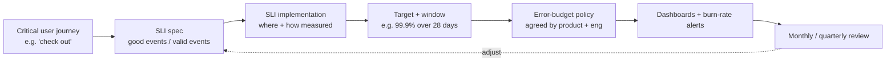

# SLOs in Practice: Choosing, Implementing, and Using Them

*Turning "we want it to be reliable" into numbers you can measure, alert on, and use to make decisions every week.*

---

> *“100% is the wrong reliability target for basically everything (pacemakers and anti-lock brakes being notable exceptions).”*
>
> — **Benjamin Treynor Sloss**, *Site Reliability Engineering*, 2016

## At a Glance

> **In one sentence:** Putting SLOs into practice means picking a few critical user journeys, defining each SLI as good events divided by valid events at a precise measurement point, choosing targets from data and user needs, writing an error-budget policy everyone signs, wiring up dashboards and burn-rate alerts, and reviewing it all on a regular schedule.

**You'll learn**

- How to pick user journeys and write precise SLI definitions
- Where to measure: load balancer, server, client, or synthetic probes
- What counts as a "good" and a "valid" event (and what to exclude)
- Setting targets from historical data and user expectations
- Writing an SLO document and an error-budget policy
- Running SLO reviews and evolving SLOs over time

**Before you start:** [How Google Handles Failures](../10-Reliability/How-Google-Handles-Failures.md) · [Observability](../10-Reliability/Observability-Monitoring-Alerting-And-Debugging.md)

**Reading time:** about 10 minutes

---

## The Big Picture



*An SLO is a small system of its own: specification, measurement, target, policy, tooling, and review.*

---

## Introduction

A team hears about SLOs and decides to adopt them. In one afternoon, they create twenty: CPU below 70%, memory below 80%, every endpoint at 99.99%, and a latency SLO based on averages. Within a month, most SLOs are permanently red, nobody looks at the dashboard, and the error-budget policy — which nobody agreed to — is ignored the first time a launch is delayed.

Another team starts with two SLOs for the one journey customers care most about — checkout. They define exactly which requests count, where they're measured, and what "good" means. They look at three months of data before choosing targets. The product manager and engineering lead sign a one-page error-budget policy. Six months later, the SLO has changed a launch decision twice, caught a slow regression that no other alert noticed, and is reviewed every month.

The concepts are simple. **The practice is in the details** — and that's what this chapter is about.

### Why Should Engineers Care?

- Well-built SLOs reduce alert noise and focus effort on what users feel.
- They give engineers a data-based voice in "ship vs. stabilize" decisions.
- Poorly built SLOs are worse than none: they create noise and cynicism.

---

## The Problem It Solves

| Symptom of weak SLO practice | Fix covered in this chapter |
|-----------------------------|----------------------------|
| SLOs on CPU and memory | SLIs based on user journeys |
| "Availability" means different things to different people | Precise good/valid event definitions |
| Targets picked by gut feeling | Targets from historical data and user expectations |
| Budget policy ignored | Written, signed, reviewed policy |
| SLO dashboards nobody reads | Regular review ritual |
| SLOs never change | Scheduled evolution |

---

## Historical Background

- **Service-level agreements** have long been used in telecom and IT outsourcing contracts, typically as monthly uptime percentages with financial penalties.
- **2016 — Google's *Site Reliability Engineering*** introduced SLIs, SLOs, and error budgets as internal engineering tools, distinct from contractual SLAs.
- **2018 — *The Site Reliability Workbook*** added practical guidance: SLI specifications vs. implementations, the "good events / valid events" formulation, and multi-window burn-rate alerting.
- **2020 — *Implementing Service Level Objectives*** by Alex Hidalgo gave a full-length practitioner's guide.
- **2020s — Tooling.** Cloud monitoring products and open-source projects (for example, the OpenSLO specification) made SLOs definable as code.

---

## Core Concepts

### Critical User Journeys

Start from what users do, not from what servers do: "log in," "search for a product," "check out," "upload a photo," "receive a message." Pick the few journeys that matter most to users and the business.

### SLI Specification vs. Implementation

- **Specification:** what you want to measure, in user terms. *"The proportion of checkout attempts that complete successfully."*
- **Implementation:** exactly how it's measured. *"Load balancer logs for `POST /checkout`: good = status 2xx or 4xx caused by user input, within 2 seconds; valid = all requests excluding health checks and internal test traffic."*

The implementation is always an approximation; know its blind spots.

### Good Events / Valid Events

Most SLIs take the form:

```
SLI = good events / valid events × 100%
```

| Decision | Common choice |
|---------|--------------|
| Server errors (5xx) | Bad |
| Timeouts, dropped connections | Bad |
| Client errors from invalid input (400, 404 for bad IDs) | Excluded from valid, or counted good |
| Rate-limited requests (429) from abusive clients | Usually excluded |
| Health checks, synthetic traffic, internal testing | Excluded |
| Slow but successful responses | Bad for a latency SLI |

### Measurement Points

| Where | Sees | Misses |
|------|-----|-------|
| Server application metrics | Detailed, per-endpoint | Requests that never reached the server |
| Load balancer / gateway logs | Requests that reached the edge of your system | Client-side and network problems |
| Client / real-user monitoring | What users actually experience | Noisy; depends on devices and networks |
| Synthetic probes | Consistent, always-on checks | Only the paths you script |

A common setup: load-balancer-based SLIs for alerting, with client-side data and synthetic probes to cover blind spots.

### Choosing Targets

1. Look at historical performance (at least a few weeks, ideally months).
2. Understand user tolerance: when do complaints, abandonment, or support tickets rise?
3. Consider dependencies: you can't be more reliable than critical dependencies in series.
4. Choose a target slightly below current typical performance, so the budget is real but achievable.
5. Prefer **rolling windows** (for example, 28 days, which contain the same number of each weekday) over calendar months.

### Latency SLIs

Express latency as a proportion: *"99% of checkout requests complete within 800 ms"* rather than *"p99 < 800 ms."* The proportion form adds up across servers and time and fits the error-budget model directly. Use multiple thresholds if needed (90% under 300 ms, 99% under 800 ms).

### Error-Budget Policy

A short, signed document stating:

- what happens when the budget is healthy (normal work),
- what happens when it's at risk or exhausted (for example: freeze non-critical launches, prioritize reliability work, require extra review),
- exceptions (security fixes, legal requirements),
- who decides and how disagreements escalate.

### SLO Reviews

A regular (monthly or quarterly) meeting reviews: SLO compliance, budget consumption and its causes, alert quality, whether the SLOs still reflect user happiness, and whether targets should change.

---

## Real-World Analogy

### A Restaurant's Service Standards

A restaurant doesn't promise "perfect service." It sets concrete standards: "95% of mains served within 20 minutes of ordering, measured from the order ticket to the pass." It knows what counts (dine-in orders) and what doesn't (large banquets booked in advance). It reviews the numbers weekly. And the owner and head chef agree in advance: if the standard slips for two weeks, new menu experiments pause until the kitchen catches up.

---

## How It Works In Practice

### An SLO Document

```
Service:       Checkout
Owner:         Payments team
Journey:       Customer completes a purchase

SLI 1 — Availability
  Spec:  Proportion of checkout attempts that succeed.
  Impl:  Load balancer logs, POST /api/checkout.
         Valid: all requests except health checks, synthetic tests,
                and 429 responses to clients over their rate limit.
         Good:  HTTP 2xx, or 4xx caused by invalid user input (400, 422).
  SLO:   99.9% over a rolling 28-day window.

SLI 2 — Latency
  Spec:  Proportion of successful checkouts that complete quickly.
  Impl:  Same source; good = response time < 800 ms.
  SLO:   99% over a rolling 28-day window.

Error-budget policy: see linked document (signed by product and engineering leads).
Alerting: burn rate 14.4× (1 h / 5 min) and 6× (6 h / 30 min) page on-call;
          1× (3 days) opens a ticket.
Known blind spots: client-side failures before reaching the load balancer —
          covered by a synthetic checkout probe every minute from three regions.
Review: first Tuesday of each month.
```

### Rolling Out SLOs Across an Organization

1. **Pilot** with one or two teams on their most important journey.
2. **Templates:** SLO document, policy, dashboard, alert rules.
3. **Tooling:** SLOs defined as code, generating dashboards and alerts.
4. **Replace** cause-based pages with SLO burn-rate pages as SLOs mature.
5. **Report** SLO status in regular engineering and product reviews.

### Using the Budget in Decisions

| Budget state | Typical actions |
|-------------|----------------|
| Healthy (> 50% remaining) | Normal feature work; planned risky migrations are fine |
| At risk (< 25% remaining) | Extra care with rollouts; prioritize known reliability fixes |
| Exhausted | Freeze non-critical launches; reliability work first until back in SLO |
| Consistently unused | Consider whether the SLO is too loose — or ship faster |

---

## Production Engineering Perspective

- **Fewer is better.** Two or three SLOs per critical service are plenty. Each needs an owner and attention.
- **Dependencies:** publish SLOs for internal platforms so consumers can design around them. Track which dependency failures consume your budget.
- **Planned maintenance** consumes budget too — that's intentional; it keeps planned risk honest.
- **Budget spent by one incident** is a signal for the postmortem: was it detection, mitigation, or prevention that failed?
- **Beware gaming:** excluding too many events from "valid" makes SLOs look good while users suffer. Review exclusions periodically.

---

## Tradeoffs

| Choice | Benefit | Cost |
|-------|--------|-----|
| Few SLOs | Focus and attention | Some problems not covered |
| Many SLOs | Coverage | Noise, neglect |
| Load-balancer measurement | Simple, consistent | Blind to client-side failures |
| Client-side measurement | Real user experience | Noisy, harder to act on |
| Tight targets | Higher user satisfaction | Less room to ship; more pages |
| Loose targets | Faster shipping | Users may be unhappy before the SLO notices |
| Rolling window | Continuous, smooth | Harder to explain than calendar months |

---

## Common Mistakes

### Beginner Mistakes

- SLOs on infrastructure metrics (CPU, memory) instead of user experience.
- Targets of 100% or "as many nines as possible."
- Average-latency SLOs.

### Intermediate Mistakes

- Vague SLI definitions that different people compute differently.
- Counting client mistakes (invalid input) as server failures — or excluding real failures as "client errors."
- No written error-budget policy, or one never agreed with product leadership.

### Senior-Level Mistakes

- Promising SLOs that critical dependencies can't support.
- Never reviewing or changing SLOs as the product evolves.
- Using SLOs to judge individuals rather than to guide team priorities.

---

## Failure Scenarios

### Scenario 1: The Green SLO, the Angry Users

The SLO measures server-side success, but a broken mobile app release fails before requests reach the servers. Dashboards are green; app store reviews are furious.

**Mitigation:** client-side and synthetic SLIs for critical journeys; include app-release health in SLO reviews.

### Scenario 2: The Permanently Red SLO

A new SLO is set at 99.99% while the service historically delivers 99.9%. It's red from day one; the team learns to ignore it.

**Mitigation:** set initial targets from historical data; tighten gradually.

### Scenario 3: The Exclusion Creep

Over time, more and more error types are excluded as "not our fault." The SLO stays at 99.95% while support tickets rise.

**Mitigation:** review exclusions quarterly; compare SLO trends with support and user-feedback trends.

### Scenario 4: The Policy Nobody Signed

The budget runs out, engineering asks to pause a launch, product refuses, and leadership sides with the launch. The SLO loses credibility.

**Mitigation:** agree and sign the policy in advance, with a documented exception process and a post-exception review.

---

## Real-World Industry Examples

- **Google's SRE Workbook** includes worked SLO examples and a detailed chapter on implementing SLOs and burn-rate alerts.
- **Cloud monitoring services** (Google Cloud, AWS, Azure, Datadog, and others) provide SLO objects, error-budget tracking, and burn-rate alerting.
- **OpenSLO** is an open specification for defining SLOs as code in a vendor-neutral format.
- **Many companies' public SLAs** (for example, cloud storage and compute SLAs) are looser than the internal SLOs their teams operate against.

---

## Interview Questions

### Beginner

**Q1: What is the "good events / valid events" formulation?**

*Model answer:* An SLI is the proportion of valid events that were good — for example, successful checkout requests divided by all checkout requests that should count (excluding health checks, test traffic, and requests rejected for invalid input). It makes the SLI precise and directly usable for error budgets.

### Intermediate

**Q2: Where would you measure an availability SLI for a web API, and what are the blind spots?**

*Model answer:* At the load balancer or API gateway, which sees every request reaching our system and is consistent across services. Blind spots: failures before requests reach us — DNS problems, client bugs, network issues. Cover those with synthetic probes and client-side monitoring.

**Q3: How do you choose an initial SLO target?**

*Model answer:* Measure historical performance over weeks or months, understand user tolerance, consider dependency reliability, and set a target slightly below typical performance so there's a meaningful budget. Revisit after a few months of data.

### Senior

**Q4: Why express latency SLOs as "99% of requests under 800 ms" rather than "p99 under 800 ms"?**

*Model answer:* The proportion form counts good and bad events, which aggregate correctly across servers and time windows and plug directly into error-budget math. Percentile values can't be averaged across servers or windows.

### Architecture / Leadership

**Q5: How would you roll out SLOs across an engineering organization?**

*Model answer:* Start with pilot teams and critical journeys; build templates for SLO documents, policies, dashboards, and alerts; define SLOs as code; move paging from cause-based alerts to SLO burn rates; get product leadership to co-own error-budget policies; review SLOs regularly in team and leadership meetings; and share results — fewer pages, clearer launch decisions — to drive adoption.

---

## Hands-On Lab

Compute SLIs from raw request logs, applying real-world rules for what counts. Pure Python; save as `sli_lab.py` and run it.

```python
import random
random.seed(21)

# Simulate 28 days of load-balancer log records for POST /api/checkout
logs = []
for _ in range(500_000):
    kind = random.choices(["user", "healthcheck", "synthetic", "abuser"], weights=[92, 5, 2, 1])[0]
    status = random.choices([200, 400, 422, 429, 500, 503],
                            weights=[97.65, 1.2, 0.8, 0.3, 0.03, 0.02])[0]
    if kind == "abuser":
        status = 429
    latency_ms = random.lognormvariate(5.5, 0.5)             # median ~245 ms, long tail
    logs.append({"kind": kind, "status": status, "latency_ms": latency_ms})

def valid(r):
    if r["kind"] in ("healthcheck", "synthetic"):
        return False                                          # not real user traffic
    if r["status"] == 429 and r["kind"] == "abuser":
        return False                                          # rate-limited abusive client
    return True

def good_availability(r):
    return r["status"] < 500                                  # 2xx and user-caused 4xx are fine

def good_latency(r):
    return good_availability(r) and r["latency_ms"] < 800

v = [r for r in logs if valid(r)]
availability = sum(map(good_availability, v)) / len(v)
latency = sum(map(good_latency, v)) / len(v)

for name, value, target in [("availability", availability, 0.999), ("latency < 800 ms", latency, 0.99)]:
    budget = 1 - target
    used = (1 - value) / budget
    print(f"{name:18} SLI {value:.4%}  target {target:.1%}  budget used {used:6.1%}  "
          f"{'OK' if used <= 1 else 'EXHAUSTED -> reliability work first'}")

naive = sum(r["status"] == 200 for r in logs) / len(logs)
print(f"\nnaive 'status == 200 over all requests': {naive:.3%}  (misleading!)")
```

**What to notice**
- The careful SLI excludes health checks, synthetic traffic, and rate-limited abusers, and doesn't punish the service for users' invalid input.
- The naive calculation (only 200s count, everything is valid) says the service is failing far more often than users actually experience — and would page people for user typos.
- Availability here is comfortably within budget while the latency SLO is very close to its limit. SLOs often disagree, which is exactly why you have more than one.
- Triple the two 5xx weights: availability runs out of budget — and so does latency, because failed requests also count as bad latency events. One problem can burn several budgets at once.

---

## Test Yourself

*Answer each question in your head or on paper first, then open the answer to check.*

<details markdown="1">
<summary><strong>1. What's the difference between an SLI specification and an SLI implementation?</strong></summary>

The specification describes what to measure in user terms; the implementation describes exactly how and where it's measured, including data sources and event filters.

</details>

<details markdown="1">
<summary><strong>2. Should HTTP 400 responses caused by invalid user input count as failures?</strong></summary>

Usually not — they reflect user input, not service failure. They're typically counted as good or excluded from valid events.

</details>

<details markdown="1">
<summary><strong>3. Why prefer a 28-day rolling window to a calendar month?</strong></summary>

It's continuous (no reset on the first of the month) and always contains the same number of each weekday, making comparisons fair.

</details>

<details markdown="1">
<summary><strong>4. What should an error-budget policy contain?</strong></summary>

Actions for healthy, at-risk, and exhausted budgets; exceptions; who decides and how disagreements escalate — signed by product and engineering leadership.

</details>

<details markdown="1">
<summary><strong>5. What is a blind spot of load-balancer-based SLIs, and how do you cover it?</strong></summary>

Failures that never reach your load balancer (DNS, client bugs, network). Cover with synthetic probes and client-side monitoring.

</details>

<details markdown="1">
<summary><strong>6. How many SLOs should a critical service start with?</strong></summary>

Very few — typically two or three (for example, availability and latency) on its most important user journeys.

</details>

<details markdown="1">
<summary><strong>7. What is "exclusion creep"?</strong></summary>

Gradually excluding more and more failure types from valid events, so the SLO looks healthy while users suffer. Review exclusions periodically.

</details>

---

## Cheat Sheet

**Steps:** journey → SLI spec → SLI implementation → target + window → error-budget policy → dashboards + burn-rate alerts → regular review.

**SLI formula:** good events ÷ valid events.

| Typically bad | Typically excluded | Typically good |
|--------------|-------------------|---------------|
| 5xx, timeouts, dropped connections, too slow | Health checks, synthetic/test traffic, abusive clients' 429s | 2xx, user-caused 4xx |

**Targets:** start slightly below historical performance · rolling 28 days · tighten gradually.

**Latency:** "X% of requests under T ms," with one or two thresholds.

**Budget states:** healthy → ship · at risk → care · exhausted → reliability first · unused → reconsider.

---

## In the AI Era

- **Add a quality SLI for AI features.** Examples: "proportion of answers passing automated checks," "proportion with valid citations," or "proportion not flagged by users." Define good and valid events just as carefully as for availability. See [Evaluating AI Systems](../15-AI-Era-Engineering/Evaluating-AI-Systems.md).
- **Latency SLIs need two thresholds** for streaming features: time to first token and time to complete.
- **Budget consumption from model changes** is a useful signal: if a prompt or model update burns the quality budget, roll it back like any deployment.
- **AI can help draft SLO documents** from dashboards and incident history, but the targets and policy must come from real user needs and a human agreement.

**Try it:** Extend the lab with a `quality_ok` field for an AI feature (true for 97% of requests). Define the SLI, choose a target, and write one sentence of policy for when the quality budget is exhausted.

---

## Key Takeaways

1. Start from critical user journeys, not infrastructure metrics.
2. Define SLIs precisely as good events over valid events, with a specific measurement point.
3. Choose targets from historical data, user tolerance, and dependency limits.
4. Express latency as the proportion of requests under a threshold.
5. Write and sign an error-budget policy before you need it.
6. Keep SLOs few, review them regularly, and watch for exclusion creep.
7. For AI features, add quality and time-to-first-token SLIs.

---

## What to Read Next

- **[Operating LLM Features](Operating-LLM-Features.md)** — SLOs, cost, and quality for AI workloads
- **[Incident Response and Postmortems](Incident-Response-And-Postmortems.md)** — what happens when SLOs burn fast
- **[How Google Handles Failures](../10-Reliability/How-Google-Handles-Failures.md)** — the concepts behind SLOs and error budgets

---

## Further Reading

- **Google — "The Site Reliability Workbook," chapters "Implementing SLOs" and "Alerting on SLOs":** [https://sre.google/workbook/table-of-contents/](https://sre.google/workbook/table-of-contents/)
- **Alex Hidalgo — "Implementing Service Level Objectives" (O'Reilly, 2020)**
- **OpenSLO specification:** [https://openslo.com](https://openslo.com)
- **Google Cloud — "SLO monitoring" documentation**
- **Google SRE Book — "Service Level Objectives":** [https://sre.google/sre-book/service-level-objectives/](https://sre.google/sre-book/service-level-objectives/)

---

*This chapter is part of the Modern Software Engineering Handbook — a comprehensive guide to the concepts, principles, and practices that every professional software engineer should know.*
