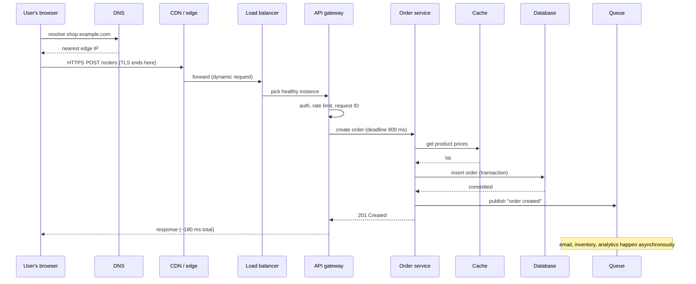

# The Life of a Production Request

*Follow one click through DNS, edge, load balancers, services, caches, databases, and queues — and see where time goes and where things break.*

---

> *“Just as fault-tolerant computing aims to create a reliable whole out of less-reliable parts, large online services need to create a predictably responsive whole out of less-predictable parts.”*
>
> — **Jeffrey Dean and Luiz André Barroso**, "The Tail at Scale," *Communications of the ACM*, 2013

## At a Glance

> **In one sentence:** A single production request crosses a dozen layers — DNS, CDN, load balancers, gateways, services, caches, databases, and queues — each adding latency and a way to fail, so production engineers manage it with latency budgets, timeouts that shrink along the path, fan-out discipline, and tracing that shows the whole journey.

**You'll learn**

- Every hop a typical request takes, from the user's device to the database and back
- Latency budgets and how to allocate them across services
- Why deadlines must propagate and timeouts must shrink along the call chain
- Fan-out and tail latency: why the slowest backend decides your speed
- Hedged requests, caching, and async work to keep requests fast
- How to read a request's journey from traces and logs

**Before you start:** [How A Webpage Reaches Your Screen](../03-How-The-Internet-Works/How-A-Webpage-Reaches-Your-Screen.md) · [How Load Balancing Works](../08-Scalability/How-Load-Balancing-Works.md) · [Observability](../10-Reliability/Observability-Monitoring-Alerting-And-Debugging.md)

**Reading time:** about 15 minutes

---

## The Big Picture



*Most of the work a user triggers happens after they get their response — in the queue.*

---

## Introduction

A customer taps "Place order." About 180 milliseconds later, they see "Order confirmed." To them it's one action. To the system, it was a relay race across a dozen components run by different teams, some owned by other companies entirely. Any one of them could have been slow, down, misconfigured, or overloaded.

Production engineering starts with seeing that relay race clearly. When a user says "the site is slow," which leg of the race was slow? When an error occurs, which component produced it, and which just passed it along? When you add a new service call, how much of the user's time does it spend?

This chapter walks through the journey of a request in a typical modern web application, and the practices that keep that journey fast and reliable.

### Why Should Engineers Care?

- Almost every production question — "why is it slow?", "why did it fail?", "what happens if X is down?" — is answered by knowing the request path.
- Adding a single synchronous call deep in the chain can change user-visible latency for everyone.
- Timeouts, retries, and deadlines only work if they're consistent across the whole path.

---

## The Problem It Solves

In a monolith on one server, a request path is a function call stack. In modern systems, it's a distributed chain:

| Property | One server | Distributed request path |
|---------|-----------|-------------------------|
| Hops | In-process calls | Network calls between many services |
| Latency | Microseconds per call | Milliseconds per hop, with variable tails |
| Failure | Crash or exception | Timeouts, partial failures, retries |
| Debugging | A stack trace | Traces across services and teams |

Understanding and managing that chain is a core production skill.

---

## Historical Background

- **1990s — Three-tier architecture.** Web server, application server, database: the first standard request path for web apps.
- **1998 onward — CDNs.** Akamai and others moved content and TLS termination closer to users.
- **2000s — Service-oriented architectures** split applications into networked services; request paths grew longer.
- **2010 — Distributed tracing.** Google's Dapper paper showed how to follow a request across thousands of services.
- **2013 — "The Tail at Scale."** Dean and Barroso explained why rare slowdowns in individual servers dominate latency when requests fan out, and described techniques like hedged requests.
- **2010s — Microservices, API gateways, and service meshes** standardized routing, retries, timeouts, and telemetry along the path.

---

## Core Concepts

### The Hops

| Hop | What it does | Typical added latency |
|----|-------------|---------------------|
| DNS | Name → IP (often cached) | 0–50 ms (0 when cached) |
| TCP + TLS handshake | Secure connection (reused when possible) | 1–2 round trips |
| CDN / edge | TLS termination, caching, WAF, DDoS protection | A few ms; saves many when cached |
| Load balancer | Chooses a healthy instance | < 1 ms |
| API gateway | Authentication, rate limits, routing, request IDs | 1–5 ms |
| Service logic | Business rules | Varies |
| Cache | Fast reads of hot data | ~1 ms |
| Database | Durable reads and writes | 1–20 ms (much more if unindexed) |
| Other services | Fan-out calls | Each adds its own latency and failure modes |
| Queue publish | Hand off slow work | A few ms |

### Latency Budgets

Decide the total latency target for a user action — say, p99 of 500 ms for placing an order — and allocate it across the path. Every new dependency must fit into the budget or replace something else.

```
Target p99: 500 ms
  Network + edge + TLS        100 ms
  Gateway (auth, limits)       20 ms
  Order service logic          30 ms
  Pricing (cache, fallback DB) 50 ms
  Inventory check              80 ms
  Database transaction         60 ms
  Headroom                    160 ms
```

### Deadline Propagation

The gateway gives the request a **deadline** (for example, 800 ms from now). Each service passes the *remaining* time to the next call. A service that has only 50 ms left shouldn't start a call that typically takes 200 ms. Timeouts should **shrink** as you go deeper — never the reverse, or inner calls keep working long after the outer caller has given up.

### Fan-Out and Tail Latency

If a request calls many backends in parallel, it waits for the slowest. When each backend is slow 1% of the time, a request fanning out to 100 backends is slow about 63% of the time (1 − 0.99¹⁰⁰). **Tail latency of components becomes typical latency of the whole.**

Techniques from "The Tail at Scale":
- **Hedged requests:** if a response is slower than, say, the 95th percentile, send a second copy to another replica and use whichever answers first.
- **Tied requests:** send to two replicas, and whichever starts first cancels the other.
- **Partial results:** return good-enough results without the slowest shards when appropriate (search, feeds).

### Synchronous vs. Asynchronous Work

Only do synchronously what the user needs to see the result. Emails, analytics, search indexing, and notifications go on a queue. This shortens the path, reduces the number of things that can fail during the request, and absorbs spikes.

### Request IDs and Trace Context

Assign an ID at the edge or gateway and propagate it (with trace context) through every hop and every log line. It's the thread you pull when debugging.

---

## Real-World Analogy

### A Relay Race With a Stopwatch

A relay team's time is the sum of every leg plus every baton handoff. A single slow runner, or one dropped baton, ruins the result. A good coach knows each runner's split times (traces), sets target times per leg (latency budget), and makes sure nobody keeps running after the race is over (deadline propagation). Some races have many runners at once, and you only finish when the last one arrives (fan-out) — so the coach cares most about the *slowest* runner, not the average one.

---

## How It Works In Practice

### Tracing One Order

```
POST /orders   trace 7f3a…   total 182 ms
├─ edge (TLS, WAF)                       12 ms
├─ gateway (auth, rate limit)             6 ms
└─ order-service                        158 ms
   ├─ pricing: cache.get (hit)            1 ms
   ├─ inventory.reserve                  61 ms
   │  └─ inventory-db: UPDATE             48 ms   ← biggest single cost
   ├─ orders-db: INSERT (transaction)    34 ms
   ├─ fraud.score (async? no: sync)      49 ms
   └─ queue.publish(order.created)        3 ms
```

Questions a production engineer asks from this trace:

- Can `fraud.score` run in parallel with `inventory.reserve`? (Saves ~49 ms.)
- Why does the inventory `UPDATE` take 48 ms? (Lock contention? Missing index?)
- What happens if `fraud.score` is down — fail open for low-value orders, or fail closed?

### Choosing Timeouts Along the Path

| Layer | Timeout | Why |
|------|--------|----|
| Client (browser/app) | 10 s | Long enough for slow mobile networks |
| Edge → origin | 5 s | Protect the edge from stuck origins |
| Gateway → order service | 800 ms (deadline) | The user-facing budget |
| Order service → inventory | min(300 ms, remaining) | Leaves room for the rest |
| Inventory → its database | min(200 ms, remaining) | Shrinks further inward |

### Failure Handling at Each Hop

- **Edge:** serve cached or static error pages; absorb attacks.
- **Load balancer:** health checks; remove failing instances; connection draining.
- **Gateway:** rate limits, authentication errors, load shedding by priority.
- **Services:** timeouts, circuit breakers, fallbacks for optional calls, idempotency for retries.
- **Data stores:** connection pools with limits, statement timeouts, replicas.
- **Queues:** retries with backoff, dead-letter queues, idempotent consumers.

---

## Production Engineering Perspective

- **Know your critical paths.** Document the synchronous dependencies of your most important user actions and review them whenever a new call is added.
- **Keep connection reuse healthy.** TLS and TCP handshakes are expensive; use keep-alive and connection pools, and watch for pool exhaustion.
- **Measure at the edge and at the client.** Server-side latency misses DNS, TLS, and network time; real-user monitoring shows what users actually experience.
- **Propagate context everywhere** — including into async jobs, so the work triggered by a request can be traced back to it.
- **Beware of retries at many layers.** If the client, gateway, and service all retry three times, one failure can become 27 attempts.

---

## Tradeoffs

| Decision | Benefit | Cost |
|---------|--------|-----|
| More services on the path | Separation of concerns | Latency, failure points, debugging difficulty |
| Parallel fan-out | Lower latency than sequential calls | Tail latency; more load |
| Hedged requests | Cut tail latency | Extra load (typically a few percent) |
| Async processing | Faster responses, resilience | Eventual consistency; more moving parts |
| Caching on the path | Speed, lower load | Staleness, invalidation complexity |
| Edge termination (TLS at CDN) | Faster handshakes for users | Trust and configuration at the edge |

---

## Common Mistakes

### Beginner Mistakes

- No timeouts on outbound calls, or library defaults of minutes.
- Doing slow, non-essential work (emails, analytics) synchronously.
- Averaging latency instead of looking at percentiles for the whole path.

### Intermediate Mistakes

- Inner timeouts longer than outer ones.
- Sequential calls that could run in parallel.
- Missing request IDs in logs, so a request can't be followed across services.

### Senior-Level Mistakes

- Letting the critical path grow one "small" dependency at a time with no latency budget.
- Retries at every layer, multiplying load during incidents.
- Ignoring fan-out tail effects when designing aggregation services.

---

## Failure Scenarios

### Scenario 1: The Slow Optional Call

A "recommended add-ons" call is added synchronously to checkout. It's usually fast, but at peak it takes 2 seconds, and checkout p99 triples.

**Mitigation:** move it off the critical path (async or client-side), or give it a strict timeout and a fallback.

### Scenario 2: Work After the Caller Gave Up

The gateway times out after 1 second, but the inner services keep working for 10 seconds, consuming capacity on requests nobody is waiting for — making overload worse.

**Mitigation:** propagate deadlines and cancel work when the deadline passes.

### Scenario 3: The Fan-Out Tail

A search aggregator queries 50 shards. Each shard is fast 99% of the time, but the aggregator is slow on a large fraction of requests.

**Mitigation:** hedged requests, fewer larger shards, and partial results with a deadline.

### Scenario 4: Connection Pool Exhaustion

A database slowdown makes each request hold a connection longer; the pool empties; new requests wait for connections and time out, even those that don't need the slow query.

**Mitigation:** separate pools per workload, statement timeouts, and alerts on pool saturation.

---

## Real-World Industry Examples

- **Google's "The Tail at Scale" (2013)** describes hedged and tied requests used in large fan-out services such as search.
- **Distributed tracing** (Dapper at Google, Zipkin at Twitter, Jaeger at Uber) was created specifically to see the life of a request across services.
- **gRPC** supports deadline propagation natively, so remaining time travels with each call.
- **CDNs** such as Cloudflare, Akamai, and Fastly terminate TLS and cache responses at the edge, removing whole hops for many requests.

---

## Interview Questions

### Beginner

**Q1: Walk through what happens when a user submits a form on a web app.**

*Model answer:* DNS resolves the domain; the browser opens (or reuses) a TLS connection, often to a CDN edge; the edge forwards the dynamic request to a load balancer; the load balancer picks a healthy instance behind an API gateway, which authenticates and rate-limits; the service runs business logic, reading from caches and the database and possibly calling other services; slow side effects go onto a queue; the response travels back the same way.

### Intermediate

**Q2: Why should timeouts get shorter deeper in the call chain?**

*Model answer:* The outer caller gives up at its timeout. If inner calls have longer timeouts, they keep working after nobody is waiting, wasting capacity. Propagating the remaining deadline ensures every layer stops in time.

**Q3: Why does fan-out make tail latency worse?**

*Model answer:* A request waits for the slowest of its parallel calls. Even if each backend is rarely slow, the chance that at least one of many is slow becomes high — for example, about 63% with 100 backends that are each slow 1% of the time.

### Senior

**Q4: How would you reduce p99 latency for an endpoint that calls six services?**

*Model answer:* Trace representative slow requests to see which calls dominate. Run independent calls in parallel, remove non-essential calls from the synchronous path, cache stable data, fix slow queries, and use hedged requests for idempotent reads with high tail latency. Set a latency budget per call and propagate deadlines so late work is cancelled.

### Architecture / Leadership

**Q5: How do you keep a critical path from slowly getting worse as teams add features?**

*Model answer:* Define latency budgets and SLOs for critical user actions, document their synchronous dependencies, require design review for new calls on the critical path, run automated performance tests in CI and canaries, and track p99 trends per endpoint so regressions are caught at the change that caused them.

---

## Hands-On Lab

See fan-out tail latency and the effect of hedged requests. Pure Python; save as `request_path_lab.py` and run it.

```python
import random
random.seed(1)

def backend_latency():
    """A backend that is usually fast (~10 ms) but slow 1% of the time (~500 ms)."""
    return random.uniform(300, 700) if random.random() < 0.01 else random.gauss(10, 2)

def request(fanout, hedge_after=None):
    times = []
    for _ in range(fanout):
        first = backend_latency()
        if hedge_after is not None and first > hedge_after:          # hedge: send a copy
            first = min(first, hedge_after + backend_latency())       # take whichever wins
        times.append(first)
    return max(times)                                                 # wait for the slowest

def p(values, q):
    values = sorted(values)
    return values[int(len(values) * q)]

for fanout in [1, 10, 100]:
    plain = [request(fanout) for _ in range(5_000)]
    hedged = [request(fanout, hedge_after=25) for _ in range(5_000)]
    slow_share = sum(t > 100 for t in plain) / len(plain)
    print(f"fan-out {fanout:>3}: p50 {p(plain, .5):5.0f} ms  p99 {p(plain, .99):5.0f} ms  "
          f"slow requests {slow_share:5.1%}   | hedged p99 {p(hedged, .99):5.0f} ms")
```

**What to notice**
- With one backend, only about 1% of requests are slow. With 100 backends, most requests are slow — the rare tail of each backend becomes the normal case for the whole.
- Hedging (sending a backup request when the first is slower than 25 ms) brings p99 back down dramatically, at the cost of a small amount of extra load.
- Try `hedge_after=5` (too aggressive — hedges almost every call and doubles load) and `hedge_after=200` (too late to help). Hedge thresholds are usually set near the 95th percentile.

---

## Test Yourself

*Answer each question in your head or on paper first, then open the answer to check.*

<details markdown="1">
<summary><strong>1. What is a latency budget?</strong></summary>

A total latency target for a user action, divided among the hops and services on its path, so each component knows how much time it may spend.

</details>

<details markdown="1">
<summary><strong>2. What does deadline propagation mean?</strong></summary>

Passing the remaining time for the request to each downstream call, so every service knows when to stop and doesn't work on requests the caller has already abandoned.

</details>

<details markdown="1">
<summary><strong>3. With 100 parallel backends each slow 1% of the time, how often is a request slow?</strong></summary>

About 63% of the time (1 − 0.99¹⁰⁰).

</details>

<details markdown="1">
<summary><strong>4. What is a hedged request?</strong></summary>

A second copy of a request sent to another replica when the first hasn't answered within a threshold (for example, the p95 latency); the first response to arrive is used.

</details>

<details markdown="1">
<summary><strong>5. Which work should leave the synchronous request path?</strong></summary>

Anything the user doesn't need to see the result of immediately: emails, notifications, analytics, search indexing, thumbnail generation.

</details>

<details markdown="1">
<summary><strong>6. Why do retries at every layer cause problems?</strong></summary>

They multiply: three layers each retrying three times can turn one failed call into 27 attempts, overloading a struggling dependency.

</details>

<details markdown="1">
<summary><strong>7. Why measure latency at the client, not just the server?</strong></summary>

Server metrics miss DNS, connection setup, TLS, network transit, and rendering — often a large part of what the user actually experiences.

</details>

---

## Cheat Sheet

**Typical path:** DNS → TLS → CDN/edge → load balancer → API gateway → service → cache / database / other services → queue → response.

| Practice | Rule |
|---------|-----|
| Latency budget | Allocate the target across hops; new calls must fit |
| Deadlines | Propagate remaining time; inner timeouts shorter than outer |
| Fan-out | Expect tail effects; hedge, shard wisely, allow partial results |
| Async | Move non-essential work to queues |
| Retries | One layer, with backoff and a budget |
| Context | Request/trace ID from the edge through every hop and log |

**Tail math:** P(slow request) = 1 − (1 − p)ⁿ for n parallel calls each slow with probability p.

---

## In the AI Era

- **Model calls stretch the request path.** An AI feature can add seconds to a request that used to take 200 ms. Put model calls behind streaming, async jobs, or optional panels — not on the critical path of core actions. See [Graceful Degradation for AI Features](../10-Reliability/Graceful-Degradation-For-AI-Features.md).
- **Agents create deep, variable request trees.** One user action may trigger many model and tool calls. Deadlines, per-run budgets, and trace context matter even more.
- **Time to first token** becomes a latency-budget line item alongside TLS and database time.
- **AI can read traces for you** — summarizing where time went in slow requests — but the trace data must be there first.

**Try it:** Add a "model call" hop that takes 800–3,000 ms to the lab's backend list. What does it do to your latency budget, and which user actions could tolerate it?

---

## Key Takeaways

1. A production request crosses many layers; each adds latency and a way to fail.
2. Latency budgets make the cost of every new dependency visible.
3. Propagate deadlines and make timeouts shrink along the call chain.
4. Fan-out turns rare backend slowness into common user slowness; hedging and partial results help.
5. Keep only what the user must wait for on the synchronous path; queue the rest.
6. Request IDs and traces are how you see the whole journey.

---

## What to Read Next

- **[Deployments: Strategies and Risks](Deployments-Strategies-And-Risks.md)** — changing the path safely
- **[Incident Response and Postmortems](Incident-Response-And-Postmortems.md)** — what to do when a hop fails
- **[How Load Balancing Works](../08-Scalability/How-Load-Balancing-Works.md)** — the load-balancer hop in depth

---

## Further Reading

- **Dean & Barroso — "The Tail at Scale" (CACM, 2013):** [https://research.google/pubs/the-tail-at-scale/](https://research.google/pubs/the-tail-at-scale/)
- **Sigelman et al. — "Dapper, a Large-Scale Distributed Systems Tracing Infrastructure" (2010)**
- **gRPC — Deadlines guide:** [https://grpc.io/docs/guides/deadlines/](https://grpc.io/docs/guides/deadlines/)
- **Marc Brooker — "Timeouts, retries, and backoff with jitter"** (Amazon Builders' Library): [https://aws.amazon.com/builders-library/](https://aws.amazon.com/builders-library/)
- **Google SRE Book — "Load Balancing at the Frontend" and "Load Balancing in the Datacenter"**

---

*This chapter is part of the Modern Software Engineering Handbook — a comprehensive guide to the concepts, principles, and practices that every professional software engineer should know.*
