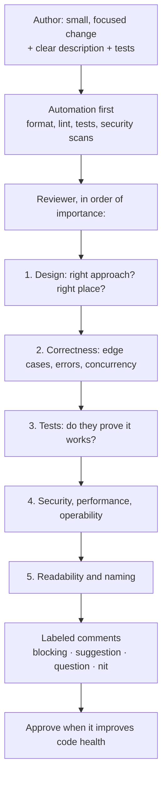

# Code Review: Giving and Receiving Feedback

*Code review is where quality, knowledge sharing, and team culture meet — one comment at a time.*

---

> *“In general, reviewers should favor approving a CL once it is in a state where it definitely improves the overall code health of the system being worked on, even if the CL isn't perfect.”*
>
> — **Google Engineering Practices**, "The Standard of Code Review"

## At a Glance

> **In one sentence:** Effective code review checks design, correctness, tests, security, and readability in small, fast reviews, communicates with clear, kind, labeled comments, aims for "better code health" rather than perfection, and treats feedback as a shared way to learn — for both reviewer and author.

**You'll learn**

- What code review is for (and what it's bad at)
- What to look for, in order of importance
- How to write comments that are clear, kind, and actionable
- How to receive feedback without defensiveness
- Keeping reviews small and fast
- Automating the mechanical parts so humans focus on judgment

**Before you start:** [Writing Design Documents](Writing-Design-Documents.md) · [How Secure Systems Are Built](../09-Security/How-Secure-Systems-Are-Built.md)

**Reading time:** about 10 minutes

---

## The Big Picture



*Let machines handle style; spend human attention on design, correctness, and risk.*

---

## Introduction

Two pull requests arrive on the same day.

The first is 2,400 lines across 60 files titled "refactor + new feature + fixes." The reviewer scrolls, leaves comments about variable naming and a missing blank line, and approves. A concurrency bug in the new feature ships to production.

The second is 180 lines titled "Add retry with backoff to payment webhook handler," with a description explaining why, how it was tested, and one open question. The reviewer spends fifteen minutes, spots that retries aren't idempotent, and leaves a clear blocking comment with a suggested fix. The author fixes it the same afternoon.

The difference wasn't reviewer skill. It was **size, clarity, and focus** — and a shared understanding of what review is for.

### Why Should Engineers Care?

- Review is one of the main ways defects, security issues, and design problems are caught before production.
- It spreads knowledge: more people understand each part of the system.
- It shapes team culture. Harsh or slow reviews slow teams down and drive people away; kind, fast ones build trust.

---

## The Problem It Solves

| Goal of code review | How |
|--------------------|----|
| Catch defects and design issues | A second set of eyes on logic, edge cases, and approach |
| Share knowledge | More people know each area; fewer single points of failure |
| Maintain consistency | Shared conventions and architecture |
| Mentor | Juniors learn from feedback; seniors learn from questions |
| Security and compliance | Required review for sensitive changes |

What review is **bad** at: finding bugs in huge changes, verifying behavior that isn't tested, and catching issues that automation could find more reliably.

---

## Historical Background

- **1976 — Fagan inspections.** Michael Fagan at IBM formalized software inspections: structured meetings reviewing code line by line, which found many defects early.
- **1990s–2000s — Lightweight review.** Over-the-shoulder and email-based reviews replaced heavyweight meetings in many teams.
- **2005–2008 — Tool-based review.** Tools like Mondrian at Google, then Gerrit and Review Board, made asynchronous review part of daily workflow.
- **2008 onward — Pull requests.** GitHub popularized pull requests, making code review the default for open source and most companies.
- **2013 — "Expectations, Outcomes, and Challenges of Modern Code Review."** A Microsoft study (Bacchelli and Bird) found that knowledge transfer and team awareness are major benefits, beyond finding defects.
- **2018 — Google's research on modern code review** and its public engineering-practices guide described small changes, fast turnaround, and a "code health" standard.

---

## Core Concepts

### What to Look For (in Priority Order)

1. **Design:** Does this belong here? Is the approach sound? Does it fit the architecture?
2. **Correctness:** Edge cases, error handling, concurrency, data integrity, backward compatibility.
3. **Tests:** Do tests cover the important behavior and edge cases? Would they fail if the code broke?
4. **Security and privacy:** Input handling, authorization, secrets, logging of sensitive data.
5. **Operability and performance:** Logging, metrics, timeouts, query efficiency, rollout safety.
6. **Readability:** Clear names, simple structure, helpful comments where needed.
7. **Style:** Should be automated, not debated.

### Small, Focused Changes

Review quality drops as change size grows. Aim for changes a reviewer can understand in one sitting — often a few hundred lines or less. Split refactoring from behavior changes, and large features into a sequence of small pull requests (or use feature flags).

### Fast Turnaround

Slow reviews block authors and encourage larger batches. Many teams aim to respond within one business day, and faster for small changes. A quick first response ("I'll review this after lunch") helps too.

### Comment Labels

Make intent explicit (similar to the "Conventional Comments" style):

| Label | Meaning |
|------|--------|
| **blocking / issue** | Must be addressed before merge |
| **suggestion** | Consider this; author decides |
| **question** | Help me understand |
| **nit** | Minor preference, optional |
| **praise** | Something done well |

### Writing Good Comments

- **Explain why**, not just what: "This query runs per item in the loop (N+1); fetching all items in one query avoids 100 round trips."
- **Ask instead of command** when uncertain: "What happens if `user` is null here?"
- **Critique the code, not the person:** "This function is hard to follow" rather than "You wrote this confusingly."
- **Offer a path forward:** suggest an alternative or point to an example.
- **Praise specifically** — it reinforces good practices.

### Receiving Feedback

- Assume good intent; comments are about the code.
- Ask clarifying questions; disagree with reasons, not emotion.
- Thank reviewers; resolve comments explicitly.
- If a thread goes back and forth more than twice, talk synchronously.

### Automate the Mechanical

Formatters, linters, type checkers, tests, and security scanners should run before human review. Humans shouldn't spend attention on indentation.

---

## Real-World Analogy

### An Editor Reviewing a Book Draft

A good editor doesn't start with commas. They first ask whether the story works, whether the chapters are in the right order, and whether the argument holds — then move to paragraphs, and only at the end fix typos (ideally with a spell checker). They explain their suggestions, praise what works, and remember that the author owns the book. And no editor can do good work on a 900-page manuscript delivered the night before the deadline.

---

## How It Works In Practice

### A Good Pull Request Description

```
Title: Retry payment webhooks with exponential backoff

Why: 2% of webhook deliveries fail on transient errors and are never retried (INC-482).
What: Adds retries (max 5, exponential backoff with jitter) using the existing job queue.
      Handler is now idempotent: deduplicates by provider event ID.
Testing: Unit tests for backoff schedule and dedupe; integration test with simulated 503s.
Risks: More load on payment DB during provider incidents — capped by retry budget.
Questions: Should we alert after the 3rd failed attempt or only after the 5th?
```

### Review Etiquette Examples

| Instead of | Try |
|-----------|-----|
| "This is wrong." | "blocking: this retries non-idempotent requests, so a timeout could double-charge. Could we reuse the idempotency key from the request?" |
| "Why would you do it this way?" | "question: what led to calling the API inside the loop? Would a batch call work here?" |
| "Rename this." | "nit: `data2` → `pending_refunds` might make the intent clearer." |
| (silence on good work) | "praise: nice test for the empty-cart case — that bit us last year." |

### Review Checklist (Keep It Short)

- [ ] I understand what this change does and why.
- [ ] The approach fits the design and architecture.
- [ ] Edge cases and failures are handled.
- [ ] Tests would catch a regression.
- [ ] No security or privacy concerns (input, auth, secrets, logs).
- [ ] Safe to deploy and roll back.

---

## Production Engineering Perspective

- **Required reviews** protect production branches; sensitive areas (auth, payments, infrastructure) may require specific owners (for example, a CODEOWNERS file).
- **Review for operability:** new code paths need logs, metrics, alerts, and feature flags where appropriate.
- **Emergency changes** still get review — ideally a quick second look during the incident and a full review afterward.
- **Metrics to watch:** time to first review, time to merge, pull request size, and rework rate. Avoid turning them into individual performance targets.

---

## Tradeoffs

| Choice | Benefit | Cost |
|-------|--------|-----|
| Required review for all changes | Consistency, knowledge sharing | Some delay |
| Multiple reviewers | More perspectives | Slower, diffusion of responsibility |
| Strict standards | Higher code quality | Friction; perfectionism |
| "Improves code health" standard | Steady progress | Some imperfections merged |
| Synchronous pairing instead of review | Immediate feedback | Scheduling; less written record |

---

## Common Mistakes

### Beginner Mistakes

- Huge pull requests mixing refactoring, features, and fixes.
- No description, so reviewers must reverse-engineer the intent.
- Reviewers focusing only on style.

### Intermediate Mistakes

- Unlabeled comments, leaving authors unsure what's required.
- Rubber-stamp approvals on changes the reviewer didn't understand.
- Days of review latency, pushing authors to batch changes.

### Senior-Level Mistakes

- Harsh or sarcastic feedback that damages trust.
- Blocking changes over personal preferences.
- Treating review as gatekeeping rather than collaboration and teaching.

---

## Failure Scenarios

### Scenario 1: The Rubber Stamp

A 3,000-line change is approved in two minutes. A security flaw in the new endpoint ships.

**Fix:** smaller changes, required tests, security-focused checklists for sensitive areas.

### Scenario 2: The Nitpick Spiral

Forty comments about naming and formatting; the real design issue is never raised. The author is frustrated; the design problem ships.

**Fix:** automate style; review design and correctness first; label nits as optional.

### Scenario 3: The Review Bottleneck

One senior engineer must approve everything and reviews once a week. Work piles up; pull requests grow; quality drops.

**Fix:** distribute review ownership, set response-time expectations, and grow reviewers through pairing.

### Scenario 4: The Hurt Newcomer

A new engineer's first pull request receives blunt, unexplained criticism. They stop asking questions.

**Fix:** kind, explained, labeled feedback; praise; synchronous conversation for larger concerns.

---

## Real-World Industry Examples

- **Google's public engineering practices guide** describes the code health standard, small changes, and review speed expectations.
- **Microsoft Research** studies of modern code review found knowledge transfer and awareness to be key benefits.
- **Open-source projects** such as Linux and Kubernetes rely on review as the core of their contribution process, with maintainers and owners for each area.
- **"Conventional Comments"** is a public convention for labeling review comments.

---

## Interview Questions

### Beginner

**Q1: What do you look for when reviewing code?**

*Model answer:* In order: whether the design and approach fit, correctness including edge cases and error handling, whether tests prove the behavior, security and privacy issues, operability and performance, and finally readability. Style should be handled by automated tools.

### Intermediate

**Q2: How do you give feedback on code you think is poorly designed?**

*Model answer:* Explain the concern concretely and why it matters (for example, maintainability or failure modes), ask questions to understand the author's reasoning, suggest an alternative, and label it as blocking or a suggestion. For significant design issues, talk synchronously and consider whether a design discussion should have happened earlier.

**Q3: Why keep pull requests small?**

*Model answer:* Small changes are reviewed faster and more thoroughly, are easier to understand and test, reduce merge conflicts, and are easier to roll back. Review quality drops sharply as change size grows.

### Senior

**Q4: How do you handle disagreement in a code review?**

*Model answer:* Separate preferences from real issues. For real issues, explain the risk and look for evidence or team conventions. If back-and-forth continues, move to a conversation. If still unresolved, defer to the code owner or a documented standard, and record the decision. Don't block on preferences.

### Architecture / Leadership

**Q5: How would you improve code review in a team where reviews are slow and contentious?**

*Model answer:* Set expectations for response times and comment labeling, automate formatting and linting, encourage smaller pull requests with good descriptions, spread reviewer responsibility, model kind and explained feedback, and track time-to-first-review as a team metric (not individual performance). Hold a retrospective on review culture and adjust.

---

## Hands-On Lab

Analyze pull requests for risk and check review comments for clear labels. Pure Python; save as `review_lab.py` and run it.

```python
prs = [
    {"title": "Refactor + new checkout + misc fixes", "lines": 2400, "files": 60, "tests_changed": 0,
     "touches": ["payments", "auth", "ui"], "description": ""},
    {"title": "Retry payment webhooks with backoff", "lines": 180, "files": 4, "tests_changed": 2,
     "touches": ["payments"], "description": "Why: INC-482. Testing: unit + integration."},
    {"title": "Fix typo in README", "lines": 2, "files": 1, "tests_changed": 0,
     "touches": ["docs"], "description": "Typo."},
]
SENSITIVE = {"payments", "auth", "infra"}

def risk(pr):
    notes, score = [], 0
    if pr["lines"] > 400: score += 3; notes.append("too large to review well - split it")
    if pr["files"] > 20: score += 2; notes.append("touches many files")
    code_change = not set(pr["touches"]) <= {"docs"}
    if code_change and pr["tests_changed"] == 0: score += 2; notes.append("no test changes")
    if SENSITIVE & set(pr["touches"]): score += 2; notes.append("sensitive area - needs owner review")
    if len(pr["description"]) < 20: score += 1; notes.append("missing description")
    return score, notes

for pr in prs:
    score, notes = risk(pr)
    level = "HIGH" if score >= 6 else "medium" if score >= 3 else "low"
    print(f"[{level:6}] {pr['title']}\n          {'; '.join(notes) or 'looks good'}")

comments = [
    "This is wrong.",
    "blocking: this retry isn't idempotent - a timeout could double-charge. Reuse the request's idempotency key?",
    "nit: `data2` -> `pending_refunds`?",
    "Why would anyone do this?",
    "praise: great test for the empty-cart case.",
]
LABELS = ("blocking:", "issue:", "suggestion:", "question:", "nit:", "praise:")
print("\nComments missing a label or a reason:")
for c in comments:
    if not c.lower().startswith(LABELS) or len(c) < 25:
        print(f"  - {c!r}")
```

**What to notice**
- The giant mixed pull request scores high risk for size, missing tests, sensitive areas, and no description — each a reason reviewers miss bugs.
- The focused webhook change is flagged only for touching a sensitive area — correctly asking for an owner's review.
- Unlabeled, unexplained comments ("This is wrong.") give the author nothing to act on. **Exercise:** rewrite the two flagged comments using a label, a reason, and a suggestion.

---

## Test Yourself

*Answer each question in your head or on paper first, then open the answer to check.*

<details markdown="1">
<summary><strong>1. What is Google's standard for approving a change?</strong></summary>

Approve once the change definitely improves the overall code health of the system, even if it isn't perfect.

</details>

<details markdown="1">
<summary><strong>2. What should reviewers look at first?</strong></summary>

Design and approach, then correctness, then tests — style last (and ideally automated).

</details>

<details markdown="1">
<summary><strong>3. Why label comments as blocking, suggestion, question, or nit?</strong></summary>

So authors know which comments must be addressed and which are optional, reducing confusion and friction.

</details>

<details markdown="1">
<summary><strong>4. Besides finding defects, what's a major benefit of code review?</strong></summary>

Knowledge sharing and team awareness — more people understand each part of the codebase.

</details>

<details markdown="1">
<summary><strong>5. What should you do when a review thread goes back and forth repeatedly?</strong></summary>

Move to a synchronous conversation, then record the outcome in the review.

</details>

<details markdown="1">
<summary><strong>6. Who formalized software inspections in 1976?</strong></summary>

Michael Fagan at IBM.

</details>

<details markdown="1">
<summary><strong>7. What makes a good pull request description?</strong></summary>

Why the change is needed, what it does, how it was tested, risks, and any open questions.

</details>

---

## Cheat Sheet

**Review order:** design → correctness → tests → security → operability/performance → readability → (style: automate).

**Comment formula:** label + observation + why it matters + suggestion. Example: "blocking: N+1 query here — 100 round trips per page; batch-load items instead?"

| Author | Reviewer |
|-------|---------|
| Small, focused PRs | Respond within a day |
| Clear description (why, what, testing, risks) | Prioritize design and correctness |
| Self-review first | Label comments; explain reasons |
| Separate refactors from features | Praise good work |
| Respond to every comment | Approve when code health improves |

---

## In the AI Era

- **AI reviewers are a useful first pass:** they catch common bugs, missing tests, and security patterns quickly. Treat their comments like any reviewer's — verify, don't obey.
- **Human review matters more for AI-written code.** Generated code can look polished while hiding wrong assumptions; reviewers should check design, edge cases, and whether the author understands it.
- **More code, same reviewer time:** keep AI-assisted changes small and require authors to self-review before requesting human review.
- **Review prompts and evaluation changes too** — they change behavior as much as code.

**Try it:** Run an AI review on one of your recent pull requests. Compare its comments with a human review. Which issues did only the human catch, and why?

---

## Key Takeaways

1. Code review catches design and correctness issues, spreads knowledge, and shapes team culture.
2. Keep changes small and focused; review quickly.
3. Review in priority order: design, correctness, tests, security, operability, readability; automate style.
4. Write labeled, explained, kind comments that critique code, not people.
5. Receive feedback with curiosity; move long debates to conversation.
6. Approve changes that improve code health — don't wait for perfection.

---

## What to Read Next

- **[Mentoring Junior Engineers](Mentoring-Junior-Engineers.md)** — review as a teaching tool
- **[Engineering With AI Assistants](../15-AI-Era-Engineering/Engineering-With-AI-Assistants.md)** — reviewing AI-generated code
- **[The Most Common Web Attacks](../09-Security/The-Most-Common-Web-Attacks.md)** — security issues to look for in review

---

## Further Reading

- **Google Engineering Practices — Code Review Developer Guide:** [https://google.github.io/eng-practices/review/](https://google.github.io/eng-practices/review/)
- **Bacchelli & Bird — "Expectations, Outcomes, and Challenges of Modern Code Review" (ICSE 2013)**
- **Sadowski et al. — "Modern Code Review: A Case Study at Google" (ICSE-SEIP 2018)**
- **Conventional Comments:** [https://conventionalcomments.org](https://conventionalcomments.org)
- **Michael Fagan — "Design and Code Inspections to Reduce Errors in Program Development" (IBM Systems Journal, 1976)**

---

*This chapter is part of the Modern Software Engineering Handbook — a comprehensive guide to the concepts, principles, and practices that every professional software engineer should know.*
