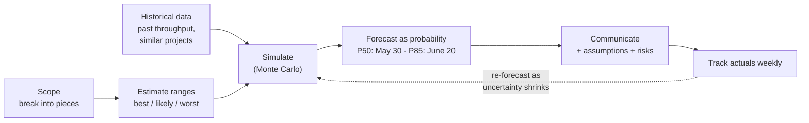

# Estimating Software Projects

*Estimates aren't promises. They're forecasts under uncertainty — and the honest answer is almost always a range with a probability.*

---

> *“It always takes longer than you expect, even when you take into account Hofstadter's Law.”*
>
> — **Douglas Hofstadter**, *Gödel, Escher, Bach*, 1979 ("Hofstadter's Law")

## At a Glance

> **In one sentence:** Good estimation breaks work into pieces, uses ranges instead of single numbers, calibrates against historical data, accounts for known biases and hidden work, communicates forecasts as probabilities (for example, "85% likely by June 20"), and updates them as uncertainty shrinks.

**You'll learn**

- Why software estimates are so often wrong
- Estimates vs. targets vs. commitments
- The cone of uncertainty and the planning fallacy
- Techniques: decomposition, three-point estimates, reference classes, throughput forecasting
- Monte Carlo simulation for probabilistic delivery dates
- How to communicate estimates and manage scope honestly

**Before you start:** [Making Technical Decisions](Making-Technical-Decisions.md) · [How To Solve Problems Systematically](../01-Foundations/How-To-Solve-Problems-Systematically.md)

**Reading time:** about 10 minutes

---

## The Big Picture



*A forecast is a living thing: a range that narrows as you learn — not a single date carved in stone.*

---

## Introduction

A manager asks, "How long will the new reporting feature take?" An engineer thinks about the core work — a new query, a page, an export button — and says, "About two weeks." Six weeks later, it ships. The query needed a new index that required a migration. The export needed a background job for large reports. Security review found a permissions gap. Two days were lost to an incident. The designer changed the layout after user testing.

None of those were surprises in hindsight. They're the normal texture of software work — the hidden tasks, dependencies, interruptions, and discoveries that single-point estimates ignore.

Estimation will never be perfect, because software is mostly the creation of something new. But it can be **honest, calibrated, and useful**: expressed as ranges, grounded in data, and updated as you learn.

### Why Should Engineers Care?

- Businesses need forecasts to plan launches, hiring, marketing, and budgets.
- Bad estimates erode trust; honest, well-communicated ones build it.
- Estimating well forces you to understand the work — often revealing risks early.

---

## The Problem It Solves

| Common failure | Better practice |
|---------------|----------------|
| Single-number estimates treated as promises | Ranges with probabilities |
| Estimating only the "happy path" coding | Include testing, review, deployment, docs, meetings, interruptions |
| Optimism bias | Calibrate with historical data |
| Estimates given under pressure to match a desired date | Separate estimates from targets |
| Never updating the forecast | Re-forecast as work progresses |
| Scope fixed, date fixed, quality squeezed | Explicit scope trade-offs |

---

## Historical Background

- **1950s — PERT.** The U.S. Navy's Polaris program developed the Program Evaluation and Review Technique, using optimistic, most likely, and pessimistic estimates.
- **1975 — *The Mythical Man-Month*.** Fred Brooks explained why adding people to a late project makes it later and why estimates are chronically optimistic.
- **1979 — The planning fallacy.** Daniel Kahneman and Amos Tversky described people's tendency to underestimate time even when they know similar tasks overran. Hofstadter's Law appeared the same year.
- **1981 — Barry Boehm's *Software Engineering Economics*** introduced COCOMO and the idea later popularized as the "cone of uncertainty" (Steve McConnell, 2006).
- **2000s — Agile estimation.** Story points, planning poker (named by James Grenning in 2002), and velocity-based planning became common.
- **2000s–2010s — Reference class forecasting** (Bent Flyvbjerg, building on Kahneman) used outcomes of similar past projects to correct optimism.
- **2010s — Probabilistic forecasting.** Monte Carlo simulation on historical throughput and the #NoEstimates discussion challenged traditional estimation practices.

---

## Core Concepts

### Estimates, Targets, and Commitments

- **Estimate:** a forecast of how long work will take, with uncertainty.
- **Target:** a desired date or outcome set by the business.
- **Commitment:** a promise to deliver a defined scope by a date.

Confusing them is the root of many estimation fights. An engineer can say: "The target is March 1. My estimate is 50% likely by March 1 and 85% likely by March 22. To commit to March 1, we'd need to cut these two features."

### The Cone of Uncertainty

Early in a project, estimates can be off by a large factor either way; as requirements are clarified and design decisions made, the range narrows. Early estimates should be wide ranges — false precision early is a form of misinformation.

### Why Estimates Run Long

- **Optimism / planning fallacy:** imagining the best-case path.
- **Missing work:** testing, code review, deployment, documentation, migrations, security review, bug fixes.
- **Unknown unknowns:** discoveries during implementation.
- **Interruptions:** meetings, support, incidents, context switching.
- **Dependencies:** waiting on other teams, vendors, approvals.
- **Asymmetry:** tasks can finish only a little early but can run very late — duration distributions have long right tails.

### Techniques

| Technique | How | Best for |
|----------|-----|---------|
| Decomposition | Break work into small tasks (≤ a few days) | Understanding scope, finding hidden work |
| Three-point estimates | Optimistic / most likely / pessimistic per task | Capturing uncertainty |
| Reference class | Compare with similar past projects | Correcting optimism |
| Relative sizing (story points, T-shirt sizes) | Size relative to known items | Team planning |
| Throughput forecasting | Items completed per week historically | Forecasting a backlog |
| Monte Carlo simulation | Randomly sample durations many times | Probabilistic dates |
| Spikes | Short, time-boxed investigations | Reducing big unknowns before estimating |

### Communicating Forecasts

Give a range and a confidence: "50% by May 30; 85% by June 20." State key assumptions and risks, and when the forecast will be updated. Use the 85th percentile for external commitments, not the median.

### Managing Scope

When the forecast doesn't meet the target, the levers are **scope**, **date**, and **people** (adding people rarely helps quickly — Brooks's Law). Cutting or phasing scope is usually the most effective lever: deliver the most valuable slice first.

---

## Real-World Analogy

### Weather Forecasts

A good weather forecast says "70% chance of rain tomorrow," not "it will rain at 3:14 p.m." Forecasters use models and historical patterns, update forecasts as the day approaches, and are trusted because they're calibrated: when they say 70%, it rains about 70% of the time. Software estimates should work the same way — probabilities, grounded in data, updated often.

---

## How It Works In Practice

### Estimating a Feature

1. **Clarify scope** and write down what's included and excluded.
2. **Decompose** into tasks of a few days or less, including testing, review, deploy, docs, and migrations.
3. **Three-point estimate** each task.
4. **Add known overhead:** meetings, on-call, support (often 20–40% of time).
5. **Identify risks and unknowns;** run spikes for the biggest.
6. **Simulate or sum ranges;** present P50 and P85.
7. **Compare with reference class:** how long did similar features actually take?
8. **Track weekly** and re-forecast.

### Using Historical Throughput

If a team has completed 4–9 similar-sized items per week over the last three months, and 40 items remain, simulation over those historical weeks gives a probabilistic completion date — often more accurate than bottom-up task estimates, and with far less effort.

### Saying No (or "Not by Then") Constructively

```
"We can't responsibly commit to March 1 for all of it. Here's what I can offer:
 - Core export (the must-have): 85% likely by March 1.
 - Scheduled reports: adds ~2 weeks; 85% by March 15.
 - PDF format: another ~1 week.
Which matters most for the launch?"
```

---

## Production Engineering Perspective

- **Operational work is real work:** on-call, incidents, and maintenance reduce capacity; plan for them explicitly.
- **Release and rollout time** — canaries, migrations, bake periods — belongs in the estimate.
- **Risky dependencies** (other teams, vendors, security approvals) should be identified early and tracked.
- **Estimation data is a feedback loop:** comparing estimates with actuals improves future forecasts.

---

## Tradeoffs

| Approach | Benefit | Cost |
|---------|--------|-----|
| Detailed bottom-up estimates | Understanding scope | Time-consuming; still biased |
| Throughput forecasting | Fast, data-based | Needs history and similar-sized items |
| Story points | Team calibration, relative sizing | Easily misused as productivity metrics |
| Single-date commitments | Simple to communicate | Often wrong; erodes trust |
| Probabilistic forecasts | Honest about uncertainty | Requires educating stakeholders |
| No estimates (#NoEstimates) | Less overhead | Business still needs forecasts |

---

## Common Mistakes

### Beginner Mistakes

- Estimating only coding time.
- Giving a single number with no range.
- Estimating in your head under pressure in a meeting.

### Intermediate Mistakes

- Letting the desired date become the estimate.
- Padding secretly instead of communicating uncertainty openly.
- Never comparing estimates with actuals.

### Senior-Level Mistakes

- Adding people to a late project and expecting it to speed up immediately.
- Using story points or velocity to compare or judge individuals or teams.
- Committing externally to the median (50%) date.

---

## Failure Scenarios

### Scenario 1: The Estimate Became a Promise

An engineer says "maybe two weeks" in a hallway; a customer is promised a date. When it slips, trust is damaged on both sides.

**Fix:** always give ranges and confidence levels; separate estimates from commitments.

### Scenario 2: The Forgotten Migration

A feature estimated at three weeks requires a data migration nobody considered; it takes seven.

**Fix:** decomposition checklists including data, migrations, security, rollout, and ops.

### Scenario 3: Brooks's Law in Action

A project is late; four engineers are added. Onboarding and coordination slow the original team; the project slips further.

**Fix:** cut or phase scope; add people early or to clearly separable work.

### Scenario 4: The Unchanged Forecast

A forecast made in January is still the official plan in May, even though half the scope changed.

**Fix:** re-forecast regularly; publish updated ranges.

---

## Real-World Industry Examples

- **The Standish Group's CHAOS reports** have long documented that many software projects run over time and budget, particularly large ones.
- **Bent Flyvbjerg's research** on large projects shows systematic overruns across industries and supports reference class forecasting.
- **Many teams use Monte Carlo forecasting** tools on historical throughput to answer "when will it be done?"
- **Planning poker** and relative estimation are widely used in agile teams to surface disagreements about scope.

---

## Interview Questions

### Beginner

**Q1: Why give an estimate as a range?**

*Model answer:* Software work is uncertain: hidden tasks, dependencies, and discoveries are common. A range (with confidence) communicates that uncertainty honestly and helps others plan, while a single number implies false precision.

### Intermediate

**Q2: What's the difference between an estimate and a commitment?**

*Model answer:* An estimate is a forecast with uncertainty; a commitment is a promise to deliver a scope by a date. Commitments should be based on high-confidence forecasts (for example, the 85th percentile) and usually involve scope trade-offs.

**Q3: What typically makes estimates too low?**

*Model answer:* Optimism bias, forgetting non-coding work (tests, reviews, deploys, migrations, docs), interruptions and support, dependencies on others, and unknown unknowns — with the right-skewed nature of task durations.

### Senior

**Q4: How would you forecast when a 60-item backlog will be done?**

*Model answer:* Use historical throughput: sample weekly completion counts from recent history in a Monte Carlo simulation many times to produce a distribution of completion dates, report P50 and P85, account for known capacity changes, and re-run weekly as items complete and scope changes.

### Architecture / Leadership

**Q5: Leadership wants a fixed date for a large project. How do you respond?**

*Model answer:* Understand why the date matters, then present a probabilistic forecast with assumptions and risks, show which scope fits the date at high confidence, propose phasing so the most valuable slice ships first, identify risks to reduce early (spikes, dependencies), and agree on regular re-forecasting checkpoints.

---

## Hands-On Lab

Turn task estimates and historical throughput into probabilistic delivery dates with Monte Carlo simulation. Pure Python; save as `estimation_lab.py` and run it.

```python
import random
random.seed(10)

# 1) Bottom-up: three-point estimates (days) per task
tasks = {                                   # (optimistic, most likely, pessimistic)
    "Query + index":      (1, 2, 5),
    "Migration":          (1, 3, 8),
    "Export background job": (2, 3, 7),
    "UI page":            (2, 3, 5),
    "Security review fixes": (0.5, 1, 4),
    "Tests + review + deploy": (1, 2, 4),
}
naive = sum(likely for _, likely, _ in tasks.values())
overhead = 1.3                               # meetings, support, on-call (~30%)

totals = sorted(
    sum(random.triangular(lo, hi, mid) for lo, mid, hi in tasks.values()) * overhead
    for _ in range(20_000))
p = lambda q: totals[int(len(totals) * q)]
print(f"naive sum of 'most likely': {naive:.0f} working days")
print(f"simulated: P50 {p(.5):.0f} days, P85 {p(.85):.0f} days, P95 {p(.95):.0f} days")

# 2) Top-down: forecast a backlog from historical weekly throughput
history = [4, 7, 5, 9, 3, 6, 8, 5, 4, 6, 7, 5]       # items finished per week, last 12 weeks
remaining = 40
weeks = []
for _ in range(20_000):
    done, w = 0, 0
    while done < remaining:
        done += random.choice(history); w += 1
    weeks.append(w)
weeks.sort()
print(f"\nbacklog of {remaining}: P50 {weeks[len(weeks) // 2]} weeks, "
      f"P85 {weeks[int(len(weeks) * .85)]} weeks, P95 {weeks[int(len(weeks) * .95)]} weeks")
```

**What to notice**
- The naive sum of "most likely" values is far below the simulated median, because each task can run long more easily than short (right-skewed ranges) and because overhead is real.
- The P85 is what you'd use for an external commitment; the P50 is a coin flip.
- The throughput forecast needs no task breakdown at all — just history. Teams with stable, similar-sized work often find it more accurate than bottom-up estimates.
- Change `overhead` to 1.0 and watch how much "invisible work" contributes.

---

## Test Yourself

*Answer each question in your head or on paper first, then open the answer to check.*

<details markdown="1">
<summary><strong>1. What does Hofstadter's Law say?</strong></summary>

It always takes longer than you expect, even when you take Hofstadter's Law into account.

</details>

<details markdown="1">
<summary><strong>2. What is the cone of uncertainty?</strong></summary>

The idea that estimates are very uncertain early in a project and the range narrows as requirements and design decisions become clear.

</details>

<details markdown="1">
<summary><strong>3. What is the planning fallacy?</strong></summary>

The tendency to underestimate how long tasks will take, even with knowledge that similar tasks took longer in the past.

</details>

<details markdown="1">
<summary><strong>4. Which percentile should you use for external commitments?</strong></summary>

A high-confidence one, such as the 85th percentile — not the median, which is a 50/50 guess.

</details>

<details markdown="1">
<summary><strong>5. Why are task durations right-skewed?</strong></summary>

A task can finish only a little early but can run very late when problems appear, so the distribution has a long tail toward longer durations.

</details>

<details markdown="1">
<summary><strong>6. What does Brooks's Law say about late projects?</strong></summary>

Adding people to a late software project makes it later, because of onboarding and coordination costs.

</details>

<details markdown="1">
<summary><strong>7. What is throughput-based forecasting?</strong></summary>

Using historical rates of completed work (items per week) to simulate when a backlog will be finished, producing probabilistic dates.

</details>

---

## Cheat Sheet

**Language:** estimate (forecast) ≠ target (desire) ≠ commitment (promise).

**Recipe:** clarify scope → decompose (include tests, review, deploy, migrations, docs, security) → three-point ranges → add overhead → spike big unknowns → simulate → P50/P85 → compare with reference class → re-forecast weekly.

**Communicate:** "50% by X, 85% by Y; assumptions: …; risks: …; next update: …"

**Levers when late:** cut or phase scope first · move the date · add people early and only to separable work.

**Beware:** single numbers · padding in secret · estimates made under pressure · judging people by story points.

---

## In the AI Era

- **AI changes the shape of estimates, not the need for them.** Coding may go faster, but review, testing, integration, security, and rollout don't shrink as much — and new work appears (evaluations, prompt tuning, AI failure handling).
- **Recalibrate with data, not hype.** Track actual throughput before and after adopting AI tools, rather than assuming a speed-up percentage.
- **AI features are especially uncertain:** quality targets on real data are hard to predict. Plan spikes and evaluation-driven milestones ("reach 90% on the eval set") rather than fixed feature checklists.
- **AI can help decompose work** — listing forgotten tasks like migrations, monitoring, and docs — as a checklist aid.

**Try it:** Ask an AI assistant to list every task needed to ship a feature you're estimating. Which tasks did it find that your first breakdown missed?

---

## Key Takeaways

1. Estimates are forecasts under uncertainty — express them as ranges with confidence levels.
2. Separate estimates from targets and commitments.
3. Include all the work: testing, review, deployment, migrations, docs, and overhead.
4. Calibrate with history: reference classes and throughput.
5. Use Monte Carlo simulation for probabilistic dates; commit at high percentiles.
6. Re-forecast as you learn, and manage scope as the primary lever.

---

## What to Read Next

- **[Leading Teams in the AI Era](Leading-Teams-In-The-AI-Era.md)** — measuring delivery in a changing environment
- **[Making Technical Decisions](Making-Technical-Decisions.md)** — deciding under uncertainty
- **[Capacity Planning in Practice](../11-Production-Engineering/Capacity-Planning-In-Practice.md)** — forecasting for systems instead of projects

---

## Further Reading

- **Steve McConnell — "Software Estimation: Demystifying the Black Art" (2006)**
- **Fred Brooks — "The Mythical Man-Month" (1975; anniversary edition 1995)**
- **Daniel Kahneman — "Thinking, Fast and Slow" (2011)** — the planning fallacy
- **Bent Flyvbjerg & Dan Gardner — "How Big Things Get Done" (2023)**
- **Daniel Vacanti — "When Will It Be Done?" (2020)** — probabilistic forecasting with Monte Carlo
- **Mike Cohn — "Agile Estimating and Planning" (2005)**

---

*This chapter is part of the Modern Software Engineering Handbook — a comprehensive guide to the concepts, principles, and practices that every professional software engineer should know.*
