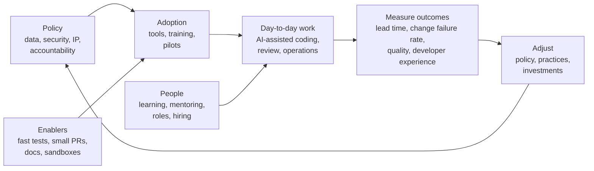

# Leading Teams in the AI Era: Adoption, Policy, and Measurement

*AI tools change how software gets written. Leadership decides whether that change makes teams faster and better — or just busier and riskier.*

---

> *“The best way to predict the future is to invent it.”*
>
> — **Alan Kay**, at a Xerox PARC meeting, 1971

## At a Glance

> **In one sentence:** Leading engineering teams through AI adoption means setting clear, safe usage policies, investing in the practices that make AI help (tests, small changes, documentation, review), measuring outcomes like lead time, change failure rate, and quality rather than output, protecting how people learn, and adapting roles, hiring, and culture as capabilities evolve.

**You'll learn**

- Why AI adoption is a leadership problem, not only a tooling decision
- Writing an AI usage policy: data, security, IP, and accountability
- Enabling practices that turn AI speed into real delivery
- Measuring impact with outcome metrics (DORA and more), not lines of code
- Protecting learning and career growth for early-career engineers
- Hiring, roles, and culture in AI-augmented teams

**Before you start:** [Engineering With AI Assistants](../15-AI-Era-Engineering/Engineering-With-AI-Assistants.md) · [Making Technical Decisions](Making-Technical-Decisions.md)

**Reading time:** about 10 minutes

---

## The Big Picture



*Tools alone don't create better outcomes. Policy, enabling practices, measurement, and people development do.*

---

## Introduction

An engineering director rolls out AI coding assistants to every team, then reports success: pull requests up 60%, lines of code up 80%. Two quarters later, incidents are up too, review queues are overflowing, senior engineers feel buried in reviews, and a customer data sample turns up in a public AI chat log from someone debugging a query. Junior engineers are shipping more code but struggle to debug it without help.

Another director runs the same rollout differently: a one-page usage policy, approved tools with data protections, a pilot with three teams, investment in faster tests and smaller pull requests, training on reviewing AI-generated code, and metrics focused on lead time, change failure rate, and developer satisfaction. Six months later, delivery is faster and more stable — and the director can show it.

The tools were identical. **Leadership** made the difference.

### Why Should Engineers Care?

- Senior engineers and tech leads increasingly shape how their teams use AI.
- Poor adoption creates security, quality, and learning problems that engineers live with daily.
- Understanding measurement protects teams from being judged by misleading numbers.

---

## The Problem It Solves

| Risk of unmanaged AI adoption | Leadership response |
|------------------------------|--------------------|
| Sensitive data sent to unapproved tools | Clear data policy and approved tools |
| More code, same review capacity | Small PRs, automation, review training |
| Quality regressions | Strong tests, CI gates, ownership norms |
| Misleading productivity metrics | Outcome-based measurement |
| Skills atrophy in early-career engineers | Deliberate learning practices |
| Inconsistent practices across teams | Shared guidance, communities of practice |
| Uncertainty and anxiety | Transparent communication about roles and expectations |

---

## Historical Background

- **2001 — Agile Manifesto** and later **DevOps** (late 2000s) showed that practices and culture, not just tools, determine delivery performance.
- **2014–2018 — DORA research** (Forsgren, Humble, Kim) linked delivery performance — deployment frequency, lead time, change failure rate, time to restore — to organizational outcomes; published in *Accelerate* (2018).
- **2021 — The SPACE framework** (Forsgren et al.) described developer productivity across Satisfaction, Performance, Activity, Communication, and Efficiency, warning against single metrics.
- **2021–2022 — AI coding assistants** reached mainstream use; early studies reported faster completion of well-defined tasks.
- **2023–present — Organization-wide adoption.** Companies wrote AI usage policies, faced incidents involving sensitive data pasted into public tools, and began measuring AI's effect on delivery and quality; research (including DORA reports) found benefits alongside risks to stability when fundamentals were weak.

---

## Core Concepts

### An AI Usage Policy

A short, clear policy covers:

| Area | Typical guidance |
|-----|-----------------|
| Approved tools | Which assistants and models are allowed, with enterprise data protections |
| Data | What can never be shared (secrets, customer personal data, credentials); what's allowed |
| Code ownership | The engineer who merges code owns it, regardless of how it was written |
| Review | AI-generated changes go through the same review, tests, and CI |
| Security | No production credentials for agents; sandboxing; dependency verification |
| IP and licensing | Follow legal guidance; enable filters for matching public code where available |
| Disclosure | When and how to note significant AI assistance (for example, in PRs) |
| Customer-facing AI | Separate governance for AI in products (evaluation, safety, privacy) |

Keep it short, practical, and updated as tools change.

### Enabling Practices

AI amplifies existing engineering practices — good and bad. Invest in:

- **Fast, reliable tests** so generated code can be verified quickly.
- **Small, reviewable changes** and clear PR descriptions.
- **Documentation and architecture notes** in repositories (context for humans and AI).
- **CI gates:** linting, type checks, security scanning, dependency checks.
- **Sandboxed environments** for agents.

### Measuring Impact: Outcomes Over Output

| Misleading metric | Why it misleads | Better alternative |
|------------------|----------------|-------------------|
| Lines of code | More code ≠ more value; AI inflates it | Features delivered, customer outcomes |
| PR count | Easy to inflate | Lead time for changes |
| AI suggestion acceptance rate | Measures tool usage, not value | Change failure rate, escaped defects |
| Individual velocity | Encourages gaming; ignores collaboration | Team-level DORA metrics |

Combine **DORA metrics** (deployment frequency, lead time, change failure rate, time to restore) with **quality** (escaped defects, incidents), **developer experience** (surveys: satisfaction, flow, cognitive load), and **cost**. Compare before and after, with pilot and comparison groups when possible.

### Protecting Learning

Early-career engineers build judgment by struggling with problems. Leaders can:

- Encourage "try first, then use AI" for learning tasks.
- Use AI as a tutor (explanations, quizzes, critiques).
- Hold explain-back reviews: engineers explain AI-assisted code.
- Keep mentoring, pairing, and on-call shadowing as core development.

### Roles, Hiring, and Culture

- **Roles shift** toward specification, review, system design, integration, and operations.
- **Hiring** emphasizes problem decomposition, verification, communication, and learning ability; interviews may allow or deliberately exclude AI tools to test different skills.
- **Culture:** openness about how AI is used, sharing effective practices, psychological safety to report AI-caused mistakes.

---

## Real-World Analogy

### Introducing Power Tools to a Workshop

When a carpentry workshop gets power tools, output can multiply — or accidents can. A good workshop lead sets safety rules (policy), trains everyone, keeps measuring tools and quality checks (tests and review), still teaches apprentices how wood behaves by hand (learning), and judges the workshop by the quality of furniture delivered, not the amount of sawdust produced (outcome metrics).

---

## How It Works In Practice

### A 90-Day Adoption Plan

| Phase | Actions |
|------|--------|
| Weeks 1–2 | Draft policy with security and legal; choose approved tools; baseline metrics (DORA, quality, survey) |
| Weeks 3–6 | Pilot with 2–3 volunteer teams; training on prompting, reviewing, and verifying AI output |
| Weeks 7–10 | Invest in enablers found lacking (test speed, CI checks, docs); collect practices and pitfalls |
| Weeks 11–13 | Compare pilot metrics with baseline and non-pilot teams; decide on broader rollout; update policy |

### Questions to Ask Every Quarter

- Did lead time and deployment frequency improve?
- Did change failure rate, incidents, or escaped defects rise?
- How do engineers rate their experience, flow, and review load?
- Are junior engineers growing — can they debug and design without AI?
- Did any policy violations or near-misses occur? What changed as a result?

### Communicating With the Team

- Be honest about goals: better outcomes and less toil, not headcount targets disguised as productivity.
- Invite engineers to shape practices; they know where AI helps and where it hurts.
- Share both successes and failures openly.

---

## Production Engineering Perspective

- **AI-assisted changes flow through the same pipeline** — no bypassing review, CI, or change management.
- **Agents in operations** (auto-remediation, incident summarization) need permissions, audit logs, kill switches, and human approval for impactful actions.
- **Incident reviews** should note whether AI-generated code or AI tools contributed, without blame, to improve practices.
- **Cost management:** AI tool and model costs grow with usage; track them per team.

---

## Tradeoffs

| Choice | Benefit | Cost |
|-------|--------|-----|
| Broad, fast rollout | Quick benefits | Risk before practices and policy are ready |
| Pilot first | Learn safely | Slower adoption |
| Strict policy | Lower risk | Frustration; shadow usage of unapproved tools |
| Loose policy | Flexibility | Data and security exposure |
| Measuring output | Easy numbers | Misleading, gameable |
| Measuring outcomes | Meaningful | Takes longer; needs baselines |

---

## Common Mistakes

### Beginner (New Leader) Mistakes

- No policy, or a policy nobody can understand.
- Measuring success by lines of code or PR count.
- Assuming AI will fix weak engineering practices.

### Intermediate Mistakes

- Rolling out tools without training on review and verification.
- Ignoring review-capacity bottlenecks.
- Banning AI entirely, pushing usage into unapproved, unsafe tools.

### Senior-Level Mistakes

- Using AI adoption to justify cuts before measuring actual impact.
- Neglecting early-career development, weakening the future senior pipeline.
- Treating adoption as a one-time project rather than an ongoing practice that evolves with the tools.

---

## Failure Scenarios

### Scenario 1: The Leaked Data

An engineer pastes production logs containing customer emails into an unapproved AI tool to debug an issue.

**Fix:** approved tools with data protections, clear rules about customer data, redaction helpers, and training.

### Scenario 2: The Output Illusion

PR count rises sharply; leadership celebrates. Incidents and review delays rise too; lead time doesn't improve.

**Fix:** outcome metrics and before/after comparisons; invest in review capacity and CI.

### Scenario 3: The Hollow Skills

After a year, junior engineers can produce features with AI but struggle to debug production issues alone.

**Fix:** deliberate learning practices, explain-back reviews, on-call shadowing, and mentoring.

### Scenario 4: The Unsupervised Agent

An autonomous agent with broad repository and deploy permissions merges a change that breaks production.

**Fix:** agents work in sandboxes, open pull requests, and can't merge or deploy without human review.

---

## Real-World Industry Examples

- **DORA's annual State of DevOps reports** have studied AI adoption's effects on delivery, reporting benefits for individual productivity alongside risks to stability when foundational practices are weak.
- **Several large companies restricted employee use of public AI chatbots in 2023** after incidents involving sensitive internal information, then introduced approved enterprise tools.
- **The SPACE framework** is widely used to design balanced developer productivity measurement.
- **Many companies now publish internal AI usage guidelines** covering data classification, approved tools, and accountability for AI-assisted code.

---

## Interview Questions

### Beginner

**Q1: What should an AI usage policy for engineers cover?**

*Model answer:* Approved tools, what data may and may not be shared (never secrets or customer personal data in unapproved tools), ownership and review of AI-generated code, security rules for agents, licensing considerations, and how to report issues.

### Intermediate

**Q2: How would you measure whether AI tools are helping your team?**

*Model answer:* Compare outcome metrics before and after adoption (and against a comparison group if possible): lead time, deployment frequency, change failure rate, time to restore, escaped defects, plus developer experience surveys and cost. Avoid output metrics like lines of code or PR counts.

**Q3: Why might AI adoption increase change failure rate?**

*Model answer:* Larger or more frequent changes with the same review capacity, less understanding of generated code, weak tests, and plausible-but-wrong code passing superficial review. Strong tests, small changes, and review discipline counter this.

### Senior

**Q4: How do you protect the growth of junior engineers in an AI-assisted team?**

*Model answer:* Encourage attempting problems before using AI, use AI as a tutor, require explain-back of AI-assisted code, keep pairing and mentoring, give ownership of debugging and on-call with support, and assess growth in judgment — not just output.

### Architecture / Leadership

**Q5: Your CEO asks for a 30% productivity gain from AI this year. How do you respond?**

*Model answer:* Agree on what "productivity" means in outcomes (faster delivery of valuable features, fewer incidents), establish baselines, run pilots, invest in enabling practices, and report measured results honestly. Point out that AI accelerates coding more than review, testing, and coordination, so gains depend on addressing those bottlenecks. Commit to measured improvement, not an arbitrary number.

---

## Hands-On Lab

Compute DORA metrics from a deployment log to compare two periods — the right way to check whether a change (like AI adoption) actually helped. Pure Python; save as `dora_lab.py` and run it.

```python
from datetime import datetime
from statistics import median

def parse(rows):
    return [{"commit": datetime.fromisoformat(c), "deploy": datetime.fromisoformat(d), "failed": f,
             "restore_min": r} for c, d, f, r in rows]

before = parse([
    ("2026-01-02T10:00", "2026-01-06T15:00", False, 0), ("2026-01-05T09:00", "2026-01-09T11:00", True, 180),
    ("2026-01-12T14:00", "2026-01-15T10:00", False, 0), ("2026-01-19T11:00", "2026-01-23T16:00", False, 0),
    ("2026-01-26T10:00", "2026-01-29T12:00", True, 240), ("2026-02-02T09:00", "2026-02-05T15:00", False, 0),
])
after = parse([
    ("2026-06-01T10:00", "2026-06-02T11:00", False, 0), ("2026-06-02T09:00", "2026-06-03T10:00", False, 0),
    ("2026-06-04T14:00", "2026-06-05T09:00", True, 45), ("2026-06-08T11:00", "2026-06-08T17:00", False, 0),
    ("2026-06-09T10:00", "2026-06-10T12:00", False, 0), ("2026-06-11T09:00", "2026-06-12T10:00", True, 30),
    ("2026-06-15T10:00", "2026-06-15T16:00", False, 0), ("2026-06-16T09:00", "2026-06-17T11:00", False, 0),
    ("2026-06-18T13:00", "2026-06-19T10:00", True, 60), ("2026-06-22T10:00", "2026-06-23T09:00", False, 0),
])

def dora(deploys, weeks):
    lead = median((d["deploy"] - d["commit"]).total_seconds() / 3600 for d in deploys)
    failures = [d for d in deploys if d["failed"]]
    return {"deploys/week": round(len(deploys) / weeks, 1),
            "median lead time (h)": round(lead, 1),
            "change failure rate": f"{len(failures) / len(deploys):.0%}",
            "median time to restore (min)": median(d["restore_min"] for d in failures) if failures else 0}

for name, data, weeks in [("before", before, 5), ("after", after, 4)]:
    print(f"{name:7}", dora(data, weeks))
```

**What to notice**
- In this made-up example, the "after" period deploys more often with much shorter lead times and faster recovery — real improvements.
- But the change failure rate barely moved (about 33% before, 30% after), so each deploy is no more reliable than before. More, faster changes at a similar failure rate mean more total failures to handle. A leader who looks only at speed misses that.
- **Exercise:** add a few more failed deploys to "after" and watch how quickly the story changes. Then list which enabling practices (tests, smaller PRs, canaries) you would invest in to bring the failure rate down.

---

## Test Yourself

*Answer each question in your head or on paper first, then open the answer to check.*

<details markdown="1">
<summary><strong>1. Why is AI adoption a leadership problem, not just a tooling decision?</strong></summary>

Outcomes depend on policy, practices, measurement, training, and culture — the same tools produce very different results in different organizations.

</details>

<details markdown="1">
<summary><strong>2. Name the four DORA metrics.</strong></summary>

Deployment frequency, lead time for changes, change failure rate, and time to restore service.

</details>

<details markdown="1">
<summary><strong>3. Why are lines of code and PR count poor measures of AI impact?</strong></summary>

They measure output, which AI easily inflates, not value or quality — and they're easy to game.

</details>

<details markdown="1">
<summary><strong>4. What does the SPACE framework stand for?</strong></summary>

Satisfaction and well-being, Performance, Activity, Communication and collaboration, and Efficiency and flow.

</details>

<details markdown="1">
<summary><strong>5. Who owns AI-generated code in a well-run team?</strong></summary>

The engineer who merges it — the same as any other code.

</details>

<details markdown="1">
<summary><strong>6. What's a risk of banning AI tools entirely?</strong></summary>

People may use unapproved, unsafe tools anyway ("shadow AI"), creating data and security exposure without oversight.

</details>

<details markdown="1">
<summary><strong>7. Name two practices that protect junior engineers' learning.</strong></summary>

Any two of: try before using AI, AI as a tutor, explain-back reviews, pairing and mentoring, supported ownership of debugging and on-call.

</details>

---

## Cheat Sheet

**Policy essentials:** approved tools · data rules (no secrets or customer PII in unapproved tools) · you own what you merge · same review and CI · sandboxed agents · licensing guidance · how to report issues.

**Enablers:** fast reliable tests · small PRs · repo docs and architecture notes · CI security gates · sandboxes.

| Measure | Don't measure (alone) |
|--------|---------------------|
| Lead time, deployment frequency | Lines of code |
| Change failure rate, time to restore | PR count |
| Escaped defects, incidents | Suggestion acceptance rate |
| Developer experience surveys | Individual velocity |
| Cost per outcome | Tool usage alone |

**Adoption loop:** policy → pilot → enable → measure → adjust → expand.

---

## In the AI Era

This chapter is entirely about leading in the AI era, and it echoes the handbook's main message: the fundamentals — clear decisions, good reviews, strong tests, honest measurement, and deliberate learning — are what turn powerful tools into better outcomes. Tools will keep changing; leaders who invest in fundamentals and measure honestly will adapt to each change.

**Try it:** Draft a one-page AI usage policy for your team using the table in this chapter. Share it with a teammate from security or legal and note what they add.

---

## Key Takeaways

1. AI adoption succeeds or fails on leadership: policy, practices, measurement, and culture.
2. Write a short, clear usage policy covering data, security, ownership, and review.
3. Invest in enablers — tests, small PRs, documentation, CI gates — that let teams verify AI output.
4. Measure outcomes (DORA, quality, developer experience, cost), not output.
5. Protect learning and growth for early-career engineers.
6. Keep humans accountable and agents constrained; iterate as tools evolve.

---

## What to Read Next

- **[Engineering With AI Assistants](../15-AI-Era-Engineering/Engineering-With-AI-Assistants.md)** — the individual workflow behind team adoption
- **[Deployments: Strategies and Risks](../11-Production-Engineering/Deployments-Strategies-And-Risks.md)** — DORA metrics in depth
- **[Mentoring Junior Engineers](Mentoring-Junior-Engineers.md)** — growing people alongside AI tools

---

## Further Reading

- **Nicole Forsgren, Jez Humble & Gene Kim — "Accelerate" (2018)** and DORA research: [https://dora.dev](https://dora.dev)
- **Forsgren et al. — "The SPACE of Developer Productivity" (ACM Queue, 2021):** [https://queue.acm.org/detail.cfm?id=3454124](https://queue.acm.org/detail.cfm?id=3454124)
- **Camille Fournier — "The Manager's Path" (2017)**
- **Will Larson — "An Elegant Puzzle" (2019)**
- **NIST AI Risk Management Framework:** [https://www.nist.gov/itl/ai-risk-management-framework](https://www.nist.gov/itl/ai-risk-management-framework)

---

*This chapter is part of the Modern Software Engineering Handbook — a comprehensive guide to the concepts, principles, and practices that every professional software engineer should know.*
