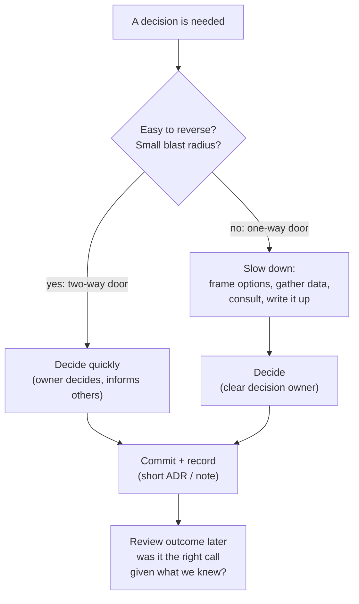

# Making Technical Decisions

*Good decisions come from a good process: matching effort to stakes, making trade-offs explicit, deciding who decides, and learning from results — not from being right every time.*

---

> *“Most decisions should probably be made with somewhere around 70% of the information you wish you had. If you wait for 90%, in most cases, you're probably being slow.”*
>
> — **Jeff Bezos**, Amazon shareholder letter, 2016

## At a Glance

> **In one sentence:** Strong technical decision-making matches rigor to reversibility and impact, frames options and trade-offs explicitly, involves the right people with clear decision rights, commits once decided, records the reasoning, and revisits decisions when the facts change.

**You'll learn**

- One-way and two-way door decisions, and matching effort to stakes
- A simple framework for framing options and trade-offs
- Decision rights: who decides, who is consulted, who is informed
- Handling disagreement: "disagree and commit," escalation, and consensus pitfalls
- Build vs. buy, and choosing technologies without hype
- Recording decisions and learning from outcomes

**Before you start:** [How To Think Like An Engineer](../01-Foundations/How-To-Think-Like-An-Engineer.md) · [What Is Software Architecture?](../07-Software-Architecture/What-Is-Software-Architecture.md)

**Reading time:** about 10 minutes

---

## The Big Picture



*Most decisions are two-way doors. Spending one-way-door effort on them is its own kind of mistake.*

---

## Introduction

A team spends six weeks debating which frontend framework to use for a new internal tool. There are documents, benchmarks, and three long meetings. Meanwhile, a decision to store customer data in a format that can't support per-customer deletion is made in a ten-minute conversation — and costs a year of work when privacy regulations require deletion.

Both are failures of decision-making, and they're the same failure in opposite directions: **effort mismatched to stakes**. The framework choice for an internal tool was easy to change later; the data format wasn't.

Senior engineers aren't distinguished by always making the right call — nobody does. They're distinguished by a reliable **process**: recognizing which decisions matter, making trade-offs explicit, involving the right people, committing, and learning from outcomes.

### Why Should Engineers Care?

- Technical decisions compound: a good early choice saves years; a bad one costs them.
- Unclear decision-making wastes more engineering time than almost anything else — endless debates, revisited choices, and passive resistance.
- Making good decisions visibly is how engineers grow into senior and staff roles.

---

## The Problem It Solves

| Symptom | Underlying problem |
|--------|-------------------|
| Endless debates on small choices | No distinction between reversible and irreversible decisions |
| Big decisions made casually | Same |
| "Who decided this?" | Unclear decision rights |
| Decisions reopened every month | No commitment or record |
| Loud opinions win | No structured framing or evidence |
| Technology chosen because it's trendy | Missing trade-off analysis |

---

## Historical Background

- **1950s–1970s — Decision science.** Herbert Simon's idea of **bounded rationality** (people make "good enough" decisions with limited information and time) earned a Nobel Prize in 1978 and remains a realistic model for engineering decisions.
- **1979 — Kahneman and Tversky's prospect theory** documented systematic biases in human judgment; Kahneman's *Thinking, Fast and Slow* (2011) popularized them.
- **1970s — RACI-style responsibility matrices** became common in project management for clarifying who is Responsible, Accountable, Consulted, and Informed.
- **2015–2016 — Amazon's "one-way and two-way doors"** and "disagree and commit" were described in Jeff Bezos's shareholder letters.
- **2011 onward — Architecture Decision Records** made recording technical decisions lightweight.
- **2018 — Annie Duke's *Thinking in Bets*** popularized separating decision quality from outcome quality.

---

## Core Concepts

### One-Way and Two-Way Doors

- **Two-way door:** easy to reverse, limited blast radius (a library for an internal tool, a UI layout, a feature flag default). Decide quickly, usually by the person closest to the work.
- **One-way door:** hard or costly to reverse (data models, public APIs, core platforms, security architecture, vendor lock-in, hiring). Slow down, analyze, consult.

Many decisions can be turned from one-way into two-way doors: prototypes, feature flags, abstraction layers, and pilot periods.

### Decision Quality vs. Outcome Quality

A good decision can lead to a bad outcome (bad luck), and a bad decision can lead to a good one (good luck). Judge decisions by the process and the information available at the time — otherwise teams learn the wrong lessons.

### Framing a Decision

1. **Problem and goal:** what are we deciding, and why now?
2. **Constraints:** time, budget, team skills, regulations, existing systems.
3. **Options:** at least two real alternatives (including "do nothing").
4. **Criteria:** what matters, weighted.
5. **Trade-offs:** what each option gives up.
6. **Recommendation** and the conditions under which you'd revisit it.

### Decision Rights

Clarify who decides before debating. Common models:

| Model | Who decides | When it fits |
|------|------------|-------------|
| Owner decides | The accountable person, after consulting | Most decisions |
| Consensus | Everyone must agree | Small groups, low urgency, high buy-in needed |
| Consent | Proceed unless someone has a serious objection | Moving quickly while respecting concerns |
| Escalation | A designated leader breaks deadlocks | Genuine cross-team conflicts |

Frameworks like **RACI** or **DACI** (Driver, Approver, Contributors, Informed) make roles explicit.

### Disagree and Commit

Once a decision is made through a fair process, everyone commits to making it succeed, even those who disagreed. Disagreement belongs *before* the decision; after it, reopening should require new information.

### Common Biases

| Bias | In engineering |
|-----|---------------|
| Anchoring | First estimate or first option dominates |
| Confirmation bias | Seeking only evidence for your favorite |
| Sunk cost | Continuing a failing project because of past investment |
| Availability | Overweighting the last incident |
| Novelty bias / hype | Preferring new technology because it's new |
| HiPPO | Deferring to the highest-paid person's opinion |

### Build vs. Buy (and Adopt)

Build when it's core to your differentiation or no suitable option exists. Buy or adopt open source when it's a commodity capability, when the total cost of ownership (maintenance, on-call, security, upgrades) of building is higher, or when time-to-market matters. Always include operating costs and exit costs.

---

## Real-World Analogy

### Choosing a Restaurant vs. Buying a House

Picking where to eat tonight is a two-way door — decide in a minute, and if it's bad, choose differently next time. Buying a house is a one-way door — you research neighborhoods, get inspections, consult family and advisors, and compare options carefully. Using house-buying effort to pick dinner wastes time; using dinner effort to buy a house is reckless.

---

## How It Works In Practice

### A One-Page Decision Brief

```
Decision:     Choose the primary database for the new billing service
Door type:    One-way (data model, migrations, operational expertise)
Owner:        Priya (tech lead); Approver: Head of Platform
Consulted:    Payments team, SRE, Security       Informed: Engineering all-hands
Options:      1) PostgreSQL (managed)  2) DynamoDB  3) CockroachDB
Criteria:     Transactions (40%), team expertise (25%), ops burden (20%), cost (15%)
Recommendation: PostgreSQL — strong transactions, team expertise, managed service
Trade-offs:   Vertical write limits; revisit if writes exceed ~10k/s sustained
Decide by:    Oct 15
```

### Running a Decision Meeting

- Send the brief in advance; start by confirming the decision owner and the deadline.
- Spend time on disagreements, not on reading.
- Ask explicitly: "What would change your mind?" and "What are we giving up?"
- End with a clear decision, or a clear next step and date.
- Record the outcome and share it.

### Technology Selection Without Hype

- Start from the problem and constraints, not the technology.
- Prefer boring, proven technology for core systems ("innovation tokens": spend novelty only where it creates real advantage).
- Prototype the riskiest assumption before committing.
- Consider the whole lifecycle: hiring, operations, security updates, community health, and exit.

---

## Production Engineering Perspective

- **Operational impact is a decision criterion:** who will be on call, how it's monitored, and how incidents are handled.
- **Pilot and roll back:** use feature flags and limited rollouts to turn risky decisions into reversible experiments.
- **Decision logs** (ADRs) help incident responders understand why systems behave as they do.
- **Revisit triggers:** record the conditions (scale, cost, team size) that should prompt re-evaluation.

---

## Tradeoffs

| Approach | Benefit | Cost |
|---------|--------|-----|
| Fast decisions | Momentum, learning by doing | Occasional costly mistakes |
| Slow, thorough decisions | Fewer irreversible errors | Delay; analysis paralysis |
| Consensus | Strong buy-in | Slow; lowest-common-denominator outcomes |
| Single decision owner | Speed and accountability | Risk of ignoring input |
| Standardized technology | Shared expertise, easier operations | Occasionally suboptimal fit |

---

## Common Mistakes

### Beginner Mistakes

- Presenting only one option.
- Arguing preferences instead of criteria and trade-offs.
- Not asking who decides.

### Intermediate Mistakes

- Treating all decisions as one-way doors (or all as two-way doors).
- Reopening decisions without new information.
- Choosing technology because it's popular or interesting.

### Senior-Level Mistakes

- Making decisions alone that affect many teams without consultation.
- Unclear decision rights across teams, leading to stalemates.
- Judging past decisions only by outcomes, teaching the wrong lessons.

---

## Failure Scenarios

### Scenario 1: Analysis Paralysis

A team evaluates message brokers for three months for a low-volume internal workflow. A simple managed queue would have worked and could have been replaced later.

**Fix:** classify as a two-way door; time-box the decision.

### Scenario 2: The Casual One-Way Door

A public API is designed in an afternoon and shipped to customers. Its design flaws must be supported for years.

**Fix:** recognize public APIs as one-way doors; review design, version from day one.

### Scenario 3: Consensus Deadlock

Two senior engineers disagree; the team insists on consensus; nothing is decided for weeks.

**Fix:** clear decision owner and escalation path; disagree and commit.

### Scenario 4: The Silent Veto

A decision is made, but a team that disagreed quietly doesn't implement it. The migration stalls for a year.

**Fix:** fair process with real consultation, explicit commitment, and follow-up on execution.

---

## Real-World Industry Examples

- **Amazon's shareholder letters** (2015, 2016) describe one-way and two-way door decisions, "disagree and commit," and deciding with roughly 70% of desired information.
- **Architecture Decision Records** are used widely, including in large open-source projects, to capture decisions and reasoning.
- **Dan McKinley's essay "Choose Boring Technology" (2015)** introduced "innovation tokens," influencing how many teams choose technologies.
- **Google's and other companies' design review processes** formalize consultation for significant technical decisions.

---

## Interview Questions

### Beginner

**Q1: How do you decide how much time to spend on a technical decision?**

*Model answer:* By how reversible it is and how big its impact is. Easily reversible, low-impact decisions should be made quickly; hard-to-reverse, high-impact decisions deserve analysis, consultation, and documentation.

### Intermediate

**Q2: How do you handle a technical disagreement with a peer?**

*Model answer:* Clarify the goal and criteria we agree on, make each option's trade-offs explicit, look for data or a small experiment to resolve factual disagreements, and agree on who decides. Once decided, commit fully — and record the reasoning so it can be revisited if new information appears.

**Q3: What's the difference between a good decision and a good outcome?**

*Model answer:* A good decision uses a sound process and the best available information; the outcome also depends on luck and unknowns. Evaluating decisions only by outcomes teaches the wrong lessons.

### Senior

**Q4: How do you decide between building and buying a component?**

*Model answer:* Consider whether it's core to our differentiation, total cost of ownership (development, maintenance, on-call, security, upgrades) versus licensing and integration costs, time to market, fit to requirements, vendor risk and exit costs, and team expertise. Build what differentiates us; buy or adopt commodities.

### Architecture / Leadership

**Q5: How would you improve decision-making in an organization where decisions are slow and frequently reopened?**

*Model answer:* Introduce explicit decision rights (owners and approvers), classify decisions by reversibility with matching processes, use short decision briefs and ADRs, time-box decisions, adopt "disagree and commit" with a rule that reopening requires new information, and review significant decisions later to learn — focusing on process quality, not blame.

---

## Hands-On Lab

A small helper that classifies decisions by reversibility and impact and recommends a process. Pure Python; save as `decision_triage_lab.py` and run it.

```python
decisions = [
    # (description, reversibility 1-5 (5 = easy to undo), blast radius 1-5 (5 = whole company))
    ("Pick a date library for an internal tool", 5, 1),
    ("Choose the primary database for billing", 1, 4),
    ("Rename a private function", 5, 1),
    ("Design the public REST API for partners", 1, 5),
    ("Default value of a feature flag", 4, 2),
    ("Adopt a new cloud provider", 1, 5),
    ("Switch CI runners to a new instance type", 4, 3),
]

def triage(reversibility, blast_radius):
    risk = (6 - reversibility) * blast_radius          # 1..25
    if risk <= 4:
        return "two-way door: owner decides now, tells the team"
    if risk <= 12:
        return "moderate: short written proposal, 1-2 reviewers, decide within a week"
    return "one-way door: decision brief + options + consultation + ADR, named approver"

for desc, rev, blast in sorted(decisions, key=lambda d: -(6 - d[1]) * d[2]):
    print(f"{desc:44} -> {triage(rev, blast)}")
```

**What to notice**
- Most everyday decisions land in the "decide now" bucket. A handful deserve serious process — and those are where senior engineers should spend their time.
- The ratings are judgment calls; the value is in discussing them explicitly ("is this really hard to reverse?").
- **Exercise:** list five decisions your team made last month. Rate each, then ask: did we spend the right amount of effort on each?

---

## Test Yourself

*Answer each question in your head or on paper first, then open the answer to check.*

<details markdown="1">
<summary><strong>1. What's a two-way door decision?</strong></summary>

One that's easy to reverse with limited impact, so it should be made quickly by the person closest to the work.

</details>

<details markdown="1">
<summary><strong>2. Give three examples of one-way door technical decisions.</strong></summary>

Any three of: core data models, public APIs, primary database or cloud platform, security architecture, major vendor contracts, programming language for a core system.

</details>

<details markdown="1">
<summary><strong>3. What does "disagree and commit" mean?</strong></summary>

After a fair decision process, people who disagreed still fully support the decision; reopening it should require new information.

</details>

<details markdown="1">
<summary><strong>4. What does DACI stand for?</strong></summary>

Driver, Approver, Contributors, Informed.

</details>

<details markdown="1">
<summary><strong>5. What is the sunk cost fallacy?</strong></summary>

Continuing an effort because of what has already been invested rather than based on future costs and benefits.

</details>

<details markdown="1">
<summary><strong>6. How can a one-way door be made more reversible?</strong></summary>

Through prototypes, pilots, feature flags, abstraction layers, and staged rollouts.

</details>

<details markdown="1">
<summary><strong>7. What should a decision record include?</strong></summary>

Context, options considered, the decision, trade-offs and consequences, and conditions for revisiting it.

</details>

---

## Cheat Sheet

**Triage:** reversibility × blast radius → two-way door (decide now) · moderate (short proposal) · one-way door (brief, consult, ADR).

**Decision brief:** problem · constraints · options (≥ 2) · weighted criteria · trade-offs · recommendation · owner · deadline · revisit triggers.

| Decision model | Use when |
|---------------|---------|
| Owner decides | Default |
| Consensus | Small group, buy-in critical |
| Consent | Speed with safeguards |
| Escalation | Genuine deadlock |

**Habits:** ask "who decides?" first · ask "what would change your mind?" · commit after deciding · judge process, not luck.

---

## In the AI Era

- **AI can widen your options and stress-test your reasoning:** ask it for alternatives, risks, and counterarguments to your recommendation. It's a cheap devil's advocate.
- **But AI doesn't know your constraints** — team skills, budget, politics, existing systems — so its recommendations reflect generic best practice. Keep the weights and the final call human.
- **Decisions about AI are often one-way doors in disguise:** sending customer data to a provider, building on one vendor's proprietary features, or letting agents act autonomously. Treat them with one-way-door rigor.
- **Beware of automation bias:** confident AI answers can anchor a discussion. Frame the problem before asking.

**Try it:** Take a real decision brief and ask an AI assistant to argue for the option you rejected. Did it raise a point you hadn't considered?

---

## Key Takeaways

1. Match decision effort to reversibility and impact; most decisions are two-way doors.
2. Frame decisions with real options, explicit criteria, and stated trade-offs.
3. Clarify who decides before debating, and use disagree-and-commit.
4. Watch for biases: anchoring, sunk cost, hype, and deference to authority.
5. Record significant decisions and the conditions for revisiting them.
6. Judge decisions by process and information, not just outcomes.

---

## What to Read Next

- **[Writing Design Documents](Writing-Design-Documents.md)** — writing decisions down so others can engage
- **[Estimating Software Projects](Estimating-Software-Projects.md)** — deciding with uncertain timelines
- **[What Is Software Architecture?](../07-Software-Architecture/What-Is-Software-Architecture.md)** — ADRs and architectural decisions

---

## Further Reading

- **Jeff Bezos — Amazon shareholder letters (2015, 2016):** [https://www.aboutamazon.com/news/company-news/2016-letter-to-shareholders](https://www.aboutamazon.com/news/company-news/2016-letter-to-shareholders)
- **Daniel Kahneman — "Thinking, Fast and Slow" (2011)**
- **Annie Duke — "Thinking in Bets" (2018)**
- **Dan McKinley — "Choose Boring Technology" (2015):** [https://boringtechnology.club](https://boringtechnology.club)
- **Will Larson — "Staff Engineer" (2021)** and **"An Elegant Puzzle" (2019)**

---

*This chapter is part of the Modern Software Engineering Handbook — a comprehensive guide to the concepts, principles, and practices that every professional software engineer should know.*
