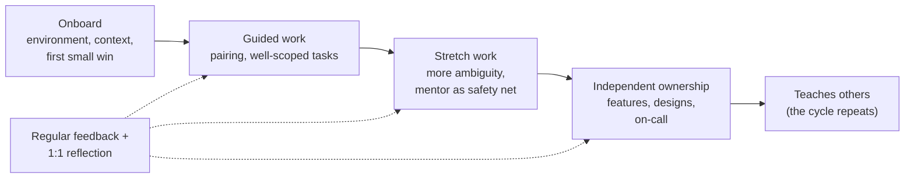

# Mentoring Junior Engineers

*The goal of mentoring isn't to hand out answers. It's to help someone become an engineer who can find answers without you.*

---

> *“What I cannot create, I do not understand.”*
>
> — **Richard Feynman**, written on his blackboard, found at his death in 1988

## At a Glance

> **In one sentence:** Good mentoring builds independence through a deliberate progression — clear expectations, well-scoped work with growing challenge, questions before answers, specific and timely feedback, psychological safety to ask and fail, and regular reflection on growth — while the mentor also grows by teaching.

**You'll learn**

- Mentoring vs. coaching vs. sponsorship vs. management
- Onboarding that gets new engineers productive quickly
- Scoping tasks in the "stretch zone"
- Teaching through questions, pairing, and review
- Giving feedback that helps people grow
- Growth plans, psychological safety, and learning in the age of AI

**Before you start:** [Code Review: Giving and Receiving Feedback](Code-Review-Giving-And-Receiving-Feedback.md) · [How To Solve Problems Systematically](../01-Foundations/How-To-Solve-Problems-Systematically.md)

**Reading time:** about 10 minutes

---

## The Big Picture



*Support decreases as capability grows. The mentor's job is to adjust the level of support — not to keep it constant.*

---

## Introduction

A junior engineer joins a team. In week one, they're given access to a large codebase and told to "pick up a ticket." They struggle for three days with an environment problem before asking for help — they didn't want to look incompetent. Their first pull request receives thirty comments with no explanation. By month three, they're quiet in meetings and take weeks on small tasks. The team concludes they're "not a strong hire."

Another junior engineer joins a different team. They have a working environment on day one, a buddy, a written "first two weeks" plan, and a small bug to fix that ships by day three. Their mentor pairs with them on their first feature, asks questions like "where do you think the data comes from?" before explaining, and gives specific feedback weekly. By month three, they're fixing bugs independently and asking good questions in design reviews.

These two engineers might be equally talented. The difference is the environment they were given. Mentoring is one of the highest-leverage things a senior engineer does: it multiplies the team's capability.

### Why Should Engineers Care?

- Teams grow by hiring and developing people; senior engineers' impact is measured partly by how much stronger they make others.
- Teaching deepens your own understanding — Feynman's point.
- Mentoring skills (explaining, giving feedback, delegating) are core to staff engineering and management.

---

## The Problem It Solves

| Without deliberate mentoring | With it |
|-----------------------------|--------|
| Slow ramp-up; weeks to first contribution | First meaningful change within days |
| Juniors afraid to ask questions | Psychological safety to ask and fail |
| Knowledge stuck with a few seniors | Knowledge spread; fewer bottlenecks |
| Juniors given either trivial or overwhelming work | Work matched to the stretch zone |
| Vague feedback at annual reviews | Specific, timely, actionable feedback |

---

## Historical Background

- **Ancient origins — "Mentor."** In Homer's *Odyssey*, Mentor is the advisor to Odysseus's son Telemachus; the name became the word for a trusted guide.
- **Medieval–industrial eras — Apprenticeship.** Crafts were learned by working alongside masters, progressing through apprentice, journeyman, and master stages.
- **1978 — Vygotsky's "zone of proximal development"** (published in English in *Mind in Society*) described the space between what a learner can do alone and what they can do with guidance — the basis for "stretch" assignments.
- **1990s–2000s — Pair programming** was popularized by Extreme Programming; software craftsmanship revived apprenticeship ideas.
- **2006 — Carol Dweck's *Mindset*** popularized "growth mindset" — the belief that abilities develop through effort and learning.
- **2012–2015 — Google's Project Aristotle** found psychological safety to be the most important factor in team effectiveness among those studied.

---

## Core Concepts

### Mentoring, Coaching, Sponsorship, Managing

| Role | Focus |
|-----|------|
| Mentor | Shares experience and advice ("here's what I've learned") |
| Coach | Asks questions to help someone find their own answers |
| Sponsor | Uses influence to create opportunities and advocate for someone |
| Manager | Owns performance, career decisions, and priorities |

Good senior engineers switch between mentoring, coaching, and sponsoring as needed.

### The Stretch Zone

Tasks should be slightly beyond current ability — challenging but achievable with support. Too easy: no growth. Too hard: frustration and loss of confidence. Increase scope and ambiguity gradually.

### Questions Before Answers

When a junior asks for help, often ask first:

- "What have you tried so far?"
- "What do you think is happening?"
- "Where would you look next?"

Then give hints before answers. This builds problem-solving skills — but know when to just unblock someone (for example, environment issues or time-critical work).

### Timeboxing Stuck Time

Encourage a rule like: "If you're stuck for more than 30–60 minutes without progress, ask — and bring what you've tried." It balances independence with not wasting days.

### Feedback That Helps

- **Specific:** "Your design doc's rollout section was excellent — the rollback plan was clear" beats "good job."
- **Timely:** close to the event.
- **Behavioral:** about actions and outcomes, not personality.
- **Balanced:** acknowledge strengths and suggest one or two improvements at a time.
- A common structure: **situation → behavior → impact → suggestion**.

### Psychological Safety

People learn fastest when they feel safe asking "dumb" questions, admitting mistakes, and proposing ideas. Mentors create it by admitting their own mistakes, thanking people for questions, and responding to errors with curiosity rather than blame.

### Growth Plans

Agree on a few specific growth areas (for example, "debugging production issues," "writing design docs"), concrete opportunities to practice them, and how progress will be recognized. Review every month or quarter.

---

## Real-World Analogy

### Teaching Someone to Ride a Bicycle

You don't hand a child a bike and walk away, and you don't hold on forever. First you hold the seat firmly; then lightly; then you run alongside with your hand just above the seat; then you let go without saying so, and they're riding. You choose a flat, empty path before a busy road. When they fall, you check they're okay and help them try again. The goal was always that they ride without you.

---

## How It Works In Practice

### A First-Two-Weeks Plan

| Day(s) | Focus |
|-------|------|
| 1 | Working laptop and dev environment; meet the team and buddy; read team overview |
| 2–3 | Fix a small, well-defined bug; experience the full cycle: branch, test, review, deploy |
| 4–5 | Pair with mentor on a feature; architecture walkthrough |
| Week 2 | Own a small feature with mentor support; shadow on-call; first 1:1 reflection |

### Mentoring Techniques

- **Pairing:** driver/navigator sessions — let the junior drive, with the mentor navigating.
- **Review as teaching:** explain the "why" behind review comments; point to examples.
- **Think aloud:** when debugging or designing, narrate your reasoning so they learn the process, not just the answer.
- **Gradual ownership:** from tasks → features → components → designs → on-call.
- **Share context:** why the system is the way it is, who to ask, where decisions are recorded.

### A Monthly 1:1 Agenda

1. What went well? What was hard?
2. What did you learn? What do you want to learn next?
3. Feedback both ways.
4. Next stretch opportunity and how I'll support it.

---

## Production Engineering Perspective

- **On-call is a learning opportunity** — with shadowing first, then reverse shadowing (the junior leads, the mentor watches), then primary.
- **Blameless culture** matters most for new engineers: their first incident shapes whether they'll speak up in the future.
- **Documentation and runbooks** help juniors be independent; ask them to improve docs as they learn — fresh eyes spot gaps.
- **Safe environments** (sandboxes, staging, feature flags) let juniors experiment without fear of breaking production.

---

## Tradeoffs

| Choice | Benefit | Cost |
|-------|--------|-----|
| Giving answers quickly | Fast unblocking | Less learning |
| Coaching with questions | Deeper learning | Slower; can frustrate if overused |
| Stretch assignments | Growth | Risk of delays or mistakes |
| Close supervision | Fewer mistakes | Less autonomy and confidence |
| Pairing | Rich knowledge transfer | Senior time |

The right balance changes over time: more support early, more autonomy later.

---

## Common Mistakes

### Beginner (New Mentor) Mistakes

- Taking over the keyboard instead of guiding.
- Giving answers to every question immediately.
- Assuming context the junior doesn't have.

### Intermediate Mistakes

- Only giving critical feedback, rarely praise.
- Assigning only low-value work (or only overwhelming work).
- Not making it safe to ask questions.

### Senior-Level Mistakes

- Mentoring only people who remind you of yourself.
- Failing to sponsor — never recommending mentees for visible opportunities.
- Treating mentoring as optional work that happens only when there's spare time.

---

## Failure Scenarios

### Scenario 1: The Silent Struggle

A new engineer spends three days stuck on an environment issue, afraid to ask.

**Fix:** explicit "ask after 30–60 minutes" norm, a buddy, and a working environment on day one.

### Scenario 2: The Overwhelming First Project

A junior is assigned a complex, ambiguous project with no support. It stalls, and their confidence drops.

**Fix:** scope work in the stretch zone; break ambiguous projects into guided steps.

### Scenario 3: The Crushing Review

A first pull request gets dozens of blunt, unexplained comments.

**Fix:** kind, explained feedback; pair on the fixes; highlight what was done well.

### Scenario 4: The Forever Junior

After two years, an engineer has only done small tickets and never owned a design or incident.

**Fix:** a growth plan with deliberately increasing ownership and sponsorship for visible work.

---

## Real-World Industry Examples

- **Google's Project Aristotle** identified psychological safety as the top factor in team effectiveness among those studied.
- **Pair programming and "buddy" onboarding programs** are common across tech companies to speed ramp-up.
- **Engineering career ladders** published by many companies describe mentoring and "making others better" as expectations of senior levels.
- **Open-source mentoring programs** such as Google Summer of Code and Outreachy pair newcomers with experienced maintainers.

---

## Interview Questions

### Beginner

**Q1: How would you help a new team member get productive quickly?**

*Model answer:* Make sure their environment works on day one, give them a buddy and a clear first-two-weeks plan, start with a small, real change they can ship within days, explain the architecture and where to find information, and encourage them to ask questions early.

### Intermediate

**Q2: A junior engineer keeps asking you questions they could answer themselves. What do you do?**

*Model answer:* Ask what they've tried and what they think the answer is, point them to where they could find it, and agree on a norm: try for a set time, then ask with what you've learned. Recognize when they do find answers themselves. If the questions reveal missing documentation, improve it together.

**Q3: How do you give critical feedback to someone you're mentoring?**

*Model answer:* Privately, soon after the event, using situation–behavior–impact, focused on one or two things, with a concrete suggestion and an offer of support — and balanced with genuine recognition of what they're doing well.

### Senior

**Q4: How do you decide what work to give a junior engineer?**

*Model answer:* Choose work in their stretch zone — slightly beyond current skills, with support available — that has real value to the team. Increase ambiguity and ownership over time, align tasks with their growth goals, and make sure they also get visible opportunities, not only maintenance work.

### Architecture / Leadership

**Q5: How would you build a mentoring culture on a team?**

*Model answer:* Make mentoring an explicit expectation for senior engineers and recognize it in reviews; set up buddy onboarding and pairing; create psychological safety by modeling mistakes and blameless reviews; create growth plans for each engineer; rotate ownership and on-call with shadowing; and sponsor people for visible opportunities.

---

## Hands-On Lab

Turn a skills self-assessment into a focused growth plan. Pure Python; save as `growth_plan_lab.py` and run it.

```python
# 1 = beginner, 5 = expert. Target is what the next level typically expects.
skills = {
    "Debugging production issues": (2, 4),
    "Writing tests":               (3, 4),
    "Writing design documents":    (1, 3),
    "Code review":                 (3, 3),
    "System design":               (2, 3),
    "Communicating status":        (2, 4),
}
practice = {
    "Debugging production issues": "Shadow on-call for 2 weeks, then lead an incident with mentor backup",
    "Writing tests":               "Add tests for one untested module; pair on a flaky test",
    "Writing design documents":    "Write a 2-page design for the next small feature; mentor reviews",
    "Code review":                 "Review 3 PRs per week; mentor reviews your review comments",
    "System design":               "Walk through one of the team's services and redraw its C4 diagram",
    "Communicating status":        "Post a weekly written update on your project",
}

gaps = sorted(((target - now, name) for name, (now, target) in skills.items() if target > now), reverse=True)
print("Focus on at most 2-3 areas this quarter:\n")
for gap, name in gaps[:3]:
    now, target = skills[name]
    print(f"- {name} (level {now} -> {target})\n    practice: {practice[name]}")
print("\nStrengths to recognize:", ", ".join(n for n, (c, t) in skills.items() if c >= t))
```

**What to notice**
- The plan focuses on the largest gaps — and limits itself to two or three. Trying to improve everything at once improves nothing.
- Each growth area has a concrete practice opportunity, not just "get better at X."
- Strengths are called out explicitly; recognition is part of growth.
- **Exercise:** fill in the table honestly for yourself, then ask a mentor or manager to fill it in for you. Where you disagree is the best conversation to have.

---

## Test Yourself

*Answer each question in your head or on paper first, then open the answer to check.*

<details markdown="1">
<summary><strong>1. What's the difference between a mentor and a sponsor?</strong></summary>

A mentor shares advice and experience; a sponsor uses their influence to create opportunities and advocate for someone.

</details>

<details markdown="1">
<summary><strong>2. What is the "stretch zone"?</strong></summary>

Work slightly beyond current ability that's achievable with support — where the most learning happens (related to Vygotsky's zone of proximal development).

</details>

<details markdown="1">
<summary><strong>3. Why ask questions before giving answers?</strong></summary>

It builds problem-solving skills and confidence, and reveals how the person is thinking.

</details>

<details markdown="1">
<summary><strong>4. What does the situation–behavior–impact structure do?</strong></summary>

It keeps feedback specific and about actions and their effects, rather than personality.

</details>

<details markdown="1">
<summary><strong>5. What did Google's Project Aristotle find most important for team effectiveness?</strong></summary>

Psychological safety.

</details>

<details markdown="1">
<summary><strong>6. What's a good norm for being stuck?</strong></summary>

Try on your own for a set time (for example, 30–60 minutes), then ask for help — bringing what you've tried.

</details>

<details markdown="1">
<summary><strong>7. How should on-call be introduced to junior engineers?</strong></summary>

Shadowing first, then reverse shadowing (they lead with a mentor watching), then primary on-call.

</details>

---

## Cheat Sheet

**Progression:** onboard → guided → stretch → independent → teaches others.

| Situation | Try |
|----------|----|
| They ask a question | "What have you tried? What do you think?" → hint → answer |
| They're stuck for days | Norm: ask after 30–60 min with what you tried |
| First PR | Kind, explained comments; praise; pair on fixes |
| Giving feedback | Situation → behavior → impact → suggestion |
| Growth | 2–3 focus areas, concrete practice, monthly review |
| Visibility | Sponsor them for presentations, designs, and ownership |

**Remember:** adjust support to capability · safety to ask and fail · teach the process, not just answers.

---

## In the AI Era

- **AI changes how juniors learn — for better or worse.** Used as a tutor (explain, quiz, critique), it accelerates learning. Used only to generate answers, it can skip the struggle that builds judgment. Mentors should set expectations: "Write it yourself first, then compare with the AI."
- **Verification is the new core skill.** Teach juniors to test, question, and understand AI-generated code — see [Engineering With AI Assistants](../15-AI-Era-Engineering/Engineering-With-AI-Assistants.md).
- **Explain-back sessions** — the junior explains AI-assisted code to the mentor — reveal gaps in understanding quickly.
- **Mentoring still requires humans:** context about the team, career advice, sponsorship, and psychological safety don't come from a model.

**Try it:** Ask a junior (or yourself) to solve a small bug without AI, then with AI, and compare what was learned each time.

---

## Key Takeaways

1. Mentoring aims for independence: adjust support as capability grows.
2. Great onboarding gets people shipping real changes within days.
3. Assign work in the stretch zone; increase ownership gradually.
4. Ask before telling; teach the reasoning process, not just answers.
5. Give specific, timely, behavioral feedback and genuine recognition.
6. Psychological safety and sponsorship are part of mentoring.
7. In the AI era, teach verification and use AI as a tutor, not a substitute for learning.

---

## What to Read Next

- **[Estimating Software Projects](Estimating-Software-Projects.md)** — a skill mentors often teach
- **[Leading Teams in the AI Era](Leading-Teams-In-The-AI-Era.md)** — team-level practices for AI adoption
- **[How To Think Like An Engineer](../01-Foundations/How-To-Think-Like-An-Engineer.md)** — the mindset you're helping others build

---

## Further Reading

- **Camille Fournier — "The Manager's Path" (2017)** — includes mentoring and tech lead chapters
- **Lev Vygotsky — "Mind in Society" (1978)** — the zone of proximal development
- **Carol Dweck — "Mindset" (2006)**
- **Google re:Work — "Understand team effectiveness" (Project Aristotle):** [https://rework.withgoogle.com](https://rework.withgoogle.com)
- **Kim Scott — "Radical Candor" (2017)** — caring personally while challenging directly
- **Lara Hogan — "Resilient Management" (2019)**

---

*This chapter is part of the Modern Software Engineering Handbook — a comprehensive guide to the concepts, principles, and practices that every professional software engineer should know.*
