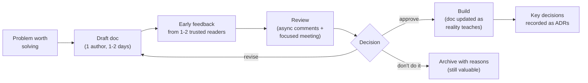

# Writing Design Documents

*A design document is thinking made visible — so that others can find the flaws while they're still cheap to fix.*

---

> *“If you're thinking without writing, you only think you're thinking.”*
>
> — **Leslie Lamport**, Turing Award winner (widely quoted from his talks)

## At a Glance

> **In one sentence:** A good design document states the problem, goals, and non-goals, proposes a design with enough detail to evaluate, compares real alternatives, and surfaces risks, open questions, and rollout plans — written clearly and concisely for reviewers who will use it to improve the decision.

**You'll learn**

- Why design docs exist and when to write one
- A practical structure that works for most technical proposals
- How to write clearly for busy reviewers
- How to run design reviews that improve designs
- Design docs vs. ADRs vs. RFCs
- Common anti-patterns: novels, afterthought docs, and missing alternatives

**Before you start:** [Making Technical Decisions](Making-Technical-Decisions.md) · [How To Design Any System](../06-System-Design/How-To-Design-Any-System.md)

**Reading time:** about 10 minutes

---

## The Big Picture



*The cheapest time to change a design is before any code exists. Documents make that moment count.*

---

## Introduction

Two engineers are asked to build a new notification system.

The first starts coding immediately. Three weeks in, a reviewer on the pull request asks why notifications aren't deduplicated, another asks about user preferences, and the security team asks where phone numbers are stored. The design changes twice. The feature ships late, and the architecture carries the scars of those mid-flight changes.

The second spends two days writing a six-page design document: problem, goals, non-goals, proposed design, two alternatives, data model, failure modes, security, and rollout. Four reviewers comment within a day. The security question, the deduplication gap, and a better alternative for preferences all appear — on paper, where fixing them takes minutes. The build goes smoothly.

The second engineer didn't work slower. They moved the expensive conversations to the cheapest possible moment.

### Why Should Engineers Care?

- Design docs catch design flaws before they become code, incidents, and rewrites.
- They let people across teams and time zones contribute without meetings.
- They preserve context for the future: why the system is the way it is.
- Writing clear design docs is one of the most visible signs of senior engineering.

---

## The Problem It Solves

| Without design docs | With design docs |
|--------------------|-----------------|
| Flaws found in code review or production | Flaws found on paper |
| Knowledge stuck in one person's head | Shared, searchable reasoning |
| Decisions made in meetings, then forgotten | Decisions recorded with context |
| Cross-team surprises | Dependencies surfaced early |
| New engineers can't learn why | History and rationale available |

---

## Historical Background

- **1969 onward — RFCs.** The Internet's "Request for Comments" series, started by Steve Crocker in 1969, showed how written proposals open to review could design systems collaboratively at scale.
- **1970s–1990s — Formal specifications** in large engineering organizations were often long and heavyweight.
- **2000s — Lightweight design docs** at companies like Google became a standard step before significant work, with doc templates and review culture.
- **2004 — Amazon's six-page narratives** replaced slide decks in many meetings, with attendees reading silently at the start — emphasizing clear written reasoning.
- **2010s — Open-source RFC processes** (Python PEPs since 2000, Rust RFCs since 2014, Kubernetes enhancement proposals) brought structured design proposals to large communities.
- **2011 onward — ADRs** captured individual decisions in short records alongside code.

---

## Core Concepts

### When to Write a Design Doc

Write one when a change:

- takes more than a couple of weeks of work,
- affects other teams, public APIs, or data models,
- involves significant risk, cost, security, or privacy considerations,
- has several reasonable approaches.

Skip it for small, reversible changes where a pull request description is enough.

### A Practical Structure

1. **Title, author, status, reviewers, date**
2. **Context / problem:** what's wrong or missing, with evidence
3. **Goals and non-goals:** what success looks like; what's explicitly out of scope
4. **Proposed design:** architecture, data model, APIs, key flows (diagrams help)
5. **Alternatives considered:** real options and why they weren't chosen
6. **Cross-cutting concerns:** security, privacy, reliability, observability, cost, accessibility
7. **Rollout and migration:** phases, flags, backward compatibility, rollback
8. **Risks and open questions**
9. **Appendix:** estimates, benchmarks, details

### Non-Goals Are Powerful

Non-goals prevent scope creep and endless debate: "This design does not support multi-region writes" tells reviewers what not to worry about — and what to challenge if they disagree.

### Writing for Reviewers

- **Lead with the conclusion:** summary and recommendation at the top.
- **Be concrete:** numbers instead of adjectives ("p99 < 200 ms at 5k requests/s," not "fast").
- **Show, don't just tell:** diagrams, example requests, sample data.
- **Keep it short:** most docs should be 3–10 pages. Move details to appendices.
- **Separate facts, assumptions, and opinions.**

### Docs, ADRs, and RFCs

| Artifact | Scope | Length |
|---------|------|-------|
| Design doc | A project or system change | Several pages |
| ADR | One decision | Half a page |
| RFC | A proposal for broad review, often cross-team or community | Varies |

A design doc often produces several ADRs.

### Design Reviews

- Share the doc a few days before any meeting; collect written comments first.
- Use meetings for the few real disagreements, not for reading.
- Reviewers focus on: correctness, missing requirements, risks, alternatives, operability, and security — not writing style.
- End with a clear outcome: approved, approved with changes, or needs rework.

---

## Real-World Analogy

### An Architect's Blueprints

Builders don't start pouring concrete based on a conversation. Architects produce blueprints that engineers, inspectors, and clients review. Mistakes found on the blueprint cost an eraser; the same mistake found after construction costs a demolition. A design doc is a software blueprint — but shorter, and focused on the decisions that matter.

---

## How It Works In Practice

### A Short Example Outline

```
# Design: User Notification Preferences
Status: In review · Author: Meera · Reviewers: Sam (platform), Lee (security), Ana (product)

## Summary
Let users choose channels (email, SMS, push) per notification type. Store preferences
in the notifications service; enforce them at send time. Launch behind a flag in Q4.

## Problem
Users receive notifications they can't control; unsubscribe complaints rose 40% this quarter.

## Goals                               ## Non-goals
- Per-type, per-channel preferences   - Quiet hours (future work)
- Enforced for all senders            - Marketing email (separate system)
- < 5 ms added latency at send time

## Design
[diagram] Preferences table keyed by (user_id, notification_type, channel) ...

## Alternatives
1. Preferences in each sending service — rejected: inconsistent enforcement.
2. Third-party preference center — rejected: no support for our in-app channel.

## Security & privacy
Phone numbers already stored in identity service; this design stores only preference flags.

## Rollout
Flag off → internal users → 10% → 100%; default = current behavior.

## Open questions
- Should transactional notifications (receipts) ignore opt-outs? (Legal to confirm)
```

### Giving Useful Review Comments

- Ask questions instead of prescribing: "What happens if the preferences service is down at send time?"
- Label severity: blocking concern vs. suggestion vs. nit.
- Suggest alternatives with reasons, not just objections.

---

## Production Engineering Perspective

- **Operability belongs in the doc:** monitoring, alerts, SLOs, runbooks, capacity, and on-call ownership.
- **Rollback plans** are part of the design, especially for data migrations.
- **Security and privacy reviews** are easier with a clear data-flow section.
- **Keep docs findable:** a consistent location and index, linked from code and tickets.
- **Update after launch:** note what changed from the plan; future readers need the real design.

---

## Tradeoffs

| Choice | Benefit | Cost |
|-------|--------|-----|
| Writing a doc | Early feedback, shared context | Time before coding |
| Short doc | Easy to read and review | May miss details |
| Long doc | Thorough | Fewer people read it carefully |
| Many reviewers | More perspectives | Slower; conflicting feedback |
| Formal approval gates | Consistency | Bureaucracy; slower small changes |

---

## Common Mistakes

### Beginner Mistakes

- Describing only the chosen design, with no alternatives.
- Adjectives instead of numbers ("scalable," "fast," "secure").
- No non-goals, so scope keeps growing.

### Intermediate Mistakes

- Writing the doc after the code is done, as a formality.
- Burying the recommendation on page eight.
- Ignoring rollout, migration, and operations.

### Senior-Level Mistakes

- Heavy processes that require docs for trivial changes.
- Reviews that focus on style and nits rather than risks.
- Docs that are never updated, misleading future engineers.

---

## Failure Scenarios

### Scenario 1: The Afterthought Doc

The system is built, then a doc is written for compliance. Reviewers find a fundamental security issue; fixing it means rework.

**Fix:** write and review docs before significant implementation.

### Scenario 2: The Novel

A 40-page doc covers everything. Reviewers skim, and the one critical flaw on page 23 goes unnoticed.

**Fix:** a short main doc with a summary up front; details in appendices.

### Scenario 3: The Missing Non-Goal

Reviewers keep asking for multi-region support; the author keeps adding it; the project doubles in scope.

**Fix:** explicit non-goals, with a place to record future work.

### Scenario 4: The Stale Doc

A new engineer follows the design doc, but the implementation changed during the build. They make wrong assumptions.

**Fix:** update the doc (or add a "what changed" section) after launch; link ADRs.

---

## Real-World Industry Examples

- **IETF RFCs** have shaped internet protocols through written proposals since 1969.
- **Python PEPs** (since 2000) and **Rust RFCs** (since 2014) are public examples of structured design proposals and review.
- **Google** is widely known for using design docs before significant engineering work.
- **Amazon's six-page narratives** emphasize clear written reasoning in decision meetings.

---

## Interview Questions

### Beginner

**Q1: What should a design document include?**

*Model answer:* The problem and context, goals and non-goals, the proposed design with key details, alternatives considered and why they were rejected, cross-cutting concerns like security and reliability, a rollout and rollback plan, and risks and open questions.

### Intermediate

**Q2: Why include alternatives in a design doc?**

*Model answer:* They show the problem was explored, help reviewers evaluate the recommendation against real options, surface trade-offs, and prevent the same debates from being reopened later.

**Q3: How do you make a design doc easy to review?**

*Model answer:* Put a summary and recommendation first, keep it concise, use concrete numbers and diagrams, state non-goals, separate assumptions from facts, and move detail to appendices.

### Senior

**Q4: How would you run a design review for a controversial proposal?**

*Model answer:* Share the doc early, collect written comments, identify the few real disagreements, and meet specifically on those with the decision owner present. Frame discussion around goals and trade-offs, ask what evidence would resolve disagreements, record the decision and dissent, and follow up on open questions.

### Architecture / Leadership

**Q5: How would you build a healthy design-doc culture?**

*Model answer:* Provide a simple template, clear criteria for when docs are needed, a findable home for them, and fast, respectful reviews focused on risks. Encourage early drafts, model good docs as a leader, avoid heavy approvals for small changes, and celebrate docs that prevented problems.

---

## Hands-On Lab

A small "design doc linter" that checks for missing sections and vague claims. Pure Python; save as `doc_lint_lab.py` and run it.

```python
import re

doc = """
# Design: New Search Service
## Summary
We will build a fast, scalable search service that is highly available.
## Goals
- Better search
- Must be secure
## Proposed Design
Use a new search engine cluster. It should be performant and robust.
## Rollout
Launch next quarter.
"""

REQUIRED = ["Summary", "Problem", "Goals", "Non-goals", "Proposed Design",
            "Alternatives", "Security", "Rollout", "Open Questions"]
VAGUE = ["fast", "scalable", "highly available", "secure", "performant", "robust", "better"]

headings = {h.strip().lower() for h in re.findall(r"^#+\s*(.+)$", doc, re.M)}
missing = [s for s in REQUIRED if s.lower() not in headings]
print("Missing sections:", ", ".join(missing) or "none")

print("\nVague claims (replace with numbers or specifics):")
for line in doc.splitlines():
    found = [w for w in VAGUE if re.search(rf"\b{w}\b", line, re.I)]
    has_number = bool(re.search(r"\d", line))
    if found and not has_number:
        print(f"  '{line.strip()}'  -> {', '.join(found)}")
```

**What to notice**
- The draft has no problem statement, non-goals, alternatives, security section, or open questions — the parts reviewers most need.
- "Fast," "scalable," and "highly available" say nothing a reviewer can check. Rewrite them: "p99 < 150 ms at 2,000 queries/s; 99.9% monthly availability."
- **Exercise:** rewrite the doc so the linter reports nothing, then show it to a colleague. Which questions do they still ask? Those are what linters can't catch.

---

## Test Yourself

*Answer each question in your head or on paper first, then open the answer to check.*

<details markdown="1">
<summary><strong>1. When is a design doc worth writing?</strong></summary>

For work lasting more than a couple of weeks, changes affecting other teams, APIs, or data models, high-risk changes, or problems with several reasonable approaches.

</details>

<details markdown="1">
<summary><strong>2. Why are non-goals useful?</strong></summary>

They define scope, prevent scope creep, and focus review on what the design is actually trying to do.

</details>

<details markdown="1">
<summary><strong>3. Where should the recommendation appear?</strong></summary>

At the top, in the summary, so busy reviewers understand the proposal immediately.

</details>

<details markdown="1">
<summary><strong>4. How is an ADR different from a design doc?</strong></summary>

An ADR records a single decision briefly; a design doc describes a whole project or change and may produce several ADRs.

</details>

<details markdown="1">
<summary><strong>5. What should design reviewers focus on?</strong></summary>

Correctness, missing requirements, risks, alternatives, operability, security, and rollout — not writing style.

</details>

<details markdown="1">
<summary><strong>6. Why share a doc before the review meeting?</strong></summary>

So people can read and comment asynchronously, and the meeting can focus on real disagreements instead of reading.

</details>

<details markdown="1">
<summary><strong>7. What's the oldest well-known tradition of written technical proposals mentioned here?</strong></summary>

The IETF Request for Comments (RFC) series, started in 1969.

</details>

---

## Cheat Sheet

**Structure:** summary · problem · goals / non-goals · design · alternatives · security, privacy, reliability, cost · rollout + rollback · risks + open questions · appendix.

**Writing rules:** conclusion first · numbers over adjectives · diagrams · 3–10 pages · facts vs. assumptions · explicit non-goals.

**Review rules:** async comments first · meet only on disagreements · label blocking vs. suggestion · end with a decision · record it (ADR).

**Write one when:** > 2 weeks of work · cross-team impact · APIs or data models · significant risk · multiple viable approaches.

---

## In the AI Era

- **AI is a strong first reviewer.** Ask it to find missing requirements, unstated assumptions, failure modes, and security gaps in your draft — before human reviewers spend their time.
- **AI can draft structure, not judgment.** It can turn notes into a clear outline, but the goals, trade-offs, and recommendation must reflect your real constraints.
- **Design docs are context for AI coding assistants.** A clear doc in the repository helps agents implement the design as intended.
- **Watch for fluent emptiness:** AI-drafted text can sound thorough while saying little. Apply the same "numbers over adjectives" rule.

**Try it:** Paste a design doc you wrote into an AI assistant and ask: "List the three most likely ways this design fails in production and the question a skeptical reviewer would ask first."

---

## Key Takeaways

1. Design docs move expensive conversations to the cheapest moment — before code.
2. Include problem, goals, non-goals, design, alternatives, cross-cutting concerns, rollout, and open questions.
3. Write for busy reviewers: conclusion first, concrete numbers, concise, with diagrams.
4. Run reviews asynchronously first; meet on disagreements; end with a decision.
5. Record key decisions as ADRs and keep docs updated after launch.

---

## What to Read Next

- **[Code Review: Giving and Receiving Feedback](Code-Review-Giving-And-Receiving-Feedback.md)** — reviewing code with the same care
- **[How To Design Any System](../06-System-Design/How-To-Design-Any-System.md)** — the content of a good design
- **[Making Technical Decisions](Making-Technical-Decisions.md)** — deciding once the doc is reviewed

---

## Further Reading

- **Malte Ubl — "Design Docs at Google" (2020):** [https://www.industrialempathy.com/posts/design-docs-at-google/](https://www.industrialempathy.com/posts/design-docs-at-google/)
- **IETF — RFC 3 and the history of RFCs:** [https://www.rfc-editor.org](https://www.rfc-editor.org)
- **Rust RFC process:** [https://github.com/rust-lang/rfcs](https://github.com/rust-lang/rfcs)
- **Python Enhancement Proposals (PEP 1):** [https://peps.python.org/pep-0001/](https://peps.python.org/pep-0001/)
- **Gergely Orosz — "Software Engineering RFC and Design Doc Examples"** (The Pragmatic Engineer)
- **William Zinsser — "On Writing Well"** — clear writing for any audience

---

*This chapter is part of the Modern Software Engineering Handbook — a comprehensive guide to the concepts, principles, and practices that every professional software engineer should know.*
