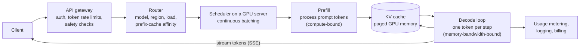

# How A Large-Scale LLM Service Serves A Request

*Behind every chat reply: authentication, rate limits, routing to a GPU cluster, prompt processing, token-by-token generation, and serving tricks that turn expensive hardware into affordable answers.*

---

> *“The biggest lesson that can be read from 70 years of AI research is that general methods that leverage computation are ultimately the most effective, and by a large margin.”*
>
> — **Rich Sutton**, "The Bitter Lesson," 2019

## At a Glance

> **In one sentence:** A large LLM service authenticates and rate-limits each request by tokens, routes it to a GPU cluster that has the right model (and ideally its cached prompt prefix), processes the prompt in a compute-heavy prefill step, then streams tokens one at a time in a memory-bandwidth-bound decode loop — using continuous batching, paged KV-cache memory, prefix caching, model parallelism, and speculative decoding to serve many users per GPU.

**You'll learn**

- The request path from API gateway to GPU and back
- Prefill vs. decode, and why they behave so differently
- Batching: why continuous batching changed LLM serving
- KV-cache memory management (PagedAttention) and prefix caching
- Model parallelism across GPUs
- Speculative decoding, quantization, and other efficiency techniques
- Capacity, rate limits, and reliability for a GPU-bound service

**Before you start:** [How LLMs Actually Work](../15-AI-Era-Engineering/How-LLMs-Actually-Work.md) · [How Memory Works](../02-How-Computers-Work/How-Memory-Works.md) · [Designing An AI Gateway](../06-System-Design/Designing-An-AI-Gateway.md)

**Reading time:** about 10 minutes

*Note: providers don't publish complete internal architectures. This chapter describes a representative design built from public research papers and open-source serving systems such as vLLM.*

---

## The Big Picture



*The same GPU serves many users at once: the scheduler interleaves their tokens step by step.*

---

## Introduction

A user types a question and a reply begins streaming within a second or two. To the user it's one request. To the service, it's a journey through ordinary web infrastructure — gateways, authentication, rate limits, routing — ending in some of the most specialized and expensive computing hardware in the world: GPU clusters holding a model whose weights may occupy hundreds of gigabytes.

The central engineering problem is **economics**. GPUs are scarce and costly. Generating each token requires reading the model's weights from GPU memory. Serving one user at a time would leave most of the GPU's compute idle and make each answer extremely expensive. Modern LLM serving is largely the story of techniques that let one GPU serve many users simultaneously without making any of them wait too long.

### Why Study It?

- LLM features increasingly depend on such services — understanding them explains latency, cost, and rate limits.
- It's a vivid example of the memory hierarchy, batching, caching, and scheduling ideas from this handbook applied to new hardware.
- Teams self-hosting open-weight models face exactly these design choices.

---

## Scale and Constraints

| Constraint | Implication |
|-----------|-------------|
| Model weights of tens to hundreds of GB | Large-memory GPUs; models split across several GPUs |
| Decode reads all weights per token | Memory bandwidth limits speed; batching amortizes it |
| KV cache grows with context length × users | GPU memory is the capacity bottleneck |
| Highly variable request sizes | Token-based rate limits and load-aware routing |
| Scarce, expensive GPUs | Utilization is everything; admission control and queues |
| Streaming responses lasting seconds to minutes | Long-lived connections through every proxy |

---

## Historical Background

- **2017 — Transformers** introduced; inference is naturally autoregressive (one token at a time).
- **2019 — Megatron-LM** popularized tensor model parallelism to split large models across GPUs.
- **2020–2022 — Hosted LLM APIs** made serving efficiency a core business concern.
- **2022 — FlashAttention** reorganized attention computation around the GPU memory hierarchy, and **Orca** (OSDI 2022) introduced iteration-level scheduling — the basis of **continuous batching**.
- **2023 — PagedAttention and vLLM** (SOSP 2023) managed KV-cache memory in fixed-size pages, like OS virtual memory, sharply increasing how many requests fit on a GPU. **Speculative decoding** papers showed how a small draft model can speed up generation.
- **2024 — Prefix caching and disaggregated serving** (separating prefill and decode onto different machines) became common topics in research and open-source systems; providers exposed **prompt caching** to customers.

---

## Architecture Overview

### 1. Front Door: Gateway

Authentication (API keys), per-organization **token-based rate limits**, request validation, safety checks, and usage metering happen before any GPU is involved. Requests that exceed limits get HTTP 429 with retry guidance.

### 2. Routing

A router picks a cluster and a server based on the requested model, region, current load (queued tokens, not just requests), and **prefix-cache affinity** — sending requests that share a long prompt prefix to the same server so its cached computation can be reused.

### 3. Scheduling and Batching

Each GPU server runs a scheduler that combines many users' requests into batches. With **continuous batching**, the batch is updated at every decoding step: finished requests leave, new ones join immediately, instead of waiting for the whole batch to finish.

### 4. Prefill

The entire prompt is processed in parallel, producing the first output token and filling the **KV cache** (stored attention keys and values for every prompt token). Prefill is compute-bound and determines **time to first token**.

### 5. Decode

Tokens are generated one per step. Each step reads the model weights and the request's KV cache; batching many requests into each step makes that expensive weight read serve many users at once. Decode is memory-bandwidth-bound and determines **tokens per second**.

### 6. Streaming and Accounting

Tokens stream back via server-sent events. When the request ends (stop token, length limit, or client disconnect), input and output tokens are metered for billing and rate limiting, and the KV-cache memory is freed.

---

## Deep Dives

### Deep Dive 1: Continuous Batching

With **static batching**, a batch of requests starts together and the GPU waits until the longest one finishes — short requests sit idle, and new requests queue. With **continuous (iteration-level) batching**, each decode step includes whichever requests are active; as one finishes, a waiting request takes its slot at the next step. This dramatically raises throughput and reduces queueing delay.

### Deep Dive 2: KV-Cache Memory (PagedAttention) and Prefix Caching

The KV cache often limits how many requests fit on a GPU. Allocating one large contiguous block per request wastes memory. PagedAttention splits the cache into fixed-size blocks mapped through a table — the same idea as virtual memory paging — so memory is allocated as needed and shared where possible. **Prefix caching** keeps the KV blocks for common prompt prefixes (system prompts, shared documents) so later requests skip recomputing them — the mechanism behind prompt caching discounts.

### Deep Dive 3: Model Parallelism and Disaggregation

- **Tensor parallelism** splits each layer across GPUs in a server (fast interconnect required).
- **Pipeline parallelism** splits layers across stages.
- **Disaggregated serving** runs prefill and decode on separate GPU pools, because they stress hardware differently and interfere when mixed.

### Deep Dive 4: Speed Tricks

- **Speculative decoding:** a small draft model proposes several tokens; the large model verifies them in one step, accepting the correct ones — fewer expensive steps per output.
- **Quantization:** lower-precision weights (8-bit, 4-bit) reduce memory and bandwidth needs, trading some accuracy.
- **Optimized kernels** (such as FlashAttention) reduce memory traffic.

---

## What Can Go Wrong

- **GPU memory exhaustion** under long contexts → admission control, preemption, and queueing.
- **Traffic spikes** exceeding capacity → token-based rate limits, priority tiers, and 429s rather than timeouts.
- **Noisy neighbors** — one huge request slowing others → per-request limits and scheduling policies.
- **Hardware failures** in large GPU clusters → health checks, draining, and redundancy across servers and regions.
- **Quality regressions from serving changes** (quantization, new kernels) → evaluation before rollout.

---

## Lessons for Engineers

1. **Utilization is economics:** batching turns an expensive per-user cost into a shared one.
2. **Memory is often the bottleneck,** not compute — manage it like an operating system manages RAM.
3. **Reuse work:** prefix caching is caching, applied to computation.
4. **Measure in tokens:** limits, routing, and billing all follow the real cost unit.
5. **Separate phases with different profiles** (prefill vs. decode) when they interfere.

---

## Tradeoffs

| Choice | Benefit | Cost |
|-------|--------|-----|
| Larger batches | Higher throughput, lower cost per token | Higher per-request latency |
| Longer context windows | More capability | More KV memory per request; fewer concurrent users |
| Quantization | Cheaper, faster serving | Possible quality loss |
| Prefix-affinity routing | Cache reuse | Less even load distribution |
| Speculative decoding | Faster generation | Extra draft model; benefit depends on acceptance rate |
| Disaggregated prefill/decode | Less interference | More complex orchestration and data transfer |

---

## Interview Questions

### Beginner

**Q1: Why do LLM APIs rate-limit by tokens instead of requests?**

*Model answer:* Cost and GPU load depend on how many tokens are processed and generated, which varies enormously between requests. Token limits reflect real resource use; request limits don't.

### Intermediate

**Q2: What is continuous batching, and why does it help?**

*Model answer:* The scheduler updates the batch at every decoding step, removing finished requests and adding waiting ones immediately. Unlike static batching, GPUs don't sit idle waiting for the longest request, so throughput rises and queueing delay falls.

### Senior

**Q3: Why is the KV cache so important for serving capacity?**

*Model answer:* Every active request keeps attention keys and values for all its tokens in GPU memory, growing with context length. Memory, not compute, often limits how many requests run concurrently. Paged allocation reduces waste, prefix caching shares common prefixes, and admission control prevents exhaustion.

### Architecture

**Q4: Design a self-hosted LLM serving platform for internal use.**

*Model answer:* A gateway with authentication, token budgets per team, and logging; a router aware of models, load, and prefix affinity; GPU servers running a serving engine with continuous batching and paged KV cache (such as vLLM); autoscaling based on queue depth and KV utilization, with warm capacity because model loading is slow; streaming through proxies with long timeouts; evaluation gates for model or quantization changes; and metrics for time to first token, tokens per second, utilization, and cost per million tokens.

---

## Hands-On Lab

Compare static batching with continuous batching on a simulated GPU. Pure Python; save as `batching_lab.py` and run it.

```python
import random
random.seed(1)

SLOTS = 8                      # requests the GPU can decode together
requests = [{"id": i, "arrive": i * 0.5, "tokens": random.choice([20, 40, 80, 400])}
            for i in range(200)]
STEP = 0.02                    # seconds per decode step (one token for every active request)

def static_batching():
    t, queue, done = 0.0, list(requests), []
    while queue:
        batch = [r for r in queue if r["arrive"] <= t][:SLOTS]
        if not batch:
            t = queue[0]["arrive"]; continue
        for r in batch: queue.remove(r)
        longest = max(r["tokens"] for r in batch)
        t += longest * STEP                                  # everyone waits for the longest
        done += [(r, t) for r in batch]
    return done, t

def continuous_batching():
    t, queue, active, done = 0.0, list(requests), [], []
    while queue or active:
        while queue and len(active) < SLOTS and queue[0]["arrive"] <= t:
            r = queue.pop(0); active.append([r, r["tokens"]])  # join at the next step
        if not active:
            t = queue[0]["arrive"]; continue
        t += STEP
        for a in active: a[1] -= 1
        for a in [a for a in active if a[1] == 0]:
            done.append((a[0], t)); active.remove(a)          # leave immediately when finished
    return done, t

for name, fn in [("static batching", static_batching), ("continuous batching", continuous_batching)]:
    done, end = fn()
    latency = sorted(finish - r["arrive"] for r, finish in done)
    short = sorted(finish - r["arrive"] for r, finish in done if r["tokens"] <= 40)
    total_tokens = sum(r["tokens"] for r in requests)
    print(f"{name:20} throughput {total_tokens / end:6.0f} tok/s   "
          f"median latency {latency[len(latency)//2]:6.1f}s   short requests median {short[len(short)//2]:5.1f}s")
```

**What to notice**
- With static batching, short requests wait for the longest request in their batch, and new arrivals wait for the whole batch to finish.
- Continuous batching keeps slots full: throughput rises and short requests finish quickly, because they leave as soon as they're done.
- This scheduling change — not new hardware — is one of the biggest reasons modern LLM serving became affordable. Try changing `SLOTS` to see how batch capacity (in real systems, limited by KV-cache memory) affects both designs.

---

## Test Yourself

*Answer each question in your head or on paper first, then open the answer to check.*

<details markdown="1">
<summary><strong>1. Which phase determines time to first token?</strong></summary>

Prefill — processing the whole prompt before the first token is generated.

</details>

<details markdown="1">
<summary><strong>2. Why is decode memory-bandwidth-bound?</strong></summary>

Each generated token requires reading the model weights (and the KV cache) from GPU memory, while the arithmetic per byte is small unless many requests are batched together.

</details>

<details markdown="1">
<summary><strong>3. What idea from operating systems does PagedAttention borrow?</strong></summary>

Virtual memory paging: allocating KV-cache memory in fixed-size blocks mapped through a table instead of large contiguous regions.

</details>

<details markdown="1">
<summary><strong>4. What is prefix caching?</strong></summary>

Reusing the computed KV cache for a prompt prefix shared by many requests (like a system prompt), so it isn't recomputed each time.

</details>

<details markdown="1">
<summary><strong>5. How does speculative decoding speed up generation?</strong></summary>

A small draft model proposes several tokens, and the large model verifies them in a single step, accepting those that match — reducing the number of expensive large-model steps.

</details>

<details markdown="1">
<summary><strong>6. Why route requests with the same prefix to the same server?</strong></summary>

So that server's prefix cache can be reused, cutting prefill work, latency, and cost.

</details>

---

## Cheat Sheet

**Request path:** gateway (auth, token limits, safety) → router (model, load, prefix affinity) → scheduler (continuous batching) → prefill (TTFT) → decode loop (tokens/s) → stream → meter and free KV cache.

| Technique | Solves |
|----------|-------|
| Continuous batching | Idle GPU slots, queueing delay |
| PagedAttention | KV-cache memory waste |
| Prefix caching | Recomputing shared prompts |
| Tensor/pipeline parallelism | Models too big for one GPU |
| Disaggregated prefill/decode | Interference between phases |
| Speculative decoding | Too many sequential decode steps |
| Quantization | Memory and bandwidth cost |
| Token-based rate limits | Fairness and capacity protection |

---

## In the AI Era

This entire case study is AI-era infrastructure — and it's built from classic ideas: virtual memory (paging), caching (prefix caches), scheduling (continuous batching), load balancing (prefix-aware routing), rate limiting (token buckets), and capacity planning (GPU memory and queues). Engineers who understand [the memory hierarchy](../02-How-Computers-Work/The-Memory-Hierarchy-Explained.md) and [caching](../05-Distributed-Systems/How-Caching-Works.md) already understand most of what makes LLM serving fast.

**Try it:** In the lab, make 30% of requests share a "cached prefix" that removes their prefill cost (model it as starting with fewer tokens). How much does throughput improve?

---

## Key Takeaways

1. LLM serving combines standard web infrastructure with GPU-specific scheduling.
2. Prefill is compute-bound (time to first token); decode is memory-bandwidth-bound (tokens per second).
3. Continuous batching keeps GPUs busy and short requests fast.
4. KV-cache memory is a key capacity limit; paging and prefix caching make it go further.
5. Parallelism, disaggregation, speculative decoding, and quantization trade complexity or accuracy for speed and cost.
6. Tokens are the unit of limits, routing, capacity, and billing.

---

## What to Read Next

- **[How An AI Coding Agent Works, End To End](How-An-AI-Coding-Agent-Works.md)** — what happens on top of the model service
- **[Operating LLM Features](../11-Production-Engineering/Operating-LLM-Features.md)** — cost, latency, and quality from the application side
- **[The Memory Hierarchy Explained](../02-How-Computers-Work/The-Memory-Hierarchy-Explained.md)** — why memory dominates

---

## Further Reading

- **Yu et al. — "Orca: A Distributed Serving System for Transformer-Based Generative Models" (OSDI 2022)**
- **Kwon et al. — "Efficient Memory Management for Large Language Model Serving with PagedAttention" (SOSP 2023):** [https://arxiv.org/abs/2309.06180](https://arxiv.org/abs/2309.06180)
- **Dao et al. — "FlashAttention" (2022):** [https://arxiv.org/abs/2205.14135](https://arxiv.org/abs/2205.14135)
- **Leviathan et al. — "Fast Inference from Transformers via Speculative Decoding" (ICML 2023)**
- **Zhong et al. — "DistServe: Disaggregating Prefill and Decoding for Goodput-optimized LLM Serving" (OSDI 2024)**
- **vLLM project:** [https://github.com/vllm-project/vllm](https://github.com/vllm-project/vllm)
- **Rich Sutton — "The Bitter Lesson" (2019):** [http://www.incompleteideas.net/IncIdeas/BitterLesson.html](http://www.incompleteideas.net/IncIdeas/BitterLesson.html)

---

*This chapter is part of the Modern Software Engineering Handbook — a comprehensive guide to the concepts, principles, and practices that every professional software engineer should know.*
