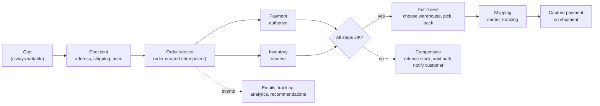

# How Amazon Processes An Order

*From "Add to Cart" to a package at your door — a long-running, distributed workflow that must never lose an order or charge you twice.*

---

> *“Reliability at massive scale is one of the biggest challenges we face at Amazon.com, one of the largest e-commerce operations in the world.”*
>
> — **DeCandia et al.**, "Dynamo: Amazon's Highly Available Key-value Store," 2007

## At a Glance

> **In one sentence:** An e-commerce order at Amazon's scale is a long-running workflow across many independent services — an always-available cart, checkout, payment authorization, inventory, fulfillment, shipping, and notifications — coordinated with idempotent steps, asynchronous events, compensating actions when something fails, and availability favored over strict consistency wherever the customer experience allows.

**You'll learn**

- How service ownership and "two-pizza teams" shaped Amazon's architecture
- The shopping cart and why it was designed to be "always writable" (Dynamo)
- Checkout as a workflow: payment authorization, inventory, fulfillment, shipping
- Sagas and compensating actions instead of distributed transactions
- Handling peak events like Prime Day
- Lessons for any multi-step business process

**Before you start:** [Designing A Payment System](../06-System-Design/Designing-A-Payment-System.md) · [Event-Driven Architecture](../07-Software-Architecture/Event-Driven-Architecture.md) · [CAP Theorem Explained](../05-Distributed-Systems/CAP-Theorem-Explained.md)

**Reading time:** about 10 minutes

*Note: Amazon hasn't published its complete order architecture. This chapter describes a representative design grounded in Amazon's public papers, talks, and engineering writing.*

---

## The Big Picture



*No single database transaction spans all of this. Each step is its own service; failures are handled with compensation, not rollback.*

---

## Introduction

When you click "Place your order," you see a confirmation within seconds. But the order has only just begun its journey. Payment is authorized but not yet charged. Stock is reserved in a fulfillment center that may not be the closest one. Over the next hours or days, the order is picked, packed, handed to a carrier, tracked, and delivered — and at any step, something might fail: a card declines, an item turns out to be damaged, a warehouse is overloaded, or a delivery is lost.

Doing this for a huge number of orders per day, across many services owned by different teams, is a masterclass in distributed workflows. Amazon's public writing — especially the 2007 Dynamo paper — explains key principles: **availability for customers first**, **services owned by small teams**, and **designing for failure everywhere**.

### Why Study It?

- Almost every business has multi-step processes like orders, bookings, or onboarding.
- It shows how to replace distributed transactions with sagas and events.
- It illustrates deliberate CAP trade-offs driven by customer experience.

---

## Scale and Constraints

| Constraint | Implication |
|-----------|-------------|
| Enormous peak traffic (Prime Day, holidays) | Capacity planning and graceful degradation |
| Many independently owned services | Clear APIs, events, and ownership |
| Money involved | Idempotency, auditability, reconciliation |
| Physical world | Warehouses, carriers, and delays measured in hours or days |
| Customer trust | Never lose an order; never double-charge |

---

## Historical Background

- **Early 2000s — Service-oriented Amazon.** Amazon moved from a monolithic application toward services owned by small teams communicating only through APIs — a widely retold internal mandate often cited as an origin of modern service architecture.
- **"Two-pizza teams"** — teams small enough to be fed by two pizzas — became a well-known Amazon principle for ownership and speed.
- **2006 — "You build it, you run it."** Werner Vogels described teams operating the services they build.
- **2007 — The Dynamo paper** described an always-writable key-value store designed for use cases like the shopping cart, trading consistency for availability.
- **2015 onward — Prime Day** became an annual peak event requiring extensive preparation, load testing, and scaling.

---

## Architecture Overview

### The Cart: Always Writable

The Dynamo paper explained a key product decision: customers must always be able to add items to their cart, even during failures. Dynamo therefore accepted writes during network partitions and resolved conflicting versions later — for the cart, by merging them (so an added item is never lost, though a deleted item could occasionally reappear). This is the AP side of the CAP trade-off, chosen because a lost "add to cart" costs more than an occasional reappearing item.

### Checkout and Order Creation

Checkout gathers address, shipping speed, and payment method, computes the final price (taxes, promotions), and creates an order with an **idempotency key** so a double click or retry doesn't create two orders. The customer sees a confirmation as soon as the order is durably recorded.

### The Order Workflow

After creation, a workflow (orchestrated or event-driven) drives the order:

1. **Authorize payment** — hold funds, don't capture yet.
2. **Reserve inventory** in suitable fulfillment centers.
3. **Assign fulfillment** — choose warehouses based on stock, distance, capacity, and delivery promise.
4. **Pick, pack, ship** — physical operations emit events back into the system.
5. **Capture payment** — typically when items ship.
6. **Track and deliver**, with notifications at each stage.

Many services react to order events asynchronously: email, recommendations, analytics, fraud models.

### Failure and Compensation

There's no global transaction across payment, inventory, and fulfillment. If a step fails, earlier steps are undone with **compensating actions**:

| Failure | Compensation |
|--------|-------------|
| Payment declined | Release inventory reservation; notify customer to update payment |
| Item unavailable after all | Void or refund that item's portion; offer alternatives |
| Warehouse can't ship in time | Reassign to another warehouse; update delivery promise |
| Order canceled before shipping | Release stock; void authorization |

---

## Deep Dives

### Deep Dive 1: Sagas Instead of Distributed Transactions

A saga is a sequence of local transactions, each with a compensating action. Orchestrated sagas use a workflow engine (AWS Step Functions is a public example of this style of service) to track progress, retry failed steps, and trigger compensations. Every step must be **idempotent**, because retries happen.

### Deep Dive 2: Availability Over Consistency (Where It's Safe)

- **Cart:** always writable; merge conflicts.
- **Product page stock indicators:** can be slightly stale ("Only 3 left" may be approximate).
- **Final inventory reservation and payment:** stronger consistency, because overselling or double-charging has real costs.

The design chooses consistency levels **per operation**, based on the cost of an anomaly (see [Consistency vs Availability](../05-Distributed-Systems/Consistency-vs-Availability.md)).

### Deep Dive 3: Surviving Peak Events

- Forecast demand and load test well above expected peaks.
- Pre-scale capacity; protect critical paths (checkout) over non-critical ones (recommendations).
- Use queues to absorb bursts in downstream processing.
- Degrade gracefully: show simpler pages, delay non-essential emails, keep "Place order" working.

---

## What Can Go Wrong

- **Double orders from retries** → idempotency keys at checkout.
- **Overselling** → reservations with timeouts; stronger consistency at final allocation.
- **Stuck orders** → workflow monitoring, timeouts, and automatic retries or escalation.
- **Payment and order state disagreeing** → reconciliation jobs comparing records with payment providers.
- **Peak overload** → load shedding for non-critical features, capacity buffers, queue-based smoothing.

---

## Lessons for Engineers

1. **Decide consistency per operation**, based on the business cost of anomalies.
2. **Model long processes as workflows** with explicit states, retries, and compensations.
3. **Make every step idempotent.**
4. **Give each capability an owning team** with a clear API.
5. **Protect the money path** (checkout) above everything else during peaks.

---

## Tradeoffs

| Choice | Benefit | Cost |
|-------|--------|-----|
| Always-writable cart | Never lose an "add to cart" | Occasional merge anomalies |
| Authorize now, capture on shipment | Fair to customers; handles partial shipments | Authorization expiry handling |
| Sagas | No distributed transactions | Compensation logic; eventual consistency |
| Orchestration | Visible, controllable workflows | Central workflow component |
| Many small services | Team autonomy | Operational and integration complexity |

---

## Interview Questions

### Beginner

**Q1: Why authorize a card at checkout but capture it later?**

*Model answer:* Authorization confirms and holds funds without charging. Capturing at shipment means customers are charged only for what's actually sent, handles partial shipments and cancellations cleanly, and follows common card network rules.

### Intermediate

**Q2: Why did Amazon design the shopping cart to be always writable?**

*Model answer:* Losing a customer's "add to cart" directly loses sales and trust. The Dynamo design favored availability during failures, accepting occasional conflicting versions that are merged later, because that anomaly (a removed item reappearing) is far less harmful than a lost addition.

### Senior

**Q3: How do you handle a failure halfway through an order workflow?**

*Model answer:* Model the workflow as a saga: each completed step has a compensating action. On failure, retry idempotent steps where appropriate; if the order can't proceed, run compensations in reverse — release inventory, void payment authorization — update the order state, and notify the customer. Monitor for stuck workflows.

### Architecture

**Q4: Design an order system for a large e-commerce sale event.**

*Model answer:* Idempotent order creation; a workflow engine for payment, inventory, fulfillment, and shipping with compensations; event publishing via an outbox; per-operation consistency choices; queues to smooth downstream processing; load tests at multiples of forecast; capacity buffers; graceful degradation of non-critical features; and reconciliation between orders, payments, and inventory.

---

## Hands-On Lab

An orchestrated saga with compensating actions. Pure Python; save as `order_saga_lab.py` and run it.

```python
class StepFailed(Exception):
    pass

class Services:
    def __init__(self, card_ok=True, stock=5, warehouse_ok=True):
        self.card_ok, self.stock, self.warehouse_ok = card_ok, stock, warehouse_ok
        self.log = []

    def reserve_inventory(self, order):
        if self.stock < order["qty"]: raise StepFailed("out of stock")
        self.stock -= order["qty"]; self.log.append("inventory reserved")
    def release_inventory(self, order):
        self.stock += order["qty"]; self.log.append("inventory released")

    def authorize_payment(self, order):
        if not self.card_ok: raise StepFailed("card declined")
        self.log.append("payment authorized")
    def void_payment(self, order):
        self.log.append("authorization voided")

    def assign_fulfillment(self, order):
        if not self.warehouse_ok: raise StepFailed("no warehouse can ship in time")
        self.log.append("fulfillment assigned")
    def unassign_fulfillment(self, order):
        self.log.append("fulfillment unassigned")

def run_saga(svc, order):
    steps = [(svc.reserve_inventory, svc.release_inventory),
             (svc.authorize_payment, svc.void_payment),
             (svc.assign_fulfillment, svc.unassign_fulfillment)]
    done = []
    for action, compensate in steps:
        try:
            action(order)
            done.append(compensate)
        except StepFailed as e:
            svc.log.append(f"FAILED: {e}")
            for comp in reversed(done):          # undo completed steps in reverse order
                comp(order)
            return "cancelled", svc.log
    return "confirmed", svc.log

for name, svc in [("happy path", Services()),
                  ("card declined", Services(card_ok=False)),
                  ("warehouse problem", Services(warehouse_ok=False))]:
    status, log = run_saga(svc, {"id": "o-881", "qty": 2})
    print(f"{name:18} -> {status:9} stock left: {svc.stock}\n    " + " -> ".join(log))
```

**What to notice**
- On failure, completed steps are undone in reverse order, and stock returns to where it started — the system stays consistent without a distributed transaction.
- Compensation isn't always a perfect undo in real life (an email already sent can't be unsent), so side effects visible to customers usually happen late in the workflow.
- Real systems persist saga state durably, retry transient failures before compensating, and make every step idempotent.

---

## Test Yourself

*Answer each question in your head or on paper first, then open the answer to check.*

<details markdown="1">
<summary><strong>1. What CAP trade-off did Dynamo make for the shopping cart?</strong></summary>

Availability over consistency: it accepted writes during failures and merged conflicting versions later.

</details>

<details markdown="1">
<summary><strong>2. What is a compensating action?</strong></summary>

An action that semantically undoes a completed step (for example, releasing reserved inventory) when a later step in a saga fails.

</details>

<details markdown="1">
<summary><strong>3. Why must order creation be idempotent?</strong></summary>

Double clicks, retries, and network timeouts could otherwise create duplicate orders and charges.

</details>

<details markdown="1">
<summary><strong>4. What's a "two-pizza team"?</strong></summary>

Amazon's term for a team small enough to be fed with two pizzas — emphasizing small, autonomous teams owning services.

</details>

<details markdown="1">
<summary><strong>5. Which parts of an order need stronger consistency?</strong></summary>

Final inventory allocation and payment, where anomalies (overselling, double-charging) have real costs.

</details>

<details markdown="1">
<summary><strong>6. Why do customer-visible side effects often come late in a workflow?</strong></summary>

Because they can't be perfectly undone; delaying them reduces the need for awkward compensations.

</details>

---

## Cheat Sheet

**Order flow:** cart (always writable) → checkout (idempotent order) → authorize payment → reserve inventory → assign fulfillment → pick/pack/ship → capture payment → deliver → events to other services.

| Principle | Example |
|----------|--------|
| Consistency per operation | Cart AP; payment and final stock allocation strong |
| Sagas + compensation | Payment declined → release stock |
| Idempotency everywhere | Order creation, payment, events |
| Service ownership | Two-pizza teams, "you build it, you run it" |
| Peak readiness | Load tests, pre-scaling, protect checkout |

---

## In the AI Era

- **AI shopping agents** may place orders on behalf of customers. Idempotency, spending limits, and confirmations become even more important — an agent retrying after a timeout is exactly the double-order scenario.
- **Machine learning is everywhere in the order path:** recommendations, fraud scoring, demand forecasting, warehouse placement, and delivery estimates. Critical steps must still work (with safe defaults) when models are slow or unavailable.
- **Customer service agents powered by AI** need tools to look up and modify orders — with the customer's own permissions and human approval for refunds above limits.

**Try it:** Add a `fraud_check` step to the lab that's powered by a (fake) model and sometimes times out. Should a timeout fail the order, pass it, or hold it for review? Implement your choice.

---

## Key Takeaways

1. An order is a long-running workflow across independently owned services.
2. Amazon's cart favored availability (Dynamo), accepting mergeable conflicts.
3. Sagas with compensating actions replace distributed transactions.
4. Idempotency is required at every step because retries are inevitable.
5. Choose consistency per operation based on the business cost of errors.
6. Protect the money path during peaks and degrade non-critical features.

---

## What to Read Next

- **[How UPI Works](How-UPI-Works.md)** — real-time payments across banks
- **[Designing A Payment System](../06-System-Design/Designing-A-Payment-System.md)** — idempotency, ledgers, and reconciliation
- **[Event-Driven Architecture](../07-Software-Architecture/Event-Driven-Architecture.md)** — choreography vs. orchestration

---

## Further Reading

- **DeCandia et al. — "Dynamo: Amazon's Highly Available Key-value Store" (SOSP 2007):** [https://www.allthingsdistributed.com/files/amazon-dynamo-sosp2007.pdf](https://www.allthingsdistributed.com/files/amazon-dynamo-sosp2007.pdf)
- **Jim Gray — "A Conversation with Werner Vogels" (ACM Queue, 2006):** [https://queue.acm.org/detail.cfm?id=1142065](https://queue.acm.org/detail.cfm?id=1142065)
- **Hector Garcia-Molina & Kenneth Salem — "Sagas" (SIGMOD 1987)**
- **Amazon Builders' Library** — articles on reliability, idempotency, and operations: [https://aws.amazon.com/builders-library/](https://aws.amazon.com/builders-library/)
- **AWS Step Functions documentation** — an example of orchestrated workflows

---

*This chapter is part of the Modern Software Engineering Handbook — a comprehensive guide to the concepts, principles, and practices that every professional software engineer should know.*
