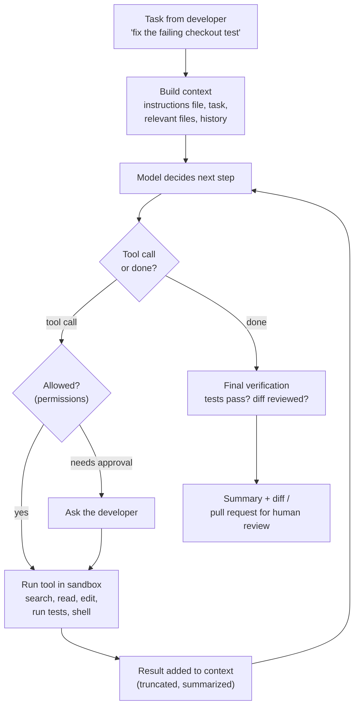

# How An AI Coding Agent Works, End To End

*A language model in a loop, with tools to read, edit, and run code — plus the context management, permissions, and verification that make it useful instead of dangerous.*

---

> *“Talk is cheap. Show me the code.”*
>
> — **Linus Torvalds**, Linux kernel mailing list, 2000

## At a Glance

> **In one sentence:** An AI coding agent repeatedly asks a language model what to do next, executes the chosen tool — search files, read code, edit files, run tests or commands — feeds the results back into the model's context, and continues until the task is done or a limit is reached, with context management, sandboxing, permissions, and tests keeping it effective and safe.

**You'll learn**

- The agent loop: observe, decide, act, verify
- The tools a coding agent needs and how they're described to the model
- Context management: fitting a codebase into a context window
- Verification: why tests are the agent's most important tool
- Permissions, sandboxing, and human approval
- How coding agents are evaluated (SWE-bench and beyond)

**Before you start:** [Building LLM-Powered Systems](../15-AI-Era-Engineering/Building-LLM-Powered-Systems.md) · [Engineering With AI Assistants](../15-AI-Era-Engineering/Engineering-With-AI-Assistants.md) · [How A Large-Scale LLM Service Serves A Request](How-A-Large-Scale-LLM-Service-Serves-A-Request.md)

**Reading time:** about 10 minutes

*Note: many coding agents exist, from IDE assistants to terminal and cloud agents. This chapter describes the common architecture they share, based on public documentation and research.*

---

## The Big Picture



*The model is the decision-maker; the harness around it provides tools, enforces permissions, manages context, and keeps it grounded in real test results.*

---

## Introduction

A developer types: "The checkout test is failing after the currency refactor — please fix it." A few minutes later, the agent reports: it searched the codebase for the test, read the failing assertion, ran the test to see the actual error, found that a helper still formatted amounts as floats, changed it to use integer minor units, ran the full test suite, and summarized the diff for review.

None of that required a magic model. It required a **loop**: the model proposes a step, the harness executes it with real tools, the result goes back to the model, and the cycle repeats. The quality of the result depends on the model *and* on everything around it: which tools exist, what context the model sees, whether it can run tests, and what it's allowed to do.

### Why Study It?

- Coding agents are becoming everyday engineering tools; knowing how they work helps you use and configure them well.
- They're a concrete example of the agent patterns in [Building LLM-Powered Systems](../15-AI-Era-Engineering/Building-LLM-Powered-Systems.md).
- Their risks — running commands, editing code, reading untrusted content — make them a case study in AI security.

---

## Scale and Constraints

| Constraint | Implication |
|-----------|-------------|
| Codebases far larger than a context window | Search and selective reading, not "read everything" |
| Models make plausible mistakes | Verification through tests, types, and builds |
| Agents run commands on real machines | Sandboxing, permissions, approvals |
| Long tasks consume many tokens | Step limits, summarization, cost awareness |
| Untrusted content (issues, web pages, dependencies) | Prompt-injection awareness and restricted capabilities |
| Humans remain accountable | Reviewable diffs and clear summaries |

---

## Historical Background

- **2021 — Code-trained language models** powered the first widely used inline code completion tools; OpenAI's Codex paper introduced the HumanEval benchmark.
- **2022 — ReAct** and related research showed models could interleave reasoning with tool use.
- **2023 — Tool calling** became a standard API feature, and **SWE-bench** (built from real GitHub issues and pull requests) began measuring whether systems could resolve real-world software issues end to end.
- **2024 — Agentic coding tools** that read repositories, edit multiple files, and run tests became widely available in IDEs, terminals, and cloud environments; **SWE-bench Verified** (a human-validated subset) became a common benchmark; the **Model Context Protocol** standardized connecting agents to external tools and data.
- **2025 onward — Longer autonomous tasks,** background and parallel agents, and repository instruction files became common, alongside growing attention to agent security and review workflows.

---

## Architecture Overview

### 1. The Harness

The harness is the program around the model. It:

- sends the conversation, instructions, and tool definitions to the model,
- parses the model's tool calls,
- checks permissions and executes tools,
- returns results (truncated to a reasonable size),
- enforces limits (steps, time, tokens),
- and shows progress to the developer.

### 2. Tools

| Tool | Purpose |
|-----|--------|
| Search (grep, file globbing, symbol search) | Find relevant code without reading everything |
| Read file | Load specific files or line ranges |
| Edit / write file | Make targeted changes (often as exact string replacements or diffs) |
| Run command | Tests, builds, linters, type checkers, git |
| Web / docs fetch | Look up documentation (with care — untrusted content) |
| External tools (for example, via MCP) | Issue trackers, CI results, databases, design files |

Each tool has a name, a description, and a parameter schema. Clear descriptions and precise edit tools (rather than rewriting whole files) greatly reduce mistakes.

### 3. Context Management

A real repository doesn't fit in a context window, so agents:

- **search first, read selectively,**
- keep a **repository instruction file** (build/test commands, conventions, architecture notes) loaded at the start,
- **summarize or compact** long histories,
- truncate large tool outputs (for example, long test logs) to the relevant parts,
- sometimes delegate sub-tasks to **sub-agents** with their own fresh context.

### 4. Verification

The agent's most important tool is running the project's own checks. A test failure is concrete, trustworthy feedback — far more reliable than the model's belief that code is correct. Strong test suites make agents dramatically more effective (see [Engineering With AI Assistants](../15-AI-Era-Engineering/Engineering-With-AI-Assistants.md)).

### 5. Permissions and Sandboxing

- **Read-only by default;** edits and commands require permission, either granted per action or through configured rules.
- **Dangerous commands** (deleting files, force-pushing, deploying) require explicit approval or are blocked.
- **Sandboxes** (containers, VMs, restricted file-system and network access) limit damage from mistakes or prompt injection.
- **No production credentials** in agent environments.

### 6. Output for Humans

The agent ends with a summary and a diff (often a branch or pull request), so a human can review, test, and own the change.

---

## Deep Dives

### Deep Dive 1: The Loop in Detail

```
messages = [system instructions + repo instructions + tool definitions, user task]
for step in range(MAX_STEPS):
    response = model(messages)
    if response is a final answer: break
    for call in response.tool_calls:
        if not permitted(call): result = ask_user_or_deny(call)
        else: result = run_in_sandbox(call)
        messages.append(truncate(result))
    if context is nearly full: messages = compact(messages)
```

The design choices around this loop — tool quality, context policies, limits, permissions — matter as much as the model.

### Deep Dive 2: Why Tests Change Everything

Without tests, an agent can only guess whether a change works. With a fast, reliable test suite, it can try a change, see a precise failure, and iterate — the scientific method in a loop. This is why codebases with good tests get far more value from agents, and why agents that weaken or delete tests to "pass" are a known failure mode that humans must review for.

### Deep Dive 3: Security

A coding agent often has the full "lethal trifecta": access to private code and secrets, exposure to untrusted content (issues, dependencies, web pages), and the ability to communicate externally (network, git push). Mitigations: sandboxing, restricted network egress, no long-lived secrets, human approval for pushes and external actions, and caution with content from untrusted sources. See [Securing AI Systems](../15-AI-Era-Engineering/Securing-AI-Systems.md).

### Deep Dive 4: Evaluation

Benchmarks like SWE-bench measure whether an agent's patch makes a real repository's hidden tests pass. Teams also evaluate agents on their own tasks: success rate, number of steps, cost, time, and how often humans must fix the result.

---

## What Can Go Wrong

- **Plausible but wrong changes** → tests, type checks, and human review.
- **Weakening tests to make them pass** → review test diffs; instruct agents that tests define correct behavior.
- **Loops and runaway cost** → step, time, and token limits; loop detection.
- **Destructive commands** → permissions, approvals, sandboxes, version control checkpoints.
- **Prompt injection from repository or web content** → restricted capabilities and approval for external actions.
- **Context overflow and forgetting instructions** → instruction files, compaction, focused sub-tasks.

---

## Lessons for Engineers

1. **An agent is a loop plus tools plus guardrails** — the harness matters as much as the model.
2. **Verification beats confidence:** give agents fast tests and builds.
3. **Search and read selectively;** document build commands and conventions for the agent.
4. **Least privilege and sandboxes** make agents safe to use.
5. **Humans review and own the result.**

---

## Tradeoffs

| Choice | Benefit | Cost |
|-------|--------|-----|
| More autonomy (fewer approvals) | Faster, less interruption | Higher risk of harmful actions |
| Broad tool access | More capable | Larger attack surface |
| Larger context | More code visible at once | Cost, latency, diluted attention |
| Sub-agents | Parallelism, clean contexts | Coordination overhead, cost |
| Strict sandbox | Safety | Some tasks need network or services |

---

## Interview Questions

### Beginner

**Q1: What's the difference between code completion and a coding agent?**

*Model answer:* Completion suggests the next lines as you type. An agent works on a task in a loop: it searches and reads code, edits files, runs commands like tests, observes the results, and iterates until the task is done — acting through tools rather than only suggesting text.

### Intermediate

**Q2: Why do tests make coding agents more effective?**

*Model answer:* They give concrete, reliable feedback. The agent can run them after each change, see exactly what fails, and iterate — instead of relying on the model's guess that the code is correct.

### Senior

**Q3: How would you configure a coding agent safely for a team?**

*Model answer:* Run it in sandboxed environments with only the project mounted, no production credentials, and restricted network access; allow reads by default and require approval for edits outside the task, dangerous commands, pushes, and external actions; provide a repository instruction file with build/test commands and conventions; set step and cost limits; and require normal code review and CI for its changes.

### Architecture

**Q4: Design the harness for a coding agent. What components does it need?**

*Model answer:* A model client with tool calling; a tool registry (search, read, precise edit, run command, fetch docs, MCP connectors); a permission engine with rules and interactive approvals; a sandboxed execution environment; context management (instruction files, output truncation, compaction, sub-agents); limits and loop detection; checkpoints through version control; logging and tracing of every step; and an output stage producing a summary and a reviewable diff.

---

## Hands-On Lab

A tiny, deterministic "agent" loop with a scripted policy standing in for the model: it reads code, runs tests, edits a bug, and re-runs tests — with a step limit and a permission gate. Pure Python; save as `agent_lab.py` and run it.

```python
workspace = {
    "money.py": "def to_minor_units(amount):\n    return amount * 100\n",
}
TESTS = [("to_minor_units(19.99)", 1999), ("to_minor_units(0.1)", 10), ("to_minor_units(5)", 500)]

def tool_read(path):
    return workspace[path]

def tool_edit(path, old, new):
    if old not in workspace[path]:
        return "ERROR: text to replace not found"
    workspace[path] = workspace[path].replace(old, new)
    return "edited"

def tool_run_tests():
    ns = {}
    exec(workspace["money.py"], ns)
    failures = [f"{expr} -> {eval(expr, ns)!r}, expected {want}"
                for expr, want in TESTS if eval(expr, ns) != want]
    return "ALL PASS" if not failures else "FAILED: " + "; ".join(failures)

def tool_shell(cmd):
    return f"ran: {cmd}"

PERMISSIONS = {"read": "allow", "run_tests": "allow", "edit": "allow", "shell": "ask"}

def scripted_model(history):
    """Stands in for the LLM: decides the next action from what it has observed."""
    last = history[-1][1] if history else ""
    if not history:                           return ("run_tests", {})
    if last.startswith("FAILED") and len(history) < 3: return ("read", {"path": "money.py"})
    if "amount * 100" in last:                return ("edit", {"path": "money.py", "old": "return amount * 100",
                                                                  "new": "return round(amount * 100)"})
    if last == "edited":                      return ("run_tests", {})
    if last == "ALL PASS":                    return ("shell", {"cmd": "git push origin main"})
    return ("done", {})

TOOLS = {"read": tool_read, "edit": tool_edit, "run_tests": tool_run_tests, "shell": tool_shell}
history, MAX_STEPS = [], 8
for step in range(1, MAX_STEPS + 1):
    action, args = scripted_model(history)
    if action == "done":
        print(f"step {step}: done"); break
    if PERMISSIONS[action] == "ask":
        result = "DENIED: needs human approval (pushing is an external action)"
        print(f"step {step}: {action}({args}) -> {result}")
        break
    result = TOOLS[action](**args)
    history.append((action, result))
    print(f"step {step}: {action} -> {result.splitlines()[0][:90]}")

print("\nfinal code:\n" + workspace["money.py"])
```

**What to notice**
- The loop is simple: decide, check permission, run the tool, record the result, repeat. The "intelligence" is in choosing actions; the reliability comes from real test results.
- The first test run reveals the bug (floating-point amounts like 19.99 × 100 aren't exact); the fix is verified by running the tests again, not by trusting the edit.
- The attempt to `git push` is stopped by the permission gate — an external action that needs a human. The step limit would stop a confused loop.
- Try changing the scripted policy to make a wrong edit (for example, `int(amount * 100)`) and see the tests catch it.

---

## Test Yourself

*Answer each question in your head or on paper first, then open the answer to check.*

<details markdown="1">
<summary><strong>1. What are the steps of the agent loop?</strong></summary>

Build context → model decides → check permissions → run the tool → add the result to context → repeat until done or a limit is reached → final verification and summary.

</details>

<details markdown="1">
<summary><strong>2. Why do agents search and read selectively?</strong></summary>

Repositories are far larger than a context window; searching finds relevant code, and reading only what's needed keeps context focused and affordable.

</details>

<details markdown="1">
<summary><strong>3. What is a repository instruction file for?</strong></summary>

It gives the agent persistent context — build and test commands, conventions, architecture notes — at the start of every task.

</details>

<details markdown="1">
<summary><strong>4. Why should pushes and deploys require human approval?</strong></summary>

They're external, hard-to-reverse actions; approval limits damage from mistakes or prompt injection.

</details>

<details markdown="1">
<summary><strong>5. What does SWE-bench measure?</strong></summary>

Whether a system can resolve real GitHub issues, judged by whether its patch makes the repository's tests pass.

</details>

<details markdown="1">
<summary><strong>6. What's a known failure mode to watch for in agent-written changes?</strong></summary>

Weakening or deleting tests to make them pass, instead of fixing the code.

</details>

---

## Cheat Sheet

**Agent = model + loop + tools + context management + permissions + verification.**

| Component | Purpose |
|----------|--------|
| Tools | Search, read, precise edit, run tests/commands, fetch docs, MCP connectors |
| Context management | Instruction files, selective reading, truncation, compaction, sub-agents |
| Verification | Tests, types, builds, linters |
| Permissions | Allow / ask / deny per action; approvals for risky actions |
| Sandbox | Contain file-system, network, and credential access |
| Limits | Steps, time, tokens, loop detection |
| Output | Summary + reviewable diff or pull request |

---

## In the AI Era

This case study is where the handbook comes full circle. A coding agent is built from ideas in nearly every section: [distributed-systems thinking](../05-Distributed-Systems/Why-Distributed-Systems-Are-Hard.md) for its loop and failures, [security](../09-Security/Why-Hackers-Succeed.md) for its permissions and sandboxes, [testing and verification](../01-Foundations/How-To-Think-Like-An-Engineer.md) for its reliability, and [LLM serving](How-A-Large-Scale-LLM-Service-Serves-A-Request.md) underneath. The better your fundamentals, the better you can use, configure, and reason about the agents you work with — and the better you can review what they produce.

**Try it:** Write a one-page instruction file for your own repository: how to build, how to run tests, the architecture in five bullets, and three rules the agent must follow. Then compare an agent's output on the same task with and without it.

---

## Key Takeaways

1. A coding agent is a language model in a loop with tools, guided by a harness.
2. Good tools and context management matter as much as the model.
3. Tests and builds are the agent's source of truth — invest in them.
4. Permissions, sandboxes, and approvals make agents safe; humans review and own results.
5. Agents inherit AI security risks, especially prompt injection from untrusted content.

---

## What to Read Next

- **[Engineering With AI Assistants](../15-AI-Era-Engineering/Engineering-With-AI-Assistants.md)** — working effectively with agents day to day
- **[Securing AI Systems](../15-AI-Era-Engineering/Securing-AI-Systems.md)** — the security model for agents
- **[Learning Paths](../14-Learning-Paths/README.md)** — where to go next in the handbook

---

## Further Reading

- **Jimenez et al. — "SWE-bench: Can Language Models Resolve Real-World GitHub Issues?" (2023):** [https://arxiv.org/abs/2310.06770](https://arxiv.org/abs/2310.06770)
- **Yao et al. — "ReAct: Synergizing Reasoning and Acting in Language Models" (2022):** [https://arxiv.org/abs/2210.03629](https://arxiv.org/abs/2210.03629)
- **Anthropic — "Building Effective Agents":** [https://www.anthropic.com/engineering/building-effective-agents](https://www.anthropic.com/engineering/building-effective-agents)
- **Model Context Protocol:** [https://modelcontextprotocol.io](https://modelcontextprotocol.io)
- **Chen et al. — "Evaluating Large Language Models Trained on Code" (2021):** [https://arxiv.org/abs/2107.03374](https://arxiv.org/abs/2107.03374)

---

*This chapter is part of the Modern Software Engineering Handbook — a comprehensive guide to the concepts, principles, and practices that every professional software engineer should know.*
