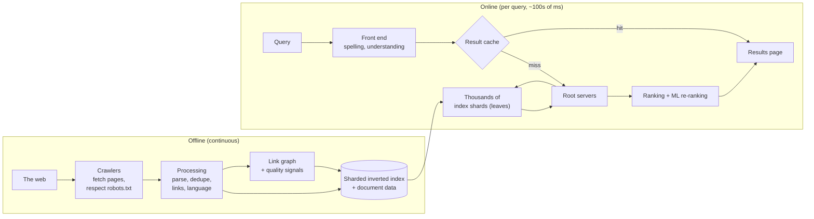
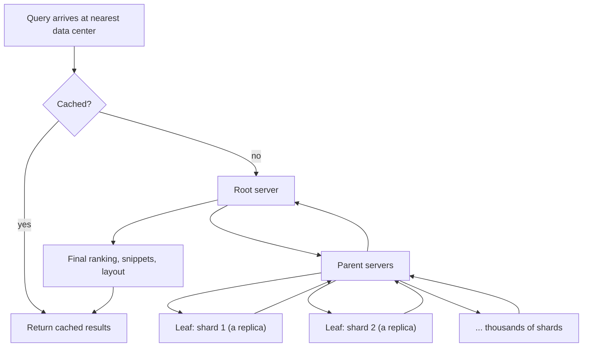

# How Google Search Works

*Crawl the web, build an index of hundreds of billions of pages, and answer billions of queries a day in a fraction of a second — by combining nearly every idea in this handbook.*

---

> *“Organize the world's information and make it universally accessible and useful.”*
>
> — **Google's mission statement**

## At a Glance

> **In one sentence:** Google Search continuously crawls the web, processes pages into a massive sharded inverted index, and answers each query by fanning it out across thousands of index servers, ranking candidates with hundreds of signals (from link analysis to machine-learned language models), and returning results in well under a second — with caching, replication, and tail-latency techniques making it fast and reliable.

**You'll learn**

- The three stages: crawling, indexing, and serving
- How the index is sharded and replicated across data centers
- How a query fans out and merges results, and how tail latency is controlled
- Ranking: from PageRank to machine-learned language understanding
- Freshness: keeping an index of the changing web up to date
- Lessons that apply to any large read-heavy system

**Before you start:** [Designing A Search System](../06-System-Design/Designing-A-Search-System.md) · [The Life of a Production Request](../11-Production-Engineering/The-Life-Of-A-Production-Request.md)

**Reading time:** about 10 minutes

---

## The Big Picture



*Heavy work happens offline so that each query only has to look up, score, and merge.*

---

## Introduction

Type a few words into Google and results appear before you finish reading your own query. Behind that moment: a crawl of a large fraction of the public web, an index Google describes as containing hundreds of billions of pages and well over 100 million gigabytes of data, and a serving system that sends each query to thousands of machines and merges their answers.

Google Search is the classic example of a **read-heavy, fan-out, latency-critical** system. Almost every concept in this handbook shows up: caching, sharding, replication, load balancing, tail latency, ranking, freshness, and reliability at planetary scale. This chapter walks through how it works, based on Google's own publications and public descriptions.

### Why Study It?

- Its architecture is the template for search inside countless products.
- It demonstrates how to split work between offline (batch) and online (serving) paths.
- Its published papers — PageRank, GFS, MapReduce, Bigtable, "Web Search for a Planet," "The Tail at Scale" — shaped modern distributed systems.

---

## Scale and Constraints

| Dimension | Public information |
|----------|-------------------|
| Index size | "Hundreds of billions of webpages," "well over 100,000,000 gigabytes" (Google's *How Search Works*) |
| Query volume | Billions of queries per day |
| Latency target | Results in a fraction of a second |
| Freshness | Popular and news pages updated within minutes |
| Availability | Expected to always work, worldwide |

Constraints drive the design: the index is far too large for one machine, queries must be fast, and the web changes constantly.

---

## Historical Background

- **1996 — BackRub.** Larry Page and Sergey Brin's Stanford research project used links between pages to judge importance.
- **1998 — Google founded;** the paper "The Anatomy of a Large-Scale Hypertextual Web Search Engine" described the original architecture and PageRank.
- **2003 — "Web Search for a Planet"** (Barroso, Dean, Hölzle) explained how Google served search from clusters of commodity machines with index shards and replicas.
- **2003–2006 — Infrastructure papers:** Google File System (2003), MapReduce (2004), Bigtable (2006) — built largely to support crawling and indexing at scale.
- **2010 — Caffeine** indexing system moved toward continuous, incremental indexing for fresher results.
- **2012 — Knowledge Graph** added understanding of entities (people, places, things).
- **2015 onward — Machine learning in ranking:** RankBrain (2015), then BERT applied to Search queries (2019) and later language models improved query and page understanding.
- **2024 — AI-generated overviews** began appearing for some queries, combining retrieval with generative models.

---

## Architecture Overview

### 1. Crawling

Crawlers (Googlebot) discover pages by following links and sitemaps, fetch them while respecting `robots.txt` and server load, and revisit pages based on how often they change and how important they are. Crawling is a massive scheduling problem: which of trillions of known URLs to fetch next, without overloading any site.

### 2. Indexing

Fetched pages are parsed, rendered (including JavaScript for many pages), deduplicated (many URLs show the same content), analyzed for language and content, and added to an **inverted index** mapping terms to documents. Link analysis builds the link graph used for signals such as PageRank.

The index is **sharded by document**: each shard holds the index for a subset of pages. Each shard is **replicated** many times for throughput and fault tolerance, and the whole index is replicated across data centers.

### 3. Serving



1. DNS and load balancing route the query to a nearby data center.
2. A **result cache** answers popular queries directly.
3. Otherwise, the query is analyzed (spelling, synonyms, intent) and sent down a **tree**: root → intermediate servers → leaf servers, each leaf searching one shard.
4. Each leaf returns its best local matches with scores; intermediate servers merge; the root produces the global top results.
5. Final ranking, snippets, and page layout are assembled.

### 4. Ranking

Ranking combines many signals: how well the text matches, the page's authority (links — the idea behind PageRank), freshness, location and language, page experience, and machine-learned models that understand the meaning of queries and pages. Google describes its ranking systems as using hundreds of signals.

---

## Deep Dives

### Deep Dive 1: Tail Latency in a Fan-Out Tree

A query touching thousands of leaves waits for the slowest. Techniques Google has described include:

- **Replication with hedged requests:** send to a second replica if the first is slow.
- **Partial results:** return good results even if a few shards are late.
- **Tiered indexes:** a smaller, high-quality tier answers most queries; larger tiers are consulted only when needed.
- **Caching** at multiple levels.

See [The Life of a Production Request](../11-Production-Engineering/The-Life-Of-A-Production-Request.md) for the math.

### Deep Dive 2: PageRank

PageRank models a "random surfer" who follows links and occasionally jumps to a random page. A page's rank is the probability of the surfer being there. Pages linked from many important pages rank higher. It's computed iteratively over the whole link graph — a classic large-scale batch computation. Today it's one of many signals, not the whole story.

### Deep Dive 3: Freshness

The web changes constantly. Early systems rebuilt the index in large batches; Caffeine (2010) moved to continuous incremental updates, so new and changed pages appear quickly. Crawl frequency adapts per page: news sites every few minutes, static pages rarely.

---

## What Can Go Wrong

- **Spam and manipulation:** link farms and keyword stuffing try to game ranking; ranking systems and spam detection evolve continuously.
- **Stale or duplicate content:** deduplication and canonicalization choose one version of a page.
- **Slow shards and failures:** replicas, hedging, and partial results keep queries fast.
- **Bad releases:** ranking changes are evaluated offline with human raters and online with live experiments before launch.

---

## Lessons for Engineers

1. **Move work offline** so the online path is simple and fast.
2. **Shard by document, replicate for throughput,** and design for tail latency.
3. **Cache aggressively** for skewed popularity.
4. **Combine many signals** and evaluate ranking changes rigorously.
5. **Build infrastructure when needed** — GFS, MapReduce, and Bigtable came from real search problems.

---

## Tradeoffs

| Choice | Benefit | Cost |
|-------|--------|-----|
| Document-sharded index | Even load, simple updates | Every query touches every shard (fan-out) |
| Many replicas | Throughput, fault tolerance | Storage and hardware cost |
| Partial results | Low latency under stragglers | Rarely missing a result |
| Continuous indexing | Freshness | More complex pipeline |
| ML ranking | Better understanding | Harder to explain, expensive to serve |

---

## Interview Questions

### Beginner

**Q1: What are the three main stages of a web search engine?**

*Model answer:* Crawling (discovering and fetching pages), indexing (processing pages into a searchable inverted index plus signals), and serving (answering queries by looking up the index, ranking results, and returning them).

### Intermediate

**Q2: How does Google return results quickly when the index is spread over thousands of machines?**

*Model answer:* The index is sharded and replicated; each query fans out in parallel through a tree of servers to one replica of each shard, which return local top results that are merged. Caching handles popular queries, and hedged requests and partial results limit tail latency.

### Senior

**Q3: What is PageRank, and why isn't it enough on its own today?**

*Model answer:* PageRank estimates a page's importance from the link graph — the probability a random surfer lands there. It's easily gamed by link schemes and says nothing about relevance to a particular query, freshness, or meaning, so modern ranking combines it with many other signals and machine-learned models.

### Architecture

**Q4: How would you apply Google's search architecture to a product search engine for a large marketplace?**

*Model answer:* Separate offline indexing (from the product database via change streams) and online serving; shard the index by document with replicas; fan out queries with deadlines and hedging; cache popular queries; rank with text relevance plus business signals (availability, popularity, conversion) and learned re-ranking; evaluate changes offline and via A/B tests.

---

## Hands-On Lab

Compute PageRank on a small web with power iteration. Pure Python; save as `pagerank_lab.py` and run it.

```python
links = {                     # page -> pages it links to
    "home":     ["about", "blog", "shop"],
    "about":    ["home"],
    "blog":     ["home", "post1", "post2"],
    "post1":    ["blog", "shop"],
    "post2":    ["blog", "post1"],
    "shop":     ["home"],
    "spam1":    ["spam2"],    # a small link farm
    "spam2":    ["spam1"],
}
pages = list(links)
N, d = len(pages), 0.85        # d = damping: probability the surfer follows a link
rank = {p: 1 / N for p in pages}

for _ in range(50):            # power iteration
    new = {p: (1 - d) / N for p in pages}
    for p, outs in links.items():
        for q in outs:
            new[q] += d * rank[p] / len(outs)
    rank = new

for p, r in sorted(rank.items(), key=lambda x: -x[1]):
    print(f"{p:6} {r:.3f} {'#' * int(r * 100)}")
```

**What to notice**
- `home` ranks highest: many pages link to it, including important ones.
- The link farm (`spam1` ↔ `spam2`) ranks surprisingly high — above real pages like `shop` — even though no real page links to it: the two pages keep passing rank back and forth. Pure link math is easy to game, which is why real ranking uses many other signals and spam detection.
- Try changing `"shop"` to link to `["home", "spam1"]`: a single link from a real page sends the farm to the top of the ranking. That's why link-based signals invite manipulation.

---

## Test Yourself

*Answer each question in your head or on paper first, then open the answer to check.*

<details markdown="1">
<summary><strong>1. Why is the index sharded by document?</strong></summary>

Each shard holds a subset of pages with its own inverted index, which spreads data and load evenly and makes updates simple; queries then fan out to all shards.

</details>

<details markdown="1">
<summary><strong>2. What problem did Caffeine (2010) address?</strong></summary>

Freshness — moving from large batch index rebuilds toward continuous, incremental indexing.

</details>

<details markdown="1">
<summary><strong>3. What does the PageRank damping factor represent?</strong></summary>

The probability that the random surfer follows a link rather than jumping to a random page (commonly 0.85).

</details>

<details markdown="1">
<summary><strong>4. Name two techniques for controlling tail latency in fan-out search.</strong></summary>

Any two of: hedged requests to replicas, partial results with deadlines, tiered indexes, caching.

</details>

<details markdown="1">
<summary><strong>5. Which Google infrastructure papers came largely from search needs?</strong></summary>

Google File System (2003), MapReduce (2004), and Bigtable (2006).

</details>

<details markdown="1">
<summary><strong>6. What is the role of the result cache?</strong></summary>

It answers repeated popular queries without touching the index, absorbing much of the load thanks to skewed query popularity.

</details>

---

## Cheat Sheet

**Pipeline:** crawl → process (parse, render, dedupe, links) → sharded inverted index + signals → serve (cache → root → leaves → merge → rank).

| Idea | Why |
|-----|----|
| Offline vs. online split | Keep queries fast |
| Document sharding + replicas | Scale data and throughput |
| Fan-out tree | Parallel search across shards |
| Hedging, partial results, tiers | Tail latency |
| Many ranking signals + ML | Relevance and spam resistance |
| Continuous indexing | Freshness |

**Timeline:** 1998 PageRank paper · 2003 "Web Search for a Planet," GFS · 2004 MapReduce · 2006 Bigtable · 2010 Caffeine · 2015 RankBrain · 2019 BERT in Search.

---

## In the AI Era

- **Search is the retrieval layer for AI.** Retrieval-augmented generation depends on exactly the crawling, indexing, and ranking ideas described here — see [Designing An AI Assistant Over Private Data](../06-System-Design/Designing-An-AI-Assistant-Over-Private-Data.md).
- **Generative answers on top of search** add new challenges: citing sources, handling uncertainty, cost per query, and evaluating answer quality, not just ranking.
- **Language models improved query understanding** long before chat interfaces — BERT-based models helped Search interpret natural-language queries.
- **Web content is now read by AI crawlers too,** raising questions about `robots.txt`, attribution, and how publishers are credited.

**Try it:** Sketch how you'd add an "AI answer" box to the architecture diagram: where does retrieval happen, where does generation happen, and what's the latency and cost budget?

---

## Key Takeaways

1. Search splits work into crawling, indexing (offline), and serving (online).
2. A sharded, replicated inverted index plus fan-out serving handles planetary scale.
3. Tail latency is controlled with hedging, partial results, tiers, and caching.
4. Ranking combines link analysis, relevance, freshness, and machine learning — evaluated rigorously.
5. Google's search needs drove foundational infrastructure (GFS, MapReduce, Bigtable).

---

## What to Read Next

- **[How YouTube Works](How-YouTube-Works.md)** — scaling uploads, processing, and video delivery
- **[Designing A Search System](../06-System-Design/Designing-A-Search-System.md)** — building search at product scale
- **[How A Large-Scale LLM Service Serves A Request](How-A-Large-Scale-LLM-Service-Serves-A-Request.md)** — another fan-out, latency-critical system

---

## Further Reading

- **Brin & Page — "The Anatomy of a Large-Scale Hypertextual Web Search Engine" (1998):** [http://infolab.stanford.edu/~backrub/google.html](http://infolab.stanford.edu/~backrub/google.html)
- **Barroso, Dean & Hölzle — "Web Search for a Planet: The Google Cluster Architecture" (IEEE Micro, 2003)**
- **Dean & Barroso — "The Tail at Scale" (CACM, 2013)**
- **Google — How Search Works:** [https://www.google.com/search/howsearchworks/](https://www.google.com/search/howsearchworks/)
- **Ghemawat et al. — "The Google File System" (2003); Dean & Ghemawat — "MapReduce" (2004); Chang et al. — "Bigtable" (2006)**

---

*This chapter is part of the Modern Software Engineering Handbook — a comprehensive guide to the concepts, principles, and practices that every professional software engineer should know.*
