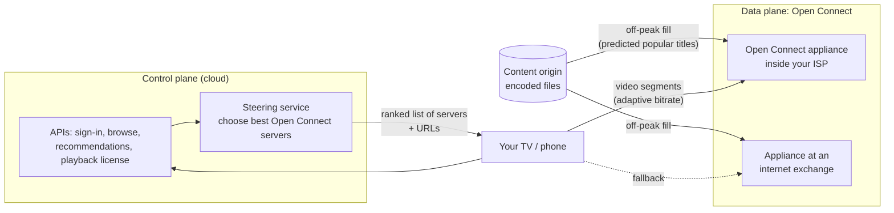

# How Netflix Streams Video

*Press play, and video starts in seconds from a server that is probably inside your own internet provider's network — because Netflix put it there the night before.*

---

> *“We're competing with sleep.”*
>
> — **Reed Hastings**, Netflix co-founder, 2017

## At a Glance

> **In one sentence:** Netflix splits streaming into a control plane running in the cloud (sign-in, browsing, recommendations, and deciding where to stream from) and a data plane called Open Connect — its own content delivery network of caching servers placed inside ISPs and exchange points, filled with the titles people are predicted to watch during quiet hours — while each title is encoded in many carefully optimized versions for adaptive streaming.

**You'll learn**

- The control plane / data plane split
- Open Connect: Netflix's own CDN inside ISP networks
- Proactive caching: filling caches off-peak with predicted-popular titles
- Steering: how a player picks which server to stream from
- Per-title and shot-based encoding for quality per bit
- How resilience practices (chaos engineering, multi-region) protect playback

**Before you start:** [How YouTube Works](How-YouTube-Works.md) · [How Netflix Builds Resilient Systems](../10-Reliability/How-Netflix-Builds-Resilient-Systems.md) · [How Caching Works](../05-Distributed-Systems/How-Caching-Works.md)

**Reading time:** about 10 minutes

---

## The Big Picture



*Everything before you press play runs in the cloud. The video bytes themselves usually travel only a short distance, from a box inside your ISP.*

---

## Introduction

Netflix streams to hundreds of millions of members around the world, and video traffic is enormous. Sending every stream across the internet from a few central data centers would be slow, expensive, and fragile. Buying capacity from third-party CDNs worked at first, but at Netflix's scale it made sense to build something purpose-built.

In 2012, Netflix announced **Open Connect**, its own content delivery network. Its key idea: put Netflix's caching servers directly inside internet service providers' networks (and at internet exchange points), and fill them overnight with the shows and movies people in that area are likely to watch the next day. When you press play, the video typically comes from a server just a few network hops away.

Meanwhile, everything else — browsing, recommendations, account management, deciding which server should stream to you — runs in the cloud (Netflix completed its migration of these services to AWS in 2016).

### Why Study It?

- It's a clear example of separating a control plane from a data plane.
- It shows proactive, prediction-driven caching instead of purely reactive caching.
- It demonstrates how encoding innovation reduces bandwidth for everyone.

---

## Scale and Constraints

| Constraint | Implication |
|-----------|-------------|
| Very high bandwidth, concentrated in evening hours | Serve from as close to viewers as possible |
| Predictable popularity (new releases, trending shows) | Pre-position content before demand |
| Many device types and network qualities | Many encodings; adaptive streaming |
| Global audience | Region-specific catalogs and caching |
| High expectations | Fast start, no rebuffering, high picture quality |

---

## Historical Background

- **2007 — Streaming launched** alongside the DVD-by-mail business.
- **2008 — Database corruption incident** prompted the move toward the cloud (see [How Netflix Builds Resilient Systems](../10-Reliability/How-Netflix-Builds-Resilient-Systems.md)).
- **2012 — Open Connect announced,** offering ISPs free caching appliances and settlement-free peering.
- **2015 — Per-title encoding:** Netflix described optimizing encoding settings for each title rather than using one fixed "bitrate ladder."
- **2016 — Cloud migration completed** for Netflix's streaming services; Netflix expanded to most countries worldwide.
- **2018 — Shot-based "dynamic optimizer" encoding** further improved quality per bit by optimizing individual shots.
- **Later — Newer codecs** (such as AV1) adopted on supported devices to reduce bandwidth further.

---

## Architecture Overview

### Control Plane (Cloud)

Hundreds of microservices handle sign-in, profiles, browsing, search, personalized recommendations, artwork selection, billing, and playback authorization. When you press play, the playback service checks your account and device, issues licenses for protected content, and asks the **steering** service which Open Connect servers should serve you.

### Data Plane (Open Connect)

- **Open Connect Appliances (OCAs)** are servers with large storage and network capacity, deployed inside ISP networks and at internet exchange points.
- ISPs host embedded appliances; Netflix provides and manages them.
- OCAs serve video segments over HTTPS directly to devices.

### Proactive Caching ("Fill")

Netflix predicts what each location's members will watch and **fills** appliances during off-peak hours (for example, overnight), when network capacity is spare. When evening demand arrives, popular content is already local. Appliances can also fetch from each other or from larger upstream appliances rather than from origin.

### Steering

The client receives a ranked list of appliances based on content availability, network proximity, health, and load. If the first choice is slow or fails, the client switches to another — resilience built into the player.

### Encoding

Each title is encoded into many versions (resolutions, bitrates, codecs). Rather than one fixed ladder for all content, Netflix optimizes per title and even per shot: a simple animated show needs far fewer bits for good quality than a grainy action film. Adaptive bitrate streaming in the player picks among these versions as network conditions change.

---

## Deep Dives

### Deep Dive 1: Why Build Your Own CDN?

At very large, predictable scale, a purpose-built CDN can be cheaper and better:

- Content is known in advance and changes on a schedule — ideal for pre-positioning.
- Embedding in ISPs cuts transit costs for both Netflix and ISPs.
- Netflix controls hardware and software tuned specifically for streaming large files.

For most companies, commercial CDNs remain the right choice; Netflix's scale and workload make the difference.

### Deep Dive 2: Control Plane vs. Data Plane

Separating them lets each scale and fail independently:

- The control plane is complex and changes often; it runs on elastic cloud infrastructure.
- The data plane is simple, high-bandwidth, and distributed; it runs on specialized appliances.
- A control-plane problem may affect browsing, while playback already in progress continues from appliances.

### Deep Dive 3: Quality per Bit

Better encoding reduces bandwidth for everyone — cheaper delivery for Netflix, less congestion for ISPs, and better quality on slow connections for viewers. Per-title and shot-based optimization are examples of spending more compute once (at encoding time) to save bandwidth on every view.

---

## What Can Go Wrong

- **Cache misses for unexpected hits** → appliances fetch from peers and upstream tiers; prediction improves over time.
- **Appliance failures** → steering sends clients elsewhere; players switch servers mid-stream.
- **Cloud region outages** → multi-region control plane with traffic evacuation (Netflix practices region failover).
- **Network congestion** → adaptive bitrate lowers quality to avoid stalls.

---

## Lessons for Engineers

1. **Separate control plane and data plane** — different workloads deserve different architectures.
2. **Predict and pre-position** when demand is forecastable.
3. **Put data close to users** — partnerships can be part of architecture.
4. **Spend compute once to save bandwidth many times.**
5. **Build failover into clients**, not just servers.

---

## Tradeoffs

| Choice | Benefit | Cost |
|-------|--------|-----|
| Own CDN (Open Connect) | Control, cost at scale, ISP proximity | Hardware, deployment, partnerships to manage |
| Proactive fill | Hits during peak, off-peak bandwidth use | Needs good predictions; storage |
| Per-title/shot encoding | Better quality per bit | Heavier encoding compute |
| Cloud control plane | Elasticity, fast iteration | Dependence on cloud provider regions |
| Client-side steering | Fast failover | More complex clients |

---

## Interview Questions

### Beginner

**Q1: What is Open Connect?**

*Model answer:* Netflix's own content delivery network: caching appliances placed inside ISP networks and at internet exchange points that serve video directly to nearby members.

### Intermediate

**Q2: Why does Netflix fill caches during off-peak hours?**

*Model answer:* Viewing demand peaks in the evening. Filling appliances overnight with titles predicted to be popular uses spare network capacity and ensures most evening requests are served locally, reducing latency and backbone traffic.

### Senior

**Q3: What does separating the control plane from the data plane buy Netflix?**

*Model answer:* Independent scaling and failure domains: the complex, frequently changing control plane runs elastically in the cloud; the simple, bandwidth-heavy data plane runs on distributed appliances near users. Problems in one don't necessarily stop the other — for example, streams in progress continue during some control-plane issues.

### Architecture

**Q4: When would you recommend a company build its own CDN?**

*Model answer:* Rarely — only at very large scale with a specialized, predictable workload (like large video files with forecastable demand), where cost savings and control justify hardware, operations, and ISP partnerships. Most companies should use commercial CDNs and invest in caching strategy instead.

---

## Hands-On Lab

Compare reactive (LRU) caching with Netflix-style proactive fill for a skewed, predictable catalog. Pure Python; save as `open_connect_lab.py` and run it.

```python
import random
from collections import OrderedDict
random.seed(7)

CATALOG, CAPACITY, REQUESTS = 5_000, 400, 100_000
ZIPF = [1 / (rank + 1) ** 0.9 for rank in range(CATALOG)]      # share of views by popularity rank

def ranking(day):
    """Which title holds each popularity rank on a given day: mostly stable,
    but the top 50 reshuffle and 20 new releases jump into the top 100."""
    rng = random.Random(day)
    order = list(range(CATALOG))
    top = order[:50]; rng.shuffle(top); order[:50] = top
    for new_title in rng.sample(range(1000, CATALOG), 20):
        order.remove(new_title); order.insert(rng.randrange(100), new_title)
    return order

yesterday, today = ranking(1), ranking(2)
evening = random.choices(today, weights=ZIPF, k=REQUESTS)       # tonight's actual views

# Reactive: an LRU cache fills itself as requests arrive (misses go to origin during peak)
lru, hits = OrderedDict(), 0
for t in evening:
    if t in lru:
        hits += 1; lru.move_to_end(t)
    else:
        lru[t] = True
        if len(lru) > CAPACITY: lru.popitem(last=False)
print(f"reactive LRU:             {hits / REQUESTS:6.1%} served locally, "
      f"{REQUESTS - hits:6} origin fetches during peak")

# Proactive: fill overnight using YESTERDAY's popularity (plus a noisy forecast of new releases)
filled = set(yesterday[:CAPACITY])
hits = sum(t in filled for t in evening)
print(f"proactive overnight fill: {hits / REQUESTS:6.1%} served locally, "
      f"{REQUESTS - hits:6} origin fetches during peak (fill moved to off-peak)")
```

**What to notice**
- Both approaches serve a large share of traffic from a cache holding only 8% of the catalog, because popularity is skewed — caching works.
- Proactive fill avoids the "first request is a miss" problem during peak hours and moves fill traffic to quiet overnight hours, when the network is idle.
- The fill used only *yesterday's* popularity — an imperfect forecast that misses tonight's surprise hits — yet it still beats reactive caching. Try `CAPACITY = 100` and `CAPACITY = 1000` to see how appliance storage changes the picture.

---

## Test Yourself

*Answer each question in your head or on paper first, then open the answer to check.*

<details markdown="1">
<summary><strong>1. What runs in Netflix's control plane?</strong></summary>

Sign-in, browsing, search, recommendations, billing, playback authorization, and steering — the services that run before and around video delivery, hosted in the cloud.

</details>

<details markdown="1">
<summary><strong>2. Where are Open Connect appliances located?</strong></summary>

Inside ISP networks and at internet exchange points, close to viewers.

</details>

<details markdown="1">
<summary><strong>3. What does steering do?</strong></summary>

Chooses a ranked list of appliances for each playback based on content availability, proximity, health, and load, so the client can stream from the best one and fail over if needed.

</details>

<details markdown="1">
<summary><strong>4. What is per-title encoding?</strong></summary>

Choosing encoding settings (the bitrate ladder) for each title based on its content complexity, rather than one fixed set for everything.

</details>

<details markdown="1">
<summary><strong>5. Why fill caches off-peak?</strong></summary>

To use spare overnight network capacity and have predicted-popular content already local when evening demand peaks.

</details>

<details markdown="1">
<summary><strong>6. When was Open Connect announced?</strong></summary>

2012.

</details>

---

## Cheat Sheet

| Layer | What | Where |
|------|-----|------|
| Control plane | Accounts, browsing, recommendations, licenses, steering | Cloud (multi-region) |
| Data plane | Video segments | Open Connect appliances in ISPs and IXPs |
| Fill | Pre-position predicted-popular titles | Off-peak hours |
| Encoding | Per-title and shot-based optimization; many renditions | Once per title |
| Playback | Adaptive bitrate; client-side failover between appliances | On device |

**Lessons:** split control/data planes · predict and pre-position · serve near users · compute once to save bandwidth · failover in the client.

---

## In the AI Era

- **Prediction powers the delivery network:** forecasting what each region will watch decides what gets cached — a practical example of machine learning in infrastructure.
- **Recommendations and artwork personalization** have long been machine-learning systems at Netflix; they run in the control plane and degrade gracefully (for example, to popular titles) if unavailable.
- **AI-driven encoding** — using learned models to predict perceptual quality (Netflix created the VMAF quality metric) — spends compute to save bandwidth, the same trade-off as per-title encoding.

**Try it:** In the lab, fill the appliance with no forecast at all — `filled = set(random.sample(range(CATALOG), CAPACITY))`. How far does the local hit rate fall? That gap is the value of good forecasting.

---

## Key Takeaways

1. Netflix separates a cloud control plane from a specialized data plane.
2. Open Connect places caching appliances inside ISPs and exchange points.
3. Proactive, prediction-based fill moves traffic off-peak and keeps peak requests local.
4. Steering and client-side failover keep playback resilient.
5. Per-title and shot-based encoding improve quality per bit for every viewer.

---

## What to Read Next

- **[How A Large-Scale LLM Service Serves A Request](How-A-Large-Scale-LLM-Service-Serves-A-Request.md)** — a new kind of heavy data plane
- **[How Netflix Builds Resilient Systems](../10-Reliability/How-Netflix-Builds-Resilient-Systems.md)** — chaos engineering and resilience patterns
- **[How The Internet Really Works](../03-How-The-Internet-Works/How-The-Internet-Really-Works.md)** — ISPs, exchange points, and peering

---

## Further Reading

- **Netflix Open Connect:** [https://openconnect.netflix.com](https://openconnect.netflix.com)
- **Netflix Technology Blog — "Per-Title Encode Optimization" (2015) and "Dynamic optimizer — a perceptual video encoding optimization framework" (2018):** [https://netflixtechblog.com](https://netflixtechblog.com)
- **Netflix — "Completing the Netflix Cloud Migration" (2016)**
- **VMAF — Video Multi-Method Assessment Fusion:** [https://github.com/Netflix/vmaf](https://github.com/Netflix/vmaf)

---

*This chapter is part of the Modern Software Engineering Handbook — a comprehensive guide to the concepts, principles, and practices that every professional software engineer should know.*
